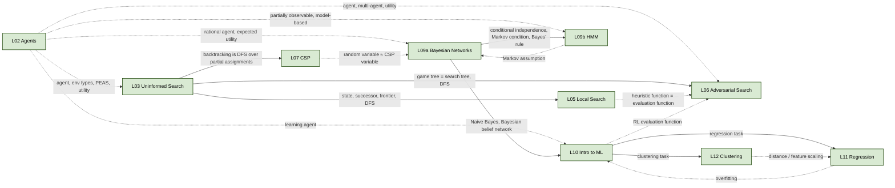

# AI Exam Prep — Master Study Index

> **Reading time (this page):** ~10 min as orientation; the [Analogies Index](#4-analogies-index) and [Pitfalls Compendium](#8-common-pitfalls-compendium) are the night-before-the-exam quick scans.
> **Scope:** 10 lecture chapters + 11 lab solutions + shared glossary + cross-reference graph.
> **How this index is organised:** §1 orientation, §2 study order, §3 full TOC, §4 analogies (this is the most valuable section — start here when reviewing), §5 flattened glossary, §6 cross-reference graph, §7 lab reference table, §8 pitfalls compendium.

---

## 1. What this package is and how to use it

This is a self-contained study package for the *Introduction to Artificial Intelligence* course. For each of the 10 lecture topics the package contains:

- **A chapter `.md`** in `lectures/` with eight sections — Overview, Big-Picture Analogies, Core Concepts, Algorithms/Methods, Worked Examples, Common Pitfalls / Exam Traps, Connections to Other Lectures, and a Cheat-Sheet Summary. Each chapter renders to a printable `.pdf` of the same name.
- **A corresponding lab** with a working `*_solution.py` (or `.ipynb`) sitting alongside the original handout template, plus a `variants.md` of exam-style variant prompts under `_exam/{LabName}/`.

Three usage modes the package is designed for:

1. **Studying a topic from scratch.** Open the chapter `.md`. Read §1, §2 (analogies first — they give you the mental model), then §3/§4 for rigour, §5 for worked numbers. Skim §6 last.
2. **Reviewing for the exam.** Open this index. Scan §4 Analogies, then §8 Pitfalls. Drill any concept whose analogy doesn't ring a bell by jumping to its lecture §3 entry.
3. **Practising labs.** Open the relevant lab template, attempt it, then diff against `*_solution.py`. Read the lab's `variants.md` for exam-style perturbations.

All math uses LaTeX delimiters (rendered to KaTeX on PDF). All links are relative paths from `study/`.

---

## 2. Recommended Study Order

The lecture sequence below matches the course flow. Reading times are estimates for first-pass study; expect to halve them on review passes.

| # | Chapter | First-pass time | What you walk away knowing |
|---|---|---|---|
| 1 | [L02 — Agents](lectures/L02-Agents.md) | 60–75 min | Agent / environment / PEAS / 6 environment dimensions / 5 agent architectures. *Vocabulary for every later lecture.* |
| 2 | [L03 — Uninformed Search](lectures/L03-Uninformed-Search.md) | 45–60 min | BFS, DFS, UCS, IDS; the search-tree mechanism (frontier, expansion, completeness, optimality). |
| 3 | [L05 — Local Search](lectures/L05-Local-Search.md) | 60–75 min | Hill climbing, simulated annealing, genetic algorithms; objective function vs heuristic. |
| 4 | [L06 — Adversarial Search](lectures/L06-Adversarial-Search.md) | 45–60 min | Game tree, minimax, alpha-beta pruning, evaluation functions. |
| 5 | [L07 — CSP](lectures/L07-CSP.md) | 60 min | Variables/domains/constraints; backtracking + MRV/degree/LCV + forward checking + arc consistency. |
| 6 | [L09a — Bayesian Networks](lectures/L09a-Bayesian-Networks.md) | 75–90 min | Random variables, joint/marginal/conditional, Bayes' rule, BN structure, Markov condition, inference by enumeration, Naive Bayes. |
| 7 | [L09b — HMM](lectures/L09b-HMM.md) | 60–75 min | Markov chains, HMM $\lambda = (A, B, \pi)$, three problems (Evaluation/Decoding/Learning), forward and Viterbi recursions. |
| 8 | [L10 — Intro to ML](lectures/L10-Intro-to-ML.md) | 60 min | Supervised/unsupervised/RL split; decision trees, Gini/entropy/info-gain, overfitting and pruning. |
| 9 | [L11 — Regression](lectures/L11-Regression.md) | 60–75 min | Linear regression, OLS, residuals, SST/SSE/SSR, $R^2$, p-values, dummy variables, interaction terms, multicollinearity. |
| 10 | [L12 — Clustering](lectures/L12-Clustering.md) | 45–60 min | K-means, hierarchical (5 linkages), DBSCAN; centroid, dendrogram. |

**Total first-pass time:** ~10–13 hours of reading. Add ~1 hour per lab if you also re-implement them.

### "If you only have one day"

Read in this priority order — stop when the clock runs out:

1. §4 [Analogies Index](#4-analogies-index) below (1 h) — install the mental models.
2. §8 [Common Pitfalls Compendium](#8-common-pitfalls-compendium) (1 h) — pre-immunise against the exam traps.
3. The Cheat-Sheet Summary (§8) of each lecture, in study order (2 h).
4. §5 [Glossary](#5-glossary-flattened) — skim, focus on terms you can't define from memory (1 h).
5. The pitfalls section (§6) of any lecture whose mental model still feels shaky (1–2 h).

### "If you have a week"

| Day | Plan |
|---|---|
| 1 | L02 + L03 chapters, work Lab 1 (Agents) and Lab 2 (Search). |
| 2 | L05 chapter, work Lab 4 (GA). |
| 3 | L06 + L07 chapters, work Lab 5 (Alpha-Beta) and Lab 6 (CSP). |
| 4 | L09a + L09b chapters, work Lab 7 (BN) and Lab 8 (HMM). |
| 5 | L10 + ML Lab 1 (Classification). |
| 6 | L11 + ML Lab 2 (Regression); L12 + ML Lab 3 (Clustering). |
| 7 | Re-read §4 Analogies + §8 Pitfalls below; revisit every chapter's Cheat-Sheet Summary; attempt variant prompts in `_exam/*/variants.md`. |

### "If you have a month"

Add a second pass per chapter — read §5 Worked Examples in detail and re-derive every result with pencil and paper. Then attempt each `variants.md` cold (no solution open) and self-mark.

---

## 3. Full Table of Contents

Every lecture, every major heading, every named concept. Click to jump.

### [L02 — Introduction to Agents](lectures/L02-Agents.md)

- [1. Overview & Motivation](lectures/L02-Agents.md#1-overview--motivation)
- [2. The Big Picture — Analogies](lectures/L02-Agents.md#2-the-big-picture--analogies)
- [3. Core Concepts](lectures/L02-Agents.md#3-core-concepts)
  - [3.1 Agent and environment](lectures/L02-Agents.md#31-agent-and-environment)
  - [3.2 Percept, percept sequence, agent function, agent program](lectures/L02-Agents.md#32-percept-percept-sequence-agent-function-agent-program)
  - [3.3 Rationality and performance measure](lectures/L02-Agents.md#33-rationality-and-performance-measure)
  - [3.4 Autonomy](lectures/L02-Agents.md#34-autonomy)
  - [3.5 PEAS](lectures/L02-Agents.md#35-peas--the-four-part-task-environment-specification)
  - [3.6 Environment types (the six-dimensional taxonomy)](lectures/L02-Agents.md#36-environment-types-the-six-dimensional-taxonomy)
  - [3.7 Hierarchy of agent types](lectures/L02-Agents.md#37-hierarchy-of-agent-types)
- [4. Algorithms / Methods](lectures/L02-Agents.md#4-algorithms--methods)
  - [4.1 Table-driven agents](lectures/L02-Agents.md#41-table-driven-agents)
  - [4.2 Simple reflex agent](lectures/L02-Agents.md#42-simple-reflex-agent-slide-25-row-2)
  - [4.3 Model-based reflex agent](lectures/L02-Agents.md#43-model-based-reflex-agent-slide-25-row-3--agents-with-memory)
  - [4.4 Goal-based agent](lectures/L02-Agents.md#44-goal-based-agent-slide-25-row-4--agents-with-goals)
  - [4.5 Utility-based agent](lectures/L02-Agents.md#45-utility-based-agent-slide-25-row-5)
  - [4.6 Learning / autonomous agent](lectures/L02-Agents.md#46-learning--autonomous-agent-slide-33-title--learningautonomous-agent)
- [5. Worked Examples](lectures/L02-Agents.md#5-worked-examples)
- [6. Common Pitfalls / Exam Traps](lectures/L02-Agents.md#6-common-pitfalls--exam-traps)
- [7. Connections to Other Lectures](lectures/L02-Agents.md#7-connections-to-other-lectures)
- [8. Cheat-Sheet Summary](lectures/L02-Agents.md#8-cheat-sheet-summary)

### [L03 — Uninformed Search](lectures/L03-Uninformed-Search.md)

- [1. Overview & Motivation](lectures/L03-Uninformed-Search.md#1-overview--motivation)
- [2. The Big Picture — Analogies](lectures/L03-Uninformed-Search.md#2-the-big-picture--analogies)
- [3. Core Concepts](lectures/L03-Uninformed-Search.md#3-core-concepts)
  - [3.1 Problem-solving agent](lectures/L03-Uninformed-Search.md#31-problem-solving-agent)
  - [3.2 Search problem definition](lectures/L03-Uninformed-Search.md#32-search-problem-definition)
  - [3.3 State, node, state space](lectures/L03-Uninformed-Search.md#33-state-node-state-space)
  - [3.4 Search tree, frontier, node expansion](lectures/L03-Uninformed-Search.md#34-search-tree-frontier-node-expansion)
  - [3.5 Branching factor, depth, max depth](lectures/L03-Uninformed-Search.md#35-branching-factor-depth-max-depth)
  - [3.6 Search-strategy evaluation dimensions](lectures/L03-Uninformed-Search.md#36-search-strategy-evaluation-dimensions)
  - [3.7 Uninformed vs informed search](lectures/L03-Uninformed-Search.md#37-uninformed-vs-informed-search)
  - [3.8 A\* (forward reference only)](lectures/L03-Uninformed-Search.md#38-a-forward-reference-only)
- [4. Algorithms / Methods](lectures/L03-Uninformed-Search.md#4-algorithms--methods)
  - [4.1 Breadth-first search (BFS)](lectures/L03-Uninformed-Search.md#41-breadth-first-search-bfs)
  - [4.2 Uniform-cost search (UCS)](lectures/L03-Uninformed-Search.md#42-uniform-cost-search-ucs)
  - [4.3 Depth-first search (DFS)](lectures/L03-Uninformed-Search.md#43-depth-first-search-dfs)
  - [4.4 Iterative deepening search (IDS)](lectures/L03-Uninformed-Search.md#44-iterative-deepening-search-ids)
  - [4.5 Side-by-side comparison](lectures/L03-Uninformed-Search.md#45-side-by-side-comparison)
- [5. Worked Examples](lectures/L03-Uninformed-Search.md#5-worked-examples)
- [6. Common Pitfalls / Exam Traps](lectures/L03-Uninformed-Search.md#6-common-pitfalls--exam-traps)
- [7. Connections to Other Lectures](lectures/L03-Uninformed-Search.md#7-connections-to-other-lectures)
- [8. Cheat-Sheet Summary](lectures/L03-Uninformed-Search.md#8-cheat-sheet-summary)

### [L05 — Local Search](lectures/L05-Local-Search.md)

- [1. Overview & Motivation](lectures/L05-Local-Search.md#1-overview--motivation)
- [2. The Big Picture — Analogies](lectures/L05-Local-Search.md#2-the-big-picture--analogies)
- [3. Core Concepts](lectures/L05-Local-Search.md#3-core-concepts)
  - [3.1 Objective function](lectures/L05-Local-Search.md#31-objective-function)
  - [3.2 State-space landscape](lectures/L05-Local-Search.md#32-state-space-landscape-visualisation)
  - [3.3 Hill climbing (greedy local search)](lectures/L05-Local-Search.md#33-hill-climbing-greedy-local-search)
  - [3.4 Variants — escaping local maxima](lectures/L05-Local-Search.md#34-variants--escaping-local-maxima)
  - [3.5 Simulated annealing](lectures/L05-Local-Search.md#35-simulated-annealing)
  - [3.6 Population-based search and genetic algorithms](lectures/L05-Local-Search.md#36-population-based-search-and-genetic-algorithms)
  - [3.7 Fitness landscapes](lectures/L05-Local-Search.md#37-fitness-landscapes-a-unifying-picture)
- [4. Algorithms / Methods](lectures/L05-Local-Search.md#4-algorithms--methods)
  - [4.1 Hill climbing](lectures/L05-Local-Search.md#41-hill-climbing-slide-13--verbatim)
  - [4.2 Simulated annealing](lectures/L05-Local-Search.md#42-simulated-annealing-slide-17)
  - [4.3 Genetic algorithm](lectures/L05-Local-Search.md#43-genetic-algorithm-slides-45-48)
  - [4.4 Comparison table](lectures/L05-Local-Search.md#44-comparison-table)
- [5. Worked Examples](lectures/L05-Local-Search.md#5-worked-examples)
- [6. Common Pitfalls / Exam Traps](lectures/L05-Local-Search.md#6-common-pitfalls--exam-traps)
- [7. Connections to Other Lectures](lectures/L05-Local-Search.md#7-connections-to-other-lectures)
- [8. Cheat-Sheet Summary](lectures/L05-Local-Search.md#8-cheat-sheet-summary)

### [L06 — Adversarial Search](lectures/L06-Adversarial-Search.md)

- [1. Overview & Motivation](lectures/L06-Adversarial-Search.md#1-overview--motivation)
- [2. The Big Picture — Analogies](lectures/L06-Adversarial-Search.md#2-the-big-picture--analogies)
- [3. Core Concepts](lectures/L06-Adversarial-Search.md#3-core-concepts)
  - [3.1 Games as a multi-agent task environment](lectures/L06-Adversarial-Search.md#31-games-as-a-multi-agent-task-environment)
  - [3.2 Game tree, MAX, MIN, terminal states](lectures/L06-Adversarial-Search.md#32-game-tree-max-min-terminal-states)
  - [3.3 Minimax value of a state](lectures/L06-Adversarial-Search.md#33-minimax-value-of-a-state)
  - [3.4 Evaluation function](lectures/L06-Adversarial-Search.md#34-evaluation-function)
  - [3.5 Zero-sum and the MAX / MIN labelling](lectures/L06-Adversarial-Search.md#35-zero-sum-and-the-max--min-labelling)
- [4. Algorithms / Methods](lectures/L06-Adversarial-Search.md#4-algorithms--methods)
  - [4.1 The Minimax algorithm](lectures/L06-Adversarial-Search.md#41-the-minimax-algorithm)
  - [4.2 Alpha-beta pruning](lectures/L06-Adversarial-Search.md#42-alpha-beta-pruning--the-algorithm)
  - [4.3 Properties of alpha-beta](lectures/L06-Adversarial-Search.md#43-properties-of-alpha-beta)
  - [4.4 Comparison table](lectures/L06-Adversarial-Search.md#44-comparison-table)
  - [4.5 Additional techniques](lectures/L06-Adversarial-Search.md#45-additional-techniques-briefly)
  - [4.6 Games of chance — expectiminimax](lectures/L06-Adversarial-Search.md#46-games-of-chance--expectiminimax-preview)
- [5. Worked Examples](lectures/L06-Adversarial-Search.md#5-worked-examples)
- [6. Common Pitfalls / Exam Traps](lectures/L06-Adversarial-Search.md#6-common-pitfalls--exam-traps)
- [7. Connections to Other Lectures](lectures/L06-Adversarial-Search.md#7-connections-to-other-lectures)
- [8. Cheat-Sheet Summary](lectures/L06-Adversarial-Search.md#8-cheat-sheet-summary)

### [L07 — Constraint Satisfaction Problems](lectures/L07-CSP.md)

- [1. Overview & Motivation](lectures/L07-CSP.md#1-overview--motivation)
- [2. The Big Picture — Analogies](lectures/L07-CSP.md#2-the-big-picture--analogies)
- [3. Core Concepts](lectures/L07-CSP.md#3-core-concepts)
  - [3.1 Variable, Domain, Constraint](lectures/L07-CSP.md#31-variable-domain-constraint)
  - [3.2 CSP as a Search Problem](lectures/L07-CSP.md#32-csp-as-a-search-problem-formal-cast)
  - [3.3 Constraint graph](lectures/L07-CSP.md#33-constraint-graph)
  - [3.4 Example domains](lectures/L07-CSP.md#34-example-domains-in-increasing-order-of-constraint-complexity)
  - [3.5 Why naive search is bad here](lectures/L07-CSP.md#35-why-naive-search-is-bad-here--the-size-of-the-search-tree)
- [4. Algorithms / Methods](lectures/L07-CSP.md#4-algorithms--methods)
  - [4.1 Backtracking search](lectures/L07-CSP.md#41-backtracking-search)
  - [4.4 MRV and degree heuristic](lectures/L07-CSP.md#44-variable-ordering--minimum-remaining-values-mrv-and-degree-heuristic)
  - [4.5 LCV value ordering](lectures/L07-CSP.md#45-value-ordering--least-constraining-value-lcv)
  - [4.6 Forward checking](lectures/L07-CSP.md#46-forward-checking)
  - [4.8 Arc consistency / AC-3](lectures/L07-CSP.md#48-arc-consistency--the-limit-of-forward-checking-and-how-to-beat-it)
- [5. Worked Examples](lectures/L07-CSP.md#5-worked-examples)
- [6. Common Pitfalls / Exam Traps](lectures/L07-CSP.md#6-common-pitfalls--exam-traps)
- [7. Connections to Other Lectures](lectures/L07-CSP.md#7-connections-to-other-lectures)
- [8. Cheat-Sheet Summary](lectures/L07-CSP.md#8-cheat-sheet-summary)

### [L09a — Bayesian Networks](lectures/L09a-Bayesian-Networks.md)

- [1. Overview & Motivation](lectures/L09a-Bayesian-Networks.md#1-overview--motivation)
- [2. The Big Picture — Analogies](lectures/L09a-Bayesian-Networks.md#2-the-big-picture--analogies)
- [3. Core Concepts](lectures/L09a-Bayesian-Networks.md#3-core-concepts)
  - [3.1 Random variables and events](lectures/L09a-Bayesian-Networks.md#31-random-variables-and-events)
  - [3.2 Atomic events, joint distribution, marginal](lectures/L09a-Bayesian-Networks.md#32-atomic-events-joint-distribution-marginal)
  - [3.3 Conditional probability, Bayes' rule, normalisation](lectures/L09a-Bayesian-Networks.md#33-conditional-probability-bayes-rule-normalisation)
  - [3.5 Independence](lectures/L09a-Bayesian-Networks.md#35-independence)
  - [3.6 Conditional independence](lectures/L09a-Bayesian-Networks.md#36-conditional-independence)
  - [3.7 Bayesian network — definition](lectures/L09a-Bayesian-Networks.md#37-bayesian-network--definition)
  - [3.8 Conditional probability table (CPT)](lectures/L09a-Bayesian-Networks.md#38-conditional-probability-table-cpt)
  - [3.9 The Markov condition](lectures/L09a-Bayesian-Networks.md#39-the-markov-condition-special-case-of-d-separation)
  - [3.10 The joint distribution from a Bayesian network](lectures/L09a-Bayesian-Networks.md#310-the-joint-distribution-from-a-bayesian-network)
  - [3.11 Naive Bayes classifier](lectures/L09a-Bayesian-Networks.md#311-naive-bayes-classifier)
  - [3.13 Inference by enumeration](lectures/L09a-Bayesian-Networks.md#313-inference-by-enumeration-exact-inference)
  - [3.14 Uncertainty, prior, posterior, evidence](lectures/L09a-Bayesian-Networks.md#314-uncertainty-prior-posterior-evidence--vocabulary-review)
- [4. Algorithms / Methods](lectures/L09a-Bayesian-Networks.md#4-algorithms--methods)
- [5. Worked Examples](lectures/L09a-Bayesian-Networks.md#5-worked-examples)
- [6. Common Pitfalls / Exam Traps](lectures/L09a-Bayesian-Networks.md#6-common-pitfalls--exam-traps)
- [7. Connections to Other Lectures](lectures/L09a-Bayesian-Networks.md#7-connections-to-other-lectures)
- [8. Cheat-Sheet Summary](lectures/L09a-Bayesian-Networks.md#8-cheat-sheet-summary)

### [L09b — Hidden Markov Models](lectures/L09b-HMM.md)

- [1. Overview & Motivation](lectures/L09b-HMM.md#1-overview--motivation)
- [2. The Big Picture — Analogies](lectures/L09b-HMM.md#2-the-big-picture--analogies)
- [3. Core Concepts](lectures/L09b-HMM.md#3-core-concepts)
  - [3.1 The HMM picture](lectures/L09b-HMM.md#31-the-hmm-picture)
  - [3.2 Markov chains — the observable foundation](lectures/L09b-HMM.md#32-markov-chains--the-observable-foundation)
  - [3.3 Hidden states and observations — the HMM upgrade](lectures/L09b-HMM.md#33-hidden-states-and-observations--the-hmm-upgrade)
  - [3.4 The Fair Bet Casino](lectures/L09b-HMM.md#34-the-fair-bet-casino--concrete-hmm-walkthrough)
  - [3.5 The three basic problems](lectures/L09b-HMM.md#35-the-three-basic-problems-of-hmms)
- [4. Algorithms / Methods](lectures/L09b-HMM.md#4-algorithms--methods)
  - [4.1 The naive approach (and why it fails)](lectures/L09b-HMM.md#41-the-naive-approach-and-why-it-fails)
  - [4.2 The forward algorithm](lectures/L09b-HMM.md#42-the-forward-algorithm--problem-1-evaluation--filtering)
  - [4.3 The Viterbi algorithm](lectures/L09b-HMM.md#43-the-viterbi-algorithm--problem-2-decoding--most-likely-state-sequence)
  - [4.4 Forward vs Viterbi](lectures/L09b-HMM.md#44-side-by-side-comparison-forward-vs-viterbi)
- [5. Worked Examples](lectures/L09b-HMM.md#5-worked-examples)
- [6. Common Pitfalls / Exam Traps](lectures/L09b-HMM.md#6-common-pitfalls--exam-traps)
- [7. Connections to Other Lectures](lectures/L09b-HMM.md#7-connections-to-other-lectures)
- [8. Cheat-Sheet Summary](lectures/L09b-HMM.md#8-cheat-sheet-summary)

### [L10 — Introduction to Machine Learning](lectures/L10-Intro-to-ML.md)

- [1. Overview & Motivation](lectures/L10-Intro-to-ML.md#1-overview--motivation)
- [2. The Big Picture — Analogies](lectures/L10-Intro-to-ML.md#2-the-big-picture--analogies)
- [3. Core Concepts](lectures/L10-Intro-to-ML.md#3-core-concepts)
  - [3.1 Three branches of machine learning](lectures/L10-Intro-to-ML.md#31-three-branches-of-machine-learning)
  - [3.2 Supervised learning](lectures/L10-Intro-to-ML.md#32-supervised-learning-equation-regression-vs-classification)
  - [3.3 Classification, formally](lectures/L10-Intro-to-ML.md#33-classification-formally)
  - [3.4 Common classification techniques](lectures/L10-Intro-to-ML.md#34-common-classification-techniques)
  - [3.5 Decision tree (informal)](lectures/L10-Intro-to-ML.md#35-decision-tree-informal)
- [4. Algorithms / Methods](lectures/L10-Intro-to-ML.md#4-algorithms--methods)
  - [4.2 Tree induction algorithms](lectures/L10-Intro-to-ML.md#42-tree-induction-algorithms)
  - [4.4 Best split — impurity framework](lectures/L10-Intro-to-ML.md#44-how-to-find-the-best-split--impurity-framework)
  - [4.5 Gini impurity](lectures/L10-Intro-to-ML.md#45-gini-impurity)
  - [4.6 Entropy](lectures/L10-Intro-to-ML.md#46-entropy)
  - [4.7 Classification error](lectures/L10-Intro-to-ML.md#47-classification-error-misclassification-error)
  - [4.8 Stopping criteria](lectures/L10-Intro-to-ML.md#48-stopping-criteria)
  - [4.9 Ensemble methods](lectures/L10-Intro-to-ML.md#49-ensemble-methods)
- [5. Worked Examples](lectures/L10-Intro-to-ML.md#5-worked-examples)
- [6. Common Pitfalls / Exam Traps](lectures/L10-Intro-to-ML.md#6-common-pitfalls--exam-traps)
- [7. Connections to Other Lectures](lectures/L10-Intro-to-ML.md#7-connections-to-other-lectures)
- [8. Cheat-Sheet Summary](lectures/L10-Intro-to-ML.md#8-cheat-sheet-summary)

### [L11 — Regression](lectures/L11-Regression.md)

- [1. Overview & Motivation](lectures/L11-Regression.md#1-overview--motivation)
- [2. The Big Picture — Analogies](lectures/L11-Regression.md#2-the-big-picture--analogies)
- [3. Core Concepts](lectures/L11-Regression.md#3-core-concepts)
  - [3.1 What is a model? Predictive modelling](lectures/L11-Regression.md#31-what-is-a-model-predictive-modelling)
  - [3.2 Linear regression — the simple case](lectures/L11-Regression.md#32-linear-regression--the-simple-one-predictor-case)
  - [3.3 Residuals and OLS](lectures/L11-Regression.md#33-residuals-and-ordinary-least-squares-ols)
  - [3.4 Interpreting intercept and slope](lectures/L11-Regression.md#34-interpreting-intercept-and-slope)
  - [3.5 Sum-of-squares decomposition: SST = SSR + SSE](lectures/L11-Regression.md#35-sum-of-squares-decomposition-sst--ssr--sse)
  - [3.6 R-squared ($R^2$)](lectures/L11-Regression.md#36-r-squared-r2)
  - [3.7 Adjusted $R^2$](lectures/L11-Regression.md#37-adjusted-r2-and-comparing-nested-models)
  - [3.8 p-value](lectures/L11-Regression.md#38-statistical-significance-the-p-value)
  - [3.9 Confidence intervals](lectures/L11-Regression.md#39-practical-importance-confidence-intervals)
  - [3.10 Dummy variables](lectures/L11-Regression.md#310-dummy-variables-categorical--numeric)
  - [3.11 Interaction terms](lectures/L11-Regression.md#311-interaction-terms-varying-slopes)
  - [3.12 Multicollinearity](lectures/L11-Regression.md#312-multicollinearity)
  - [3.13 Why linearity is restrictive](lectures/L11-Regression.md#313-why-linearity-is-restrictive--and-the-route-to-flexibility)
- [4. Algorithms / Methods](lectures/L11-Regression.md#4-algorithms--methods)
- [5. Worked Examples](lectures/L11-Regression.md#5-worked-examples)
- [6. Common Pitfalls / Exam Traps](lectures/L11-Regression.md#6-common-pitfalls--exam-traps)
- [7. Connections to Other Lectures](lectures/L11-Regression.md#7-connections-to-other-lectures)
- [8. Cheat-Sheet Summary](lectures/L11-Regression.md#8-cheat-sheet-summary)

### [L12 — Clustering](lectures/L12-Clustering.md)

- [1. Overview & Motivation](lectures/L12-Clustering.md#1-overview--motivation)
- [2. The Big Picture — Analogies](lectures/L12-Clustering.md#2-the-big-picture--analogies)
- [3. Core Concepts](lectures/L12-Clustering.md#3-core-concepts)
  - [3.1 Cluster analysis (the task)](lectures/L12-Clustering.md#31-cluster-analysis-the-task)
  - [3.2 Types of clustering](lectures/L12-Clustering.md#32-types-of-clustering)
  - [3.3 Centroid](lectures/L12-Clustering.md#33-centroid)
  - [3.4 Dendrogram](lectures/L12-Clustering.md#34-dendrogram)
  - [3.5 Hierarchical clustering](lectures/L12-Clustering.md#35-hierarchical-clustering)
  - [3.6 Agglomerative clustering](lectures/L12-Clustering.md#36-agglomerative-clustering)
  - [3.7 DBSCAN — density-based clustering](lectures/L12-Clustering.md#37-dbscan--density-based-clustering)
- [4. Algorithms / Methods](lectures/L12-Clustering.md#4-algorithms--methods)
  - [4.1 K-means](lectures/L12-Clustering.md#41-k-means)
  - [4.2 K-means issues and limitations](lectures/L12-Clustering.md#42-issues-and-limitations-of-k-means)
  - [4.4 Hierarchical linkages](lectures/L12-Clustering.md#44-hierarchical-clustering-linkages-how-to-define-inter-cluster-similarity)
  - [4.5 Bisecting K-means](lectures/L12-Clustering.md#45-bisecting-k-means)
  - [4.6 DBSCAN algorithm](lectures/L12-Clustering.md#46-dbscan-algorithm)
  - [4.7 Algorithm comparison](lectures/L12-Clustering.md#47-algorithm-comparison)
- [5. Worked Examples](lectures/L12-Clustering.md#5-worked-examples)
- [6. Common Pitfalls / Exam Traps](lectures/L12-Clustering.md#6-common-pitfalls--exam-traps)
- [7. Connections to Other Lectures](lectures/L12-Clustering.md#7-connections-to-other-lectures)
- [8. Cheat-Sheet Summary](lectures/L12-Clustering.md#8-cheat-sheet-summary)

---

## 4. Analogies Index

This is **the most valuable single page** in this package. When you're reviewing for the exam, scan this table first — if the analogy doesn't immediately bring the mental model to mind, jump to the lecture's §2 entry and re-read its caveat.

Every analogy below has a "where it breaks down" caveat in the source — mis-applied analogies are the single most common source of exam mistakes (e.g. confusing "deterministic" with "predictable", confusing "filtering" between slide-speak and textbook-speak). Follow the link if the analogy doesn't quite land.

| Concept | One-line analogy | Source |
|---|---|---|
| Agent | A thermostat with a job description — senses, decides, acts in a loop. | [L02 §2](lectures/L02-Agents.md#2-the-big-picture--analogies) |
| Agent function vs program | The contract vs the employee — function is the spec, program is the code. | [L02 §2](lectures/L02-Agents.md#2-the-big-picture--analogies) |
| Rational agent | A poker player who plays expected value — best decision given evidence, not best outcome. | [L02 §2](lectures/L02-Agents.md#2-the-big-picture--analogies) |
| Percept vs percept sequence | One movie frame vs the whole movie up to now. | [L02 §2](lectures/L02-Agents.md#2-the-big-picture--analogies) |
| Performance measure | The referee at a football match — judges by the goals, not the effort. | [L02 §2](lectures/L02-Agents.md#2-the-big-picture--analogies) |
| PEAS | A one-page brief for a freelance contractor — Performance, Environment, Actuators, Sensors. | [L02 §2](lectures/L02-Agents.md#2-the-big-picture--analogies) |
| Environment types | Six switches on a job description — flip each one wrong and your agent fails predictably. | [L02 §2](lectures/L02-Agents.md#2-the-big-picture--analogies) |
| Table-driven agent | An infinite, impossible filing cabinet keyed by every life-history of the robot. | [L02 §2](lectures/L02-Agents.md#2-the-big-picture--analogies) |
| Simple reflex agent | A vending machine — press B-4, get a Mars bar; no memory. | [L02 §2](lectures/L02-Agents.md#2-the-big-picture--analogies) |
| Model-based reflex agent | A driver in fog — keep an internal model of what's out there. | [L02 §2](lectures/L02-Agents.md#2-the-big-picture--analogies) |
| Goal-based agent | A satnav — explicit destination, route is recomputed when the world changes. | [L02 §2](lectures/L02-Agents.md#2-the-big-picture--analogies) |
| Utility-based agent | A satnav with preferences — "avoid motorways, prefer scenic"; real-valued score. | [L02 §2](lectures/L02-Agents.md#2-the-big-picture--analogies) |
| Learning / autonomous agent | An apprentice with a coach, an internal update, and the nerve to try something new. | [L02 §2](lectures/L02-Agents.md#2-the-big-picture--analogies) |
| State-space search | Exploring a maze — start at the entrance, find the goal. | [L03 §2](lectures/L03-Uninformed-Search.md#2-the-big-picture--analogies) |
| BFS | A postman knocking on every house on each street before moving one block out. | [L03 §2](lectures/L03-Uninformed-Search.md#2-the-big-picture--analogies) |
| DFS | Always take the leftmost corridor; back up only at a wall. | [L03 §2](lectures/L03-Uninformed-Search.md#2-the-big-picture--analogies) |
| UCS | Dijkstra's wavefront — water flooding the cheapest paths first. | [L03 §2](lectures/L03-Uninformed-Search.md#2-the-big-picture--analogies) |
| IDS | Run BFS but pretend each new depth level is a fresh maze. | [L03 §2](lectures/L03-Uninformed-Search.md#2-the-big-picture--analogies) |
| Frontier vs explored set | "People I plan to call" vs "people I've already called." | [L03 §2](lectures/L03-Uninformed-Search.md#2-the-big-picture--analogies) |
| Local search | Hiking with only an altimeter, no map — only the final altitude matters. | [L05 §2](lectures/L05-Local-Search.md#2-the-big-picture--analogies) |
| Hill climbing | Always step uphill, blindfolded — Everest in fog with amnesia. | [L05 §2](lectures/L05-Local-Search.md#2-the-big-picture--analogies) |
| Local maximum | A small foothill — every direction goes down, so you stop. | [L05 §2](lectures/L05-Local-Search.md#2-the-big-picture--analogies) |
| Plateau | Wide flat patch — every direction looks equally flat. | [L05 §2](lectures/L05-Local-Search.md#2-the-big-picture--analogies) |
| Ridge | Narrow rocky chain — each step off looks worse but walking along gains altitude. | [L05 §2](lectures/L05-Local-Search.md#2-the-big-picture--analogies) |
| Random-restart hill climbing | If stuck on a foothill, helicopter to a random spot and climb again. | [L05 §2](lectures/L05-Local-Search.md#2-the-big-picture--analogies) |
| First-choice hill climbing | Take the *first* step that goes up — don't sniff every direction. | [L05 §2](lectures/L05-Local-Search.md#2-the-big-picture--analogies) |
| Stochastic hill climbing | Roll a die among the improving directions. | [L05 §2](lectures/L05-Local-Search.md#2-the-big-picture--analogies) |
| Simulated annealing | Shaking a settling marble — vigorous when hot, gentle when cool. | [L05 §2](lectures/L05-Local-Search.md#2-the-big-picture--analogies) |
| Temperature schedule | The dimmer-switch on the shaker. | [L05 §2](lectures/L05-Local-Search.md#2-the-big-picture--analogies) |
| Genetic algorithm | Animal breeding — population, selection, crossover, mutation, generations. | [L05 §2](lectures/L05-Local-Search.md#2-the-big-picture--analogies) |
| Chromosome / genotype | The DNA strand that *is* one candidate solution. | [L05 §2](lectures/L05-Local-Search.md#2-the-big-picture--analogies) |
| Fitness function | The breeder's eye — "how good is this puppy?" | [L05 §2](lectures/L05-Local-Search.md#2-the-big-picture--analogies) |
| Roulette-wheel selection | A casino wheel with slot widths rigged proportional to fitness. | [L05 §2](lectures/L05-Local-Search.md#2-the-big-picture--analogies) |
| Crossover | Swap the front and rear of two prototype cars to build a third. | [L05 §2](lectures/L05-Local-Search.md#2-the-big-picture--analogies) |
| Mutation | A one-letter typo when copying out a long word. | [L05 §2](lectures/L05-Local-Search.md#2-the-big-picture--analogies) |
| Elitism | Always keep one perfect copy of the best chromosome so far. | [L05 §2](lectures/L05-Local-Search.md#2-the-big-picture--analogies) |
| Fitness landscape | Topography of all chromosomes, elevation = fitness. | [L05 §2](lectures/L05-Local-Search.md#2-the-big-picture--analogies) |
| Minimax | You and a perfectly devious sibling take turns; you both look to the end of the game. | [L06 §2](lectures/L06-Adversarial-Search.md#2-the-big-picture--analogies) |
| Alpha-beta pruning | "Stop reading a bad chess line the moment you realise it's worse than one you have." | [L06 §2](lectures/L06-Adversarial-Search.md#2-the-big-picture--analogies) |
| $\alpha$ / $\beta$ | $\alpha$ is the floor MAX has guaranteed; $\beta$ is the ceiling MIN has imposed. | [L06 §2](lectures/L06-Adversarial-Search.md#2-the-big-picture--analogies) |
| Evaluation function | A one-glance score of who's winning this chess position. | [L06 §2](lectures/L06-Adversarial-Search.md#2-the-big-picture--analogies) |
| Zero-sum game | "The bigger I win, the bigger you lose, by exactly the same amount." | [L06 §2](lectures/L06-Adversarial-Search.md#2-the-big-picture--analogies) |
| CSP | Filling a Sudoku grid — try a value, backtrack on conflict, repeat. | [L07 §2](lectures/L07-CSP.md#2-the-big-picture--analogies) |
| Constraint graph | A wedding seating chart — guests are nodes, "can't sit together" are edges. | [L07 §2](lectures/L07-CSP.md#2-the-big-picture--analogies) |
| MRV | Tackle the most-cornered Sudoku square first — fail fast. | [L07 §2](lectures/L07-CSP.md#2-the-big-picture--analogies) |
| LCV | Pick the value that leaves the most doors open for other variables. | [L07 §2](lectures/L07-CSP.md#2-the-big-picture--analogies) |
| Forward checking | When you place a queen, cross off her attacked squares on every future row's candidate list. | [L07 §2](lectures/L07-CSP.md#2-the-big-picture--analogies) |
| Arc consistency | A customs queue with reciprocal stamps — passports lose pages until every page has support. | [L07 §2](lectures/L07-CSP.md#2-the-big-picture--analogies) |
| Backtracking | Trying outfits before a wedding — swap the trousers, then the shirt, before abandoning. | [L07 §2](lectures/L07-CSP.md#2-the-big-picture--analogies) |
| Consistent assignment | A Tetris board mid-game — partial but no rule broken yet. | [L07 §2](lectures/L07-CSP.md#2-the-big-picture--analogies) |
| Degree heuristic | Seat the maiden aunt with the most feuds first. | [L07 §2](lectures/L07-CSP.md#2-the-big-picture--analogies) |
| Constraint propagation | Newton's cradle — one assignment ripples through the chain. | [L07 §2](lectures/L07-CSP.md#2-the-big-picture--analogies) |
| Random variable | A thermometer reading at a moment you cannot pre-specify. | [L09a §2](lectures/L09a-Bayesian-Networks.md#2-the-big-picture--analogies) |
| Atomic event / joint distribution | One row of the world's master spreadsheet / the whole spreadsheet. | [L09a §2](lectures/L09a-Bayesian-Networks.md#2-the-big-picture--analogies) |
| Marginal probability | Projecting the spreadsheet down to one column. | [L09a §2](lectures/L09a-Bayesian-Networks.md#2-the-big-picture--analogies) |
| Conditional probability | Restricting the spreadsheet to one office, then asking about it. | [L09a §2](lectures/L09a-Bayesian-Networks.md#2-the-big-picture--analogies) |
| Bayes' rule | Flipping the causal arrow to answer a diagnostic question. | [L09a §2](lectures/L09a-Bayesian-Networks.md#2-the-big-picture--analogies) |
| Chain rule | Handing out blame for the joint, one variable at a time. | [L09a §2](lectures/L09a-Bayesian-Networks.md#2-the-big-picture--analogies) |
| CPT | A child's behaviour chart on the fridge — one row per parent-mood combo. | [L09a §2](lectures/L09a-Bayesian-Networks.md#2-the-big-picture--analogies) |
| Independence | Two questions that share no information — die roll vs coin flip. | [L09a §2](lectures/L09a-Bayesian-Networks.md#2-the-big-picture--analogies) |
| Bayesian network | A gossip graph — each person depends only on their direct informants. | [L09a §2](lectures/L09a-Bayesian-Networks.md#2-the-big-picture--analogies) |
| Markov condition | Parents acting as gatekeepers for upstream gossip. | [L09a §2](lectures/L09a-Bayesian-Networks.md#2-the-big-picture--analogies) |
| Conditional independence | Once I know the rain, the cloud doesn't change my traffic prediction. | [L09a §2](lectures/L09a-Bayesian-Networks.md#2-the-big-picture--analogies) |
| Prior / posterior / evidence | The weather forecast updating after the first lightning strike. | [L09a §2](lectures/L09a-Bayesian-Networks.md#2-the-big-picture--analogies) |
| Inference by enumeration | Summing the entire phone book to count "everyone whose surname starts with S." | [L09a §2](lectures/L09a-Bayesian-Networks.md#2-the-big-picture--analogies) |
| Naive Bayes | A gossip graph with one root and many leaves; the leaves don't talk to each other. | [L09a §2](lectures/L09a-Bayesian-Networks.md#2-the-big-picture--analogies) |
| HMM | Watching the umbrella to guess the weather inside your neighbour's windowless house. | [L09b §2](lectures/L09b-HMM.md#2-the-big-picture--analogies) |
| Markov chain | A board game where your next square depends only on your current square. | [L09b §2](lectures/L09b-HMM.md#2-the-big-picture--analogies) |
| Forward algorithm | Totalling all the ways the story could have unfolded. | [L09b §2](lectures/L09b-HMM.md#2-the-big-picture--analogies) |
| Viterbi | GPS with breadcrumbs — best route reconstructed from where I am now. | [L09b §2](lectures/L09b-HMM.md#2-the-big-picture--analogies) |
| Forward vs Viterbi | Sum vs max — same trellis, one operator difference. | [L09b §2](lectures/L09b-HMM.md#2-the-big-picture--analogies) |
| First-order Markov assumption | Only checking the latest weather report — forget the deeper history. | [L09b §2](lectures/L09b-HMM.md#2-the-big-picture--analogies) |
| Initial distribution $\pi$ | The climatological prior on the day you arrived in Reykjavik. | [L09b §2](lectures/L09b-HMM.md#2-the-big-picture--analogies) |
| Filtering vs evaluation | "Is it raining right now?" vs "how likely was the whole week?" | [L09b §2](lectures/L09b-HMM.md#2-the-big-picture--analogies) |
| Supervised learning | Studying with an answer key on the back of every flashcard. | [L10 §2](lectures/L10-Intro-to-ML.md#2-the-big-picture--analogies) |
| Unsupervised learning | Sorting laundry without being told the categories. | [L10 §2](lectures/L10-Intro-to-ML.md#2-the-big-picture--analogies) |
| Reinforcement learning | Learning a video game without reading the manual — score is the only signal. | [L10 §2](lectures/L10-Intro-to-ML.md#2-the-big-picture--analogies) |
| Classification | Deciding "which bin does this letter go in?" at the post office. | [L10 §2](lectures/L10-Intro-to-ML.md#2-the-big-picture--analogies) |
| Regression | Predicting tomorrow's temperature — a continuous number, not a label. | [L10 §2](lectures/L10-Intro-to-ML.md#2-the-big-picture--analogies) |
| Decision tree | A game of 20 questions — each internal node asks one, each leaf is the answer. | [L10 §2](lectures/L10-Intro-to-ML.md#2-the-big-picture--analogies) |
| Random forest | Asking many slightly-different experts and taking the majority vote. | [L10 §2](lectures/L10-Intro-to-ML.md#2-the-big-picture--analogies) |
| Overfitting | Memorising past-paper answers instead of understanding the topic. | [L10 §2](lectures/L10-Intro-to-ML.md#2-the-big-picture--analogies) |
| Gini / entropy / classification error | "How messy is this drawer?" — three slightly different mess metrics. | [L10 §2](lectures/L10-Intro-to-ML.md#2-the-big-picture--analogies) |
| Linear regression | Drawing one straight flight path on a 2-D chart of cities. | [L11 §2](lectures/L11-Regression.md#2-the-big-picture--analogies) |
| Residual | How far each city sits above or below the flight path. | [L11 §2](lectures/L11-Regression.md#2-the-big-picture--analogies) |
| OLS | Choose the flight path minimising the sum of squared city-offsets. | [L11 §2](lectures/L11-Regression.md#2-the-big-picture--analogies) |
| $R^2$ | The share of the data's spread that the flight path absorbs. | [L11 §2](lectures/L11-Regression.md#2-the-big-picture--analogies) |
| p-value | Probability the apparent effect is random noise dressed up to look real. | [L11 §2](lectures/L11-Regression.md#2-the-big-picture--analogies) |
| Confidence interval | A dart-throw target ring around the true slope. | [L11 §2](lectures/L11-Regression.md#2-the-big-picture--analogies) |
| Dummy variable | A light switch wired to a fixed bonus inside the equation. | [L11 §2](lectures/L11-Regression.md#2-the-big-picture--analogies) |
| Interaction term | A throttle on the slope — engaged by the dummy, sized by the interaction coef. | [L11 §2](lectures/L11-Regression.md#2-the-big-picture--analogies) |
| Multicollinearity | Two passports for the same person — algorithm can't tell which one is "doing the work". | [L11 §2](lectures/L11-Regression.md#2-the-big-picture--analogies) |
| Cluster analysis | Sorting laundry without being told the categories. | [L12 §2](lectures/L12-Clustering.md#2-the-big-picture--analogies) |
| K-means | K party hosts each claiming the nearest guests, then shuffling to the centre of their circle. | [L12 §2](lectures/L12-Clustering.md#2-the-big-picture--analogies) |
| Hierarchical clustering | Building a family tree of point similarities by repeated "marriages". | [L12 §2](lectures/L12-Clustering.md#2-the-big-picture--analogies) |
| Centroid | The gravitational centre of a cluster — average of its members' coordinates. | [L12 §2](lectures/L12-Clustering.md#2-the-big-picture--analogies) |
| DBSCAN | Wander through dense neighbourhoods, leave the loners behind. | [L12 §2](lectures/L12-Clustering.md#2-the-big-picture--analogies) |
| Dendrogram | An upside-down family tree; cut horizontally at any height to get flat clusters. | [L12 §2](lectures/L12-Clustering.md#2-the-big-picture--analogies) |

**73 analogies across 10 lectures.** Each one is the *first* thing to scan when reviewing a topic; the lecture's §2 entry adds the "where it breaks down" caveat that prevents over-extrapolation.

---

## 5. Glossary (flattened)

Every glossary entry, one-line definition, link to the introducing lecture's §3 section. Full multi-paragraph definitions, notation, and reuse-history live in [`_shared/glossary.md`](_shared/glossary.md).

| Term | One-line definition | Introduced in |
|---|---|---|
| A* search | Best-first informed search expanding the node minimising $f(n) = g(n) + h(n)$. With admissible/consistent $h$, complete and optimal. | [L03 §3.8](lectures/L03-Uninformed-Search.md#38-a-forward-reference-only) (FWD-REF) |
| AC-3 (arc-consistency algorithm) | Worklist algorithm that enforces arc consistency by repeatedly re-queueing arcs whose source domain has shrunk. | [L07 §4.8](lectures/L07-CSP.md#48-arc-consistency--the-limit-of-forward-checking-and-how-to-beat-it) |
| Action | A discrete choice available to an agent; an operator transforming a state into a successor. | [L02 §3.1](lectures/L02-Agents.md#31-agent-and-environment) |
| Adversarial search | Search in environments with goal-conflicting agents, modelled as two-player zero-sum games. | [L06 §3.1](lectures/L06-Adversarial-Search.md#31-games-as-a-multi-agent-task-environment) |
| Agent | Anything that perceives its environment through sensors and acts via actuators. | [L02 §3.1](lectures/L02-Agents.md#31-agent-and-environment) |
| Agent function | Mathematical mapping $f: \mathcal{P}^{*} \to A$ from percept sequences to actions. | [L02 §3.2](lectures/L02-Agents.md#32-percept-percept-sequence-agent-function-agent-program) |
| Agent program | Concrete code (on the architecture) that realises the agent function. | [L02 §3.2](lectures/L02-Agents.md#32-percept-percept-sequence-agent-function-agent-program) |
| Agglomerative clustering | Bottom-up hierarchical clustering: start with singletons, merge closest pair, repeat. | [L12 §3.6](lectures/L12-Clustering.md#36-agglomerative-clustering) |
| Alpha cutoff | Pruning at a MIN node when its running $\beta$ drops to or below an ancestor MAX's $\alpha$. | [L06 §4.2](lectures/L06-Adversarial-Search.md#42-alpha-beta-pruning--the-algorithm) |
| Alpha-beta pruning | Minimax optimisation: prune subtrees that can't affect the root; best-case $O(b^{d/2})$. | [L06 §4.2](lectures/L06-Adversarial-Search.md#42-alpha-beta-pruning--the-algorithm) |
| Arc consistency | Binary CSP arc $X \to Y$ is consistent iff every $x \in D_X$ has a supporting $y \in D_Y$. | [L07 §4.8](lectures/L07-CSP.md#48-arc-consistency--the-limit-of-forward-checking-and-how-to-beat-it) |
| Atomic event | A complete value assignment to every random variable; one cell of the full joint. | [L09a §3.2](lectures/L09a-Bayesian-Networks.md#32-atomic-events-joint-distribution-marginal) |
| Autonomy (autonomous agent) | Property of an agent whose behaviour is shaped by experience, not just by built-in knowledge. | [L02 §3.4](lectures/L02-Agents.md#34-autonomy) |
| Backtracking search (CSP) | DFS adapted to CSPs: assign one variable, back up the moment a constraint is violated. | [L07 §4.1](lectures/L07-CSP.md#41-backtracking-search) |
| Bagging | Ensemble: many models on bootstrapped subsets, averaged/voted to reduce variance. | [L10 §4.9](lectures/L10-Intro-to-ML.md#49-ensemble-methods) |
| Bayes' rule | $P(A \mid B) = P(B \mid A) P(A) / P(B)$; flips causal into diagnostic. | [L09a §3.3](lectures/L09a-Bayesian-Networks.md#33-conditional-probability-bayes-rule-normalisation) |
| Bayesian network | DAG of random variables, edges = direct dependences, each node carries $P(X_i \mid \text{Pa}(X_i))$. | [L09a §3.7](lectures/L09a-Bayesian-Networks.md#37-bayesian-network--definition) |
| Beta cutoff | Pruning at a MAX node when its $\alpha$ rises to or above an ancestor MIN's $\beta$. | [L06 §4.2](lectures/L06-Adversarial-Search.md#42-alpha-beta-pruning--the-algorithm) |
| Branching factor | Max successors of any node in a search tree, $b$. Together with depth: tree size $O(b^d)$. | [L03 §3.5](lectures/L03-Uninformed-Search.md#35-branching-factor-depth-max-depth) |
| Breadth-first search (BFS) | Expand the shallowest unexpanded node (FIFO queue). Complete; optimal for equal step costs. | [L03 §4.1](lectures/L03-Uninformed-Search.md#41-breadth-first-search-bfs) |
| Centroid | Mean of points in a cluster — K-means update target each iteration. | [L12 §3.3](lectures/L12-Clustering.md#33-centroid) |
| Chain rule (probability) | $P(X_1, \dots, X_n) = \prod_i P(X_i \mid X_1, \dots, X_{i-1})$; BNs collapse it to parents only. | [L09a §3.3](lectures/L09a-Bayesian-Networks.md#33-conditional-probability-bayes-rule-normalisation) |
| Chromosome (GA) | Encoded representation of a candidate solution (classically a fixed-length bitstring). | [L05 §3.6](lectures/L05-Local-Search.md#36-population-based-search-and-genetic-algorithms) |
| Classification | Supervised learning with discrete labels (vs regression's continuous outputs). | [L10 §3.3](lectures/L10-Intro-to-ML.md#33-classification-formally) |
| Clustering | Unsupervised partitioning so intra-cluster distance is small, inter-cluster distance large. | [L10 §3.1](lectures/L10-Intro-to-ML.md#31-three-branches-of-machine-learning) |
| Completeness | Algorithm guaranteed to find a solution when one exists (and report failure otherwise). | [L03 §3.6](lectures/L03-Uninformed-Search.md#36-search-strategy-evaluation-dimensions) |
| Conditional independence | $X \perp Y \mid Z$: $P(X, Y \mid Z) = P(X \mid Z) P(Y \mid Z)$. Structural axiom of BNs. | [L09a §3.6](lectures/L09a-Bayesian-Networks.md#36-conditional-independence) |
| Conditional probability | $P(A \mid B) = P(A \cap B) / P(B)$; updating belief given evidence. | [L09a §3.3](lectures/L09a-Bayesian-Networks.md#33-conditional-probability-bayes-rule-normalisation) |
| Conditional probability table (CPT) | Table of $P(X_i \mid \text{Pa}(X_i))$ for every parent-value combination. | [L09a §3.8](lectures/L09a-Bayesian-Networks.md#38-conditional-probability-table-cpt) |
| Consistent assignment (CSP) | Partial assignment that violates no constraint (may still be incomplete). | [L07 §3.1](lectures/L07-CSP.md#31-variable-domain-constraint) |
| Constraint | Restriction on which combinations of values are allowed for a subset of CSP variables. | [L07 §3.1](lectures/L07-CSP.md#31-variable-domain-constraint) |
| Constraint graph | Nodes = CSP variables; edges = variables co-occurring in a binary constraint. | [L07 §3.3](lectures/L07-CSP.md#33-constraint-graph) |
| Constraint propagation | Locally enforcing consistency to prune domains before/during backtracking. | [L07 §4.6](lectures/L07-CSP.md#46-forward-checking) |
| Constraint Satisfaction Problem (CSP) | $\langle X, D, C \rangle$ — variables, domains, constraints; solution is a complete consistent assignment. | [L07 §3.1](lectures/L07-CSP.md#31-variable-domain-constraint) |
| Crossover | GA recombination: combine two parent chromosomes (typically by cut-and-swap) into offspring. | [L05 §3.6](lectures/L05-Local-Search.md#36-population-based-search-and-genetic-algorithms) |
| d-separation | Graphical criterion on a BN for conditional independence of variable sets. | [L09a §3.9](lectures/L09a-Bayesian-Networks.md#39-the-markov-condition-special-case-of-d-separation) |
| DBSCAN | Density-based clustering: core / border / noise points; clusters are density-connected core sets. | [L12 §3.7](lectures/L12-Clustering.md#37-dbscan--density-based-clustering) |
| Decision tree | Tree classifier: internal nodes test attributes, branches are values, leaves carry labels. | [L10 §3.5](lectures/L10-Intro-to-ML.md#35-decision-tree-informal) |
| Degree heuristic | CSP tie-breaker (within MRV): pick variable with most edges to unassigned neighbours. | [L07 §4.4](lectures/L07-CSP.md#44-variable-ordering--minimum-remaining-values-mrv-and-degree-heuristic) |
| Dendrogram | Tree diagram recording merges/splits of hierarchical clustering. | [L12 §3.4](lectures/L12-Clustering.md#34-dendrogram) |
| Depth-first search (DFS) | Expand the deepest unexpanded node (LIFO stack). Not complete on infinite/cyclic; $O(bm)$ space. | [L03 §4.3](lectures/L03-Uninformed-Search.md#43-depth-first-search-dfs) |
| Deterministic vs stochastic | Whether the next state is fully determined by current state + action. | [L02 §3.6](lectures/L02-Agents.md#36-environment-types-the-six-dimensional-taxonomy) |
| Discrete vs continuous | Whether percepts/actions/states/time are countable or take values in a continuum. | [L02 §3.6](lectures/L02-Agents.md#36-environment-types-the-six-dimensional-taxonomy) |
| Dummy variable | Binary $\{0,1\}$ recoding of a categorical attribute for use in numeric regression. | [L11 §3.10](lectures/L11-Regression.md#310-dummy-variables-categorical--numeric) |
| Elitism | GA selection variant: best chromosome(s) copied unchanged into the next generation. | [L05 §3.6](lectures/L05-Local-Search.md#36-population-based-search-and-genetic-algorithms) |
| Emission model (observation model, HMM) | $b_k(o) = P(o \mid q = k)$; row $k$ of matrix $B$ in $\lambda = (A, B, \pi)$. | [L09b §3.3](lectures/L09b-HMM.md#33-hidden-states-and-observations--the-hmm-upgrade) |
| Ensemble method | Combine many base learners (vote or average) — bagging, boosting, random forest. | [L10 §4.9](lectures/L10-Intro-to-ML.md#49-ensemble-methods) |
| Entropy (splitting criterion) | $\text{Entropy}(t) = -\sum_j p(j \mid t) \log_2 p(j \mid t)$; impurity measure for ID3/C4.5. | [L10 §4.6](lectures/L10-Intro-to-ML.md#46-entropy) |
| Environment | Everything outside the agent — what it perceives and acts upon. | [L02 §3.1](lectures/L02-Agents.md#31-agent-and-environment) |
| Environment types (taxonomy) | Six binary axes: observable, deterministic, episodic, static, discrete, single-agent. | [L02 §3.6](lectures/L02-Agents.md#36-environment-types-the-six-dimensional-taxonomy) |
| Episodic vs sequential | Whether the choice in one episode affects future episodes. | [L02 §3.6](lectures/L02-Agents.md#36-environment-types-the-six-dimensional-taxonomy) |
| Evaluation function | Heuristic estimate of utility at a non-terminal game state, used at the depth cutoff. | [L06 §3.4](lectures/L06-Adversarial-Search.md#34-evaluation-function) |
| Evidence (Bayesian) | Observed values of variables we condition on; $E$ in queries $P(X \mid E)$. | [L09a §3.14](lectures/L09a-Bayesian-Networks.md#314-uncertainty-prior-posterior-evidence--vocabulary-review) |
| Expected utility | $\sum_i P(\text{outcome}_i \mid \text{action}) U(\text{outcome}_i)$; rational agents maximise it. | [L09a §3.3](lectures/L09a-Bayesian-Networks.md#33-conditional-probability-bayes-rule-normalisation) |
| Filtering (HMM Problem 1) | Computing $P(O \mid \lambda)$ — likelihood of the observation sequence; solved by forward algorithm. | [L09b §3.5](lectures/L09b-HMM.md#35-the-three-basic-problems-of-hmms) |
| Fitness function | Real-valued GA score of how good a chromosome is for the problem. | [L05 §3.6](lectures/L05-Local-Search.md#36-population-based-search-and-genetic-algorithms) |
| Forward algorithm (HMM) | DP that fills $\alpha_t(j) = P(o_1, \dots, o_t, q_t = j \mid \lambda)$ in $O(N^2 T)$. | [L09b §4.2](lectures/L09b-HMM.md#42-the-forward-algorithm--problem-1-evaluation--filtering) |
| Forward checking | After assigning a variable, remove inconsistent values from neighbours' domains; fail on empty. | [L07 §4.6](lectures/L07-CSP.md#46-forward-checking) |
| Frequentism | Probability as long-run relative frequency over many independent trials. | [L09a §3.1](lectures/L09a-Bayesian-Networks.md#31-random-variables-and-events) |
| Frontier | Set of generated-but-not-yet-expanded nodes; data-structure choice defines the strategy. | [L03 §3.4](lectures/L03-Uninformed-Search.md#34-search-tree-frontier-node-expansion) |
| Fully observable vs partially observable | Whether sensors give the complete environment state at each time step. | [L02 §3.6](lectures/L02-Agents.md#36-environment-types-the-six-dimensional-taxonomy) |
| Genetic algorithm (GA) | Population + selection + crossover + mutation, evolved over generations. | [L05 §3.6](lectures/L05-Local-Search.md#36-population-based-search-and-genetic-algorithms) |
| Gini impurity | $\text{Gini}(t) = 1 - \sum_j p(j \mid t)^2$; CART splitting criterion. | [L10 §4.5](lectures/L10-Intro-to-ML.md#45-gini-impurity) |
| Goal-based agent | Agent maintaining explicit goal states and choosing actions toward them. | [L02 §3.7](lectures/L02-Agents.md#37-hierarchy-of-agent-types) |
| Goal state | The state(s) the agent is trying to reach; the goal test returns true here. | [L03 §3.2](lectures/L03-Uninformed-Search.md#32-search-problem-definition) |
| Heuristic function $h(n)$ | Domain-specific estimate of cost from $n$ to nearest goal; drives informed and local search. | [L05 §3.1](lectures/L05-Local-Search.md#31-objective-function) |
| Hidden Markov Model (HMM) | Hidden discrete Markov chain + observable emissions, parameterised by $\lambda = (A, B, \pi)$. | [L09b §3.1](lectures/L09b-HMM.md#31-the-hmm-picture) |
| Hidden state | Latent unobserved state of the HMM; must be inferred from observations. | [L09b §3.3](lectures/L09b-HMM.md#33-hidden-states-and-observations--the-hmm-upgrade) |
| Hierarchical clustering | Clustering producing a tree of nested clusters (agglomerative or divisive). | [L12 §3.5](lectures/L12-Clustering.md#35-hierarchical-clustering) |
| Hill climbing | Greedy local search: move to best-valued neighbour; stop at any local maximum. | [L05 §3.3](lectures/L05-Local-Search.md#33-hill-climbing-greedy-local-search) |
| Independence | $P(A \cap B) = P(A) P(B)$, equivalently $P(A \mid B) = P(A)$. | [L09a §3.5](lectures/L09a-Bayesian-Networks.md#35-independence) |
| Inference by enumeration | Exact BN inference: sum the joint over atomic events consistent with evidence, normalise. | [L09a §3.13](lectures/L09a-Bayesian-Networks.md#313-inference-by-enumeration-exact-inference) |
| Information gain | Entropy(parent) − weighted average entropy of children; ID3/C4.5 split criterion. | [L10 §4.6](lectures/L10-Intro-to-ML.md#46-entropy) |
| Initial distribution (HMM) | Vector $\pi_i = P(q_1 = i)$; only multiplied in at $t = 1$. | [L09b §3.2](lectures/L09b-HMM.md#32-markov-chains--the-observable-foundation) |
| Initial state | Starting state of the search (or empty assignment, in CSP). | [L03 §3.2](lectures/L03-Uninformed-Search.md#32-search-problem-definition) |
| Interaction term | Feature formed as product of two predictors; lets a model express varying slopes. | [L11 §3.11](lectures/L11-Regression.md#311-interaction-terms-varying-slopes) |
| Intercept (regression) | Constant $a$ in $y = a + bx$; baseline value when all predictors are zero. | [L11 §3.2](lectures/L11-Regression.md#32-linear-regression--the-simple-one-predictor-case) |
| Iterative deepening search (IDS) | Run depth-limited DFS for $d = 0, 1, 2, \dots$ until found; combines BFS optimality and DFS space. | [L03 §4.4](lectures/L03-Uninformed-Search.md#44-iterative-deepening-search-ids) |
| Joint probability distribution | Probability over the full Cartesian product of variable domains; $2^n$ rows for $n$ Booleans. | [L09a §3.2](lectures/L09a-Bayesian-Networks.md#32-atomic-events-joint-distribution-marginal) |
| K-means clustering | Iterate: (1) assign each point to nearest centroid; (2) recompute centroids; until stable. | [L12 §4.1](lectures/L12-Clustering.md#41-k-means) |
| Learning agent | Agent with learning element + critic + performance element + problem generator. | [L02 §3.7](lectures/L02-Agents.md#37-hierarchy-of-agent-types) |
| Least Constraining Value (LCV) | CSP value-ordering: try the value that rules out the fewest options for remaining variables. | [L07 §4.5](lectures/L07-CSP.md#45-value-ordering--least-constraining-value-lcv) |
| Linear regression | Fit $y = a + b_1 x_1 + \dots + b_p x_p$ minimising sum of squared residuals. | [L11 §3.2](lectures/L11-Regression.md#32-linear-regression--the-simple-one-predictor-case) |
| Local maximum | State whose value beats every neighbour but is below the global max — where hill climbing stops. | [L05 §3.2](lectures/L05-Local-Search.md#32-state-space-landscape-visualisation) |
| Local search | Keep one (or few) current states, iteratively modify; the goal is the value, not the path. | [L05 §3.1](lectures/L05-Local-Search.md#31-objective-function) |
| Marginal probability distribution | Distribution of a subset of variables; obtained by summing the joint over the others. | [L09a §3.2](lectures/L09a-Bayesian-Networks.md#32-atomic-events-joint-distribution-marginal) |
| Markov assumption (first-order) | $P(q_t \mid q_1, \dots, q_{t-1}) = P(q_t \mid q_{t-1})$. | [L09b §3.2](lectures/L09b-HMM.md#32-markov-chains--the-observable-foundation) |
| Markov chain | States + transition matrix $A$ + initial distribution; states are observable. | [L09b §3.2](lectures/L09b-HMM.md#32-markov-chains--the-observable-foundation) |
| Markov condition (Bayes nets) | A BN node is conditionally independent of its non-descendants given its parents. | [L09a §3.9](lectures/L09a-Bayesian-Networks.md#39-the-markov-condition-special-case-of-d-separation) |
| Minimax | Two-player zero-sum: MAX picks max-child, MIN picks min-child, recurse to terminals. | [L06 §3.3](lectures/L06-Adversarial-Search.md#33-minimax-value-of-a-state) |
| Minimum Remaining Values (MRV) | CSP variable-ordering: pick the variable with the smallest current legal domain — fail fast. | [L07 §4.4](lectures/L07-CSP.md#44-variable-ordering--minimum-remaining-values-mrv-and-degree-heuristic) |
| Model-based reflex agent | Reflex agent + internal state estimate + transition model — for partial observability. | [L02 §3.7](lectures/L02-Agents.md#37-hierarchy-of-agent-types) |
| Multi-agent | Environment with other agents whose actions affect the performance measure. | [L02 §3.6](lectures/L02-Agents.md#36-environment-types-the-six-dimensional-taxonomy) |
| Multicollinearity | Two or more predictors strongly correlated — coefficients become unstable. | [L11 §3.12](lectures/L11-Regression.md#312-multicollinearity) |
| Mutation (GA) | Small-probability random bit-flip of an offspring; prevents premature convergence. | [L05 §3.6](lectures/L05-Local-Search.md#36-population-based-search-and-genetic-algorithms) |
| Naive Bayes classifier | $P(A_1, \dots, A_n \mid C) = \prod_i P(A_i \mid C)$; pick $\arg\max_C P(C) \prod_i P(A_i \mid C)$. | [L09a §3.11](lectures/L09a-Bayesian-Networks.md#311-naive-bayes-classifier) |
| Node (search tree) | Data structure on the path; carries state, parent, action, path cost, depth. Distinct from "state". | [L03 §3.3](lectures/L03-Uninformed-Search.md#33-state-node-state-space) |
| Objective function | Real-valued function whose max (or min) defines the goal in local search / optimisation. | [L05 §3.1](lectures/L05-Local-Search.md#31-objective-function) |
| Observation (HMM) | Symbol emitted at a time step; the only information the inference algorithm sees. | [L09b §3.3](lectures/L09b-HMM.md#33-hidden-states-and-observations--the-hmm-upgrade) |
| Optimality | Algorithm guaranteed to return a least-cost solution whenever a solution exists. | [L03 §3.6](lectures/L03-Uninformed-Search.md#36-search-strategy-evaluation-dimensions) |
| Ordinary Least Squares (OLS) | Estimator: pick coefficients minimising $\sum_i (y_i - \hat y_i)^2$. | [L11 §3.3](lectures/L11-Regression.md#33-residuals-and-ordinary-least-squares-ols) |
| Overfitting | Model fits training noise — train error keeps falling, test error starts rising. | [L10 §6.1](lectures/L10-Intro-to-ML.md#61-underfitting-and-overfitting) |
| p-value | Probability of seeing a coefficient at least this extreme assuming the true coefficient is zero. | [L11 §3.8](lectures/L11-Regression.md#38-statistical-significance-the-p-value) |
| Path (search) | Sequence of actions/states from one state to another in the search graph. | [L03 §3.2](lectures/L03-Uninformed-Search.md#32-search-problem-definition) |
| Path cost $g(n)$ | Sum of step costs along a path; the optimal solution minimises path cost. | [L03 §3.2](lectures/L03-Uninformed-Search.md#32-search-problem-definition) |
| PEAS | Performance, Environment, Actuators, Sensors — four-line task-environment spec. | [L02 §3.5](lectures/L02-Agents.md#35-peas--the-four-part-task-environment-specification) |
| Percept | A single perceptual input at one moment — one sensor reading or one tuple of readings. | [L02 §3.2](lectures/L02-Agents.md#32-percept-percept-sequence-agent-function-agent-program) |
| Percept sequence | The complete history of percepts up to the present moment. | [L02 §3.2](lectures/L02-Agents.md#32-percept-percept-sequence-agent-function-agent-program) |
| Performance measure | External criterion (defined in terms of the environment) for judging the agent's behaviour. | [L02 §3.3](lectures/L02-Agents.md#33-rationality-and-performance-measure) |
| Polynomial regression | Regression with $x^2, x^3, \dots$ added as features; flexible but overfit-prone. (FWD-REF — ML Lab 2.) | [L11](lectures/L11-Regression.md) (FWD-REF) |
| Population (GA) | The set of chromosomes considered together in one generation; typical 50–500. | [L05 §3.6](lectures/L05-Local-Search.md#36-population-based-search-and-genetic-algorithms) |
| Posterior probability | $P(X \mid e)$ — distribution after conditioning on evidence; output of probabilistic inference. | [L09a §3.14](lectures/L09a-Bayesian-Networks.md#314-uncertainty-prior-posterior-evidence--vocabulary-review) |
| Prior probability | Unconditional distribution $P(X)$ before any evidence; root-node CPT in a BN. | [L09a §3.14](lectures/L09a-Bayesian-Networks.md#314-uncertainty-prior-posterior-evidence--vocabulary-review) |
| Problem-solving agent | Goal-based agent that plans a sequence of actions via search through the state space. | [L03 §3.1](lectures/L03-Uninformed-Search.md#31-problem-solving-agent) |
| R-squared ($R^2$) | $R^2 = \text{SSR}/\text{SST}$; proportion of total variance explained by the model. | [L11 §3.6](lectures/L11-Regression.md#36-r-squared-r2) |
| Random forest | Ensemble of decision trees on bootstrap samples + random feature subsets at each split. | [L10 §4.9](lectures/L10-Intro-to-ML.md#49-ensemble-methods) |
| Random restart hill climbing | When hill climbing reaches a local max, restart from a random state; keep the best. | [L05 §3.4](lectures/L05-Local-Search.md#34-variants--escaping-local-maxima) |
| Random variable | Function from sample space to reals; mutually exclusive and exhaustive domains. | [L09a §3.1](lectures/L09a-Bayesian-Networks.md#31-random-variables-and-events) |
| Rational agent | For every percept sequence, picks the action maximising expected performance given evidence. | [L02 §3.3](lectures/L02-Agents.md#33-rationality-and-performance-measure) |
| Reflex agent (simple reflex) | Action depends only on current percept; condition-action rules; requires full observability. | [L02 §3.7](lectures/L02-Agents.md#37-hierarchy-of-agent-types) |
| Regression | Supervised learning with continuous-valued output (vs classification). | [L10 §3.1](lectures/L10-Intro-to-ML.md#31-three-branches-of-machine-learning) |
| Reinforcement learning (RL) | Agent learns from delayed rewards; no labelled dataset, must explore. | [L10 §3.1](lectures/L10-Intro-to-ML.md#31-three-branches-of-machine-learning) |
| Residual (regression) | $r_i = y_i - \hat y_i$; OLS minimises $\sum r_i^2$. | [L11 §3.3](lectures/L11-Regression.md#33-residuals-and-ordinary-least-squares-ols) |
| Roulette-wheel selection | GA parent-selection where each chromosome's selection probability is proportional to fitness. | [L05 §3.6](lectures/L05-Local-Search.md#36-population-based-search-and-genetic-algorithms) |
| Search strategy | Rule for ordering frontier expansion — what distinguishes BFS / DFS / UCS / IDS / A*. | [L03 §3.6](lectures/L03-Uninformed-Search.md#36-search-strategy-evaluation-dimensions) |
| Search tree | Tree whose root is the initial state and children are states reachable in one action. | [L03 §3.4](lectures/L03-Uninformed-Search.md#34-search-tree-frontier-node-expansion) |
| Simulated annealing | Local search that probabilistically accepts worsening moves with prob $\exp(\Delta/T)$; $T$ decays. | [L05 §3.5](lectures/L05-Local-Search.md#35-simulated-annealing) |
| Single agent | Environment contains only one acting agent. | [L02 §3.6](lectures/L02-Agents.md#36-environment-types-the-six-dimensional-taxonomy) |
| State | Representation of one configuration of the world relevant to the agent's reasoning. | [L03 §3.3](lectures/L03-Uninformed-Search.md#33-state-node-state-space) |
| State space | Set of all states reachable from the initial state by any action sequence. | [L03 §3.3](lectures/L03-Uninformed-Search.md#33-state-node-state-space) |
| Static vs dynamic | Whether the environment changes while the agent is deciding. | [L02 §3.6](lectures/L02-Agents.md#36-environment-types-the-six-dimensional-taxonomy) |
| Stochastic hill climbing | Pick randomly among improving neighbours (or take the first improvement found). | [L05 §3.4](lectures/L05-Local-Search.md#34-variants--escaping-local-maxima) |
| Successor function | $\text{SUCC}(s)$: set of (action, resulting-state) pairs reachable from $s$. | [L03 §3.2](lectures/L03-Uninformed-Search.md#32-search-problem-definition) |
| Sum of squares (SST/SSE/SSR) | Total = Error + Regression: SST = $\sum (y_i - \bar y)^2$, SSE = $\sum (y_i - \hat y_i)^2$, SSR = SST − SSE. | [L11 §3.5](lectures/L11-Regression.md#35-sum-of-squares-decomposition-sst--ssr--sse) |
| Supervised learning | Input/output pairs; model learns the mapping. Classification or regression. | [L10 §3.2](lectures/L10-Intro-to-ML.md#32-supervised-learning-equation-regression-vs-classification) |
| Temperature schedule (SA) | $T(t)$: function decreasing temperature over time — linear, geometric, logarithmic. | [L05 §3.5](lectures/L05-Local-Search.md#35-simulated-annealing) |
| Terminal state (game tree) | A state in which the game is over; carries a rule-given utility for MAX. | [L06 §3.2](lectures/L06-Adversarial-Search.md#32-game-tree-max-min-terminal-states) |
| Test set | Held-out portion of the data used only to evaluate generalisation. | [L10 §3.2](lectures/L10-Intro-to-ML.md#32-supervised-learning-equation-regression-vs-classification) |
| Training set | Data used to fit model parameters. Training error ≠ generalisation. | [L10 §3.2](lectures/L10-Intro-to-ML.md#32-supervised-learning-equation-regression-vs-classification) |
| Transition model (Markov/HMM) | Matrix $A$ with $a_{ij} = P(q_t = j \mid q_{t-1} = i)$; rows sum to 1. | [L09b §3.2](lectures/L09b-HMM.md#32-markov-chains--the-observable-foundation) |
| Transition model (search) | $\text{Result}(s, a)$: state that follows from action $a$ in state $s$ (deterministic counterpart). | [L03 §3.2](lectures/L03-Uninformed-Search.md#32-search-problem-definition) |
| Uncertainty | Property of environments where logical inference is insufficient — partial obs or stochastic. | [L09a §3.1](lectures/L09a-Bayesian-Networks.md#31-random-variables-and-events) |
| Uniform-cost search (UCS) | Expand the lowest-$g(n)$ node (priority queue). Complete and optimal for non-negative costs. | [L03 §4.2](lectures/L03-Uninformed-Search.md#42-uniform-cost-search-ucs) |
| Uninformed search | Search using only the problem definition — no heuristic estimates. BFS, DFS, UCS, IDS. | [L03 §3.7](lectures/L03-Uninformed-Search.md#37-uninformed-vs-informed-search) |
| Unsupervised learning | No labelled outputs; algorithm discovers structure. Clustering, outliers, density estimation. | [L10 §3.1](lectures/L10-Intro-to-ML.md#31-three-branches-of-machine-learning) |
| Utility-based agent | Agent using a utility function over states (real number, not yes/no goal). | [L02 §3.7](lectures/L02-Agents.md#37-hierarchy-of-agent-types) |
| Utility function | $U : S \to \mathbb{R}$; payoff at terminal states (games) or desirability per state. | [L02 §3.3](lectures/L02-Agents.md#33-rationality-and-performance-measure) |
| Variable (CSP) | Symbol $X_i$ that must be assigned exactly one value from its domain $D_i$. | [L07 §3.1](lectures/L07-CSP.md#31-variable-domain-constraint) |
| Variable domain (CSP) | Set $D_i$ of allowed values for $X_i$ — finite, continuous, or numeric. | [L07 §3.1](lectures/L07-CSP.md#31-variable-domain-constraint) |
| Viterbi algorithm | Like the forward algorithm but with $\max$ instead of $\sum$ and back-pointers — recovers the best path. | [L09b §4.3](lectures/L09b-HMM.md#43-the-viterbi-algorithm--problem-2-decoding--most-likely-state-sequence) |
| Zero-sum game | Two-player game where the sum of payoffs is constant — one player's gain is the other's loss. | [L06 §3.5](lectures/L06-Adversarial-Search.md#35-zero-sum-and-the-max--min-labelling) |

**139 glossary entries.** Full definitions, notation, "alternative names seen in source", and lecture re-use history are in [`_shared/glossary.md`](_shared/glossary.md).

---

## 6. Cross-Reference Graph

Which lecture introduces each concept (solid arrows) and which later lectures re-use it (dashed arrows). This graph is the *simplified* version of [`_shared/cross-references.md`](_shared/cross-references.md), focused on the load-bearing reuses; for the full edge list see that file.

**How to read this.** Solid arrows = the lecture *uses* the named concept set introduced by the source lecture. Dashed arrows = the lecture *references* concepts at a lighter touch (vocabulary reuse, motivating example). The full concept-by-concept graph lives in [`_shared/cross-references.md`](_shared/cross-references.md) — that file has one explicit edge per glossary term.

---

## 7. Lab Reference Table

11 labs total — 8 algorithm labs (each a directory of `.py` files alongside a handout PDF) and 3 ML labs (Jupyter notebooks at the repo root). Each lab's entry-point solution file is what the Verifier executes end-to-end; the lab's variant bank is a list of exam-style perturbations you can drill against.

| Lab | Entry-point solution | Handout | Depends on | Variant bank |
|---|---|---|---|---|
| Lab 1 — Agents | [`Lab1-Agents/reflex_vacuum_agent_solution.py`](../Lab1-Agents/reflex_vacuum_agent_solution.py) (+ `reflex_agent_with_state_solution.py`, `table_driven_agent_solution.py`) | `Lab 1.pdf` | [L02](lectures/L02-Agents.md) | [`_exam/Lab1-Agents/variants.md`](_exam/Lab1-Agents/variants.md) |
| Lab 2 — Search | [`Lab 2/Search_solution.py`](../Lab%202/Search_solution.py) | `Lab 2/Lab 2.pdf` | [L03](lectures/L03-Uninformed-Search.md) | [`_exam/Lab2-Search/variants.md`](_exam/Lab2-Search/variants.md) |
| Lab 4 — Genetic Algorithms | [`handout_lab_4/ga_solution.py`](../handout_lab_4/ga_solution.py) (+ `Queen_solution.py`, `Number_solution.py`, `queens_fitness_solution.py`) | `handout_lab_4/Lab 4.pdf` | [L05](lectures/L05-Local-Search.md) | [`_exam/Lab4-GA/variants.md`](_exam/Lab4-GA/variants.md) |
| Lab 5 — Alpha-Beta / Tic-Tac-Toe | [`handout/handout/tictactoe_template_solution.py`](../handout/handout/tictactoe_template_solution.py) (uses `alpha_beta_solution.py`) | `handout/handout/Lab 5.pdf` | [L06](lectures/L06-Adversarial-Search.md) | [`_exam/Lab5-AlphaBeta/variants.md`](_exam/Lab5-AlphaBeta/variants.md) |
| Lab 6 — CSP | [`lab6/constraints_template_solution.py`](../lab6/constraints_template_solution.py) (uses `States_solution.py`, `Colors_solution.py`) | `lab6/Lab 6.pdf` | [L07](lectures/L07-CSP.md) | [`_exam/Lab6-CSP/variants.md`](_exam/Lab6-CSP/variants.md) |
| Lab 7 — Bayesian Networks | [`Lab7/handout/Runner_solution.py`](../Lab7/handout/Runner_solution.py) (uses `bn_solution.py`, `Variable_solution.py`) | `Lab7/handout/Lab 7.pdf` | [L09a](lectures/L09a-Bayesian-Networks.md) | [`_exam/Lab7-BN/variants.md`](_exam/Lab7-BN/variants.md) |
| Lab 8 — HMM | [`Lab 8/handout/hidden_markov_models_solution.py`](../Lab%208/handout/hidden_markov_models_solution.py) | `Lab 8/handout/Lab 8.pdf` | [L09b](lectures/L09b-HMM.md) | [`_exam/Lab8-HMM/variants.md`](_exam/Lab8-HMM/variants.md) |
| ML Lab 1 — Classification | [`lab1_classification_solution.ipynb`](../lab1_classification_solution.ipynb) | (in-notebook) | [L10](lectures/L10-Intro-to-ML.md) | [`_exam/MLLab1-Classification/variants.md`](_exam/MLLab1-Classification/variants.md) |
| ML Lab 2 — Regression | [`lab2_regression_solution.ipynb`](../lab2_regression_solution.ipynb) | (in-notebook) | [L11](lectures/L11-Regression.md) | [`_exam/MLLab2-Regression/variants.md`](_exam/MLLab2-Regression/variants.md) |
| ML Lab 3 — Clustering | [`lab3_clustering_solution.ipynb`](../lab3_clustering_solution.ipynb) | (in-notebook) | [L12](lectures/L12-Clustering.md) | [`_exam/MLLab3-Clustering/variants.md`](_exam/MLLab3-Clustering/variants.md) |

**Note on Lab numbering.** There is no "Lab 3" in the AI series — the course skips from Lab 2 to Lab 4. The "ML Lab N" series is independent of the algorithm-lab numbering. Both series start at 1.

---

## 8. Common Pitfalls Compendium

Aggregated from every lecture's §6 "Common Pitfalls / Exam Traps". This is the single most exam-relevant page in this package after the analogies index. Drill it before the exam; if any row feels surprising, jump to the lecture's §6 section.

### L02 — Agents

| Pitfall | Remember this |
|---|---|
| "Intelligent agent always wins." | Rationality is *expected* performance — a rational agent can lose. Rationality ≠ omniscience. |
| Confusing agent function with agent program. | Function = abstract spec (potentially infinite); program = finite code realising it. |
| "Fully observable = agent knows everything." | It means *sensors* give the complete *environment* state — not knowledge outside the env (e.g. opponent psychology). |
| Episodic vs sequential confusion. | A sequence of moves inside one episode doesn't make the environment episodic. Episodic = choice in episode $k$ has no effect on episode $k+1$. |
| "Static = nothing in the world moves." | Static = doesn't change *while the agent deliberates*. Chess-with-clock is *semi-dynamic* (perf measure time-dependent). |
| Discrete vs continuous as a whole-problem property. | Always specify the level of abstraction — chess board (discrete) vs chess robot arm (continuous). |
| "Multi-agent = >1 entity." | Other entities must *affect the agent's performance measure* to count. |
| PEAS items in the wrong column. | Sensors ≠ percepts (devices vs outputs). Actuators ≠ actions. |
| "Goal-based is smarter than reflex." | Architecturally yes, but reflex is faster in environments where simple rules suffice — match agent to env. |
| Performance measure = utility = evaluation function — always. | Three distinct things: performance measure (L02), expected utility (L09a), evaluation function (L06, non-terminal heuristic). |
| "Autonomous = moves by itself." | Autonomy = learning from experience, not movement. |
| Confusing one-shot randomness with stochastic transitions. | Only randomness in *transitions* makes env stochastic. Solitaire = deterministic after the deal; Scrabble = stochastic (ongoing draws). |

### L03 — Uninformed Search

| Pitfall | Remember this |
|---|---|
| "Shallowest" vs "lowest cost". | BFS finds shallowest, *not* cheapest — when costs vary, BFS is **not** optimal. |
| Goal-test on generation vs expansion. | UCS *must* test on expansion (pop), not generation, to be optimal. |
| Forgetting completeness conditions. | BFS/IDS need finite $b$. UCS additionally needs step costs $\ge \epsilon > 0$. DFS not complete in infinite-depth/cyclic. |
| "DFS loops on cycles." | Pure DFS loops; DFS with the current-path check terminates but is incomplete on disconnected cyclic graphs. |
| State vs node confusion. | Multiple nodes can share a state. Keep the explored set keyed by *state*, not node-id. |
| UCS time = $b^d$. | No — UCS time is $b^{1+\lfloor C^*/\epsilon \rfloor}$; can be much worse than $b^d$ on uneven costs. |
| "Fringe ≠ frontier." | Same data structure; slide name vs textbook name. |
| "IDS is slower than BFS." | Same big-O time $O(b^d)$; IDS uses DFS-style linear space. |
| "L03 covered A*." | It did not — slide 7 lists A* as objective; slide 54 says "haven't covered". A* is properly derived in L05. |
| $d$ vs $m$. | $d$ = shallowest goal depth (BFS/IDS); $m$ = max path length in state space (DFS). |

### L05 — Local Search

| Pitfall | Remember this |
|---|---|
| Sign-convention confusion. | 8-puzzle uses negative objective (maximise $f \le 0$); n-queens uses positive (minimise $h \ge 0$). State the sign at the top of your work. |
| "Hill climbing is complete." | False. Only on convex landscapes. Plain HC is not complete; SA is not "complete in practice"; GA has no formal completeness claim. |
| "SA is complete in practice." | The convergence proof needs $T = c/\log(1+t)$. Geometric schedules ($T \cdot 0.95$) lose the guarantee. |
| Plateau vs ridge vs local max. | Local max: strict decrease; HC stops. Plateau: equal neighbours; the slide-13 `<` rule loops indefinitely. Ridge: chained maxima; HC oscillates. |
| Skipping mutation in GA. | Without mutation, the population converges to identical chromosomes; crossover cannot reintroduce lost bits. |
| "Bigger population = better." | Half-true — more exploration but more cost. Slide-47 defaults ($N=50, m=0.05, c=0.9$) are starting points; tune empirically. |
| $c$ vs $m$ confusion. | $c$ = per-pair crossover prob (~0.9); $m$ = per-gene mutation prob (~0.05). Swap them and you get a random walk. |
| "Roulette will pick the best chromosome." | It picks proportionally — low-fitness can still win. Use *elitism* if you want the best preserved. |
| Genotype vs phenotype. | Genotype = the bitstring. Phenotype = what it decodes to. Fitness is on the phenotype. |
| Re-introducing the goal test in local search. | Local search has no goal test, only a termination condition (best fitness, step budget, $T \to 0$). |

### L06 — Adversarial Search

| Pitfall | Remember this |
|---|---|
| Where $\alpha$ / $\beta$ are updated vs used. | $\alpha$ updated at MAX, used at MIN; $\beta$ updated at MIN, used at MAX. |
| Cutoff direction. | $\alpha$ is the floor (prune MIN when $v \le \alpha$); $\beta$ is the ceiling (prune MAX when $v \ge \beta$). |
| "Alpha-beta gives a different answer." | No — same minimax value as full minimax, only fewer nodes visited. |
| "Move ordering doesn't matter." | It does — best-first ordering gives $O(b^{d/2})$; worst-first degenerates to $O(b^d)$. |
| Eval at terminal states. | Eval is only for non-terminal cut-offs. Terminals use the rule-given utility. |
| Misreading "X's open lines − O's open lines". | Line is open for X if it contains *no O* (and vice versa). Empty lines are open for both and cancel. |
| "Minimax adapts to a weak opponent." | It doesn't — minimax plays as if the opponent is perfect. Actual payoff may exceed the minimax value. |
| Conflating eval function and utility function. | Utility = true terminal payoff. Eval = heuristic at non-terminal cutoffs. |
| Forgetting zero-sum precondition. | Minimax & alpha-beta as derived assume zero-sum. In non-zero-sum, MIN minimising MAX ≠ MIN maximising MIN. |
| Chess complexity. | $b \approx 35$, $d \approx 80$, $\approx 10^{123}$ nodes. (Not $b=80$, $d=35$.) |

### L07 — CSP

| Pitfall | Remember this |
|---|---|
| Consistent ≠ complete. | Consistent: no constraint broken (may be partial). Complete: every variable assigned (may be inconsistent). Solution: both. |
| Variable assignment is commutative — but order matters for runtime. | Result is the same; backtrack count differs. MRV/degree exists for runtime, not correctness. |
| MRV vs degree. | MRV primary (fewest values left); degree is tie-breaker (most constraints on unassigned). |
| MRV vs LCV. | MRV chooses *variable* most likely to fail; LCV chooses *value* most likely to succeed. They cooperate. |
| Forward checking only looks at just-assigned variable's neighbours. | It does NOT propagate between two unassigned variables. Arc consistency does. |
| Arc consistency is sufficient. | It is necessary, not sufficient — you still need backtracking after AC. |
| Arcs are undirected. | They are *directed*. $X \to Y$ is not the same check as $Y \to X$. When $Y$ shrinks, re-queue arcs *into* $Y$. |
| "Slide uses AC-3." | The slide procedure is AC-3 but the slide does not name it that. The textbook does. |
| "CSPs have no cost function." | Path cost is *constant per step* (slide 7), not absent. |
| "CSPs are polynomial because MRV/AC are." | They are NP-complete in general. Heuristics prune; worst case is still exponential. |
| Unary/global constraints in the binary constraint graph. | Unary fold into initial domains. Global (Alldiff) needs a hypergraph. |
| n-queens has two formulations. | Slide 12 (Boolean per cell) vs compact (one int per column). Different constraint graphs; specify which. |

### L09a — Bayesian Networks

| Pitfall | Remember this |
|---|---|
| Mutually exclusive ≠ independent. | $A \cap B = \emptyset$ ⇒ anti-correlated, not independent. |
| Forgetting total-probability expansion in Bayes' rule denominator. | $P(B) = P(B \mid A) P(A) + P(B \mid \neg A) P(\neg A)$. Skipping is off by a 5–10× factor. |
| Base-rate fallacy. | A 50% sensitivity can give a 0.02% posterior when the prior is one-in-fifty-thousand. |
| Reading the wrong direction of a CPT. | $P(C \mid B)$ is *not* $P(B \mid C)$. Use Bayes' rule to flip; never just reverse the row. |
| Cycles in a BN. | A BN is a DAG. No cycles of any length. Cycles ⇒ factorisation is not a probability distribution. |
| Independence ≠ conditional independence. | $X \perp Y$ does not imply $X \perp Y \mid Z$, nor vice versa. |
| Bad variable ordering when building a BN. | Order *causes before effects*. Bad order can force every later node to have many parents. |
| Forgetting root priors. | A root node carries a prior $P(X)$, not a CPT — but you still need it for factorisation. |
| "$2^{k+1}$ entries" rule. | That's table cells. Independent parameters are half ($2^k$) by row-sum-to-1. |
| Naive-Bayes zero-frequency. | One unseen feature value zeros out the whole product. Laplace smoothing fixes this. |
| "Conditioning always creates independence." | Wrong for colliders — conditioning on a common effect *creates* dependence (explaining away). |
| Forgetting to normalise after the joint sum. | Step 3 of inference by enumeration is division. If your conditional doesn't sum to 1, you skipped it. |

### L09b — HMM

| Pitfall | Remember this |
|---|---|
| "Filtering" means different things. | Slides: $P(O \mid \lambda)$ (forward sum). Textbook: $P(q_t \mid o_1 \dots o_t)$ (normalised $\alpha$). |
| Confusing $\alpha$ with Viterbi $v$. | Same trellis, same init $\pi_j b_j(o_1)$. Operator differs: $\sum$ vs $\max$. |
| Forgetting $b_j(o_t)$ at each cell. | Every cell ends "times $b_j(o_t)$". Common silent error. |
| $a_{ij}$ vs $a_{ji}$. | Convention: $a_{ij} = P(q_t = j \mid q_{t-1} = i)$. Row = source, column = destination. |
| Multiplying by $\pi$ at every step. | $\pi_j$ is the start probability — only used at $t = 1$. |
| Brute force vs DP complexity. | $O(N^T)$ enumeration vs $O(N^2 T)$ forward/Viterbi. |
| Markov assumption vs output-independence assumption. | Different assumptions. HMM uses both. |
| Forgetting back-pointers in Viterbi. | The $\max$ gives you the score; back-pointers give you the *sequence*. |
| Rows vs columns sum to 1. | $A$: rows sum to 1 (must transition somewhere). $B$: rows sum to 1 (must emit something). |
| Stationarity. | $A, B$ don't change with time in standard HMM. Time-varying transitions ⇒ not standard. |
| Numerical underflow. | Long sequences underflow — work in log-space. |
| "Three problems list is exhaustive." | Problem 3 (Learning / Baum-Welch) is named, not derived, in this course. |

### L10 — Intro to ML

| Pitfall | Remember this |
|---|---|
| Underfitting vs overfitting. | Underfit: train and test both bad. Overfit: train great, test bad. Test error has a U-shape. |
| Two causes of overfitting. | Cause 1: noise (mislabelled points). Cause 2: insufficient examples (sparse regions inherit boundaries). Different fixes. |
| Confusing train and test error. | Training error always falls with capacity. Only test error tells you about generalisation. |
| Computing Gini with wrong probabilities. | $p(j \mid t)$ is the relative frequency *at node $t$*, not the global class prior. |
| Forgetting weighting in $\text{Gini}_{\text{split}}$. | It is the *weighted average* over children — a pure child of size 1 doesn't outweigh a noisy child of size 100. |
| "More than one tree fits = bug." | Fundamental: different splitting orders give different trees on the same data. |
| Confusing entropy and information gain. | Entropy = single-node impurity. Info gain = parent entropy − weighted child entropy. ID3 uses info gain. |
| Too-deep trees for tiny datasets. | Cause 2 of overfitting: in tiny regions the tree picks up noise from irrelevant nearby points. |

### L11 — Regression

| Pitfall | Remember this |
|---|---|
| Reading $R^2$ without context. | $R^2 = 0.25$ is great for social science, dismal for chemistry. Always frame by domain. |
| Statistical vs practical significance. | Tiny coef + p $\approx 0$ ≠ practically important. Always quote the confidence interval too. |
| Comparing raw $R^2$ across models with different predictors. | Raw $R^2$ never decreases when you add a variable. Use **adjusted $R^2$** for model comparison. |
| Dummy-variable trap. | Categorical with $k$ levels needs $k - 1$ dummies. Adding the $k$-th creates perfect multicollinearity. |
| Forgetting the baseline category. | The intercept is the value when *all dummies = 0*. Other-category effects are *relative to the baseline*. |
| Sign of a dummy after adding an interaction. | The "main effect" of the dummy with an interaction present is the effect *at zero of the interacted variable*, not on average. |
| Extrapolating beyond the data range. | The intercept at $x=0$ may be far outside your training range. |
| Multicollinearity → unstable coefs, not bad predictions. | Predictions may still be accurate; individual coefficients are not interpretable. |
| Linearity is always appropriate. | Saturation / inverse-U effects need non-linear features (polynomial, log, interactions). |
| Confusing SST/SSE/SSR names. | Total / Error / Regression. SST = SSE + SSR. $R^2 = \text{SSR}/\text{SST}$. |
| Per-predictor p-values vs F-statistic. | Per-coef p = "does *this* predictor matter given the others?" F p = "does *any* predictor matter?" |
| L11 does not name MSE / RMSE / gradient descent. | Those are ML Lab 2 territory. Don't quote them as L11 concepts on an exam. |
| Intercept p-value. | Tests "intercept = 0?" — usually irrelevant. Ignore unless the business question is specifically about zero. |
| Misstating the p-value's meaning. | Slide 19's "probability that the predictor has no effect" is the inverse fallacy. Correct: probability of seeing a coefficient this extreme *assuming* the true coef is zero. |
| $R^2 \in [0, 1]$ always. | Only on training data with intercept. On held-out test or no-intercept fit, $R^2$ can be **negative**. |
| Forgetting units. | Slope 7.527 is "per unit of Advertising", which may be \$1000 of ad spend, not \$1. |

### L12 — Clustering

| Pitfall | Remember this |
|---|---|
| K-means finds the optimum. | It converges to a local minimum. Re-run from many inits; report SSE. |
| Convergence = correct answer. | Convergence just means centroids stopped moving. Different inits give different converged answers. |
| Choosing $K$ by eyeballing. | The lecture does not prescribe a method. Lab-3 answer: elbow or silhouette. |
| Treating the dendrogram as canonical. | Different linkages (MIN, MAX, average, centroid, Ward) give different dendrograms on the same data. State the linkage first. |
| Once-merged-never-undone. | Hierarchical agglomerative is greedy. A wrong early merge is permanent. |
| MIN-link chaining. | A bridge of intermediate points fuses visually distinct clusters into one. Avoid MIN if data has noise between clusters. |
| DBSCAN parameter sensitivity. | Tiny `Eps` changes flip results. Use k-distance plot. Fails on varying-density data — OPTICS is the textbook follow-up. |
| Noise vs outlier in K-means. | K-means has no noise concept; every point joins some cluster. Use DBSCAN (or K-medoids) for noisy data. |
| High-dimensional curse. | Distance concentrates ⇒ "nearest neighbour" loses meaning. Reduce dimensions (PCA) first. |
| Forgetting feature scaling. | Euclidean is dominated by the largest-range feature. Always z-score (or min-max) when features have heterogeneous units. |
| "Validation gives a definitive answer." | Slide 44: clusters are in the eye of the beholder; validation is the most difficult and frustrating part of cluster analysis. |
| Topics this lecture omits. | K-means++, elbow, silhouette, OPTICS, GMM/EM, spectral clustering — none on the slides. They are ML Lab 3 territory. |

---

> **End of Master Index.** Total: 10 lectures · 73 analogies · 139 glossary terms · 11 labs · 125+ pitfalls. If you have read every row of §4 and §8, you are well-prepared. Good luck.

