# AI Exam Prep — Concept Cross-Reference Graph

This document accompanies `glossary.md`. It maps every glossary concept to the
lecture that *introduces* it and every later lecture that *reuses* it, in two
forms: a Mermaid directed graph (Part 1) and a flat lookup table (Part 2).

Lecture codes used as node IDs (kept short for Mermaid compatibility):

| Code | Lecture |
|---|---|
| `L02` | Introduction to Agents |
| `L03` | Uninformed Search |
| `L05` | Local Search |
| `L06` | Adversarial Search |
| `L07` | Constraint Satisfaction Problems |
| `L09a` | Bayesian Networks |
| `L09b` | Hidden Markov Models |
| `L10` | Introduction to Machine Learning |
| `L11` | Regression |
| `L12` | Clustering |

Concept-node IDs are `snake_case` versions of the canonical glossary name.

---

## Part 1 — Mermaid graph

```mermaid
graph LR
  %% --- Lecture nodes ---
  L02["L02 Agents"]
  L03["L03 Uninformed Search"]
  L05["L05 Local Search"]
  L06["L06 Adversarial Search"]
  L07["L07 CSP"]
  L09a["L09a Bayesian Networks"]
  L09b["L09b HMM"]
  L10["L10 Intro to ML"]
  L11["L11 Regression"]
  L12["L12 Clustering"]

  %% --- Concepts introduced in L02 (Agents) ---
  L02 -.->|introduces| agent
  L02 -.->|introduces| agent_function
  L02 -.->|introduces| agent_program
  L02 -.->|introduces| percept
  L02 -.->|introduces| percept_sequence
  L02 -.->|introduces| rational_agent
  L02 -.->|introduces| performance_measure
  L02 -.->|introduces| utility_function
  L02 -.->|introduces| expected_utility
  L02 -.->|introduces| autonomy
  L02 -.->|introduces| environment
  L02 -.->|introduces| PEAS
  L02 -.->|introduces| env_types
  L02 -.->|introduces| fully_partially_observable
  L02 -.->|introduces| deterministic_stochastic
  L02 -.->|introduces| episodic_sequential
  L02 -.->|introduces| static_dynamic
  L02 -.->|introduces| discrete_continuous
  L02 -.->|introduces| single_multi_agent
  L02 -.->|introduces| reflex_agent
  L02 -.->|introduces| model_based_reflex_agent
  L02 -.->|introduces| goal_based_agent
  L02 -.->|introduces| utility_based_agent
  L02 -.->|introduces| learning_agent

  %% --- Concepts introduced in L03 (Uninformed Search) ---
  L03 -.->|introduces| state
  L03 -.->|introduces| state_space
  L03 -.->|introduces| initial_state
  L03 -.->|introduces| goal_state
  L03 -.->|introduces| action
  L03 -.->|introduces| successor_function
  L03 -.->|introduces| transition_model_search
  L03 -.->|introduces| path
  L03 -.->|introduces| path_cost
  L03 -.->|introduces| search_tree
  L03 -.->|introduces| node
  L03 -.->|introduces| frontier
  L03 -.->|introduces| search_strategy
  L03 -.->|introduces| branching_factor
  L03 -.->|introduces| completeness
  L03 -.->|introduces| optimality
  L03 -.->|introduces| BFS
  L03 -.->|introduces| DFS
  L03 -.->|introduces| UCS
  L03 -.->|introduces| IDS
  L03 -.->|introduces| uninformed_search
  L03 -.->|introduces| problem_solving_agent
  L03 -.->|introduces| Astar

  %% --- Concepts introduced in L05 (Local Search) ---
  L05 -.->|introduces| local_search
  L05 -.->|introduces| objective_function
  L05 -.->|introduces| heuristic_function
  L05 -.->|introduces| hill_climbing
  L05 -.->|introduces| stochastic_hill_climbing
  L05 -.->|introduces| local_maximum
  L05 -.->|introduces| random_restart_hill_climbing
  L05 -.->|introduces| simulated_annealing
  L05 -.->|introduces| temperature_schedule
  L05 -.->|introduces| genetic_algorithm
  L05 -.->|introduces| chromosome
  L05 -.->|introduces| fitness_function
  L05 -.->|introduces| population
  L05 -.->|introduces| roulette_wheel_selection
  L05 -.->|introduces| crossover
  L05 -.->|introduces| mutation
  L05 -.->|introduces| elitism

  %% --- Concepts introduced in L06 (Adversarial Search) ---
  L06 -.->|introduces| adversarial_search
  L06 -.->|introduces| zero_sum_game
  L06 -.->|introduces| minimax
  L06 -.->|introduces| terminal_state
  L06 -.->|introduces| evaluation_function
  L06 -.->|introduces| alpha_beta_pruning
  L06 -.->|introduces| alpha_cutoff
  L06 -.->|introduces| beta_cutoff

  %% --- Concepts introduced in L07 (CSP) ---
  L07 -.->|introduces| CSP
  L07 -.->|introduces| variable_csp
  L07 -.->|introduces| variable_domain
  L07 -.->|introduces| constraint
  L07 -.->|introduces| consistent_assignment
  L07 -.->|introduces| constraint_graph
  L07 -.->|introduces| backtracking_search
  L07 -.->|introduces| MRV
  L07 -.->|introduces| degree_heuristic
  L07 -.->|introduces| LCV
  L07 -.->|introduces| forward_checking
  L07 -.->|introduces| arc_consistency
  L07 -.->|introduces| ac3
  L07 -.->|introduces| constraint_propagation

  %% --- Concepts introduced in L09a (Bayesian Networks) ---
  L09a -.->|introduces| random_variable
  L09a -.->|introduces| atomic_event
  L09a -.->|introduces| joint_distribution
  L09a -.->|introduces| marginal_distribution
  L09a -.->|introduces| conditional_probability
  L09a -.->|introduces| bayes_rule
  L09a -.->|introduces| chain_rule
  L09a -.->|introduces| independence
  L09a -.->|introduces| conditional_independence
  L09a -.->|introduces| uncertainty
  L09a -.->|introduces| frequentism
  L09a -.->|introduces| prior
  L09a -.->|introduces| posterior
  L09a -.->|introduces| evidence
  L09a -.->|introduces| bayesian_network
  L09a -.->|introduces| CPT
  L09a -.->|introduces| markov_condition
  L09a -.->|introduces| d_separation
  L09a -.->|introduces| inference_by_enumeration
  L09a -.->|introduces| naive_bayes

  %% --- Concepts introduced in L09b (HMM) ---
  L09b -.->|introduces| markov_chain
  L09b -.->|introduces| markov_assumption
  L09b -.->|introduces| HMM
  L09b -.->|introduces| hidden_state
  L09b -.->|introduces| observation
  L09b -.->|introduces| transition_model_hmm
  L09b -.->|introduces| emission_model
  L09b -.->|introduces| initial_distribution
  L09b -.->|introduces| filtering
  L09b -.->|introduces| forward_algorithm
  L09b -.->|introduces| viterbi_algorithm

  %% --- Concepts introduced in L10 (Intro to ML) ---
  L10 -.->|introduces| supervised_learning
  L10 -.->|introduces| unsupervised_learning
  L10 -.->|introduces| reinforcement_learning
  L10 -.->|introduces| classification
  L10 -.->|introduces| regression
  L10 -.->|introduces| clustering
  L10 -.->|introduces| training_set
  L10 -.->|introduces| test_set
  L10 -.->|introduces| decision_tree
  L10 -.->|introduces| gini_impurity
  L10 -.->|introduces| entropy
  L10 -.->|introduces| information_gain
  L10 -.->|introduces| overfitting
  L10 -.->|introduces| ensemble_method
  L10 -.->|introduces| bagging
  L10 -.->|introduces| random_forest

  %% --- Concepts introduced in L11 (Regression) ---
  L11 -.->|introduces| linear_regression
  L11 -.->|introduces| ols
  L11 -.->|introduces| residual
  L11 -.->|introduces| intercept
  L11 -.->|introduces| sst_sse_ssr
  L11 -.->|introduces| r_squared
  L11 -.->|introduces| pvalue
  L11 -.->|introduces| dummy_variable
  L11 -.->|introduces| interaction_term
  L11 -.->|introduces| multicollinearity
  L11 -.->|introduces| polynomial_regression

  %% --- Concepts introduced in L12 (Clustering) ---
  L12 -.->|introduces| kmeans
  L12 -.->|introduces| centroid
  L12 -.->|introduces| hierarchical_clustering
  L12 -.->|introduces| agglomerative_clustering
  L12 -.->|introduces| dendrogram
  L12 -.->|introduces| dbscan

  %% --- Reuse edges (concept --> later lecture that uses it) ---
  rational_agent --> L09a
  rational_agent --> L10
  utility_function --> L06
  utility_function --> L09a
  performance_measure --> L09a
  expected_utility --> L02
  agent --> L03
  agent --> L05
  agent --> L06
  agent --> L09a
  agent --> L09b
  agent --> L10
  action --> L05
  action --> L06
  action --> L07
  action --> L09b
  action --> L10
  state --> L05
  state --> L06
  state --> L07
  state --> L09b
  state_space --> L05
  state_space --> L06
  state_space --> L07
  initial_state --> L07
  initial_state --> L09b
  goal_state --> L05
  goal_state --> L07
  path_cost --> L07
  successor_function --> L05
  successor_function --> L06
  successor_function --> L07
  search_tree --> L06
  node --> L06
  node --> L07
  frontier --> L07
  branching_factor --> L06
  branching_factor --> L07
  completeness --> L05
  completeness --> L06
  completeness --> L07
  optimality --> L05
  optimality --> L06
  BFS --> L07
  DFS --> L06
  DFS --> L07
  fully_partially_observable --> L06
  fully_partially_observable --> L09b
  deterministic_stochastic --> L06
  deterministic_stochastic --> L10
  discrete_continuous --> L10
  single_multi_agent --> L06
  static_dynamic --> L06
  model_based_reflex_agent --> L09b
  goal_based_agent --> L03
  learning_agent --> L10
  heuristic_function --> L06
  local_maximum --> L05
  Astar --> L05
  evaluation_function --> L06
  minimax --> L06
  alpha_beta_pruning --> L06
  CSP --> L09a
  variable_csp --> L09a
  variable_domain --> L07
  random_variable --> L09b
  random_variable --> L10
  conditional_probability --> L09b
  conditional_probability --> L10
  conditional_independence --> L09b
  conditional_independence --> L10
  bayes_rule --> L09b
  bayes_rule --> L10
  chain_rule --> L09b
  naive_bayes --> L10
  bayesian_network --> L10
  uncertainty --> L09b
  uncertainty --> L10
  markov_assumption --> L09a
  markov_chain --> L09b
  transition_model_search --> L02
  transition_model_hmm --> L09b
  emission_model --> L09b
  observation --> L09b
  hidden_state --> L09b
  initial_distribution --> L09b
  forward_algorithm --> L09b
  viterbi_algorithm --> L09b
  filtering --> L09b
  prior --> L09b
  posterior --> L09b
  evidence --> L09b
  supervised_learning --> L11
  unsupervised_learning --> L12
  classification --> L11
  classification --> L10
  regression --> L11
  clustering --> L12
  decision_tree --> L11
  overfitting --> L11
  training_set --> L11
  test_set --> L11
  reinforcement_learning --> L06
  linear_regression --> L11
  r_squared --> L11
  residual --> L11
  intercept --> L11
  sst_sse_ssr --> L11
  dummy_variable --> L11
  interaction_term --> L11
  pvalue --> L11
  centroid --> L12
  hierarchical_clustering --> L12
  kmeans --> L12

  %% --- Styling ---
  classDef lecture fill:#d9ead3,stroke:#274e13,stroke-width:1.5px,color:#000;
  classDef concept fill:#fff2cc,stroke:#7f6000,stroke-width:1px,color:#000;
  class L02,L03,L05,L06,L07,L09a,L09b,L10,L11,L12 lecture;
```

---

## Part 2 — Concept ↔ Lecture table

The table lists every glossary concept once, with the lecture that introduces
it and every lecture that reuses it. Reuse means the concept is referenced or
applied — not necessarily re-derived. An em dash (—) means no reuse outside
the introducing lecture was found in the slide skim. Concepts marked
**FWD-REF** are listed in the introducing lecture's syllabus or referenced by
name but not formally derived; see `glossary.md` "Open canonicalisation
questions" §1, §2, §3, §4, §5.

| Concept | Introduced | Also appears in |
|---|---|---|
| A* search | L03 (FWD-REF) | L05 |
| AC-3 / arc-consistency algorithm | L07 | — |
| Action | L02 | L03, L05, L06, L07, L09b, L10 |
| Adversarial search | L06 | — |
| Agent | L02 | L03, L05, L06, L09a, L09b, L10 |
| Agent function | L02 | — |
| Agent program | L02 | — |
| Agglomerative clustering | L12 | — |
| Alpha cutoff | L06 | — |
| Alpha-beta pruning | L06 | — |
| Arc consistency | L07 | — |
| Atomic event | L09a | — |
| Autonomy / autonomous agent | L02 | L10 |
| Backtracking search (CSP) | L07 | — |
| Bagging | L10 | — |
| Bayes' rule | L09a | L09b, L10 |
| Bayesian network | L09a | L10 |
| Beta cutoff | L06 | — |
| Branching factor | L03 | L06, L07 |
| Breadth-first search (BFS) | L03 | L07 |
| Centroid | L12 | — |
| Chain rule | L09a | L09b |
| Chromosome | L05 | — |
| Classification | L10 | L11 |
| Clustering | L10 | L12 |
| Completeness | L03 | L05, L06, L07 |
| Conditional independence | L09a | L09b, L10 |
| Conditional probability | L09a | L09b, L10 |
| Conditional probability table (CPT) | L09a | — |
| Consistent assignment (CSP) | L07 | — |
| Constraint | L07 | — |
| Constraint graph | L07 | — |
| Constraint propagation | L07 | — |
| Constraint Satisfaction Problem (CSP) | L07 | L09a |
| Crossover | L05 | — |
| d-separation | L09a | — |
| DBSCAN | L12 | — |
| Decision tree | L10 | — |
| Degree heuristic | L07 | — |
| Dendrogram | L12 | — |
| Depth-first search (DFS) | L03 | L06, L07 |
| Deterministic vs stochastic | L02 | L06, L10 |
| Discrete vs continuous | L02 | L10 |
| Dummy variable | L11 | — |
| Elitism | L05 | — |
| Emission model (observation model) | L09b | — |
| Ensemble method | L10 | — |
| Entropy (splitting criterion) | L10 | — |
| Environment | L02 | L06, L09b |
| Environment types (taxonomy) | L02 | L06, L09a |
| Episodic vs sequential | L02 | — |
| Evaluation function | L06 | — |
| Evidence (Bayesian) | L09a | L09b |
| Expected utility | L09a | L02 |
| Filtering (HMM Problem 1) | L09b | — |
| Fitness function | L05 | — |
| Forward algorithm | L09b | — |
| Forward checking | L07 | — |
| Frequentism | L09a | — |
| Frontier | L03 | L07 |
| Fully observable vs partially observable | L02 | L06, L09b |
| Genetic algorithm (GA) | L05 | — |
| Gini impurity | L10 | — |
| Goal-based agent | L02 | L03 |
| Goal state | L03 | L05, L07 |
| Heuristic function | L05 | L06 |
| Hidden Markov Model (HMM) | L09b | — |
| Hidden state | L09b | — |
| Hierarchical clustering | L12 | — |
| Hill climbing | L05 | — |
| Independence | L09a | — |
| Inference by enumeration | L09a | — |
| Information gain | L10 | — |
| Initial distribution (HMM) | L09b | — |
| Initial state | L03 | L07, L09b |
| Interaction term | L11 | — |
| Intercept | L11 | — |
| Iterative deepening search (IDS) | L03 | — |
| Joint probability distribution | L09a | — |
| K-means clustering | L12 | — |
| Learning agent | L02 | L10 |
| Least Constraining Value (LCV) | L07 | — |
| Linear regression | L11 | — |
| Local maximum | L05 | — |
| Local search | L05 | — |
| Marginal probability distribution | L09a | — |
| Markov assumption | L09b | L09a |
| Markov chain | L09b | — |
| Markov condition | L09a | — |
| Minimax | L06 | — |
| Minimum Remaining Values (MRV) | L07 | — |
| Model-based reflex agent | L02 | L09b |
| Multicollinearity | L11 | — |
| Multi-agent | L02 | L06, L10 |
| Mutation | L05 | — |
| Naive Bayes classifier | L09a | L10 |
| Node (search) | L03 | L06, L07 |
| Objective function | L05 | L11 |
| Observation (HMM) | L09b | — |
| Optimality | L03 | L05, L06 |
| Ordinary Least Squares (OLS) | L11 | — |
| Overfitting | L10 | L11 |
| p-value | L11 | — |
| Path | L03 | — |
| Path cost | L03 | L07 |
| PEAS | L02 | — |
| Percept | L02 | L03 |
| Percept sequence | L02 | — |
| Performance measure | L02 | L09a |
| Polynomial regression | L11 (FWD-REF) | — |
| Population (GA) | L05 | — |
| Posterior probability | L09a | L09b |
| Prior probability | L09a | L09b |
| Problem-solving agent | L03 | L05, L07 |
| R-squared ($R^2$) | L11 | — |
| Random forest | L10 | — |
| Random restart hill climbing | L05 | — |
| Random variable | L09a | L09b, L10 |
| Rational agent | L02 | L09a, L10 |
| Reflex agent | L02 | — |
| Regression | L10 | L11 |
| Reinforcement learning (RL) | L10 | L06 |
| Residual | L11 | — |
| Roulette-wheel selection | L05 | — |
| Search strategy | L03 | L06 |
| Search tree | L03 | L06 |
| Simulated annealing | L05 | — |
| Single agent | L02 | L06 |
| State | L02 / L03 | L05, L06, L07, L09b |
| State space | L03 | L05, L06, L07 |
| Static vs dynamic | L02 | L06 |
| Stochastic hill climbing | L05 | — |
| Successor function | L03 | L05, L06, L07 |
| Sum of squares (SST/SSE/SSR) | L11 | — |
| Supervised learning | L10 | L11 |
| Temperature schedule | L05 | — |
| Terminal state | L06 | — |
| Test set | L10 | — |
| Training set | L10 | — |
| Transition model (Markov / HMM) | L09b | — |
| Transition model (search) | L03 | L02 |
| Uncertainty | L09a | L09b, L10 |
| Uniform-cost search (UCS) | L03 | — |
| Uninformed search | L03 | L05, L06, L07 |
| Unsupervised learning | L10 | L12 |
| Utility-based agent | L02 | L09a |
| Utility function | L02 | L06, L09a |
| Variable (CSP) | L07 | L09a |
| Variable domain (CSP) | L07 | — |
| Viterbi algorithm | L09b | — |
| Zero-sum game | L06 | — |

---

## Notes for Lecture Extractors (Wave 1)

When you write your chapter's §7 "Connections to Other Lectures" section, walk
both directions of the table:

- **Outgoing:** for every concept *your* lecture introduces, check the "Also
  appears in" column and add a forward-link to the chapter where the concept
  is next used. Example: L02 should forward-link `rational_agent` to L09a §3
  (probabilistic rationality / expected utility) and to L10 §1 (learning
  agent).
- **Incoming:** for every concept your lecture *uses* but does not introduce,
  add a back-link to the chapter that first introduced it. Example: L09b
  should back-link `markov_assumption` to L09a §3.x even though the
  *first-order* form is also defined in L09b — the underlying Markov idea
  comes from L09a's conditional-independence treatment.

When the canonical name in the glossary differs from the term your slide deck
uses, use the canonical name and add a footnote of the form:

> *Slides call this "X"; we use the canonical name "Y" — see
> `_shared/glossary.md`.*

Open canonicalisation questions are listed at the bottom of `glossary.md`.
Treat the recommendations there as the binding choice unless your deep read
contradicts them; if it does, flag it in your `revise-summary.md`.
