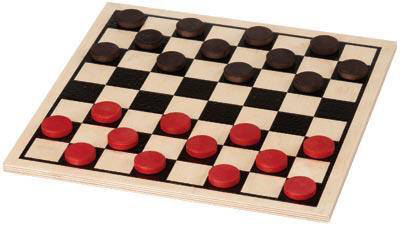
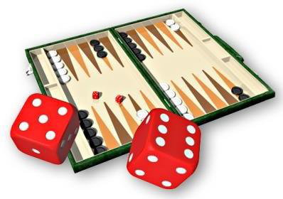
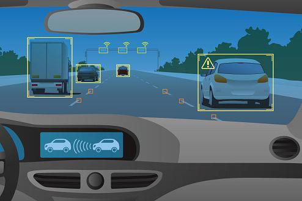
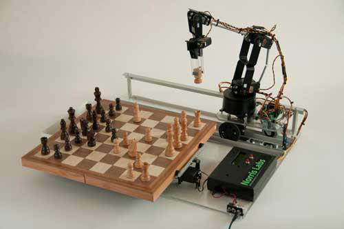
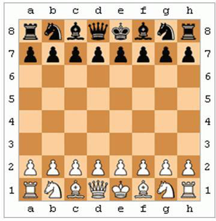
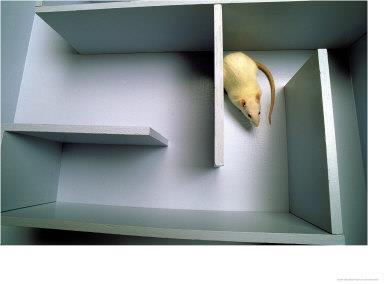

# Lecture 2: Introduction to Agents

> **Reading time:** ~60–75 min  |  **Prereqs:** none — this is the foundation
> chapter of the course.
> **Glossary terms introduced:** agent, agent function, agent program,
> percept, percept sequence, rational agent, performance measure, utility
> function, expected utility, autonomy, environment, PEAS, environment
> types (fully/partially observable, deterministic/stochastic,
> episodic/sequential, static/dynamic, discrete/continuous,
> single/multi-agent), reflex agent (simple reflex), model-based reflex
> agent, goal-based agent, utility-based agent, learning agent.
>
> **Notation convention used throughout this chapter.**
> - $\mathcal{P}$ = the set of distinct percepts the agent can receive.
>   A **percept sequence** is a finite sequence $p_1 p_2 \dots p_t \in
>   \mathcal{P}^{*}$ (Kleene-star = set of all finite sequences over
>   $\mathcal{P}$). Slide 6 of the source writes this as `f: p* → A` with
>   lowercase `p`; we use the conventional $\mathcal{P}^{*}$ notation.
> - $A$ = the set of all possible actions; lower-case $a \in A$ is one
>   action. We reserve $a^{*}$ for *the optimal action* (argmax).
> - $S$ = the set of environment states; lower-case $s \in S$ is one
>   state. $S$ is used implicitly by every later lecture (L03, L06,
>   L09a, L09b, L10) — the convention is set here.
> - $P(\cdot)$ written with parentheses-after means **probability**
>   (a measure on outcomes), never "set of percepts" — we use
>   $\mathcal{P}$ for that.
> - $\mathbb{E}[\cdot]$ = expectation; $U(\cdot)$ = utility function.

---

## 1. Overview & Motivation

This is the **conceptual foundation** of the entire course. Before we can
talk about *how* an artificial intelligence searches, plans, learns, or
reasons under uncertainty, we need a precise vocabulary for *what kind of
thing* an AI is and *what counts as it doing the right thing*. That
vocabulary is **agents**. (Slide 2 of the source titles this section
"Intelligent Agents" — Russell & Norvig and this course use "intelligent
agent" and "rational agent" interchangeably, with rationality defined
formally in §3.3.)

Three questions structure the lecture:

1. **What is an agent?** A precise, mathematically clean description of
   the thing we are trying to build — distinct from "an AI", "a program",
   or "a robot".
2. **What does "intelligent" mean for an agent?** The answer is
   **rationality**: an agent is intelligent to the degree that its actions
   maximise an externally-defined performance measure (defined formally
   in §3.3) given everything it has perceived so far. Not consciousness,
   not human-likeness — just doing the right thing on average.
3. **What kinds of agents are there, and how do they relate to the
   environment?** Six binary properties (the *environment taxonomy* —
   formalised in §3.6) plus a five-step hierarchy of internal
   **architectures** (a term introduced in §3.7 and §4) gives us a chart
   that every later lecture slots into.

Once you have this vocabulary, every later lecture is "different agent
architectures for different environment types". The lecture-by-lecture
map of which environment slice each one tackles lives in §7 (Connections
to Other Lectures) — by then the vocabulary will be in hand.

**If you only have 20 minutes:** read §2 (analogies), §8 (cheat sheet),
§6 pitfalls 1–3, and §5.2 (the four-environment classification table —
the single most exam-quotable artifact in the chapter). Come back for
the rest of §5 worked examples before the exam.

_[Lecture 2, slides 1–3 — outline.]_

---

## 2. The Big Picture — Analogies

Before any formalism, here is how to *think* about each major concept.
Every analogy has a "where it breaks down" caveat — read those carefully,
because mis-applied analogies are the single most common source of exam
mistakes. Each analogy is keyed to the concept name (which we then
formalise in §3 / §4). The headings deliberately describe the *idea*
first; the formal name appears at the end of the heading line so you
meet the intuition before the jargon.

### Sensing-and-acting in a loop — like a thermostat with a job description (formal name: **agent**)

A **wall thermostat** perceives the room temperature through a sensor
and decides whether to switch on the heater (action) so the room stays
near a target (its job description). Stretch the same picture from
"thermostat" to "self-driving car", "spam filter", or "factory robot",
and you have the textbook notion of an agent.

> *Where the analogy breaks down:* a thermostat has *one* sensor and
> *one* actuator and *one* extremely simple goal. Real agents have a
> stream of percepts, many actuators, and goals that change over time —
> but the loop "sense → decide → act → sense again" is identical.

### The contract vs the employee — agent function vs agent program

The **agent function** is the contract: *for every possible thing you
could see, here is what you must do.* It is an abstract mathematical
mapping $f: \mathcal{P}^{*} \to A$. The **agent program** is the
*person* (the code, on the hardware) who actually carries out the job
day to day. You can describe the same job in a one-page contract; you
need a finite-sized human to do it.

> *Where the analogy breaks down:* a job description is finite, but the
> agent function is infinite (it must say what to do for *every*
> conceivable history, of which there are infinitely many). The agent
> program is finite code that nonetheless realises that infinite
> function — usually by reading state from the world rather than
> remembering everything.

### Playing the odds — like a poker player who plays expected value (formal name: **rational agent**)

A **rational agent** picks, for every situation, the move that has the
best *expected* outcome given what it knows. A poker player makes the
bet with the best expected value given the cards she can see and the
cards she has seen, even though any individual hand can still go
badly. That mental sum "how much do I expect to win, weighted by how
likely each card-out is" **is expected utility** — formally:

$$\mathbb{E}[U \mid a] \;=\; \sum_{o \in \Omega(a)} P(o \mid a)\,U(o).$$

A rational agent picks $a$ to maximise this. Note: a rational agent
can lose. Rationality is about the *quality of the decision given the
available information*, not the outcome.

> *Where the analogy breaks down:* a poker player also reads the
> opponent's psychology; classical rational agents don't. Also,
> rationality doesn't require omniscience — the agent only has to do
> its best with the percept sequence it has actually seen and the
> knowledge it was built with. (We deliberately avoid the
> "chess-player" framing here: chess is the canonical *deterministic*
> example one section later — see §3.6.2. Poker is unambiguously
> stochastic, where "playing the odds" actually does work.)

### A frame in a movie vs the whole movie up to now — percept vs percept sequence

A **percept** is like the next frame in a movie — a single instant of
input from all sensors. A **percept sequence** is the whole movie up
to now. The agent function is the script the director wrote: *given
the movie so far, here is the next scene.*

> *Where the analogy breaks down:* no agent literally stores the whole
> movie — it stores a **summary** (the *internal state* of §4.3). The
> script that works on summaries instead of the full movie is what gets
> compressed into the agent program. This is exactly the
> function-vs-program distinction.

### What you want, not how the agent should do it — referee, not a coach (formal name: **performance measure**)

The **performance measure** is the external rule the world uses to
score the agent. It is *defined by the designer in terms of the
environment*, not in terms of how the agent thinks it's doing. The
referee at a football match doesn't care that the striker was trying
their best — they care about goals.

> *Where the analogy breaks down:* a referee mostly judges single
> matches; the performance measure judges the agent over its entire
> lifetime in the environment. Also: the performance measure must
> describe **what you want in the world**, not **how the agent should
> behave**. Saying "the agent should clean every square" is the wrong
> shape — say "the world should end up with zero dirt". This is the
> exam-quotable warning from slide 12.

### A one-page brief for a freelance contractor — PEAS

Before you can hire a contractor (build an agent), you need to write
down four things: what you'll judge the work on (**P**erformance), what
they will be working on (**E**nvironment), what tools they have
(**A**ctuators), and what information they have access to (**S**ensors).
That's PEAS: **P**erformance, **E**nvironment, **A**ctuators, **S**ensors.

> *Where the analogy breaks down:* in a freelance brief "tools" is one
> entry, but in PEAS we split **devices** (Sensors / Actuators) from
> **what those devices produce or consume** (percepts / actions).
> Forgetting this split is the most common PEAS-exam error — see §6
> pitfall 8.

### Six switches on a job description — environment types

Think of the six environment properties as the **six switches on a job
description**: before you can hire (build) the right agent, the recruiter
(you) flips each switch left or right. Will the worker see everything
(**fully observable**) or only some of it (**partially observable**)?
Will their actions have predictable consequences (**deterministic**) or
surprise outcomes (**stochastic**)? Is each task self-contained
(**episodic**) or does today's choice affect tomorrow (**sequential**)?
Is the field standing still while they deliberate (**static**) or moving
(**dynamic**)? Are the options countable (**discrete**) or a continuum
(**continuous**)? And is anyone else out there with their own goals
(**multi-agent** vs **single agent**)? Flip a switch the wrong way and
the agent architecture you hire will fail in a predictable way (e.g. a
simple-reflex hire fails if the observability switch is set to partial —
§4.2).

> *Where the analogy breaks down:* real environments sometimes need an
> intermediate setting — *semi-dynamic*, see §6 pitfall 5 — that the
> binary switch oversimplifies. The six dimensions are also formally
> *independent* of each other ($2^6 = 64$ combinations in principle —
> see §3.6 caveat).

### An infinite, impossible filing cabinet — table-driven agent

A **table-driven agent** is like an infinite filing cabinet keyed by
every possible life-history of the robot. Every drawer has the right
answer; the only problem is the cabinet is the size of a galaxy
(§4.1's numeric blow-up makes this concrete).

> *Where the analogy breaks down:* real agents *compress* the cabinet
> into a much smaller program — see §4.2 onward for the compression
> schemes (reflex rules, internal state, goals, utility, learning).

### A vending machine — simple reflex agent

Press B-4, get a Mars bar. The vending machine doesn't remember whether
you pressed B-4 yesterday. It looks at *only the current input* and
applies a fixed rule. That's a **simple reflex agent**: condition →
action, no memory.

> *Where the analogy breaks down:* vending machines have very few
> states (one per button); a reflex agent's rule table can be huge. But
> the failure modes are the same — both fail if you need to remember
> something from earlier (e.g. "did I already pay?"). In §3.6.1 we'll
> call this failure mode **partial observability**: the vending machine
> can't observe whether you've already paid in this transaction, so
> without memory it can't act correctly.

### A driver in fog — model-based reflex agent

If the road ahead is hidden by fog, you don't blindly drive forward.
You keep an **internal model** of what's out there based on the last
moment you could see, plus a model of how the world evolves
("I was on a straight road at 80 km/h three seconds ago, so I'm still
on it"). That internal state is what makes the agent robust to partial
observability — we'll formalise this in §4.3 as the **model-based
reflex agent** (slide 25 of the source calls this row "Agents with
memory" — the §4.3 heading anchors both names).

> *Where the analogy breaks down:* a driver in fog still gets
> intermittent reality checks; some environments stay opaque the whole
> time (e.g. a robot in a windowless warehouse). The model can drift
> if it never gets corrected.

### A satnav — goal-based agent

A satnav doesn't just react to the current intersection — it knows the
**goal** (your destination) and chooses the turn that brings you
closer. It can recompute when the world changes (you took a wrong
turn) because the goal is explicit. We'll formalise this in §4.4 as
the **goal-based agent** (slide 25 of the source calls this row
"Agents with goals" — both names land in the §4.4 heading): the goal
is in working memory, not baked into the rules.

> *Where the analogy breaks down:* a satnav typically has a unique
> destination; a goal-based agent can have a set of goal states (any
> of which counts as "done"). And the satnav already knows *how* to
> reach the goal — search through the road graph — whereas in general
> the goal-based agent has to plan. The planning step is all of L03.

### A satnav with preferences — utility-based agent (and utility function)

A satnav that lets you tick "avoid motorways", "prefer scenic", "no
toll roads" is comparing different paths to the goal using a
**utility function** — a number that says *how much better* one outcome
is than another. The utility function itself is **like the score on a
scoreboard**: a single real-valued number attached to each state that
says how well things are going there, independent of *which* agent
architecture reads the scoreboard. The **utility-based agent** (§4.5)
is then the architecture that *reads the scoreboard every step* and
picks the action with the highest *expected* score.
The essence of the difference from a goal-based agent: a goal is a
binary yes/no ("did I reach it?"); utility is a real number ("how good
is the state?"). That single switch — boolean predicate to real-valued
function — is the whole structural difference.

> *Where the analogy breaks down:* satnav preferences are usually a few
> sliders; a real utility function may need to combine dozens of
> incommensurable criteria (safety vs speed vs cost vs comfort) onto a
> single real-valued scale, which is hard.

### An apprentice getting feedback — learning / autonomous agent

An **apprentice** doesn't just do the job — they get feedback from
someone judging their work, internally update their understanding,
apply the improvement next time, and occasionally try something risky
to learn from. That four-role loop is what we'll formalise in §4.6 as
the **learning agent** (slide 33 also calls it the "autonomous agent"
because the property it achieves architecturally is the autonomy of
§3.4). The four roles get formal names in §4.6:

- *the one who judges* → **Critic**
- *the one who updates understanding* → **Learning element**
- *the one who applies the improvement* → **Performance element**
- *the one who tries something risky* → **Problem generator**

> *Where the analogy breaks down:* apprentices internalise the coach
> over time; a learning agent's critic is usually a fixed external
> performance-standard signal. Also, the human apprentice is
> motivated; the agent has no preferences other than what we encode.
> Note: the same apprentice analogy turns up in §3.4 for **autonomy**
> because autonomy is exactly the property the learning-agent
> architecture achieves — see the cross-reference there.

---

## 3. Core Concepts

### 3.1 Agent and environment

> Recall the **thermostat analogy** from §2. The mapping into the
> formal definition below: the thermistor is the **sensor**, the
> temperature reading is the **percept**, the relay command is the
> **action**, the relay-plus-heater is the **actuator**, and the
> target-temperature rule encodes the **agent function**.

**Definition (agent).** An **agent** is anything that can be viewed as
perceiving its environment through **sensors** and acting upon that
environment through **actuators**.


The "?" inside the agent box is the agent function — the thing we are
designing. The whole rest of the lecture (and the rest of the course)
is about how to fill in that box.

**Examples of (agent, sensor set, actuator set)** [slide 5]:

| Agent kind | Sensors | Actuators |
|---|---|---|
| Human | eyes, ears, nose, skin, proprioception, … | hands, legs, mouth, … |
| Robot | cameras, infrared range-finders, encoders, … | motors, grippers, … |
| Software | keystrokes, file contents, incoming network packets, … | screen output, file writes, outgoing packets, … |

The **environment** is everything outside the agent boundary. Importantly,
the environment is not just "the world" — it is *the part of the world
that the agent's performance measure references*. A self-driving car's
environment includes roads, pedestrians, and traffic but probably not
weather on Saturn. (Where exactly we draw the agent-environment boundary
is itself a modelling choice — for example, whether sensor-noise is
"inside the agent" or "inside the environment" is up to the designer.)

_[Lecture 2, slides 4–5.]_

### 3.2 Percept, percept sequence, agent function, agent program

> Recall the **movie / script analogy** from §2. The mapping: a single
> *frame* is a **percept**; the *whole movie up to now* is the
> **percept sequence**; the *script* is the **agent function**; the
> *director's brain compressing the script* is the **agent program**.

**Definition (percept).** A **percept** is a single perceptual input — what
the agent senses at one moment in time. Concretely, a tuple of all sensor
readings at that instant.

**Definition (percept sequence).** Let $\mathcal{P}$ denote the set of
possible percepts. A **percept sequence** is a finite sequence
$p_1 p_2 \dots p_t$ of elements of $\mathcal{P}$. The set of all
possible percept sequences (of all finite lengths) is the **Kleene-star
closure** $\mathcal{P}^{*}$.

**Definition (agent function).** The **agent function** is a mapping from
percept sequences to actions:
$$f : \mathcal{P}^{*} \to A,$$
where $A$ is the set of all possible actions. The agent function is the
*specification* of behaviour — it says, for every possible history of
the agent's life, what it does next.

*(Notation note: slide 6 of the source writes this as `f: p* → A` with
lowercase `p`; we use $\mathcal{P}^{*}$ to keep `P` available for
probability throughout the chapter. Mathematically the two notations
are identical.)*

**Definition (agent program).** The **agent program** is the concrete
piece of code that, running on a particular physical or virtual
architecture, *realises* the agent function. The textbook slogan:
$$\boxed{\text{Agent} \;=\; \text{architecture} \;+\; \text{program}.}$$

Why distinguish function from program? Because the function is in
general *infinite* (the set $\mathcal{P}^{*}$ is unbounded) but the
program must be *finite*. The program achieves an infinite function by
computing on the fly: it inspects the current state, applies some
rules, and produces the next action, without literally storing every
(percept-sequence, action) pair.

The cleanest mental model — and the one slide 9 puts on screen — is to
imagine that the agent function is the *table* below, even though no
realistic agent stores the table:

![The agent function written out as a table. Each row maps a percept
sequence to the action the agent takes. Rows like `[A, Clean] →
Right` describe single-percept reactions; longer rows like
`[A, Clean], [A, Clean], [A, Dirty] → Suck` describe behaviour
after the agent has seen multiple percepts in succession. (Lecture
2, slide 8–9.)](../extracted_figures/L02/fig07-xref41-slide8.png)

A few things to notice about this table:

- Rows have **variable length** because the function is keyed on the
  *entire history*, not just the latest percept. Sequences of length
  1, 2, 3, … each get their own row.
- In principle, two rows ending in the *same current percept* but with
  *different past prefixes* could map to *different* actions — that is
  what makes the function genuinely history-dependent.
- The slide-9 table happens to map every sequence ending in
  `[A, Clean]` to `Right` and every sequence ending in `[A, Dirty]` to
  `Suck`, *regardless of history*. That is what makes this particular
  function realisable by a simple reflex agent (§4.2). A non-reflex
  function would have a row that depends on prefix.

The agent program is whatever finite code reproduces this table.

_[Lecture 2, slides 6, 8, 9.]_

#### Worked example — vacuum agent (slide 7)

The lecture's running example is the **two-square vacuum world**: rooms
labelled `A` and `B`, each either clean or dirty, and a vacuum agent
that lives in one of them.


- **Possible percepts:** `[A, Clean]`, `[A, Dirty]`, `[B, Clean]`,
  `[B, Dirty]`. So $|\mathcal{P}| = 4$.
- **Possible actions (slide 7):** `Left`, `Right`, `Suck`, `NoOp`.
- **Extended action set (slide 11):** `Left`, `Right`, `Suck`, `NoOp`,
  **`Dump`**. The lecture does not formally define what `Dump` does;
  the standard reading is *deposit collected dirt at a designated
  cell* (e.g. a dustbin square). The exam may define it either way —
  if asked, note the ambiguity and pick the most natural reading.
- **An agent function** — written in if-then form on slide 7:

  ```text
  function Vacuum-Agent([location, status]) returns an action
      if status = Dirty then return Suck
      else if location = A then return Right
      else if location = B then return Left
  ```

This is the smallest non-trivial agent program in the course. It
realises a particular agent function: from any starting state it will
clean both rooms in at most 3 steps and then bounce between them
forever. Is that the *best* function? Not necessarily — see §3.3.

### 3.3 Rationality and performance measure

> Recall the **poker-player analogy** from §2: play expected value with
> what you've seen. Mapping into the formalism below: the *cards
> already on the table* are the **percept sequence**; the *cards still
> to come* drive the **probabilities $P(o \mid a)$**; the *chip stack
> outcome* is the **utility $U$**; *the choice that maximises expected
> chips* is the **rational action**.

**Definition (performance measure).** A **performance measure** is an
objective external criterion for an agent's success. It is defined by
the designer, *in terms of the environment*, not in terms of the
agent's internal mental states. Slide 10 of the source parenthetically
equates it with the **utility function**, written `Performance measure
(utility function)` — for this lecture the two terms are
interchangeable. (Caveat for later lectures: in L06 the *evaluation
function* is a heuristic estimate of utility at non-terminal game
states and is *not* identical to the performance measure; in L09a the
expected utility is the probability-weighted utility. Memorise the
three names separately and watch for context — see §6 pitfall 10.)

**Definition (rational agent).** *For each possible percept sequence,*
a rational agent should select an action that **is expected to maximise
its performance measure**, given the evidence provided by the percept
sequence and whatever built-in knowledge the agent has.

Unpack the four constituents (slide 10):

1. **For each possible percept sequence** — rationality is a function-
   shaped property; it's about *which action* you choose *given* a
   history.
2. **An action that is expected to maximise** — it's expectation, not
   certainty. A rational agent can lose if the environment is
   stochastic, but its choices must have been the best ones *given the
   information available at the time*. (Textbook slogan: **rationality
   is not omniscience.**)
3. **Performance measure** — defined externally. The agent's own opinion
   of how well it's doing is irrelevant; what counts is the designer's
   yardstick.
4. **Built-in knowledge** — the agent is allowed to know things in
   advance (e.g. the vacuum agent knows the world has rooms A and B).

**Expected utility** — the probability-weighted sum of utilities over
possible outcomes — is the formal object the rational agent maximises:
$$\mathbb{E}[U \mid a] \;=\; \sum_{o \in \Omega(a)} P(o \mid a)\,U(o),$$
where $\Omega(a)$ is the set of **mutually exclusive and exhaustive**
outcomes when action $a$ is taken, and $P(o \mid a)$ is the probability
of outcome $o$ given $a$. When outcomes form a *continuum* (e.g.
real-valued sensor noise), replace the sum with an integral. *(Slide 10
states only that the agent maximises expected performance; the
expected-utility sum is the standard probabilistic formalisation, made
fully concrete in L09a §1.)*

**Instantiated on the vacuum world.** In the deterministic vacuum world
of slide 7, the outcome of action `Suck` from a dirty cell is *clean
cell* with probability 1, so
$$\mathbb{E}[U \mid \text{Suck}] = 1 \cdot U(\text{clean}) = U(\text{clean}).$$
The expectation collapses to a deterministic utility. The expectation
only does real work once the environment is stochastic — for example,
if the suction motor fails 10% of the time:
$$\mathbb{E}[U \mid \text{Suck}] = 0.9 \cdot U(\text{clean}) + 0.1 \cdot U(\text{dirty}).$$
This is exactly the *poker bet* of §2 applied to a vacuum cleaner.

**Sub-point on slide 11 — "is the vacuum agent rational?"** *Depends on
the performance measure.* If we score the agent on "amount of dirt
cleaned per unit time", the if-then rule of slide 7 does well. If we
penalise it for the noise the suction makes during NoOp moments, maybe
not. The designer's job is to pick a performance measure that captures
> *"what we want in the environment, rather than how we think the
> agent should behave"* — slide 12, **memorise this exam-quotable
> line**.

_[Lecture 2, slides 10–12.]_

### 3.4 Autonomy

> Recall the **apprentice analogy** from §2 — an apprentice eventually
> outgrows their training. The same analogy returns in §4.6 for the
> learning agent because *autonomy is the property the learning-agent
> architecture achieves*. Mapping: the *coach* is the **performance
> standard / critic** (§4.6); the *apprentice's growing expertise* is
> the **learned modification of the performance element** (§4.6); the
> *minimum knowledge to survive day one* is the **built-in knowledge**
> of slide 13.

**Definition (autonomy).** An agent is **autonomous** to the extent
that its behaviour is determined by *its own experience* (acquired
through perception and learning) rather than by knowledge built in by
its designer.

Slide 13 lists three properties of an autonomous agent — verbatim:

> - ability to **learn and adapt**;
> - can always **say "no"** (i.e. override the designer's hard-coded
>   rules when its own experience contradicts them);
> - needs **enough built-in knowledge to survive** the first percepts
>   — pure tabula-rasa agents starve.

A non-autonomous agent is *guided by its designer*: every rule it
follows was hand-coded. Most agents in L02–L09 are non-autonomous; L10
onwards is the machine-learning toolkit that lets us build autonomous
ones.

> *Cross-reference:* autonomy is the property that the **learning
> agent** (§4.6) achieves architecturally; L10 §1 makes its
> learning-element concrete; reinforcement-learning agents (L10 slide
> 5–7) are the canonical autonomous example.

_[Lecture 2, slide 13.]_

### 3.5 PEAS — the four-part task environment specification

> Recall the **freelance-brief analogy** from §2. Mapping into the
> table below: the *contract terms* are **P**erformance, the *site
> address* is **E**nvironment, the *tools provided* are **A**ctuators,
> the *information access* is **S**ensors.

To specify a problem for an agent designer, write down four things:

| Letter | Stands for | Meaning |
|---|---|---|
| **P** | Performance measure | external criterion for success |
| **E** | Environment | what the agent perceives and acts on |
| **A** | Actuators | how the agent acts |
| **S** | Sensors | how the agent perceives |

The PEAS specification *pins down the agent problem*. Three PEAS
examples — two from the lecture (taxi, spam filter) plus the lecture's
running vacuum-cleaner example (an exam-likely target the lecture
itself does not write out):

**PEAS — Automated taxi (slide 14):**

- **P** — Safe, fast, legal, comfortable trip, maximise profits.
- **E** — Roads, other traffic, pedestrians, customers.
- **A** — Steering wheel, accelerator, brake, signal, horn.
- **S** — Cameras, speedometer, GPS, odometer, engine sensors, keyboard.

**PEAS — Spam filter (slide 15):**

- **P** — Minimise false positives, minimise false negatives.
- **E** — A user's email account, email server.
- **A** — Mark as spam, delete, move to inbox, flag for review.
- **S** — Incoming messages, other information about user's account.

**PEAS — Vacuum agent of slide 7 (chapter-added — not on the slides
but a likely exam target):**

- **P** — Amount of dirt cleaned over a fixed horizon, minus
  weighted penalties for energy used and noise generated.
- **E** — Two cells `A` and `B`, each in state `Clean` or `Dirty`;
  the vacuum is in exactly one cell at a time.
- **A** — `Left`, `Right`, `Suck`, `NoOp` (and `Dump` in the slide-11
  extension).
- **S** — Location sensor (reports `A` or `B`); dirt sensor (reports
  `Clean` or `Dirty` for the current cell).

**PEAS — Medical diagnosis agent (chapter-added textbook-style example;
exam-likely shape for non-physical agents):**

- **P** — Maximise correct diagnoses; minimise patient distress and
  unnecessary tests.
- **E** — Patient, medical history, lab tests, hospital staff.
- **A** — Display questions, order tests, recommend treatments.
- **S** — Keyboard input for patient/clinician answers; structured lab
  results.

These examples are also the canonical illustrations of different
*environment types*: the taxi is dynamic / continuous / multi-agent;
the spam filter is episodic / discrete / single-agent; the medical
diagnosis agent is sequential / discrete / partially observable.

_[Lecture 2, slides 14–15.]_

### 3.6 Environment types (the six-dimensional taxonomy)

> Recall the **six-switches analogy** from §2. Mapping: each switch
> below is one of the six environment dimensions; flipping a switch
> the wrong way breaks the agent architecture that assumed it.

Six binary properties classify any task environment (slides 16–24):

| Property | "+" pole | "−" pole | Test question |
|---|---|---|---|
| Observability | fully observable | partially observable | Do sensors give the complete state? |
| Determinism | deterministic | stochastic | Is the next state fully determined by current state + action? |
| Episodicity | episodic | sequential | Are episodes independent of each other? |
| Dynamics | static | dynamic | Does the world change while the agent thinks? |
| Discreteness | discrete | continuous | Finite, distinct percepts/actions/states? |
| Agent population | single agent | multi-agent | Are other agents affecting performance? |

Each dimension is *formally* independent of the others, so in
principle there are $2^6 = 64$ types of environment. In practice many
combinations are extremely rare or correlated (e.g. multi-agent
environments tend to be partially observable; continuous environments
tend to be dynamic), so only a handful matter — see §5.2.

**Slide-24 verbatim definitions (one-line glossary for short-answer
recall):**

| Property | Slide-24 wording |
|---|---|
| Observable | "agent's sensors give it access to the **complete state of the environment**" |
| Deterministic | "the next state is **completely determined by the current state and the action**" |
| Episodic | "the agent's experience is divided into **independent episodes**" |
| Static | "the environment **does not change while the agent is deliberating**" |
| Discrete | "**finite number of distinct percepts and actions**" |
| Single agent | "no other agent(s) operating in the environment" |

These are the phrasings to reproduce verbatim on a short-answer exam
question.

#### 3.6.1 Fully vs partially observable (slide 17)

> "Do the agent's sensors give it access to the complete state of the
> environment?"

If yes, **fully observable**; if no, **partially observable**. Partial
observability arises because of sensor noise, limited field of view, or
because some quantities are inherently hidden (e.g. another driver's
intention). Slide 16 also parenthetically names a third extreme —
**(unobservable?)** — where the agent gets no useful percepts at all
and must operate entirely on its internal model. This is the
degenerate end of the partial-observability spectrum and shows up in,
e.g., planning under total sensor failure.


#### 3.6.2 Deterministic vs stochastic (slide 18)

> "Is the next state of the environment completely determined by the
> current state and the agent's action?"

**Checkers** (slide 18) is deterministic: every legal move leads to
exactly one resulting position. **Backgammon** (also slide 18) is
stochastic: each turn's outcome depends on the roll of two dice.

**Convention on "where the randomness has to live":** by the standard
convention used in environment-type classification, randomness in the
*initial state* of a one-shot game (e.g. a Scrabble tile draw at the
start of your turn, or a Klondike deal) only makes the environment
stochastic if it continues to inject randomness during play. A
word-jumble's *initial scramble* is fixed once revealed — the letters
don't shuffle while you solve — so the environment is **deterministic
in transition** even though the puzzle was randomly chosen. Scrabble,
by contrast, draws new tiles after every move (continuing randomness)
and is therefore **stochastic**. The distinction is "randomness in
state transitions vs randomness in the initial setup" — only the
former counts.




#### 3.6.3 Episodic vs sequential (slide 19)

> "Is the agent's experience divided into unconnected episodes, or is it
> a coherent sequence of observations and actions?"

**Episodic** environments split experience into independent chunks; the
choice of action in one episode doesn't affect future episodes. A
**spam filter** (slide 19) labels each incoming email independently — a
classification mistake on Tuesday doesn't change what arrives on
Wednesday. **Sequential** environments require reasoning about long-
term consequences — every move in **Pac-Man** affects what is reachable
next.


#### 3.6.4 Static vs dynamic (slide 20)

> "Is the world changing while the agent is thinking?"

A **Rubik's cube** waits patiently while you decide your next twist —
**static**. A **driving** environment doesn't — **dynamic**. Subtle
edge case (textbook terminology): a **semi-dynamic** environment is one
where the world itself is static but the *performance measure* depends
on time, e.g. chess with a clock. See §6 pitfall 5.




#### 3.6.5 Discrete vs continuous (slide 21)

> "Does the environment provide a fixed number of distinct percepts,
> actions, and environment states?"

A **chess board** (64 squares, finite move set) is **discrete**. A
**chess-playing robot arm** has continuous joint angles, smooth motion,
and continuous time — **continuous** at the actuation level even though
the underlying game is discrete. The slide deliberately uses the same
domain (chess) to show that "discrete vs continuous" depends on which
*level of abstraction* you're modelling.

**Sub-point on slide 21 — time can also evolve discretely or
continuously.** The discrete/continuous distinction does not just apply
to percepts and actions; it applies to **time** as well. Discrete-time
environments (HMMs in L09b are the canonical example) tick at integer
time steps; continuous-time environments (most robotics, L11 regression
on time-series data) evolve over a real-valued clock. This is what
makes chess-with-a-clock continuous in the lecturer's classification
(see §5.2): the clock evolves continuously even though the board state
does not.




#### 3.6.6 Single-agent vs multi-agent (slide 22)

> "Is an agent operating by itself in the environment?"

A mouse navigating a maze alone is **single-agent**. A crowd of
pedestrians in a busy walkway — each with their own goals — is
**multi-agent**. The qualifier that matters: the other entities must
**affect the agent's performance measure** to count. A pedestrian on a
sidewalk who is invisible to the taxi and to whom the taxi is invisible
is *not* a meaningful agent from the taxi's perspective (see §6 pitfall
7).

Multi-agent environments split further into:
- *cooperative* — joint goal (multi-robot warehouse logistics; team
  sports);
- *competitive* — opposing goals (chess, the canonical setting for
  adversarial search in L06).

The cooperative-vs-competitive distinction is itself exam-targetable
(e.g. "classify Pac-Man vs the ghosts: cooperative or competitive?" —
competitive).




_[Lecture 2, slides 16–22, 24.]_

### 3.7 Hierarchy of agent types

> Recall the **infinite-filing-cabinet → vending-machine →
> driver-in-fog → satnav → satnav-with-preferences → apprentice** chain
> of analogies from §2. They map onto the rows of the hierarchy below
> (with the apprentice being the orthogonal learning extension).

Slide 25 introduces a five-step ladder of agent architectures, ordered
from "simple" at the top to "complex" at the bottom:


**Slide-25 names vs Russell-&-Norvig / chapter names — mapping table
(exam-critical: an exam asking "list the five agent types in the
hierarchy" expects the slide names below):**

| Slide-25 (lecturer's) name | Russell-&-Norvig / chapter name | Defined in |
|---|---|---|
| (1) Table-driven agents | Table-driven agent | §4.1 |
| (2) Simple reflex agents | Simple reflex agent | §4.2 |
| (3) Agents with memory | Model-based reflex agent | §4.3 |
| (4) Agents with goals | Goal-based agent | §4.4 |
| (5) Utility-based agents | Utility-based agent | §4.5 |

Each row corresponds to a more permissive environment class. The §4
section below works through each row in full and keeps both names in
its headers.

**Note on the learning agent.** The slide-25 hierarchy has *five* rows.
The **learning agent** (§4.6) is **not a sixth rung** of the ladder —
it is an *orthogonal extension* introduced on slide 33+ that can be
layered on top of any of rows (2)–(5). Treat it as a separate axis,
not as "row six".

_[Lecture 2, slide 25.]_

---

## 4. Algorithms / Methods

This section makes each row of the hierarchy concrete: the
representation, the algorithm, the kind of environment it suits, and
its failure modes. Each header lists both the chapter name and the
slide-25 name for cross-referencing on an exam.

### 4.1 Table-driven agents

A **table-driven agent** stores the full agent function as a lookup
table indexed by percept sequence:

$$\text{action} \;=\; \text{TABLE}[\text{percept-sequence}].$$

```text
function TABLE-DRIVEN-AGENT(percept) returns an action
    persistent: percepts, a sequence, initially empty
                table, a table of actions indexed by percept sequences,
                       initially fully specified
                /* "fully specified" is the in-principle assumption — see
                   the size argument below for why this is infeasible. */
    append percept to the end of percepts
    action ← LOOKUP(percepts, table)
    return action
```

**Why it doesn't work in practice (slide 26).**

A table-driven agent must store one action for every possible percept
sequence of length 1, 2, …, $T$ (the agent's lifespan). With
$|\mathcal{P}|$ distinct percepts the row count is
$$\sum_{t=1}^{T} |\mathcal{P}|^{t} \;=\; |\mathcal{P}| \cdot \frac{|\mathcal{P}|^{T} - 1}{|\mathcal{P}| - 1} \;=\; \mathcal{O}\bigl(|\mathcal{P}|^{T}\bigr)$$
— exponential in $T$ (the dominant term is $|\mathcal{P}|^{T}$, which
is what the slide quotes informally).

**Numeric blow-up for the slide-7 vacuum world** ($|\mathcal{P}| = 4$):

| Lifespan $T$ | Table rows $\sum_{t=1}^{T} 4^{t}$ |
|---|---|
| 1 | 4 |
| 2 | 4 + 16 = 20 |
| 4 | 4 + 16 + 64 + 256 = **340** |
| 10 | $\approx 1.4 \times 10^{6}$ |
| 20 | $\approx 1.5 \times 10^{12}$ |

So even a four-percept vacuum cleaner running for 20 time steps would
need over a trillion table rows. Slide 26's three bullets follow
directly:

- **"Physical agents cannot store"** — out of memory.
- **"Designer no time and knowledge to create"** — no human can specify
  the whole table.
- **"Not very practical!"**

The lesson: agent *programs* must be much smaller than the agent
*function* they realise. The rest of the lecture is about how to
compress the function.

_[Lecture 2, slides 25–26.]_

### 4.2 Simple reflex agent (slide 25 row 2)

> Recall the **vending-machine analogy** from §2: condition → action,
> no memory. *Mapping into the formalism below: the **button press**
> is the **current percept**; the **internal wiring from button to
> dispense-mechanism** is the **condition-action rule**; the **lack of
> any state between transactions** is what makes the architecture
> work only in **fully observable** environments (§3.6.1) — the
> machine cannot tell whether you've already paid in this session, so
> the percept must carry all the information needed to decide.*

A **simple reflex agent** chooses its action based **only on the current
percept** — no memory of past percepts. It is implemented as a set of
**condition-action rules** (sometimes called a *production system*).
Slide 27 captures the shape of the rule informally: *"if (I sense a
certain input) then (I apply a specific rule)."*

```text
function SIMPLE-REFLEX-AGENT(percept) returns an action
    static: rules, a set of condition-action rules
    state ← INTERPRET-INPUT(percept)
    rule  ← RULE-MATCH(state, rules)
    action ← rule.ACTION
    return action
```


Slide 28 gives the vacuum-world reflex agent as code:

```text
function REFLEX-VACUUM-AGENT(percept) returns an action
    static: rules, a set of condition-action rules
    rule   ← RULE-MATCH(state, rules)
    action ← RULE-ACTION[rule]
    return action
```

*(Note: slide 28 omits the explicit `state ← INTERPRET-INPUT(percept)`
line that appears in slide 27's general version. Treat them as
equivalent — the slide-28 pseudocode silently uses `state` derived from
the just-received percept.)*

Concrete rules (from slide 7 of the lecture):

- if `status = Dirty` then return `Suck`
- else if `location = A` then return `Right`
- else if `location = B` then return `Left`

**Limitation (slide 27):** the simple reflex architecture requires a
**fully observable environment**. If the agent can't tell whether
square A is clean *without going there*, a reflex rule that says
"if location = A and Clean, go right" might be wrong because the agent
doesn't yet know whether A is actually clean. In partially observable
environments the agent needs memory — see §4.3.

_[Lecture 2, slides 27–28.]_

### 4.3 Model-based reflex agent (slide 25 row 3 — "Agents with memory")

> Recall the **driver-in-fog analogy** from §2. *Mapping into the
> formalism below: the **driver** is the agent; the **driver's mental
> picture of the road through the fog** is the **internal state**;
> the **driver's experience of how cars move (constant velocity, road
> geometry, friction)** is the **transition model**; the **driver's
> expectation of what they would see if the fog briefly lifted** is
> the **sensor model** (the R&N 4th-ed addition flagged below).*

A **model-based reflex agent** maintains an **internal state** that
estimates aspects of the world its sensors cannot directly observe.
The slide names one piece of knowledge — the **transition model** —
explicitly; the textbook (Russell & Norvig, 4th ed.) adds a second:

- a **transition model** (slide 29/30): *how the next state depends on
  the current state and the agent's action* (analogous to the
  search-side transition function — see L03 §3);
- a **sensor model** *(introduced in Russell & Norvig 4th ed.; not
  named on slide 29 — included here for clarity but mark it as an
  R&N addition if asked to reproduce slide content verbatim)*: *how
  the current state generates percepts*.

The agent updates its state estimate every step:

$$\text{state} \;\leftarrow\; \text{UPDATE-STATE}(\text{state},\,\text{last\_action},\,\text{percept},\,\text{model})$$

then matches the new state against the condition-action rules as
before:

```text
function REFLEX-AGENT-WITH-STATE(percept) returns an action
    static: rules, a set of condition-action rules
            model, a description of how the next state depends on
                   current state and action
            state, a description of the current world state
            last_action, the most recent action taken by the agent
    state       ← UPDATE-STATE(state, last_action, percept, model)
    rule        ← RULE-MATCH(state, rules)
    action      ← RULE-ACTION[rule]
    last_action ← action
    return action
```

*(The argument is called `last_action` consistently in prose and code —
slide 30 of the source labels it just `action`, with the gloss "the
most recent action".)*


**When to use:** partially observable environments. The vacuum example
becomes a model-based reflex agent if we add memory of which squares
the agent has already cleaned.

_[Lecture 2, slides 29–30.]_

### 4.4 Goal-based agent (slide 25 row 4 — "Agents with goals")

> Recall the **satnav analogy** from §2. *Mapping into the formalism
> below: the **destination address** is the **goal state**; the
> **road graph the satnav holds in memory** is the **transition
> model** (inherited from §4.3); the **route the satnav computes
> ahead of you** is the **action sequence** produced by SEARCH; the
> **next-turn instruction it reads out loud** is `plan.first()` — the
> first action of that sequence, executed before re-planning.*

A **goal-based agent** adds an explicit representation of the **goal**
to the model-based architecture. Now the agent doesn't just apply
fixed condition-action rules — it asks *what will happen if I take a
whole sequence of actions?* and *will the resulting state match a
goal?* The lecture itself does not give pseudocode (slide 31 is a
diagram only); the right level of description is:

> The decision procedure is no longer a fixed rule table. Instead the
> agent uses its model to *predict* the outcome of each candidate
> *action sequence* and picks one that reaches a goal state. Choosing
> **which** sequence to consider is the **search problem** of L03.
> Schematically:
>
> ```text
> plan ← SEARCH(state, goal, model)     // produces a sequence of actions
> return plan.first()                   // execute the first action; repeat
> ```

The crucial difference from §4.3 is that a goal-based agent **plans
ahead** rather than reacting one step at a time. Hence the slide's
note that goal-based agents *"consider future events"* — and that
consideration is exactly what *search* (L03) does.


**Cross-reference:** the goal-based agent is the architectural setting
for *all of search* — L03 (uninformed), L05 (local), L06 (adversarial),
L07 (CSP). The slide's "considers future events" phrase is the
hand-wave that L03–L07 turn into algorithms.

_[Lecture 2, slide 31.]_

### 4.5 Utility-based agent (slide 25 row 5)

> Recall the **satnav-with-preferences analogy** from §2. The
> structural difference from a goal-based agent in one line:
> goal-based agents answer **yes/no** (did I reach a goal?);
> utility-based agents answer **how good** (what real-valued score
> did I achieve?).

A **utility-based agent** extends the goal-based architecture with a
**utility function** $U$ that maps states (or sequences of states)
onto real numbers. Formally, let $S$ denote the set of environment
states (set here; reused in L03/L06/L09a/L09b/L10). Then
$$U : S \to \mathbb{R}.$$
*(Slide 32 says utility may take "(sequence of) state(s)" as input;
strictly we would write $U : S \cup S^{*} \to \mathbb{R}$. The
simpler single-state signature is what shows up in the action rule
below.)*

The agent now chooses the action whose expected resulting utility is
highest, not just any action that reaches a goal:
$$a^{*} \;=\; \operatorname*{arg\,max}_{a \in A} \;\mathbb{E}\bigl[U(\text{Result}(s, a))\bigr],$$
where $\text{Result}(s, a)$ is the (possibly stochastic) successor
state when action $a$ is taken in state $s$. If the environment is
**deterministic**, $\text{Result}(s, a)$ is a single state and the
expectation collapses ($\mathbb{E}[\cdot]$ is a no-op). If
**stochastic**, $\text{Result}(s, a)$ is a random variable distributed
according to the transition model $P(s' \mid s, a)$, and the
expectation expands to
$$\mathbb{E}\bigl[U(\text{Result}(s, a))\bigr] \;=\; \sum_{s' \in S} P(s' \mid s, a)\, U(s').$$
*(This is the same expected-utility object as in §3.3, instantiated
with outcomes $o = s'$.)*


**When utility-based beats goal-based:**

- multiple goal states can be reached by different action sequences —
  utility says *which one is best*;
- conflicting goals (taxi: fast vs comfortable vs cheap) — utility
  combines them onto a single scale;
- uncertain outcomes (the environment is stochastic) — utility lets
  the agent **trade off probability against value** via expected
  utility.

The first two cases only need $\operatorname*{arg\,max}_{a} U(\text{Result}(s, a))$
(in the deterministic special case, where $\text{Result}(s, a)$ is a
single state, so $U(\text{Result}(s, a))$ is a single real number); the
third needs the full expected-utility argmax above.

**Quote from slide 32:** *"Certain goals can be reached in different
ways; 'better' ways have higher utilities."*

_[Lecture 2, slide 32.]_

### 4.6 Learning / autonomous agent (slide 33 title — "Learning/Autonomous agent")

> Recall the **apprentice-with-coach analogy** from §2. The learning
> agent is the *architectural realisation of autonomy* (§3.4) — slide
> 33's compound title is not a coincidence.

A **learning agent** is *any* of the previous agent types augmented
with a feedback loop that improves the agent program over time. Slide
33 calls this "**teach instead of instructing**" — the philosophical
pitch behind ML: don't hand-code every rule, set up the right feedback
loop and let the agent learn the rules itself.

It has **four canonical components** (slide 33):

1. **Performance element** — the part of the agent that picks actions
   in the environment (this is whichever of §4.2–§4.5 you started
   with). *Mapping to the apprentice analogy: the apprentice doing
   the job.*
2. **Critic** — judges how well the agent is doing against an external
   *Performance standard* and feeds back to the learning element.
   *Mapping: the coach watching the apprentice's work.*
3. **Learning element** — uses the critic's feedback to modify the
   performance element (the "changes" arrow in the diagram).
   *Mapping: the apprentice internalising the coach's feedback.*
4. **Problem generator** — suggests **exploratory actions** that may
   not be locally optimal but could lead to new, informative
   experiences. *Mapping: the apprentice deciding to try something
   risky for the sake of learning.*


**Why all four pieces matter — the slide 36 example (annotated):** an
automated taxi takes "a quick left turn across three lanes of traffic
— shocking language from other drivers". Mapping to the four
components:

- **Critic** — notices the performance standard ("don't cause shocking
  language") was violated.
- **Learning element** — installs **a new rule**: "this action is bad
  in this state".
- **Performance element** — applies the new rule next time, declining
  to repeat the manoeuvre.
- **Problem generator** — suggests exploring different brakes on
  different road surfaces (an exploratory action that may not be
  locally optimal but yields useful data).

Eventually the performance element has a richer rule set than the
designer ever wrote — which is exactly the **autonomy** property of
§3.4.

**Cross-reference:** L10 makes the learning-element concrete — it is a
classifier (L10), a regressor (L11), or a clusterer (L12).
Reinforcement learning (L10 slides 5–7) is the canonical end-to-end
setting for the learning agent: critic ↔ reward, learning element ↔
policy update, problem generator ↔ exploration policy.

_[Lecture 2, slides 33–36.]_

---

## 5. Worked Examples

### 5.1 Designing the vacuum agent

**Task (slide 11–12).** Decide whether the simple if-then vacuum
agent of slide 7 is rational, and what would change with different
performance measures.

**Step 1 — write down the candidate function.** The agent function is
the if-then rule of slide 7:

| Percept | Action |
|---|---|
| `[A, Clean]` | `Right` |
| `[A, Dirty]` | `Suck` |
| `[B, Clean]` | `Left` |
| `[B, Dirty]` | `Suck` |

(Note: this is the *current-percept-only* function, which makes the
agent effectively a simple reflex agent — see §4.2.)

**Step 2 — pick a performance measure.** Slide 11 lists four
candidates:

- amount of dirt cleaned up;
- amount of time taken;
- amount of electricity consumed;
- amount of noise generated.

**Step 3 — evaluate analytically.** Under "amount of dirt cleaned up
over a fixed horizon", the rule is excellent — it sucks every dirty
square and otherwise bounces between rooms, so it never sits idle on a
dirty square. Under "minimise electricity consumed", the rule is
mediocre — it keeps moving back and forth even when both rooms are
clean, burning power on `Left`/`Right` actions that achieve nothing. To
repair this we would add a *new* action `NoOp` (already in the action
set) and extend the rules: if both rooms have been seen clean recently,
return `NoOp`. But that needs **memory** — turning the agent into a
model-based reflex agent (§4.3).

**Step 4 — quantify on a concrete trace.** Start in state
`(loc=A, A=Dirty, B=Dirty)` and run the rule for 5 time steps. Let the
performance measure be *cumulative cleanliness* — the number of clean
cells at each step, summed:

| Step $t$ | Percept | Action | State after | #clean cells |
|---|---|---|---|---|
| 1 | `[A, Dirty]` | `Suck` | `(A, A=Clean, B=Dirty)` | 1 |
| 2 | `[A, Clean]` | `Right` | `(B, A=Clean, B=Dirty)` | 1 |
| 3 | `[B, Dirty]` | `Suck` | `(B, A=Clean, B=Clean)` | 2 |
| 4 | `[B, Clean]` | `Left` | `(A, A=Clean, B=Clean)` | 2 |
| 5 | `[A, Clean]` | `Right` | `(B, A=Clean, B=Clean)` | 2 |

Cumulative performance = $1 + 1 + 2 + 2 + 2 = 8$. From $t = 3$ onward
the world is in the *all-clean* terminal state and the agent's
back-and-forth wastes energy — exactly the trade-off discussed in
Step 3.

**Take-away (slide 12 — exam-quotable):**

> *"Design performance measures according to what you want in the
> environment, rather than how you think the agent should behave."*

If you only score cleanliness, the agent will trash the battery; if
you only score energy efficiency, it might never clean. Most real
performance measures are weighted combinations.

### 5.2 Classifying four environments

**Task (slide 23).** Classify *Word-jumble solver, Chess with a clock,
Scrabble, Autonomous driving* along the six environment dimensions.

This is the most exam-likely figure in the lecture. **If you remember
nothing else from this chapter, memorise the table below.** It is
reproduced verbatim from the source slide:


Read off (matching slide 23 exactly):

| Property | Word-jumble | Chess-with-clock | Scrabble | Autonomous driving |
|---|---|---|---|---|
| Observable | Fully | Fully | Partially | Partially |
| Deterministic | Deterministic | Deterministic | Stochastic | Stochastic |
| Episodic | Episodic | Sequential | Sequential | Sequential |
| Static | Static | Dynamic (semi) | Static | Dynamic |
| Discrete | Discrete | **Continuous** | Discrete | Continuous |
| Single-agent | Single | Multi | Multi | Multi |

**Discussion of each cell:**

- **Word-jumble** is *single-agent* (no opponent), *episodic* (each
  puzzle is independent), *static* (the letters don't change while
  you think), *discrete* (finite alphabet), *deterministic* (the
  initial scramble is fixed once revealed — see §3.6.2 on the
  "randomness in transitions vs in initial state" convention), and
  *fully observable* (you see all the letters).
- **Chess with a clock** flips **two** dimensions vs plain chess:
  Static → **Dynamic** (the clock ticks during deliberation) *and*
  Discrete → **Continuous** (the lecturer treats time itself as
  continuous, even though the game state is discrete — see §3.6.5
  on time-as-a-dimension). Still deterministic, multi-agent,
  sequential. **Subtle point**: the textbook would call this case
  *semi-dynamic* (world is static but the score depends on time —
  see §6 pitfall 5); slide 23 collapses it to *Dynamic* for
  simplicity. On an exam either answer is defensible if you cite the
  convention.
- **Scrabble** is *stochastic* (tile draws *during play* keep
  injecting randomness — contrast with word-jumble), *partially
  observable* (opponent's rack hidden), *multi-agent*, *sequential*,
  *discrete*, *static* (rack and board don't change during your
  turn).
- **Autonomous driving** is the worst-case combination: *partially
  observable* (other cars' intentions hidden), *stochastic*
  (pedestrian behaviour), *sequential* (today's lane choice affects
  tomorrow's route), *dynamic* (everything moves), *continuous*
  (real-valued sensors and actuators), *multi-agent*. The summary
  slide 37 quotes this combination as *"the most challenging
  environments"*.

**Exam-style follow-on — extension exercise, *not on the slides*:**

- **Solitaire (Klondike).** Single-agent (no opponent), partially
  observable (face-down cards), but **deterministic** by the
  §3.6.2 convention (the initial shuffle is random, but once dealt,
  state transitions are deterministic), static, discrete,
  sequential. *Note the consistency with the word-jumble call:
  one-shot initial randomness does not make an environment
  stochastic.*
- **Vacuum world of slide 7.** Single-agent, *locally* fully
  observable (the agent sees its own cell's status), but *globally*
  partially observable (it doesn't see the other room unless it's
  there). The slide draws it as fully observable for tractability —
  this is why the simple reflex agent of §4.2 only works when the
  world is small enough that "local fully observable" effectively
  covers the global state.

### 5.3 PEAS — automated taxi (slide 14)

Already written out in §3.5. Use this as your template for any
"specify the PEAS of X" exam question:

1. Write **P** as one short clause — what does success look like?
2. List **E** — what does the agent interact with?
3. List **A** — what does the agent do (in physical / API terms)?
4. List **S** — what does the agent observe?

Common mistake: writing the *agent's beliefs* in the **E** column.
The environment is what's out there, not what the agent thinks is
out there. Beliefs live in the **internal state** (model-based
reflex, §4.3) — they are an *implementation detail*, not the
PEAS spec.

### 5.4 Mapping each agent type to the environment it suits

The standard Russell-&-Norvig synthesis of which architecture suits
which environment — exam-quotable. The strict slide-by-slide claim
is more conservative (only fully-observable is named on slide 27;
the rest is textbook practice):

| Agent type | Minimum environment requirements |
|---|---|
| Simple reflex (§4.2) | Fully observable (slide 27); in practice also easiest when episodic |
| Model-based reflex (§4.3) | Partially observable but transition model known |
| Goal-based (§4.4) | Any of the above, plus a goal state defined |
| Utility-based (§4.5) | Stochastic or multi-goal — needs to *trade off* |
| Learning (§4.6) | Initially unknown environments (where built-in knowledge isn't enough) |

The "episodic" qualifier on row 1 is a *practical* convenience (it
keeps the rule table from needing history) rather than a *formal*
requirement: a simple reflex agent can work in a sequential
environment as long as the right action depends only on the current
state. The other rows distil slides 29, 31, 32, 33.

---

## 6. Common Pitfalls / Exam Traps

1. **"An intelligent agent always wins."** False. A rational agent
   maximises *expected* performance. In a stochastic environment it
   can do everything right and still lose this round. Rationality is
   about the decision quality, not the outcome. **Rationality is not
   omniscience.**

2. **Conflating agent function with agent program.** The function is
   the abstract mathematical specification (potentially infinite); the
   program is the finite code that realises it. Don't say "the agent
   function is the code"; say "the agent program implements the agent
   function".

3. **"Fully observable" means "the agent knows everything"** — wrong.
   It means **the sensors give the complete state of the
   environment**. The agent may still not know things outside the
   environment (e.g. opponent psychology in chess is not part of the
   formal chess state, so chess is fully observable even though you
   don't *know your opponent*).

4. **Episodic vs sequential confusion.** A *sequence* of decisions
   inside one game (e.g. chess moves) does *not* make the environment
   episodic — each game is one episode, and the moves within it are
   sequential. The right question is: does the **choice** in one
   "episode" affect future episodes? If yes, sequential; if no,
   episodic.

5. **Treating "static" as "nothing in the world moves".** Wrong — the
   test is whether the world changes *while the agent is deciding*.
   The textbook term **semi-dynamic** covers the in-between case:
   world is static but the **performance measure** depends on time.
   *Chess with a clock is the canonical example* — slide 23 lists it
   as "Dynamic" but a strictly-textbook answer is "semi-dynamic". On
   an exam, either is defensible if you cite the convention.

6. **Treating discrete vs continuous as a property of the entire
   problem.** The same chess problem can be modelled discretely (the
   game) or continuously (the robot arm moving pieces). Always specify
   *which level of abstraction* you're modelling. The L02 slide pair
   (chess-board vs chess-robot, slide 21) is deliberate. The
   distinction also applies to **time** — discrete-time vs
   continuous-time environments (§3.6.5).

7. **"Multi-agent" = "more than one agent doing anything".** Not quite.
   The other entities must *affect the agent's performance measure* to
   count. A pedestrian on a sidewalk who is invisible to the taxi and
   to whom the taxi is invisible is not a meaningful agent from the
   taxi's perspective. Once you've established the environment is
   multi-agent, the next exam question is usually **cooperative vs
   competitive**: same six environment dimensions, different
   sub-classification. Adversarial search (L06) lives in the
   competitive corner; multi-robot warehouse logistics is the
   cooperative corner. Pac-Man vs ghosts = competitive (the ghosts'
   goal is to catch Pac-Man).

8. **PEAS items in the wrong column.** Sensors ≠ percepts. Sensors are
   *devices* (camera, microphone); percepts are *what they output*
   (a frame, a sound sample). Likewise actuators ≠ actions.

9. **Saying a goal-based agent is "smarter" than a model-based reflex
   agent.** Architecturally, yes — but a goal-based agent in an
   environment where simple rules already work *wastes computation
   planning*. Match the agent type to the environment.

10. **Performance measure = utility function — always?** In this
    lecture they are used interchangeably (slide 10). In L06 the
    *evaluation function* (a heuristic estimate of utility at non-
    terminal game states) is *not* the same thing. In L09a the
    *expected utility* is the probability-weighted utility — also
    distinct. Memorise the three terms separately and watch for
    context. (The "evaluation function" is an L06 concept; it isn't
    properly defined until that lecture.)

11. **"Autonomous" = "moves by itself".** Wrong: autonomy is about
    *learning from experience versus relying on built-in knowledge*.
    A drone that flies a hard-coded GPS path is autonomous in the
    aviation sense but not in the AI sense.

12. **Putting the table-driven agent at the bottom of the hierarchy.**
    It is at the top of slide 25 for a reason: it is *simple* (no
    cleverness needed, just a table) — but *infeasibly large*. The
    "complexity" axis on slide 25 is internal-architecture
    complexity, not table-size complexity.

13. **Confusing one-shot initial randomness with stochastic
    transitions.** By the standard convention (§3.6.2), only
    randomness in *state transitions* makes an environment stochastic.
    Word-jumble's random initial scramble does *not* — once revealed,
    the puzzle is deterministic. Scrabble's *ongoing* tile draws do —
    each move keeps injecting randomness. Solitaire is on the
    word-jumble side: deterministic after the deal.

---

## 7. Connections to Other Lectures

This lecture introduces the vocabulary used by every later lecture.
Now that you have the vocabulary in hand (§3.6, §4), the lecture-by-
lecture map is:

| Later lecture | Environment slice it tackles |
|---|---|
| L03 Uninformed Search, L05 Local Search | static, deterministic, fully observable, discrete, single-agent |
| L06 Adversarial Search | static, deterministic (or stochastic), multi-agent (competitive) |
| L07 CSP | static, deterministic, discrete, single-agent |
| L09a Bayesian Networks | static, stochastic, single-agent |
| L09b HMM | sequential, partially observable, stochastic, discrete-time |
| L10–L12 ML | the *learning agent* of §4.6 made concrete |

So §3 + §4 of this chapter is the spine of the whole course.

### Concepts L02 *introduces* that are *reused* later

- **Agent**, **action**, **state** → carried into L03 (`state`,
  `action`, `successor function` of the problem-solving agent), L05,
  L06, L07, L09b, L10.
- **Rational agent**, **expected utility**, **utility function** → made
  probabilistic in L09a §1 ("decision under uncertainty"). The L09a
  airport-arrival example *is* the expected-utility decision-making
  setup we hint at in §3.3 here.
- **Fully vs partially observable** → motivates the HMM (L09b) and
  the distinction between perfect-information and imperfect-
  information games (L06 §3.1).
- **Deterministic vs stochastic** → motivates the probabilistic
  modelling of L09a / L09b and the stochastic-environment framing of
  reinforcement learning (L10 §1).
- **Sequential** environments → all the planning lectures (L03–L07).
- **Multi-agent** → adversarial search (L06).
- **Discrete vs continuous** → discrete is most of the algorithms
  course; continuous shows up in L11 (regression) and L12 (continuous
  clustering distance metrics).
- **Goal-based agent** → the *problem-solving agent* of L03 §1 is a
  special case. Slide 8 of L03 explicitly says so.
- **Utility-based agent** → terminal-state utility in L06 §3.2
  (minimax payoff) is the utility function of the game agent.
- **Model-based reflex agent** → the HMM-based filtering agent of
  L09b §3 is the probabilistic generalisation. The "transition model"
  ↔ HMM transition matrix mapping is the standard one.
- **Learning agent** → the entire ML block L10–L12 builds the
  *learning element*; L10 §1 explicitly references this agent.

### Concepts L02 *uses informally* that are *introduced* later

- **State** ($S$) is used informally on slide 6 ("agent program… runs
  on the physical architecture to produce $f$") and formalised in L03
  §3 with the *state-space search problem*.
- **Transition model** is used informally on slide 30 ("how the next
  state depends on current state and action") and formalised in L03
  (deterministic) and L09b (probabilistic).
- **Probability / expected utility** is used informally on slide 10
  (rational agent maximises *expected* performance) and formalised in
  L09a §2–§3.

When in doubt about a term, **the glossary entry is the canonical
source**: see `study/_shared/glossary.md`.

---

## 8. Cheat-Sheet Summary

One-page recap. Each bullet ends with a one-line analogy reminder
matching §2.

**Agent.** Anything that perceives via sensors and acts via actuators
on its environment. *Like a thermostat with a job description.*

**Agent function.** $f: \mathcal{P}^{*} \to A$. The mathematical
specification of behaviour. *Like a one-page contract.*

**Agent program.** Finite code on a fixed architecture that realises
the agent function. *Like the employee doing the job.*

**Architecture + Program = Agent.** (Slogan from slide 6.)

**Percept / Percept sequence.** Single sensor reading at one moment;
full history $\mathcal{P}^{*}$. *Next frame in a movie / the whole
movie up to now.*

**Rational agent.** For every percept sequence, picks the action
expected to maximise the performance measure given the evidence and
built-in knowledge. *Like a poker player playing expected value.*

**Performance measure.** External criterion of success, defined by
the designer in terms of the environment. *Like a referee, not a
coach.*

**Utility function.** $U : S \to \mathbb{R}$ — real-valued
desirability of states. *Like the score on the scoreboard.*

**Expected utility.**
$$\mathbb{E}[U \mid a] \;=\; \sum_{o \in \Omega(a)} P(o \mid a)\,U(o)$$
where $\Omega(a)$ is the set of mutually exclusive exhaustive outcomes
of action $a$. A rational agent maximises this. *Like the poker bet:
weight each card-out by its probability.*

**Optimal action.**
$$a^{*} = \operatorname*{arg\,max}_{a \in A} \mathbb{E}[U(\text{Result}(s, a))]$$
where $\text{Result}(s, a)$ is the (possibly stochastic) successor
state. *Like picking the bet with the highest expected-value chip
stack — the action whose scoreboard reading you'd most like to land on.*

**Autonomy.** Behaviour determined by own experience (learning, can
say "no", needs minimal built-in knowledge to survive). *Like an
apprentice who outgrows their training* — the same apprentice that
shows up architecturally as the learning agent.

**PEAS.** Performance / Environment / Actuators / Sensors. *Like a
one-page brief for a contractor.*

**Environment types (six binary axes — exam-quotable).** *Like six
switches on a job description.*

| Property | Test question |
|---|---|
| Fully vs partially observable | sensors expose entire state? |
| Deterministic vs stochastic | next state determined by current state + action? |
| Episodic vs sequential | are episodes independent? |
| Static vs dynamic | world changes during deliberation? (textbook variant: **semi-dynamic** — world static but score depends on time, e.g. chess-with-clock) |
| Discrete vs continuous | finite distinct percepts/actions/states (and time)? |
| Single- vs multi-agent | other agents affecting performance? |

In principle $2^{6} = 64$ environment combinations; only a handful
matter in practice. Multi-agent further splits into **cooperative**
(joint goal) vs **competitive** (opposing goals — L06).

*"The most challenging environments are partially observable,
stochastic, sequential, dynamic, continuous, and contain multiple
intelligent agents."* (Slide 37.)

**Agent hierarchy (simple → complex, slide 25; both names given).**

| Slide-25 name | Chapter name | One-line analogy |
|---|---|---|
| Table-driven agents | Table-driven agent | *infinite, impossible filing cabinet* |
| Simple reflex agents | Simple reflex agent | *vending machine* |
| Agents with memory | Model-based reflex agent | *driver in fog* |
| Agents with goals | Goal-based agent | *satnav* |
| Utility-based agents | Utility-based agent | *satnav with preferences* |
| (orthogonal extension, slide 33) | Learning / autonomous agent | *apprentice with a coach* |

**Agent-type → environment mapping (exam-quotable, from §5.4).**

| Agent type | Minimum environment requirement |
|---|---|
| Simple reflex | Fully observable |
| Model-based reflex | Partially observable, transition model known |
| Goal-based | Above + goal state defined |
| Utility-based | Stochastic or multi-goal — needs to trade off |
| Learning | Initially unknown environments |

**One-liner takeaway** *(from slide 37)*: an agent perceives and
acts in an environment, has an architecture, and is implemented by
an agent program. A *rational* agent always chooses the action that
maximises its expected performance, given its percept sequence so
far. An *autonomous* agent uses its own experience rather than
built-in knowledge.

---

_Source: Lecture 2 slides 1–38 (Introduction to Agents). Figures
extracted with PyMuPDF; catalogue at
`study/extracted_figures/L02/figures.md`._
