# Lecture 3: Uninformed Search

> **Reading time:** ~60 min  |  **Prereqs:** [L02 — Agents](L02-Agents.md) (goal-based agent, environment types)
> **Glossary terms introduced:** problem-solving agent, state, state space, initial state, goal state, action, successor function (operator), path, path cost, search tree, node, frontier (fringe), search strategy, branching factor, completeness, optimality, uninformed search, breadth-first search, depth-first search, uniform-cost search, depth-limited search, iterative deepening search. ([A\* search](../_shared/glossary.md#a-search) is *named* in the objectives slide but **not derived** in this lecture — see §1 and §7.)

---

## 1. Overview & Motivation

Lecture 2 introduced the **goal-based agent** — an agent that, instead of reacting to a single percept with a single condition-action rule, *plans* by considering sequences of actions that lead from its current state to a desired goal state. L03 puts the planner on a concrete footing: given a problem we can describe with states and actions, what algorithms turn the abstract idea "find a path to the goal" into mechanical procedures that an agent program can run?

The setting is deliberately narrowed in slide 8 to make this tractable:

> *We will consider the problem of designing goal-based agents in **observable**, **deterministic**, **discrete**, **known** environments.*

In an environment that is all four, planning becomes pure forward search: pick an initial state, repeatedly apply the successor function, and look for a goal state. Because the agent has perfect information, it can plan the entire action sequence offline and **close its eyes during execution** (slide 9) — a memorable phrasing that captures why search applies here and not, say, in a partially observable environment.

### 1.1 Why search? (slide 6)

Slide 6 frames *why* a course on AI spends a whole week on search:

1. **Search strategies** are important methods for many approaches to problem-solving.
2. **To use search,** you must first abstract the problem into states and the available steps.
3. **Search algorithms are the basis for many optimisation and planning methods.** (This is the forward-link to L05's local search and to the planning literature.)

Keep this third bullet in mind — when we look at L05 hill climbing or L07 CSP backtracking later, we will be standing on the machinery introduced here.

### 1.2 The four strategies covered in L03

This lecture covers the **four uninformed search strategies** named on the objectives slide (slide 7):

- **Breadth-first search (BFS)** — expands shallowest unexpanded node;
- **Uniform-cost search (UCS)** — expands the unexpanded node with lowest path cost;
- **Depth-first search (DFS)** — expands the deepest unexpanded node;
- **Iterative deepening search (IDS)** — repeats DFS at increasing depth limits.

> **Honest note on scope.** Slide 7 also lists *informed search — best-first (greedy, A\*), heuristics* as an objective. Despite that, the deck does **not** derive any informed-search method: slide 54's comparison table tags those columns as "haven't covered, but you can read about them in the book", and slide 55 announces them for next class. A\* is mentioned by name only — it has no slides of its own in L03. The rigorous treatment of heuristics, greedy best-first, and A\* belongs to later lectures (see §7); this chapter restricts itself to **uninformed search only**, which is what the slides actually teach.

A *search strategy* is judged along four dimensions (slide 27):

1. **Completeness** — does it always find a solution when one exists?
2. **Optimality** — does it find a *least-cost* solution?
3. **Time complexity** — how many nodes does it generate?
4. **Space complexity** — how many nodes does it hold in memory at peak?

Time and space are expressed in terms of three parameters (slide 28):

- $b$ — the **branching factor** (max successors of any node),
- $d$ — the **depth of the shallowest goal** in the search tree,
- $m$ — the **maximum length of any path in the state space** (possibly $\infty$).

For UCS we additionally use $C^*$ (cost of the optimal solution) and $\epsilon$ (smallest positive step cost). All four strategies will get scored against these dimensions in §4 and consolidated into a single comparison table in §8.

[Lecture 3, slides 1–9, 27–28.]

---

## 2. The Big Picture — Analogies

These analogies are intended as scaffolding before any pseudocode. Every analogy has a "where it breaks down" caveat — please read them, otherwise the analogy will mis-train your intuition.

### 2.1 Searching a state space is like exploring a maze

The lecture leans on this picture heavily (slides 2, 8, 10). Imagine a giant maze with a `Start` arrow at the entrance and a `Goal` arrow at the exit. Standing at the entrance, you can't see the whole maze at once — you can only see the corridor directly in front of you and the choices at the next junction. A *state* is a position in the maze; a *successor function* is "the set of corridors you can step into from here"; a *path* is the sequence of moves that gets you from start to goal; *path cost* is "how tired you are at the end" (one unit per step, or weighted if some corridors are steeper than others).

**Where it breaks down.** In a real maze you can backtrack physically — you walk back. In a *search algorithm* you don't move at all; you only keep a list of "states I could be in" (the frontier). The agent doesn't actually walk anywhere until search is finished and the action sequence is fixed. This is the same point slide 9 captures with "close his/her eyes!" — once the plan is committed, the agent executes blind, because in an observable+deterministic+known environment it doesn't *need* to look.

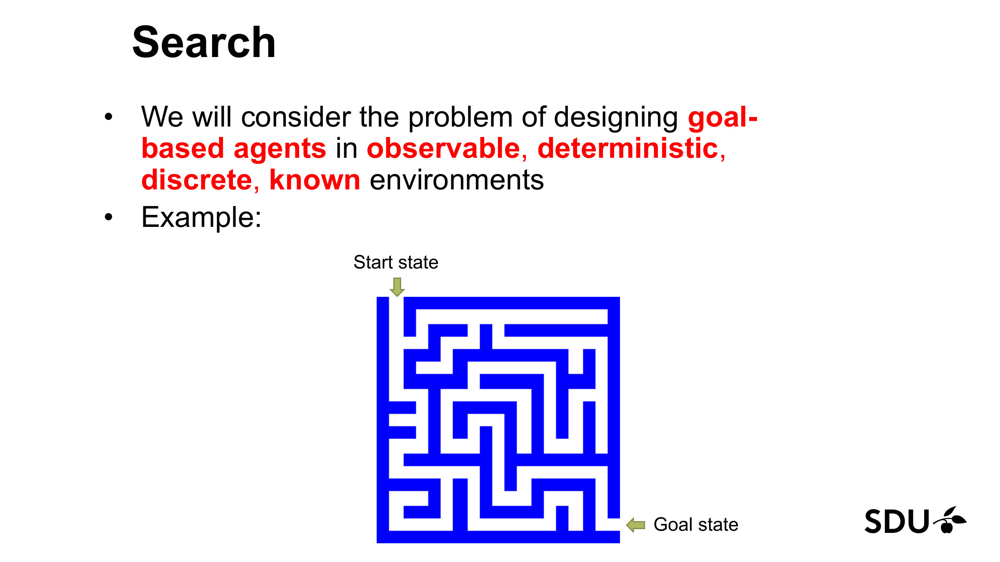
*Figure 1: The maze on slide 8. Start state at top-left, goal state at bottom-right. The maze is observable (we can see the whole map), deterministic (a "down" move always goes down), discrete (cells are countable), and known (the layout is given). This is the setting where uninformed search applies. (Lecture 3, slide 8.)*

### 2.2 BFS is like checking every house on each street before walking to the next street

You're a postman delivering one urgent letter. You don't know which house gets it, only the address description. **BFS** is: knock on every house on the current street, *then* move one block out, knock on every house on that street, *then* move one more block out, and so on. You'll definitely find the right house, and because you're checking by distance you'll find it via the shortest route (in blocks). The downside: by the time you reach the third block out you're carrying every address you've already visited in your head — your memory grows with the area of city explored, not its radius.

**Where it breaks down.** In real BFS you don't "knock" — you only record that a node has been generated and add it to a FIFO queue. The postman analogy under-sells how badly the memory cost ($O(b^d)$) bites in practice: for a search tree with branching factor $b = 10$ and depth $d = 10$, BFS holds **ten billion** nodes in the frontier.

### 2.3 DFS is like always taking the leftmost corridor and only backing up when you hit a wall

In the same maze, **DFS** is: at every junction, always pick the leftmost unexplored corridor and follow it as deep as it goes. If you hit a dead end (or a state you've already been to), back up one step and try the next-leftmost corridor at that junction. Carry on until you stumble into the goal — or until you've exhausted every option.

The good: you only ever need to remember the *single corridor of choices* you're currently committed to (i.e. one root-to-leaf path), so memory grows linearly with depth, not with the area you've explored. The bad: nothing stops the leftmost corridor from being infinitely long (or being a loop), in which case you walk forever without ever reaching the goal.

**Where it breaks down.** "Leftmost first" is a convention — DFS doesn't care about left vs right, only "deepest first". Also, the maze analogy makes DFS sound like it physically walks; remember, again, that the algorithm only manages a stack of nodes — it does not move.

### 2.4 UCS is like Dijkstra's wavefront flooding the cheapest paths first

Picture water trickling outward from the start node, but with each edge taking a different *time* to traverse (the edge's cost). At each tick, the water has reached every node whose cheapest path is at most the current cost; the *next* node to be flooded is the unflooded one with the smallest cheapest-path-so-far. **UCS** is exactly this: maintain a priority queue keyed by $g(n)$ = "cheapest cost from start to $n$ found so far", and at each step extend the cheapest partial path by one edge. Eventually the wavefront reaches the goal — and because we always extended the cheapest frontier first, no still-pending path could reach the goal more cheaply.

**Where it breaks down.** UCS doesn't push water; the priority queue, ordered by $g(n)$, plays the wavefront-spreading role. Also, UCS *reduces to BFS when every step costs the same* — the "cheapest" node at any moment is just the shallowest one (slide 36). It is only when step costs vary (the Romania map's road distances, for example) that UCS earns its keep.

### 2.5 IDS is like running BFS but pretending each new depth level is a fresh maze

**IDS** is: do a depth-first search but only let yourself go to depth 1. Find nothing? Throw away everything you've remembered and do a depth-first search to depth 2. Still nothing? Restart again to depth 3. Continue until you find the goal. You're paying for repeated work (the depth-2 search re-visits everything depth-1 already saw), but the over-payment is bounded because most of the work happens at the deepest level — the wasted work on shallower levels is asymptotically dominated.

You get DFS's tiny memory footprint *and* BFS's completeness/optimality (when step costs are equal). It's the textbook "best of both worlds" trick.

**Where it breaks down.** IDS only beats BFS in *space*, not time. The IDS time complexity is *the same big-O class as BFS* — $O(b^d)$ — because the dominant level is the last one. Saying "IDS is fast" without qualification is wrong; what's true is "IDS uses *DFS's* memory while delivering *BFS's* solution".

### 2.6 Frontier vs explored set is like "people I plan to call" vs "people I've already called"

The **frontier** (the slides call it the *fringe*) is the to-do list. The **explored set** is the "already done" list. The algorithm body is just: pick an item from the to-do list, do the work (= expand the node), move the item to the done list, and add the new sub-items to the to-do list. The order in which you pick items from the to-do list is the *search strategy*: FIFO ↦ BFS, LIFO ↦ DFS, priority by cost ↦ UCS.

**Where it breaks down.** The "people I plan to call" list also covers people who appear in the to-do list multiple times via different chains; without a fix the algorithm might call the same person twice. Hence slide 21's "to handle repeated states, keep an explored set and check the frontier for cheaper copies" — the analogy needs the deduplication step bolted on.

[Lecture 3, slides 2, 8–9, 20, 27, 36.]

---

## 3. Core Concepts

### 3.1 Problem-solving agent

A **problem-solving agent** (slide 4) is a goal-based agent that, *when the correct action is not obvious*, plans a sequence of actions that forms a path to a goal state. It treats the world as a state graph, ignores any incoming percept stream while executing the plan ("can close his/her eyes!", slide 9), and acts on a fixed action sequence computed off-line.

> **Recall the maze analogy from §2.1.** The maze-runner has perfect knowledge of the maze layout, so it can compute the whole route at the entrance — no need to look around once it starts walking.

The agent's planning task is reduced to *search*: find a path from the initial state to a goal state in the implicit graph of states reachable by the agent's actions.

#### 3.1.1 Slide-5 warm-up: three everyday problem-formulation examples

Before the formal definition (slide 10), the lecturer warms you up with three plain-English problems (slide 5). The point is to see the *same triple* — initial state, goal, available operators — recur:

- **Getting from home to SDU.** Initial = home; goal = at SDU; operators = walk, take bus, cycle, drive, train.
- **Loading a moving truck.** Initial = empty truck + a stack of boxes outside; goal = all boxes packed safely; operators = pick up a box and place it somewhere in the truck.
- **Getting settled in a new flat.** Initial = boxes everywhere, nothing on walls; goal = liveable apartment; operators = unpack-box, assemble-furniture, hang-picture, etc.

In each case the formal triple appears naturally. The slide is a teaching aid: it shows that "search problem" is not a mathematical artefact — it's the structure that already lives inside any goal-directed task.

### 3.2 Search problem definition

A search problem is specified by five components (slide 10):

1. **Initial state** $s_0$ — the state the agent starts in.
2. **Successor function** $\mathrm{SUCC}(s)$ (the slides also call this an *operator*; the glossary's canonical name is **successor function**) — given a state $s$, returns the set of $(\text{action}, \text{resulting state})$ pairs reachable in one step.
3. **Goal state** (or **goal test**) — a description of which states count as goals. The goal test returns true exactly on goal states.
4. **Path cost** — a non-negative function on paths, normally defined as the sum of **step costs** $c(s, a, s')$ along the path's actions. The slides assume $c \ge 0$ throughout (and UCS additionally requires $c \ge \epsilon > 0$ for completeness). Slide 7's single word "cost" splits, in slide 10, into the per-action *step cost* and the path-level *path cost*.
5. **Optimal solution** — a sequence of actions from $s_0$ to a goal state with the **lowest path cost**.

> **Notation.** Where the formal definition uses $g(n)$ it means *cost of the path from the root to node $n$ in the search tree*. The lecture introduces this notation only implicitly via "path cost" on slide 10, but it is the standard symbol throughout the field and is needed for the UCS time-complexity expression on slide 36. We use $g(n)$ everywhere from §3.4 onward, including in pseudocode and worked examples.

#### 3.2.1 The four design questions (slide 17)

Slide 17 packages the same five components as a *problem-formulation rubric* — when an exam question says "formulate problem X as a search task", these are the four questions you answer:

1. How do we represent the **state** of the world?
2. What is the **goal** and how do we recognise it?
3. What are the possible **actions**?
4. What **relevant** information do we encode to describe states, actions, and their effects?

Mapping back to the five components: Q1 fixes the *initial state* and the *state representation*; Q2 fixes the *goal test*; Q3 fixes the *successor function*; Q4 fixes the *step-cost function* and any auxiliary data the agent needs. Use this rubric the moment you see a new search problem on the exam.

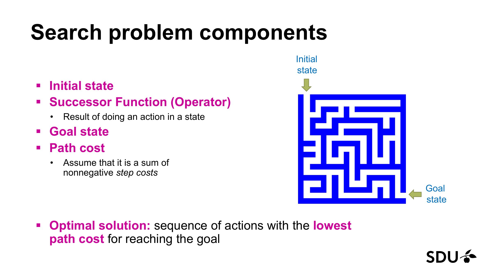
*Figure 2: Slide 10's annotation of the maze with the five formal components. Reading list, top-to-bottom: initial state at top-left arrow, successor function = "result of doing an action in a state", goal state at bottom-right arrow, path cost = sum of non-negative step costs, optimal solution = sequence of actions with lowest path cost. (Lecture 3, slide 10.)*

### 3.3 State, node, state space

A **state** is a representation of a configuration of the world the agent reasons about (a maze cell, a vacuum-world tuple `(agent-position, A-dirt, B-dirt)`, an 8-puzzle tile arrangement). A **node** is the data-structure-level object the search algorithm pushes around — it carries the underlying state *plus bookkeeping*: parent pointer, action taken to reach it, path cost, depth.

> **Nodes vs states (slide 20).** Multiple nodes can share the same state. For example, two different action sequences that arrive at the same 8-puzzle configuration produce two distinct nodes — each remembers a different path — but both refer to the same state. This is why "handling repeated states" is a separate algorithmic concern.

The **state space** (slide 12) is the set of all states reachable from $s_0$ by any sequence of actions. Equivalently it is the directed graph whose vertices are states and whose edges $s \xrightarrow{a} s'$ are determined by the successor function. The state-space *graph* is implicit — the algorithms never build it as a data structure; they unfold it node by node into a *search tree*.

#### 3.3.1 How big can state spaces get? — the n-Puzzle (slide 15)

To anchor "state space" to a number the lecturer puts up these counts (slide 15):

- **8-puzzle:** $9!/2 = 181{,}440$ states.
- **15-puzzle:** $16!/2 > 10^{13}$ — more than ten *trillion* states.
- **24-puzzle:** $\approx 10^{25}$ states.

And — slide 15 in bold — **finding an optimal solution to the n-Puzzle is NP-hard**. That is, no known algorithm finds the *shortest* solution sequence in time polynomial in $n$. This is the kind of stand-alone theoretical fact the exam may test as a one-mark recall question, so commit it to memory: *"optimal n-Puzzle is NP-hard"*.

The factor $1/2$ in $9!/2$ comes from the fact that exactly half of the $9!$ tile arrangements are reachable from any given starting configuration (the other half live in a disconnected component, distinguishable by tile-permutation parity).

### 3.4 Search tree, frontier, node expansion

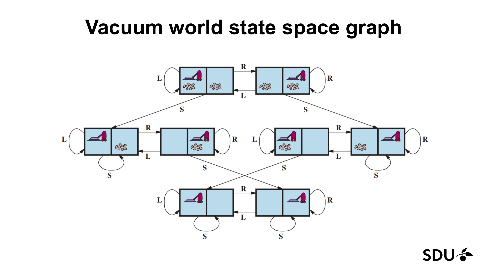
*Figure 3: The complete state-space graph for the 2-cell vacuum world (slide 14). Eight reachable states, each a (position, A-clean?, B-clean?) tuple. L moves left, R moves right, S sucks. Self-loops capture actions with no effect (e.g. L when already in the left cell). This graph is small enough to enumerate; in larger problems we never build it explicitly. (Lecture 3, slide 14.)*

A **search tree** is built lazily by *expanding* nodes:

1. Start with a root containing $s_0$.
2. **Expand** a node $n$ — i.e. apply the successor function to $n$.state and create child nodes for every $(\text{action}, s')$ pair.
3. Add the children to the **frontier** (the lecturer's slides call it the *fringe*; the glossary canonical name is **frontier**, with *fringe* as an alternate name from the source).
4. Pick the next node to expand from the frontier — *the order in which you pick is the search strategy*.

A solution is a path from the root to a goal-state node. The algorithm template is identical across all four uninformed strategies — they differ *only* in the data structure used for the frontier (FIFO, LIFO, priority queue) and therefore in the order of expansion.

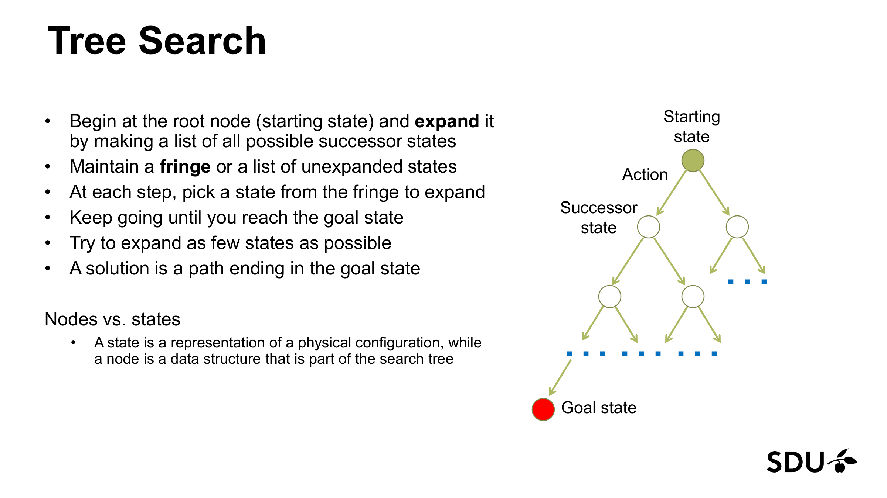
*Figure 4: Slide 20's generic search-tree picture. The root is the starting state; each downward edge is one action; the red leaf is a goal state. The algorithm grows this tree node by node, expanding one node at a time. (Lecture 3, slide 20.)*

The generic algorithm (slide 21) is:

```text
TREE-SEARCH(problem):
    frontier ← { node(s0) }
    explored ← ∅                                 # set, indexed by state
    while frontier is not empty:
        n ← pop(frontier)                        # strategy decides which
        if goal-test(n.state):
            return solution(n)                   # walk parent pointers back
        explored ← explored ∪ { n.state }
        for each (a, s') in SUCC(n.state):
            child ← node(state=s', parent=n, action=a,
                         g=n.g + c(n.state, a, s'))
            if s' ∉ explored and child.state not already in frontier:
                push(frontier, child)
            else if s' is in frontier with higher g than child.g:   # UCS-only
                replace the existing frontier node with `child`
    return failure
```

> **Tree search vs graph search.** The slides call this *Tree Search*, but the "explored set" and the "replace if cheaper in frontier" check make it **graph search** in the Russell & Norvig sense. The distinction matters:
> - **Tree search (pure form):** no explored set, no frontier dedup. The algorithm can re-generate and re-expand the same state via different paths, blowing up the time complexity in cyclic state spaces and potentially looping forever.
> - **Graph search (this template):** the explored set blocks re-expansion of finished states; the frontier-dedup check keeps only the cheapest known path to each state still on the frontier. This is what every reasonable implementation does and what the chapter assumes from here on.
>
> The "replace if cheaper" branch is **only meaningful for UCS** (or any cost-aware strategy). BFS expands in FIFO order — the first-added copy will be popped first regardless of cost — and DFS doesn't look at cost at all. So the BFS and DFS pseudocode in §4 drops this branch; UCS keeps it.
>
> **Exam note:** the lecturer's terminology is "tree search". When an exam question uses that phrase, follow the lecturer; the underlying algorithm is the graph-search variant above.

### 3.5 Branching factor, depth, max depth

Slide 28 defines three parameters used by every complexity bound in the lecture:

- **$b$ — branching factor**: the maximum number of successors of any node in the search tree. (Russell & Norvig give $b \approx 35$ for chess and $b \le 4$ for the 8-puzzle as standard background values — these are not on the L03 slides, but they are useful sanity-check numbers when comparing algorithms.)
- **$d$ — depth of the shallowest goal**: the length (in actions) of the shortest path from $s_0$ to any goal state. If no solution exists, $d$ is sometimes taken to be $m$ or $\infty$.
- **$m$ — maximum length of any path in the state space** (slide 28): possibly $\infty$ if the state space has loops or unbounded depth.

> **Slide 28 vs slide 54 wording on $d$.** Slide 28 phrases $d$ as the depth of "the least-cost (cheapest) solution"; slide 54's footnote (matching Russell & Norvig) phrases it as the depth of the *shallowest* solution. The two coincide whenever step costs are uniform — which is the only regime in which $d$ enters the BFS/IDS optimality bound anyway. We follow the slide-54 / textbook convention ("shallowest") throughout this chapter. If your exam crib-sheet uses slide-28's wording, the answer is still the same number for the BFS/IDS use-cases.

A complete $b$-ary tree of depth $d$ contains
$$1 + b + b^2 + \dots + b^d = \frac{b^{d+1}-1}{b-1} = O(b^d)$$
nodes — the constant the slides drop. Every complexity bound in §4 is in terms of $b, d, m$.

### 3.6 Search-strategy evaluation dimensions

A **search strategy** is an order on the frontier. The four dimensions used to evaluate strategies (slide 27) are:

- **Completeness** — does the strategy find a solution whenever one exists, *and* correctly report failure when no solution exists?
- **Optimality** — does it find a least-cost solution (not merely *some* solution)?
- **Time complexity** — how many nodes does it generate, as a function of $b, d, m$?
- **Space complexity** — how many nodes does it hold at peak, as a function of $b, d, m$?

> **Recall the postman analogy from §2.2 and the leftmost-corridor analogy from §2.3.** Optimality is "you find the *shortest* route, not just *a* route"; completeness is "the postman always finds the right house *eventually*, not just *most of the time*". A strategy may have one without the other (DFS is neither complete in infinite spaces nor optimal anywhere).

### 3.7 Uninformed vs informed search

Slide 29 defines **uninformed search** as the family of strategies that use *only* the information in the problem definition — initial state, successor function, goal test, step costs. They do not exploit any domain-specific estimate of "distance to goal". The four uninformed strategies in this lecture are BFS, UCS, DFS, IDS.

**Informed search** (slide 7) adds a **heuristic function** $h(n)$ — an estimate of cost-to-go from $n$ to the nearest goal. Greedy best-first uses $h(n)$ alone; A\* uses $f(n) = g(n) + h(n)$. *These are referenced in L03 but not derived* (slide 54 explicitly leaves them "for the book") — see §7 for the forward links to later chapters.

### 3.8 A\* (forward reference only)

For exam-cheat-sheet completeness, you should know that A\*'s evaluation function is $f(n) = g(n) + h(n)$, where $g(n)$ is the path-cost-so-far we already defined and $h(n)$ is the heuristic estimate. A\*'s completeness, optimality, and the conditions on $h$ that make those guarantees hold are **not derived in L03** — see [L05 — Local Search](L05-Local-Search.md) and the glossary's `A* search` entry (tagged `FWD-REF`). You do **not** need those conditions for an L03-only exam.

[Lecture 3, slides 4, 8–10, 12–17, 20–21, 27–29; A\* forward reference: slide 7, slide 54.]

---

## 4. Algorithms / Methods

This section gives each of the four uninformed strategies a self-contained treatment: implementation, completeness/optimality/time/space, and the "when to prefer this over the others" decision. Depth-Limited DFS (the IDS subroutine, slide 54) gets its own subsection §4.4.0.

### 4.1 Breadth-first search (BFS)

**Idea** (slide 30). Expand the shallowest unexpanded node first. New successors are appended to the **end** of the frontier.

**Implementation.** Frontier is a **FIFO queue**. The generic algorithm of §3.4 specialised to BFS is:

```text
BFS(problem):
    frontier ← FIFO_queue([ node(s0) ])
    explored ← ∅
    while frontier not empty:
        n ← dequeue(frontier)          # front of queue
        if goal-test(n.state): return solution(n)
        explored ← explored ∪ { n.state }
        for each (a, s') in SUCC(n.state):
            if s' ∉ explored ∧ s' not in frontier:
                enqueue(frontier, child(n, a, s'))
```

**Properties (slide 35):**

- **Complete?** Yes (provided $b$ is finite).
- **Optimal?** Yes — *but only when every step costs the same*. The slide phrases this as "Yes – if cost = 1 per step"; slide 54's footnote 3 generalises to "cost-optimal if action costs are all identical". The two are equivalent up to a rescaling. (For an exam that asks "exactly when is BFS optimal?", quoting the slide's "cost = 1 per step" is the safest answer.)
- **Time?** $O(b^d)$ — the tree out to depth $d$ has $\le b^d$ leaves and roughly the same number of internal nodes.
- **Space?** $O(b^d)$. *This is the killer.* For $b = 10, d = 10$, the frontier alone holds $\sim 10^{10}$ nodes; at a few bytes each that's tens of gigabytes. Slide 35: *"Space is the bigger problem (more than time)."*

**When to use.** When the state space is shallow and step costs are uniform — and you can afford the memory. Otherwise consider IDS (similar time, dramatically less memory).

### 4.2 Uniform-cost search (UCS)

**Idea** (slide 36). Expand the unexpanded node with the *lowest path cost* $g(n)$ first.

**Implementation.** Frontier is a **priority queue** ordered by $g(n)$. A crucial detail: the goal test is performed when a node is *popped* from the queue (i.e. when chosen for expansion), not when generated — otherwise a sub-optimal goal node could be returned just because it was generated early. Slide 36's properties list does not flag this explicitly, but slide 37's trace makes it implicit (Step 6 generates G at cost 8 but does not return; Step 8 pops G and returns the solution).

```text
UCS(problem):
    frontier ← priority_queue([ node(s0) ], key=g)
    explored ← ∅
    while frontier not empty:
        n ← pop_min(frontier)                            # lowest g(n)
        if goal-test(n.state): return solution(n)        # UCS-SPECIFIC: test on POP, not on push
        explored ← explored ∪ { n.state }
        for each (a, s') in SUCC(n.state):
            child ← child(n, a, s')                       # child.g = n.g + c(n.state, a, s')
            if s' ∉ explored ∧ s' not in frontier:
                push(frontier, child)
            else if s' in frontier with higher g than child.g:
                replace existing node with child         # UCS-SPECIFIC: cheaper-replace
```

#### 4.2.1 Why goal-test on POP, not on PUSH

Consider a tiny graph: $S \xrightarrow{1} G_1$ and $S \xrightarrow{2} A \xrightarrow{1} G_2$, where both $G_1$ and $G_2$ are goal states. Optimal is the 1-step path $S \to G_1$ with cost 1.

**Assumption.** The successor function returns $S$'s children in declaration order: $G_1$ first, then $A$.

- **Goal-test on PUSH (wrong).** Expand $S$. Generate $G_1$ at $g=1$ — goal-test on push fires immediately, return $S \to G_1$, cost 1. Looks fine *here*. But change the weights to $S \xrightarrow{6} G_1$ and $S \xrightarrow{2} A \xrightarrow{1} G_2$. Now $S$ generates $G_1$ first (at cost 6); goal-test on push fires immediately and returns the 6-cost path. $A$ hasn't even been pushed yet, let alone expanded, so $G_2$ doesn't exist on the fringe — **sub-optimal**, because the 3-cost path through $A$ is still pending.
- **Goal-test on POP (correct).** Expand $S$. Generate $G_1$ at $g=6$ and $A$ at $g=2$. Don't test yet. Pop the cheapest: $A$ at $g=2$. Goal-test $A$ — not a goal. Expand $A$, generate $G_2$ at $g=3$. Pop the cheapest now on the queue: $G_2$ at $g=3$. Goal-test $G_2$ — goal! Return cost-3 path. **Optimal.**

That is the whole reason for the "test on pop" rule.

**Properties (slide 36):**

- **Complete?** Yes — provided every step cost is at least $\epsilon > 0$. (If steps can have zero cost, UCS may loop expanding zero-cost cycles forever.)
- **Optimal?** Yes — nodes are expanded in non-decreasing order of $g(n)$, so by the time a goal is popped no cheaper path to any goal can exist.
- **Time?** $O\!\bigl(b^{\,1 + \lfloor C^*/\epsilon \rfloor}\bigr)$ where $C^*$ is the cost of the optimal solution and $\epsilon$ is the smallest step cost. (Slide 36 prints this with generic brackets `[ ]`; slide 54 confirms the brackets are the floor function $\lfloor \cdot \rfloor$.) This bound can be **much larger** than $b^d$: the search may chase long paths of small-cost steps before pruning shorter paths of larger-cost steps.
- **Space?** $O\!\bigl(b^{\,1 + \lfloor C^*/\epsilon \rfloor}\bigr)$.
- **Reduces to BFS** when every step cost is equal.

**When to use.** When step costs vary — Romania-style route planning is the canonical example. Use BFS instead when step costs are uniform (UCS reduces to it anyway, but a FIFO queue is cheaper than a priority queue).

### 4.3 Depth-first search (DFS)

**Idea** (slide 38). Expand the *deepest* unexpanded node first. New successors are placed at the **front** of the frontier so the next pop hits one of them.

**Implementation.** Frontier is a **LIFO stack** (or recursive call stack).

```text
DFS(problem):
    frontier ← stack([ node(s0) ])
    explored ← ∅
    while frontier not empty:
        n ← pop(frontier)              # top of stack
        if goal-test(n.state): return solution(n)
        explored ← explored ∪ { n.state }
        for each (a, s') in SUCC(n.state):
            if s' ∉ explored ∧ s' not in frontier:
                push(frontier, child(n, a, s'))
```

**Properties (slide 47):**

- **Complete?** **No** in infinite-depth spaces or spaces with loops — DFS can descend forever down an infinite chain or cycle. The modification "avoid repeated states along the current path" makes DFS *complete in finite spaces only*.
- **Optimal?** **No** — it returns the first solution it finds, which may be deep and expensive.
- **Time?** $O(b^m)$ where $m$ is the maximum depth — *terrible* when $m \gg d$, because DFS may explore an entire deep sub-tree that contains no goal before backtracking. *But* when the state space is dense in solutions, DFS may stumble on one much faster than BFS.
- **Space?** $O(b \cdot m)$ — **linear in depth**, not exponential. This is the headline advantage: at any point DFS only stores the current root-to-leaf path plus the un-explored siblings along that path.

**When to use.** When memory is the binding constraint, the state space has bounded depth, and you don't care about optimality. Rarely the right choice in its raw form; the standard recommendation is its derivative **IDS** (§4.4).

### 4.4 Iterative deepening search (IDS)

#### 4.4.0 Depth-limited DFS — the IDS subroutine

Before IDS, define its building block (slide 54 also lists it as a strategy in its own right):

**Depth-limited DFS** runs DFS but refuses to expand any node at depth $\ge \ell$. It has three possible outcomes:

1. **Solution found** — return the path. (Same as plain DFS.)
2. **`failure`** — the entire sub-tree to depth $\ell$ was explored and contained no goal. (Sub-tree fully searched, no goal exists at depth $\le \ell$.)
3. **`cutoff`** — DFS ran into the depth limit at least once without finding a goal. (Solutions might exist deeper; we just didn't look there.)

Depth-limited DFS has $O(b^\ell)$ time and $O(b\,\ell)$ space — same big-O profile as raw DFS but with $m$ replaced by $\ell$. It is **complete** only when $\ell \ge d$ (otherwise it returns `cutoff`) and **never optimal** in non-uniform step costs.

The `cutoff` vs `failure` distinction matters: `cutoff` means "try a deeper limit"; `failure` means "no solution exists, stop". IDS uses the distinction to decide whether to keep going.

#### 4.4.1 IDS itself

**Idea** (slide 48). Run a sequence of depth-limited DFS searches — depth-limit 0, 1, 2, 3, ... — until a depth limit catches the goal.

```text
IDS(problem):
    for ℓ = 0, 1, 2, …:
        result ← DEPTH-LIMITED-DFS(problem, ℓ)
        if result ≠ "cutoff":            # success or definitive failure
            return result
```

**Properties (slide 53):**

- **Complete?** Yes — as long as $b$ is finite, IDS will eventually run with $\ell = d$ and find the goal.
- **Optimal?** Slide 53 says: "Yes, if step cost = 1." Slide 54's footnote 3 generalises to "cost-optimal if action costs are all identical". Both phrasings agree; use the one your exam uses. Because each iteration explores depth-by-depth, IDS returns the *shallowest* goal — same guarantee as BFS.
- **Time?** Summing the work at each depth: the level-$\ell$ DFS explores up to $b^\ell$ nodes, *plus* repeats every shallower level. Slide 53's accounting:
  $$(d+1)\,b^0 + d\,b^1 + (d-1)\,b^2 + \dots + 1\cdot b^d = O(b^d).$$
  Same big-O as BFS — the repeated shallow work is dominated by the final level.
- **Space?** $O(b\,d)$ — DFS's *linear* memory cost, because at any moment IDS is running one DFS to a bounded depth.

**The "best of both worlds" claim.** IDS gives you BFS's completeness and optimality with DFS's memory. The price is the over-counting of shallower levels, which is asymptotically negligible (the dominant level is the last one; total overhead is a factor $b/(b-1)$ in the limit, $\approx 1.11$ for $b=10$). This is why IDS is the *textbook* default recommendation in uninformed-search settings where $b$ is finite and step costs are uniform; the L03 slides don't quite say "default" but the property comparison makes the case obvious.

### 4.5 Side-by-side comparison

The comparison table appears on slide 54. The lecturer annotates two columns — Depth-Limited and Bidirectional — with *"these two haven't covered, but you can read about them in the book"*. We retain them in the table because they appear on the slide; the cheat-sheet in §8 retains only the four covered methods.

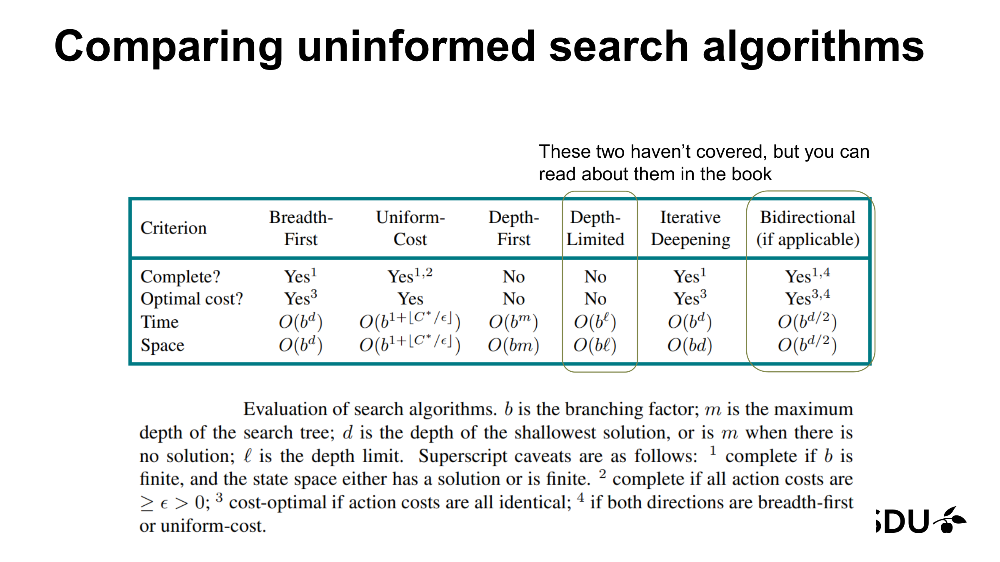
*Figure 5: Slide 54's table. Footnotes: ¹ complete if $b$ is finite, and the state space either has a solution or is finite; ² complete if all action costs are $\ge \epsilon > 0$; ³ cost-optimal if action costs are all identical; ⁴ if both directions are breadth-first or uniform-cost. Depth-Limited and Bidirectional are flagged as not covered in this lecture. (Lecture 3, slide 54.)*

A typeset version of the same data, restricted to what the lecture actually teaches:

| Criterion       | BFS                    | UCS                                    | DFS                  | IDS                    |
|-----------------|------------------------|----------------------------------------|----------------------|------------------------|
| Complete?       | Yes¹                   | Yes¹,²                                 | No                   | Yes¹                   |
| Optimal?        | Yes³                   | Yes                                    | No                   | Yes³                   |
| Time            | $O(b^d)$               | $O(b^{1+\lfloor C^*/\epsilon\rfloor})$ | $O(b^m)$             | $O(b^d)$               |
| Space           | $O(b^d)$               | $O(b^{1+\lfloor C^*/\epsilon\rfloor})$ | $O(b\,m)$            | $O(b\,d)$              |

**Footnotes (same as the slide):**

¹ complete if $b$ is finite and the state space either has a solution or is finite.

² complete if every action cost is $\ge \epsilon > 0$.

³ cost-optimal if action costs are all identical.

#### 4.5.1 The two not-covered strategies (for completeness)

Slide 54 lists two more strategies, with the lecturer's "haven't covered" annotation. They appear on the slide and the exam writer may include them in a multiple-choice question, so a one-paragraph orientation:

- **Depth-Limited search** is plain DFS with a depth cap (see §4.4.0). Time $O(b^\ell)$, space $O(b\,\ell)$. Complete only if $\ell \ge d$; never optimal under non-uniform costs.
- **Bidirectional search** runs two searches at the same time: one forward from $s_0$, one backward from the goal. The searches meet in the middle. With BFS in both directions the time is $O(b^{d/2})$ rather than $O(b^d)$ — a square-root speed-up. (Hard to apply when the goal is described by a *test* rather than a single state, because then you can't easily search backward.) Complete iff both directions are complete (e.g. both BFS or both UCS — footnote 4 on slide 54).

These remain *not derived* in L03. Use the time/space numbers above only if the exam directly quotes the slide-54 table.

**Reading the table.** Two practical lessons jump out: (i) UCS is the only one that handles non-uniform step costs *correctly*, and it pays for it with a potentially much larger time/space exponent; (ii) IDS strictly dominates BFS in space at the same big-O time cost, so when step costs are uniform and you cannot afford BFS's frontier, switch to IDS.

[Lecture 3, slides 21, 27–36, 47, 53–54.]

---

## 5. Worked Examples

Every search example shown in the lecture is reproduced here with the trace expanded so the algorithm steps are explicit. Two additional traces (vacuum world BFS, Romania UCS-to-completion) extend the lecture's set-up.

### 5.1 Vacuum world — formulation and BFS trace

**Problem (slide 13).** A two-cell world with cells $A$ (left) and $B$ (right). The agent is in one cell and each cell is dirty or clean. The agent has three actions: $L$ (move left), $R$ (move right), $S$ (suck).

**State.** A tuple `(agent-cell, A-dirty?, B-dirty?)`. There are $2 \times 2 \times 2 = 8$ reachable states.

**Initial state.** Any of the 8. **Goal state.** Both cells clean — `A-dirty? = false` and `B-dirty? = false`. Two of the 8 states satisfy this (one with the agent in $A$, one with the agent in $B$).

**Successor function.**

- $L$: agent moves to $A$ (no-op if already in $A$). Dirt unchanged.
- $R$: agent moves to $B$ (no-op if already in $B$). Dirt unchanged.
- $S$: the agent's current cell becomes clean. Position unchanged.

**Path cost.** 1 per action (or "amount of electricity used" — slide 13).

#### 5.1.1 BFS trace from the worst case

Initial state: agent in $A$, both dirty. Abbreviate states as `(pos, A?, B?)` with `1` = dirty, `0` = clean. Initial = `(A,1,1)`. Goal: any state with `A?=0, B?=0`.

**Successor reminder.** Action $S$ cleans the agent's *current* cell only — it cannot affect the other cell. So expanding $(B,1,0)$ under $S$ leaves the state at $(B,1,0)$ (the agent is in $B$, which is already clean; $A$ is dirty but unreachable from action $S$ in $B$). The only way to reach the goal $(B,0,0)$ is through $(B,0,1) \xrightarrow{S} (B,0,0)$ or $(A,0,0) \xrightarrow{R} (B,0,0)$.

| Step | Action | Frontier (FIFO) | Explored |
|------|--------|------------------|----------|
| 0 | init | `[(A,1,1)]` | – |
| 1 | pop `(A,1,1)`, not goal. Expand. $L$→`(A,1,1)` (self-loop, already in explored, skip). $R$→`(B,1,1)`. $S$→`(A,0,1)`. | `[(B,1,1), (A,0,1)]` | `{(A,1,1)}` |
| 2 | pop `(B,1,1)`, not goal. Expand. $L$→`(A,1,1)` (in explored, skip). $R$→`(B,1,1)` (self-loop, in explored, skip). $S$→`(B,1,0)`. | `[(A,0,1), (B,1,0)]` | `+ (B,1,1)` |
| 3 | pop `(A,0,1)`, not goal. Expand. $L$→`(A,0,1)` (self-loop, in explored, skip). $R$→`(B,0,1)`. $S$→`(A,0,1)` (in explored, skip — $A$ already clean). | `[(B,1,0), (B,0,1)]` | `+ (A,0,1)` |
| 4 | pop `(B,1,0)`, not goal. Expand. $L$→`(A,1,0)`. $R$→`(B,1,0)` (self-loop, in explored, skip). $S$→`(B,1,0)` (no-op — $B$ already clean, agent cannot reach $A$'s dirt; in explored, skip). | `[(B,0,1), (A,1,0)]` | `+ (B,1,0)` |
| 5 | pop `(B,0,1)`, not goal. Expand. $L$→`(A,0,1)` (in explored, skip). $R$→`(B,0,1)` (self-loop, in explored, skip). $S$→`(B,0,0)` ← **goal candidate, but BFS tests on expansion not on generation, so don't return yet.** | `[(A,1,0), (B,0,0)]` | `+ (B,0,1)` |
| 6 | pop `(A,1,0)`, not goal. Expand. $L$→`(A,1,0)` (self-loop, in explored, skip). $R$→`(B,1,0)` (in explored, skip). $S$→`(A,0,0)` ← goal candidate, not yet returned. | `[(B,0,0), (A,0,0)]` | `+ (A,1,0)` |
| 7 | pop `(B,0,0)` — **goal!** Walk parent pointers: $(B,0,0) \xleftarrow{S} (B,0,1) \xleftarrow{R} (A,0,1) \xleftarrow{S} (A,1,1)$. Return path **$S, R, S$** (cost 3). | – | – |

Optimal action sequence from initial state `(A,1,1)`: **$S$ (clean A), $R$ (move to B), $S$ (clean B)** — three actions, cost 3. BFS finds this because uniform step cost makes BFS optimal.

### 5.2 Romania route planning (search-tree expansion and UCS trace)

**Problem (slide 11, 18).** Currently in Arad, must reach Bucharest. The state is "current city"; the successor function returns adjacent cities (with the road distance as the step cost).

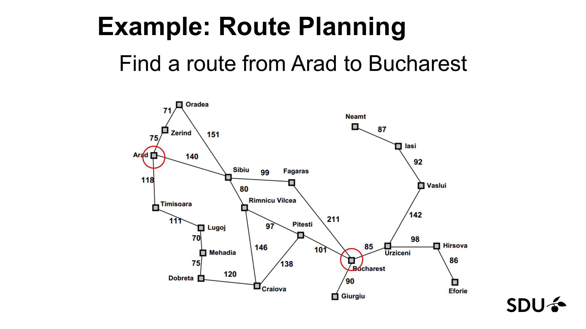
*Figure 6: The Romania road graph (slide 18). Each edge is labelled with a step cost in road-distance units. Arad → Sibiu = 140, Sibiu → Fagaras = 99, Fagaras → Bucharest = 211, etc. The state space has 20 cities. (Lecture 3, slide 18.)*

#### 5.2.1 Generic tree-search trace (slides 22–26)

The slides walk through the first few expansions of a generic tree search starting from Arad.

1. **Step 0 — initial.** Frontier = `{Arad}`. Expand Arad. Children: `{Sibiu, Timisoara, Zerind}`. Frontier becomes `{Sibiu, Timisoara, Zerind}`.

   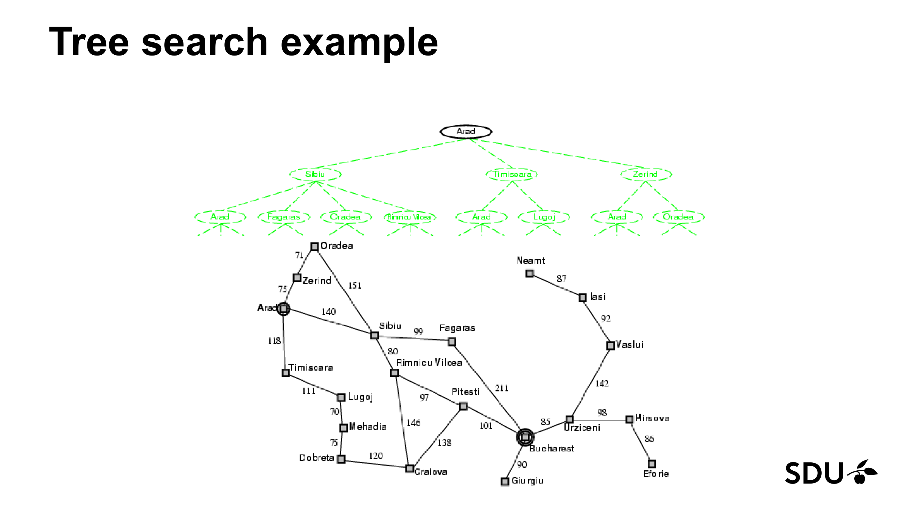
   *Figure 7a: Arad expanded (filled in the tree); its three children are now on the frontier. (Lecture 3, slide 22.)*

2. **Step 1 — pick from frontier, expand Sibiu.** Sibiu's children are `{Arad, Fagaras, Oradea, Rimnicu Vilcea}`. Frontier now includes them plus `{Timisoara, Zerind}`. Notice the duplicate "Arad" in the tree — that's why we need the repeated-state check.

   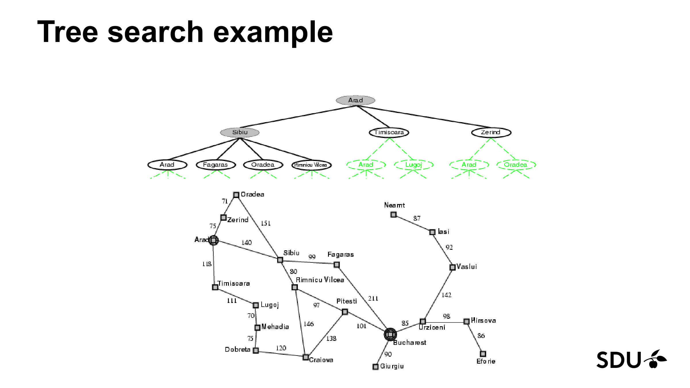
   *Figure 7b: Sibiu expanded; four new children join the tree. The frontier (slide 26 outlines it in red) is now `{Arad, Fagaras, Oradea, Rimnicu Vilcea, Timisoara, Zerind}`. (Lecture 3, slides 25–26.)*

   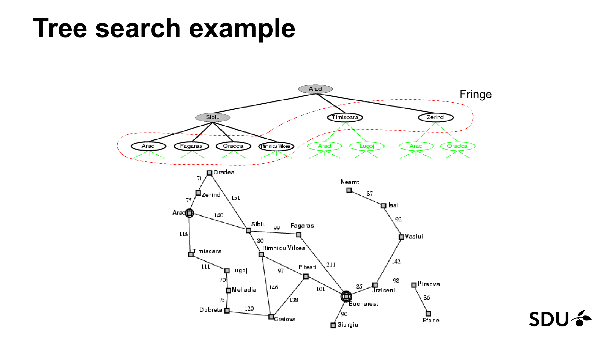
   *Figure 7c: The same tree with the red dotted outline marking the current frontier — every leaf of the partially-expanded tree is in it. (Lecture 3, slide 26.)*

After this step, each strategy picks differently. **Important framing:** this is a *hypothetical* "if the tree had grown to this shape, what would each strategy pick next?" exercise — not a real trace. UCS in particular would *never* have expanded Sibiu before Zerind, since Zerind sits at $g=75$ vs Sibiu at $g=140$ in the initial frontier. The actual end-to-end UCS trace is in §5.2.2. Using the slide-18 edge costs (Arad→Sibiu=140, Arad→Timisoara=118, Arad→Zerind=75):

- **BFS** (FIFO): the queue order after Sibiu's expansion is `[Timisoara, Zerind, Arad', Fagaras, Oradea, Rimnicu Vilcea]`. Next pop = **Timisoara**.
- **UCS** (priority by $g$): if we *were* at this point, fringe costs would be Zerind:75, Timisoara:118, Sibiu's children (with their distances to compute: e.g. Fagaras at $140+99=239$, Rimnicu Vilcea at $140+80=220$, Arad' at $140+140=280$, Oradea at $140+151=291$). Cheapest = **Zerind ($g=75$)** — which is why UCS would actually have popped Zerind *before* expanding Sibiu in a real trace.
- **DFS** (LIFO, last-pushed first): the most recently pushed child of Sibiu is the rightmost in the slide's tree — **Rimnicu Vilcea**.

Each pick anchors *search strategy = order on the frontier* — the whole pedagogical point of having three strategies on the same tree.

#### 5.2.2 UCS Arad → Bucharest (sketch to completion)

UCS run end-to-end on Romania (with the slide-18 distances) finds the optimal path **Arad → Sibiu → Rimnicu Vilcea → Pitesti → Bucharest** with total cost **418**. The priority queue evolves roughly as follows (showing only currently-smallest entries; full trace would take 14 expansions):

1. Pop Arad (0). Generate Zerind(75), Timisoara(118), Sibiu(140).
2. Pop Zerind(75). Generate Oradea(146 via Zerind=75+71), Arad' (skip, in explored).
3. Pop Timisoara(118). Generate Lugoj(229).
4. Pop Sibiu(140). Generate Arad'(skip), Oradea via Sibiu(140+151=291; existing Oradea is 146, no replace), Fagaras(239), Rimnicu Vilcea(220).
5. Pop Oradea(146). Generate Sibiu'(skip, in explored), Zerind'(skip).
6. Pop Rimnicu Vilcea(220). Generate Sibiu'(skip), Craiova(366), Pitesti(317).
7. Pop Lugoj(229). Generate Mehadia(299), Timisoara'(skip).
8. Pop Fagaras(239). Generate Bucharest(239+211=450), Sibiu'(skip).
9. Pop Mehadia(299). Generate Drobeta(374), Lugoj'(skip).
10. Pop Pitesti(317). Generate Bucharest(317+101=418) → existing Bucharest at 450 is more expensive → **replace** with Bucharest(418).
11. Pop Craiova(366). Generate Pitesti'(skip), Drobeta(366+120=486; existing 374, no replace).
12. Pop Drobeta(374). Generate Mehadia'(skip), Craiova'(skip).
13. Pop Bucharest(418) — **goal!** Return path Arad → Sibiu → Rimnicu Vilcea → Pitesti → Bucharest, cost **418**.

This is the canonical Russell & Norvig answer for Romania. Note the key "replace if cheaper" step at step 10: without it, UCS would return the suboptimal 450-cost path through Fagaras.

### 5.3 UCS worked example on a small graph (slide 37)

This is the most exam-relevant figure of the lecture. Read this section line-by-line against Figure 8 below.

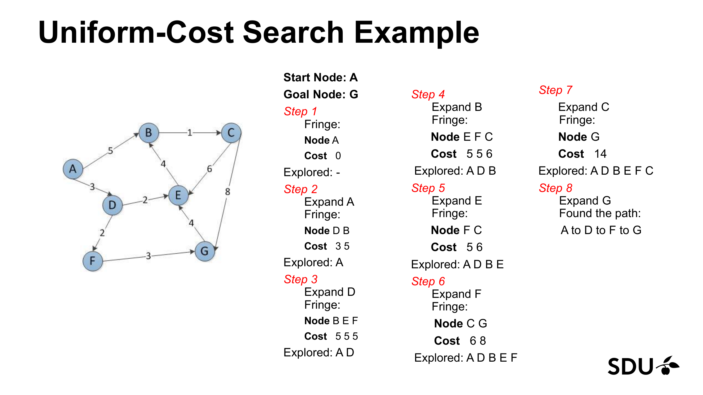
*Figure 8: The UCS step-by-step trace on slide 37. Each step shows the fringe (Node row + Cost row) and the explored set. (Lecture 3, slide 37.)*

**Problem.** Find the cheapest path from $A$ to $G$.

**Edge list** (read directly off the slide-37 graph; all edges directed left-to-right or top-to-bottom):

| Edge | Cost |
|------|------|
| $A \to B$ | 5 |
| $A \to D$ | 3 |
| $B \to C$ | 1 |
| $C \to E$ | 6 |
| $C \to G$ | 8 |
| $D \to E$ | 2 |
| $D \to F$ | 2 |
| $E \to G$ | 4 |
| $F \to G$ | 3 |

**Canonical interpretation of $E \to G$ (used everywhere in this chapter).** The $E \to G = 4$ edge is part of the graph (it appears in the edge list above and is visible on slide 37). The slide-37 *trace*, however, does not add a $G$ entry to the fringe when $E$ is expanded at step 5 — an apparent slide bug or simplification. This chapter resolves the tension as follows: §5.3 reproduces the slide-37 trace verbatim (so step 5 produces no new fringe additions, matching the slide for exam-reproduction purposes); §5.7 uses the *full* edge list including $E \to G = 4$ to analyse BFS-vs-UCS behaviour. When in doubt on the exam, follow the slide-37 trace; when reasoning about BFS-vs-UCS, treat $E \to G$ as a normal edge.

**Step-by-step trace (matches slide 37 exactly):**

| Step | Action | Fringe (Node : $g$) | Explored |
|------|--------|---------------------|----------|
| 1 | start | `A : 0` | – |
| 2 | Expand A. Successors: D ($g=0+3=3$), B ($g=0+5=5$). | `D : 3,  B : 5` | `A` |
| 3 | Expand D ($g=3$). Successors: E ($g=3+2=5$), F ($g=3+2=5$). B already in fringe at $g=5$ from step 2 — unchanged. | `B : 5,  E : 5,  F : 5` | `A, D` |
| 4 | Expand B ($g=5$). Successor: C ($g=5+1=6$). | `E : 5,  F : 5,  C : 6` | `A, D, B` |
| 5 | Expand E ($g=5$). No new fringe additions per slide 37. *(The $E\to G$ edge is on the graph but the slide does not add G via E here; see edge-list note above.)* | `F : 5,  C : 6` | `A, D, B, E` |
| 6 | Expand F ($g=5$). Successor: G ($g=5+3=8$). | `C : 6,  G : 8` | `A, D, B, E, F` |
| 7 | Expand C ($g=6$). Successor via $C \to G$: G has $g = 6+8 = 14$. *(Slide 37 prints the fringe as `G : 14` after this step. See pedagogical note below.)* | `G : 14`  *(per slide)* | `A, D, B, E, F, C` |
| 8 | Pop G, goal-test passes — **return path $A \to D \to F \to G$ with cost $3 + 2 + 3 = 8$**. | done | – |

> **What to write on the exam (read this first).**
> - If asked to **reproduce the slide-37 trace**, write `G : 14` for step 7 (matches the slide).
> - If asked to **explain UCS correctly**, write that $G : 8$ is retained (matches slide-21's "replace only if cheaper" rule).
> - If asked which path is **optimal**, the answer is $A \to D \to F \to G$ with cost **8** — both readings agree.
>
> **Why the slide and the algorithm disagree at Step 7.** Slide 37 shows the fringe at step 7 as `G : 14`, which suggests the slide overwrites the existing $G:8$ with the newly generated $G:14$. A correct UCS implementation following slide 21's "replace only if **cheaper**" rule would instead **keep $G:8$** (because 8 < 14) and discard the new $G:14$. Either way, **the final answer is the same**: the optimal path is $A \to D \to F \to G$ with cost 8, as the slide's Step 8 confirms. The slide-37 step-7 display is best read as "C *generates* G at cost 14" rather than "the priority queue now actually contains G at 14"; the slide's Step 8 immediately retrieves G as the path $A \to D \to F \to G$ (cost 8), which is only possible if the cheaper copy was retained behind the scenes.

> **Why the trace finds the optimum.** Whenever UCS pops a node $n$ from the priority queue, every node still in the queue has $g \ge g(n)$. So when the popped node is a goal, no still-pending node could reach a goal more cheaply. *This is the optimality argument for UCS in one sentence.*

#### 5.3.1 Counterfactual: when does the "replace if cheaper" rule fire?

In the step-7 trace above the rule does **not** fire ($G:14 > G:8$, so we'd keep the cheaper $G:8$). To see the rule fire, change the graph: suppose $D \to F$ cost were $4$ instead of $2$. Then:

- Step 3 would generate $F$ at $g = 3+4 = 7$ (and $E$ at $g=5$ unchanged).
- Suppose later we discovered a cheaper alternative: an edge $E \to F$ with cost $1$. Then expanding $E$ ($g=5$) would generate $F$ at $g = 5+1 = 6$. Since $F$ is already in the frontier at $g=7$, and $6 < 7$, the rule **fires** and the fringe entry for $F$ is updated to $g=6$.

That is what "replace if cheaper" looks like when it does its job — without the rule, the cheaper 6-cost path to $F$ would be lost.

### 5.4 BFS on a binary tree (slides 30–34)

**Problem.** Find the goal in a 7-node binary tree with root $A$, children $B, C$, grandchildren $D, E, F, G$. Suppose $G$ is the goal.

**Trace.**

| Step | Action | Frontier (FIFO) |
|------|--------|------------------|
| 0 | init | `[A]` |
| 1 | pop A, push B, C | `[B, C]` |
| 2 | pop B, push D, E | `[C, D, E]` |
| 3 | pop C, push F, G | `[D, E, F, G]` |
| 4 | pop D (not goal) | `[E, F, G]` |
| 5 | pop E (not goal) | `[F, G]` |
| 6 | pop F (not goal) | `[G]` |
| 7 | pop G — goal! return path A → C → G | done |

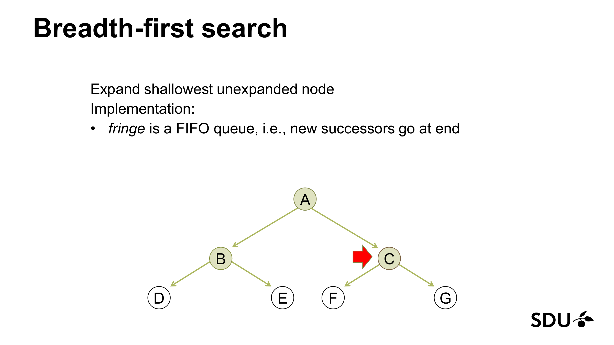
*Figure 9: BFS step 5 from slide 34. Filled-green nodes have been expanded; the red arrow points at C, the next to expand from the queue, with its grandchildren about to come into view. The level-by-level pattern is the BFS fingerprint. (Lecture 3, slide 34.)*

### 5.5 DFS on the same binary tree (slides 38–46)

**Convention.** DFS pushes children onto the LIFO stack in **right-to-left order**, so the leftmost child ends up on top of the stack and gets popped next. This matches the slide's left-first traversal animation (A → B → D → E → ... → C → F → G).

**Trace (left-first, goal = $G$):**

| Step | Pop | Action | Frontier (LIFO, top on the **right**) |
|------|-----|--------|----------------------------------------|
| 0 | – | init | `[A]` |
| 1 | A | push C, then B (right-to-left order; B ends up on top) | `[C, B]` |
| 2 | B | push E, then D (D ends up on top) | `[C, E, D]` |
| 3 | D | no children, nothing pushed | `[C, E]` |
| 4 | E | no children, nothing pushed | `[C]` |
| 5 | C | push G, then F (F ends up on top) | `[G, F]` |
| 6 | F | no children, nothing pushed | `[G]` |
| 7 | G | goal! return path $A \to C \to G$ | done |

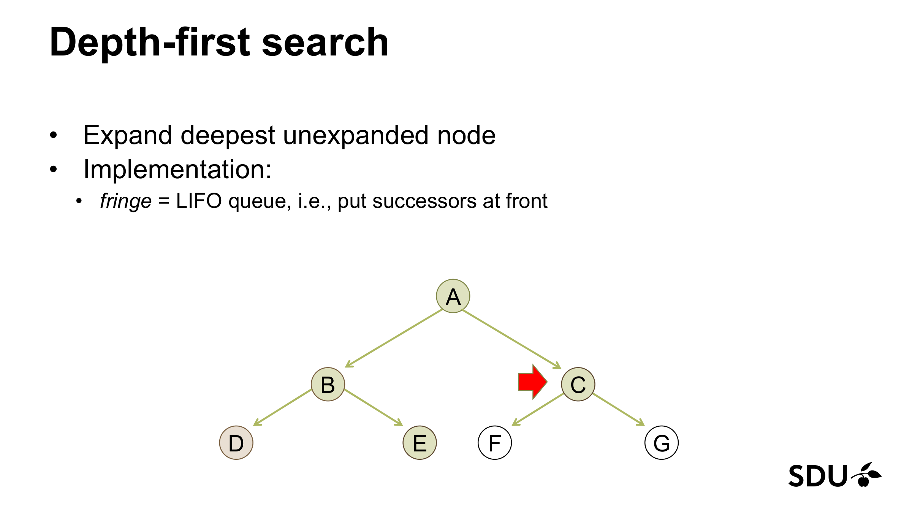
*Figure 10: DFS slide 46 — the last DFS animation frame in the lecture. The slide's animation shows A → B → D → E → C (the red arrow on this final frame is on C); the table above extends the trace to F and G, which are off the end of the slide's animation but follow directly from the same left-first DFS rule. (Lecture 3, slide 46.)*

> **Note.** On *this* tiny tree with goal at $G$, both BFS and DFS expand all 7 nodes and return the same path. This is only because the goal happens to be the last node in both traversal orders. If the goal had been at $D$, BFS would expand 4 nodes (A, B, C, D) before finding it; DFS-left would expand 3 (A, B, D). The difference between BFS and DFS shows up *only* when (a) the goal is not at the very end of the traversal order, or (b) the state space is infinite/cyclic (where DFS may not terminate).

### 5.6 IDS on increasingly deep trees (slides 49–52)

The IDS slides show four passes of depth-limited DFS at $\ell = 0, 1, 2, 3$.

- **$\ell = 0$ (slide 49).** Only the root $A$ is visited. If $A$ is the goal: return immediately. Otherwise: cutoff, increase $\ell$.
- **$\ell = 1$ (slide 50).** Visit $A$, then descend to $B$ (left child), test, back up to $C$, test. Three nodes visited.

  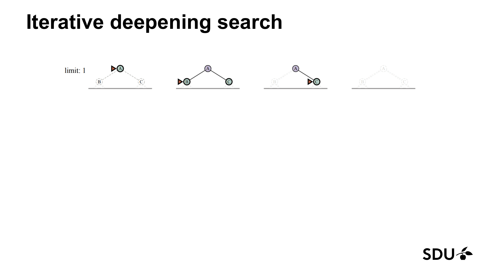
  *Figure 11: IDS pass with depth limit $\ell = 1$ (slide 50). Three frames showing the root, descent to B, descent to C. Total 3 expansions. (Lecture 3, slide 50.)*

- **$\ell = 2$ (slide 51).** Visit $A$, $B$, $D$, $E$, $C$, $F$, $G$ — the full 7-node DFS to depth 2. If $G$ is the goal we return now.

  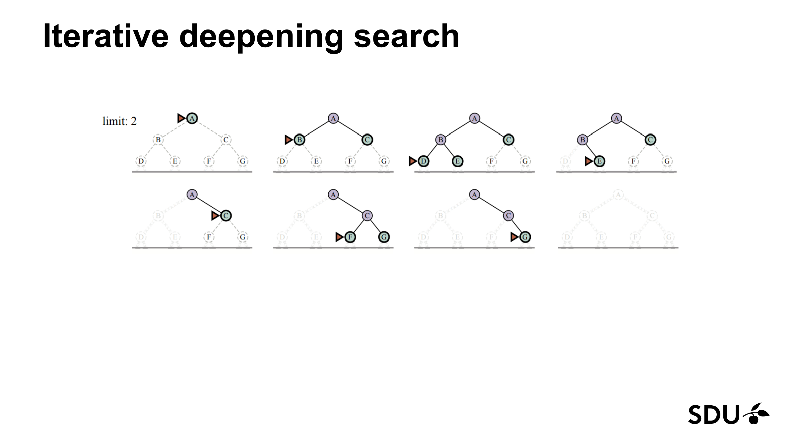
  *Figure 12: IDS pass with depth limit $\ell = 2$ (slide 51). Eight frames showing left-deep traversal of the 7-node tree. Compare frame ordering to the DFS trace in §5.5 — they match. (Lecture 3, slide 51.)*

- **$\ell = 3$ (slide 52).** Visit a 15-node tree in DFS order, again limited to depth 3.

  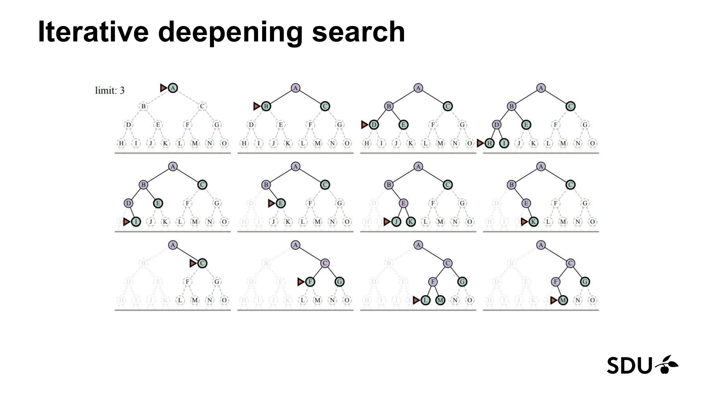
  *Figure 13: IDS pass with depth limit $\ell = 3$ (slide 52). The 15-node tree is traversed depth-first with the cap; the upper rows handle the left subtree, the lower rows the right. (Lecture 3, slide 52.)*

#### 5.6.1 Why repeating these passes is not wasteful (with arithmetic)

Each new pass is *strictly larger* than the previous one and the work is geometrically dominated by the last (largest) level. The accounting on slide 53 gives:

$$(d+1)b^0 + d\,b^1 + (d-1)b^2 + \dots + 1 \cdot b^d.$$

For $b = 10, d = 5$ this is:

| level $k$ | coefficient $(d+1-k)$ | $b^k$ | contribution |
|-----------|------------------------|--------|---------------|
| 0 | 6 | 1 | 6 |
| 1 | 5 | 10 | 50 |
| 2 | 4 | 100 | 400 |
| 3 | 3 | 1000 | 3000 |
| 4 | 2 | 10000 | 20000 |
| 5 | 1 | 100000 | 100000 |
| **total** |  |  | **123,456** |

A single BFS pass to depth $d$ would have generated approximately $b^d = 100{,}000$ nodes. So IDS does about $123{,}456 / 100{,}000 \approx 1.23$ — that is, **23% extra work** at $d=5$. Asymptotically, the overhead factor is $b/(b-1) \approx 1.11$ for $b=10$, which is a constant — same big-O as BFS. The IDS-vs-BFS payoff is in *space*, not time: same $O(b^d)$ time, but only $O(b\,d)$ space.

### 5.7 BFS vs UCS on the same weighted graph (decisive contrast)

This worked example is not on the lecture slides, but it is the most likely exam free-response prompt on the BFS-vs-UCS distinction. Run both strategies on the slide-37 graph with $A$ as start and $G$ as goal.

**Graph used.** Here we use the *full* edge list from §5.3, including $E \to G = 4$ — that is the canonical interpretation set out in the §5.3 note above. (§5.3's trace skips the $E \to G$ edge at step 5 to match the slide; §5.7 does not.)

**BFS.** BFS ignores edge weights — it only cares about depth (number of actions). The chapter's BFS (§4.1) uses the *graph-search* template: when a successor's state is already in the frontier or in the explored set, the second push is blocked. The expansion order is determined by FIFO on the frontier with children pushed in **edge-list order** (when expanding A, push B before D; when expanding D, push E before F; etc., per the §5.3 edge-list table).

- Push order from A: $B$ ($g$ ignored by BFS), $D$. Frontier: `[B, D]`.
- Pop $B$. Push $C$. Frontier: `[D, C]`.
- Pop $D$. Push $E$, then $F$. Frontier: `[C, E, F]`.
- Pop $C$. Push $G$ (via $C \to G$) — **first push of $G$**, with parent $C$, path $A \to B \to C \to G$. Frontier: `[E, F, G]`.
- Pop $E$. Try to push $G$ (via $E \to G$) — **blocked** by the "$s' \notin$ frontier" check, because $G$ is already on the frontier from $C$. No update; BFS does not look at cost.
- Pop $F$. Try to push $G$ (via $F \to G$) — **also blocked** by the same check.
- Pop $G$ — goal! Walk parent pointers: path is $A \to B \to C \to G$ with cost $5 + 1 + 8 = 14$.

So BFS returns **$A \to B \to C \to G$ with cost 14**. The cheaper $A \to D \to F \to G$ (cost 8) and $A \to D \to E \to G$ (cost 9) paths are *generated* later but **suppressed** by graph-search dedup. The point: it is not "FIFO tie-breaking" between three depth-3 goals — only the *first* push of $G$ survives, and the edge-list child ordering decides which path that is.

**UCS.** UCS expands the cheapest fringe entry first. As traced in §5.3, UCS returns **$A \to D \to F \to G$ with cost 8**.

**Lesson.** Same graph, same start, same goal: BFS returns a depth-3 path of cost 14, UCS returns a depth-3 path of cost 8. BFS is **not** optimal under non-uniform step costs; UCS is. This is the headline result that motivates UCS in the first place.

### 5.8 8-queens (formulation only — slide 19)

Slide 19 poses 8-queens as a formulation exercise: *"What are the states, successor function, goal state?"* — without running search on it. (L05 will return to 8-queens as a local-search problem.) The formal triple:

- **State.** A partial board with $k \le 8$ queens placed, one per column (or equivalently a partial assignment of queens to columns). The empty board is the initial state.
- **Successor function.** Place a queen in the leftmost empty column on a row that is **not attacked** by any queen already on the board. (Restricting to non-attacking placements prunes the tree massively; the alternative of "any empty square" gives $b = 64-k$ and an enormous search.)
- **Goal test.** Board has 8 queens and none attack each other.
- **Path cost.** Not meaningful (we only care that the final board is valid). For "find any solution" BFS / DFS / IDS would all work; DFS is the natural pick because the depth is bounded at 8 and we don't care about path *cost*.

Branching factor under the non-attacking-placement rule is roughly $b \approx 8$ at the top of the tree and decreases as constraints bite. DFS to depth 8 is fine; BFS would hold up to $b^8 \approx 16{,}000{,}000$ partial boards in memory in the worst case.

[Lecture 3, slides 11–19, 22–26, 30–34, 37, 38–46, 49–53.]

---

## 6. Common Pitfalls / Exam Traps

The following are the mistakes I see most often when students apply these algorithms on the exam — they map directly onto cheat-sheet rules in §8.

1. **Confusing "shallowest" with "lowest cost".** BFS finds the shallowest goal node, *not* the cheapest. When step costs vary, BFS is **not optimal** (see §5.7 for an explicit counter-example: BFS returns cost-14, UCS returns cost-8 on the slide-37 graph). Default to UCS when costs vary.

2. **Goal-testing on generation vs expansion.** In BFS it doesn't matter (and the slides do it on expansion). In **UCS it matters** — testing on generation can return a sub-optimal solution. See §4.2.1 for an explicit 4-node counter-example. Always state explicitly that UCS tests on *pop* (expansion).

3. **Forgetting the conditions on the completeness table.**
   - BFS, IDS: complete iff $b$ is finite.
   - UCS: complete iff $b$ is finite **and** all step costs $\ge \epsilon > 0$.
   - DFS: not complete in infinite-depth or cyclic spaces; complete in finite spaces *with the repeated-state check*.
   The slide-54 footnotes are exam fodder — memorise them.

4. **Forgetting the conditions on optimality.** BFS / IDS are optimal **only when step costs are equal** (slides 35, 53 say "cost = 1", which is the same condition up to rescaling). UCS is optimal under the same conditions as completeness (step costs $\ge \epsilon > 0$). DFS is never optimal.

5. **DFS in spaces with cycles or disconnected components.** The failure mode depends on which repeated-state machinery DFS uses:
   - **Pure DFS with no repeated-state check at all** (the most naïve form) does loop forever along a back-edge cycle. Concrete example: edges $A \to B \to C \to A$ with goal $D$ elsewhere — DFS will oscillate $A, B, C, A, B, C, \ldots$ without termination.
   - **DFS with the slide-47 "current-path" check** (avoid repeating states along the current root-to-leaf path) terminates on the same cyclic graph: from $A$ it descends to $B$, then $C$, then attempts $A$ — blocked by the current-path check. DFS backtracks to $C$, then $B$, then $A$, exits the connected component, and reports **failure** without finding $D$ (because $D$ is in a separately connected component). The failure mode is **incompleteness**, not non-termination.
   - **DFS with the chapter's §3.4 graph-search explored set** is the strongest variant; on the cyclic-plus-disconnected example it also reports failure, again by incompleteness.
   So the canonical exam-relevant DFS failure mode for cyclic state spaces with the chapter's algorithm template is *incompleteness in disconnected components*, not infinite looping. The infinite-loop mode applies only to the no-check variant. For infinite-depth state spaces the right fix is IDS.

6. **State vs node confusion.** Two different nodes can represent the same state. When the algorithm says "if not in explored *and* not in frontier", it means: not in either *as a state*. A common implementation bug is keeping the explored set keyed by node-id (which is unique by construction) instead of by state — this turns "graph search" silently into "tree search" and lets the algorithm re-explore the same state from many different paths.

7. **UCS time complexity is *not* always $b^d$.** When step costs are very uneven, the exponent is $1 + \lfloor C^*/\epsilon \rfloor$ — *not* the depth of the goal. *Adversarial example:* a graph with one optimal path of length 1 and cost 10 (a single expensive edge $S \to G$), and a long cheap detour $S \to v_1 \to v_2 \to \cdots \to v_{999} \to G$ where each $v_i \to v_{i+1}$ costs $0.01$. Here $C^* = 9.99$ (the detour beats the expensive direct edge), $\epsilon = 0.01$, so $C^*/\epsilon = 999$. UCS expands roughly 1000 nodes along the cheap detour before terminating, even though the search "depth" $d$ to the optimum is 1000 and the branching factor is just 2. This is exactly the case where $b^{1+\lfloor C^*/\epsilon\rfloor} \gg b^d$.

8. **Treating "fringe" and "frontier" as different things.** They are not. The slides use *fringe*; the textbook and the glossary canonical name is *frontier*. Same data structure, same role.

9. **Assuming IDS is slower than BFS.** It is not in big-O time. IDS does redo work, but the redone work is asymptotically dominated by the work at the deepest level — overhead factor $b/(b-1)$ in the limit. *In practice* IDS is the preferred default for uniform-cost, finite-$b$ problems — same time complexity, dramatically less memory.

10. **Claiming the lecture covers A\*.** It does not. Slide 7 lists A\* as an *objective* but slide 54 explicitly says "haven't covered" and slide 55 promises it for next class. On the exam, only quote A\* properties from the lecture *they were actually derived in* (typically L05 onward).

11. **Replacing-on-frontier logic for UCS** (matters for UCS; harmless to omit for BFS/DFS). Slide 21's algorithm template says: when adding a child whose state already appears in the frontier with a *higher* path cost, **replace** the existing frontier node with the new (cheaper) one. Forgetting this rule can make UCS return a sub-optimal solution, since the cheaper path would be discarded. See §5.3.1 for a worked-out fire of this rule.

12. **$d$ vs $m$.** $d$ is the depth of the *shallowest* goal; $m$ is the *maximum length of any path in the state space* (possibly $\infty$). DFS's time bound uses $m$, BFS / IDS use $d$. Mixing them up makes the complexity row of the cheat sheet incoherent.

13. **"Tree search" terminology.** The lecturer's slide 21 calls the algorithm "Tree Search" even though it is technically graph search (it has an explored set). On the exam, follow the lecturer's terminology unless the question explicitly distinguishes tree search from graph search; the underlying algorithm is the same.

[Lecture 3, slides 21, 27–28, 35–37, 47, 53–54.]

---

## 7. Connections to Other Lectures

L03 is the entry point to the "search family" of techniques. The concepts it introduces are reused everywhere downstream:

- **L05 — Local Search.** Local search drops the explicit goal state in favour of an *objective function* and uses [heuristic functions](../_shared/glossary.md#heuristic-function) explicitly. L05 is also the natural home for the **A\*** material that L03's slide 7 forward-referenced but never derived — see [L05 — Local Search](L05-Local-Search.md). Some of L03's vocabulary (`state`, `state_space`, `successor_function`, `goal_state`) re-appears in L05 with the twist that local search keeps *one current state* rather than a frontier of unexpanded nodes.
- **L06 — Adversarial Search.** Minimax is essentially DFS over a *game tree* — a search tree where alternate plies are MAX nodes and MIN nodes. Alpha-beta pruning is an optimisation of that DFS. See [L06 — Adversarial Search](L06-Adversarial-Search.md).
- **L07 — Constraint Satisfaction Problems.** CSP backtracking search *is* DFS over partial-assignment nodes. L07's variable-ordering heuristics (MRV, degree) and value-ordering heuristic (LCV) are CSP-flavoured cousins of the cost-ordering used by UCS. See [L07 — CSP](L07-CSP.md).
- **Forward references that L03 sets up but does not deliver:**
  - **A\* search.** Glossary entry exists under `A* search`; the L03 slide 7 mention is acknowledged in the glossary as "FWD-REF". Full derivation in L05.
  - **Heuristic function $h(n)$.** Used concretely in L05 onward. The connection back to L03 is the search-tree machinery; the connection forward is to properties of $h$ that condition A\*'s optimality (covered in L05).
- **Re-used concepts from L02.** L03 *narrows* L02's environment taxonomy to "observable, deterministic, discrete, known", and L03's "problem-solving agent" is L02's "goal-based agent" specialised to "I'll compute the entire plan off-line". The PEAS framework and the goal-based-agent template come from [L02 — Agents](L02-Agents.md).

[Cross-references: see `_shared/cross-references.md` Part 2 rows for `BFS`, `DFS`, `UCS`, `IDS`, `search_tree`, `frontier`, `branching_factor`, `completeness`, `optimality`, `node`, `state`, `state_space`.]

---

## 8. Cheat-Sheet Summary

> **Last-minute revision: read top to bottom.** Each major concept carries a one-line analogy reminder (italicised) so you can re-anchor without flipping back.

### Setup

- **Search problem = (initial state, successor function, goal test, step costs).** Optimal solution = lowest-cost action sequence from initial to goal.
- *Problem-solving agent: a goal-based agent that closes its eyes once the plan is fixed (slide 9).*
- Setting: **observable, deterministic, discrete, known** environment (slide 8).
- **Four design questions** (slide 17): How to represent state? How to recognise the goal? What are the actions? What relevant info to encode?

### Search-tree mechanics

- **Node** = search-tree data structure = `(state, parent, action, g(n), depth)`. **State** = the world configuration. **Many nodes can share a state.**
- *Frontier (fringe) — the to-do list of unexpanded nodes. Search strategy = the rule for picking next from this list (FIFO / LIFO / priority queue).*
- *Explored set — the "already done" list; deduplicates revisits.*
- *Branching factor $b$ — how many corridors leave each junction.* Depth of shallowest goal $d$. Maximum path length in the state space $m$ (possibly $\infty$).
- **n-Puzzle state counts (slide 15):** 8-puzzle = 181,440; 15-puzzle > 10¹³; 24-puzzle ≈ 10²⁵. **Optimal n-Puzzle is NP-hard.**

### The four strategies (one row each)

| Strategy | One-line | Frontier | Complete? | Optimal? | Time | Space |
|---|---|---|---|---|---|---|
| **BFS** | *Knock on every house on the current street before moving to the next street.* | FIFO queue | Yes (finite $b$) | Yes iff uniform step costs | $O(b^d)$ | $O(b^d)$ |
| **UCS** | *Dijkstra's wavefront — flood cheapest paths first.* | Priority queue by $g(n)$ | Yes (all costs $\ge\epsilon>0$) | Yes | $O(b^{1+\lfloor C^*/\epsilon\rfloor})$ | $O(b^{1+\lfloor C^*/\epsilon\rfloor})$ |
| **DFS** | *Always take the leftmost corridor; back up only when you hit a wall.* | LIFO stack | No in infinite/cyclic spaces; Yes in finite spaces with the repeated-state check | No | $O(b^m)$ | $O(b\,m)$ |
| **IDS** | *BFS on the cheap: try depth 1, then 2, then 3, …* | LIFO stack (one DFS at a time) | Yes (finite $b$) | Yes iff uniform step costs | $O(b^d)$ | $O(b\,d)$ |

### When to pick which

- **Uniform step costs, memory OK** → BFS.
- **Uniform step costs, memory tight** → IDS. *(Same time as BFS, far less memory.)*
- **Non-uniform step costs, memory OK** → UCS. *(BFS isn't optimal here; UCS is.)*
- **Non-uniform step costs, memory tight** → no L03 strategy fits. The answer is **iterative-deepening A\* (IDA\*)** from informed search — covered in L05+, not in L03.
- **Memory is the binding constraint, optimality doesn't matter, depth bounded** → DFS.

### Notation reminders

- $g(n)$ — path cost from root to $n$.
- $h(n)$ — heuristic estimate of remaining cost from $n$ to the nearest goal. *(Forward reference; A\* is **not** derived in L03 — you do not need $h$ for L03 exam questions.)*
- $C^*$ — cost of the optimal solution.
- $\epsilon$ — smallest positive step cost.
- $f(n) = g(n) + h(n)$ — A\* evaluation (forward reference only; L05+).

### Conditions to memorise (slide 54 footnotes)

¹ "Complete" means *if $b$ is finite and the state space either has a solution or is finite*.

² UCS also requires *every step cost $\ge \epsilon > 0$* (otherwise zero-cost cycles destroy completeness).

³ BFS/IDS are cost-optimal *only* when every action cost is identical (slides 35, 53 write this as "cost = 1 per step", which is the same condition).

### Common pitfalls (one-liners)

- BFS is optimal only for uniform step costs (see §5.7 BFS-vs-UCS contrast).
- UCS goal-tests on *expansion* (pop), not on generation.
- DFS with the chapter's graph-search explored set is incomplete in cyclic-plus-disconnected state spaces (it terminates but may miss reachable goals in disconnected components); DFS with no repeated-state check at all loops forever in cyclic graphs.
- IDS is **same big-O time** as BFS, **much smaller space**.
- A\*, greedy best-first, and heuristics are *not* covered in this lecture — slide 7 lists them as an objective but slide 54 explicitly defers to next class.

---

_Source: Lecture 3 slides 1–56._
