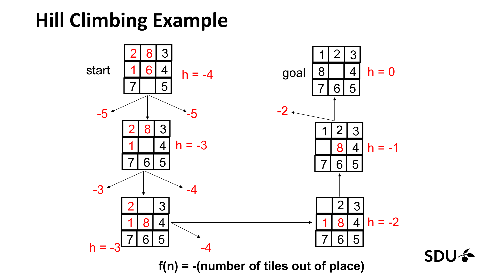
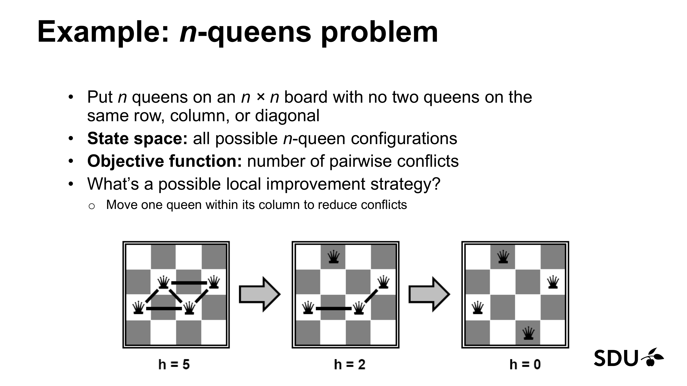
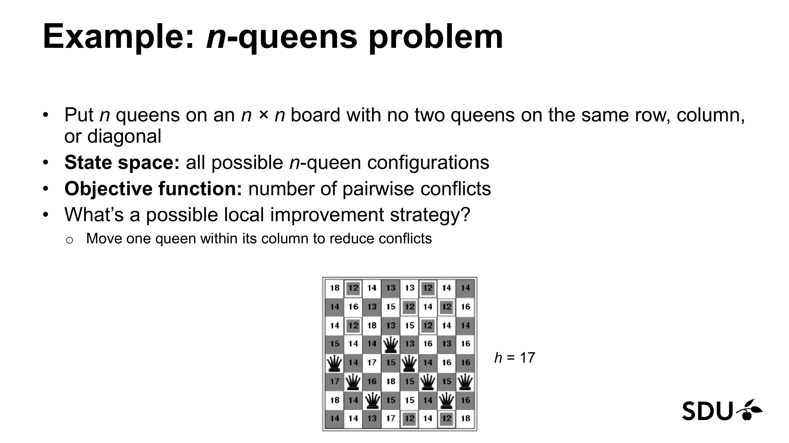
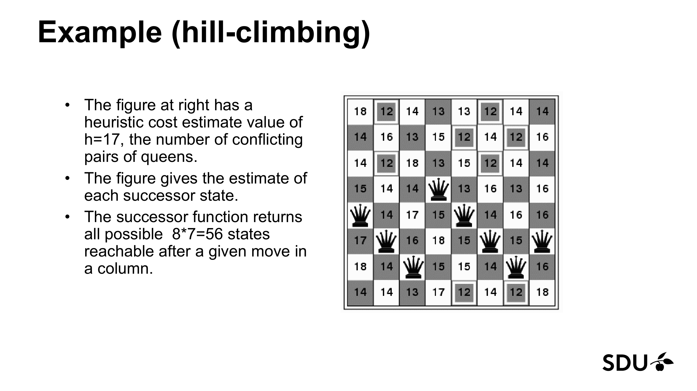
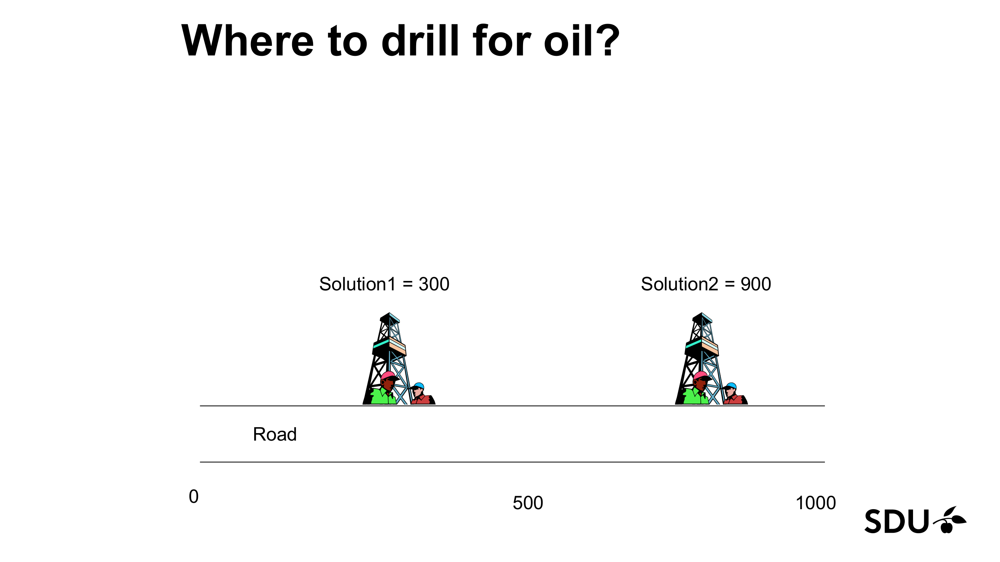

# Lecture 5: Local Search

> **Reading time:** ~55 min  |  **Prereqs:** L02 (Agents — state, action, objective), L03 (Uninformed Search — state space, successor function, completeness, optimality, $A^{*}$ as a forward reference)
> **Glossary terms introduced:** local search, objective function, heuristic function (concretised here), hill climbing, stochastic hill climbing, first-choice hill climbing, random-restart hill climbing, local maximum, plateau, shoulder, ridge, simulated annealing, temperature schedule, Markov Chain Monte Carlo (MCMC), genetic algorithm, chromosome, gene, genotype, phenotype, fitness function, population, generation, roulette-wheel selection, tournament selection, elitism, crossover, mutation, fitness landscape.

---

## 1. Overview & Motivation

The search techniques in L03 (BFS, DFS, UCS, IDS) all assume that the
problem comes with an explicit goal test and that the solution is a
**path** from an initial state to a goal state. For a great many
practical problems neither assumption holds:

- We don't have a designated start state — we can start anywhere.
- We don't care how we got to the solution, only how *good* the solution itself is.
- We do have a real-valued **objective function** that says how good any
  particular configuration is, and our job is to maximise (or minimise) it.

> *"Some types of search problems can be formulated in terms of
> **optimisation**. We don't have a start state, don't care about the
> path to a solution. We have an objective function that tells us about
> the quality of a possible solution, and we want to find a good solution
> by minimising or maximising the value of this function."* — slide 2.


Examples where this fits naturally:

- **n-queens:** does the arrangement of queens contain attacking pairs? Lower is better.
- **Traveling-salesman:** does this tour visit every city? Among all such tours, minimise length.
- **Scheduling, VLSI layout, protein folding, neural-network weight tuning:** any problem with an "evaluate this candidate" knob and combinatorially many candidates.

Local search keeps **one** (or a few) current state(s) in memory and
**iteratively modifies** them, ignoring path information entirely. It is
memory-light, often surprisingly effective, and — crucially — applicable
to **continuous** state spaces where classical search would be lost.

> **When to reach for local search over L03 methods?** When the *path*
> doesn't matter (only the final configuration does) and you have a cheap
> evaluator $f(s)$ for any candidate $s$. Classical search has to build
> the path explicitly and pay memory for it; local search just walks the
> landscape.

The lecture covers three approaches, in increasing sophistication:

1. **Hill Climbing** — always step uphill; stops when no neighbour is better.
2. **Simulated Annealing** — like hill climbing, but with a probabilistic willingness to step *downhill*, gradually decreased over time.
3. **Genetic Algorithms** — maintain a *population* of candidates and evolve them by selection, crossover, and mutation.

[Lecture 5, slides 1–3.]

---

## 2. The Big Picture — Analogies

> Read these before diving into formulas. Section 3 will keep gesturing back at them.

### 2.A Local search ≡ "you're on a hilly landscape, and only the height under your feet matters"

Imagine you're hiking on a fog-covered mountain range and your only goal
is to stand on the highest peak you can find. You don't care about the
*path* you take to get there — only the final altitude. You have an
altimeter (the **objective function**), but you can only see one step in
every direction because of the fog. That's local search.

**Where the analogy breaks down (1 — geometry).** Real terrain is 2-D
and continuous; many local-search state spaces are combinatorial and
graph-shaped. For the canonical n-queens parameterisation we'll use in
§5.4 — *one queen per column, free to occupy any of the $n$ rows* — the
8-queens state space has $8^{8} = 16{,}777{,}216 \approx 1.68 \times 10^{7}$
states (and BFS over that would explode memory; local search keeps
exactly **one** state).

**Where the analogy breaks down (2 — terminology).** Even though the
state graph is discrete, the slides keep talking about it as a
landscape; slide 15 calls the picture exactly *"the state-space
landscape"*. We follow the slides.

### 2.B Hill climbing ≡ "always step uphill, blindfolded"

The greedy hiker: at every step, feel around with your boot, take the
single step that gains the most altitude, and stop the moment no step
gains anything. The lecturer's preferred image (slide 4):

> *"Like climbing Mount Everest in thick fog with amnesia."*

The amnesia matters — you can't remember where you've been, so you
cannot back-track when you reach a dead end.

**Where the analogy breaks down.** The "blindfold" image suggests you
can only feel the immediate gradient under your boot, but hill climbing
actually evaluates the objective at *every* neighbouring state before
choosing the best — closer to asking your boot to sniff every spot in a
ring around you, then committing to the deepest sniff. Also, real hikers
have a finite **step size**; in a discrete state space "step size" is
defined by the successor function, which can produce wildly heterogeneous
jumps in objective value with no smooth in-between.

### 2.C Simulated annealing ≡ "shaking a settling marble — vigorous shakes when hot, gentle taps when cool"

Imagine dropping a marble on a bumpy surface. If you don't shake at all,
the marble settles into whatever pit it lands nearest — the equivalent
of hill climbing. If you shake hard, the marble bounces randomly and
visits many pits. Now combine the two: start shaking *vigorously*
(high "temperature"), so the marble jumps out of small dips; then
**gradually reduce** the shaking; by the time you're tapping gently, the
marble is in the broad neighbourhood of the deepest pit and will settle
there. That gradual cooling is the **annealing schedule**.

The literal physical analogy (slide 16) comes from metallurgy: heat a
piece of metal to high temperature so atoms wander freely; cool it
slowly so they have time to settle into the lowest-energy crystal
arrangement. Cool too fast and you get a defective crystal — a local
minimum. **Where the analogy breaks down:** the marble has continuous
energy; in our discrete state spaces, "shaking" is implemented as
"accept a random neighbour with probability $\exp(\Delta / T)$" — same
intuition, different mechanism.

### 2.D Genetic algorithms ≡ "evolving a population, like animal breeding"

You don't keep just one candidate; you keep a whole **population** of
them. Every generation, the *fittest* candidates have the most offspring
(survival of the fittest — Darwin). Offspring inherit traits from
**two** parents (crossover — recombination of genes) and occasionally a
trait mutates (mutation — copying error). After many generations the
population concentrates around high-fitness solutions.

The lecturer's analogy (slide 22):

> *"Each cell contains chromosomes (strings of DNA); each chromosome
> contains genes (blocks of DNA); each gene determines some aspect of
> the organism; reproduction involves recombination + small mutation;
> fitness = how much can reproduce before dying; evolution = survival
> of the fittest."*

A more colloquial image is the dog-breeder's: you don't engineer the
perfect labradoodle in one shot — you breed labradors with poodles, look
at the puppies, keep the ones closest to what you want, breed *them*,
repeat. **Where the analogy breaks down:** evolution is open-ended and
spans millions of years; GAs have a fitness function we *defined* and run
for tens to thousands of generations. Also, real biological "fitness" is
emergent (offspring count), whereas GA fitness is engineered.

### 2.E Mini-analogies for the algorithm-internal operators

The four §3 / §4 algorithms have several internal moving parts that
deserve their own one-paragraph analogies. Each has a "where it breaks
down" caveat.

#### Random-restart hill climbing ≡ "if stuck on a foothill, helicopter to a random spot"

Every time you climb to the top of a foothill and find no improving
step, you climb into a helicopter, get flown to a *completely random*
new spot on the mountain range, and start climbing again. After $k$
helicopter rides you keep whichever summit was highest. **Where it
breaks down:** the basin of attraction of the *global* maximum may be
tiny relative to the whole space — you may need an astronomical number
of helicopter rides before one lands you in it.

#### First-choice hill climbing ≡ "pick the first step that goes up"

Instead of sniffing every direction before committing, take a quick
sniff in *one* random direction; if it goes up, step there; if not,
sniff again. **Where it breaks down:** real hikers can do this in
parallel (eyes scan instantly); on a computer you still pay one
evaluation per sniff, but the algorithm gets to *stop sniffing* once it
finds an improving direction, which saves time when the branching
factor is huge.

#### Stochastic hill climbing ≡ "of all the uphill steps, take one at random"

Sniff every direction, list the improving ones, and roll a die to pick
one. **Where it breaks down:** real hikers don't randomise on purpose;
the randomisation is artificial and helps avoid pathological tie-breaking
on landscapes with many shallow improvements.

#### Temperature schedule ≡ "the dimmer-switch on the shaker"

When the marble (§2.C) is hot, you shake vigorously; as time goes on,
you slowly turn the shaker down. The schedule $T(t)$ is the program for
the dimmer-switch — how fast to lose temperature. **Where it breaks
down:** real cooling is physical (heat dissipates exponentially); SA
schedulers can use any monotone-decreasing function, including ones with
no physical analogue.

#### Roulette-wheel selection ≡ "a casino roulette wheel where the slots are wider for fitter chromosomes"

A real roulette wheel has equal-sized slots and is fair. The GA roulette
wheel is *deliberately rigged*: each chromosome's slot is sized in
proportion to its fitness, so the ball is more likely to land on a
high-fitness chromosome — but a low-fitness one *can* still be picked.
**Where it breaks down:** the wheel isn't physically circular in the
algorithm; we lay the slots out on a line $[0, F]$ and draw a uniform
random number. Conceptually identical, computationally simpler.

#### Crossover ≡ "swap the engine and the body of two prototype cars to make a third"

Two prototype cars are good in different ways. Cut both at the firewall,
take car A's front + car B's rear, and call it a new prototype.
Do the symmetric swap to make a second prototype. **Where it breaks
down:** real biological crossover happens at multiple crossover points
along each chromosome and is governed by complex molecular machinery;
the GA cuts once (single-point crossover) at a uniformly random position.

#### Mutation ≡ "a one-letter typo when copying out a long word"

Most typos make the word worse (or nonsense); occasionally a typo
accidentally produces a real, better word. **Where it breaks down:**
real biological mutations are mostly *silent* (no effect on the
phenotype), occasionally deleterious, rarely beneficial — but in a GA
every bit-flip is decisive because the bitstring decodes deterministically
to a configuration.

#### Fitness landscape ≡ "the topography of all candidate solutions, with elevation = fitness"

Imagine plotting every possible chromosome as a point in a
high-dimensional space, with elevation equal to that chromosome's
fitness. The shape of this surface — gentle bowl, jagged Himalayas,
random static — determines whether *any* local-search algorithm can
exploit structure to find the global optimum. **Where it breaks down:**
the "horizontal axis" is conceptual; the actual configuration space is
high-dimensional and discrete, so the 3-D plot is a low-dimensional
fiction.

### 2.F One-line cheat-sheet of the analogy set

| Concept | Analogy |
|---|---|
| Local search | Hiking with only an altimeter, no map |
| Hill climbing | Always step uphill, even when blindfolded |
| Local maximum | A small foothill — you stop there because every direction goes down |
| Plateau | A wide flat patch — every direction is *equally* flat, you can't tell which way to go |
| Shoulder | A wide flat patch that eventually starts rising if you keep walking |
| Ridge | A narrow rocky chain — each step "off" the ridge looks worse, but walking along the ridge gains altitude |
| Random-restart hill climbing | If stuck on a foothill, helicopter to a random spot and climb again |
| First-choice hill climbing | Take the first step that goes up — don't sniff in all directions |
| Stochastic hill climbing | Roll a die among the improving directions |
| Simulated annealing | Shaking a settling marble — vigorous shakes when hot, gentle taps when cool |
| Temperature | Loudness of the shaking |
| Temperature schedule | The dimmer-switch on the shaker (how fast to turn it down) |
| Genetic algorithm | Animal breeding — population, selection, crossover, mutation |
| Population | The current kennel of candidate dogs |
| Generation | One full breeding cycle |
| Chromosome | The DNA strand that *is* one candidate solution |
| Gene | One bit/letter of the chromosome |
| Genotype | The encoded chromosome |
| Phenotype | What the chromosome *means* when decoded |
| Fitness function | The breeder's eye — "how good is this puppy?" |
| Roulette-wheel selection | Casino roulette with rigged slot widths proportional to fitness |
| Tournament selection | Sample $k$ candidates, keep the best |
| Elitism | Always keep one perfect copy of the best so far |
| Crossover | Swap front + rear of two prototype cars to make a third |
| Mutation | A one-letter typo when copying a long word |
| Fitness landscape | Topography of all chromosomes, elevation = fitness |

[Lecture 5, slides 4, 15, 16, 22, 35.]

---

## 3. Core Concepts

### 3.1 Objective function

A real-valued function $f : \mathcal{S} \to \mathbb{R}$ that assigns
to every state $s$ in the state space $\mathcal{S}$ a "quality" or
"value". Local search seeks
$$s^{*} = \mathop{\mathrm{arg\,max}}\limits_{s \in \mathcal{S}} f(s) \quad\text{(maximisation)} \qquad\text{or}\qquad s^{*} = \mathop{\mathrm{arg\,min}}\limits_{s \in \mathcal{S}} f(s) \quad\text{(minimisation)}.$$

By convention we will speak of **maximisation** throughout; minimising
$f$ is the same as maximising $-f$. The 8-puzzle example on slide 5
makes the sign convention explicit: $f(n) = -(\text{tiles out of place})$ —
the minus sign is what turns "fewer misplaced tiles is better" into a
maximisation.

> *Recall the "altimeter on a hilly landscape" analogy from §2.A: $f(s)$
> is the altimeter reading at configuration $s$.*

Two specialisations the slides use:

- **Heuristic function** $h(n)$ in the L03 sense (estimate of distance-to-goal). Used in hill climbing on the 8-puzzle (slide 5) as $f(n) = -h(n)$. **Notational warning:** slide 5 writes "$h = -4$" directly on the board (using $h$ for what is really $f = -h$). We follow the slide where we quote it but otherwise use $f$ for the maximised objective.
- **Number of pairwise conflicts** in n-queens (slides 8–14). Here we *minimise*; the figures usually drop the minus sign and just label boards with $h$ directly.

[Lecture 5, slide 2.]

### 3.2 State-space landscape (visualisation)

If we plot the objective $f(s)$ on the vertical axis and arrange states
along a horizontal axis (a hard-to-define "neighbour-distance"
direction), we get a **landscape**. The lecturer's master landscape
diagram (slide 15) gives names to every interesting feature:


> *Recall the "hilly landscape" analogy from §2.A: each feature in the
> landscape is a real-world hiking pathology, and §6 explains how each
> pathology cripples (or doesn't) the algorithms.*

Slide 15 names **four** features explicitly:

- **Global maximum:** the highest peak in the entire landscape. The thing we want.
- **Local maximum:** a peak whose value is greater than every neighbouring state's, but less than the global maximum.
- **Flat local maximum (= flat plateau):** a region of equal-valued states with no improving neighbour anywhere on it. Hill climbing wanders aimlessly or stops here.
- **Shoulder:** a plateau from which improvement is possible if you keep walking — but only if you don't stop on the flat region.

A fifth pathology — **ridge** — is *not* labelled on slide 15. We list
it here as a common companion pathology (covered in standard AI
references such as Russell & Norvig §4.1.1):

- **Ridge** *(not on slide 15; standard reference)*: a sequence of locally-maximal states whose neighbours within one step are not improvements, yet a chain of moves diagonally up the ridge would improve. Hill climbing oscillates here.

Slide 14 adds a separate footnote about **continuous-space hill
climbing** specifically: *"In continuous spaces, problems w/ choosing
step size, slow convergence."* That is *not* the same pathology as a
ridge — it is a continuous-optimisation concern:

- **Continuous-space step-size sensitivity** *(slide 14 footnote)*: on continuous landscapes, hill climbing also suffers from step-size choice (too small → slow convergence; too large → overshoot) and slow asymptotic convergence near the optimum.

Hill climbing is **complete** on convex (single-peaked) landscapes; it
is **not complete** on landscapes with even one local maximum.

[Lecture 5, slides 14, 15.]

### 3.3 Hill climbing (greedy local search)

**Idea.** Keep a single current state. At every step, look at all
neighbours, pick the *best* one, move there, and stop the moment no
neighbour strictly improves on the current state.

```
HILL-CLIMBING(problem)
  current ← problem.initial_state                           # any state
  loop:
    next ← argmax over neighbours(current) of value(s)      # ties broken arbitrarily — see §3.4 for variants
    if value(next) < value(current):                        # strict decrease → stop
      return current
    current ← next
```

**Tie-breaking.** When two or more neighbours attain the argmax (a tie at
the top), the baseline pseudocode is silent on which one to pick. In
practice the choice is implementation-defined — first-found (scan order),
uniform-random, lexicographic on the state representation, etc. — and
*this choice matters*: §5.4 shows an 8-queens board where tie-breaking
to one $h = 12$ successor leads to the global optimum while a different
$h = 12$ successor leads to a local-minimum trap. The §3.4 variants make
the tie-breaking policy explicit: first-choice HC commits to "first
improving direction"; stochastic HC commits to "uniform-random among
improving directions"; baseline HC uses whatever the argmax implementation
happens to do.

This is **slide 13's pseudocode verbatim**, using the strict `<`
comparison. Read carefully — the strict `<` has a peculiar consequence
on **plateaux**:

- **Improving step** ($\text{value(next)} > \text{value(current)}$): `<` is false → algorithm continues by setting `current ← next`. Good.
- **Plateau step** ($\text{value(next)} = \text{value(current)}$): `<` is *also* false → algorithm continues with `current ← next` — *the algorithm walks sideways across the plateau without terminating*. This is the slide's exposure of the plateau pathology: the textbook hill-climbing rule never terminates on a flat region.
- **Strict decrease** ($\text{value(next)} < \text{value(current)}$): `<` is true → algorithm returns. But this branch only fires when every neighbour is *strictly worse* — i.e. at a strict local maximum.

So with the slide-13 rule the algorithm:
- (i) climbs strictly while it can,
- (ii) walks indefinitely along plateaux (a known pathology — slide 15's flat local maximum),
- (iii) terminates only at strict local maxima.

Some textbooks (e.g. Russell & Norvig) replace `<` with `≤` to terminate
on equality and thereby avoid infinite plateau walks. We mention this as
a variant in §3.4 but **the canonical lecture rule is `<`**.

**Properties.**

| Property | Value | Why |
|---|---|---|
| **Complete?** | No | Stops at the first strict local maximum; loops indefinitely on plateaux. |
| **Optimal?** | No | The local maximum may be far below the global one (see fig8). |
| **Memory** | $O(1)$ | Stores only `current` (and possibly the best-of-restarts so far). |
| **Time per iteration** | $O(b)$ | Must compute the value of each neighbour, where $b$ = branching factor (problem-specific: 8-queens has $b = 8 \times 7 = 56$; 8-puzzle has $b \le 4$). |

> *Recall the "always step uphill, blindfolded" analogy from §2.B: the
> agent has no plan, only the local gradient. It gets there fast when it
> works; when it doesn't, it gets stuck definitively.*

The lecturer's own one-liner (slide 4):

> *"Like climbing Mount Everest in thick fog with amnesia."*

Hill climbing can be turned into informed search by using a heuristic
function $h(n)$ — the L03 forward reference. The slides put it like this
(slide 4): *"One way to use hill-climbing is to use the negative of a
heuristic distance to the goal"*, so $f(n) = -h(n)$ and we maximise.

[Lecture 5, slides 4, 13, 14.]

### 3.4 Variants — escaping local maxima

Slide 13 mentions two variants in passing; slide 15 names a third
strategy outright.

> *Recall §2.E's mini-analogies — each variant has its own one-paragraph picture.*

- **First-choice hill climbing** (slide 13 variant — *"choose first better successor"*): instead of evaluating all neighbours, generate them one at a time and move to the first one that improves. Cheap when the branching factor is huge (in continuous spaces with effectively unbounded neighbours, sampling first-improver is the only tractable option).
- **Stochastic hill climbing** (slide 13 variant — *"randomly choose among better successors"*): among the *improving* neighbours, choose uniformly at random. Trades a little speed for slightly better local-optimum behaviour by varying tie-breaks.
- **Sideways-move variant** *(standard textbook addition, not on slide 13)*: change the strict `<` to `≤`, which terminates on plateaux as well as strict decreases — usually combined with a "sideways-move budget" so the algorithm can cross a *shoulder* (§3.2) by allowing a bounded number of equal-valued moves before giving up.
- **Random-restart hill climbing** (slide 15): when hill climbing terminates, *restart* it from a fresh random initial state, repeat $k$ times, keep the best result across runs. If $p$ is the probability that a single run finds the global optimum, then $k$ restarts succeed with probability $1 - (1-p)^{k}$ — a geometric improvement.

Random-restart is the simplest defence against local maxima. Under two
assumptions — the restart distribution puts positive probability on
every basin of the global maximum (uniform-random over a finite state
space gives this automatically) **and** hill climbing from any state in
that basin reaches the global maximum — it is **complete with
probability $1$** in finite spaces as $k \to \infty$, because
$1 - (1-p)^{k} \to 1$.

[Lecture 5, slides 13, 15.]

### 3.5 Simulated annealing

**The defect we are fixing.** Hill climbing *never* makes a downhill
move (slide 16). So when it reaches a strict local maximum it terminates,
period. Simulated annealing fixes this by **allowing** downhill moves —
with diminishing probability.

A second fundamental departure (slide 18, bullet 3): where hill climbing
evaluates **all** neighbours and moves to the **best**, simulated annealing
**picks one random neighbour per step** and decides whether to accept it.
This makes per-step cost $O(1)$ rather than $O(b)$, at the cost of needing
many more steps before convergence.

> *Recall the "shaking a settling marble" analogy from §2.C: when
> "temperature" is high, the marble can hop out of small dips; as
> temperature falls toward zero, hops become smaller and rarer.*

**The change in objective.** Define $\Delta = f(\text{next}) - f(\text{current})$.

- $\Delta > 0$ means the proposed move is an **improvement** (uphill).
- $\Delta < 0$ means the proposed move is a **worsening** (downhill).
- $\Delta = 0$ is a **lateral** move (no change in objective).

**The acceptance rule** (slide 17):

$$
P[\text{accept}] = \begin{cases}
  1 & \text{if } \Delta > 0 \text{ (improvement is always accepted),} \\[2pt]
  \exp(\Delta / T) & \text{if } \Delta \le 0 \text{ (lateral or downhill; see below).}
\end{cases}
$$

At the boundary $\Delta = 0$ the second branch gives $\exp(0/T) = 1$ —
so lateral moves are *also* always accepted. The case split at $\Delta = 0$
is therefore a free choice; folding $\Delta = 0$ into the first branch
gives the same algorithm.

For $\Delta < 0$ the exponent $\Delta / T$ is negative, so
$\exp(\Delta / T) \in (0, 1)$. Two observations make the formula
intuitive:

- **Steepness of the downhill move matters.** A larger drop $|\Delta|$ makes $\exp(\Delta/T)$ smaller — i.e. drastic worsenings are unlikely. Mild worsenings are easy to accept.
- **Temperature matters.** When $T$ is large, $\Delta / T$ is close to $0$ and $\exp(\Delta/T)$ is close to $1$ — almost any move is accepted; the algorithm explores. When $T \to 0^+$, $\exp(\Delta/T) \to 0$ — only improving moves are accepted; the algorithm reduces to hill climbing.

![How the acceptance probability $\exp(\Delta / T)$ varies with $\Delta \in [-100, 0]$ for four temperatures. At $T = 100$, $\exp(-100/100) = \exp(-1) \approx 0.37$ — even a $\Delta = -100$ move is accepted with reasonable probability. At $T = 50$, $\exp(-100/50) = \exp(-2) \approx 0.135$. At $T = 10$, $\exp(-100/10) = \exp(-10) \approx 4.5 \times 10^{-5}$ — practically zero at the left edge. At $T = 1$ the curve is essentially zero except in a sliver near $\Delta = 0$ (e.g. $\Delta = -3$ gives $\exp(-3) \approx 0.05$) — the algorithm has become indistinguishable from greedy hill climbing. *(Lecture 5, slide 19.)*](../extracted_figures/L05/fig10-temperature-effect-curves.png)

**The temperature schedule.** $T$ is controlled by a function $T(t)$ of
the iteration counter $t$, called the **annealing schedule** (or
"cooling schedule"). Slide 18 only says *"T gradually decreased to 0
over time t"* — the specific functional form is not given. The standard
menu (these formulas are **not on the slides**; included as standard
reference background only):

- **Linear:** $T(t) = T_0 - \alpha t$, clipped at 0.
- **Geometric:** $T(t+1) = \alpha \cdot T(t)$ with $0 < \alpha < 1$, typically $\alpha \in [0.85, 0.99]$.
- **Logarithmic (theoretical optimum):** $T(t) = c / \log(1 + t)$ — the form proven sufficient for asymptotic convergence (Geman & Geman 1984; Hajek 1988). The constant $c$ must exceed the depth of the deepest local optimum the chain must escape. *Not on the slides; included for context.*

**The theoretical guarantee** (slide 20, paraphrased): *"If temperature
decreases slowly enough, then simulated annealing search will find a
global optimum with probability approaching one."* Slide 20 doesn't pin
down the schedule, but the slow-enough condition turns out to require
something at least as slow as $c / \log(1 + t)$. In practice this is
**impractically slow**; people use the geometric schedule and accept
that they might miss the true optimum.

Slide 20 also notes that simulated annealing is one special case of a
broader family — **Markov Chain Monte Carlo (MCMC)**. MCMC algorithms
generate samples from a target probability distribution by constructing
a Markov chain whose stationary distribution is the target; SA is the
special case where the target is $\propto \exp(f(s) / T)$ with
$T \to 0$. The broader MCMC family is out of scope for this course.

[Lecture 5, slides 16–20.]

### 3.6 Population-based search and genetic algorithms

Hill climbing and simulated annealing both keep **one** state. Genetic
algorithms keep **many** — a *population*. The motivation: a population
covers more of the landscape simultaneously, and combining two good
candidates can produce a third that inherits the best parts of each.

> *Recall the "animal breeding" analogy from §2.D: the population is
> the kennel of candidate dogs, the fitness function is the breeder's
> eye, selection is choosing which dogs to breed, crossover is mating
> two parents (with bits playing the role of genes), and mutation is the
> unavoidable copying error in DNA replication. The biological dictionary
> the slides give you (slide 22) is worth keeping at hand:*
>
> - **Chromosome** = a single candidate solution, classically a fixed-length bitstring.
> - **Gene** = an individual bit (or symbol) in the chromosome.
> - **Genotype** = the encoded chromosome.
> - **Phenotype** = what the chromosome *means* when decoded — the actual configuration.
> - **Fitness** = the score assigned by the fitness function.
> - **Population** = the set of chromosomes the GA is currently working with.

**The four genetic operators.**

#### Selection

Pick parents preferentially in proportion to fitness. The default is
**roulette-wheel selection** (§3.6.1 below). **To produce one pair of
parents for one crossover event, spin the wheel twice independently
— once for Parent 1 and once for Parent 2.** This is the single most
common GA implementation bug: spinning once and reusing the parent.
Alternatives mentioned in the slides (slide 46):

- **Tournament selection:** sample $k$ chromosomes uniformly, pick the best.
- **Elitism:** copy the top one (or top $e$) chromosome(s) unchanged into the next generation, guaranteeing the best-so-far never deteriorates.

#### Crossover (recombination)

Given two parent chromosomes, produce two offspring by **mixing** their
bits. The classical scheme is **single-point crossover**: pick a random
cut point along the bitstring, swap the suffixes (§3.6.2). Variants
(slide 46): multi-point crossover, three-way crossover, uniform
crossover, etc. Crossover is applied with probability **crossover rate
$c$**, typically $0.8$–$0.95$.

#### Mutation

For each gene in each offspring, with probability $m$ (the **mutation
rate**), flip it. The mutation rate is small — typically $0.001$–$0.1$
— because mutation is destructive on average and only occasionally
beneficial; crossover does the bulk of the actual *building*, while
mutation just keeps the population from going genetically stale. Pseudocode
forms vary by encoding (bit-flip for bitstrings, swap or shift for
ordered sequences, $\mathcal{N}(0, \sigma)$ perturbation for real-valued
genes).

#### Replacement

After repeating selection + crossover + mutation until you have $N$
offspring, this set of $N$ offspring **is the new generation**. The old
population is then discarded (generational GA, the lecture form) or
merged with the offspring and truncated by fitness (steady-state GA).

#### 3.6.1 Roulette-wheel selection

**Procedure.** Let chromosomes have fitnesses $f_1, f_2, \dots, f_N$
with total $F = \sum_i f_i$.

1. Compute cumulative fitness: $F_0 = 0$, $F_i = F_{i-1} + f_i$ for $i = 1, \dots, N$.
2. Sample a uniform random number $R \in (0, F]$.
3. Return the smallest $i \in \{1, \dots, N\}$ such that $F_i \ge R$.

Larger $f_i$ → wider slice of the wheel → higher selection probability.
A chromosome can be picked multiple times in the same generation; bad
chromosomes can be picked too (with low probability), preserving
diversity.

**Interval convention.** Under the rule "smallest $i$ such that
$F_i \ge R$", chromosome $i$'s slice is the **left-open, right-closed**
interval $(F_{i-1}, F_i]$. We use this convention consistently in §5.7.

#### 3.6.2 Crossover and mutation

```
SINGLE-POINT-CROSSOVER(p1, p2):
  L ← length(p1)
  cut ← random integer in [1, L-1]
  child1 ← p1[1..cut] ++ p2[cut+1..L]
  child2 ← p2[1..cut] ++ p1[cut+1..L]
  return (child1, child2)

MUTATE(chromosome, mutation_rate m):
  for i in 1..length(chromosome):
    if random() < m:
      chromosome[i] ← flip(chromosome[i])
  return chromosome
```

[Lecture 5, slides 21, 22, 26, 27, 31, 38, 39, 40, 42, 43, 44, 46.]

### 3.7 Fitness landscapes (a unifying picture)

> *Recall §2.E's "topography of all candidate solutions" analogy — a
> fitness landscape is the GA analogue of §3.2's state-space landscape,
> but now with one dimension per gene.*

The same landscape metaphor from §3.2 applies to GAs — only now in many
dimensions (one per gene). The shape determines whether a GA will work
at all:


The slide-36 design rule: **"Generally, spaces in which small
improvements get closer to the global optimum are good."** This is the
landscape-smoothness assumption that justifies all local-search methods.
If your encoding is so bad that a one-bit change drops fitness from
near-optimal to near-zero, no local-search algorithm can help you — fix
the encoding.

[Lecture 5, slides 34–36.]

---

## 4. Algorithms / Methods

This section consolidates pseudocode and complexity for the three
algorithms, plus a comparison table.

### 4.1 Hill climbing (slide 13 — verbatim)

```
HILL-CLIMBING(initial_state):
  current ← initial_state
  loop:
    next ← argmax_{n in neighbours(current)} value(n)
    if value(next) < value(current):
      return current                           # strict local maximum
    current ← next
```

**This is slide 13 verbatim** (strict `<`). See §3.3 for the
consequences on plateaux (the algorithm walks sideways indefinitely
across flat regions).

Complexity: each iteration evaluates $b$ neighbours (where $b$ is the
branching factor of the neighbour relation — 8-queens: $b = 56$;
8-puzzle: $b \le 4$), giving $O(b)$ per step. Memory is $O(1)$. The
number of iterations is bounded by the diameter of the objective's
image over the reachable set (each step strictly improves or walks a
plateau, so on a finite landscape the climb part is at most
$\max f - \min f$ improving steps).

**Random-restart hill climbing** (slide 15) wraps the above:

```
RANDOM-RESTART-HILL-CLIMBING(k):
  best ← null
  repeat k times:
    s ← random initial state
    result ← HILL-CLIMBING(s)
    if best is null or value(result) > value(best):
      best ← result
  return best
```

### 4.2 Simulated annealing (slide 17)

```
SIMULATED-ANNEALING(initial_state, schedule):
  current ← initial_state
  for t = 1, 2, 3, ...:
    T ← schedule(t)
    if T = 0:
      return current
    next ← a random neighbour of current
    Δ ← value(next) - value(current)
    if Δ > 0:
      current ← next                           # uphill: always accept
    else:
      with probability exp(Δ / T):
        current ← next                          # lateral (Δ=0) or downhill: maybe accept
```

The textbook (Russell & Norvig) typically also tracks the best state
visited so far separately, returning that rather than the current
state, but the lecturer's pseudocode omits this detail.

Complexity: one neighbour evaluation per iteration → $O(1)$ per step.
Memory: $O(1)$. Number of iterations is governed by the schedule;
exam-relevant schedules are linear, geometric, or logarithmic.

### 4.3 Genetic algorithm (slides 45, 48)

```
GENETIC-ALGORITHM(N, m, c, max_generations, fitness):
  population ← N random chromosomes                    # assume N even
  for generation = 1 .. max_generations:
    compute fitness(chrom) for every chrom in population
    if best fitness in population is "good enough": return best
    new_population ← []
    while |new_population| < N:
      parent1 ← roulette_wheel_select(population, fitness)
      parent2 ← roulette_wheel_select(population, fitness)
      if random() < c:
        (child1, child2) ← single_point_crossover(parent1, parent2)
      else:
        (child1, child2) ← (copy(parent1), copy(parent2))
      child1 ← mutate(child1, m)
      child2 ← mutate(child2, m)
      append child1, child2 to new_population
    population ← new_population
  return best chromosome in population
```

Complexity: each generation evaluates $N$ fitnesses, performs $\Theta(N)$
roulette-wheel selections (each $O(N)$ via linear cumulative scan ⇒
$O(N^{2})$ for selection), and $O(NL)$ work in crossover + mutation
where $L$ is chromosome length. The dominant per-generation cost is
$O(N^{2} + N(F + L))$ where $F$ is the cost of one fitness evaluation;
in practice $F$ dominates and people quote per-generation cost as
$O(NF)$. Memory: $O(N \cdot L)$. Number of generations is
problem-dependent and typically tuned empirically (slide 47: *"no
general theory to deduce good values"*).

### 4.4 Comparison table

| | Hill climbing | Random-restart HC | Simulated annealing | Genetic algorithm |
|---|---|---|---|---|
| Maintains | 1 state | 1 state, $k$ runs | 1 state | $N$ states (population) |
| Memory | $O(1)$ | $O(1)$ | $O(1)$ | $O(N L)$ |
| Per-step cost | $O(b)$ — evaluate all neighbours | $O(b)$ | $O(1)$ — evaluate one neighbour | $O(NF)$ per generation (dominant) |
| Escapes local maxima? | No | Yes (probabilistically) | Yes (probabilistically) | Yes (population diversity + mutation) |
| Complete? | **No** | Yes (probability $\to 1$ as $k \to \infty$, under restart-distribution + basin-reachability assumptions) | **No** in practice (the slow-enough cooling that would give probability $\to 1$ is impractical) | **No** (slides make no formal completeness claim) |
| Optimal? | No | Probability-$1$ in the same limit | "Global optimum with probability approaching one" under slow-enough cooling (slide 20) — **but not in practice** | Not guaranteed |
| Parameters | none | $k$ (#restarts) | schedule $T(t)$ | $N$, $m$, $c$, max_generations |
| Best for | Convex / single-peak landscapes | Mostly-good landscapes with a few traps | Rugged landscapes, continuous variables | Combinatorial problems with a meaningful "recombine two solutions" operator |

The completeness column is intentionally cautious: see §6 "Common
Pitfalls" for why "complete in the limit" is not a safe exam answer for
SA or GA.

[Lecture 5, slides 13, 15, 17, 45, 47, 48.]

---

## 5. Worked Examples

### 5.1 Hill climbing on the 8-puzzle (slide 5)

**Setup.** The 8-puzzle: a $3 \times 3$ board with tiles 1–8 and one blank.
A move slides a tile into the blank. The goal is the canonical sorted
layout.

**Heuristic.** Slide 5 writes *"$f(n) = -(\text{number of tiles out of
place})$"* and then labels each board with a value $h = -k$ where $k$
is the misplaced-tile count. Strictly $h(n) \ge 0$ in the L03 sense and
$f(n) = -h(n)$, but slide 5 uses $h$ for what is really $f$. **We
follow the slide's labelling here:** higher (i.e. less negative) is
better; goal has $h = 0$; start has $h = -4$.



**Reading the slide-5 trace under the slide-13 `<` rule.** Slide 5 shows
a chain of boards with heuristic values $h = -4 \to -3 \to -3 \to -2 \to -1 \to 0$.
The middle $-3 \to -3$ transition is a **plateau step**: the chosen
successor has the *same* value as the current state. Under the
slide-13 `<` rule (§3.3, §4.1) this is allowed — the termination test
$\text{value(next)} < \text{value(current)}$ is *false* when the values
are equal, so the algorithm sets `current ← next` and continues.
(Under the textbook `≤` rule it would have terminated at the first
plateau and the trace would not reach the goal.)

| Step | Current $h$ | Best successor's $h$ | Move type | Slide-13 rule says |
|---|---|---|---|---|
| 0 (start) | $-4$ | $-3$ (best of $\{-5, -3, -5\}$) | strict improvement | continue |
| 1 | $-3$ | $-3$ (best of $\{-3, -4\}$) | plateau (equal value) | continue (`<` is false) |
| 2 | $-3$ | $-2$ | strict improvement | continue |
| 3 | $-2$ | $-1$ | strict improvement | continue |
| 4 | $-1$ | $0$ | strict improvement | continue; next iteration finds no improving neighbour and terminates with $h = 0$ |

The trace shows hill climbing succeeding on the 8-puzzle when started
from a friendly initial state *and* relying on the slide-13 `<` rule
to walk across the one plateau. 8-puzzle instances exist whose landscape
traps hill climbing in a strict local maximum, but this is not one of
them. See §6 for general pitfalls.

### 5.2 Traveling salesman (slide 7)

**Setup.** Given $n$ cities and pairwise distances, find the shortest
cyclic tour visiting every city exactly once.

- **State space:** all $n!/2$ possible tours (modulo rotation and reflection).
- **Objective function:** $f(\text{tour}) = -\text{length}(\text{tour})$ (we maximise — i.e. minimise the length).
- **Neighbour move:** pick two non-adjacent edges and "reverse" the segment between them — the classic 2-opt move.


The 2-opt move count per tour is **not on the slides**; the number of
distinct neighbours is roughly $\binom{n}{2} - n$ (you can't 2-opt
adjacent edges meaningfully). Hill climbing on TSP with 2-opt moves
typically finds tours within 5% of optimal in seconds; with random
restarts or simulated annealing it improves further. This is *the*
canonical local-search application.

### 5.3 n-queens local improvement (slide 9)

**Setup.** Slide 9 is the lecturer's generic *n*-queens introduction —
it shows three boards illustrating the local-improvement strategy.
The boards in the figure show 4 queens placed on a larger board (the
slide doesn't fix $n$ explicitly; the picture is illustrative rather
than committed to a per-column formulation). The slide gives:

- **State space:** *"all possible $n$-queen configurations"* (not yet restricted to one-per-column).
- **Objective function:** *"number of pairwise conflicts"* — we **minimise**.
- **Local-improvement strategy:** *"move one queen within its column to reduce conflicts"* (slide 9, last bullet).

The per-column formulation that the slide *advocates* in its last
bullet — and that slides 10–12 *use* — is: each column contains exactly
one queen; a move slides the queen vertically within its column.



Two moves suffice from this start. Note that the boards on slide 9 do
*not* show one-queen-per-column placements at the start (they show
fewer queens than columns) — the slide is illustrating the
*strategy* "move one queen within its column", not committing to a
specific $n$. For the rest of the chapter we use the per-column
formulation from slides 10–12.

### 5.4 8-queens hill climbing — the $h = 17$ board (slides 10, 11, 12)

**State-space convention.** From here on we use the per-column
parameterisation: exactly one queen per column, each free to occupy any
of the 8 rows. This gives $8^{8} = 16{,}777{,}216 \approx 1.68 \times 10^{7}$
reachable states — the number quoted in §2.A.

**The starting board** (slide 10): 8 queens placed one-per-column, with
$h = 17$ pairs attacking.



**The successor function** (slide 11). For each of 8 columns, the queen
in that column can move to any of the *other* 7 rows (the current row
is not a successor — that would leave the board unchanged). So
$8 \times 7 = 56$ successors total. The slide annotates every empty
square with the $h$ value the board would have if the column's queen
were moved there:



The best successor has $h = 12$, an improvement of 5. There are
*multiple* states with $h = 12$ — a tie. The choice of tie-breaking
rule (first-found, random, all-best) characterises which hill-climbing
variant we are using.

**The slide-12 trap warning** (slide 12). Slide 12's three boards are
**not** a straightforward two-step trace to $h = 0$; they are a
pedagogical illustration of the *local-minimum trap*. The lecturer's
own caption reads:

> *"Queen in lower right of first figure in conflict with 2 others by
> moving up one row. Moving to a row with 1 conflict would be a local
> minima. In second figure, queen is moved to local minima 0 which
> turns out to be a global minimum. Last figure has total number of
> conflicts h=0, a global minimum."*

![Three boards from slide 12. **Left:** the original board annotated with row-labels for the lower-right column — the labels (top to bottom) are $\{2, 2, 1, 2, 3, 1, 2, 2\}$, eight values in total. Seven of these are alternative-row successor scores; the eighth — the label in the queen's *current* row — annotates the queen's current contribution to the conflict count (also 2), not a successor. The minimum *successor* score is $h = 1$, *which the lecturer flags as a local-minimum trap*. **Middle:** a different queen's column is annotated with only its seven alternative-row successor scores $\{3, 3, 2, 3, 2, 3, 0\}$ (the slide omits an annotation for the current row on this board); one row gives $h = 0$, the global minimum. The left/middle asymmetry — 8 labels vs 7 — is purely an annotation choice; under the per-column formulation each column has exactly 7 successors (current row excluded; §5.4). **Right:** the final solved 8-queens board reached by taking that $h = 0$ move. *(Lecture 5, slide 12.)*](../extracted_figures/L05/fig07-nqueens-example-solution.png)

The pedagogical sting: the best score on the **left** board is $h = 1$
— not $h = 0$. If hill climbing tie-broke to that $h = 1$ row, it
would land at a configuration where *no further column-move improves on
$h = 1$*, and the algorithm would terminate one step short of the
solution. That is exactly the local-minimum trap the lecturer is
warning about. The **middle** board shows a different queen-move whose
best row-score *is* $h = 0$ — and the **right** board is the result of
taking that move. The successful path therefore depends entirely on
which queen (and which row) the tie-breaking rule selects.

**Empirical aside** *(not on slides; Russell & Norvig AIMA 3e §4.1.1)*.
The textbook reports that on randomly-generated 8-queens instances,
plain steepest-ascent hill climbing solves only about 14% of cases and
takes a mean of $\approx 4$ steps when it succeeds; random-restart
hill climbing finds a goal state after a mean of roughly 7
*iterations* (each iteration is one run of hill climbing). The slide
deck does not quote these numbers.

### 5.5 An 8-queens local-maximum example (slide 14)


This is the canonical "near miss" — the algorithm gets to $h = 1$, then
finds no improving column-move, and stops at a strict local maximum (so
the slide-13 `<` rule *does* terminate here, unlike on a plateau).
Random restart escapes; simulated annealing escapes with high
probability if the annealing schedule's $T$ is still appreciable.

### 5.6 Genetic algorithm — drilling for oil (slides 28–32)

**Setup.** A 1-km desert road. Different positions on the road have
different oil yields. Find the best position. Encode positions as
**10-bit binary strings** (since $2^{10} = 1024 > 1000$ — we pick the
smallest power of 2 that exceeds the maximum integer position, so every
position is encodeable without wasting a bit). The fitness function
evaluates an unknown oil-yield curve at the integer position the
chromosome encodes.



**Encoding** (slide 31): integer → binary using place values $512, 256, \dots, 1$.


**Phenotype evaluation** (slide 32):


After many generations of selection + crossover + mutation, the
population concentrates near the highest peak of the curve.

### 5.7 GA selection example — the slide-41 / slide-42 population (slides 41, 42, 43, 44)

**Indexing convention.** Throughout this section bits are **1-indexed
left-to-right** (so the leftmost bit of `1011011111` is bit 1, and the
rightmost is bit 10).

**Step 1 — the population** (slide 41). 8 chromosomes with assigned
fitnesses summing to 18:


**Step 2 — roulette-wheel selection** (slide 42). Using the §3.6.1
rule "return smallest $i$ with $F_i \ge R$" and the corresponding
left-open, right-closed slice convention:

| Chromosome $i$ | Fitness $f_i$ | Cumulative $F_i$ | Slice $(F_{i-1}, F_i]$ |
|---|---|---|---|
| 1 | 1 | 1 | $(0, 1]$ |
| 2 | 2 | 3 | $(1, 3]$ |
| 3 | 3 | 6 | $(3, 6]$ |
| 4 | 1 | 7 | $(6, 7]$ |
| 5 | 3 | 10 | $(7, 10]$ |
| 6 | 5 | 15 | $(10, 15]$ |
| 7 | 1 | 16 | $(15, 16]$ |
| 8 | 2 | 18 | $(16, 18]$ |


This matches the slide-42 outcome (Chromosome 4 from $R=7$;
Chromosome 6 from $R=12$). Note the boundary: at $R = 7$ exactly,
the rule "smallest $i$ with $F_i \ge R$" gives $i = 4$ (because
$F_4 = 7 = R$), not $i = 5$ — the slice $(F_{i-1}, F_i]$ is
right-closed.

**Step 3 — single-point crossover** (slide 43). Parents (chromosomes 4
and 6 from the table; specific bit-strings as shown on slide 43):


**Step 4 — mutation** (slide 44). Each gene of each offspring is
flipped independently with probability $m \in [0.001, 0.1]$. Slide 44
shows:

- **Offspring 1:** `1011011111` → `1011001111`. Comparing position-by-position, **bit 6 flips $1 \to 0$** (all other bits unchanged).
- **Offspring 2:** `1000000000` → `1010000000`. **Bit 3 flips $0 \to 1$** (all other bits unchanged).

![Each gene of each offspring is flipped independently with probability $m \in [0.001, 0.1]$. Offspring 1 = `1011011111` mutated to `1011001111` (bit 6: $1 \to 0$). Offspring 2 = `1000000000` mutated to `1010000000` (bit 3: $0 \to 1$). *(Lecture 5, slide 44.)*](../extracted_figures/L05/fig18-mutation.png)

The two mutated offspring join the new population. Selection +
crossover + mutation are repeated until the new population reaches
size 8 (4 selection-pair events × 2 children each); then the new
population replaces the old; this is one *generation*. Repeat until the
best chromosome's fitness is "good enough" or a maximum generation
count is hit.

### 5.8 Numerical simulated-annealing example

> *Not on the slides, but useful as an exam worked example: confirm you
> can plug into the formula across multiple temperatures.*

Take $T = 10$, current state has $f(\text{current}) = 100$, and a random
neighbour has $f(\text{next}) = 95$. So $\Delta = 95 - 100 = -5$, hence
$P[\text{accept}] = \exp(-5 / 10) = \exp(-0.5) \approx 0.607$.

A quick three-temperature comparison for the same $\Delta = -5$:

| $T$ | $\Delta / T$ | $\exp(\Delta/T)$ | Interpretation |
|---|---|---|---|
| $100$ | $-0.05$ | $\approx 0.951$ | Almost always accepted — the algorithm is *exploring* |
| $10$ | $-0.5$ | $\approx 0.607$ | Accepted ~60% of the time |
| $1$ | $-5$ | $\approx 0.0067$ | Almost never accepted — effectively greedy |

By the time $T$ has dropped to 1, even a moderate downhill move is
practically forbidden — the algorithm has become greedy hill climbing.
This is the schedule's job: explore broadly early, exploit narrowly
late.

**Accept/reject with a uniform draw — the operational step.** The formula
gives only a *probability*; the actual accept/reject decision is made by
drawing a uniform random number $u \sim \mathcal{U}(0, 1)$ and applying
the rule

$$
\text{accept the proposed move iff } u < \exp(\Delta / T).
$$

(Uphill moves have $\exp(\Delta/T) \ge 1$, so the comparison is trivially
true — they are always accepted; see §3.5.)

Worked mini-trace under geometric cooling $T_0 = 100$, $\alpha = 0.9$, so
$T_t = T_0 \cdot \alpha^t$. Three proposed moves with deltas
$\Delta_1 = +2$, $\Delta_2 = -3$, $\Delta_3 = -10$ and prescribed uniform
draws $u_1 = 0.4$, $u_2 = 0.8$, $u_3 = 0.6$:

| $t$ | $T_t$ | $\Delta_t$ | $\exp(\Delta_t / T_t)$ | $u_t$ | $u_t < \exp(\Delta/T)$? | Decision |
|---|---|---|---|---|---|---|
| 1 | $100$ | $+2$ | $\exp(0.02) \approx 1.020$ | $0.4$ | $0.4 < 1.020$ → **true** | **Accept** (uphill — always accepted) |
| 2 | $90$ | $-3$ | $\exp(-3/90) = \exp(-0.0333) \approx 0.967$ | $0.8$ | $0.8 < 0.967$ → **true** | **Accept** (mild downhill, $T$ still high) |
| 3 | $81$ | $-10$ | $\exp(-10/81) = \exp(-0.1235) \approx 0.884$ | $0.6$ | $0.6 < 0.884$ → **true** | **Accept** (steeper downhill, but $T = 81$ still permissive) |

Contrast with the *same three draws* but late in the run, say at
$t = 50$ with $T_{50} = 100 \cdot 0.9^{50} \approx 0.515$:

| $t$ | $T_t$ | $\Delta_t$ | $\exp(\Delta_t / T_t)$ | $u_t$ | Decision |
|---|---|---|---|---|---|
| $50$ | $\approx 0.515$ | $+2$ | $\exp(3.88) \approx 48.6$ | $0.4$ | **Accept** (still uphill) |
| $50$ | $\approx 0.515$ | $-3$ | $\exp(-5.83) \approx 0.0029$ | $0.8$ | $0.8 < 0.0029$ → **false** → **Reject** |
| $50$ | $\approx 0.515$ | $-10$ | $\exp(-19.4) \approx 3.7 \times 10^{-9}$ | $0.6$ | $0.6 < 3.7\times 10^{-9}$ → **false** → **Reject** |

The same downhill move that is *accepted* at $T = 90$ is *rejected* at
$T = 0.515$ — the schedule's exploration-then-exploitation behaviour
made visible in one line each. Exam tip: always state $u$, compute
$\exp(\Delta/T)$, and write the comparison out — the markers want to
see the rule applied, not just the probability quoted.

[Lecture 5, slides 5, 7, 9, 10, 11, 12, 14, 19, 29, 31, 32, 41, 42, 43, 44.]

---

## 6. Common Pitfalls / Exam Traps

### Sign-convention confusion (the single most-tested trap)

The 8-puzzle slides use $f(n) = -(\text{tiles out of place})$ — a
*negative* objective whose goal value is $0$ and whose other states
have $f < 0$. You **maximise** $f$. Slide 5 *labels* this objective as
$h$ (so on slide 5 "$h = -4$" means $f = -4$, not the L03-style
positive heuristic). When in doubt, ask: *does the goal sit at the top
or the bottom of my axis?* — for 8-puzzle slides the goal is the
*largest* (least negative) value.

The n-queens slides use $h = (\text{number of attacking pairs})$ — a
*positive* objective whose goal value is $0$ and whose other states
have $h > 0$. You **minimise** $h$ (equivalently maximise $-h$).

Exam tip: always state the sign convention at the top of your work.
"$h$ is *smaller* for the goal" is the safest guess for n-queens
(minimising conflicts); "the objective is *larger* (i.e. less negative)
for the goal" is safer for the 8-puzzle.

### "Hill climbing is complete" — false

Easy mistake to make because BFS and UCS *are* complete. Hill climbing
is complete only on convex (single-peaked) landscapes. Random-restart
hill climbing is complete with probability 1 on finite spaces (under
the §3.4 assumptions). Simulated annealing's "global optimum with
probability approaching one" holds *only* under impractically slow
cooling. **Plain hill climbing is not complete**, and **simulated
annealing should not be called "complete" without qualifying the
schedule**. Genetic algorithms have **no formal completeness claim**
on the slides.

### "Simulated annealing is complete in practice" — false

The "global optimum with probability 1" guarantee requires a cooling
schedule no faster than $c / \log(1+t)$ (Geman & Geman; not on slides,
included for context). Any practical geometric schedule like
$T \cdot 0.95$ cools exponentially fast and loses the guarantee. The
exam-safe formulation is: *"simulated annealing converges to the global
optimum if the schedule cools sufficiently slowly; standard practical
schedules do not satisfy this condition."*

### Plateaux vs ridges vs local maxima — and what the slide-13 `<` rule does to each

The state-space landscape (fig9) gives names to three different
pathologies — get the distinctions right:

- **Strict local maximum:** every immediate neighbour is *worse*. Hill-climbing test $\text{value(next)} < \text{value(current)}$ is true → algorithm terminates.
- **Plateau / flat local maximum:** all immediate neighbours have *equal* value, and there's no way out by neighbour evaluation alone. Hill-climbing test is *false* (no strict decrease) → algorithm **walks indefinitely** across the plateau (more precisely: on an *unbounded or cyclic* plateau the walk is infinite; in a **finite state space** the algorithm walks until it either falls off — a strict-decrease boundary terminates it — or revisits states in a cycle, in which case implementations typically cap it with a step budget). This is the slide-13 rule's well-known pathology.
- **Shoulder:** equal-valued neighbours, but if you keep walking in the same direction the value eventually rises. Under the slide-13 `<` rule the algorithm will (eventually) cross the shoulder by accident — but it might also walk in the wrong direction forever on a flat sub-region.
- **Ridge** *(not on slide 15; standard reference)*: the local maxima form a connected chain, but the chain is not aligned with the neighbour structure. Hill climbing oscillates.

The textbook `≤` variant *terminates* on plateaux and shoulders alike,
trading "infinite plateau walks" for "stuck at every flat region".
Neither rule is strictly better; a sideways-move budget (§3.4) is the
usual compromise.

### Forgetting to mutate

A common student bug in implementation: skipping mutation because
"crossover already mixes things". A GA without mutation can converge to
a population where every chromosome has the same bit at some position
— crossover can never reintroduce diversity at that position. The
algorithm stagnates. Mutation is what keeps the population genetically
diverse.

Conversely, mutation must stay *small* (typically 0.05) because it is
destructive on average — only occasionally beneficial. Crossover does
the bulk of the *building*; mutation just prevents stagnation.

### "Bigger population = better" — half-true

Larger $N$ explores more of the landscape per generation but also costs
more per generation. The lecturer's slide-47 typical values ($N=50$,
$m=0.05$, $c=0.9$) are sensible defaults. There is **no general theory**
for choosing them (slide 47); tune empirically.

### Crossover-rate $c$ vs mutation-rate $m$ — keep them straight

- $c$ is the probability that **a chosen pair** undergoes crossover. Typically 0.8–0.95.
- $m$ is the probability that **a single gene** flips. Typically 0.001–0.1.

If you swap them (mutation rate 0.95, crossover rate 0.05) you've
basically built a random-walk algorithm — and the exam may test exactly
this.

### "Roulette wheel will pick the best chromosome" — not necessarily

It picks proportionally to fitness, but a low-fitness chromosome can
still be selected. That's a feature, not a bug — it preserves diversity.
**Elitism** (copy the best unchanged) is the variant that *guarantees*
the best chromosome survives.

### Confusing genotype and phenotype

The bitstring `0100101100` is the **genotype**. The decimal integer 300
is the **phenotype**. Fitness is computed from the phenotype, not the
genotype. On a real problem the phenotype could be a chess-piece
arrangement, a neural-network weight vector, a robot's controller —
anything decodeable from the chromosome.

### Re-introducing the goal test

Local search has no goal test in the L03 sense. It has a **termination
condition**: "value(next) < value(current)" for slide-13 hill climbing,
"temperature reaches 0" for SA, "best fitness is good enough" or
"max generations" for GA. If a student writes "if current is goal,
return" in a local-search algorithm, that's a fundamental
misunderstanding.

[Lecture 5, slides 5, 10–14, 17, 19, 20, 47.]

---

## 7. Connections to Other Lectures

### Back-links — concepts this lecture uses that were introduced elsewhere

- **State, action, successor function, state space** (L03 §3): local search reuses all four notions; the *only* difference from L03's uninformed search is that there is no path cost and no goal test, just an objective. See [`L03 §3`](L03-Uninformed-Search.md#3-core-concepts).
- **Heuristic function $h(n)$** (L03 §3 / glossary; forward-referenced in L03 but *first used concretely here*): hill climbing on the 8-puzzle uses $f(n) = -h(n)$ where $h(n)$ is the L03-style heuristic. See the open canonicalisation question §1 in [`_shared/glossary.md`](../_shared/glossary.md).
- **$A^{*}$ search** (L03 glossary FWD-REF): the slides contrast hill climbing with informed search by saying "one way to use hill climbing is to use the negative of a heuristic distance to the goal" — i.e. the same $h(n)$ that $A^{*}$ would use, but greedily. See `L03 §4`.
- **Completeness, optimality** (L03 §3): the comparison table in §4.4 lives or dies by these two properties. Hill climbing fails both; simulated annealing succeeds both *only in the limit*; GA has no formal completeness claim.

### Forward-links — concepts introduced here and reused later

- **Heuristic function (concretised)** — reused in [`L06 §3`](L06-Adversarial-Search.md#3-core-concepts) as the **evaluation function** for depth-limited minimax (different name, same role).
- **Local maximum / objective-function landscape** — reused in [`L06 §4`](L06-Adversarial-Search.md#4-algorithms--methods) as the basis for alpha-beta pruning (although the "landscape" there is a game tree).
- **Optimisation under uncertainty** — the "schedule" idea (slowly tune a parameter to balance exploration vs exploitation) reappears in [`L10 §3`](L10-Intro-to-ML.md#3-core-concepts) as the learning-rate schedule in gradient descent and in ML Lab 3 as $k$-means++ initialisation.

### Lab connections

- **Lab 4 — Genetic Algorithms (N-Queens):** this is the canonical lab for §3.6/§4.3. Templates at `handout_lab_4/ga.py`, `Number.py`, `Queen.py`, `queens_fitness.py`. Solution: `handout_lab_4/ga_solution.py`. Variants in `study/_exam/Lab4-GA/variants.md` (8-queens, mutation-rate study, alternative fitness function). The lab's MENTAL MODEL line uses the §2.D "animal breeding" analogy.

> If you read only one lecture chapter before doing Lab 4, this is it.
> §3.6 (concepts), §4.3 (algorithm), and §5.7 (worked GA selection
> trace) are the bare minimum.

### Course-level placement

Local search sits between L03 (uninformed search) and L06 (adversarial
search) in the search-techniques sequence. Conceptually:

```
L03 uninformed   →  systematic enumeration, paths matter
L05 local search →  state-only, optimisation, paths don't matter
L06 adversarial  →  systematic enumeration of game trees (paths matter again)
L07 CSP          →  systematic backtracking specialised to variable-assignment problems
```

L05's "objective function" plays exactly the same role as L11's
loss/objective in regression and L12's WCSS in clustering — the moment
you have a real-valued thing to minimise/maximise, the local-search
family is in scope.

[Lecture 5, slides 4 (heuristic distance to goal), 35–36 (fitness landscape), 47 (parameter tuning).]

---

## 8. Cheat-Sheet Summary

> One-page recap, with one-line analogy reminders. Print this and pin it
> to the wall the night before the exam.

### 8.1 The three algorithms in one table

| | Hill Climbing | Simulated Annealing | Genetic Algorithm |
|---|---|---|---|
| Analogy | *"Always step uphill, blindfolded."* | *"Shaking a settling marble — vigorous when hot, gentle when cool."* | *"Animal breeding — population, selection, crossover, mutation."* |
| State count | 1 | 1 | $N$ (population) |
| Move rule | Best neighbour | Random neighbour; accept if uphill, else accept w.p. $\exp(\Delta / T)$ | Roulette-select parents (spin twice); crossover w.p. $c$; mutate each gene w.p. $m$ |
| Termination | $\text{value(next)} < \text{value(current)}$ (strict local max) | Temperature → 0 | Best fitness "good enough" or max generations |
| Complete? | No | No in practice (only with impractically slow cooling) | No (no formal claim) |
| Optimal? | No | "Probability → 1" only under slow-enough cooling | No |
| Memory | $O(1)$ | $O(1)$ | $O(N L)$ |
| Typical params | none | schedule $T(t)$ | $N=50$, $m=0.05$, $c=0.9$ |
| Escapes local max? | No (plain) / Yes (random-restart) | Yes (probabilistically) | Yes (population + mutation) |

### 8.2 The two essential formulas

- **Hill climbing termination (slide-13 verbatim):** $\text{value}(\text{next}) < \text{value}(\text{current}) \Rightarrow \text{return current}$. (Strict `<`: walks plateaux indefinitely; terminates only at strict local maxima.)
- **Simulated annealing acceptance:** $P[\text{accept}] = \begin{cases} 1 & \Delta > 0 \\ \exp(\Delta / T) & \Delta \le 0 \end{cases}$ where $\Delta = f(\text{next}) - f(\text{current})$. At $\Delta = 0$ the second branch gives $\exp(0) = 1$ — lateral moves always accepted.

### 8.3 GA loop in one stanza

```
init random population of size N
loop until done:
  fitness ← evaluate(population)
  parent1, parent2 ← roulette_wheel_select × 2 (independent spins)
  children ← crossover(parents) with prob c
  children ← mutate(children) bit-by-bit with prob m
  population ← children
```

### 8.4 Landscape vocabulary

- **Global maximum** — *what we want*
- **Local maximum** — *a foothill; hill climbing terminates here (strict only)*
- **Plateau / flat local maximum** — *equal-valued neighbours; slide-13 `<` rule walks indefinitely, textbook `≤` rule stops*
- **Shoulder** — *a flat region that eventually rises if you keep walking*
- **Ridge** *(not on slide 15)* — *a chain of local maxima not aligned with the neighbour relation*

### 8.5 GA vocabulary (the biology → CS dictionary)

*Expanded from §3.6 line "biological dictionary".*

| Biology | GA term | What it is |
|---|---|---|
| Chromosome | Chromosome | A single candidate (often a bitstring) |
| Gene | Gene | One symbol/bit of the chromosome |
| Genotype | Genotype | The encoded chromosome |
| Phenotype | Phenotype | The decoded candidate (what fitness sees) |
| Fitness | Fitness | The score |
| Population | Population | All chromosomes at one generation |
| Reproduction | Selection | Pick parents proportional to fitness (one independent spin per parent) |
| Recombination | Crossover | Mix two parents' bits |
| Copying error | Mutation | Flip a bit at random |
| Generation | Generation | One iteration of the loop |

### 8.6 Parameter-tuning rules of thumb (slide 47)

- $N$ (population): 50 default; bigger if you can afford it.
- $m$ (mutation rate): 0.001–0.1; default 0.05.
- $c$ (crossover rate): 0.8–0.95; default 0.9.
- No general theory — **tune empirically.**

### 8.7 When to use which (one-line decision rule)

- Convex / single-peak landscape → **hill climbing** (it's free).
- A few local maxima → **random-restart hill climbing**.
- Many local maxima, continuous variables, no obvious "combine two solutions" operator → **simulated annealing**.
- Combinatorial space with a meaningful crossover operator (n-queens, TSP encoded as permutations, weight vectors, schedules) → **genetic algorithm**.

### 8.8 What an exam answer should *always* include

1. **State** the sign convention (maximise or minimise; what does small $h$ mean here).
2. **State** the move/neighbour relation.
3. **State** the termination condition — and *which variant of `<` vs `≤`* you are using.
4. **Trace** by hand at least one iteration if the question asks for one.
5. **Comment** on completeness / optimality — and *qualify* them ("with random restart…", "in the limit of slow cooling…", "no formal claim for GA").

---

_Source: Lecture 5 slides 1–50 (`Lecture5-Local Search.pdf`). Figures
extracted via PyMuPDF page-render at 200 dpi per the figure-extraction
protocol in `docs/superpowers/specs/2026-05-22-ai-exam-prep-study-package-design.md` §6.1.1.
Canonical concept names from `study/_shared/glossary.md`; cross-references
follow `study/_shared/cross-references.md`._
