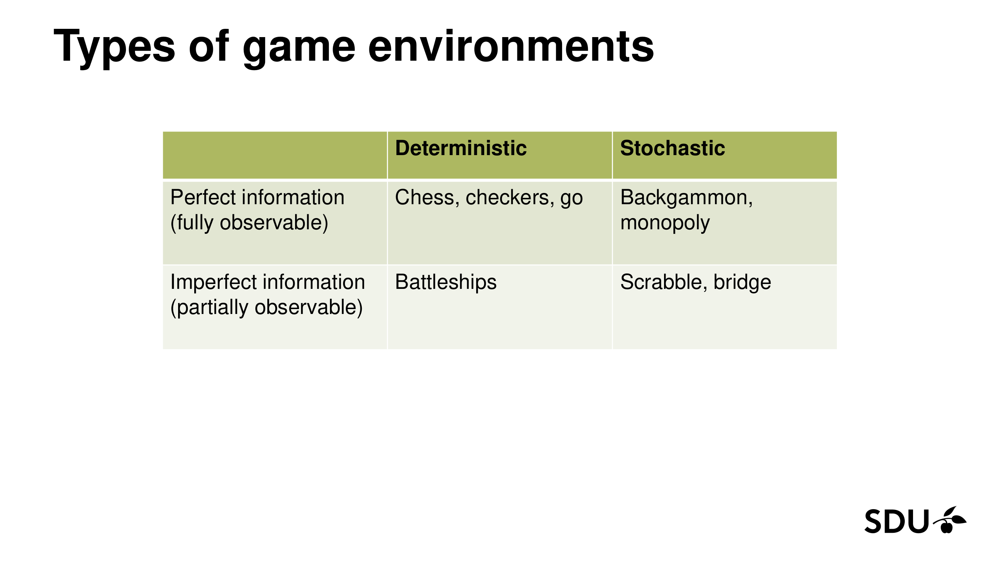
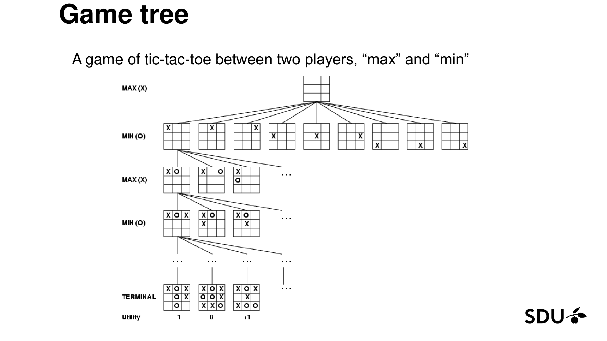
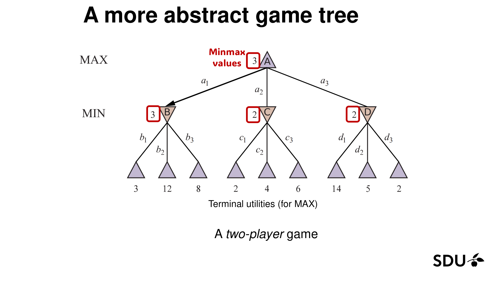
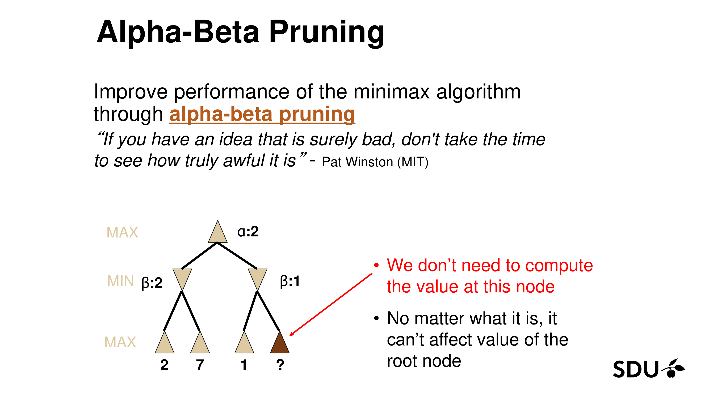
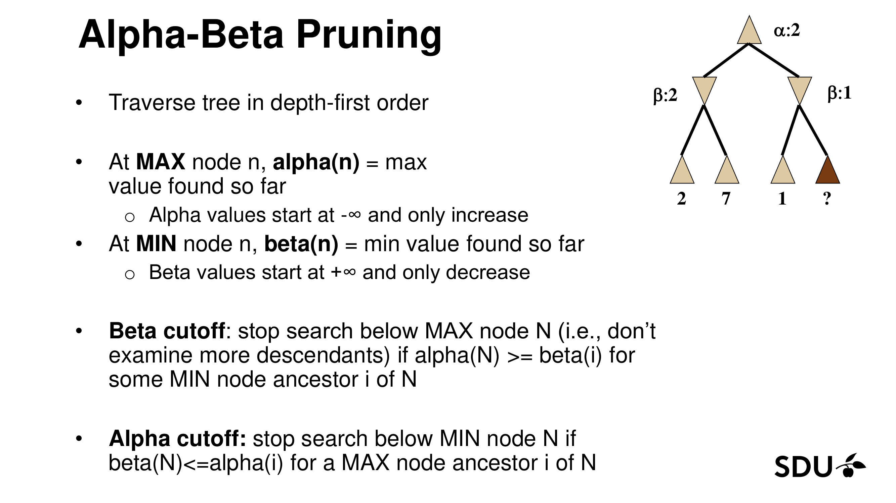
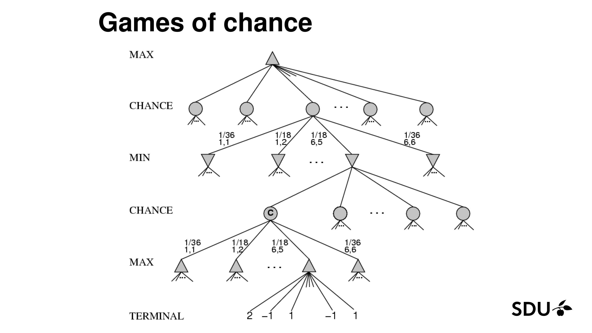
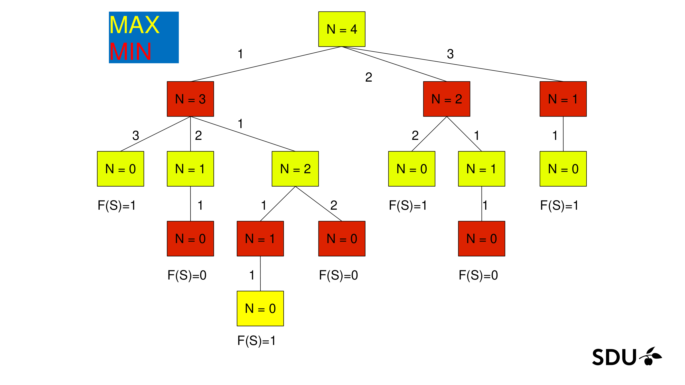
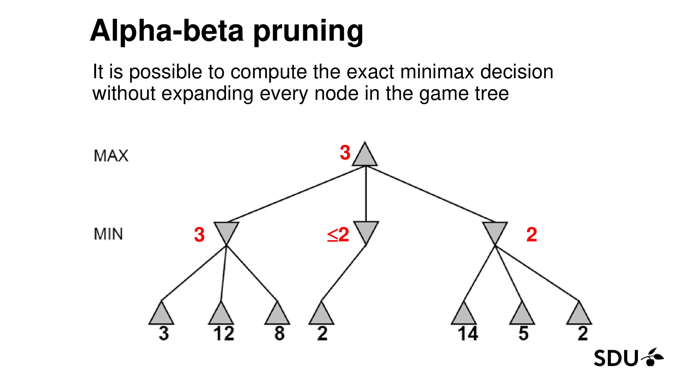
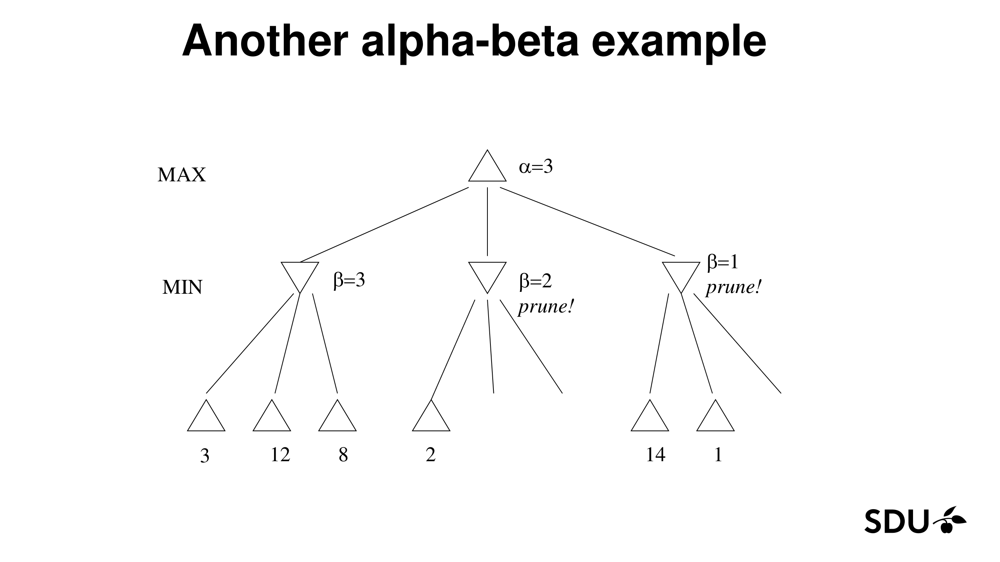
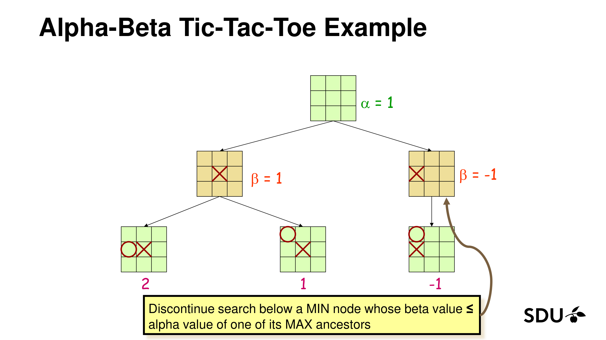

# Lecture 6: Adversarial Search

> **Reading time:** ~60–90 min (dense; consider splitting into two sittings: §1–§4 first, §5–§8 second).  |  **Prereqs:** [L02 — Agents (§3 environment types, §3 utility function)](L02-Agents.md), [L03 — Uninformed Search (§3 search tree, §4 DFS)](L03-Uninformed-Search.md), [L05 — Local Search (§3 heuristic function)](L05-Local-Search.md).
>
> **Glossary terms introduced:** adversarial search, zero-sum game, game tree, MAX node, MIN node, terminal state, minimax, minimax value, minimax strategy, evaluation function, depth-limited search / search horizon / cut-off node, alpha-beta pruning, alpha cutoff, beta cutoff, move ordering, ply, chance node, expectiminimax, Monte Carlo simulation, transposition table, forward pruning.
>
> **Glossary terms reused:** agent (L02), action (L02), state / state space / search tree / node / branching factor / DFS / completeness / optimality / successor function (L03), heuristic function (L05), utility function (L02), fully observable vs partially observable / deterministic vs stochastic / multi-agent (L02 environment taxonomy).

---

## 1. Overview & Motivation

Up to this point in the course the world has been polite: in L03 the environment let us search for a goal at our own pace; in L05 the only obstacle to climbing a fitness landscape was the landscape itself; and in upcoming material on Constraint-Satisfaction Problems the constraints are fixed and we get to choose every variable. **Adversarial search drops that politeness.** There is a *second agent in the world* whose goal is literally the opposite of ours, and that agent moves between every move of ours. We can no longer plan a sequence of actions and expect the world to let us execute it — every action we take is followed by an action picked by someone trying to make us lose.

Why this matters for the course:

- **Games are the historical hallmark of AI.** Chess, checkers, Go and (in the modern era) Poker and StarCraft II are the headline benchmarks the field uses to measure progress. The framework you learn in this chapter is the one that beat Garry Kasparov (Deep Blue, 1997), solved checkers (2007), and underlies AlphaGo. [Lecture 6, slides 1–4, 40.]
- **Games are easy to formalise.** Rules are public, the state space is well-defined, the utility of a terminal state is unambiguous (you won / lost / drew). This is why game playing is the testbed where every search idea gets stress-tested. [Lecture 6, slide 4.]
- **Games model real competitive activities.** Military planning, zero-sum bidding, auctions, ad bidding — anywhere two rational parties have *strictly* opposing utilities, the same algorithmic vocabulary applies. (Not all negotiation is zero-sum — see §2.4 — but the *competitive* slice of negotiation is.) [Lecture 6, slide 4.]

This chapter answers four questions:

1. **What kind of environment are games?** (§3.1)
2. **What is the optimal strategy against a perfect opponent?** → Minimax. (§3.3 definition, §4.1 algorithm)
3. **How do we make it fast enough to be useful?** → Alpha-beta pruning. (§4.2 algorithm, §4.3 properties)
4. **What do we do when the tree is still too deep to search to the end?** → Evaluation functions and depth-limited search. (§3.4 definition + empty-board sanity check; §5.3 worked example combining Eval with alpha-beta on a depth-limited tree)

[Lecture 6, slides 1–4.]

---

## 2. The Big Picture — Analogies

Read this section before anything else. Every formal definition in §3 will refer back to one of these analogies.

### 2.1 Minimax — "you and a perfectly devious opponent take turns, and you both look all the way to the end of the game"

Imagine you and your toughest sibling are dividing a holiday weekend by alternately picking activities from a list. You go first, then your sibling, then you, then them, and so on. Whatever activity you pick, your sibling will reply with the activity that hurts you the most. Whatever they pick, you'll reply with the activity that hurts them the most.

**The minimax mental model:** to choose your *first* activity well, you have to imagine the *entire* sequence of replies that will follow. For each of your candidate first moves, you assume your sibling will pick the worst-for-you reply; for each of those replies, you'd pick the best-for-you counter-reply; and so on, all the way down to the last activity of the weekend. You then take the first move whose imagined endgame leaves you happiest **assuming both of you play perfectly throughout**.

That is *exactly* minimax. You ("MAX") choose at every other level; your sibling ("MIN") chooses at the levels in between; at the bottom (the *terminal state*) the utility is whatever the rules say. Minimax values bubble up from the leaves: MAX-levels take the max of their children, MIN-levels take the min of their children, all the way back to the root.

**Two things come out of this mental simulation**, and conflating them is the most common student bug:
1. The **value** you'd end up with (the number bubbled up from the leaves) — this is what the recursion `Minimax(s)` returns.
2. The **first move** that achieves that value — this is the *decision*; you get it from the root via `argmax`.

The decision wrapper at the root picks (2) by `argmax` over actions; the value recursion computes (1). When the chapter says "the minimax value of a state", it always means (1).

*Where the analogy breaks down:*
- A weekend has finite activities; chess has roughly $10^{123}$ nodes in its full game tree (derived in §3.1 as $35^{80}$). We can almost never look all the way to the leaves; we'll need an *evaluation function* (§3.4) to estimate utility at non-terminal cut-off points.
- Real opponents are not perfect. Minimax is the **strategy that maximises your worst-case payoff** — against a sub-optimal opponent your actual payoff can only go up (§3.3, slide 15) but a different strategy may exploit known weaknesses better. Minimax doesn't try to.

### 2.2 Alpha-beta pruning — "stop reading a bad chess line the moment you realise it's worse than one you already have"

Pat Winston (MIT) put this in one line: *"If you have an idea that is surely bad, don't take the time to see how truly awful it is."* [Lecture 6, slide 20.]

You're considering candidate move A and have already finished evaluating it; it gives you a payoff of, say, 3. Now you start evaluating candidate move B. Halfway through, you see one reply your opponent could make that *already* drops you to a payoff of 2. You don't need to look at any more of B's branches — MIN's job is to find the worst-for-you reply, so MIN's eventual pick will be the minimum across all replies, which is at most 2 (the minimum of any set containing 2 is at most 2; any further reply only pushes MIN's pick *down*, never up). So **B is already worth at most 2, which is worse than A's 3**. Stop reading. Move on.

**The single mnemonic to memorise:** $\alpha$ **is the floor MAX has already guaranteed; $\beta$ is the ceiling MIN has already imposed.** Whenever a node sees the other side's bound cross its own, the rest of the subtree can't matter.

**Alpha-beta pruning is bookkeeping for exactly that argument**, running automatically at every node. You maintain two running bounds along the current path:
- **$\alpha$** = "the best value MAX is *already guaranteed* to achieve, somewhere above on the current path" — the **floor**. Whenever a MIN node's running value drops to $\le \alpha$, MAX won't pick this MIN node anyway — stop expanding its remaining children.
- **$\beta$** = "the worst value MIN is *already guaranteed* to limit MAX to, somewhere above" — the **ceiling**. Whenever a MAX node's running value rises to $\ge \beta$, MIN won't let the game reach this MAX node — stop expanding its remaining children.

*Where the analogy breaks down:*
- **Alpha-beta does not change the answer.** It produces the exact same minimax value as full minimax — it just visits fewer nodes. (§4 makes this rigorous; it is also the property that lets you safely use alpha-beta everywhere minimax appears.)
- The savings depend critically on **move ordering**. With perfect move ordering (best children expanded first), the time complexity drops from $O(b^d)$ to $O(b^{d/2})$ — effectively doubling the depth you can search in the same time. With worst-case (terrible) ordering, alpha-beta degenerates to full minimax. We'll see why in §4.3.

### 2.3 Evaluation function — "give me a one-glance score of who's winning this chess position"

Searching every game tree to its terminal leaves is impossible for any interesting game. So we cut search off at some depth $d$, look at the position we reached, and *estimate* who's winning. That estimate is the **evaluation function**. For chess it might be "material balance + king safety + pawn structure"; for the tic-tac-toe example in the slides it is *"X's open lines minus O's open lines"* (slide 30). The evaluation function plays the role of $h(n)$ from L05's heuristic-search world, but applied to game positions instead of paths-to-goals.

*Where the analogy breaks down:*
- An evaluation function is a *heuristic*; it can be wrong. A position that scores +3 might still be a forced loss if the search depth was too shallow to see the trap. Good game-playing programs spend enormous effort tuning evaluation functions.
- An evaluation function only makes sense at non-terminal cut-off nodes. Terminal nodes get their real utility from the rules of the game.

### 2.4 Zero-sum — "the bigger I win, the bigger you lose, by exactly the same amount"

A zero-sum game is a literal accounting identity: the sum of the two players' payoffs at any terminal state is constant. If I win 1, you lose 1; if we draw, we each get 0. There is no win-win move. This is what justifies the symmetry between MAX (maximising my utility) and MIN (maximising your utility = minimising my utility). Take away zero-sum and the algebra of minimax stops working.

*Where the analogy breaks down:* Real interactions are often **not** zero-sum. Negotiation can be win-win; selling a car to a happier buyer can leave both sides better off. The minimax/alpha-beta framework in this chapter is specifically for zero-sum, perfect-information games. (For poker — imperfect information — and more general games, the field uses **expectiminimax**, *counterfactual regret minimisation*, and *game-theoretic equilibria*, briefly previewed in §6.)

[Lecture 6, slides 6, 11–22, 30.]

---

## 3. Core Concepts

### 3.1 Games as a multi-agent task environment

Games sit squarely in L02's environment taxonomy. The lecture introduces a 2-by-2 grid of game environments:

|  | **Deterministic** | **Stochastic** |
|---|---|---|
| **Perfect information** (fully observable) | Chess, checkers, Go | Backgammon, Monopoly |
| **Imperfect information** (partially observable) | Battleships | Scrabble, Bridge |

(Slide 3 also mentions Poker as a motivating modern AI benchmark, but it does **not** appear in slide 5's 2×2 taxonomy table reproduced above.)


_Figure 1: The 2×2 environment taxonomy used for games. The classical minimax + alpha-beta algorithms target the **upper-left cell** — deterministic, perfect-information, alternating-turn, zero-sum games. The other cells need extensions (§6). (Lecture 6, slide 5.)_

In L02's vocabulary this corner is: **multi-agent, competitive, deterministic, fully observable, sequential, static, discrete**. The "competitive multi-agent" property is the new thing this lecture adds: there is another agent in the environment whose goal contradicts ours and who acts between every pair of our actions. [Lecture 6, slides 3, 5.]

**Why classical search (L03) is not enough.** L03's BFS / DFS / UCS / A\* all assume the *only* dynamics in the environment is the agent's own successor function. Once a second agent makes choices, the agent's action at step $k$ does not determine the state at step $k+1$ — the opponent's reply does. A plan written in L03 fashion ("first do $a_1$, then $a_2$, …") collapses the moment the opponent deviates from what we expected. Game-playing needs a **strategy** (also called a **policy**): a mapping from every state we might *find ourselves in* to the move we'd make in that state. [Lecture 6, slide 7.]

**Why efficiency matters.** Once the second agent has many possible replies, the game tree grows multiplicatively at every level. In chess the branching factor is $b \approx 35$ and a typical game runs $\approx 80$ **ply** (a "ply" is one half-move, i.e. one player's turn; 80 ply ≈ 40 full moves by each side), giving roughly $35^{80} \approx 10^{123}$ nodes — orders of magnitude more than the number of atoms in the observable universe. **Searching to the bottom of the game tree is ruled out for every interesting game.** That is the *single most important constraint* in this lecture and it motivates everything in §4 (alpha-beta pruning) and §3.4 (evaluation functions). [Lecture 6, slide 7.]

[Lecture 6, slides 3–7.]

### 3.2 Game tree, MAX, MIN, terminal states

A **game tree** is a search tree (from L03 §3) with one extra piece of structure: the levels strictly alternate between two players. By convention the player to move at the root is called **MAX**, and the alternating opponent is called **MIN**.

- **Root**: the current game state, with MAX to move.
- **Internal nodes**: alternate MAX-nodes and MIN-nodes by depth.
- **Edges**: legal moves (actions). The number of edges out of any node is its **branching factor** (L03 §3).
- **Terminal states (leaves)**: states where the game is over. Each terminal carries a **utility** value — by convention the utility is measured from MAX's perspective. The lecture uses **two different conventions** depending on the example:
  - **Tic-tac-toe (slide 8):** utility $\in \{-1, 0, +1\}$ meaning $\{$MAX loses, draw, MAX wins$\}$. The $0$ is the **draw** value.
  - **Coins game (slide 17):** utility $F(S) \in \{0, 1\}$ meaning $\{$MIN wins, MAX wins$\}$. No draws are possible in this game, so only two values are used.
  - For the abstract minimax / alpha-beta trees in slides 11 and 23–28, the leaves carry an arbitrary integer payoff measured from MAX's perspective.

The slides illustrate this with the canonical tic-tac-toe game tree, with $3 \times 3$ board states pictured at every level:


_Figure 2: Tic-tac-toe game tree. MAX (X) is to move at the root; MIN (O) replies. Each row of boards represents a depth in the search. Terminal states at the bottom carry utilities **−1, 0, +1** (loss for MAX, **draw**, win for MAX). (Lecture 6, slide 8.)_

The lecture also points the reader at the xkcd webcomic #832 as a one-page chart of the entire optimal tic-tac-toe decision tree from X's perspective — useful as a sanity check but too dense to study at chapter scale. [Lecture 6, slides 9–10, link: <http://xkcd.com/832/>.]

### 3.3 Minimax value of a state

This is the central recursive definition.

> **Minimax value of a node $s$**: the utility of state $s$ for MAX assuming both players play optimally from $s$ onwards. [Lecture 6, slide 13.]

Concretely, define
$$
\text{Minimax}(s) \;=\;
\begin{cases}
\text{Utility}(s) & \text{if } s \text{ is terminal,} \\
\max\limits_{s' \in \text{Successors}(s)} \text{Minimax}(s') & \text{if } s \text{ is a MAX node,} \\
\min\limits_{s' \in \text{Successors}(s)} \text{Minimax}(s') & \text{if } s \text{ is a MIN node.}
\end{cases}
$$
[Lecture 6, slide 14.]

In words: terminal states inherit their utility from the rules of the game; MAX-nodes take the **maximum** minimax value over their children; MIN-nodes take the **minimum** minimax value over their children. The recursion bottoms out at terminals.

> **Minimax strategy**: at the root MAX picks the action whose successor has the highest minimax value — *"choose the move that gives the best worst-case payoff."* [Lecture 6, slide 13.]

The slides reuse the analogy from §2.1: recall the divide-the-weekend story; the minimax value of a state is "the score you'd end up with if both you and your sibling foresee the entire weekend perfectly". [Lecture 6, slide 13.]

The canonical small example from the slides:


_Figure 3: An abstract game tree. The leaves (gray triangles) carry the terminal utilities **3, 12, 8, 2, 4, 6, 14, 5, 2** from left to right. The three MIN nodes (down-pointing triangles labelled B, C, D) take the **min** of their three children: B = min(3, 12, 8) = 3; C = min(2, 4, 6) = 2; D = min(14, 5, 2) = 2. The root MAX node (A) takes the **max** of its three MIN children: A = max(3, 2, 2) = 3. So **MAX should play $a_1$** (the action leading to B). (Lecture 6, slide 11.)_

The lecture revisits this exact tree in §5.2 with alpha-beta on top.

#### 3.3.1 Properties of minimax

The slides emphasise (slide 15):

- **Minimax is optimal against an optimal opponent.** If your opponent really does play the best reply to every move, no strategy you can pick beats minimax. (Proof sketch: induction on tree depth; at leaves the utility is fixed, and at every internal level the player who is about to move provably can't do better than min/max of the optimal-from-there values of the children.)
- **Against a sub-optimal opponent, minimax can only do *at least* as well.** If MIN sometimes picks a child whose minimax value is higher than the minimum, MAX's realised utility goes up. Minimax never gets *worse* by playing a weaker opponent.
- **A different strategy may beat minimax against a sub-optimal opponent**, but only at the cost of doing worse against an optimal one. Tournament-grade programs do not bet on opponent weakness; they play minimax-style.

Minimax is also (where the slides are silent we cross-reference L03):

- **Complete on finite game trees** (every branch eventually hits a terminal). The lecture itself does not formally state completeness; this is L03 §3's definition applied to game trees, by analogy with DFS.
- **Time complexity $O(b^d)$**, with $b$ the branching factor and $d$ the tree depth, because minimax-as-DFS expands every node down to depth $d$. Slide 19 demonstrates the explosion concretely on the coin-game tree (depth 5, $b = 3$, 15 nodes) but does **not** state the closed-form $O(b^d)$ bound; the formula is the standard L03 DFS analysis applied to game trees. The lecture motivates alpha-beta as the answer to "how do we make this faster".
- **Space complexity $O(bd)$** if implemented as recursive DFS (one path's worth of nodes in memory at a time). Slide 19 does not state space complexity; this is the standard L03 DFS analysis applied here.

[Lecture 6, slides 11–15, 19 for the time bound; completeness and space are L03 cross-references, not stated on L06 slides.]

### 3.4 Evaluation function

For tic-tac-toe (9 squares) and the coin game with small $N$ (§5.1) we can search to the bottom of the tree. For chess, Go, etc., we *cannot*. Two complementary tricks make minimax usable:

1. **Cut search off** at some depth $d$ (the **search depth** or **search horizon**).
2. **At cut-off nodes**, replace the recursive `Minimax(s)` with a fast heuristic estimate of utility called the **evaluation function**, denoted $\text{Eval}(s)$.

**Notational discipline.** In this chapter we keep $U(s)$ strictly for the **true terminal utility** (the rule-given payoff at a leaf) and $\text{Eval}(s)$ strictly for the **heuristic estimate** at a non-terminal cut-off. They are never the same function — see §6 pitfall 8.

> **Evaluation function**: a function $\text{Eval}: S \to \mathbb{R}$ that estimates the utility (for MAX) of a non-terminal state. At terminal states we always use the true utility; at non-terminal cut-off states we use $\text{Eval}$. [Lecture 6, slide 30.]

The lecture's worked tic-tac-toe evaluator (slide 30):
$$
\text{Eval}(s) \;=\; (\text{X's open lines}) \;-\; (\text{O's open lines}),
$$
where an "open line" for X is a row, column or diagonal that has no O on it (X might still complete it), and an "open line" for O is symmetric. This is positive when X is ahead, negative when O is ahead, zero in balanced positions.

**Sanity check on an empty board.** The 3×3 board has 8 lines: 3 rows + 3 columns + 2 diagonals. On an empty board every line is open for both X and O, so $\text{Eval}(s) = 8 - 8 = 0$. After X plays the centre, the 4 lines through the centre (1 row, 1 column, 2 diagonals) are still open for X (no O on them) but no longer open for O (each contains an X), while the remaining 4 lines are open for both. Open-for-X = 8, open-for-O = 4, so $\text{Eval} = 8 - 4 = 4$. The fact that empty lines are counted in *both* terms is correct — they cancel out, exactly as they should in a balanced board state.

*Editorial note:* slide 30 gives the formula without defining "open line"; the definition above is the standard reading, but the slide itself leaves it implicit. **Slide 30 also labels the formula `Utility = X's open lines − O's open lines`** — i.e. the slide uses the word "Utility" for what is really a *heuristic estimate at a non-terminal cut-off node*, not the rule-given utility at a true terminal. This chapter keeps the cleaner R&N terminology (`Eval` for the heuristic, `U` for the terminal utility) and treats slide 30's label as unintentionally ambiguous on this point; see §6 pitfall 8 and the "Notational discipline" paragraph above. If an exam question asks "what does slide 30 call this function?", the slide-grounded answer is "Utility"; if it asks "what *is* this function?", the conceptually correct answer is "evaluation function (Eval)".

**Origins note** (slide 41): Claude Shannon (1949) was the first to propose evaluation-function-based search for chess. Arthur Samuel's 1956 checkers program learned its own evaluation function by self-play — a 70-year-old precursor to TD-Gammon's reinforcement-learned evaluator for backgammon (slide 40) and AlphaGo's deep-learned position evaluator (slide 40).

The interaction between depth cutoff and evaluation function is the single biggest engineering trade-off in classical game-playing AI: deeper search hides a worse evaluator, but you need a deep enough search that the evaluator never gets called on a position whose true value will dramatically diverge from the estimate (a *horizon-effect* trap). [Lecture 6, slides 30, 40–41.]

[Lecture 6, slides 30, 40–41.]

### 3.5 Zero-sum and the MAX / MIN labelling

Recall from §2.4: a **zero-sum game** is one in which the sum of all players' utilities at every terminal state is **0** (one player's gain is exactly the other's loss). The more general property — "the sum equals some fixed constant, not necessarily 0" — is called **constant-sum**; the two are equivalent for algorithmic purposes (subtract a constant from one player's utility to convert constant-sum into zero-sum). Slide 6 itself uses the constant-sum framing, and the chapter uses "zero-sum" throughout as shorthand for either. [Lecture 6, slide 6.]

Slide 6 says each player has their own utility function, with the constant-sum property linking the two. Writing $U_{\text{MAX}}(s)$ and $U_{\text{MIN}}(s)$ for each player's individual utility at a terminal state $s$, the constant-sum identity is $U_{\text{MAX}}(s) + U_{\text{MIN}}(s) = \text{constant}$. Zero-sum is what lets us **fold both utilities into a single number** (MAX's utility, since MIN's is determined as $U_{\text{MIN}}(s) = \text{constant} - U_{\text{MAX}}(s)$) and measure everything from MAX's perspective; the chapter's $U(s)$ symbol (see §8 glossary) refers throughout to $U_{\text{MAX}}(s)$ — MAX's view of the terminal payoff. That's why MIN, who would normally try to maximise their own utility $U_{\text{MIN}}$, equivalently *minimises* MAX's utility $U_{\text{MAX}}$ — and why the recursion in §3.3 has a $\max$ at MAX-nodes and a $\min$ at MIN-nodes. In a non-zero-sum game we would need to track both players' utilities separately and the simple max/min recursion would not apply.

Alternating-turn, two-player, zero-sum games are the class for which all the algorithms in §4 are designed. [Lecture 6, slide 6.]

---

## 4. Algorithms / Methods

### 4.1 The Minimax algorithm

Direct translation of the §3.3 recursion into pseudocode:

```text
function MINIMAX(state) returns a value
    if TERMINAL-TEST(state):
        return UTILITY(state)
    if player(state) = MAX:
        v ← -∞
        for each s' in SUCCESSORS(state):
            v ← max(v, MINIMAX(s'))
        return v
    else:                       # player is MIN
        v ← +∞
        for each s' in SUCCESSORS(state):
            v ← min(v, MINIMAX(s'))
        return v

function MINIMAX-DECISION(state) returns an action
    return argmax over actions a of MINIMAX(RESULT(state, a))
```

Notes:

- `TERMINAL-TEST`, `UTILITY`, `SUCCESSORS` and `RESULT` come from L03's problem-formulation vocabulary — successor function, action, transition model, terminal predicate. (Cross-link: [L03 §3 — Successor function](L03-Uninformed-Search.md).)
- The algorithm is a **depth-first traversal** of the game tree. It uses $O(bd)$ space and $O(b^d)$ time, as discussed in §3.3.1.
- `MINIMAX-DECISION` is what you actually call at the root to get the move to make; `MINIMAX` is what you call internally to get the value of a subtree.

[Lecture 6, slide 14.]

### 4.2 Alpha-beta pruning — the algorithm

Alpha-beta keeps two extra values along the DFS recursion:

- **$\alpha$** = best (highest) value MAX is currently guaranteed along the path from the root to this node. Starts at $-\infty$ and **only increases**.
- **$\beta$** = best (lowest) value MIN is currently guaranteed along the path from the root to this node. Starts at $+\infty$ and **only decreases**.

The two cutoffs are (see also §6 pitfall 2 if floor/ceiling direction is unclear):

> **Beta cutoff** (occurs at a MAX node $N$): stop searching below $N$ — don't examine any more of its children — as soon as $\alpha(N) \ge \beta(i)$ for some MIN ancestor $i$ of $N$. Intuition: MIN already has a way (somewhere above) to hold MAX to at most $\beta(i)$; if MAX has *already* found a child of $N$ worth $\ge \beta(i)$, MIN simply won't let the game reach $N$ at all, so any further work below $N$ is wasted. [Lecture 6, slide 22.]
>
> **Alpha cutoff** (occurs at a MIN node $N$): stop searching below $N$ as soon as $\beta(N) \le \alpha(i)$ for some MAX ancestor $i$ of $N$. Intuition: MAX already has a way (somewhere above) to guarantee $\ge \alpha(i)$; if MIN has *already* found a child of $N$ worth $\le \alpha(i)$, MAX simply won't choose the route that reaches $N$, so any further work below $N$ is wasted. [Lecture 6, slide 22.]

A note on convention often confused on exams (slide 21 makes this explicit):

- **"$\alpha$ is used in MIN nodes and is assigned in MAX nodes."** Concretely: "$\alpha$ is *used* in MIN nodes" means the MIN-node cutoff test **reads** $\alpha$ from a MAX ancestor (the inequality `if v ≤ α: return v`). "$\alpha$ is *assigned* in MAX nodes" means only MAX nodes **update** $\alpha$ (via `α ← max(α, v)`).
- **"$\beta$ is used in MAX nodes and is assigned in MIN nodes."** Symmetric: $\beta$ is **read** in MAX-node cutoff tests (`if v ≥ β: return v`) and **updated** only at MIN nodes (`β ← min(β, v)`).
- Mnemonic from the slides (slide 21): *"Think $\alpha$ = at least; $\beta$ = at most."* (And from §2.2 above: $\alpha$ is the **floor**, $\beta$ is the **ceiling**.)

A quick read of the §4.2.1 pseudocode below confirms all four claims. If the wording feels abstract, trace the pseudocode by hand on Figure 4 — the four "$\alpha$/$\beta$ × read/write" cells will become concrete.

**Prose-to-pseudocode bridge.** The two formulations above ($\alpha(N) \ge \beta(i)$ in the cutoff definitions, `v ≥ β` in the §4.2.1 pseudocode) are equivalent: at a MAX node, the running value $v$ is exactly what $\alpha(N)$ would be assigned next (via `α ← max(α, v)`), so the test `v ≥ β` *is* the test "$\alpha(N) \ge \beta(\text{ancestor})$" — performed before the assignment fires. The symmetric statement holds at MIN nodes for `v ≤ α`. The inequalities are non-strict ($\ge$, $\le$) because equality alone is enough to prune: if $v = \beta$ at a MAX node, any further child can only push $v$ even higher (this is the new max), making the MIN ancestor even less willing to come here — so MIN's choice is settled and continuing is wasted work. The same logic applies at MIN with $v = \alpha$.

The motivating mini-example (slide 20):


_Figure 4: A small motivating example. MAX root with two MIN children whose leaves are (2, 7) and (1, ?). After the left subtree, the leftmost MIN takes $\min(2, 7) = 2$, so MAX is already guaranteed $\alpha = 2$. Searching the right subtree, MIN encounters a 1, so its $\beta$ drops to 1. Since $\beta = 1 \le \alpha = 2$, MAX would never pick this MIN's branch — the value of the "?" leaf can no longer change anything, so we don't compute it. (Lecture 6, slide 20.)_

The fully-stated alpha-beta rules slide:


_Figure 5: The alpha-beta rules. DFS order; at MAX nodes $\alpha$ tracks the best-so-far for MAX and only increases; at MIN nodes $\beta$ tracks the best-so-far for MIN and only decreases. Beta-cutoff stops below MAX-$N$ when $\alpha(N) \ge \beta(i)$ for any MIN ancestor $i$; alpha-cutoff stops below MIN-$N$ when $\beta(N) \le \alpha(i)$ for any MAX ancestor $i$. (Lecture 6, slide 22.)_

#### 4.2.1 Pseudocode (Russell & Norvig style)

```text
function ALPHA-BETA-DECISION(state) returns an action
    return argmax over actions a of MIN-VALUE(RESULT(state, a), -∞, +∞)

function MAX-VALUE(state, α, β) returns a value
    if TERMINAL-TEST(state): return UTILITY(state)
    v ← -∞
    for each s' in SUCCESSORS(state):
        v ← max(v, MIN-VALUE(s', α, β))
        if v ≥ β: return v             # β-cutoff — MIN won't let us reach here
        α ← max(α, v)
    return v

function MIN-VALUE(state, α, β) returns a value
    if TERMINAL-TEST(state): return UTILITY(state)
    v ← +∞
    for each s' in SUCCESSORS(state):
        v ← min(v, MAX-VALUE(s', α, β))
        if v ≤ α: return v             # α-cutoff — MAX won't pick this path
        β ← min(β, v)
    return v
```

The structural change from `MINIMAX` is exactly two lines per function: pass $\alpha$ and $\beta$ down, and break out of the children loop when the cutoff condition fires.

[Lecture 6, slides 20–22.]

### 4.3 Properties of alpha-beta

- **Alpha-beta produces the same root value as minimax.** Pruning only removes subtrees whose value cannot influence the root's value; the minimax decision at the root is invariant. This is the property emphasised across slides 23–28: *"It is possible to compute the exact minimax decision without expanding every node in the game tree."* [Lecture 6, slides 23–28.]
- **The lecture itself gives no quantitative complexity bound for alpha-beta.** Slides 23–28 and 35 only state the qualitative "fewer-nodes" property and demonstrate it by example. Slide 19 gives $O(b^d)$ for plain minimax. The standard textbook results below are **supplementary** (Russell & Norvig 3e §5.3); a strict-slide exam answer should say *"the lecture proves the algorithm is correct but does not give a complexity formula."*
- **Best-case time complexity $O(b^{d/2})$** when children at every node are visited in optimal order (best-for-the-player-to-move first). In other words: with perfect move ordering, alpha-beta searches roughly twice as deep as minimax in the same time budget. [R&N 3e §5.3 — supplementary, not in slides.]
- **Worst-case time complexity $O(b^d)$** when children are visited in the worst order (worst-for-the-player-to-move first); alpha-beta degenerates to plain minimax. [R&N 3e §5.3 — supplementary, not in slides.]
- **Completeness and optimality** are inherited from minimax (it's the same algorithm, just with provably-irrelevant branches skipped). [Cross-link to L03's completeness/optimality vocabulary; the lecture itself does not formally analyse these properties for game trees.]

The take-away: alpha-beta does not give you a different *answer*; it gives you the same answer in fewer expanded nodes. Whether the saving is "halving the depth" or "doing nothing" depends entirely on move ordering — which is why every serious chess program puts enormous engineering effort into ordering moves likely to be good first. (See §6 pitfall 4.)

[Lecture 6, slides 23–28, 35; complexity formulas above are R&N supplementary.]

### 4.4 Comparison table

| Algorithm | Returns | Time (worst) | Time (best) | Space | Complete? | Optimal? | When to use |
|---|---|---|---|---|---|---|---|
| Minimax | exact minimax value | $O(b^d)$ | $O(b^d)$ | $O(bd)$ | yes (finite) | yes (maximises worst-case payoff; tight vs optimal opponent) | small game trees (toy domains, depth-2 games) |
| Alpha-beta | exact minimax value | $O(b^d)$ ‡ | $O(b^{d/2})$ ‡ | $O(bd)$ | yes (finite) | yes (same as minimax) | identical answer to minimax; always preferable to plain minimax |
| Depth-limited alpha-beta + evaluation function | approximate value | $O(b^d)$ ‡ | $O(b^{d/2})$ ‡ | $O(bd)$ | no | optimal only if $\text{Eval}(s) = \text{Minimax}(s)$ at every cut-off; otherwise no guarantee | real games where the tree can't be searched to leaves |
| Expectiminimax (§4.6) | optimal **expected** utility | not given by slides | not given by slides | $O(bd)$ | yes | optimal expected utility | stochastic games (Backgammon, Monopoly) |

‡ The slides give no quantitative complexity bound for alpha-beta or expectiminimax. The $O(b^{d/2})$ best-case and the $O(b^d)$ worst-case are textbook results (R&N 3e §5.3); slide 39 only says expectiminimax has a "nasty branching factor". "Optimal expected utility" qualifies the expectiminimax optimality claim — under randomness, the algorithm maximises *expectation* over realisations, not the realised payoff on any single play.

[Lecture 6, slides 14, 19, 22, 35, 39 for the slide-supported entries; complexity formulas above are R&N supplementary, not in slides.]

### 4.5 Additional techniques (briefly)

Slide 36 mentions three engineering tricks layered on top of alpha-beta in real game programs:

- **Transposition table** — a hash-map memoizing already-evaluated states. Many states in a game tree are reachable by multiple move orders; remembering them avoids re-search. (Effectively converts the tree search into a DAG search.)
- **Forward pruning** — discard plausibly-bad moves *without* proving they're bad (unlike alpha-beta, which always preserves the exact minimax value). Trade-off: speed for occasional sub-optimality.
- **Lookup tables for openings and endgames** — instead of searching from the start position, look up the best-known move from a precomputed book; in endgames with few pieces, look up an *exhaustively-solved* table (e.g. all king-and-pawn-vs-king positions are tabulated).

[Lecture 6, slide 36.]

### 4.6 Games of chance — expectiminimax (preview)

Backgammon, Monopoly, and many card games introduce a third kind of node into the tree: a **chance node**, representing an event with random outcomes (dice roll, card draw). The game tree now alternates **MAX → CHANCE → MIN → CHANCE → MAX → …**.


_Figure 10: A game tree for a stochastic game (e.g. Backgammon). Between every MAX and MIN level there is a CHANCE node whose children correspond to the possible dice rolls. Slide 38 itself shows four representative branches with their probabilities (the doubles 1,1 and 6,6 at 1/36; the non-doubles 1,2 and 6,5 at 1/18) and uses "…" for the rest. At a CHANCE node, the backed-up value is the **probability-weighted average** of the children's values. (Lecture 6, slide 38.)_

**Expectiminimax** is the natural extension of minimax. Slide 39 states this in one sentence: *"for chance nodes, average values weighted by the probability of each outcome"*. Spelled out as a piecewise recursion (this four-case formula is the chapter's elaboration; the slide itself only states the chance-node case in words):
$$
\text{Expectiminimax}(s) =
\begin{cases}
U(s) & s \text{ terminal,} \\
\max_{s'} \text{Expectiminimax}(s') & s \text{ MAX,} \\
\min_{s'} \text{Expectiminimax}(s') & s \text{ MIN,} \\
\sum_{s'} P(s' \mid s) \, \text{Expectiminimax}(s') & s \text{ CHANCE.}
\end{cases}
$$

At a chance node we take the **expected value** of the children, weighted by the probability of each outcome. (This connects to L09a's *expected utility*: a CHANCE node *is* an expected-utility computation over a discrete distribution. [Forward-link; L09a not yet written.])

Practical observations from slide 39:

- The branching factor at a CHANCE node is the number of distinct random outcomes — for Backgammon, 36 ordered dice-pairs collapse to 21 unordered combinations (6 doubles + 15 non-double pairs). Either way, this multiplies the size of the search tree substantially.
- Defining evaluation functions for stochastic games is harder because $\text{Eval}$ must be *interpretable as expected utility* (not just an ordering) for the chance-node averaging to make sense.
- **Pruning is harder under randomness.** Alpha-beta's "this branch can't possibly affect the answer" argument relies on adversarial $\min$/$\max$ providing tight bounds; under a $\sum$ at a chance node the bound only tightens as you accumulate more children, so alpha-beta does not transfer directly.
- For games like Backgammon the practical alternative is **Monte Carlo simulation**: at each candidate move, simulate many random complete games to termination, and use the win-percentage as $\text{Eval}$. This is the family of techniques that scales (with deep-learning evaluators) to *Monte Carlo Tree Search* (MCTS) — the engine behind AlphaGo. [Lecture 6, slides 37–39.]

### 4.7 Where game-playing AI stands today

Slide 40 summarises the state of the art:

- **Checkers**: solved in 2007 — every position's true minimax value is known.
- **Chess**: IBM Deep Blue defeated Kasparov in 1997 using alpha-beta + hand-crafted evaluator + opening/endgame tables. (Slide 40 stops here. Chapter elaboration: modern engines extend this in two architecturally different ways — Stockfish uses alpha-beta with a learned neural-network evaluator (NNUE); Leela uses MCTS with a deep-net evaluator. Neither is mentioned on the slide.)
- **Backgammon**: TD-Gammon (1992) used **reinforcement learning** (L10 §3) to *learn* its own evaluation function by playing itself millions of times — a key historical precedent for the AlphaGo line.
- **Bridge**: top systems use Monte Carlo simulation (sampling possible hand assignments) plus alpha-beta on the resulting deterministic-information sub-trees.
- **Go**: branching factor $b = 361$ defeated alpha-beta engines for decades. Existing systems use MCTS + pattern databases. **AlphaGo** combined MCTS with deep neural networks trained on human play and self-play and beat the world champion. (Slide 40 mentions AlphaGo and its MCTS architecture but does not give a year; the well-known match year is 2016 — chapter elaboration, not on slide.)
- **StarCraft II**: 2019, Google AI beats top human players at strategy game StarCraft II. (Slide 40 cites the result; the product name "AlphaStar" is chapter elaboration.)

**Origins** (slide 41):

- **Ernst Zermelo (1912)** — minimax theorem for finite zero-sum games (the mathematical foundation).
- **Claude Shannon (1949)** — "Programming a Computer for Playing Chess" — introduced the evaluation-function approach.
- **John McCarthy (1956)** — alpha-beta search.
- **Arthur Samuel (1956)** — checkers program that learned its own evaluation function from self-play (the first machine-learning game player).

[Lecture 6, slides 40–41.]

---

## 5. Worked Examples

### 5.1 The Coins Game — full minimax

This is the lecture's main self-contained worked example (slides 16–18).

**Rules:**
- Initial state: a stack of $N$ coins.
- Operators (slide 17): on each turn, a player removes 1, 2, or 3 coins.
- Terminal test: there are no coins left on the stack.
- Utility (defined from MAX's perspective): $F(S) = 1$ if MAX wins (i.e. MIN took the last coin), $F(S) = 0$ otherwise. The player who takes the *last* coin **loses**.

**Setup for the worked tree:** $N = 4$, MAX to move first.

The full game tree for $N=4$ is:


_Figure 6: Complete game tree for the Coins Game with $N=4$. The legend at top-left tags **yellow = MAX, red = MIN**. The colour at each node records whose **turn** it would be in that state under strict turn-alternation: yellow = MAX to move, red = MIN to move. This rule is preserved even at the leaves — a yellow $N = 0$ leaf is reached because MIN just took the last coin (so it would have been MAX's turn next, except the game is over); a red $N = 0$ leaf is reached because MAX just took the last coin. Edge labels (1, 2, 3) are the number of coins removed on that move. Each leaf is annotated with $F(S) \in \{0, 1\}$: $F(S) = 1$ if MIN took the last coin (MAX wins), $F(S) = 0$ if MAX took the last coin (MIN wins). (Lecture 6, slide 18.)_

**Backing up the minimax values (bottom-up).**

Each leaf is a state with $N = 0$. The convention on the slide (slide 17) is $F(S) = 1$ if MAX wins, $F(S) = 0$ if MIN wins. The player who takes the last coin **loses**; therefore an $N = 0$ leaf reached because MIN just took the last coin has $F(S) = 1$ (MAX wins), and an $N = 0$ leaf reached because MAX just took the last coin has $F(S) = 0$ (MIN wins). This matches the figure's leaf labels exactly.

We compute the minimax value of every sub-state once, from the smallest up. The computation is the same regardless of where in the tree the sub-state appears, so we list each $N$/who-moves combination only once:

| Sub-state | Player to move | Options | Recursion | Value |
|---|---|---|---|---|
| $N = 1$ | MAX | only legal action: take 1 → $N = 0$, MAX just took last → $F(S) = 0$ | (no choice) | **0** |
| $N = 1$ | MIN | only legal action: take 1 → $N = 0$, MIN just took last → $F(S) = 1$ | (no choice) | **1** |
| $N = 2$ | MAX | take 1 → MIN-at-$N{=}1$ (= 1); take 2 → $N = 0$, MAX took last → $F(S) = 0$ | $\max(1, 0)$ | **1** |
| $N = 2$ | MIN | take 1 → MAX-at-$N{=}1$ (= 0); take 2 → $N = 0$, MIN took last → $F(S) = 1$ | $\min(0, 1)$ | **0** |
| $N = 3$ | MIN | take 1 → MAX-at-$N{=}2$ (= 1); take 2 → MAX-at-$N{=}1$ (= 0); take 3 → $N = 0$, MIN took last → $F(S) = 1$ | $\min(1, 0, 1)$ | **0** |
| $N = 4$ (root) | MAX | take 1 → MIN-at-$N{=}3$ (= 0); take 2 → MIN-at-$N{=}2$ (= 0); take 3 → MIN-at-$N{=}1$ (= 1) | $\max(0, 0, 1)$ | **1** |

So at the root $N = 4$, MAX picks the action whose minimax value is 1: **take 3 coins**, leaving $N = 1$ for MIN. MIN is forced to take the last coin and lose. The minimax value of the $N = 4$ position is **1** (MAX wins). [Lecture 6, slide 18.]

(Slide 18's figure draws MIN's three branches in the order 3, 2, 1 from left to right; the table above lists each branch by what MAX-or-MIN does, so the slide-figure order and the table order do not match one-for-one. Cross-check by tracing the values back to Figure 6's labelled edges.)

**Tree statistics for this example** (slide 19):
- Max depth: 5
- Branching factor (max): 3
- Total nodes: 15

Even on this trivial 4-coin game, the tree already has 15 nodes — a foretaste of the $O(b^d)$ explosion that motivates alpha-beta.

[Lecture 6, slides 16–19.]

### 5.2 Alpha-beta on the abstract tree (the canonical 9-leaf example)

This is the example threaded across slides 11 and 23–28 and culminating in slide 35.

**Setup:** The same tree as Figure 3. MAX root, three MIN children (left, middle, right), nine leaves with utilities $3, 12, 8 \mid 2, 4, 6 \mid 14, 5, 2$ (left, middle, right triples). **Children at every level are expanded in left-to-right DFS order** throughout this walkthrough — a different ordering produces a different prune set (see §6 pitfall 4).

**Frame-by-frame walkthrough** (slides 23–28):

1. **Frame 23 (slide 23):** initial state. Tree drawn; no values yet on internal nodes. $\alpha = -\infty$, $\beta = +\infty$ everywhere.
2. **Frame 24 (slide 24):** DFS dives into the left MIN. Its three leaves are 3, 12, 8 → it backs up $\min(3, 12, 8) = 3$. Returning to the root, MAX now has a candidate value of 3, so $\alpha = 3$ at the root.
3. **Frame 25 (slide 25):** DFS descends into the middle MIN. First leaf is 2 → the local running value $v$ at this MIN is now 2. Cutoff test (`if v ≤ α: return v` from §4.2.1's pseudocode): $v = 2 \le \alpha = 3$, **yes**. The function returns $v = 2$ immediately, **without expanding the middle MIN's remaining two children** (the leaves 4 and 6). Those two leaves are *pruned under the assumed left-to-right DFS ordering* — re-expanding right-to-left would visit 6 first ($\beta \leftarrow 6$, no prune), then 4 ($\beta \leftarrow 4$, no prune), then 2 ($\beta \leftarrow 2$, but no children left to skip), yielding a different prune set on the *same* tree.

   > **Pedagogy note on notation.** Slide 28 draws the middle MIN annotated "$\le 2$" because, when only the first child has been seen, MIN can only commit to *at most* 2. The actual value returned by the function is the exact running $v = 2$ — the "$\le$" reflects the partial-information drawing convention on the slide, not a different return value. (Either way, all MAX needs to know is "this MIN is no better than 2", and MAX already has 3 from the left subtree.)
4. **Frame 26–27 (slides 26–27):** DFS descends into the right MIN. First leaf is 14 → local $v = 14$ at this MIN. Cutoff test: $v = 14 \le \alpha = 3$? **No** ($14 > 3$), so we continue. Update local $\beta = \min(\beta, 14) = 14$. Next leaf is 5 → $v = \min(14, 5) = 5$. Cutoff test: $5 \le 3$? **No**, continue. Next leaf is 2 → $v = \min(5, 2) = 2$. Cutoff test: $2 \le 3$? **Yes** — the function would return immediately, but in this case all three children have already been examined, so the return value is simply 2. **The same cutoff mechanism fires as in the middle MIN — the only difference is that there are no remaining children left to skip, so the prune saves no work in this particular ordering.**
5. **Frame 28 (slide 28):** Final values: left MIN = 3, middle MIN = 2 (drawn as "≤2"; two of its three children were pruned), right MIN = 2 (no pruning saved). Root = $\max(3, 2, 2) = 3$. **MAX plays the leftmost move.**

The final-state diagram:


_Figure 7: Final state of the alpha-beta sweep on the abstract tree. The middle MIN's value is shown only as **≤ 2** because two of its three leaves (4 and 6) were never visited — those are the **pruned** nodes. The exact minimax decision (play the leftmost move, value 3) is identical to what plain minimax would return — alpha-beta just got there faster. (Lecture 6, slides 23–28.)_

Slide 35 of the lecture revisits a **variation on the same tree topology** — same shape (root MAX, three MIN children, three leaves each) and same first seven leaves $\{3, 12, 8, 2, 4, 6, 14\}$, but the **eighth leaf has been changed from 5 to 1** (the ninth leaf is drawn but not labelled). With this single value change, the sweep prunes more aggressively:


_Figure 8: A **variation** of Figure 7 with the same tree topology but different right-MIN leaf values (slide 28's $\{14, 5, 2\}$ becomes $\{14, 1, ?\}$ on slide 35). Annotated with explicit $\alpha$/$\beta$ values: root MAX has $\alpha = 3$; the left MIN finishes with $\beta = 3$; the middle MIN ends with $\beta = 2$ followed by "prune!"; the right MIN ends with $\beta = 1$ followed by "prune!". The right MIN's $\beta = 1$ is **only reachable because slide 35's second right-MIN leaf is 1** — no permutation of $\{14, 5, 2\}$ can produce $\beta = 1$. Slide 35 labels only the leaves needed to make the prune logic visible; the third right-MIN leaf is drawn but unlabelled. (Lecture 6, slide 35.)_

**How many leaves were visited?** On slide 28's tree $\{3, 12, 8, 2, 4, 6, 14, 5, 2\}$ with left-to-right ordering: left MIN expands all 3 children (3, 12, 8), middle MIN cuts off after its first child (2), right MIN expands all 3 children (14, 5, 2). That gives $3 + 1 + 3 = 7$ of the 9 leaves visited, with 2 pruned (middle MIN's second and third children). On slide 35's variation $\{3, 12, 8, 2, 4, 6, 14, 1, ?\}$: left MIN still visits all 3, middle MIN still cuts off after 1 child, but the right MIN now cuts off after 2 children (because $\beta$ drops to 1 on the second child, which satisfies $\beta \le \alpha = 3$). That gives $3 + 1 + 2 = 6$ leaves visited (with 3 pruned: middle MIN's second and third children, plus the right MIN's third child). The pedagogical point: alpha-beta's prune count depends on the leaf values it encounters — a single value change ($5 \to 1$) here moves the right MIN's third child from "visit" to "prune". This is the same intuition that underlies *move ordering* (see §6 pitfall 4): the order in which children are visited determines which leaf values $\alpha$/$\beta$ encounter first, which in turn determines the prune set. With perfectly bad move ordering on a fixed tree, alpha-beta degenerates to minimax (all 9 leaves visited).

[Lecture 6, slides 23–28, 35.]

### 5.3 Alpha-beta with an evaluation function — depth-limited tic-tac-toe

Slides 29–34 walk through alpha-beta on a tic-tac-toe sub-tree with a *depth-limited* cutoff, using the evaluation function
$$
\text{Eval}(s) \;=\; (\text{X's open lines}) - (\text{O's open lines}).
$$

**Setup:** It is X's move (MAX). The slide draws the root as an empty $3 \times 3$ board, two candidate X moves (the two MIN children, both with X already placed differently). At depth 2 the search hits its cut-off and applies the evaluation function.

**Frame-by-frame walkthrough** (slides 29–34):

1. **Slide 29:** Set up. Empty board at root, two MIN-children boards considered.
2. **Slide 30:** Left MIN expands its first child (X in a corner, O somewhere). The cut-off triggers and Eval = 2 for this leaf. Left MIN's $\beta$ is now 2 (an upper bound on this MIN node's final value). The slide explicitly calls out: *"Beta value of a MIN node is upper bound on final backed-up value; it can never increase."*
3. **Slide 31:** Left MIN expands its second child. Eval = 1 for this leaf. Left MIN's $\beta$ drops to 1. (As advertised, $\beta$ only decreases.)
4. **Slide 32:** Left MIN finishes. Its backed-up value is 1. Back at the root MAX, $\alpha = 1$ — MAX is guaranteed at least 1. The slide notes: *"Alpha value of MAX node is lower bound on final backed-up value; it can never decrease."*
5. **Slide 33:** Right MIN starts. Its first leaf yields Eval = −1. Right MIN's $\beta$ drops to −1.
6. **Slide 34:** Check the alpha-cutoff: $\beta = -1 \le \alpha = 1$? **Yes** → prune the rest of the right MIN's children without expanding them. The slide writes the rule out one more time: *"Discontinue search below a MIN node whose beta value ≤ alpha value of one of its MAX ancestors."*

**Result:** MAX plays the move corresponding to the left subtree (value 1), in preference to the right subtree (cut off after the first child returned −1). The slide does not label which physical X-placement this corresponds to — the lesson is the algorithmic decision, not the board move.


_Figure 9: Final state of the alpha-beta walkthrough on the depth-2 tic-tac-toe tree. Root MAX has $\alpha = 1$ from the left subtree; the right MIN's first leaf yields evaluation −1, dropping $\beta$ to −1, which immediately triggers an alpha-cutoff. Slide 34 draws only the single visited child under the right MIN; in the full game the right MIN would have one candidate per legal O-move from its parent position, but the alpha-cutoff stops the search after the first one without expanding the others. (Lecture 6, slide 34.)_

The pedagogical point: even with a depth-limited search and a fast evaluation function, alpha-beta's pruning logic is unchanged — it operates on whatever values come back from cut-off nodes the same way it operates on terminal utilities. (See §6 pitfall 5 on the *only* place this distinction matters: at true terminals you must use the rule-given `UTILITY`, not `EVAL`.)

[Lecture 6, slides 29–34.]

### 5.4 Branching-factor reality check (chess)

Slide 7 gives the magnitude argument concretely:
$$
35^{80} \;\approx\; 10^{123}
$$
for chess searched to the typical end. Strictly, $35^{80}$ is the number of **leaf-level** game-tree nodes (the count at depth 80 if the tree branches uniformly with $b = 35$). The total node count is the geometric-series sum $\sum_{i=0}^{80} 35^i \approx 35^{81}/34$, which is the same order of magnitude $\approx 10^{123}$ since the leaves dominate. Slide 7 itself says "nodes"; the leaf-vs-total distinction does not change the take-away. For comparison the number of atoms in the observable universe is $\approx 10^{80}$. Exhaustive minimax of chess is not just impractical — it is more than astronomically impossible.

Two implications:

1. **Depth-limited search is mandatory.** Real programs search 8–20 ply deep with an evaluation function at the horizon. (One **ply** = one half-move = one player's turn; chess "80 ply" means 80 half-moves, i.e. roughly 40 moves by each side.)
2. **Alpha-beta saves substantial work even though the lecture does not quantify it.** With $b = 35$ and the standard R&N best-case result $O(b^{d/2})$ (supplementary, §4.3), alpha-beta can search to roughly twice the depth of minimax in the same time budget. [Lecture 6, slide 7; complexity formula is R&N supplementary, not in slides.]

---

## 6. Common Pitfalls / Exam Traps

A list of the mistakes that have historically shown up on exams and assignments built around this lecture:

1. **Confusing where $\alpha$ and $\beta$ are *used* vs *updated*.** $\alpha$ is *assigned* (updated) at MAX nodes (because MAX nodes are where you find higher-for-MAX values) and *used* (read for cutoff decisions) at MIN nodes. $\beta$ is *assigned* at MIN nodes and *used* at MAX nodes. Slide 21 spells this out. The exam-trap is to write the cutoff test "$\alpha \ge \beta$" at the wrong node type or with the inequality reversed.
2. **Cutoff direction confusion.** Mnemonic: *$\alpha$ is the floor, $\beta$ is the ceiling.* At MAX nodes you prune when the running value $v$ reaches the ceiling ($v \ge \beta$ — β-cutoff). At MIN nodes you prune when the running value $v$ reaches the floor ($v \le \alpha$ — α-cutoff). Slide 22 names them this way; if you swap them on an exam you'll prune the wrong subtree.
3. **Forgetting that alpha-beta gives the **same answer** as minimax.** A common confusion is to think pruning changes the minimax decision. It doesn't — only the *number of expanded nodes* changes. (Slide 23 hammers this in the title: *"It is possible to compute the exact minimax decision without expanding every node in the game tree."*)
4. **Believing move ordering doesn't matter.** Move ordering matters enormously: the R&N best-case $O(b^{d/2})$ requires expanding the **best move first** at every node, while the worst-case $O(b^d)$ happens with the **worst move first**. The lecture itself does not introduce move ordering as a knob (it is not in slides 21–22 or 35); slides 28 and 35 walk **closely-related** 9-leaf trees (same topology, but slide 35 changes the right-MIN's second leaf from 5 to 1) and so prune different leaf sets — the more aggressive pruning on slide 35 comes from the leaf-value change, not from any reordering, but illustrates the same underlying lesson: the prune count depends on which values $\alpha$/$\beta$ encounter first. The textbook claim is R&N supplementary, not in slides.
5. **Using the evaluation function at terminal states.** $\text{Eval}$ is only ever called at non-terminal cut-off nodes. At true terminal states use the rules' utility (the win/draw/lose payoff). The tic-tac-toe example in §5.3 uses Eval at cut-off because the tree wasn't searched to the leaves; in the slide-18 coin game tree, the leaves *are* terminals so $F(S)$ is used.
6. **Misreading the evaluation function for tic-tac-toe.** Slide 30 gives the formula *"X's open lines − O's open lines"* but does not define "open". The standard reading (used in §3.4) is: a line is **open for X** if it contains no O (X might still complete it), and **open for O** if it contains no X. So a completely empty line is open for *both*, and the two terms cancel; a line with one X is open for X but not for O; a line with both an X and an O is open for neither. A common student error is to count "lines that contain an X" — that's *closed-for-O* lines, not "X's open lines". Editorial note: the precise definition is not on the slide; the chapter follows the standard interpretation.
7. **Assuming minimax adapts to a sub-optimal opponent.** It doesn't (slide 15). Minimax plays as if the opponent is perfect. Against a weaker opponent your *realised* utility may be higher than the minimax value (because they make sub-optimal moves), but minimax itself doesn't try to exploit weakness. A strategy that does will lose to a perfect opponent.
8. **Conflating the *evaluation function* (§3.4) with the *utility function* (§3.5 / L02).** Utility $U(s)$ is the **true** payoff at a terminal state (rule-given); the evaluation function $\text{Eval}(s)$ is a **heuristic estimate** of utility at a non-terminal cut-off state. This chapter keeps the two notations strictly separate; some textbooks reuse the letter $U$ for both because at terminals they coincide, but that overloading is exactly what trips students up.
9. **Forgetting the zero-sum precondition.** Minimax and alpha-beta in this lecture assume zero-sum. In a non-zero-sum game, MIN minimising MAX's utility is not the same as MIN maximising MIN's utility. The algorithms don't carry over directly.
10. **Misremembering the chess complexity.** It is $b \approx 35$, $d \approx 80$ (ply), $\approx 10^{123}$ nodes. Some students remember $b = 80$ or $d = 35$. The numbers are different magnitudes and tell different stories.

[Lecture 6, slides 7, 15, 19, 21–22, 23–28, 30, 35.]

---

## 7. Connections to Other Lectures

The vocabulary of this lecture reuses, almost verbatim, the search vocabulary from L03 and the agent vocabulary from L02, with two upgrades (a second agent, and an interleaved $\min$ in the recursion).

**Inbound cross-references — concepts L06 *uses* but does not *introduce*:**

- **Agent / action / state / state space / successor function / search tree / node / branching factor / DFS / completeness / optimality** — all from [L03 — Uninformed Search](L03-Uninformed-Search.md). The minimax algorithm is structurally a DFS of the game tree (slide 22 makes this explicit: *"Traverse tree in depth-first order"*). Alpha-beta is the same DFS with two extra parameters.
- **Heuristic function** — from [L05 — Local Search §3](L05-Local-Search.md). The evaluation function $\text{Eval}(s)$ at non-terminal cut-off nodes plays the same role here that $h(n)$ played for informed search: a fast, possibly-wrong estimate that guides search when the true cost-to-leaf is unaffordable.
- **Utility function / performance measure** — from [L02 — Agents](L02-Agents.md). Terminal utilities in the game tree are MAX's performance measure; the rational-agent framework from L02 §3 applies, with the wrinkle that L09a §3 (expected utility) is needed once chance enters the game (§6).
- **Multi-agent / deterministic / fully observable** — environment-property names from L02 §3. This lecture lives in the corner *competitive multi-agent + deterministic + fully observable + zero-sum* (slide 5).
- **Fully observable vs partially observable** — from [L02 §3](L02-Agents.md). Slide 5's "perfect-information vs imperfect-information" is the game-theoretic naming for the same dichotomy.
- **Single agent vs multi-agent** — also from [L02 §3](L02-Agents.md). Games are the canonical multi-agent setting.

**Outbound cross-references — concepts L06 *introduces* that later lectures (or labs) build on:**

- **Evaluation function** — feeds the *informed-search* family more generally. Bridge to L05's heuristic-search world. (Glossary cross-link: "alternative name *heuristic estimate*".)
- **Game tree / minimax / alpha-beta** — the direct prerequisites for **Lab 5 — Alpha-Beta / Tic-Tac-Toe** ([handout/handout/Lab 5.pdf](../../handout/handout/Lab%205.pdf)). Lab 5 asks the student to implement the `alpha_beta` module on top of a `tictactoe_template`; every concept the student touches there (`Eval`, `α`, `β`, DFS-with-cutoffs, depth-limited search) comes from this chapter. The lab's KNOBs include search depth, evaluator weights, and move ordering — direct levers on §4.3's properties.
- **Reinforcement learning (RL)** — slide 40 mentions TD-Gammon's RL-learned evaluation function; that is the bridge to [L10 — Intro to ML §3](L10-Intro-to-ML.md) (RL is introduced there as one of the three learning paradigms). The connection: the *evaluation function* is the natural thing to learn from self-play, because it's the place in the minimax recursion that has no rule-given answer.

**Bridges from §4.6 / §4.7 (chance games & state of the art) to other lectures:**

- *Expectiminimax* (§4.6) introduces **chance nodes** — a parent to the probability nodes you'll meet in [L09a §3 (joint, marginal, conditional probability)](L09a-Bayesian-Networks.md). The "1/36" branch label on slide 38 IS a probability; the chance-node averaging IS an expected-utility computation (L09a §3).
- *Monte Carlo simulation* at chance nodes (slide 39) is a stochastic-sampling cousin of the inference-by-enumeration vs sampling family discussed in L09a.
- *TD-Gammon's learned evaluation function* (slide 40) is the bridge from minimax to [L10 — Intro to ML §3 — reinforcement learning](L10-Intro-to-ML.md).

---

## 8. Cheat-Sheet Summary

One page, designed for the night before the exam. Each item carries a one-line analogy reminder in italics.

### Definitions (canonical names)

- **Adversarial search**: search in environments with other agents whose goals conflict with the agent's. *Like search, but the world fights back between your moves.*
- **Zero-sum game**: two-player game where MAX's utility + MIN's utility = constant. *Bigger I win = bigger you lose, by the same amount.*
- **Game tree**: search tree where levels alternate between MAX and MIN. *A search tree with two players taking turns.*
- **Terminal state**: a node where the game is over. *Where the rules give a definitive utility.*
- **Minimax value** of state $s$:
  $$\text{Minimax}(s) = \begin{cases} U(s) & \text{terminal} \\ \max_{s' \in \text{Succ}(s)} \text{Minimax}(s') & s \text{ is MAX} \\ \min_{s' \in \text{Succ}(s)} \text{Minimax}(s') & s \text{ is MIN} \end{cases}$$
  *Both players play perfectly all the way to the end.*
- **Evaluation function** $\text{Eval}(s)$: heuristic estimate of utility at non-terminal cut-off states. Tic-tac-toe in slides: $\text{Eval}(s) = (\text{X's open lines}) - (\text{O's open lines})$. *Like a heuristic $h(n)$, but for "who's winning right now?"*
- **Alpha-beta pruning**: minimax that maintains $\alpha$ (best-for-MAX seen so far) and $\beta$ (best-for-MIN seen so far) along the current path; skips subtrees that cannot affect the root value. *Stop reading a chess line the moment you see it's worse than one you already have.*
- **Alpha cutoff** at MIN node $N$: stop if $\beta(N) \le \alpha(i)$ for a MAX ancestor $i$. *"MAX has a way to do at least $\alpha(i)$; if this MIN already drops below that, MAX will steer the game elsewhere."*
- **Beta cutoff** at MAX node $N$: stop if $\alpha(N) \ge \beta(i)$ for a MIN ancestor $i$. *"MIN already has a way to hold us to at most $\beta(i)$; if this MAX is already worth more, MIN won't let us in here."*

### Pseudocode skeleton

```text
function ALPHA-BETA-VALUE(state, α, β, is_max, depth):
    if TERMINAL-TEST(state): return UTILITY(state)   # rule-given payoff
    if depth = 0: return EVAL(state)                 # heuristic at horizon
    v ← -∞ if is_max else +∞
    for s' in SUCCESSORS(state):
        v' = ALPHA-BETA-VALUE(s', α, β, not is_max, depth - 1)
        v ← (max if is_max else min)(v, v')
        if is_max:
            if v ≥ β: return v                       # β-cutoff
            α ← max(α, v)
        else:
            if v ≤ α: return v                       # α-cutoff
            β ← min(β, v)
    return v
```

**Reading this:** at a true terminal (game over) we always use `UTILITY(state)` — the rules' payoff. Only at the artificial horizon (`depth = 0` with the game still in progress) do we substitute `EVAL(state)`. Confusing these is exam-trap #5 in §6.

### Properties at a glance

| Property | Minimax | Alpha-beta |
|---|---|---|
| Returns | exact minimax value | exact minimax value (same as minimax) |
| Complete (finite tree) | yes | yes |
| Optimal vs optimal opp. | yes | yes |
| Worst-case time | $O(b^d)$ | $O(b^d)$ |
| Best-case time | $O(b^d)$ | $O(b^{d/2})$ (with perfect move ordering) |
| Space (DFS) | $O(bd)$ | $O(bd)$ |
| Sensitive to move ordering? | no | **YES** — R&N supplementary; the lecture does not introduce move ordering as a knob, but with perfect ordering best-case becomes $O(b^{d/2})$ |

### Symbols glossary

| Symbol | Meaning |
|---|---|
| $b$ | branching factor (L03 §3) |
| $d$ | search depth |
| $s, s'$ | game state, successor state |
| $U(s)$ | true utility of a terminal state, measured from MAX's perspective (equivalent to $U_{\text{MAX}}(s)$) |
| $U_{\text{MAX}}(s), U_{\text{MIN}}(s)$ | the two players' individual utilities at a terminal $s$; in a constant-sum game $U_{\text{MAX}}(s) + U_{\text{MIN}}(s) = \text{constant}$ (§3.5) |
| $\text{Eval}(s)$ | heuristic evaluation at a non-terminal cut-off |
| $\alpha$ | best-for-MAX value found so far on the current root path — a **lower bound** (floor) on MAX's final achievable value |
| $\beta$ | best-for-MIN value found so far on the current root path — an **upper bound** (ceiling) on what MIN will allow MAX to reach |

### Exam-night checklist

- [ ] Can I write the minimax recursion from memory? (§3.3)
- [ ] Do I know the cutoff direction for $\alpha$ and $\beta$? (mnemonic: $\alpha$ floor, $\beta$ ceiling — §4.2)
- [ ] Could I do the alpha-beta sweep on a small abstract tree by hand? (re-walk §5.2)
- [ ] Could I do the alpha-beta sweep on a depth-limited tic-tac-toe tree using an evaluation function? (re-walk §5.3)
- [ ] Can I name two things alpha-beta does NOT change vs minimax? (the answer it returns; the worst-case complexity)
- [ ] Can I explain how the order in which children are expanded affects the number of nodes alpha-beta visits? (move ordering — R&N supplementary; lecture itself does not quantify this)
- [ ] Do I remember the chess magnitude argument? ($b \approx 35$, $d \approx 80$ ply, $35^{80} \approx 10^{123}$)

---

_Source: Lecture 6 slides 1–42 — Adversarial Search (Serkan Ayvaz)._
