# Lecture 7: Constraint Satisfaction Problems

> **Reading time:** ~60–75 min  |  **Prereqs:** [L03 Uninformed Search](L03-Uninformed-Search.md) (DFS, search-tree vocabulary)  |  **Useful prior reading:** [L05 Local Search](L05-Local-Search.md) (n-queens as a search problem)
> **Glossary terms introduced:** CSP, Variable (CSP), Variable domain, Constraint, Constraint graph, Consistent assignment, Backtracking search (CSP), Minimum Remaining Values (MRV), Degree heuristic, Least Constraining Value (LCV), Forward checking, Arc consistency, Constraint propagation, Arc-consistency algorithm (textbook name: AC-3). See [`_shared/glossary.md`](../_shared/glossary.md).

---

## 1. Overview & Motivation

A **Constraint Satisfaction Problem (CSP)** is an *identification problem*: instead of finding a path through a maze (the search problems of [L03](L03-Uninformed-Search.md)) or maximising an objective (the local-search problems of [L05](L05-Local-Search.md)), the task is to **identify any assignment** of values to a fixed set of variables that satisfies every constraint.

A CSP is defined by a triple $\langle X, D, C \rangle$:

- **Variables** $X_1, X_2, \dots, X_n$ — the unknowns we must fill in.
- **Domains** $D_1, D_2, \dots, D_n$ — each $X_i$ must take exactly one value from its non-empty domain $D_i$.
- **Constraints** $C_1, C_2, \dots, C_m$ — each $C_j$ specifies which combinations of values are allowed for some subset of the variables.

A **solution** is a *complete* (every variable assigned) and *consistent* (no constraint violated) assignment.

Why is this its own topic, separate from search?

1. **Structure is exploitable.** The constraint graph (§3) lets the algorithm fail fast when a partial assignment is doomed — long before it would be visible at the bottom of a search tree. The 8-queens slide makes this concrete: even after the slide's redundancy reduction (one queen per column), generate-and-test must enumerate $8^8 = 16{,}777{,}216$ combinations; with the right pruning a backtracking solver explores a few hundred. [Lecture 7, slides 2–5.]
2. **Real-world payoff is huge.** The slide lists assignment problems, timetabling, transportation scheduling, and factory scheduling, with `csplib.org` as a pointer to many more (Sudoku solvers, automated theorem provers, etc.). [Lecture 7, slide 15.]
3. **The toolkit transfers.** Every algorithm we will meet — backtracking with variable / value ordering, forward checking, arc consistency — is reused unchanged across these wildly different domains. Master them once on map-coloring and Sudoku; reuse them everywhere.

CSPs sit between classical search (where path matters) and local search (where only the final state matters). Like local search they don't care about how we got to the assignment, only that it satisfies the constraints. Unlike local search, CSPs come with rich structural information (the constraint graph) that we can use to prune cleverly rather than wander stochastically.

The three families of techniques the lecture introduces — and which we will study in §4 — are:

- **Backtracking search** — a depth-first variable-by-variable enumeration with a cheap consistency check at every step.
- **Variable- and value-ordering heuristics** — *which variable next?* (MRV, degree) and *which value first?* (LCV) decisions that dramatically prune the search tree without changing what is searched.
- **Constraint propagation** — forward checking, then the more aggressive arc consistency: inferring the consequences of every partial assignment by shrinking other variables' domains, so we detect "no possible completion" as early as possible.

[Lecture 7, slides 1–2, 25.]

---

## 2. The Big Picture — Analogies

Before any formalism, build a mental model for each new idea. Each analogy below carries a "where the analogy breaks down" caveat — these limits matter, because a wrong analogy mis-trains intuition for the exam.

**How to read this section.** Each subsection covers one glossary concept and pairs an everyday analogy with its formal §3/§4 home, so you can flip back to the rigorous treatment at any point. The mapping:

| Analogy | Concept | Formal section |
|---|---|---|
| §2.1 Sudoku grid | CSP | §3.1, §3.4.4 |
| §2.2 Wedding seating | Constraint graph | §3.3 |
| §2.3 Most-cornered square | MRV | §4.4 |
| §2.4 Leaving doors open | LCV | §4.5 |
| §2.5 Crossing off attacked squares | Forward checking | §4.6 |
| §2.6 Customs queue | Arc consistency | §4.8 |
| §2.7 Outfit trying | Backtracking search | §4.1 |
| §2.8 Tetris board mid-game | Consistent assignment | §3.1 |
| §2.9 Maiden-aunt first | Degree heuristic | §4.4 |
| §2.10 Newton's cradle | Constraint propagation | §4.6, §4.8 |

### 2.1 CSP is like filling a Sudoku grid

Pick a square. Try a value. If a constraint is broken — duplicate in a row, column, or box — erase and try the next value. If no value works, erase the previous square and try a different value there instead. That is, almost verbatim, the **backtracking search** algorithm.

> **Where it breaks down.** In real Sudoku you also stare at the whole grid and reason "this cell must be 7 because no other cell in its row can be 7". That is **constraint propagation**, not backtracking; we cover it in §4.6 (forward checking) and §4.8 (arc consistency). Real CSP solvers combine the two.

### 2.2 The constraint graph is like a seating chart at a wedding

Each guest is a variable; each "these two people cannot sit at the same table" is an edge. To assign tables you walk the graph and see who conflicts with whom. Isolated guests (no edges) can be placed anywhere, and any "must sit at table 3" edict is a unary constraint that simply shrinks one guest's choices in advance.

> **Where it breaks down.** Unary constraints (one variable, like "Aunt Mae must be at table 3") don't fit the edge picture; they shrink a single domain instead. Real CSPs have unary, binary, and global constraints (`Alldiff` over six letters, for instance), and only the binary ones become true edges of the constraint graph.

### 2.3 MRV is like tackling the most-cornered square first

When you fill in a Sudoku, you look for the cell whose row/column/box already has the fewest candidates — say the cell where only `{3, 7}` are still legal — and work there first. Compare that to a cell whose row/column/box still admit `{1,2,4,5,6,8,9}` (seven candidates): assigning the {3,7} cell first gives a binary branch with ~50% failure rate on the first wrong guess, while assigning the 7-candidate cell averages out across seven branches and may hide its failure deep below. If you get stuck quickly you find out *now*, not after 30 more moves. **Minimum Remaining Values (MRV)**: choose the unassigned variable with the fewest legal values left.

> **Where it breaks down.** MRV is silent at the very start of the search when every variable has its full domain — at that point all variables tie. The **degree heuristic** (§2.9, §4.4) breaks this tie by picking the variable with the most unassigned neighbours, but it is *only* a tie-breaker — not a correction to MRV's selection logic.

### 2.4 LCV is like leaving doors open

You've chosen which variable to assign. Now: which value to try first? Try the value that leaves the most options open for the variables you haven't touched yet — the **Least Constraining Value (LCV)**. It's the difference between blocking off a corridor of your house with one box vs. blocking a doorway: both are valid placements, but one of them lets you keep moving.

> **Where it breaks down.** LCV is greedy. For over-constrained CSPs with no solution, LCV's per-value support counting is paid on every node and yields nothing, since *every* branch is doomed and reordering them only changes which doomed branch is explored first.

### 2.5 Forward checking is like crossing off attacked squares on a candidate list

When you place a queen, you cross out every square she attacks **on the candidate list of every row that still needs a queen**. If the candidate list of any future row becomes empty, you know without proceeding that this branch is doomed. **Forward checking** is exactly this: after each assignment, remove inconsistent values from every unassigned neighbour's domain, and backtrack the moment any domain empties.

> **Where it breaks down.** This analogy maps cleanly only onto the compact n-queens formulation (§3.4.2 alternative), where each future row's *domain* is the candidate list. In the slide-12 formulation (one Boolean per cell) forward checking still works, but in terms of cell-variable domains shrinking from `{0,1}` to `{0}`, not in terms of "future queens with no square left". The principle — prune unassigned variables' domains, backtrack when one empties — is identical; the picture differs.
> Also, forward checking only looks one step ahead. It cannot see that two *currently legal* values, in two *currently unassigned* variables, are mutually inconsistent — e.g. NT and SA both having only `{blue}` left after assignment of WA and Q. **Arc consistency** (§4.8) closes this gap.

### 2.6 Arc consistency is like a customs queue with reciprocal stamps

Picture each variable as a passenger holding a stack of passport-pages, one per value still in its domain. For an arc $X \to Y$ to be consistent, every page in $X$'s stack must be matched by at least one page in $Y$'s stack that pairs with it under the constraint. If some page of $X$ has no match, you tear it out of $X$'s stack — and now every passenger $Z$ who pointed at $X$ must **re-check** their own pages, because the support they relied on inside $X$ may have just been torn out. The propagation cascades until either every arc is consistent or some passenger's stack is empty (failure).

> **Where it breaks down (analogy-level).** First, *values* are the passport-pages, not the passport itself; you tear out pages, not whole passports. Second, the cascade does not *modify* $Z$'s claims by edict of $X$ — $Z$ only loses pages via its own consistency re-check against $X$'s now-reduced domain. This subtle directionality is exactly what §6 pitfall #7 warns about: when $X$ shrinks, you re-add arcs $Z \to X$ (not $X \to Z$) to the worklist.
>
> **Where it breaks down (theory-level).** Arc consistency only checks *pairs*. There exist CSPs where every pair is arc-consistent yet the global problem has no solution; you need stronger consistency (path consistency, $k$-consistency) for those. Outside the scope of this course, but worth knowing exists.

### 2.7 Backtracking is like trying outfits before a wedding

You pick a shirt (variable 1). Trousers (variable 2) that go with it. Shoes (variable 3) that go with the trousers. If at "shoes" you discover nothing works, you don't abandon the wedding — you swap the trousers for a different pair (backtrack one level). Only if no trousers work do you swap the shirt. Notice that the *shirt* stays on while you cycle through trousers — backtracking holds onto the prefix of decisions, only undoing the most recent one when it fails. That last-in-first-out undo is what makes this DFS, not BFS.

> **Where it breaks down.** A real wedding-outfit problem has no notion of "constraint propagation" — you only discover a conflict when you try to put the outfit on. Real CSP solvers cheat: they look ahead, predict the conflict, and skip the doomed branch entirely. So pure backtracking, by itself, is much weaker than the best CSP algorithms — it is the *baseline* on top of which all the §4 improvements stack.

### 2.8 A consistent assignment is like a Tetris board mid-game

Halfway through a game of Tetris, your board may have only a few rows filled — that is **partial**. But as long as no piece is overlapping another, the board is **consistent**: no rule has been broken yet. You can still lose later (a bad piece sequence will dead-end you), and you have not yet *won* (you have not cleared all the rows in a target pattern). A **consistent** assignment in CSP-speak is exactly this mid-game state: no constraint violated, but variables may still be unassigned. Contrast with a **complete** assignment (every variable bound, but possibly with broken constraints — see the all-red Australia state on slide 9) and a **solution** (both complete and consistent).

> **Where it breaks down.** Tetris constraints are dynamic (the board fills row by row); CSP constraints are static (they don't change as you assign). The exam-relevant lesson — "partial-and-clean, complete-and-clean, or complete-and-dirty are three different states" — survives the analogy.

### 2.9 Degree heuristic is like seating the maiden aunt first

After MRV tells you which variables are tied for the smallest remaining domain, the degree heuristic picks among them by **most edges into still-unseated guests**. In wedding terms: the maiden aunt who feuds with half the family is the one to seat first, because every later choice has to respect her constraints. She is the **most constraining** guest — and seating her first reduces everyone else's options the most.

> **Where it breaks down.** The maiden aunt may have many feuds but also be irrelevant to the actual seating problem if those feuds are with guests who already have their tables decided — degree counts *edges to unassigned neighbours*, not their tightness. Also, the degree heuristic is **only a tie-breaker** within MRV's pool; on its own (as the primary variable selector) it is functionally distinct, and slide 27 explicitly frames it as a tie-breaker among most-constrained variables.

### 2.10 Constraint propagation is like Newton's cradle

Hit one ball on a Newton's cradle — five steel balls hanging in a row, each touching the next — and the energy ripples through the chain until the ball at the far end pops out. In a CSP, assigning one variable (or just *pruning* one of its values) ripples through the constraint graph: the immediate neighbours' domains shrink (forward checking, §4.6), and if any of those domains shrink further, *their* neighbours' domains may need re-checking (arc consistency, §4.8). The propagation continues until the impulse runs out — either every domain stabilises, or one domain empties (failure detected before search descends).

> **Where it breaks down.** A Newton's cradle is symmetric and lossless; constraint propagation is asymmetric (arcs are directed) and lossy (every pruning step shrinks the search space, you never "get values back"). The analogy captures the *cascade* shape but not the directionality — for that, return to §2.6's customs queue.

[Lecture 7, slides 18, 26–34, 45–53.]

---

## 3. Core Concepts

### 3.1 Variable, Domain, Constraint

The formal definition from slide 6:

- $X = \{X_1, X_2, \dots, X_n\}$ — a finite set of variables.
- Each $X_i$ has a non-empty **domain** $D_i$ of possible values. Domains may be finite (`{red, green, blue}`), infinite-discrete (`{1, 2, 3, …}`), or continuous (real numbers, for scheduling).
- $C = \{C_1, \dots, C_m\}$ — a finite set of constraints. Each $C_j$ is a pair $\langle \text{scope}_j, \text{rel}_j \rangle$ where the scope lists the variables involved and the relation specifies which combinations of values are allowed. Constraints can be enumerated as a tuple set, e.g. for Map-Coloring `(WA, NT) ∈ {(red, green), (red, blue), (green, red), (green, blue), (blue, red), (blue, green)}`, or written symbolically `WA ≠ NT`.

Constraint arity (number of variables in scope):
- **Unary** — 1 variable. e.g. `T ≠ 0` (T cannot be zero in cryptarithmetic, slide 13).
- **Binary** — 2 variables. The most common case; the constraint graph (§3.3) captures exactly these.
- **Global** — $k \geq 3$ variables. e.g. `Alldiff(T, W, O, F, U, R)` says every one of these six letters takes a distinct digit (slide 13). `Alldiff` cannot be expressed as a single binary edge; it is one constraint with scope of size 6.

A **state** is an assignment of values to *some or all* variables — partial or complete. An assignment is **consistent** iff it violates no constraint. A **solution** is a complete consistent assignment.

[Lecture 7, slide 6.] *Recall §2.1: the Sudoku grid is the canonical CSP — variable = cell, domain = {1..9}, constraint = no duplicate in row/column/box. Recall §2.2: variables = guests, domains = tables, constraints = "do not seat together". Recall §2.8: a Tetris board mid-game is the picture of a *consistent partial* assignment.*

### 3.2 CSP as a Search Problem (formal cast)

The slides re-cast a CSP as a problem-solving search problem. The components appear on **two slides** with slightly different vocabulary:

- **Slide 7 ("CSP Formulation")** uses: Initial state, **Successor function**, Goal test, Path cost.
- **Slide 16 ("Standard search formulation (incremental)")** uses: States, Initial state, **Action**, Goal test.

The two slides describe the same template; the lecture uses *successor function* (slide 7) and *action* (slide 16) interchangeably — be ready to recognise both on the exam.

- **Initial state** — the empty assignment: no variable has a value yet. (Both slides 7 and 16.)
- **Successor function / Action** — choose any unassigned variable and assign to it a value that does not violate any constraints with previously assigned variables; fail if no legal assignments. (Slide 7 calls this the *successor function*; slide 16 calls it the *action*. See the [glossary](../_shared/glossary.md).)
- **Goal test** — the current assignment is complete (every variable bound) and satisfies all constraints. (Both slides 7 and 16 state this verbatim.)
- **Path cost** — constant cost per step (slide 7 only; slide 16 does not list path cost). Since the depth of any solution is exactly $n$ (one assignment per variable), path cost is constant *and* irrelevant to which solution we accept.

This is the gateway insight: a CSP is a search problem, so any of the L03 algorithms (BFS, DFS, …) could be applied. But generic search is wasteful here — see §3.5.

[Lecture 7, slides 7, 16.]

### 3.3 Constraint graph

For a CSP with only binary constraints, the **constraint graph** is the undirected graph whose **nodes are the variables** and whose **edges connect variables that share at least one constraint**.

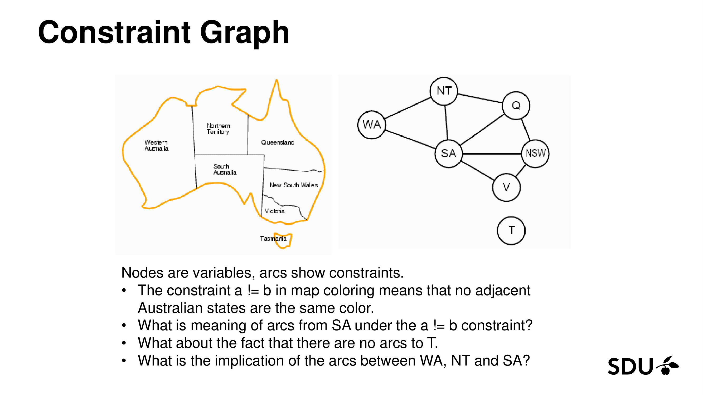

*Figure: the Australia map and its constraint graph side by side. Tasmania (T) has no neighbours and is therefore isolated in the graph. (Lecture 7, slide 10.)*

The same graph, redrawn as Mermaid for the chapter (the mermaid graph is a topological re-rendering of the slide figure above; T's isolation is visible in both — no information loss):

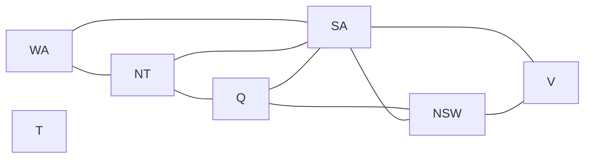
```mermaid
graph LR
  WA --- NT
  WA --- SA
  NT --- SA
  NT --- Q
  Q --- SA
  Q --- NSW
  SA --- NSW
  SA --- V
  NSW --- V
  T
```

What can we *read off* the constraint graph (per the slide's rhetorical questions)?

- Each edge from SA records a `≠` adjacency constraint. SA participates in *five* edges (WA, NT, Q, NSW, V) — SA is the most-constrained variable in the problem and the prime candidate for MRV / degree heuristics later.
- T has no edges. T is independent: any value works. The problem decomposes naturally into the mainland sub-problem and the trivial T sub-problem.
- The triangle WA–NT–SA means those three regions are pairwise different. Since the domain is `{red, green, blue}`, the triangle forces those three variables to be a *permutation* of the three colours. That tight 3-clique is a strong local structural fact that propagation can exploit.

Non-binary constraints don't fit a plain constraint graph: you instead draw a *constraint hypergraph* (also called a factor graph) with one node per variable and one node per constraint, with edges from each constraint to every variable in its scope. The cryptarithmetic slide (slide 13) shows exactly this form for the `TWO + TWO = FOUR` problem — see §5.3.

[Lecture 7, slide 10.] *Recall the "seating chart" analogy in §2.2.*

### 3.4 Example domains, in increasing order of constraint complexity

#### 3.4.1 Map-Coloring (Australia)

The canonical CSP example — used by every slide from 8 onwards as the running illustration.

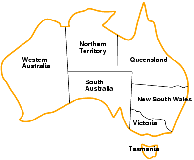

*Figure: the variables of the Australia map-coloring CSP. (Lecture 7, slide 8.)*

- Variables: $X = \{\text{WA}, \text{NT}, \text{Q}, \text{NSW}, \text{V}, \text{SA}, \text{T}\}$.
- Domain (same for every variable): $D_i = \{\text{red}, \text{green}, \text{blue}\}$.
- Constraint (one per adjacent pair): $X_i \neq X_j$ for every shared border. Explicitly enumerated, $(X_i, X_j)$ must be one of the six valid mismatched pairs: `(red,green), (red,blue), (green,red), (green,blue), (blue,red), (blue,green)`.

A **state** is any partial colouring (including the all-red dumpster fire on slide 9, "`WA = red, NT = red, Q = red, ...`" — that *is* a state, just an inconsistent one).

A **solution** is for instance `WA = red, NT = green, Q = red, NSW = green, V = red, SA = blue, T = green`. The map-coloring problem has more than one solution; backtracking returns the first one found.

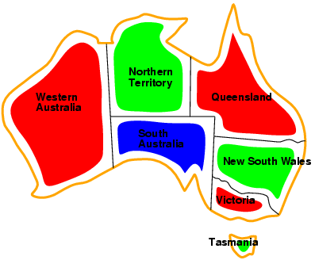

*Figure: a complete and consistent assignment — i.e. a solution. (Lecture 7, slide 9.)*

[Lecture 7, slides 8–9.]

#### 3.4.2 N-Queens (two formulations)

The 8-queens motivating example on slide 3 shows the brute-force enormity: $8^8 = 16{,}777{,}216$ board configurations to test if you don't exploit structure.

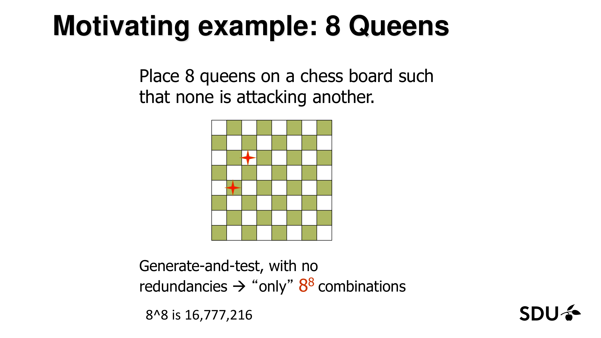

*Figure: 8-queens motivating board. The text on the slide notes that with no redundancy reduction one would enumerate $8^8$ combinations. (Lecture 7, slide 3.)*

Once two queens are placed, vast swathes of the board are forbidden by row/column/diagonal — the constraints **propagate**. The slide drives this point home:

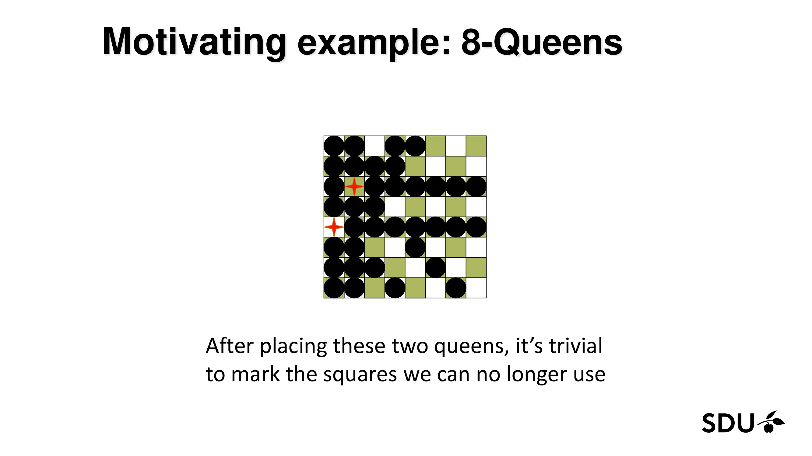

*Figure: after placing the two queens it is trivial to mark squares we can no longer use. The visual makes "constraint propagation = early failure detection" obvious. (Lecture 7, slide 4.)*

**Slide-encoded CSP formulation** (slides 11–12, using one Boolean variable per cell):

- Variables: $X_{ij}$ for every cell on the $n \times n$ board (so $n^2$ variables).
- Domains: $D_{ij} = \{0, 1\}$ — 0 if no queen, 1 if a queen.
- Constraints (slide 12, with implicit index conditions made explicit):
  - $\sum_{i,j} X_{ij} = N$ — exactly $N$ queens total.
  - For each cell pair on the same **row** $i$, with $j \neq k$: $(X_{ij}, X_{ik}) \in \{(0, 0), (0, 1), (1, 0)\}$ — at most one of them is 1.
  - Same on the same **column** $j$, with $i \neq k$: $(X_{ij}, X_{kj}) \in \{(0, 0), (0, 1), (1, 0)\}$.
  - Same on the **main diagonal**, for every integer $k \neq 0$ such that $(i + k, j + k)$ is on the board: $(X_{ij}, X_{i+k, j+k}) \in \{(0, 0), (0, 1), (1, 0)\}$.
  - Same on the **anti-diagonal**, for every integer $k \neq 0$ such that $(i + k, j - k)$ is on the board: $(X_{ij}, X_{i+k, j-k}) \in \{(0, 0), (0, 1), (1, 0)\}$.

> **Note (beyond the slide).** Slide 12 writes the pair constraints without explicit $j \neq k$ / $k \neq 0$ / on-board qualifiers. Without those qualifiers the constraint applied to a cell paired with itself ($k = 0$) would force $X_{ij} = 0$ everywhere — clearly not intended. The qualifiers above make the slide formulation well-defined.

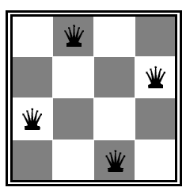

*Figure: two 4-queens example boards (one is a solution). (Lecture 7, slide 11.)*

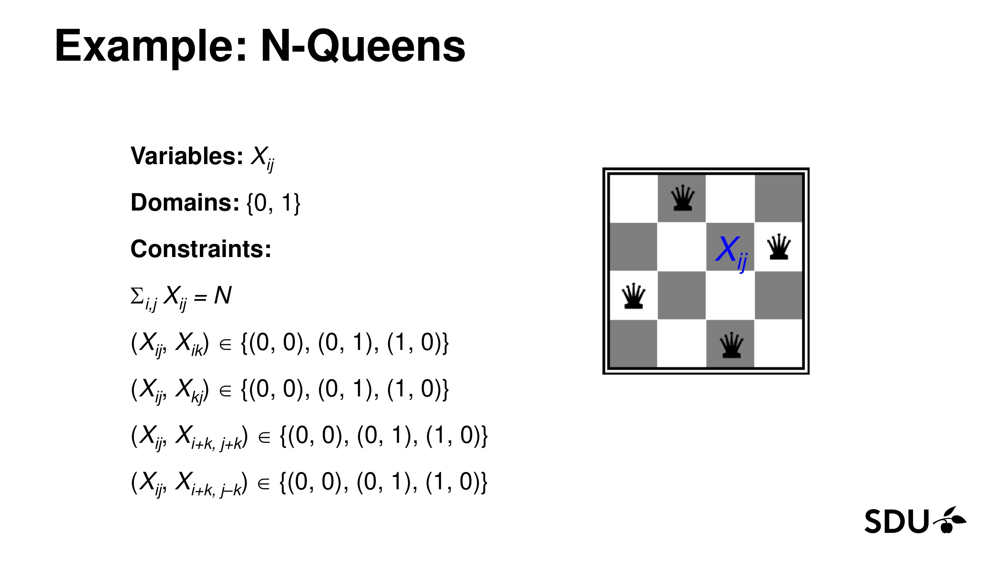

*Figure: the $X_{ij}$ variable is one Boolean per cell. (Lecture 7, slide 12.)*

**Alternative formulation (not on slide 12 but useful — also used by the GA for n-queens in [Lab 4](../../handout_lab_4/) / L05):** use $n$ integer variables $X_i$ where $X_i$ is the column of the queen on row $i$, with $D_i = \{1, \dots, n\}$. This formulation has only $n$ variables (not $n^2$) and bakes the "one queen per row" constraint into the variable set. The constraints reduce to "no two queens on the same column or diagonal", i.e. $X_i \neq X_j$ and $|X_i - X_j| \neq |i - j|$ for $i \neq j$. The 4-queens forward-checking trace on slides 35–44 (see §5.5) is best read as this compact formulation — the slide does not write its constraint set explicitly, but the variable count $X_1, \ldots, X_4$ with domains $\{1,2,3,4\}$ is incompatible with the 16-variable slide-12 encoding. *(Note: Lab 4 uses this formulation for a genetic algorithm, not for CSP backtracking; Lab 6 — see §7 — is the CSP lab.)*

[Lecture 7, slides 3–5, 11–12.]

#### 3.4.3 Cryptarithmetic

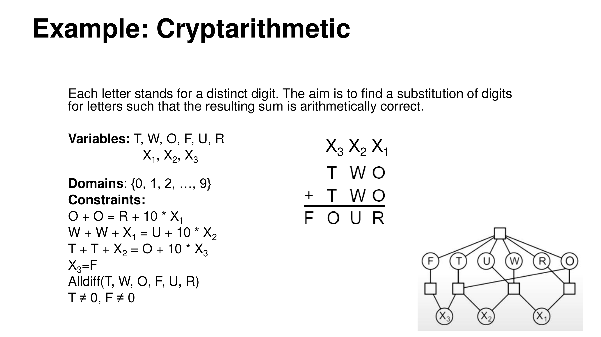

*Figure: cryptarithmetic puzzle `TWO + TWO = FOUR`. Each letter is a distinct digit; carries `X1, X2, X3` are auxiliary variables. (Lecture 7, slide 13.)*

- Variables: letter variables `T, W, O, F, U, R` plus carry variables `X1, X2, X3`.
- Domains (slide 13 verbatim): $\{0, 1, 2, \dots, 9\}$ for *all* variables — slide 13 gives the same domain for letters and carries.
- Constraints (slide 13):
  - $O + O = R + 10 \cdot X_1$ (units column).
  - $W + W + X_1 = U + 10 \cdot X_2$ (tens column).
  - $T + T + X_2 = O + 10 \cdot X_3$ (hundreds column).
  - $X_3 = F$ (final carry equals the leading digit of the sum).
  - `Alldiff(T, W, O, F, U, R)` — the six letters represent six distinct digits.
  - $T \neq 0$, $F \neq 0$ — no leading zeros.

> **Note (beyond the slide).** A common textbook tightening narrows the carry domains to $\{0, 1\}$ because the maximum value of any decimal column sum here is at most $9 + 9 + 1 = 19$, so the carry is always 0 or 1. Slide 13 does *not* state this; if asked on the exam, give the slide's $\{0, \dots, 9\}$ first and mention the $\{0,1\}$ narrowing as an inference.

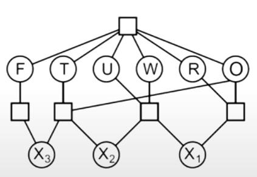

*Figure: constraint hypergraph view. The constraint hypergraph encodes one **circle node per variable** (`T`, `W`, `O`, `F`, `U`, `R`, `X1`, `X2`, `X3`) and one **square node per constraint** (the units / tens / hundreds column-sum equations, the $X_3 = F$ equality, and the `Alldiff` global constraint). Each constraint-square is linked to every variable-circle in its scope. (Lecture 7, slide 13.)*

Cryptarithmetic showcases:
- **Global constraints** — `Alldiff(T, W, O, F, U, R)` has scope 6 (all six letters).
- **Mixed-arity constraints** — the units-column constraint $O + O = R + 10 \cdot X_1$ has scope **3** (the variables $\{O, R, X_1\}$; the constants $1$, $2$ and $10$ are coefficients, not variables). The tens and hundreds columns have scope **4** (`{W, X1, U, X2}` and `{T, X2, O, X3}` respectively).
- **Unary constraints** — `T ≠ 0`, `F ≠ 0`.

This is why the constraint *graph* is replaced by a *hypergraph* (a.k.a. factor graph): an edge can connect more than two variables.

[Lecture 7, slide 13.]

#### 3.4.4 Sudoku

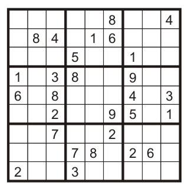

*Figure: Sudoku. (Lecture 7, slide 14.)*

- Variables: 81 cell variables $X_{ij}$ (row $i$, column $j$).
- Domain (for each empty cell): $\{1, 2, \dots, 9\}$. (Pre-filled cells have a unary constraint pinning them.)
- Constraint: `Alldiff(X_{ij}` in the same *unit*`)` — where a *unit* is one of the 9 rows, 9 columns, or 9 boxes. So Sudoku has 27 `Alldiff` global constraints.

Note the slide does not enumerate every binary "X ≠ Y" pair; it expresses the constraint as 27 global `Alldiff`s. This is the standard "constraints have arity > 2 in general" example.

[Lecture 7, slide 14.] *Recall §2.1: the pencil-marks-and-erase loop you intuited there — pick a cell, try a value, erase on conflict, backtrack — is the §4.1 backtracking algorithm. Sudoku is the textbook CSP precisely because pure backtracking gives a surprisingly usable solver, even before any of the §4.4–§4.8 improvements.*

#### 3.4.5 Real-world CSPs

Slide 15 lists:
- **Assignment problems** — e.g. who teaches which class.
- **Timetable problems** — e.g. which class is offered when and where.
- **Transportation scheduling**.
- **Factory (job-shop) scheduling**.

…and points to `http://www.csplib.org/` as a catalogue of standard CSP benchmarks. The same backtracking + propagation toolkit handles all of these.

[Lecture 7, slide 15.]

### 3.5 Why naive search is bad here — the size of the search tree

Suppose we tried to solve a CSP by plain BFS / DFS over the search problem of §3.2. Slide 17 asks two questions and answers them:

- **Depth of any solution:** $n$ (one assignment per variable). "This is good." Search trees are not deep.
- **Number of paths in the search tree:** $n! \cdot m^n$ where $m$ is the size of each domain. "This is bad."

Where does the $n! \cdot m^n$ figure come from? Without forcing a variable ordering, at depth 1 we may pick any of $n$ variables and any of $m$ values, giving branching factor $n \cdot m$. At depth 2 we may pick any of the $n-1$ remaining variables and any of $m$ values, giving branching factor $(n-1) \cdot m$. Continuing: the branching factor at depth $k$ is $(n - k + 1) \cdot m$, so the leaf count is the **product** $\prod_{k=1}^{n} (n - k + 1) \cdot m = n! \cdot m^n$.

This is wasteful, because **variable assignments are commutative**: the result of "WA = red, then NT = green" is identical to "NT = green, then WA = red". Slide 18 makes two related statements:

> In CSPs, variable assignments are commutative
> • For example, [WA = red then NT = green] is the same as [NT = green then WA = red]

and:

> We only need to consider assignments to a single variable at each level (i.e., we fix the order of assignments)
> • Then there are only $m^n$ leaves ($n$ = number of variables and $m$ = number of values)

Fixing a variable ordering reduces $n! \cdot m^n$ to $m^n$, an $n!$-fold pruning before we have started doing anything clever. Slide 18 closes with the canonical name: "Depth-first search for CSPs with single-variable assignments is called **backtracking search**."

[Lecture 7, slides 17–18.] *This is the single most important reason why CSPs deserve their own treatment instead of being lumped under L03.*

---

## 4. Algorithms / Methods

This section presents the standard CSP toolkit, in the order the slides introduce it. Every later technique builds on the basic backtracking algorithm (§4.1).

### 4.1 Backtracking search

The basic recursive algorithm (slide 24):

```
function CSP-BACKTRACKING(assignment A):
    if A is complete: return A
    X  ← select an unassigned variable
    D  ← select an ordering for the domain of X
    for each value v in D:
        if v is consistent with A:                 # local constraint check
            add (X = v) to A
            result ← CSP-BACKTRACKING(A)
            if result ≠ failure: return result
            remove (X = v) from A                  # undo / backtrack
    return failure

Start with CSP-BACKTRACKING({})                    # empty assignment
```

*Recall §2.7: backtracking is shirt → trousers → shoes with backtrack-on-stuck. The pseudocode above is exactly that, recursively. Recall §2.1: it is also the Sudoku-pencil-marks loop ("pick a square, try a value, erase, try the next") written formally.*

It is depth-first search, single-variable-assignments per level, with constraint checking baked in.

**Properties:**

- *Completeness*: yes, on a finite CSP — the algorithm enumerates the (finite) $m^n$ space and either finds a solution or returns failure.
- *Optimality*: not meaningful (CSPs have no notion of solution cost; any complete consistent assignment is acceptable). Path cost is constant per step (slide 7).
- *Time*: worst-case $O(m^n)$, the size of the leaf set after commutativity pruning. CSPs are NP-complete in general (slide 54), so we should not expect a polynomial-time algorithm.
- *Space*: $O(n)$ — only the current assignment plus the recursion stack (a depth-$n$ stack). This is the standard DFS space advantage from L03.

The "select an unassigned variable" and "select an ordering for the domain of X" lines are the *hooks* into which the §4.3–§4.6 heuristics plug. The vanilla algorithm picks both arbitrarily.

[Lecture 7, slide 24.]

### 4.2 Walking through the example — backtracking on map coloring

Slides 19–23 trace plain backtracking on the Australia map. Each panel is a snapshot of the partial-assignment tree.

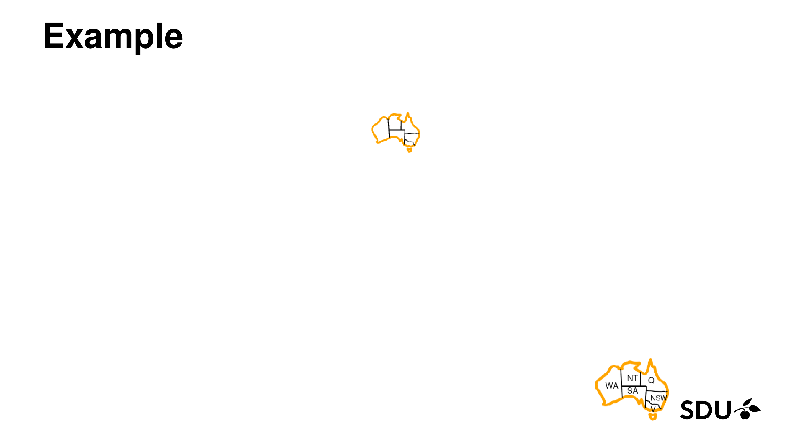 *(slide 19)*

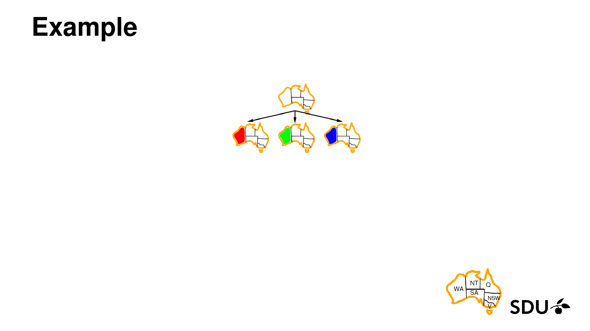 *(slide 20)*

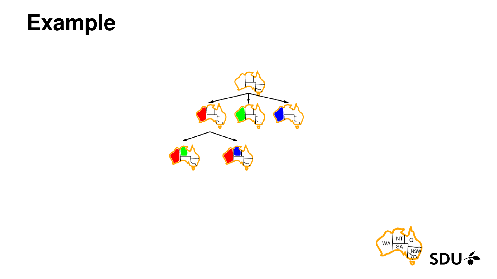 *(slide 21)*

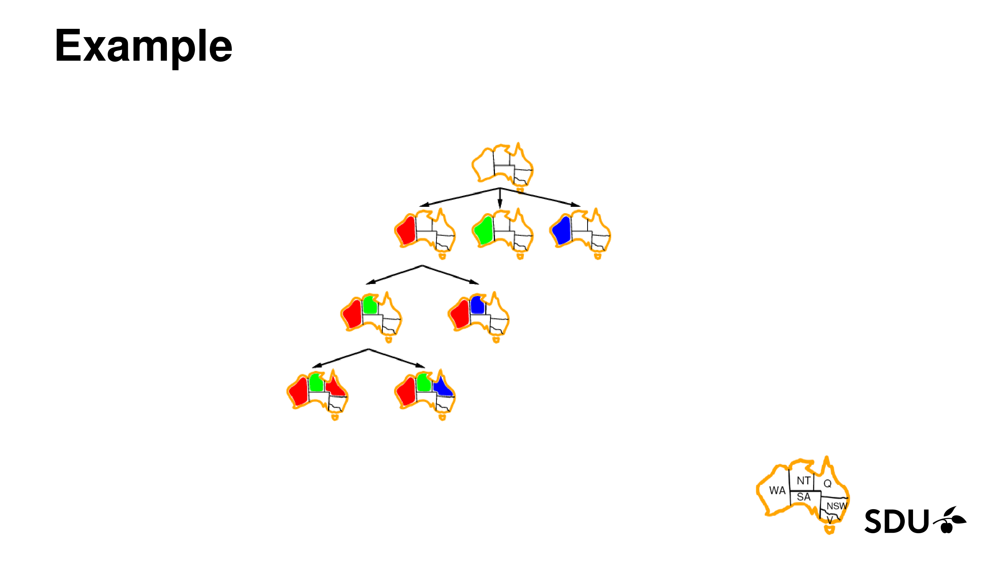 *(slide 22)*

The critical "backtrack" step is shown on slide 23:

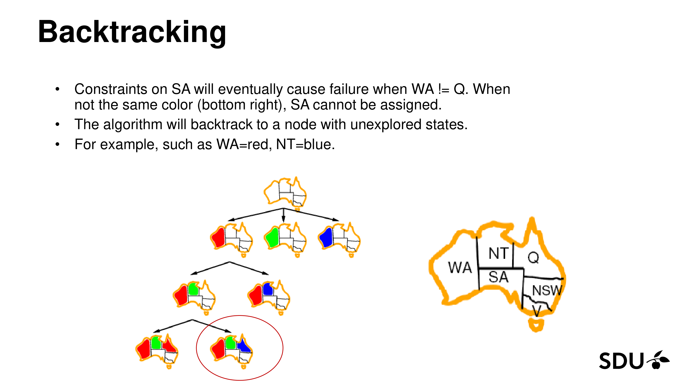 *(slide 23)*

The point the slide emphasises (verbatim):

> Constraints on SA will eventually cause failure when WA ≠ Q. When not the same color (bottom right), SA cannot be assigned. The algorithm will backtrack to a node with unexplored states. For example, such as WA=red, NT=blue.

[Lecture 7, slides 19–23.] *Recall §2.7: the wedding-outfit analogy. Plain backtracking only discovers the dead-end when it tries SA — it does not anticipate it.*

### 4.3 Improving backtracking — three questions

Slide 25 frames the three improvements we will layer on top:

1. **Which variable should be assigned next?** → MRV (§4.4), degree heuristic (§4.4).
2. **In what order should its values be tried?** → LCV (§4.5).
3. **Can we detect inevitable failure early?** → Forward checking (§4.6), arc consistency (§4.7).

[Lecture 7, slide 25.]

### 4.4 Variable ordering — Minimum Remaining Values (MRV) and degree heuristic

**Minimum Remaining Values (MRV)**, also called *most constrained variable*, picks next the unassigned variable with the **fewest legal values remaining** in its current domain.

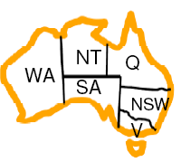

*Figure: MRV slide illustration. (Lecture 7, slide 26.)*

Intuition (§2.3): pick the most-cornered square. If you're going to fail, fail fast — and the variable with the smallest remaining domain is the one most likely to fail. If WA is `red` and SA has only `{green, blue}` left but NSW still has `{red, green, blue}`, you assign SA next: you have one *binary* choice with high failure probability instead of one *ternary* choice on a less-constrained variable.

The slide phrases it: "Choose the variable with the fewest legal values; a.k.a. minimum remaining values (MRV) heuristic". [Lecture 7, slide 26.]

**Degree heuristic** (slide 27) is the tie-breaker when several variables are tied for MRV — pick the variable that participates in the largest number of constraints on *yet-unassigned* variables. Slide 27 phrases it as "Most constraining variable: Choose the variable that imposes the most constraints on the remaining variables" and explicitly frames it as a "Tie-breaker among most constrained variables".

The degree heuristic is also called the *most constraining variable* heuristic. The slide presents it primarily as a **tie-breaker** for MRV.

**Why both?** MRV says "fail fast"; degree says "if you have to fail, also reduce future options for everyone else first". On the Australia problem at the very beginning (before any assignment), every variable has domain size 3 — MRV is silent. Degree then picks SA (5 constraints) as the first variable. That seeds an MRV-driven cascade.

[Lecture 7, slides 26–27.] *Recall §2.9: degree heuristic = seating the maiden aunt first.*

### 4.5 Value ordering — Least Constraining Value (LCV)

Once a variable is chosen, in what order should we try its values? **LCV**: the value that **rules out the fewest values** in the *remaining* (unassigned) variables.

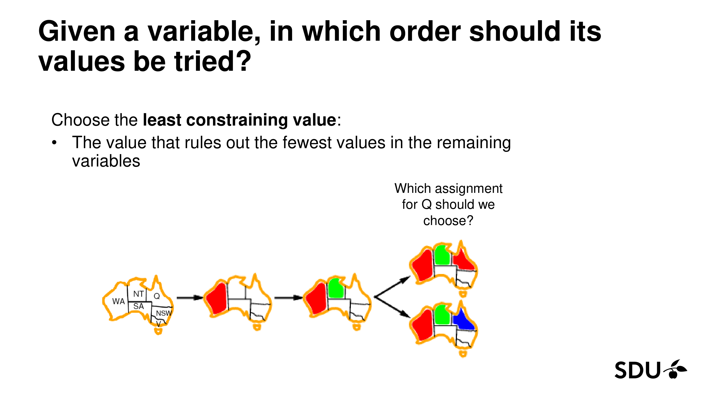

*Figure: which value should we assign to Q? LCV picks the colour that leaves the most options open for the neighbours of Q (in particular SA). (Lecture 7, slide 29.)*

Intuition (§2.4): leave doors open. If you're going to find a solution, you're more likely to find one quickly through the branch with the most remaining options.

The slide is concise: "Choose the **least constraining value**: the value that rules out the fewest values in the remaining variables." [Lecture 7, slides 28–29.]

**Asymmetry note for the exam:**
- MRV (variable ordering) wants to **fail fast** — choose the variable most likely to expose dead-ends quickly.
- LCV (value ordering) wants to **succeed fast** — choose the value most likely to leave a path to a complete assignment.

They sound contradictory but they're not: MRV picks *which* variable's dead-end branches we encounter first; LCV picks the value most likely to *avoid* a dead-end. Together they make backtracking dramatically faster.

### 4.6 Forward checking

**Forward checking** is constraint propagation in its simplest form (slides 30–34):

> Keep track of remaining legal values for unassigned variables. Terminate search when any variable has no legal values.

After each assignment `X = v`, for every unassigned neighbour `Y` of `X` in the constraint graph, remove from `Y`'s domain every value that is inconsistent with `X = v`. If any domain becomes empty, backtrack immediately (without descending further).

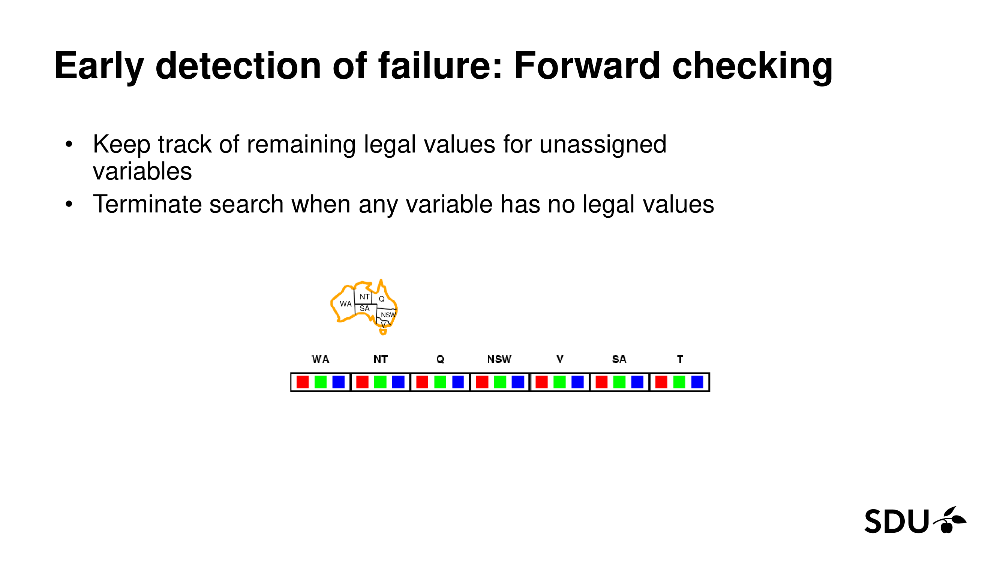 *(slide 31)*

After assigning `WA = red`, the neighbours of WA (NT and SA) lose red:

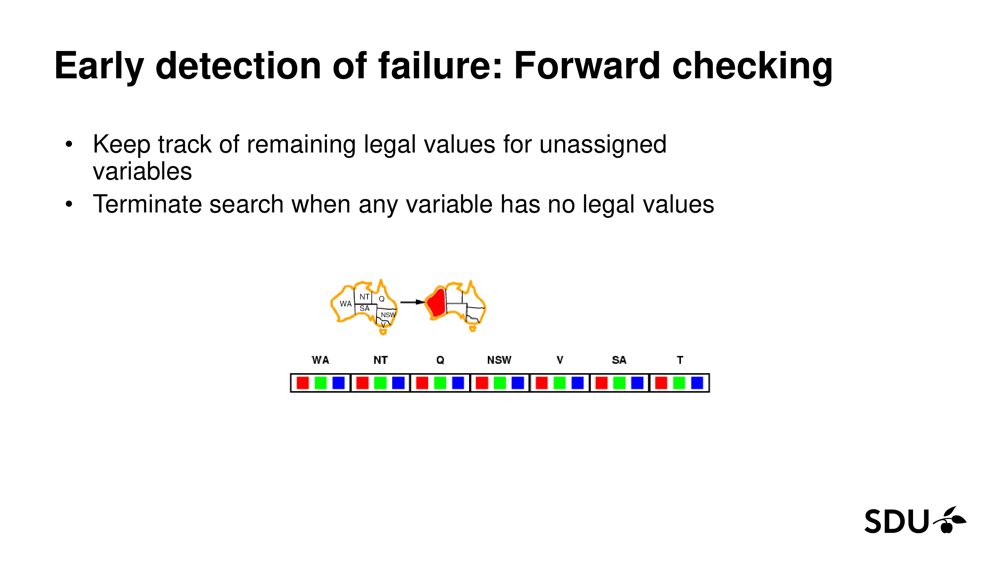 *(slide 32)*

After also assigning `Q = green`, the neighbours of Q (NT, SA, NSW) lose green; NT now has only `{blue}`, SA has only `{blue}`, NSW has `{red, blue}`:

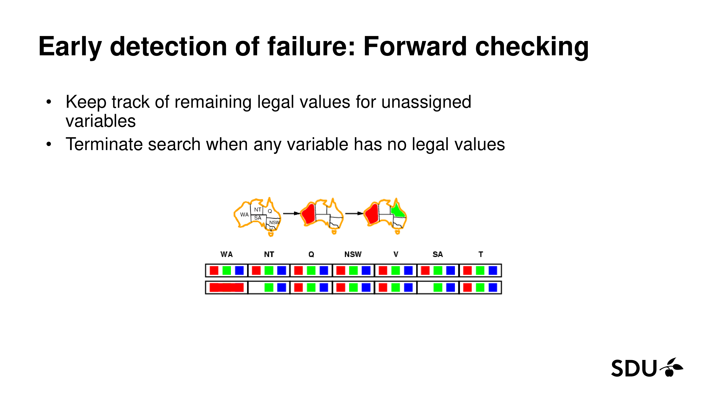 *(slide 33)*

After also assigning `V = blue`, V's neighbours (NSW, SA) lose blue. SA now has empty domain — **failure detected, backtrack**:

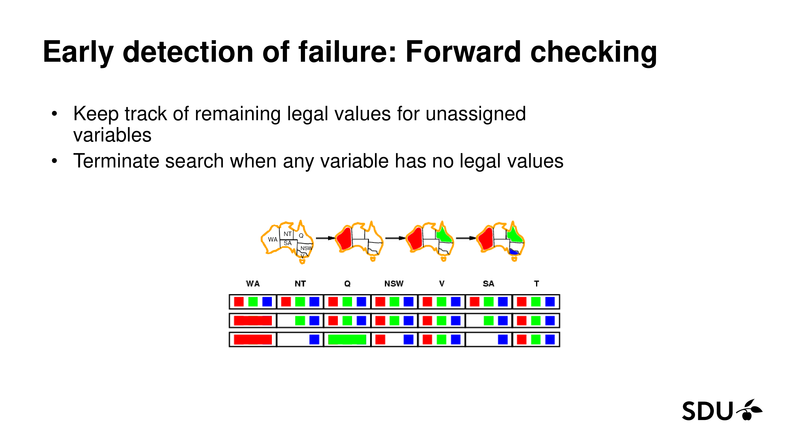 *(slide 34)*

Compared with plain backtracking, forward checking detects the dead-end **before** we descend into the SA sub-tree. Without FC, we would commit to `V = blue` and only then discover (one level deeper) that SA has no legal value.

[Lecture 7, slides 30–34.] *Recall §2.5: place a queen, cross out attacked squares on every future row's candidate list; if any future row has no candidates left, abandon this branch. Recall §2.10: forward checking is the first hop of the Newton's-cradle cascade — only the immediate neighbours of the just-assigned variable are touched.*

### 4.7 Forward checking on 4-queens (slides 35–44)

A complete walked-through trace using the compact $n$-variable n-queens formulation (one variable $X_i$ per row, $X_i \in \{1, 2, 3, 4\}$ is the queen's column, see §3.4.2). Every pair of rows interacts via both the column-equality $X_i \neq X_j$ and the diagonal constraint $|X_i - X_j| \neq |i - j|$, so the constraint graph is the **complete graph $K_4$** on $\{X_1, X_2, X_3, X_4\}$; slide 35 draws all six edges. Forward checking after assigning $X_1$ must therefore prune $X_2$, $X_3$, *and* $X_4$ as you will see immediately below.

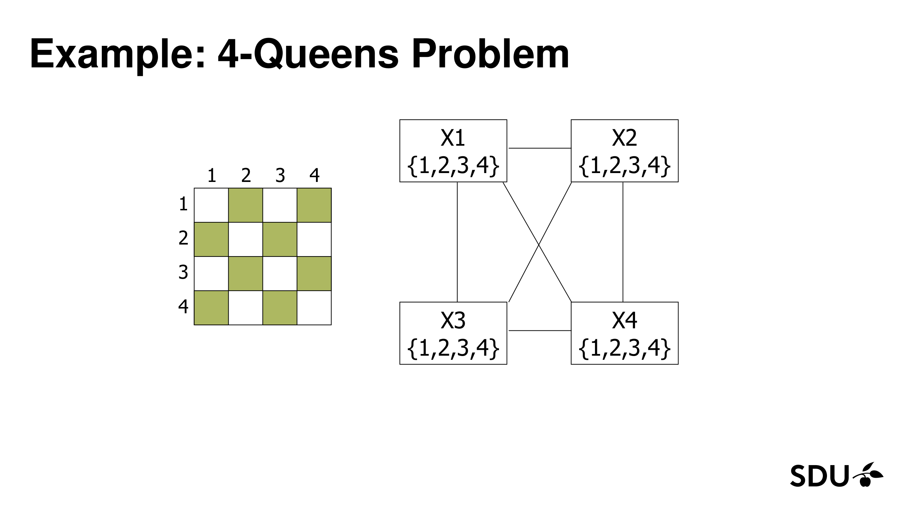 *(slide 35)*

 *(slide 36)*

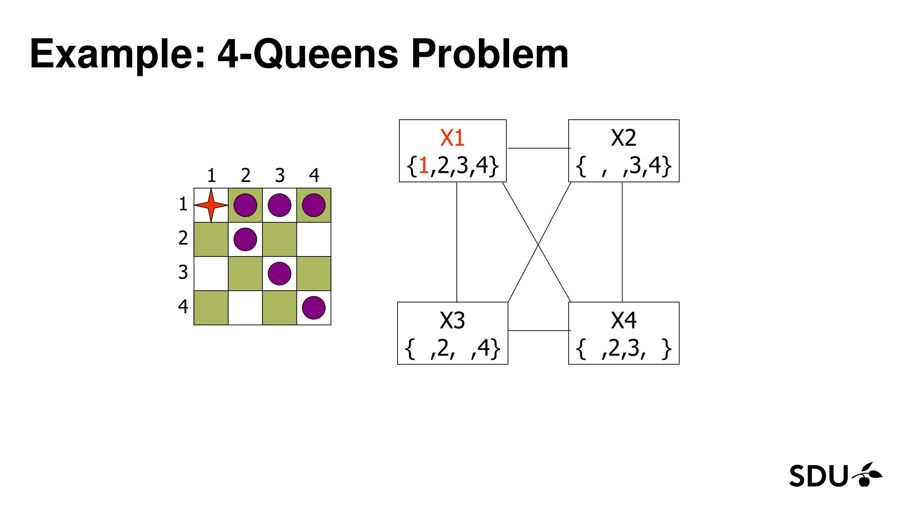 *(slide 37)*

**Reasoning for the pruning** (queen at row 1, column 1; for any future queen at $(r, c)$, removed iff $c = 1$ or $|r - 1| = |c - 1|$):
- $X_2$ (row 2): loses column 1 (same column), column 2 (diagonal: $|2-1| = |2-1|$). Keeps `{3, 4}`.
- $X_3$ (row 3): loses column 1 (same column), column 3 (diagonal: $|3-1| = |3-1|$). Keeps `{2, 4}`.
- $X_4$ (row 4): loses column 1 (same column), column 4 (diagonal: $|4-1| = |4-1|$). Keeps `{2, 3}`.

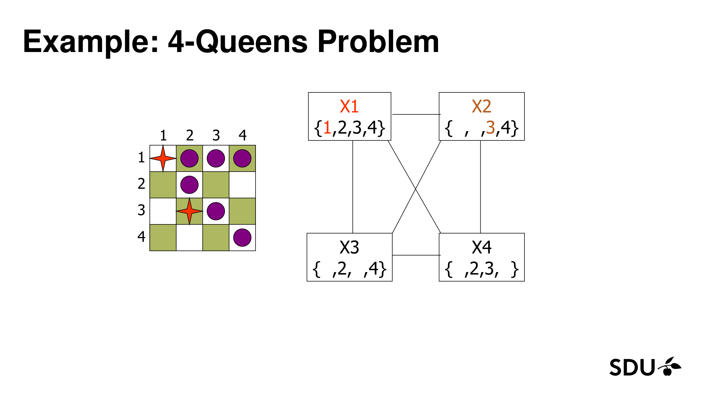 *(slide 38)*

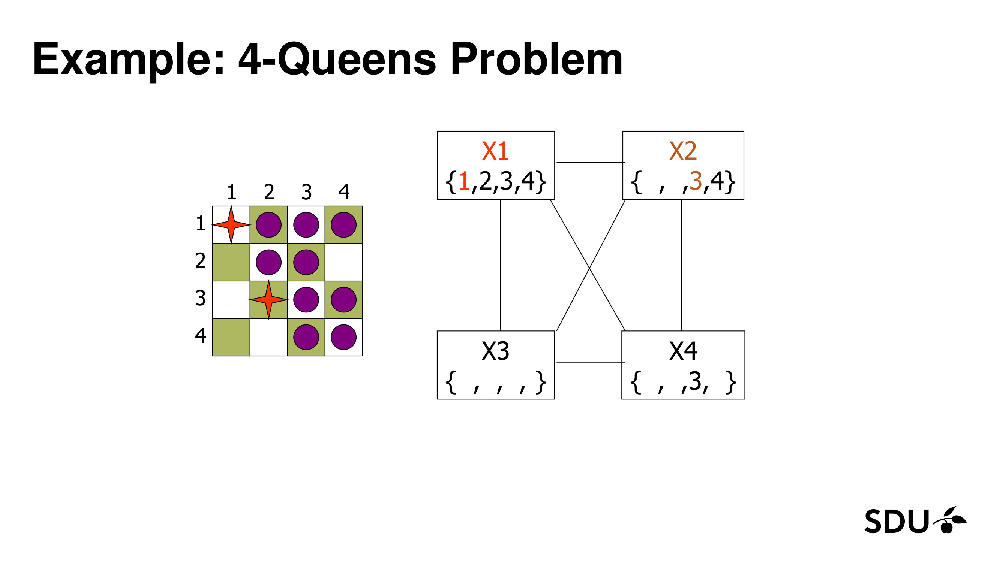 *(slide 39)*

**Why $X_3$'s domain `{2, 4}` becomes `{}` after $X_2 = 3$**:
- $X_3 = 2$ is removed: queen would be at $(3, 2)$; check against $X_2 = (2, 3)$. Column diff $|2 - 3| = 1$; row diff $|3 - 2| = 1$. Equal ⇒ **diagonal conflict** ⇒ remove.
- $X_3 = 4$ is removed: queen would be at $(3, 4)$; check against $X_2 = (2, 3)$. Column diff $|4 - 3| = 1$; row diff $|3 - 2| = 1$. Equal ⇒ **diagonal conflict** ⇒ remove.
- Both candidates pruned ⇒ $D_{X_3} = \emptyset$ ⇒ forward checking signals failure ⇒ backtrack and try the other value of $X_2$.

> **Note on slide 39 (beyond the slide).** Slide 39 depicts $D_{X_4} = \{3\}$ at this point, but proper FC after $X_2 = 3$ should give $D_{X_4} = \{2\}$: with $X_2$'s queen at $(2, 3)$, $X_4 = 3$ shares its column with $X_2$ (remove), while $X_4 = 2$ is non-conflicting (column diff $|2-3| = 1$, row diff $|4-2| = 2$, not equal — no diagonal conflict; column not shared — keep). The slide's depiction may be an artefact of the animation (once $X_3$'s wipeout signalled failure, FC was halted before fully updating $X_4$). Either way, the failure is correctly detected via $X_3$'s empty domain — the discrepancy is only in the displayed $X_4$ state, not in the algorithm's behaviour.

Back to stage 2, try the other value for $X_2$:


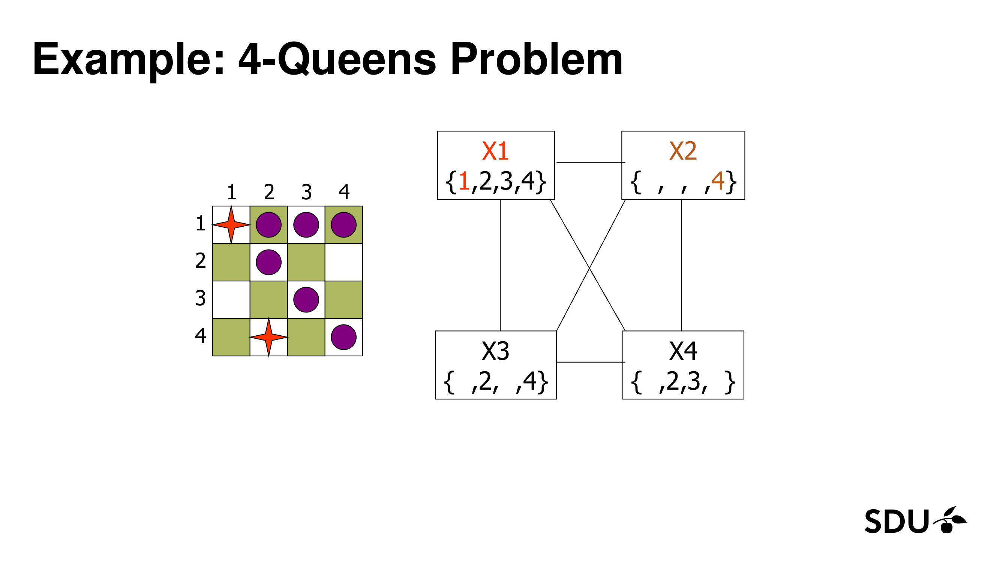

After $X_2 = 4$ (queen at row 2, column 4), forward checking refines the domains as follows:
- $X_3$ started from `{2, 4}` after $X_1 = 1$. Now check against $X_2 = (2, 4)$:
  - $X_3 = 2$: column diff $|2 - 4| = 2$; row diff $|3 - 2| = 1$. Not equal ⇒ no diagonal conflict. Column not shared ⇒ keep.
  - $X_3 = 4$: same column as $X_2$ ⇒ remove.
  - Result: $D_{X_3} = \{2\}$.
- $X_4$ started from `{2, 3}` after $X_1 = 1$. Now check against $X_2 = (2, 4)$:
  - $X_4 = 2$: column diff $|2 - 4| = 2$; row diff $|4 - 2| = 2$. Equal ⇒ diagonal conflict ⇒ remove.
  - $X_4 = 3$: column diff $|3 - 4| = 1$; row diff $|4 - 2| = 2$. Not equal ⇒ keep.
  - Result: $D_{X_4} = \{3\}$.

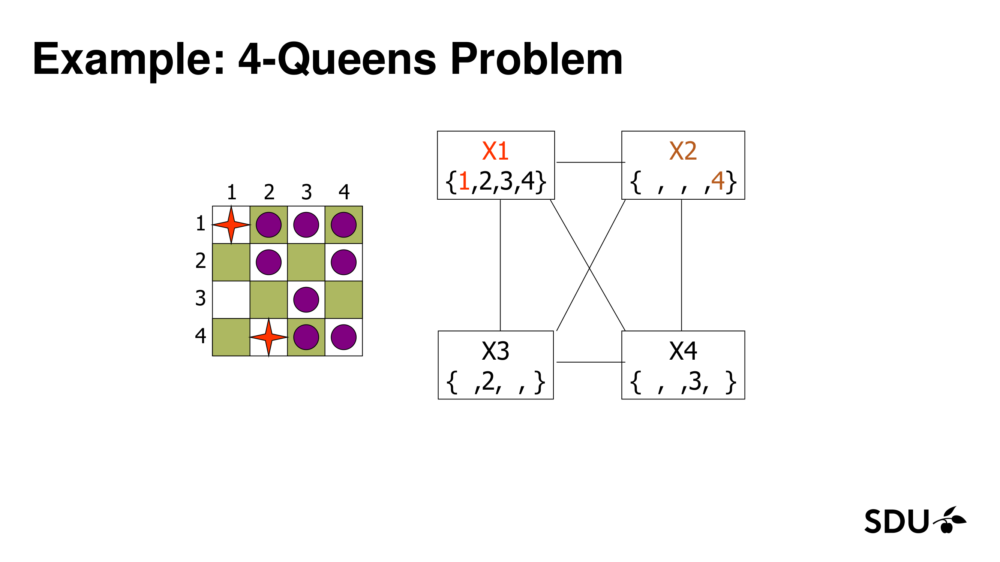

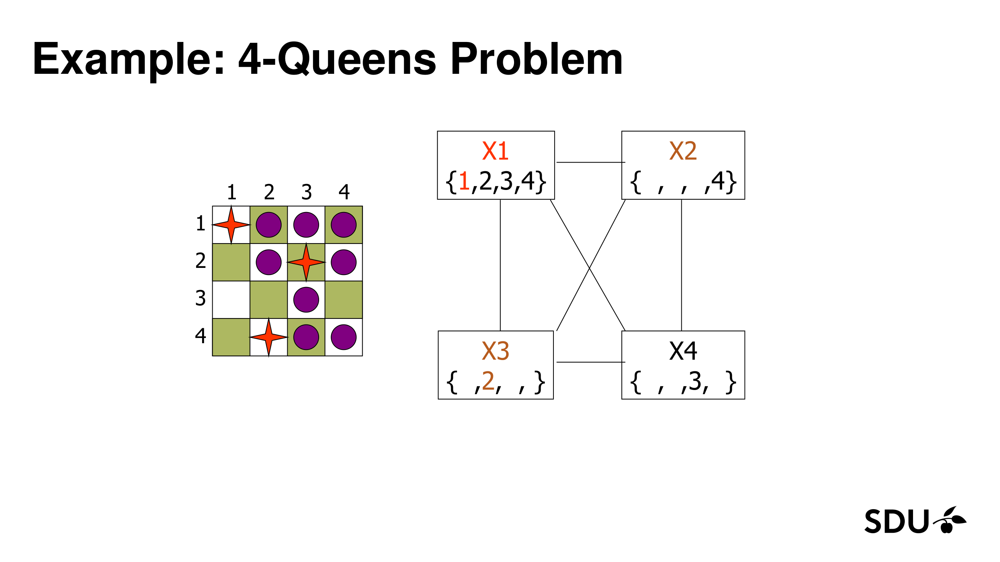

**Why $X_4 = 3$ is also lost after $X_3 = 2$** (and `{}` remains): the queen is at $(3, 2)$; for $X_4 = 3$, queen at $(4, 3)$: column diff $|3 - 2| = 1$; row diff $|4 - 3| = 1$. Equal ⇒ **diagonal conflict**. So $D_{X_4} = \emptyset$ ⇒ failure ⇒ backtrack.

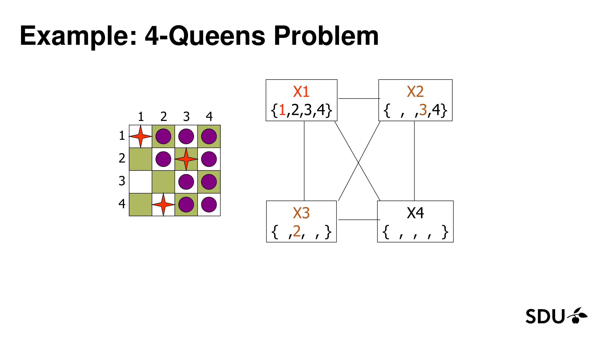

The slide trace stops here. Continuing the algorithm with $X_1 = 2$ leads to a solution: forward checking after $X_1 = 2$ leaves $X_2 \in \{4\}$ (the only column non-conflicting with row 1 / column 2), $X_3 \in \{1, 3\}$, and $X_4 \in \{1, 3, 4\}$. After $X_2 = 4$ is propagated, $X_3 \in \{1\}$ and $X_4 \in \{1, 3\}$. Then $X_3 = 1$ is assigned; propagating that, $X_4 \in \{3\}$; assign $X_4 = 3$ — yielding $(X_1, X_2, X_3, X_4) = (2, 4, 1, 3)$. The two 4-queens solutions are $(2,4,1,3)$ and $(3,1,4,2)$. This trace is a perfect candidate for an exam reproduction question — see §6.4.

[Lecture 7, slides 35–44.]

### 4.8 Arc consistency — the limit of forward checking, and how to beat it

Forward checking has a fundamental blind spot. Consider this state during map-coloring:

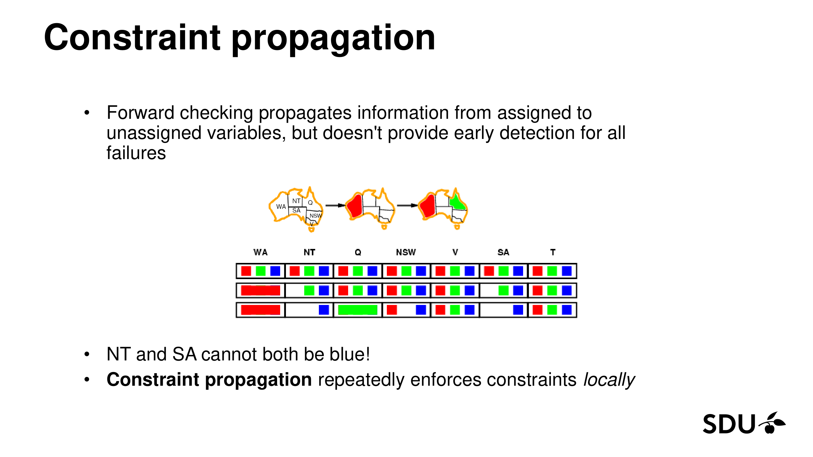 *(slide 45)*

**Both NT and SA have domain `{blue}`**, but NT and SA are adjacent in the constraint graph — they cannot both be blue. Forward checking has not noticed this, because FC only looks at neighbours of the *just-assigned* variable, not at constraints between two *currently unassigned* variables.

This is what **constraint propagation** in its proper sense fixes: enforcing constraints between unassigned variables, repeatedly, until no more deductions can be made.

> Constraint propagation repeatedly enforces constraints *locally*. (Slide 45.)

The simplest form is **arc consistency** (slide 46): make every pair of variables consistent with their connecting constraint.

**Definition.** A directed arc $X \to Y$ is *arc-consistent* iff **for every value $x$ in $D_X$, there is some value $y$ in $D_Y$ such that $(x, y)$ satisfies the constraint between $X$ and $Y$**.

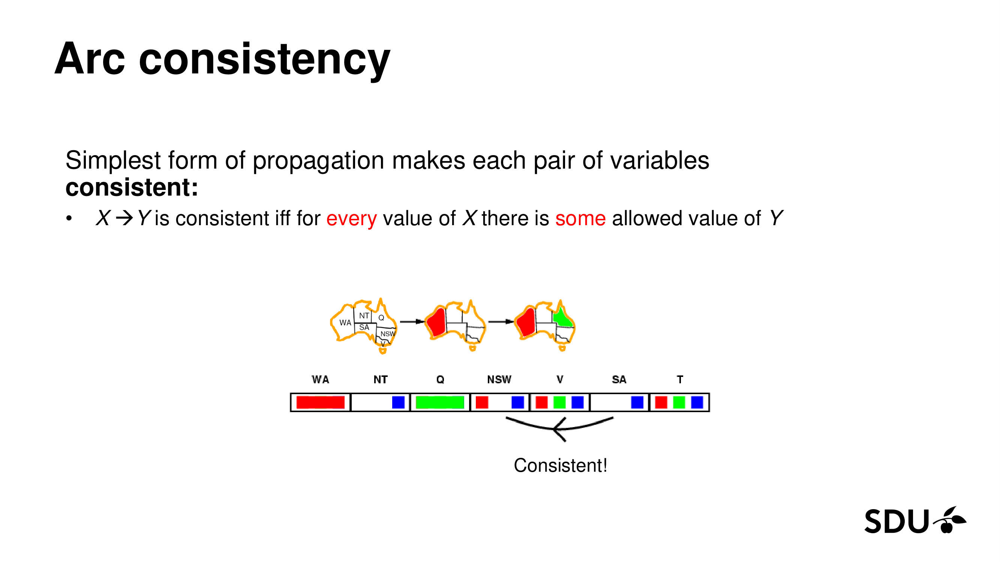 *(slide 46)*

**Enforcement procedure** for one arc (slide 48 verbatim, with the cleanup detail on slides 49–52):

- When checking $X \to Y$, throw out any values of $X$ for which there isn't an allowed value of $Y$.
- **If $X$ loses a value, all pairs $Z \to X$ need to be rechecked** — because removing a value from $X$'s domain may make some value of $Z$ unsupported.

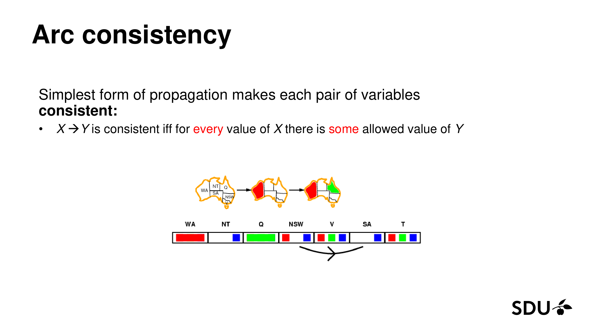 *(slide 47)*

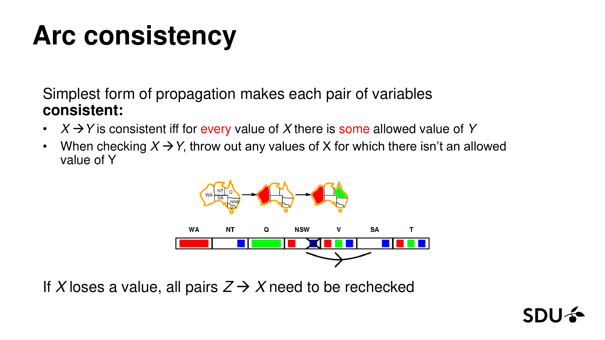 *(slide 48)*

 *(slide 49)*

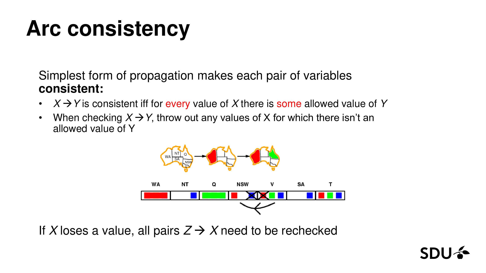 *(slide 50)*

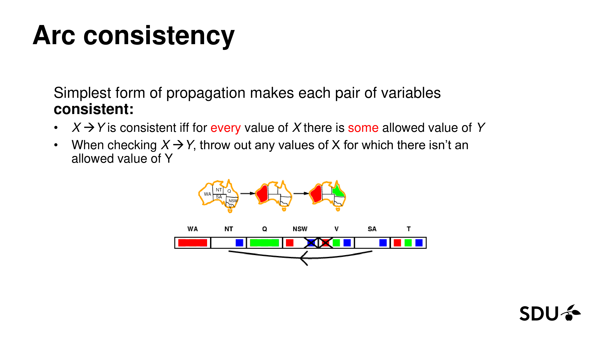 *(slide 51)*

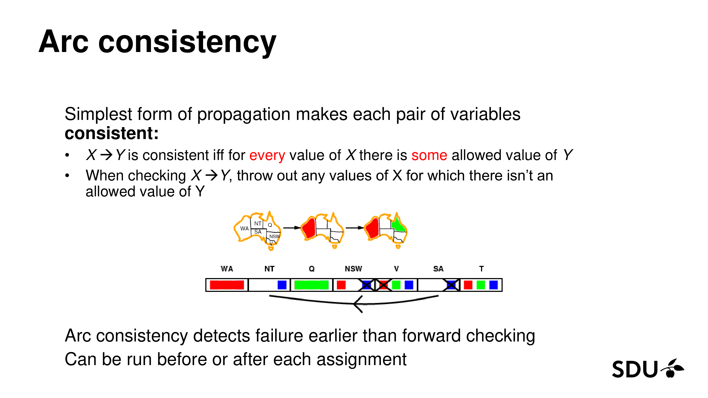 *(slide 52)*

The cascade is precisely the classical **arc-consistency algorithm** — usually called **AC-3** in textbooks, but **the slide does not use the name "AC-3"**. We adopt **arc-consistency algorithm** as the canonical term throughout this chapter, noting "AC-3" once here as the textbook name; we do not claim "AC-3" is the slides' terminology. See the [glossary entry](../_shared/glossary.md) (open canonicalisation question §6) for the rationale. The slides' procedure is functionally identical to AC-3: maintain a worklist of arcs, pop an arc, prune the tail's domain, and on any change re-add the affected reverse arcs.

**Pseudocode** (a faithful textbook rendering of the slide's verbal procedure — the slide itself only gives the prose definition above, not pseudocode; on an exam, give either the prose or this pseudocode, not both as if cited from slides):

```
function ARC-CONSISTENCY(CSP):
    queue ← all directed arcs (X_i → X_j) of the CSP
    while queue is non-empty:
        (X → Y) ← pop from queue
        if REVISE(X, Y) returned True:
            if D_X is empty: return failure
            for each Z neighbour of X, Z ≠ Y:
                add (Z → X) to queue
    return success

function REVISE(X, Y):
    removed ← False
    for each value x in a snapshot of D_X:        # iterate snapshot to avoid invalidation
        if no value y in D_Y satisfies the constraint between X and Y:
            remove x from D_X
            removed ← True
    return removed
```

**Properties:**

- *Complete*? Arc consistency does **not** guarantee a solution exists, even if every arc becomes consistent. It only prunes values that have no support; it does not enumerate complete assignments. After enforcing arc consistency the algorithm still typically calls backtracking on the reduced CSP.
- *Failure detection*: if any domain wipes out during enforcement, the CSP is unsolvable from the current partial assignment — return failure immediately, no need to descend.
- *Compared to forward checking*: arc consistency detects failure **earlier** because it propagates between *all* pairs of unassigned variables, not just the neighbours of the just-assigned variable. The slide states this verbatim: "Arc consistency detects failure earlier than forward checking. Can be run before or after each assignment." [Lecture 7, slide 52.]
- *Cost (beyond the slide)*: the textbook AC-3 worst case is $O(c \cdot d^3)$ where $c$ is the number of binary constraints and $d$ is the maximum domain size. **The slides do not state this bound**; cite it only as the textbook (Russell & Norvig) figure, not as a slide claim. Cheap enough to run before search (preprocessing) and after every variable assignment (during search).

[Lecture 7, slides 45–52.] *Recall §2.6: arc consistency = customs queue with reciprocal stamps. Recall §2.10: arc consistency is the *full* Newton's-cradle cascade, where forward checking is just the first impulse.*

### 4.9 Tiny worked example — arc consistency from scratch

A clean self-contained example (slide 53) the exam might re-purpose:

- Variables: $x, y$.
- Domains: $D_x = \{1, 2, 3\}$, $D_y = \{1, 2, 3\}$.
- Constraint: $x < y$ (i.e. $C_{xy}$ allows the pairs `(1,2), (1,3), (2,3)`).

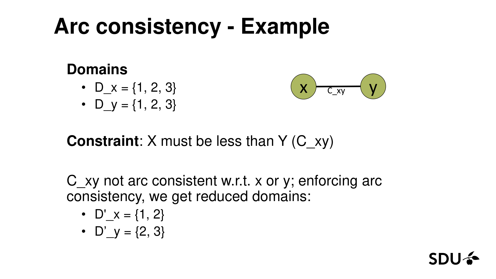

*Figure: arc consistency on `x < y` over `{1,2,3}`. (Lecture 7, slide 53.)*

**Enforce $x \to y$.** For each value of $x$, is there some $y$ with $x < y$?
- $x = 1$: $y = 2$ or $3$ works ✓
- $x = 2$: $y = 3$ works ✓
- $x = 3$: no $y \in \{1, 2, 3\}$ has $3 < y$ ✗ → remove 3.

$D_x' = \{1, 2\}$.

**Enforce $y \to x$.** For each value of $y$, is there some $x$ with $x < y$?
- $y = 1$: no $x \in \{1, 2\}$ has $x < 1$ ✗ → remove 1.
- $y = 2$: $x = 1$ works ✓
- $y = 3$: $x = 1$ or $2$ works ✓

$D_y' = \{2, 3\}$.

Now re-check $x \to y$ (because $y$ lost a value): every $x \in \{1, 2\}$ still has some $y \in \{2, 3\}$ that is larger ✓ — no further pruning. The CSP is arc-consistent with the reduced domains $D_x' = \{1, 2\}$, $D_y' = \{2, 3\}$.

The slide's final note: this is *consistency, not solving* — we have not chosen specific values yet, only pruned impossible ones. Backtracking still has to pick (e.g. $x = 1$, $y = 2$ is a valid solution).

[Lecture 7, slide 53.]

### 4.10 Summary of the algorithmic stack

| Layer | What it adds | Where the slides cover it |
|---|---|---|
| **Plain backtracking** | DFS with single-variable assignments; consistency check at each step. | Slide 24. |
| **MRV variable ordering** | Pick the most-constrained variable first. Fail fast. | Slide 26. |
| **Degree-heuristic tie-break** | Among MRV ties, pick the variable in the most future constraints. | Slide 27. |
| **LCV value ordering** | Pick the value that leaves the most options open for neighbours. | Slides 28–29. |
| **Forward checking** | After each assignment, prune neighbour domains. Backtrack on empty domain. | Slides 30–34. |
| **Arc consistency** | Prune pairwise between *all* unassigned variables; cascade re-checks. Detects more failures than FC. | Slides 46–52. |

The full state-of-the-art CSP solver is **backtracking + MRV + degree + LCV + arc consistency maintained at every step**. None of these techniques compromises correctness (you still find a solution iff one exists); they only reduce the search effort.

**Complexity** (slide 54): "NP-complete in general (exponential worst-case running time)." The above techniques do not change the worst-case complexity, but in practice they make problems with hundreds or thousands of variables tractable that would be hopeless under plain backtracking.

[Lecture 7, slides 24–34, 45–54.]

---

## 5. Worked Examples

Every example below comes directly from the slide deck. Section numbers refer back to the §3 / §4 definitions.

### 5.1 Map coloring — full backtracking trace (slides 19–23)

See §4.2. The slides show 5 panels of progressive tree growth and the final backtrack from a failed SA assignment. Recapped here:

| Tree level | Assignment so far | Children explored |
|---|---|---|
| 0 (root) | $\{\}$ | branches: WA = r / g / b |
| 1 | WA = r | branches: NT = g / b (NT = r excluded by constraint) |
| 2 | WA = r, NT = g | branches: Q = r / b (Q = g excluded by constraint with NT) |
| 3 | WA = r, NT = g, Q = r | branches: NSW, V, SA ... (SA's domain shrinks fast because SA borders WA, NT, Q) |
| failure | WA = r, NT = g, Q = g | SA has no legal value: all of `{red, green, blue}` are excluded by some neighbour. Backtrack one level. |

Plain backtracking (no FC, no AC) discovers this failure only when it actually tries to assign SA. The next sections show how to detect it earlier.

### 5.2 Forward checking on the same map (slides 30–34)

See §4.6. With FC enabled, after `WA = red` and `Q = green` and `V = blue`, SA's domain becomes empty *before* we recurse into the SA sub-tree — failure caught one assignment earlier than plain backtracking.

| Step | Assignment | SA's domain after FC |
|---|---|---|
| 0 | (none) | $\{r, g, b\}$ |
| 1 | WA = r | $\{g, b\}$ |
| 2 | Q = g | $\{b\}$ |
| 3 | V = b | $\{\}$ ← **failure detected, backtrack** |

### 5.3 Cryptarithmetic — `TWO + TWO = FOUR` (slide 13)

A solution exists: $T=7, W=6, O=5, F=1, U=3, R=0$, giving $765 + 765 = 1530$ — read the right-hand sum as `FOUR = 1530`. The carries are $X_1 = 1, X_2 = 1, X_3 = 1$. Verify the column-sum equations:

- Units: $O + O = R + 10 X_1$ ⇒ $5 + 5 = 0 + 10 \cdot 1 = 10$ ✓
- Tens: $W + W + X_1 = U + 10 X_2$ ⇒ $6 + 6 + 1 = 3 + 10 \cdot 1 = 13$ ✓
- Hundreds: $T + T + X_2 = O + 10 X_3$ ⇒ $7 + 7 + 1 = 5 + 10 \cdot 1 = 15$ ✓
- Final carry: $X_3 = F$ ⇒ $1 = 1$ ✓
- `Alldiff` on `T=7, W=6, O=5, F=1, U=3, R=0`: all six distinct ✓.
- $T = 7 \neq 0$, $F = 1 \neq 0$ ✓.

(The slide does not provide the solution explicitly; it presents the constraints. Other solutions exist — `Alldiff` plus the column equations have multiple consistent assignments.)

### 5.4 4-queens — forward-checking trace (slides 35–44)

See §4.7. The trace shows the *complete* FC behaviour starting from `X_1 = 1`. Both branches under `X_1 = 1` lead to failure (slides 38–39 and 42–43), and the algorithm backtracks to try `X_1 = 2`. The continuation (not shown on the slides) reaches `X_1 = 2, X_2 = 4, X_3 = 1, X_4 = 3` — a valid 4-queens solution.

### 5.5 Arc consistency — the `x < y` example (slide 53)

Already worked in full in §4.9.

### 5.6 Arc consistency on the map — a concrete worklist trace (slides 45–52)

The slides walk through the cascade visually but do not present a table; here is the same cascade explicitly. Starting from the post-FC state after `WA = red`, `Q = green` (slide 45 bottom row):

| Variable | Domain |
|---|---|
| WA | `{red}` (assigned) |
| NT | `{blue}` |
| Q | `{green}` (assigned) |
| SA | `{blue}` |
| NSW | `{red, blue}` |
| V | `{red, green, blue}` |
| T | `{red, green, blue}` |

**Worklist initialisation.** Seed the worklist with every directed arc between unassigned variables — only pairs that share a constraint produce arcs. From the Australia adjacency (§3.3), the unassigned-adjacent pairs are NT–SA, SA–NSW, SA–V, NSW–V (each yielding two directed arcs):

`NT→SA, SA→NT, SA→NSW, NSW→SA, SA→V, V→SA, NSW→V, V→NSW`

Eight directed arcs total. T is isolated and shares no constraint with anyone, so it contributes no arcs. NT shares no edge with NSW, V, or T, so it produces no arcs to them either. (The formal AC-3 worklist also seeds arcs *from* assigned variables WA and Q outward; we omit them here as an optimisation because the assigned variables' singleton domains cannot be pruned further.)

**Step-by-step trace.** Below the algorithm pops one arc at a time, calls REVISE, and re-queues affected arcs. The exact pop order depends on implementation; one valid order (slides 47–52 show this cascade visually):

| Step | Arc popped | REVISE: does every $x \in D_X$ have a supporting $y \in D_Y$ with $x \neq y$? | Action | Re-queue |
|---|---|---|---|---|
| 1 | NT → SA | $D_{NT} = \{b\}$; $D_{SA} = \{b\}$. For NT = $b$, the only candidate $y$ in SA is $b$, but $b \neq b$ is false ⇒ no support. Remove $b$ from $D_{NT}$. | $D_{NT} = \emptyset$ | (none — failure detected) |
| — | — | The empty $D_{NT}$ triggers the outer check `if D_X is empty: return failure` ⇒ **failure**. | abort | — |

So arc consistency detects the NT-SA blue conflict at the very first revision — failure is signalled *immediately*, before search descends. That is the entire point of the slides 45–52 sequence: FC missed this because FC only looks at arcs from the *just-assigned* variable; arc consistency looks at arcs between *any* unassigned pair.

**Hypothetical cascade (for illustration of how the cascade would propagate if SA still had two values).** Suppose instead `D_{SA} = {red, blue}` after a slightly different prefix. Then:

| Step | Arc popped | REVISE | Action | Re-queue |
|---|---|---|---|---|
| 1 | NSW → SA | NSW = {r, b}, SA = {r, b}. NSW = r: supported by SA = b ✓. NSW = b: supported by SA = r ✓. No removal. | no change | — |
| 2 | V → NSW | V = {r, g, b}, NSW = {r, b}. V = r: supported by NSW = b ✓. V = g: supported by NSW = r or b ✓. V = b: supported by NSW = r ✓. No removal. | no change | — |
| … | (continue) | … | … | … |

The general structure: each REVISE call examines one directed arc and either prunes the tail's domain or leaves it alone; when it prunes, every arc *into* the tail must be re-checked. The slides 47–52 animation shows a sequence of "scratch a value, re-check neighbours, scratch the next supporting value" propagations cascading until the failure or stable state is reached.

---

## 6. Common Pitfalls / Exam Traps

The CSP material has very stable "gotcha" zones. The list below is what reviewers and past exams emphasise.

1. **Confusing *consistent* with *complete*.** A consistent assignment may have unassigned variables. A complete assignment may be inconsistent. A **solution** must be both — and slide 6 makes the distinction explicit (the all-red Australia state is given as the canonical "complete but inconsistent" non-solution on slide 9). Table form:

   | Property | Definition | Example (Australia, $D = \{r, g, b\}$) |
   |---|---|---|
   | **Consistent** | violates no constraint | `WA = r` only (a partial assignment that's fine so far) |
   | **Complete** | every variable assigned | `WA = r, NT = r, Q = r, NSW = r, V = r, SA = r, T = r` (all red, complete but inconsistent) |
   | **Solution** | consistent **and** complete | `WA = r, NT = g, Q = r, NSW = g, V = r, SA = b, T = g` |

   Exam trap: "is `WA=red, NT=red, ..., T=red` a solution?" Answer: no — complete but not consistent.

2. **Variable assignments are commutative — but the *order in which you choose variables to assign* still matters for runtime.** Commutativity says the *result* is the same; but MRV/degree exists precisely because the *order* affects how many backtracks the algorithm performs. Don't conflate "the answer is the same" with "any order is as fast".

3. **MRV and degree are different heuristics.** MRV is primary (fewest remaining values), degree is the **tie-breaker** (most constraints on unassigned neighbours). The slides explicitly name degree "tie-breaker among most constrained variables" — don't mix them up.

4. **MRV and LCV have opposite goals — but they cooperate, they don't conflict.**
   - MRV: choose the *variable* most likely to **fail**. Fail fast.
   - LCV: choose the *value* most likely to **succeed**. Succeed fast.
   They are applied at different decision points (which variable? which value?) and combine without contradiction.

5. **Forward checking only looks at the *just-assigned* variable's neighbours.** It does not propagate between two unassigned variables. The classic NT-and-SA-both-blue mistake (slide 45) is the textbook demonstration that FC is weaker than arc consistency.

6. **Arc consistency is necessary, not sufficient.** Even after a CSP is fully arc-consistent, you generally still need backtracking to actually find a solution. AC eliminates impossible *values*, not impossible *combinations*.

7. **Arcs are directed.** The arc $X \to Y$ is not the same check as $Y \to X$. The slide algorithm operates on directed arcs: enforcing $X \to Y$ prunes $X$'s domain (not $Y$'s) based on supports in $Y$. If you later prune $Y$'s domain, you must re-check arcs *into* $Y$ — i.e. every $Z \to Y$ — but *not* $Y \to Z$ (those are already consistent unless $Z$ shrinks).

8. **The slide does not use the name "AC-3".** It calls the procedure "arc consistency" / "constraint propagation". The textbook name is AC-3, and you should recognise it — but be careful about citing "AC-3" as if the lecture used the term. See the [glossary's open canonicalisation question 6](../_shared/glossary.md).

9. **"Path cost = constant per step" is not the same as "no costs at all".** Path cost is constant *and irrelevant* (slide 7) — every solution is at the same depth $n$ and we just want any one. Don't write "CSPs have no cost function" if the exam asks; the slide phrases it as constant cost.

10. **CSPs are NP-complete in general (slide 54).** The polynomial-time appearance of MRV, LCV, FC, AC does not make CSP solving polynomial. They are *pruning* improvements; the worst case is still exponential. (Boolean satisfiability is the canonical NP-complete decision problem — Cook–Levin theorem, 1971; not on the slides, but mentioned in any standard reference.) In particular, AC-3 is **polynomial-time preprocessing**, not a solver: it prunes impossible values but does not enumerate complete assignments. The backtracking search that runs after AC-3 is still exponential in the worst case.

11. **Unary and global constraints don't draw "edges" in the binary constraint graph.** Unary constraints are absorbed into the variable's initial domain; global constraints (`Alldiff`) require a hypergraph or specialised propagator. Drawing the cryptarithmetic graph as a plain undirected graph (instead of a hypergraph) misses the `Alldiff` constraint entirely. To draw the cryptarithmetic hypergraph: one **circle node per variable** (`T`, `W`, `O`, `F`, `U`, `R`, `X1`, `X2`, `X3`), one **square node per constraint** (the four column-sum equations, the `X3 = F` equality, the `Alldiff`, and unary `T ≠ 0`, `F ≠ 0`), and an edge from each constraint-square to every variable-circle in its scope. The `Alldiff` square is the visually-striking one — it connects to all six letter circles at once.

12. **The "n queens" CSP has two formulations** (slide 12 vs the compact form used on slides 35–44). The slide 12 formulation is $n^2$ Boolean variables with row/column/diagonal "at most one" binary constraints **plus** the global $\sum X_{ij} = N$ constraint. The compact formulation is $n$ integer variables `X_i ∈ {1..n}` with column and diagonal constraints. Exam trap: which formulation are you being asked about? They produce different constraint graphs.

[Lecture 7, slides 6, 7, 24, 25, 27, 45, 52–54.]

---

## 7. Connections to Other Lectures

CSPs sit at a junction between classical search and probabilistic inference.

- **L03 — Uninformed Search.** Backtracking is depth-first search restricted to single-variable assignments (slide 18). The branching factor / depth / completeness vocabulary all comes from L03. See [L03 Uninformed Search §3](L03-Uninformed-Search.md). Specifically, the *successor function* / *path cost* / *goal test* formulation on slide 7 is the same template as L03 slide 10. Forward and backward references:
  - **Outgoing:** L07's *backtracking* terminology forward-links to L06 (alpha-beta search also proceeds DFS-style; slide 22 of L06).
  - **Incoming:** the **successor function**, **path cost**, **goal state** terms are introduced in L03 and re-used here.

- **L05 — Local Search.** L05 attacks n-queens with hill climbing / simulated annealing / genetic algorithms — algorithms that ignore the structural information CSPs exploit. The trade-off is explicit:
  - L05 algorithms are anytime, can handle huge state spaces, sometimes find approximate solutions for problems too big for systematic search.
  - L07 algorithms are systematic and exact — they will find the solution if one exists, and report failure otherwise.
  
  For n-queens specifically, both styles work; L05's GA appears in [Lab 4](../../handout_lab_4/), and L07's backtracking + FC + AC appears in **Lab 6 (this lecture's lab)**.

- **L06 — Adversarial Search.** Alpha-beta pruning (L06 §3) is structurally similar to forward checking: both are *pruning by inference* — refuse to descend into branches that the current information has ruled out. The difference is that alpha-beta prunes branches that can't improve the *value*, while FC and AC prune branches with *no consistent completion*.

- **L09a — Bayesian Networks.** Random variables in L09a are explicitly described in the glossary entry as analogues of CSP variables. A Bayesian network is a CSP-shaped object (variables + structural graph + per-variable constraints) but with *probabilistic* instead of *hard* constraints. The d-separation / Markov-condition machinery (L09a slide 39) plays a role analogous to the constraint graph here: structure encodes which variables are independent / locally constrained.

- **Lab 6 (CSP).** This lecture is the direct foundation for **Lab 6 — Map Coloring**, located at `AI/lab6/`. The lab provides:
  - `Colors.py` — domain values.
  - `States.py` — variable names (territories).
  - `constraints_template.py` — the entry point you complete to actually build constraints and solve.
  The lab maps directly onto §3.4.1 (the Australia map-coloring CSP) and exercises the **backtracking + constraint-propagation** machinery from §4. After reading this chapter, you should be able to: (a) write down the variables, domains, constraints in code; (b) implement / use the provided backtracking solver; (c) extend it with forward checking. The lab's KNOBs (per the project conventions) parameterise the map itself (region count, adjacency set), the colour palette size, and the algorithm choice — see [`Lab6-CSP/lab6/constraints_template_solution.py`](../../lab6/constraints_template_solution.py) (produced by the Lab Solver agent in Wave 1) for the full KNOB list once locked.

- **Lab 4 (GA / N-Queens).** Solves the same n-queens problem as §3.4.2 but with a genetic algorithm. Read both lab solutions side-by-side after the exam to internalise the systematic-vs-stochastic contrast.

[Lecture 7, slides 6, 7, 18; also L03 slides 10, 20; L05 slide 11; L06 slides 22, 30.]

---

## 8. Cheat-Sheet Summary

One-page recap suitable for last-minute review. Each entry carries its one-line analogy in italics.

**Definition.** CSP = $\langle X, D, C \rangle$: variables, domains, constraints. *Sudoku grid: cells, candidates, no-duplicate rules.*

**Solution** = complete (every variable assigned) **and** consistent (no constraint violated) assignment.

**CSP as search:** initial state = empty assignment; successor = assign one unassigned variable a non-conflicting value; goal test = complete + consistent; path cost = constant per step. [Slide 7.]

**Why CSPs are not just search:** commutativity of assignments collapses $n! \cdot m^n$ leaves into $m^n$ leaves (slide 18). *Order doesn't change the answer, only the runtime.*

**Constraint graph.** Nodes = variables, edges = pairs of variables sharing a binary constraint. Useful for variable ordering and propagation. *Wedding seating chart with "can't sit together" edges.*

**Backtracking search.** DFS with single-variable assignments + local consistency check + undo-on-failure. Complete, exponential worst-case, $O(n)$ space. [Slide 24.] *Outfit-trying: shirt, trousers, shoes, swap when stuck.*

**MRV (Minimum Remaining Values) heuristic.** Pick the next variable with the **fewest legal values** remaining. Fail fast. [Slide 26.] *Tackle the most-cornered Sudoku square.*

**Degree heuristic.** Tie-breaker for MRV: among ties, pick the variable in the **most constraints on yet-unassigned neighbours**. [Slide 27, §2.9.] *Seat the maiden aunt first.*

**LCV (Least Constraining Value).** For the chosen variable, try the value that **rules out the fewest values** in the remaining variables. Succeed fast. [Slides 28–29.] *Leave doors open.*

**Forward checking.** After each assignment, prune from each unassigned neighbour's domain the values that conflict. Backtrack as soon as any domain empties. [Slides 30–34.] *Mark off attacked squares; if a queen has nowhere to land, abandon ship.*

**Arc consistency.** Make every directed arc $X \to Y$ consistent: every $x \in D_X$ must have at least one supporting $y \in D_Y$. When a value is pruned from $X$, re-queue every arc $Z \to X$. Detects failure earlier than FC; the slides do not name it "AC-3" but the procedure is AC-3-style. [Slides 46–52.] *Customs queue with reciprocal stamps.*

**Cost of arc consistency (beyond the slide).** The textbook AC-3 worst case is $O(c \cdot d^3)$, with $c$ = number of binary constraints, $d$ = max domain size. **The slide does not state this bound** — cite it as the textbook (Russell & Norvig) figure, not as a slide claim. Cheap enough in practice to run before search and after every assignment. AC-3 is **polynomial-time preprocessing** — it prunes impossible values but **does not solve the CSP**; backtracking after AC-3 is still exponential.

**Consistent assignment.** Partial assignment that violates no constraint (slide 6). *Tetris board mid-game: no overlapping pieces yet, but the game isn't over.* [§2.8.]

**Constraint propagation.** Repeatedly enforce constraints locally (slide 45). Forward checking and arc consistency are the two instances we cover. *Newton's-cradle cascade: one impulse ripples through the chain.* [§2.10.]

**Complexity of CSPs.** **NP-complete** in general. [Slide 54.] All the heuristics above prune dramatically in practice but do not change the worst-case complexity.

**Pseudocode anchor — basic backtracking:**

```
function CSP-BACKTRACKING(A):
    if A is complete: return A
    X ← select-unassigned-variable()           # apply MRV + degree here
    for each v in order-domain-values(X):      # apply LCV here
        if v is consistent with A:
            add (X = v) to A
            (optionally) propagate: FC or AC
            result ← CSP-BACKTRACKING(A)
            if result ≠ failure: return result
            remove (X = v) from A
    return failure
```

[Lecture 7, slides 18, 24, 26–34, 45–53, 54.]

---

_Source: Lecture 7 slides 1–55. Compiled by the L07 Lecture Extractor for the AI Exam Prep Study Package, Wave 1._
