# Lecture 9a: Bayesian Networks

> **Reading time:** ~90 min  |  **Prereqs:** L02 (rational agent, expected utility), L07 (variables and domains — "random variables are just like CSP variables")
> **Glossary terms introduced:** random variable, atomic event, joint probability distribution, marginal probability distribution, conditional probability, Bayes' rule, chain rule, independence, conditional independence, uncertainty, frequentism, prior probability, posterior probability, evidence, Bayesian network, conditional probability table (CPT), Markov condition, d-separation, chain pattern, fork pattern, collider / V-structure, explaining away, inference by enumeration, Naive Bayes classifier.
>
> _Source: Lecture 9 (Bayesian Networks) slides 1–66, by Serkan Ayvaz._

---

## 1. Overview & Motivation

Up to this lecture every agent we have built has been **deterministic** and **fully informed**. A search agent (L03) knows the next state of the world the moment it commits to an action. A CSP solver (L07) treats variable assignments as hard facts. Even an adversarial-search agent (L06) merely treats *the opponent's choice* as uncertain — the physics of the game itself is taken to be exact.

The real world is not like that. The opening slide makes the point with a tiny scenario: you must catch a flight, and you have to choose how many minutes ahead of time to leave for the airport. None of the candidate actions ($A_{25}$, $A_{90}$, $A_{120}$, $A_{1440}$) *guarantees* you arrive on time. Three sources of uncertainty conspire:

1. **Partial observability** — you don't know the current state of the road.
2. **Stochastic action outcomes** — even given the road, the action might fail (flat tyre).
3. **Modelling complexity** — even given perfect sensors, predicting traffic is intractable.

A purely logical agent is forced into one of two failure modes: it states something false ("$A_{25}$ will get me there on time"), or it qualifies the claim into uselessness ("$A_{25}$ will get me there on time if there's no accident on the bridge and it doesn't rain and my tyres don't burst and ..."). [Slides 2–3.]

Probability theory is the principled way out. We assign each action a probability of success — $P(A_{25}) = 0.04$, $P(A_{90}) = 0.70$, $P(A_{120}) = 0.95$, $P(A_{1440}) = 0.9999$ — combine it with a **utility function** that says how much we value being on time versus how much we hate waiting, and choose the action that maximises **expected utility**:

$$\text{EU}(a) \;=\; \sum_{o} P(o \mid a)\, U(o).$$

This is *decision theory* — probability theory plus utility theory — which forms the formal scaffolding for every "rational agent" of L02 in environments with uncertainty. [Slide 3, building on L02 §3 — rational agents.]

The two big questions of this lecture follow naturally:

- **Where do probabilities come from, and how do we manipulate them?** (Sections 3.1–3.4: random variables, joint, marginal, conditional, Bayes' rule.)
- **How do we represent a probability model over many variables without writing out a table of size $2^n$?** (Sections 3.5 onward: independence, conditional independence, Bayesian networks, CPTs, inference.)

Bayesian networks are the answer to the second question. They are one of the most influential contributions in AI over the past 40 years and underpin spam filters, speech recognisers, diagnostic systems, robotics, and syndromic surveillance. [Slide 35.]

[Lecture 9, slides 1–4.]

---

## 2. The Big Picture — Analogies

Read this section *before* anything formal. Each major concept gets one concrete analogy and one "where the analogy breaks down" caveat. Each entry is referenced back by name in the relevant §3 subsection ("recall the *gossip-graph* analogy from §2…"), so you can bounce between informal mental model and formal definition.

### A random variable is like *a thermometer reading at a moment you cannot pre-specify.*

Before you read it, the thermometer is in some unknown state; afterwards it shows one specific number drawn from a known scale. A **random variable** $X$ is exactly that pre-reading object: a label for a measurement whose value is uncertain but lives in a known domain (e.g. $X \in \{1, 2, \dots, 6\}$ for a die, $X \in \{\text{T}, \text{F}\}$ for "it rained").

*Where the analogy breaks down:* a thermometer commits to one value the moment you read it; a random variable in a BN is *jointly defined* with every other variable in the model, so its outcomes are not physically independent draws — they are slices of a single joint distribution. (Used in §3.1.)

### An atomic event is like *one row of the world's master spreadsheet, and the joint distribution is the whole spreadsheet.*

Imagine a spreadsheet that lists every possible combination of values for every random variable in your world — Cavity ∈ {T, F}, Toothache ∈ {T, F}, Weather ∈ {Sunny, Cloudy, Rainy, Snow}, and so on. Each row is one **atomic event** (one fully-specified world); next to each row is a probability. The **joint probability distribution** is the entire spreadsheet, and its probabilities sum to 1.

*Where the analogy breaks down:* the spreadsheet is exponential. For $n$ Boolean variables it has $2^n$ rows; at $n = 30$ that's a billion. In practice we never materialise the joint — Bayesian networks let us *compute* any single row on the fly from a much smaller set of CPT numbers. (Used in §3.2.)

### Marginal probability ("summing out") is like *projecting the spreadsheet down to one column.*

You want to know "what fraction of worlds have Cavity = true, regardless of Toothache?" You take the master spreadsheet, find every row where Cavity = true (no matter what Toothache is), and add their probabilities. That's a **marginal**: $P(\text{Cavity} = \text{true}) = \sum_t P(\text{Cavity} = \text{true}, \text{Toothache} = t)$.

*Where the analogy breaks down:* in a real spreadsheet projection you lose information about the discarded column; the marginal still lets you compute conditional queries about Toothache later, because the unsummed joint is recoverable from the BN's CPTs. (Used in §3.2.)

### Conditional probability is like *restricting the spreadsheet to one office, then asking about it.*

"$P(A \mid B)$" — the probability of $A$ given that $B$ holds — is what you get when you delete every spreadsheet row where $B$ is false, renormalise the survivors so they sum to 1, and ask about $A$ in the restricted table. It is the *update operation* of probability: condition first, then ask.

*Where the analogy breaks down:* the renormalisation is silent. A student computing $P(A \cap B)$ and forgetting to divide by $P(B)$ has computed the *unconditional* probability of "both $A$ and $B$", not the conditional. (Used in §3.3.)

### Bayes' rule is like *flipping the causal arrow to answer a diagnostic question.*

Doctors collect $P(\text{symptom} \mid \text{disease})$ statistics — given a disease, how often does the symptom appear? But the question you actually want to answer in clinic is $P(\text{disease} \mid \text{symptom})$ — given a stiff neck, what's the chance of meningitis? **Bayes' rule** is the algebraic flip:
$$P(\text{disease} \mid \text{symptom}) = \frac{P(\text{symptom} \mid \text{disease})\,P(\text{disease})}{P(\text{symptom})}.$$
Causal probability + base rate ⇒ diagnostic probability. (Slides 19–20.)

*Where the analogy breaks down:* the flip is *not* free — you also need $P(\text{disease})$, the base rate. Forgetting that the rare-disease prior dominates the answer is the **base-rate fallacy** (see §6.3): a $50\%$ true-positive rate still yields a $0.02\%$ posterior when the prior is one-in-fifty-thousand. (Used in §3.3, §3.4, §6.2, §6.3.)

### Chain rule is like *handing out blame for the joint, one variable at a time.*

You want $P(A_1, A_2, A_3, A_4)$. You can always *peel off* variables one by one in any order: first decide $A_1$ (with its unconditional probability), then $A_2$ given $A_1$, then $A_3$ given $A_1, A_2$, and so on. The product of these conditionals always equals the joint — no assumption needed. That's the **chain rule** $P(A_1, \dots, A_n) = \prod_i P(A_i \mid A_1, \dots, A_{i-1})$. In a BN, the Markov condition lets us throw away the non-parent conditioners and shrink each factor (§3.10).

*Where the analogy breaks down:* the chain rule is symmetric — *any* ordering works. The BN factorisation is only as simple as a *good* ordering (causes before effects). Pick the wrong order and you keep all the conditioners. (Used in §3.3, §3.10, §4.3.)

### A CPT is like *a child's behaviour chart on the fridge.*

For every combination of mum-mood × dad-mood, the chart tells you the probability of a tantrum: angry-mum + tired-dad → 0.8, calm-mum + tired-dad → 0.2, calm-mum + cheerful-dad → 0.05, … A **conditional probability table** is exactly that: one row per combination of *parent* values, each row a probability distribution over the *child*'s domain summing to 1.

*Where the analogy breaks down:* a real behaviour chart is observational; a CPT is *generative* — once you read the parents and look up the row, the child's distribution is *defined*. The chart says "this is what's happened"; the CPT says "this is the law that produces the child". (Used in §3.8.)

### Independence is like *two questions that share no information.*

If you know which face is up on the die you just rolled, that tells you nothing about whether your friend's coin came up heads. They are **independent** events: $P(\text{die}, \text{coin}) = P(\text{die})\,P(\text{coin})$. Telling me the answer to one is useless for predicting the other.

*Where the analogy breaks down:* independence is a *population* statement. Even truly independent events can show patterns in a finite sample by sheer luck (run 4 fair coins, see HHHH, conclude "heads is more likely" — wrong). Also, **mutually exclusive ≠ independent**: events that cannot both happen are *anti*-correlated, not independent. (Used in §3.5, §6.1.)

### A Bayesian network is like a *gossip graph.*

Imagine a small town where every person's mood depends on the moods of a handful of "neighbours" who reach them first — and on nobody else, given those neighbours. To predict the mood of a person *downstream* in the graph, you only need to know the moods of the people immediately *upstream* of them; the moods of everyone further away are already "summarised" by those immediate neighbours.

A Bayesian network does exactly this with random variables instead of people. Each node is a random variable; each arrow points from a "direct cause" to a "direct effect"; and the **CPT** attached to a node says exactly how the parents' values control the child's distribution.

*Where the analogy breaks down (two distinct ways):*

- *Direction.* Real gossip is symmetric — A tells B and B tells A. BN edges are **directed**; they encode "$X$ is a direct cause of $Y$", not "$X$ and $Y$ chat".
- *Cycles.* Real gossip can loop — A → B → C → A and back. A BN is a **directed acyclic graph**: no cycles of any length. [Slide 35: "No loops of any length are allowed."] (Used in §3.7.)

### The Markov condition is like *parents acting as gatekeepers for upstream gossip.*

Stay in the gossip-graph metaphor, but focus on one person, Carlos. Carlos has two immediate informants — his parents in the graph, Alice and Bob. Once Alice and Bob have told him what they know, the *content* of any further gossip from further-upstream nodes adds nothing: Alice and Bob have already incorporated it. The **Markov condition** is exactly this gatekeeping property: given a node's parents, the node is independent of every non-descendant.

*Where the analogy breaks down:* the gatekeepers can only block *information flowing in*, not information *implied by what they don't say*. If Carlos learns about his *child* Dave (a non-parent), that observation can re-open paths to his other parents — this is **explaining away** (§3.9.1), the most counter-intuitive corner of BN reasoning. (Used in §3.9.)

### Conditional independence is like *"once I know the rain, the cloud doesn't change my traffic prediction."*

The lecture's slide-41 example: **Rain causes both Umbrella usage and Traffic congestion.** Without knowing the rain status, umbrella use and traffic levels are correlated (rainy days have more of both). *Given* rain, they are conditionally independent: $U \perp T \mid R$. Equivalently, $P(U, T \mid R) = P(U \mid R)\,P(T \mid R)$.

*Where the analogy breaks down:* conditional independence is a statement about the *whole population*, not a single day. On any *specific* day there is residual variation in umbrella usage that even perfect knowledge of "did it rain?" doesn't predict (a specific person forgot theirs; another person uses one as a parasol). The CI guarantee holds *on average over all such days* — it does not promise that knowing rain perfectly determines umbrella behaviour. (Used in §3.6.)

### Prior, posterior, evidence is like *the weather forecast updating after the first lightning strike.*

You wake up. Your **prior** belief — based on yesterday's outlook and the season — is "75% chance of a thunderstorm today". Then you observe a lightning flash through the window — that's **evidence**. Your **posterior** belief, after this evidence, jumps to "98% thunderstorm". Bayes' rule is the rule that takes the prior plus the evidence and produces the posterior.

*Where the analogy breaks down:* in real life, you accumulate evidence continuously; in BN inference you typically batch evidence into one *observation event* $e$ and update once. Streaming updates are a separate algorithm (sequential Bayes, used in L09b for HMM filtering). (Used in §3.3, §3.14.)

### Inference by enumeration is like *summing the entire phone book to count "everyone whose surname starts with S".*

Given a Bayesian network, you can answer any probabilistic query $P(X \mid e)$ by:
1. Reconstructing the **full joint** entry-by-entry (using the network's chain-rule factorisation).
2. Summing every joint entry consistent with the evidence $e$.
3. Normalising.

It is **slow** — exponential in the number of unobserved variables — but **always correct**. It is the brute-force baseline before all the cleverer (and out-of-scope) algorithms like variable elimination or belief propagation. [Slides 58–64.]

*Where the analogy breaks down:* a phone book is dense — every entry exists. The full joint distribution is *not* materialised in memory; we *compute* each needed joint entry on the fly from the CPTs. The "table" is implicit. [Slide 57 — "No exponential storage to hold our probability table."] (Used in §3.13.)

### Naive Bayes is like a *gossip graph with one root and many leaves and the leaves don't talk to each other.*

A Naive Bayes classifier is the simplest interesting Bayesian network: one hidden class variable $C$ at the top, and every feature $A_1, A_2, \dots, A_n$ hanging off $C$ as a leaf. The "naive" part is that the leaves are assumed conditionally independent given the class:

$$P(A_1, \dots, A_n \mid C) = \prod_i P(A_i \mid C).$$

It's a strong assumption — usually wrong in practice — but it is shockingly hard to beat on many real classification tasks, and it requires only $O(n \cdot |C|)$ parameters instead of $O(2^n \cdot |C|)$. (See L10 §3 for how Naive Bayes is positioned among other classifiers.) [Slides 27–29.]

*Where the analogy breaks down:* in real data, features are usually correlated even after you know the class, so Naive Bayes systematically *under*-estimates the joint probability for typical instances. Surprisingly, it still classifies correctly more often than not, because it only needs the *ranking* of $P(C \mid \mathbf{a})$ — not its calibration — to be right. (Used in §3.11.)

[Lecture 9, slides 28–41.]

---

## 3. Core Concepts

### 3.1 Random variables and events

(Recall the *thermometer-reading* analogy from §2: a random variable is a pre-reading object that will resolve to one value from a known domain.)

A **random variable** (RV) is a function from the sample space of an experiment to the real numbers. Despite the name it is *neither* a variable nor random — it is a deterministic function from outcomes to numbers. Slides 5–6:

- Capital letters denote RVs: $R$ for "it will rain tomorrow", $W$ for "weather condition", $D$ for "outcome of rolling two dice", $S$ for "speed of my car in km/h".
- Each RV takes values from a **domain**. As with CSP variables (L07 §3 — "variable domain"), domains are **mutually exclusive and exhaustive**:
  - $R \in \{\text{True}, \text{False}\}$ — binary.
  - $W \in \{\text{Sunny}, \text{Cloudy}, \text{Rainy}, \text{Snow}\}$ — categorical.
  - $D \in \{(1,1), (1,2), \dots, (6,6)\}$ — pair-valued.
  - $S \in [0, 260]$ — continuous.

A worked example from slide 6: flip a coin three times; let $X(t)$ be the number of heads in the outcome $t$. Then $X(\text{HHH}) = 3$, $X(\text{HHT}) = X(\text{HTH}) = X(\text{THH}) = 2$, $X(\text{TTH}) = X(\text{THT}) = X(\text{HTT}) = 1$, $X(\text{TTT}) = 0$. Each of the 8 outcomes has probability $1/8$, so the distribution of $X$ is $P(X{=}3) = 1/8$, $P(X{=}2) = 3/8$, $P(X{=}1) = 3/8$, $P(X{=}0) = 1/8$.

An **event** is a set of world states — a proposition. Slide 7 lists examples:
- "It will rain tomorrow"  ⇔  $R = \text{True}$.
- "The weather is either cloudy or snowy"  ⇔  $W = \text{Cloudy} \vee W = \text{Snowy}$.
- "Sum of the two dice rolls is 11"  ⇔  $D \in \{(5,6), (6,5)\}$.
- "My car is going between 50 and 90 km/h"  ⇔  $50 \le S \le 90$.

Notation: $P(A)$ is the probability of the set of world states in which proposition $A$ holds. $P(X = x)$, or $P(x)$ for short, is the probability that random variable $X$ has taken on value $x$.

There are two interpretations of where probabilities come from [slide 4]:
- **Frequentism:** probabilities are long-run relative frequencies. Toss the coin 10 000 times; $P(\text{heads}) \approx 0.5$.
- **Subjectivism / Bayesianism:** probabilities are degrees of belief, calibrated against the evidence available to the agent.

[Lecture 9, slides 4–7.]

### 3.2 Atomic events, joint distribution, marginal

(Recall the *master-spreadsheet* analogy from §2: each row is an atomic event, the whole spreadsheet is the joint distribution, and a marginal is what you get by projecting onto one column.)

An **atomic event** is a *complete* assignment of values to *all* random variables in the world — a single cell of the full joint. Atomic events are mutually exclusive and collectively exhaustive: in any given world *exactly one* atomic event holds.

For a tiny world with only two Boolean variables Cavity and Toothache, there are four atomic events:

> Cavity = false ∧ Toothache = false
> Cavity = false ∧ Toothache = true
> Cavity = true  ∧ Toothache = false
> Cavity = true  ∧ Toothache = true

[Slide 8.]

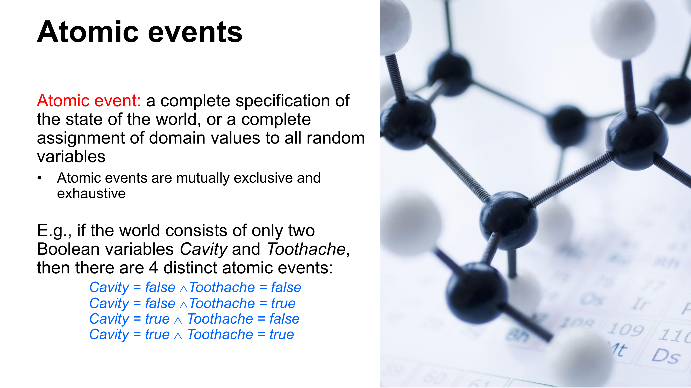
_Figure 9.1: Atomic events for two Boolean variables. (Lecture 9, slide 8.)_

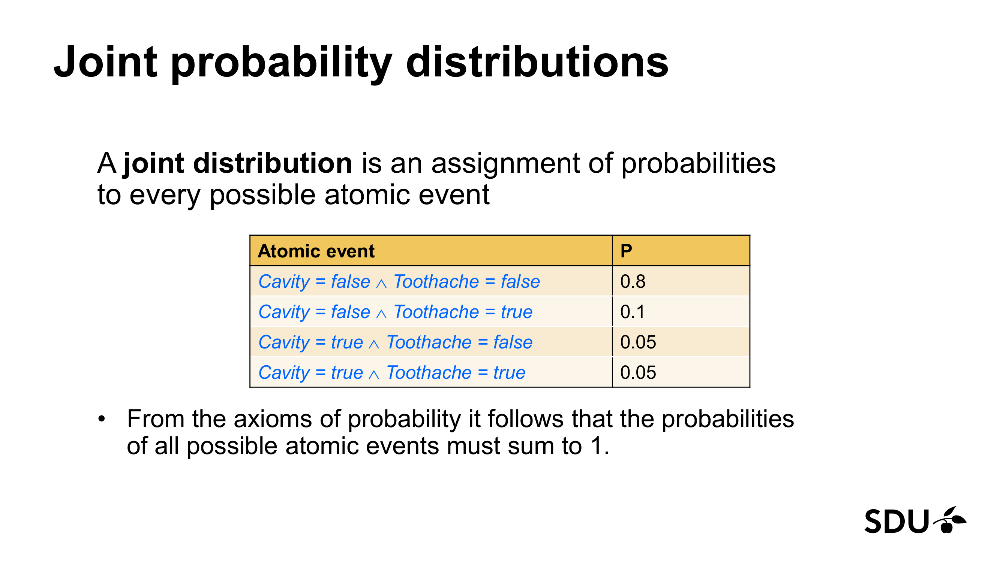
_Figure 9.2: The joint distribution P(Cavity, Toothache) used throughout slides 9–18. (Lecture 9, slide 9.)_

A **joint probability distribution** $P(X_1, X_2, \dots, X_n)$ assigns a probability to every atomic event. By the axioms of probability the entries sum to 1. For $n$ binary variables there are $2^n$ entries — write out the table for $n = 30$ and you already need a billion cells. The "joint is too big" problem is what Bayesian networks exist to solve. [Slides 9–10.]

Slide 34 makes the pain concrete with a three-variable joint over $(A, B, C)$: even at $k = 3$ Boolean variables you need $2^3 = 8$ table cells, and the count doubles with each new variable.

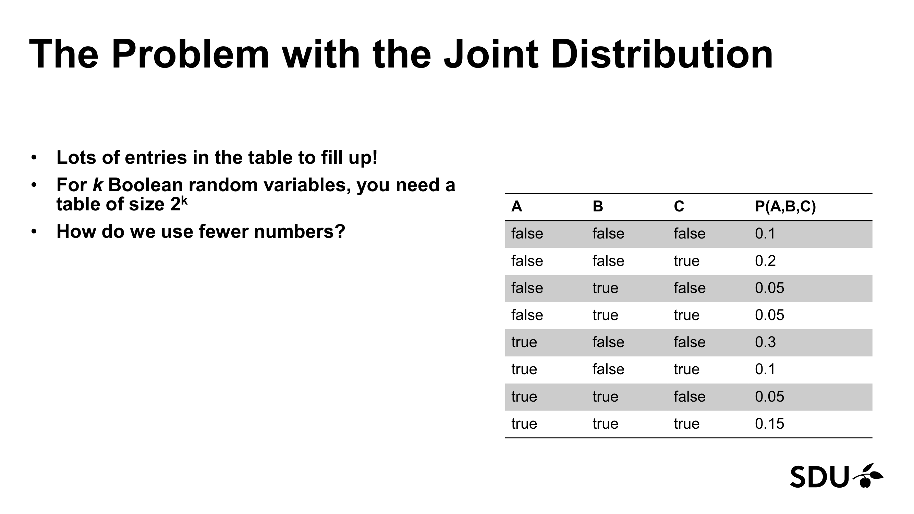
_Figure 9.3: The "$2^k$ entries" pain-point that motivates the BN factorisation. (Lecture 9, slide 34.)_

Notation:
- $P(X = x)$ — probability that RV $X$ takes value $x$.
- $P(X)$ — the *whole* probability distribution over $X$ (a vector of size $|\text{Domain}(X)|$).

A **marginal probability distribution** is obtained from the joint by *summing out* one or more variables. For two variables $X, Y$:

$$P(X = x) \;=\; \sum_{y} P(X = x, Y = y).$$

More generally, to find $P(X = x)$, sum the probabilities of all atomic events in which $X = x$ [slide 13]. Worked example on slide 12: from the (Cavity, Toothache) joint we sum the two rows where Cavity = false to get $P(\text{Cavity} = \text{false}) = 0.8 + 0.1 = 0.9$, and similarly $P(\text{Cavity} = \text{true}) = 0.05 + 0.05 = 0.1$. Summing the other way gives $P(\text{Toothache} = \text{false}) = 0.85$ and $P(\text{Toothache} = \text{true}) = 0.15$.

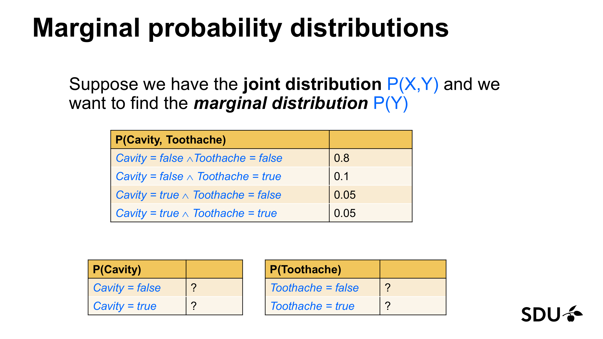
_Figure 9.4: Joint distribution with marginals to be filled in. (Lecture 9, slide 11.)_

[Lecture 9, slides 8–13.]

### 3.3 Conditional probability, Bayes' rule, normalisation

(Recall the *restrict-the-spreadsheet-to-one-office* analogy for conditional probability and the *flip-the-causal-arrow* analogy for Bayes' rule from §2.)

**Conditional probability** is the probability of event $A$ given that event $B$ has occurred:

$$P(A \mid B) \;=\; \frac{P(A \cap B)}{P(B)}, \qquad P(B) > 0.$$

[Slide 14.] Two derived identities the slides emphasise:

1. **Product rule** (re-arranged definition): $P(A, B) = P(A \mid B)\,P(B) = P(B \mid A)\,P(A)$. [Slide 19.]
2. **Chain rule** (multi-variable generalisation):
   $$P(A_1, A_2, \dots, A_n) \;=\; P(A_1)\,P(A_2 \mid A_1)\,P(A_3 \mid A_1, A_2)\,\cdots\,P(A_n \mid A_1, \dots, A_{n-1}) \;=\; \prod_{i=1}^{n} P(A_i \mid A_1, \dots, A_{i-1}).$$
   [Slide 19.]

#### Worked conditional probabilities (slides 14–16)

From the same (Cavity, Toothache) joint:

$$P(\text{Cavity} = \text{true} \mid \text{Toothache} = \text{false}) = \frac{P(\text{Cavity} = \text{true} \cap \text{Toothache} = \text{false})}{P(\text{Toothache} = \text{false})} = \frac{0.05}{0.85} \approx 0.059.$$

$$P(\text{Cavity} = \text{false} \mid \text{Toothache} = \text{true}) = \frac{0.1}{0.15} \approx 0.667.$$

A **conditional distribution** is the distribution over the values of one variable given fixed values of the others. Slide 17 lists all four for the dental world:

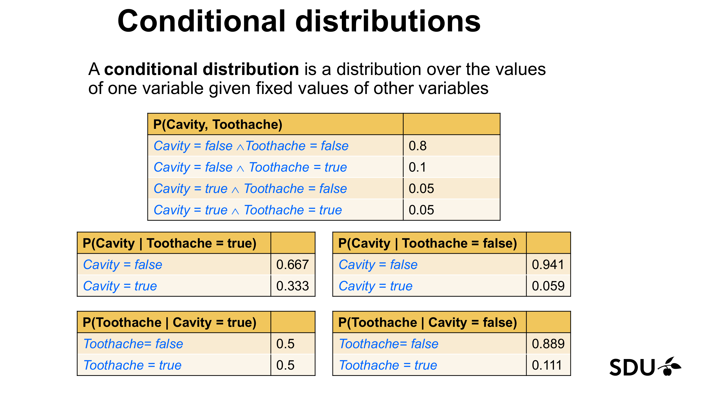
_Figure 9.5: P(Cavity | Toothache = ·) and P(Toothache | Cavity = ·). (Lecture 9, slide 17.)_

#### The normalisation trick (slide 18)

To compute the whole conditional distribution $P(X \mid y)$ at once:

1. **Select** every row of the joint matching $Y = y$.
2. **Renormalise** — divide each selected entry by their sum.

Example (slide 18): to compute $P(\text{Toothache} \mid \text{Cavity} = \text{false})$, select the two joint entries with Cavity = false (0.8 and 0.1), sum them (0.9), and divide:
$$P(\text{Toothache} = \text{false} \mid \text{Cavity} = \text{false}) = \tfrac{0.8}{0.9} \approx 0.889, \qquad P(\text{Toothache} = \text{true} \mid \text{Cavity} = \text{false}) = \tfrac{0.1}{0.9} \approx 0.111.$$

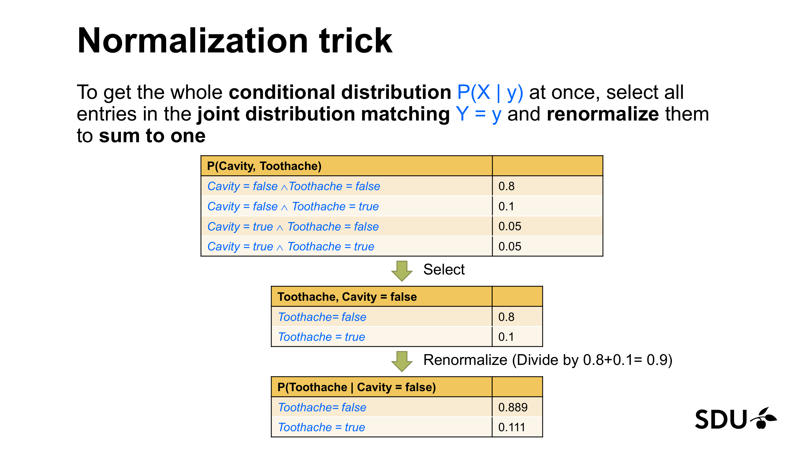
_Figure 9.6: The "select and renormalise" idiom. (Lecture 9, slide 18.)_

#### Bayes' rule (slides 19–24)

From the two factorisations of the joint we get **Bayes' rule** — Thomas Bayes (1702–1761):

$$\boxed{\; P(A \mid B) \;=\; \frac{P(B \mid A)\,P(A)}{P(B)} \;}$$

Why this matters [slide 20]:

- **Diagnostic from causal.** $P(\text{cavity} \mid \text{toothache})$ is hard to estimate by counting — toothaches occur with many causes. But $P(\text{toothache} \mid \text{cavity})$ is exactly the kind of statistic dentists collect. Bayes' rule turns the available causal probability into the diagnostic answer we want.
- **Updating with evidence.** $P(A)$ is the **prior** belief in $A$ before any evidence; $P(A \mid B)$ is the **posterior** after observing $B$. Bayes' rule is *the* mechanism for updating a belief with new evidence.

Recall the rational-agent setting of L02 §3: Bayes' rule is how a probabilistic rational agent revises its beliefs when its sensors fire.

[Lecture 9, slides 14–20.]

### 3.4 Worked Bayes-rule examples

#### Meningitis from a stiff neck (slide 21)

Givens:
- $P(\text{stiff neck} \mid \text{meningitis}) = 0.5$  (causal).
- $P(\text{meningitis}) = 1/50\,000 = 2 \times 10^{-5}$  (prior).
- $P(\text{stiff neck}) = 1/20 = 0.05$  (base rate).

Bayes' rule:
$$P(\text{meningitis} \mid \text{stiff neck}) = \frac{P(\text{stiff neck} \mid \text{meningitis})\,P(\text{meningitis})}{P(\text{stiff neck})} = \frac{0.5 \times 2 \times 10^{-5}}{0.05} = 2 \times 10^{-4}.$$

So even with a "50% true-positive rate", a stiff neck still only raises meningitis probability to about $0.02\%$ — the **base-rate fallacy** in action. Worth memorising for the exam.

#### Marie's wedding rain forecast (slides 22–24)

Setup:
- $P(\text{Rain}) = 5 / 365 \approx 0.014$ — desert wedding venue, rain rare.
- $P(\text{Predict} \mid \text{Rain}) = 0.9$ — weatherman is reliable on rainy days.
- $P(\text{Predict} \mid \neg\text{Rain}) = 0.1$ — false-positive rate on dry days.

What is $P(\text{Rain} \mid \text{Predict})$?

$$P(\text{Rain} \mid \text{Predict}) = \frac{P(\text{Predict} \mid \text{Rain})\,P(\text{Rain})}{P(\text{Predict})}$$

The denominator expands by total probability:

$$P(\text{Predict}) = P(\text{Predict} \mid \text{Rain})\,P(\text{Rain}) + P(\text{Predict} \mid \neg\text{Rain})\,P(\neg\text{Rain}).$$

Plug in:

Carrying the exact fraction $P(R) = 5/365$ rather than the rounded $0.014$:

$$P(\text{Rain} \mid \text{Predict}) = \frac{0.9 \times (5/365)}{0.9 \times (5/365) + 0.1 \times (360/365)} = \frac{4.5/365}{4.5/365 + 36/365} = \frac{4.5}{40.5} = \frac{1}{9} \approx 0.111.$$

So even with a forecast of rain, the actual chance of rain at the wedding is only about $11\%$ (exactly $1/9$). The low base rate (the dry desert) dominates the moderate-quality forecast.

*Arithmetic note.* If you round $P(R)$ to $0.014$ before plugging in, the displayed intermediates become $0.0126 / 0.1112 = 0.1133 \approx 11.3\%$. The slide's $0.111$ is the *exact-fraction* answer; both are correct to two significant figures, but if you want the slide's three-decimal value you must carry $5/365$ unrounded.

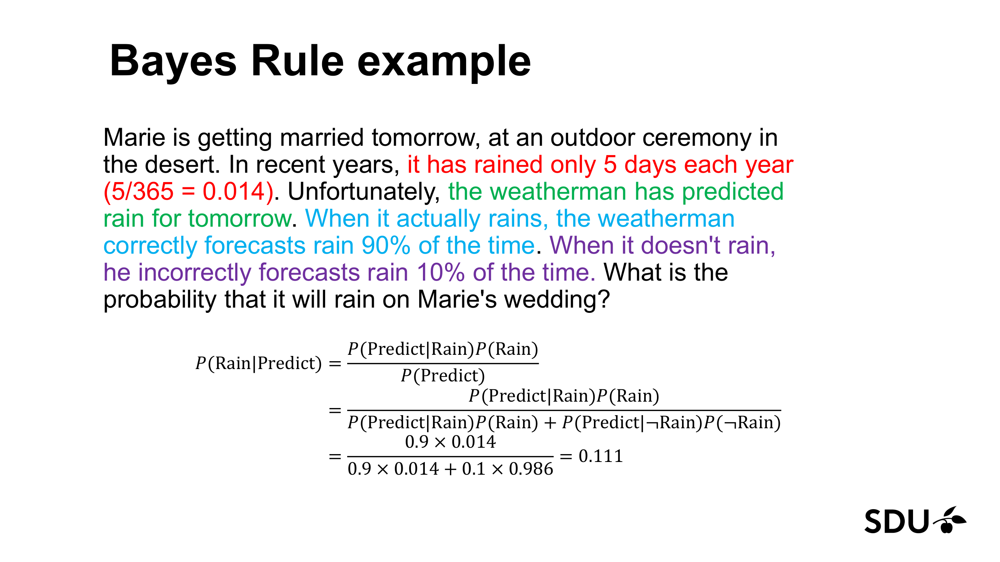
_Figure 9.7: Bayes-rule calculation, Marie's wedding. (Lecture 9, slide 24.)_

[Lecture 9, slides 21–24.]

### 3.5 Independence

(Recall the *two-questions-that-share-no-information* analogy from §2: independence means knowing one tells you nothing new about the other.)

Two events $A$ and $B$ are **independent** iff

$$P(A \cap B) = P(A)\,P(B), \qquad \text{equivalently} \qquad P(A \mid B) = P(A) \text{ and } P(B \mid A) = P(B).$$

Independence is an *enormous* simplification: a joint over $n$ independent binary variables needs only $n$ numbers (one prior per variable) instead of $2^n$ joint entries. Slide 25 gives the canonical illustration: Toothache and Weather can be assumed independent — knowing it's raining outside should not change your toothache probability.

**Common trap (slide 25, last bullet):** mutually exclusive events are *not* independent. If $A$ and $B$ are mutually exclusive then $P(A \cap B) = 0$, while $P(A)\,P(B) \neq 0$ unless one of them is the empty event. Mutually exclusive events are actually *anti*-correlated: knowing $A$ happened *rules out* $B$, so $P(B \mid A) = 0 < P(B)$. (For mutually exclusive events the union rule is $P(A \cup B) = P(A) + P(B)$.) The lecture explicitly answers "no" to the conceptual question "are mutually exclusive events independent?" on slide 25.

[Lecture 9, slide 25.]

### 3.6 Conditional independence

Two variables $X$ and $Y$ are **conditionally independent given $Z$** iff

$$P(X, Y \mid Z) = P(X \mid Z)\,P(Y \mid Z), \qquad \text{equivalently} \qquad P(X \mid Y, Z) = P(X \mid Z).$$

Written in the slide notation: $X \perp Y \mid Z$. [Slide 41.]

The lecture gives two grounded examples:

1. **Height and vocabulary** (slide 40). Let $A$ = height of a child, $B$ = number of words the child knows. When $A$ is high, $B$ is high too — they are clearly correlated. But that correlation is explained entirely by **age**: once we know the child's age, height and vocabulary become independent. $A \perp B \mid \text{Age}$.
2. **Rain, umbrella, traffic** (slide 41). Rain causes both umbrella usage and traffic congestion. Without knowing rain status, umbrellas and traffic are correlated. *Given rain*, they are independent: $U \perp T \mid R$, equivalently $P(U, T \mid R) = P(U \mid R)\,P(T \mid R)$ or $P(U \mid T, R) = P(U \mid R)$.

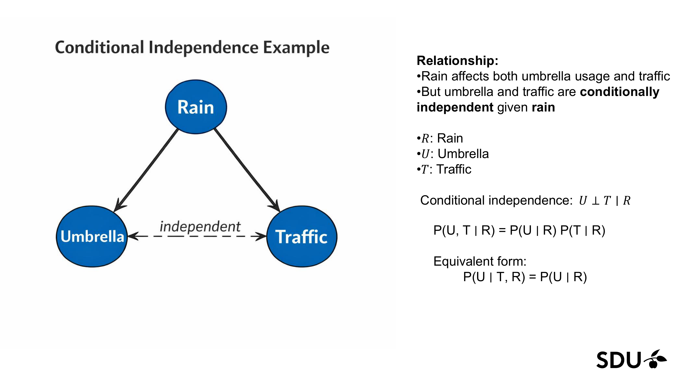
_Figure 9.8: Conditional independence U ⟂ T | R. (Lecture 9, slide 41.)_

*Caveat on the dashed line.* The dashed line between Umbrella and Traffic in Figure 9.8 is a **pedagogical annotation** labelling the *consequence* of conditioning on Rain ("once Rain is known, U and T are independent"). It is **not** part of the Bayesian-network syntax. The actual BN over these three variables has only two solid directed edges (Rain → Umbrella and Rain → Traffic); conditional independence is a *derived property* of the structure, not an extra graph element.

Recall the *gossip-graph analogy* and the *traffic-and-umbrella* analogy from §2: conditional independence is the formal statement of "once you know the rain, the cloud cover (or, equivalently in slide 41, your traffic prediction) is irrelevant to umbrella usage."

Conditional independence is also reused later in the course: HMMs (L09b §3) generalise it as the *Markov assumption* across time; Naive Bayes (§3.10 below, also referenced in L10 §3) builds the strongest possible conditional-independence assumption directly into its model.

[Lecture 9, slides 39–41.]

### 3.6a Motivating example — diagnosing anthrax (slides 31–33)

Before we write down the formal definition, walk through the lecture's intuitive motivation. A doctor sees a patient with cough, fever, and difficulty breathing. Each symptom alone is mild evidence — most coughs are not anthrax — and the doctor's uncertainty is high (slide 31). The general problem is **reasoning under uncertainty**: combining several weak signals into a posterior belief about the underlying cause (slide 32).

Now suppose the doctor orders an X-ray and observes a *wide mediastinum* — a rare radiographic sign strongly associated with inhalation anthrax. The belief in "anthrax" *jumps*. The natural way to organise this reasoning is a small Bayesian network: one hidden cause node $H$ = HasAnthrax with arrows to each of the observable symptom nodes — Cough, Fever, Difficulty Breathing, Wide Mediastinum (slide 33). Each arrow carries the causal CPT "given the disease, how often does this symptom appear?", which is exactly the kind of statistic medical literature collects. To answer "given the symptoms, how likely is anthrax?" we then apply Bayes' rule through the network.

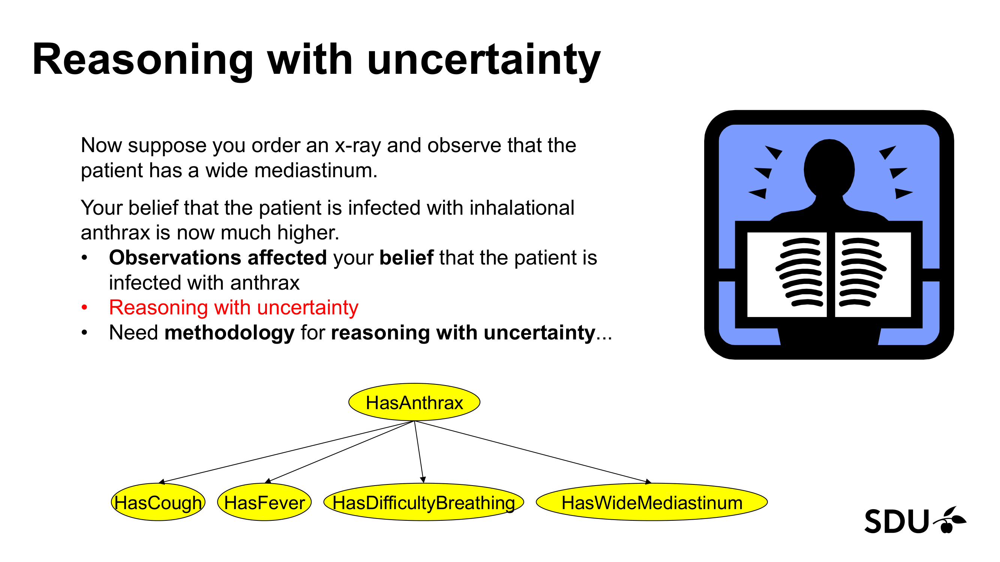
_Figure 9.9: The anthrax-diagnosis Bayesian network. The first intuitive BN of the lecture. (Lecture 9, slide 33.)_

This is the pattern every BN encodes: hidden cause(s) at the top, observable effects below, and a structured way to flip the causal probabilities into diagnostic posteriors. The formal apparatus that follows (§3.7 onward) is just the rigorous version of this picture.

[Lecture 9, slides 31–33.]

### 3.7 Bayesian network — definition

(Recall the *gossip-graph* analogy from §2: a BN is a small-town gossip graph where each node hears only from its parents.)

A **Bayesian network** (also called a *belief network*) consists of two parts [slide 35]:

1. **A directed acyclic graph (DAG)** with one node per random variable; an edge $X \to Y$ means $X$ has a *direct influence* on $Y$. "*No loops of any length are allowed.*"
2. **A set of conditional probability tables (CPTs)**, one per node, each giving $P(X_i \mid \text{Parents}(X_i))$.

The DAG encodes **two things simultaneously, and they are the same statement expressed differently** [slide 36]:

- **A conditional-independence structure.** Reading the graph as a gossip graph, each node is conditionally independent of every non-descendant given its parents (the **Markov condition**, formalised in §3.9).
- **A compact, factored representation of the full joint distribution.** Reading the graph as a recipe for multiplying CPTs in topological order, the chain rule + Markov condition collapse the joint $P(X_1, \dots, X_n)$ into a product of one CPT per node (the **BN factorisation**, derived in §3.10).

A confused student should pause here: these are not two separate features of a Bayesian network; they are two sides of the same coin. The Markov condition (a *constraint* on the model) is exactly what makes the compact factorisation (a *consequence*) valid. §3.9 develops the constraint side; §3.10 develops the consequence side.

Vocabulary on slide 36:
- *Node* $X$ in the DAG ↔ random variable $X$.
- *Parents* of $X$ — the set of nodes with arrows pointing directly into $X$.
- *Children* of $X$ — the set of nodes $X$ points directly at.
- *Ancestors* of $X$ — parents, grandparents, … (every node from which $X$ is reachable by following arrows forward).
- *Descendants* of $X$ — children, grandchildren, …
- *Non-descendants* of $X$ — every other node, excluding $X$ itself.

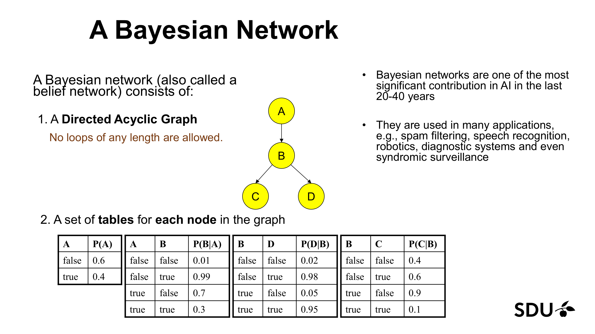
_Figure 9.10: A → B → {C, D} network with CPTs. (Lecture 9, slide 35.)_

The same network re-drawn with parenthood and "compact joint" annotations:

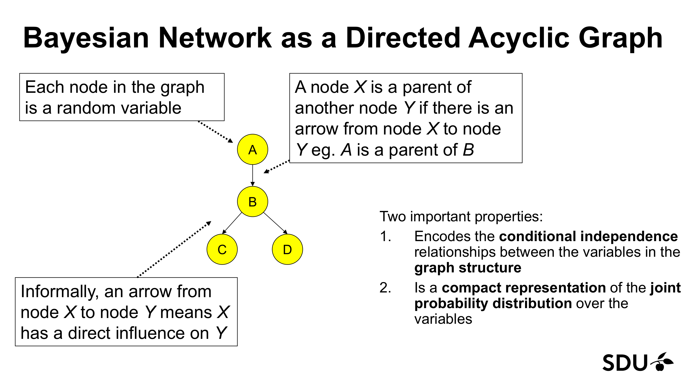
_Figure 9.11: Reading the structure of the BN. (Lecture 9, slide 36.)_

Why a DAG and not just any graph? *Cycles would prevent a consistent generative reading.* In a DAG you can always order nodes so that every parent comes before its child (topological order). Without that ordering the factorisation in §3.10 is not well-defined.

[Lecture 9, slides 35–36.]

### 3.8 Conditional probability table (CPT)

(Recall the *behaviour-chart-on-the-fridge* analogy from §2: a CPT is one row per combination of parent values, each row a probability distribution over the child.)

Every node $X_i$ in a Bayesian network carries a **conditional probability table** (CPT) — a discrete representation of the conditional distribution $P(X_i \mid \text{Parents}(X_i))$.

Anatomy:
- **One row per combination of parent values.** If $X_i$ has $k$ Boolean parents the table has $2^k$ rows.
- **One column per value of $X_i$** (or — equivalently for Booleans — *one column* listing $P(X_i = \text{true} \mid \ldots)$ with the other column implied by row-sum-to-1).
- **Row-sum-to-1.** For any fixed parent assignment, the probabilities over $X_i$'s domain sum to 1. Slide 38: "For a given combination of values of the parents (B in this example), the entries for $P(C = \text{true} \mid B)$ and $P(C = \text{false} \mid B)$ must add up to 1, e.g. $P(C = \text{true} \mid B = \text{false}) + P(C = \text{false} \mid B = \text{false}) = 1.$"

**Two size numbers you must keep separate** (slide 38). For a Boolean node with $k$ Boolean parents:

- **Number of table cells:** $\mathbf{2^{k+1}}$ (one cell per parent-combination × per child value). Slide 38 calls this "$2^{k+1}$ probabilities."
- **Number of independent parameters:** $\mathbf{2^k}$ (one per parent-combination — the other column's entries are forced by row-sum-to-1).

For non-Boolean variables with domain size $d$ and parent domain sizes $d_1, \dots, d_k$ the corresponding counts are $d \cdot \prod_j d_j$ table cells and $(d - 1) \cdot \prod_j d_j$ independent parameters. The total network parameter count sums the per-node independent-parameter count:

$$\sum_{i=1}^{n} \big(|\text{Domain}(X_i)| - 1\big) \cdot \prod_{X_j \in \text{Parents}(X_i)} |\text{Domain}(X_j)|.$$

Both numbers come up on exams; read the question carefully to know which is being asked (see §6.9).

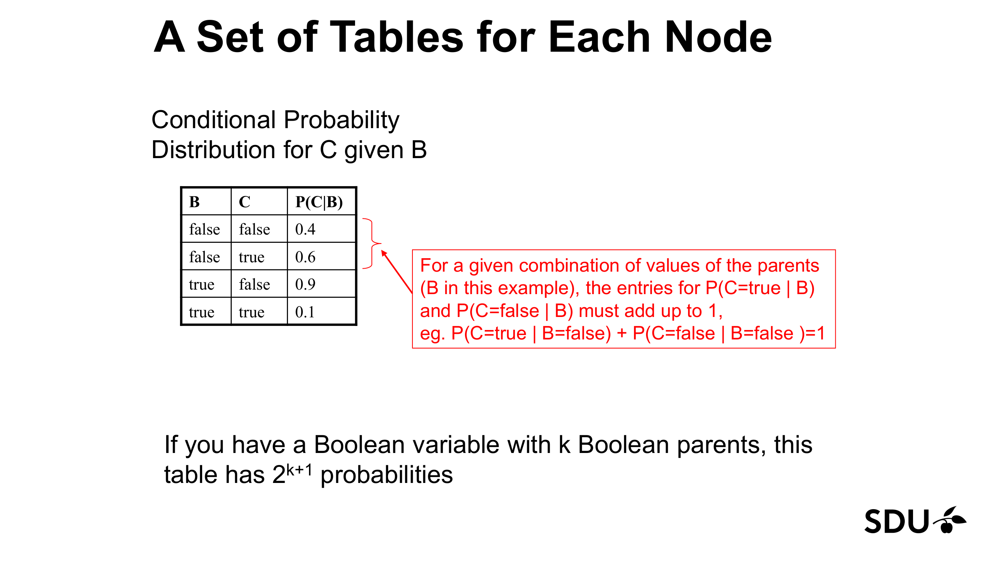
_Figure 9.12: Anatomy of a CPT, including row-sum-to-1. (Lecture 9, slide 38.)_

**Root nodes** (no parents) carry just a **prior** distribution — a one-row CPT of unconditional probabilities. In the A→B→{C,D} example, the root CPT $P(A)$ is $\{ \text{false}: 0.6,\ \text{true}: 0.4 \}$.

**Parameter savings — alarm network.** For the alarm network of §5 — with 5 Boolean variables and parents (∅, ∅, {B,E}, {A}, {A}) — the per-node independent-parameter counts are $1 + 1 + 4 + 2 + 2 = 10$, versus $2^5 - 1 = 31$ for the unrestricted joint.

**Parameter savings — lecture-late network.** For the lecture-late network of §4.1 (5 Boolean variables, parents (∅, ∅, {M}, {M,S}, {L})), the per-node counts are $1 + 1 + 2 + 4 + 2 = 10$, again versus $2^5 - 1 = 31$ for the joint. Both example networks compress 5 variables from 31 numbers down to 10 — a 3× saving even on a small network, which grows to many orders of magnitude on real ones.

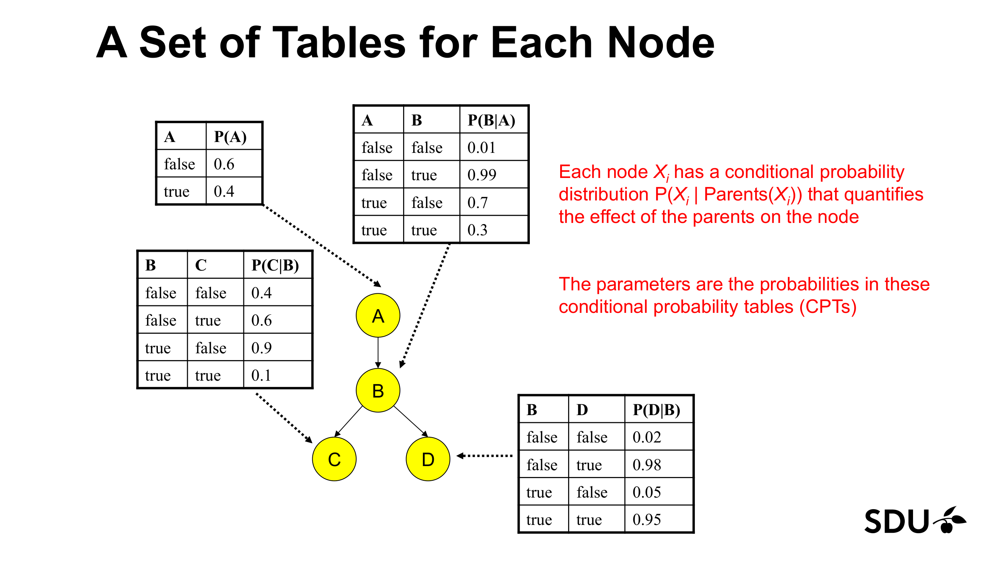
_Figure 9.13: P(A), P(B|A), P(C|B), P(D|B). (Lecture 9, slide 37.)_

[Lecture 9, slides 35–38.]

### 3.9 The Markov condition (special case of d-separation)

(Recall the *parents-as-gatekeepers* analogy from §2.)

**Note on terminology first.** The general graph-theoretic criterion that decides whether *any* set of variables is conditionally independent of another given a third — by checking every undirected path between them and seeing whether it is "blocked" by the conditioning set — is called **d-separation**. The slides only present the *Markov-condition* special case (parents block non-descendants) and use the phrase "Markov condition" rather than "d-separation". For exam purposes, the Markov condition is the form you'll be asked to apply. (D-separation has a glossary entry — see `_shared/glossary.md` — because the term shows up in textbooks and slide 54 implicitly uses it ("you can deduce many other conditional-independence relations from a Bayes net"). §3.9.1 below names the three building-block patterns that make up the full d-separation calculus.)

The **Markov condition** is the structural assumption a Bayesian network makes. Stated on slide 39:

> Given its parents $(P_1, P_2)$, a node $X$ is conditionally independent of its non-descendants $(ND_1, ND_2)$.

In symbols, for every node $X$:

$$X \perp \text{NonDescendants}(X) \mid \text{Parents}(X).$$

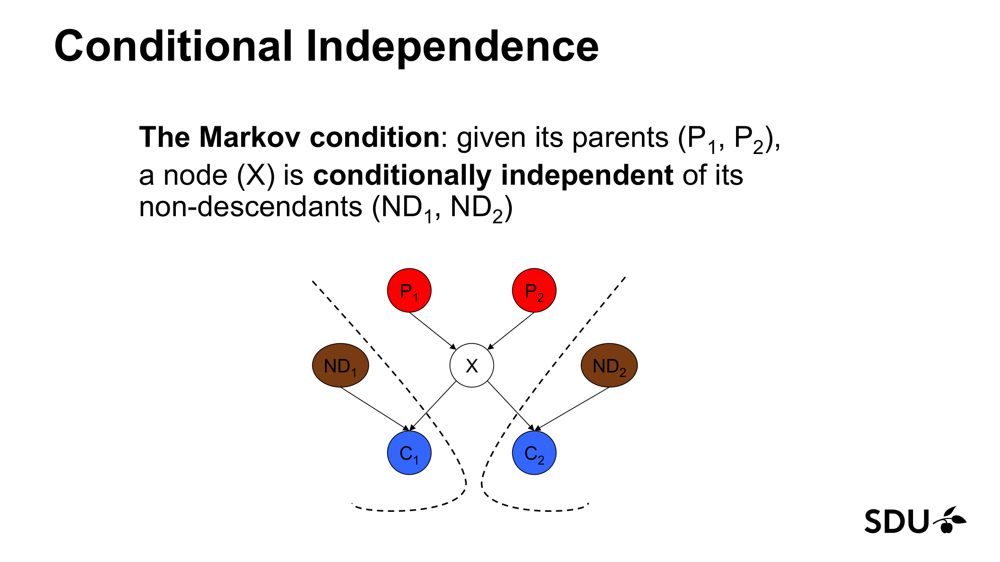
_Figure 9.14: Markov condition — once X's parents are known, X is independent of every non-descendant. (Lecture 9, slide 39.)_

This is *the* assumption that makes the network worth drawing. Two consequences flow from it:

1. **Compact factorisation.** Combining the chain rule with the Markov condition collapses each chain-rule factor $P(X_i \mid X_1, \dots, X_{i-1})$ down to $P(X_i \mid \text{Parents}(X_i))$. This gives the BN joint-distribution formula in §3.10 (full derivation there).
2. **Practical reasoning.** When computing a query you can *prune* whole subgraphs that are conditionally independent of the variables involved.

[Lecture 9, slides 39–41.]

### 3.9.1 Three connection patterns — chain, fork, collider

Slide 54 promises that "you can deduce many other conditional-independence relations from a Bayes net." The vocabulary for those deductions is the trichotomy of **chain, fork, collider**. Every undirected path between two nodes passes through middle nodes in one of these three shapes; whether the path *transmits dependence* depends on the shape and on what is being conditioned on.

In each picture below $X$ and $Y$ are the two end nodes whose conditional independence we are asking about, and $Z$ is the middle node.

**Chain: $X \to Z \to Y$.**

The classic causal chain. Without conditioning, $X$ and $Y$ are dependent — information flows from $X$ through $Z$ to $Y$. **Conditioning on $Z$ blocks the path:** $X \perp Y \mid Z$. (Example from §3.6: knowing rain $Z$ severs the path from "morning clouds" $X$ to "afternoon umbrella" $Y$.)

**Fork (common cause): $X \leftarrow Z \to Y$.**

$Z$ is a common cause of both $X$ and $Y$. Without conditioning, $X$ and $Y$ are dependent through $Z$ — they share a hidden cause and so are correlated. **Conditioning on $Z$ blocks the path:** $X \perp Y \mid Z$. The slide-41 Rain → {Umbrella, Traffic} example *is* a fork; the chapter's height/vocabulary/age example is too.

**Collider (common effect / V-structure): $X \to Z \leftarrow Y$.**

$Z$ is a common *effect* of $X$ and $Y$. This is the asymmetric case, and it is where students lose marks. Without conditioning, $X$ and $Y$ are **independent**: $X \perp Y$ (their priors are unrelated; the collider is downstream of both and does not couple them). **But conditioning on $Z$ unblocks the path: $X \not\perp Y \mid Z$.** Knowing the collider's value (or the value of any of its descendants) creates a dependence between $X$ and $Y$ that was not there marginally. This is the phenomenon of **explaining away**.

| Pattern | Picture | No conditioning | Conditioning on $Z$ |
|---|---|---|---|
| Chain | $X \to Z \to Y$ | $X \not\perp Y$ | $X \perp Y \mid Z$ |
| Fork | $X \leftarrow Z \to Y$ | $X \not\perp Y$ | $X \perp Y \mid Z$ |
| Collider | $X \to Z \leftarrow Y$ | $X \perp Y$ | $X \not\perp Y \mid Z$ |

**Explaining away — worked example on the alarm network (slide 46).**

The alarm network has $\text{Burglary} \to \text{Alarm} \leftarrow \text{Earthquake}$ — a textbook collider. Burglary $B$ and Earthquake $E$ have *independent* priors: $P(B \mid E) = P(B)$ (no edge between them). But once you condition on Alarm ringing, knowing an earthquake just hit *decreases* the probability of a burglary, because the earthquake already "explains" the alarm. Symbolically: $P(B \mid A) > P(B \mid A, E)$ — the earthquake **explains away** the burglary as an alternative cause.

This is the inverse of every other conditional-independence example in this chapter. Chains and forks *create* independence by conditioning; colliders *create dependence* by conditioning. A student who memorises "conditioning always makes things independent" will get explaining-away questions wrong on every exam.

(See §5.6 for the numerical $P(+b \mid +a)$ vs $P(+b \mid +a, +e)$ comparison.)

### 3.10 The joint distribution from a Bayesian network

(Recall the *chain-rule* analogy from §2: peel off variables one at a time. In a BN the Markov condition shrinks each peeled factor.)

The headline formula of the lecture, on slide 42:

$$\boxed{\; P(X_1 = x_1, \dots, X_n = x_n) \;=\; \prod_{i=1}^{n} P(X_i = x_i \mid \text{Parents}(X_i) = \text{parents}_i) \;}$$

where $\text{parents}_i$ are the values that the parents of $X_i$ take in the assignment $x_1, \dots, x_n$.

**Derivation (slide 42).** The derivation has four explicit steps. Do not collapse it: a student who skips the ancestor-decomposition step has to re-invent it under exam pressure.

*Step 1 — Apply the unconditional chain rule.* For *any* ordering $X_1, X_2, \dots, X_n$ of the variables, the chain rule (§3.3) gives

$$P(X_1 = x_1, \dots, X_n = x_n) = \prod_{i=1}^{n} P(X_i = x_i \mid X_1 = x_1, \dots, X_{i-1} = x_{i-1}).$$

This is unconditional — no Markov assumption yet. Each factor still has all $i-1$ predecessors in its conditioning set.

*Step 2 — Choose a topological ordering.* Order the variables so that every parent comes before its children — possible because the BN is a DAG. After this re-ordering, for each $i$ the prefix $\{X_1, \dots, X_{i-1}\}$ contains *all* of $X_i$'s ancestors (since every ancestor must precede $X_i$ in topological order).

*Step 3 — Decompose the prefix into parents + non-descendant non-parents.* For each $i$, every node in the prefix $\{X_1, \dots, X_{i-1}\}$ falls into one of two categories:

- It is a **parent** of $X_i$.
- It is **not an ancestor** of $X_i$ at all, *or* it is an ancestor of $X_i$ that is not a parent. In either case it is a **non-descendant** of $X_i$: descendants must come *after* $X_i$ in topological order, so anything in the prefix that is not a parent cannot be a descendant.

Therefore the prefix decomposes as $\{X_1, \dots, X_{i-1}\} = \text{Parents}(X_i) \cup \big(\text{NonDescendants}(X_i) \cap \{X_1, \dots, X_{i-1}\} \setminus \text{Parents}(X_i)\big)$ — i.e., every node in the prefix is either a parent of $X_i$ or a non-descendant non-parent of $X_i$.

*Step 4 — Apply the Markov condition.* By §3.9, $X_i$ is conditionally independent of all non-descendants given its parents. So in the chain-rule factor we can *drop* every non-descendant from the conditioning set:

$$P(X_i = x_i \mid X_1 = x_1, \dots, X_{i-1} = x_{i-1}) = P(X_i = x_i \mid \text{Parents}(X_i) = \text{parents}_i).$$

Substituting back into Step 1 gives the boxed BN factorisation. [Slide 42.]

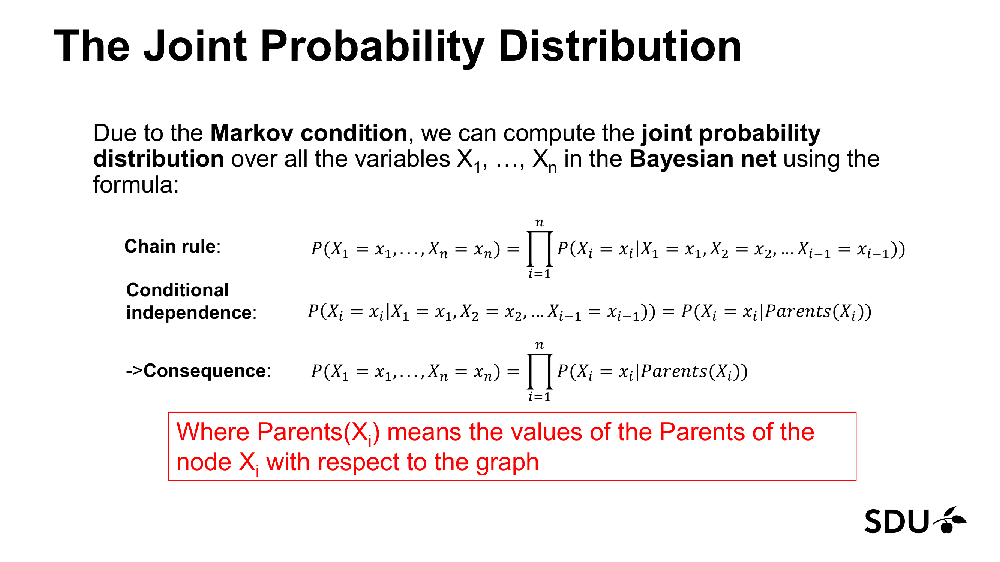
_Figure 9.15: From chain rule to BN joint factorisation. (Lecture 9, slide 42.)_

**Implication.** A network whose maximum in-degree (largest number of parents at any node) is $k$ stores its joint distribution in $O(n \cdot 2^k)$ entries instead of $O(2^n)$ — exponential only in the *local* parent count, not in the network size. For general (non-Boolean) variables the storage is $O(n \cdot d^k)$ where $d$ is the maximum domain size. This is the *compactness* slide 36 promised.

[Lecture 9, slides 42, 57.]

### 3.11 Naive Bayes classifier

(Recall the *gossip-graph-with-one-root* analogy from §2: Naive Bayes is a Bayesian network with a star topology and the leaves don't talk to each other.)

The **Naive Bayes classifier** is the smallest non-trivial Bayesian network: a class node $C$ at the root and $n$ feature nodes $A_1, \dots, A_n$ that each have $C$ as their sole parent. Graphically (a *star graph* or *root-and-leaves* structure):

```
          C
        / | \
       /  |  \
      A1  A2  ... An
```

Each leaf carries a CPT $P(A_i \mid C)$; the root carries the prior $P(C)$.

**The naive assumption** (slide 28): the features are *conditionally independent given the class*:
$$P(A_1, A_2, \dots, A_n \mid C) = \prod_{i=1}^{n} P(A_i \mid C).$$

This is *exactly* the "leaves don't talk to each other" half of the §2 analogy expressed as a formula. Once $C$ is known, the leaves carry no residual information about each other.

Applying Bayes' rule and ignoring the (class-independent) denominator $P(A_1, \dots, A_n)$:

$$P(C = c \mid A_1, \dots, A_n) \;\propto\; P(C = c) \prod_{i=1}^{n} P(A_i \mid C = c).$$

To classify a new record $\mathbf{a} = (a_1, \dots, a_n)$, compute the right-hand side for every class value $c$ and pick the $\arg\max$:

$$\hat{c} \;=\; \arg\max_{c \in \mathcal{C}} \;P(C = c) \prod_{i=1}^{n} P(A_i = a_i \mid C = c).$$

#### Why the lecture introduces it here, not in L10

Naive Bayes is the simplest case of probabilistic classification, so it makes a natural bridge between this lecture's probability tools and the general ML lecture. **L10 §3 references Naive Bayes again** as one of the classification methods alongside decision trees, random forests, and Bayesian belief networks. Treat L09a §3.11 as the *derivation* and L10 §3 as the *cross-method comparison*.

#### Handling continuous features — the Gaussian density

When a feature $A_i$ is continuous (e.g. Income), the CPT $P(A_i \mid C)$ is not a discrete table but a *probability density* — typically a Gaussian whose mean $\mu$ and variance $\sigma^2$ are estimated from the training data restricted to each class. The Gaussian density formula is

$$f(x \mid \mu, \sigma^2) \;=\; \frac{1}{\sqrt{2\pi\sigma^2}} \exp\!\left(-\frac{(x-\mu)^2}{2\sigma^2}\right).$$

Plug into the Naive-Bayes product just like any other "conditional probability" — even though it is technically a density (which can exceed 1), it is consistent across classes and so cancels appropriately in the $\arg\max$. (For exam purposes: if the question gives you $\mu$ and $\sigma^2$, evaluate the formula.)

#### Worked example (slide 29)

Given training data with columns Refund (yes/no), Marital Status (single, married, divorced), Taxable Income (continuous), and Class (yes/no), classify the test record $\mathbf{a}$ = (Refund = No, Married, Income = 120K). Slide 29 also gives the per-class Gaussian parameters for Income: for $C = \text{No}$, $\mu = 110$, $\sigma^2 = 2975$; for $C = \text{Yes}$, $\mu = 90$, $\sigma^2 = 25$.

For $C = \text{No}$:

- $P(\text{Refund} = \text{No} \mid C = \text{No}) = 4/7$ (counted from the training table).
- $P(\text{Married} \mid C = \text{No}) = 4/7$.
- $P(\text{Income} = 120 \mid C = \text{No}) = \frac{1}{\sqrt{2\pi \cdot 2975}} \exp\!\left(-\frac{(120-110)^2}{2 \cdot 2975}\right) = \frac{1}{\sqrt{18691}} \exp(-100/5950) \approx 0.00732 \cdot 0.983 \approx 0.0072$.
- Product: $P(\mathbf{a} \mid C = \text{No}) \approx (4/7)(4/7)(0.0072) = (16/49)(0.0072) \approx 0.0024$.

For $C = \text{Yes}$:

- $P(\text{Refund} = \text{No} \mid C = \text{Yes}) = 1$.
- $P(\text{Married} \mid C = \text{Yes}) = 0$ (no training rows of Yes are married — zero-frequency, see below).
- $P(\text{Income} = 120 \mid C = \text{Yes}) = \frac{1}{\sqrt{2\pi \cdot 25}} \exp\!\left(-\frac{(120-90)^2}{2 \cdot 25}\right) = \frac{1}{\sqrt{157.08}} \exp(-18) \approx 0.0798 \cdot 1.52 \times 10^{-8} \approx 1.2 \times 10^{-9}$.
- Product: $P(\mathbf{a} \mid C = \text{Yes}) = 1 \cdot 0 \cdot 1.2 \times 10^{-9} = 0$.

The Married = 0 factor kills the entire product — a classic Naive-Bayes pitfall called **zero-frequency**, addressed by Laplace smoothing in practice. Slide 29 does not perform smoothing.

Conclusion: $P(\mathbf{a} \mid \text{No})\,P(\text{No}) > P(\mathbf{a} \mid \text{Yes})\,P(\text{Yes})$, so $\hat{C} = \text{No}$.

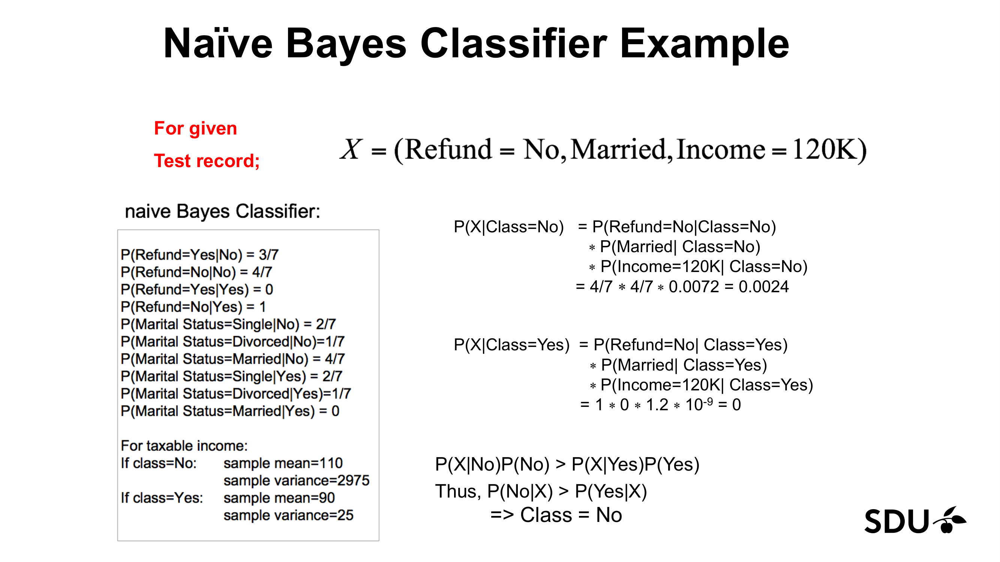
_Figure 9.16: Naive-Bayes worked example. (Lecture 9, slide 29.)_

#### When the assumption fails — bridge to general BNs (slide 30)

Many real attributes are causally or statistically dependent on each other even after conditioning on the class — height and weight given "is athlete", word frequencies in a document given "is spam", $\text{Refund}$ and $\text{Marital Status}$ given $\text{Class}$. Slide 30 is the *transition slide* of the lecture: "what if variables are not independent?" Its implicit answer (made explicit in slide 31+) is "use a Bayesian network with the actual dependency structure encoded in the DAG."

Concretely, Naive Bayes is a special case of a Bayesian network in which we *add* edges between leaves to capture residual feature dependence. Compare:

- **Naive Bayes:** $C$ at the root, all features as conditionally-independent leaves. Joint factorisation $P(C) \prod_i P(A_i \mid C)$.
- **Extended BN (e.g. $A_1 \to A_2$ added):** $C$ still at the root, but $A_2$ now also depends on $A_1$. Joint factorisation $P(C)\,P(A_1 \mid C)\,P(A_2 \mid C, A_1) \prod_{i \ge 3} P(A_i \mid C)$.

Every feature dependency you add costs storage (the CPT for that leaf grows) but buys back modelling accuracy. The next sections (§3.7 onward, formally) develop the general case where the DAG can be anything (acyclic). Naive Bayes is the sparsest end of the spectrum; the full joint is the densest end (§4.5).

[Lecture 9, slides 27–30.]

### 3.12 Inference on a Bayesian network — queries

**Inference** is *using* a Bayesian network to answer probabilistic questions. The general query form is

$$P(X \mid E) \quad\text{where}\quad X = \text{query variable(s)}, \quad E = \text{evidence variable(s)}.$$

[Slide 43.] Three flavours of query come up in practice:

- **Computing a joint entry.** "What is $P(A = \text{true}, B = \text{true}, C = \text{true}, D = \text{true})$ on the A→B→{C,D} network?" — directly applying the BN factorisation in §3.10.
- **Conditional probability given evidence.** "What is $P(R \mid T, \neg S)$ on the lecture-late network?" — needs §3.13's enumeration approach.
- **Most-likely explanation.** "Given the observations, which combination of unobserved variables is most probable?" — beyond this lecture (touched on in L09b).

[Lecture 9, slide 43.]

### 3.13 Inference by enumeration (exact inference)

(Recall the *phone-book* analogy from §2: enumeration sums every joint entry consistent with the evidence — slow but always correct.)

The cleanest exact-inference algorithm: write the query in terms of the joint distribution, expand the joint via the BN factorisation, and sum over the unobserved variables.

**Recipe** (combining slides 58–62):

Suppose the network has variables $\mathbf{V} = \{X\} \cup E \cup Y$ where $X$ is the query, $E$ is the evidence, and $Y$ is the set of remaining unobserved ("hidden") variables. Then

$$P(X = x \mid e) \;=\; \alpha \sum_{y} P(X = x, e, y) \;=\; \alpha \sum_{y} \prod_{i=1}^{n} P(V_i = v_i \mid \text{Parents}(V_i)),$$

where the sum ranges over all assignments to $Y$ and $\alpha = 1 / P(e)$ is the normalising constant.

**What is $\alpha$?** It is the same *normalisation trick* introduced in §3.3 (select-then-renormalise) applied to a Bayesian network. We do not have to compute $P(e)$ directly. Instead: for each value $x$ of the query variable, compute the joint sum $\sum_y P(X = x, e, y)$; then divide each result by the sum of all such sums. That denominator-of-the-sums is precisely $P(e) = \sum_x \sum_y P(X = x, e, y)$, so dividing makes the conditional distribution sum to 1 across $x$. Operationally, you compute *both the numerator and the would-be denominator the same way*, then normalise — that's $\alpha$.

**Worked schematic from slides 58–60** for the lecture-late network of §4.1 (introduced formally in the next section but used here as a forward example) and the query $P(R \mid T, \neg S)$:

1. The hidden variables are $Y = \{M, L\}$, both Boolean, so $|Y| = 2$ and the number of joint entries to sum is $2^{|Y|} = 2^2 = \mathbf{4}$. This is where slides 58–60's "4 joint computes" annotation comes from.
2. Compute $P(R, T, \neg S)$ by summing the BN joint over $(M, L)$: four joint computations.
3. Compute $P(\neg R, T, \neg S)$ the same way: four joint computations.
4. Normalise (this is the $\alpha$ step):
$$P(R \mid T, \neg S) \;=\; \frac{P(R, T, \neg S)}{P(R, T, \neg S) + P(\neg R, T, \neg S)}.$$

(See §5.8 for the full numerical solve of this query, which yields $\approx 0.415$.)

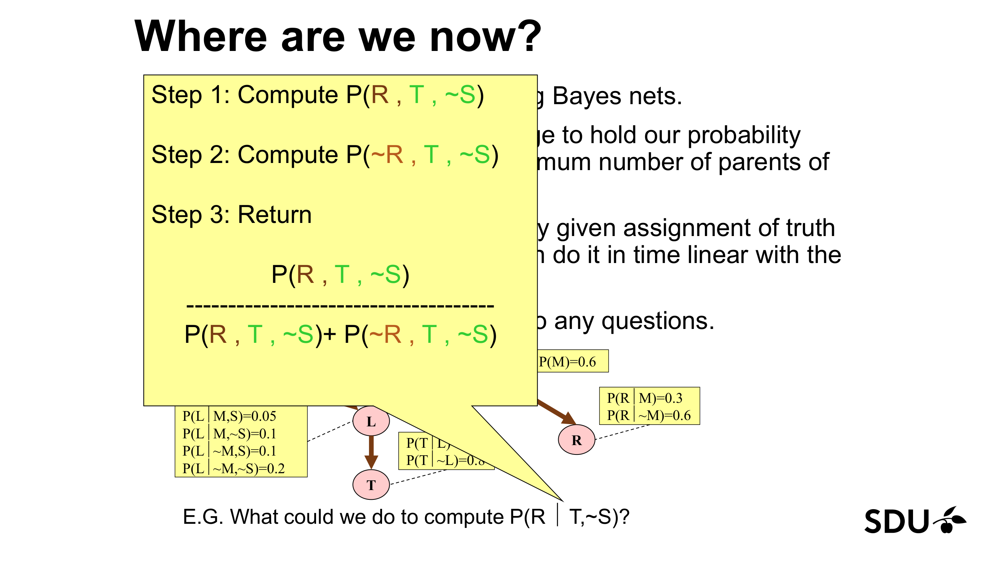
_Figure 9.17: Inference by enumeration as numerator / (numerator + denominator). (Lecture 9, slide 58.)_

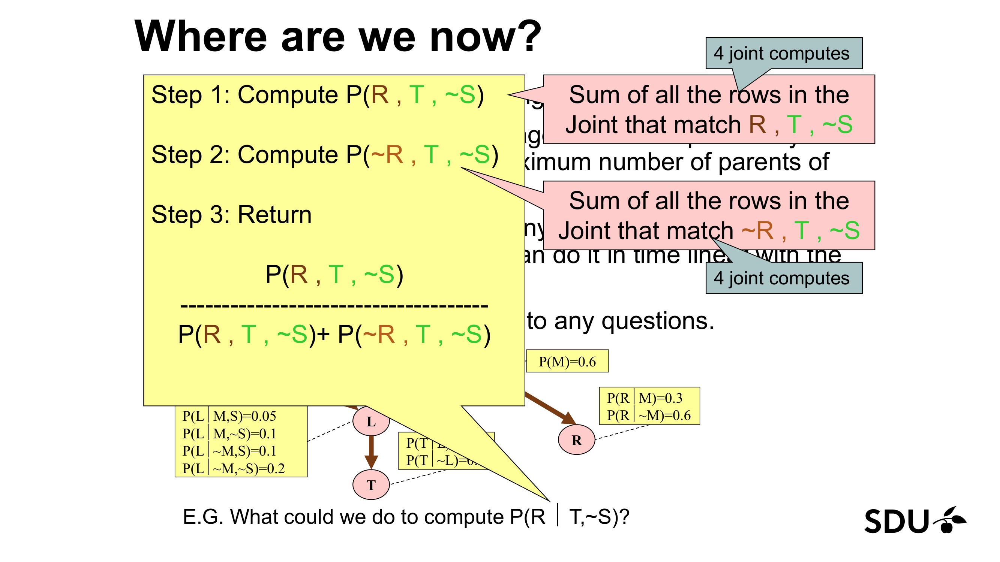
_Figure 9.18: Counting joint computations for inference by enumeration. (Lecture 9, slide 60.)_

**Cost.** Each joint computation multiplies $n$ CPT entries — $O(n)$ work. The number of joint entries we must sum *per query value* is $\prod_{Y_j \in Y} |\text{Domain}(Y_j)|$, exponential in $|Y|$. For a full conditional distribution over $X$ we repeat this for every value of $X$, so the total cost is $O(|D_X| \cdot n \cdot d^{|Y|})$ where $d$ is the maximum hidden-variable domain size. Slide 64 sums it up:

> Exact inference is feasible in small to medium-sized networks. Exact inference in large networks takes a very long time. We resort to approximate inference techniques which are much faster and give pretty good results. **General querying of Bayes nets is NP-complete.**

(The slide also includes an aside about "many tricks to save you time" being out of scope — that's a reference to variable elimination, factor caching, and related exact-inference accelerations covered in graduate AI courses.)

Approximate-inference techniques (likelihood weighting, MCMC, variable elimination) are out of scope for this course but flagged so you know what comes next.

[Lecture 9, slides 43, 55–64.]

### 3.14 Uncertainty, prior, posterior, evidence — vocabulary review

(Recall the *weather-forecast-updating-after-the-lightning-strike* analogy from §2: the prior is the morning forecast; the lightning is evidence; the updated forecast is the posterior; Bayes' rule is the rule that produces one from the other.)

Pulling together the canonical-glossary terms that show up throughout this lecture and reappear in L09b (see `_shared/glossary.md` and `_shared/cross-references.md`):

- **Uncertainty** — the agent's ignorance about (i) the current state of the world and (ii) the outcome of its actions. Bayesian probability is the mathematical handling of uncertainty.
- **Prior** $P(X)$ — the agent's belief about $X$ *before* any evidence. In a BN, the root CPTs are priors.
- **Posterior** $P(X \mid e)$ — the agent's belief about $X$ *after* observing $e$. Bayes' rule is the engine that turns priors into posteriors.
- **Evidence** $E$ — observed values of one or more variables. In a query $P(X \mid E)$, $E$ denotes the evidence variables together with the values they have been observed to take.

These four terms get reused in L09b (HMMs, where observations play the role of evidence and the forward algorithm computes posteriors over hidden states) — see L09b §3.

[Lecture 9, slides 3, 19, 33, 43.]

---

## 4. Algorithms / Methods

### 4.1 Building a Bayesian network

The lecture gives a constructive recipe on slide 49 and walks through it for a lecture-late example on slides 50–53.

**General algorithm (slide 49).**

1. **Choose the variables.** Pick a finite set of random variables relevant to the problem; call them $X_1, X_2, \dots, X_m$ in some order.
2. **For $i = 1, 2, \dots, m$:**
   1. Add node $X_i$ to the network.
   2. Choose $\text{Parents}(X_i)$ to be a *minimal* subset of $\{X_1, \dots, X_{i-1}\}$ such that $X_i$ is conditionally independent of the rest of $\{X_1, \dots, X_{i-1}\}$ given $\text{Parents}(X_i)$.
   3. Fill in the CPT $P(X_i \mid \text{Parents}(X_i))$ — one row per combination of parent values.

The "minimal subset" wording is doing real work. If you choose the variable ordering well — *causes before effects* — you typically get few parents and a small CPT. A bad ordering (effects first, causes last) can force you to add many edges and blow up the CPTs. [Slide 49, paraphrased.]

**Worked example (slides 50–53): the lecture-late network.**

Variables:
- $T$ — the lecture started by 8:30.
- $L$ — the lecturer arrives late.
- $R$ — the lecture concerns robots.
- $M$ — the lecturer is *Me*.
- $S$ — it is sunny.

The story behind the model: there are two lecturers — the *me*-lecturer ($M$) who tends to research robots and is more often late than the other lecturer, who teaches other AI topics and is more punctual. Sunny weather ($S$) reduces traffic and so reduces the chance the lecturer arrives late ($L$). Whether the lecture starts on time ($T$) depends only on whether the lecturer arrived late. The topic ($R$) depends only on which lecturer is teaching ($M$), and weather is unrelated to who is lecturing. The CPTs on slide 53 quantify this story.

Stated conditional-independence assertions [slide 50]:
- $T$ depends *directly* only on $L$. (Once you know whether the lecturer is late, the other variables don't change $T$.)
- $L$ depends directly only on $M$ and $S$.
- $R$ depends directly only on $M$.
- $M$ and $S$ are independent.

*Ordering note.* Slide 50 lists the variables in textbook order $T, L, R, M, S$, but the diagram in Step 1 (Figure 9.19 below) reorders them into causal-topological order — roots first, leaves last — i.e. $S, M$ as roots; $L, R$ in the middle; $T$ as the leaf. This is the "causes before effects" heuristic in action (see §6.7) and it's why the slide-50 list and the slide-51 figure disagree at first glance.

#### Step 1: add variables (slide 51)

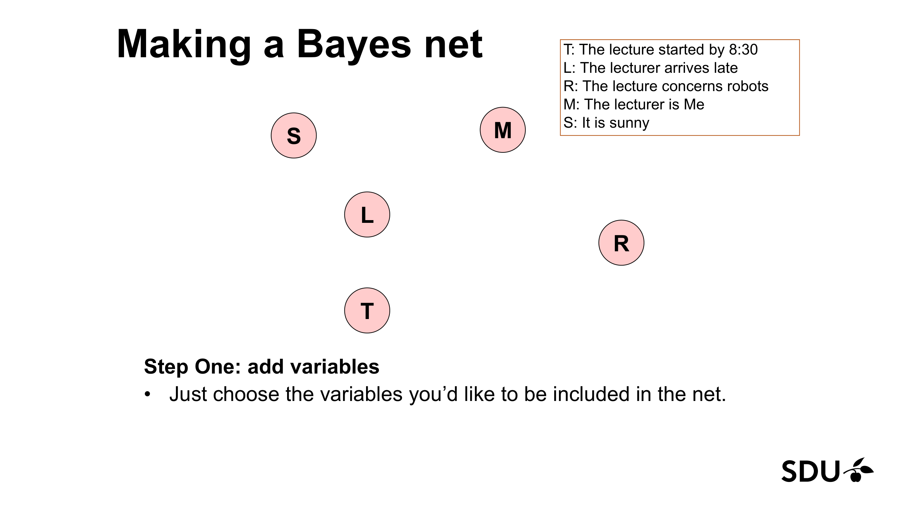
_Figure 9.19: Lecture-late BN — Step 1. (Lecture 9, slide 51.)_

#### Step 2: add edges (slide 52)

Following the dependence statements:
- $M \to R$, $M \to L$, $S \to L$, $L \to T$.

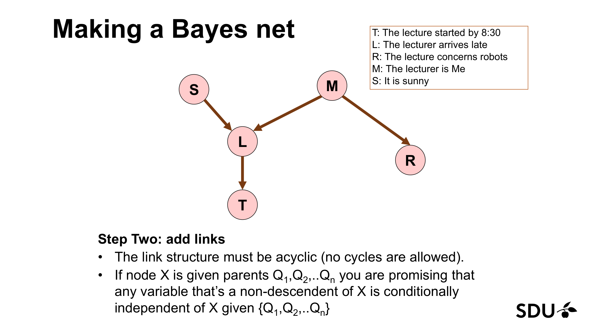
_Figure 9.20: Lecture-late BN — Step 2. (Lecture 9, slide 52.)_

Notice the promise made by drawing those edges (and only those edges): for every node, every non-descendant is conditionally independent of the node given its parents. For instance, $R$ has parent $M$ and no other in-edges, so $R \perp \{S, L, T\} \mid M$.

#### Step 3: add probability tables (slide 53)

For the lecture-late example the slides give:
- $P(S) = 0.3$; $P(M) = 0.6$.
- $P(R \mid M) = 0.3$; $P(R \mid \neg M) = 0.6$.
- $P(T \mid L) = 0.3$; $P(T \mid \neg L) = 0.8$.
- $P(L \mid M, S) = 0.05$; $P(L \mid M, \neg S) = 0.1$; $P(L \mid \neg M, S) = 0.1$; $P(L \mid \neg M, \neg S) = 0.2$.

(The CPT for $L$ has four rows because $L$ has two Boolean parents. Each listed number is $P(L = \text{true} \mid \text{parent values})$; the complementary $P(L = \text{false} \mid \ldots)$ values are 1 minus those.)

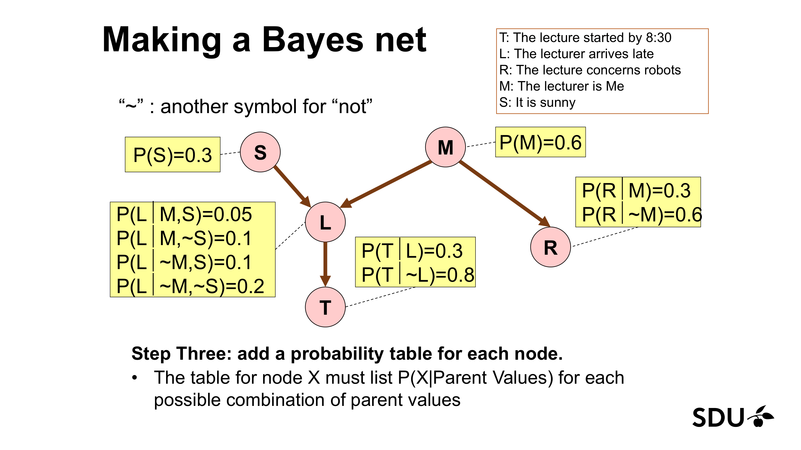
_Figure 9.21: Lecture-late BN — Step 3. (Lecture 9, slide 53.)_

Slide 54 reinforces three properties of the resulting network:

1. **Two unconnected variables may still be correlated** — e.g. $T$ and $S$ are correlated through the path $S \to L \to T$, even though there is no direct edge.
2. **Each node is conditionally independent of all its non-descendants given its parents** — the Markov condition.
3. **You can deduce many further conditional-independence relations from the graph alone** — the d-separation calculus (out of scope for this lecture, but worth knowing the name of).

[Lecture 9, slides 49–54.]

### 4.2 Computing a joint entry from a BN

Once the BN is built, computing any joint entry is mechanical: multiply the CPT entries that match the assignment.

**Algorithm.**

```
input:  BN with variables X1,...,Xn and CPTs P(Xi | Parents(Xi))
        assignment x = (x1,...,xn)
output: P(X1 = x1, ..., Xn = xn)

p ← 1
for i = 1 to n:
    let parents_i = the values of Parents(Xi) in the assignment x
    p ← p × P(Xi = xi | Parents(Xi) = parents_i)
return p
```

This is just slide 42's factorisation read left-to-right. It is $O(n)$ in the network size, given the CPT lookups.

#### Worked example (slide 44–45): A → B → {C, D}

CPTs:
- $P(A = \text{true}) = 0.4$.
- $P(B = \text{true} \mid A = \text{true}) = 0.3$.
- $P(C = \text{true} \mid B = \text{true}) = 0.1$.
- $P(D = \text{true} \mid B = \text{true}) = 0.95$.

Query: $P(A = \text{true}, B = \text{true}, C = \text{true}, D = \text{true})$.

$$P(A=T,B=T,C=T,D=T) = P(A=T)\,P(B=T \mid A=T)\,P(C=T \mid B=T)\,P(D=T \mid B=T)$$
$$= 0.4 \times 0.3 \times 0.1 \times 0.95 = 0.0114.$$

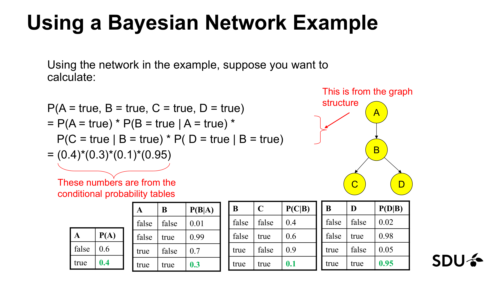
_Figure 9.22: Joint entry from BN. (Lecture 9, slide 45.)_

### 4.3 Computing a joint entry — out-of-topological-order example (slide 56)

Slide 56 walks through a more delicate joint entry on the lecture-late network: $P(T, \neg R, L, \neg M, S)$. The derivation explicitly invokes conditional independence at each step:

$$P(T, \neg R, L, \neg M, S) = P(T \mid \neg R, L, \neg M, S)\,P(\neg R, L, \neg M, S)$$

Apply Markov condition: $T$'s only parent is $L$, so $T \perp \{\neg R, \neg M, S\} \mid L$.

$$= P(T \mid L)\,P(\neg R, L, \neg M, S)$$

Expand the second factor by the chain rule, then use the Markov condition again:

$$= P(T \mid L)\,P(\neg R \mid L, \neg M, S)\,P(L, \neg M, S)$$

$R$'s only parent is $M$, so $R \perp \{L, S\} \mid M$. Hence $P(\neg R \mid L, \neg M, S) = P(\neg R \mid \neg M)$:

$$= P(T \mid L)\,P(\neg R \mid \neg M)\,P(L \mid \neg M, S)\,P(\neg M, S)$$

Finally $M$ and $S$ are independent (slide 50), so $P(\neg M, S) = P(\neg M)\,P(S)$:

$$\boxed{\; P(T, \neg R, L, \neg M, S) = P(T \mid L)\,P(\neg R \mid \neg M)\,P(L \mid \neg M, S)\,P(\neg M)\,P(S) \;}$$

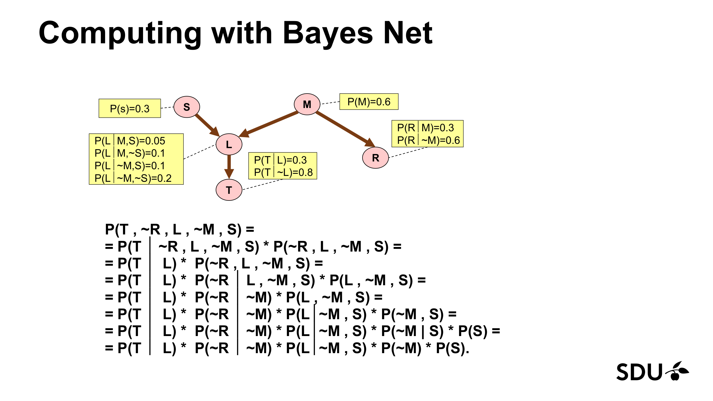
_Figure 9.23: Manual derivation of a joint entry. (Lecture 9, slide 56.)_

Numerically (using the slide-53 CPTs):
$$P(T \mid L) = 0.3, \quad P(\neg R \mid \neg M) = 0.4, \quad P(L \mid \neg M, S) = 0.1, \quad P(\neg M) = 0.4, \quad P(S) = 0.3.$$

$$P(T, \neg R, L, \neg M, S) = 0.3 \times 0.4 \times 0.1 \times 0.4 \times 0.3 = 0.00144.$$

The same number, of course, would be returned by the §4.2 algorithm without the manual derivation; the derivation is what you'd show on an exam to demonstrate that you understand *why* the factorisation works.

### 4.4 Inference by enumeration — algorithm

Generalising §3.13 to algorithm form:

```
input:  BN over variables V = {X} ∪ E ∪ Y
        X = query variable
        e = observed values of evidence variables E
        Y = remaining (hidden) variables
output: P(X | e), a distribution over the domain of X

for each value x in Domain(X):
    α[x] ← 0
    for each assignment y to Y:
        joint ← compute_joint_entry(BN, x, e, y)   # §4.2 algorithm
        α[x] ← α[x] + joint
total ← Σ_x α[x]
return  { x → α[x] / total  for each x }
```

**Complexity.**
- Joint computation per entry: $O(n)$ (where $n$ = number of variables, ignoring CPT lookup cost).
- Number of entries summed *per query value*: $\prod_{Y_j \in Y} |\text{Domain}(Y_j)|$ — exponential in $|Y|$.
- Repeated across all $|D_X|$ values of the query variable.
- **Total: $O(|D_X| \cdot n \cdot d^{|Y|})$** where $d$ is the maximum hidden-variable domain size. **NP-complete** in general [slide 64], so exact inference does not scale beyond moderate networks.

[Lecture 9, slides 58–64.]

### 4.5 Comparison table — methods covered in this lecture

| Method | What it computes | Cost (Boolean variables) | When to use |
|---|---|---|---|
| Full joint enumeration (no BN) | Any query, by definition | $O(2^n)$ space and time | Never in practice — only as a baseline. |
| BN joint-entry computation (§4.2) | $P(X_1 = x_1, \dots, X_n = x_n)$ | $O(n)$ given the CPTs | Single joint entry. |
| Manual factorisation by chain rule + Markov (§4.3) | Same as §4.2, but written out | $O(n)$ | Exam derivation questions. |
| Naive Bayes (§3.11) | $\arg\max_c P(c)\prod_i P(a_i \mid c)$ | $O(n \cdot |\mathcal{C}|)$ | Classification when features are roughly conditionally independent given the class. |
| Inference by enumeration (§4.4) | $P(X \mid e)$ | $O(|D_X| \cdot n \cdot d^{|Y|})$ — exponential in $|Y|$ | Exact inference on small/medium networks. |
| Approximate inference (e.g. likelihood weighting, MCMC) | $P(X \mid e)$ up to sampling error | Polynomial per sample | Large networks. **Out of scope** of L09a — see §3.13. |

[Lecture 9, slides 42, 49, 57, 64.]

### 4.6 The BN trade-off spectrum (slide 66)

Slide 66 summarises the entire lecture with a single picture: four BN structures on a *spectrum* between minimum and maximum modelling expressiveness, illustrating the **flexible trade-off between model accuracy and compute efficiency** that BNs enable. From sparsest to densest, for $n = 5$ Boolean variables:

| Structure | Edges | Independent parameters ($n = 5$ Boolean) | Expressiveness |
|---|---|---|---|
| Strict independence | $0$ | $n = 5$ (just a prior per variable) | Very low — every variable independent of every other. |
| Naive Bayes (1 class root, $n - 1$ leaves) | $n - 1 = 4$ | $2n - 1 = 9$ | Moderate — features conditionally independent given the class. |
| Sparse BN (max in-degree $k$) | varies, $\le nk$ | $O(n \cdot 2^k)$ | High — can model any acyclic dependency structure with bounded fan-in. |
| Full joint distribution | $\binom{n}{2}$ if drawn fully | $2^n - 1 = 31$ | Maximum — every dependency captured, no structural assumptions. |

The lecture's two cornerstone examples both sit in the "sparse BN" middle band: the alarm network has 10 parameters versus the full joint's 31, a 3× saving on $n = 5$ that scales to many orders of magnitude on real networks (slide 63 shows a real-world medical-diagnosis BN with hundreds of nodes).

**Exam relevance.** A common high-band question is "describe how Bayesian networks trade off model accuracy and compute efficiency, citing extreme cases." The expected answer is exactly this spectrum: the strict-independence extreme has tiny CPTs but cannot capture any dependence; the full-joint extreme captures everything but is exponential; the middle ground (Naive Bayes, sparse BNs) is where useful models live.

### 4.7 Where does the Bayesian network come from? (slide 65)

Two options [slide 65]:

1. **Expert design.** A domain expert (e.g. a doctor for a medical-diagnosis network) specifies the variables, draws the edges from causal knowledge, and supplies the CPT numbers from clinical statistics. The slide-49 algorithm (§4.1) is the formal version of this — it assumes the human knows the structure.
2. **Learn it from data.** Both the structure (which edges to draw) and the parameters (the CPT numbers) can be learned from a dataset of observed assignments. Structure learning is a hard search problem; parameter learning is essentially counting (for fully-observed data) or EM (for data with hidden variables). This is the territory of L10 and later courses; not covered here.

In practice, real-world BNs are often **mixed**: an expert sketches the structure (which variables, which edges) and parameters are estimated from data.

[Lecture 9, slides 65–66.]

---

## 5. Worked Examples

### 5.1 Bayes' rule — meningitis and stiff necks (slide 21)

Stated and solved in §3.4 above. Key takeaway: a high "true positive rate" $P(\text{symptom} \mid \text{disease})$ is *not* the same as a high "diagnostic value" $P(\text{disease} \mid \text{symptom})$, because the prior $P(\text{disease})$ can be tiny.

### 5.2 Bayes' rule — Marie's wedding (slides 22–24)

Stated and solved in §3.4. Key takeaway: the *total probability* expansion of the denominator ($P(\text{Predict}) = P(\text{Predict} \mid R)\,P(R) + P(\text{Predict} \mid \neg R)\,P(\neg R)$) is the move people most often forget on exams.

### 5.3 Marginal and conditional distributions — Cavity and Toothache (slides 9–18)

Stated and solved in §3.2 and §3.3. Key idiom: *select-then-renormalise* for getting a whole conditional distribution at once.

### 5.4 Naive-Bayes classification (slide 29)

Stated and solved in §3.11. Key trap: zero-frequency. If any $P(A_i \mid C)$ is zero in the training data, the entire product is zero — Laplace ("add-1") smoothing is the standard fix in practice; the slide does not apply it.

### 5.5 A → B → {C, D} joint entry (slides 44–45)

Stated and solved in §4.2: $P(A=T, B=T, C=T, D=T) = 0.4 \cdot 0.3 \cdot 0.1 \cdot 0.95 = 0.0114$.

### 5.6 Alarm network — the canonical Bayesian-network example (slides 46–48)

Variables:
- $B$ — Burglary (binary, prior $P(b) = 0.001$).
- $E$ — Earthquake (binary, prior $P(e) = 0.002$).
- $A$ — Alarm sounds, with parents $\{B, E\}$.
- $J$ — JohnCalls, parent $A$.
- $M$ — MaryCalls, parent $A$.

Structure: $B \to A \leftarrow E$, $A \to J$, $A \to M$.

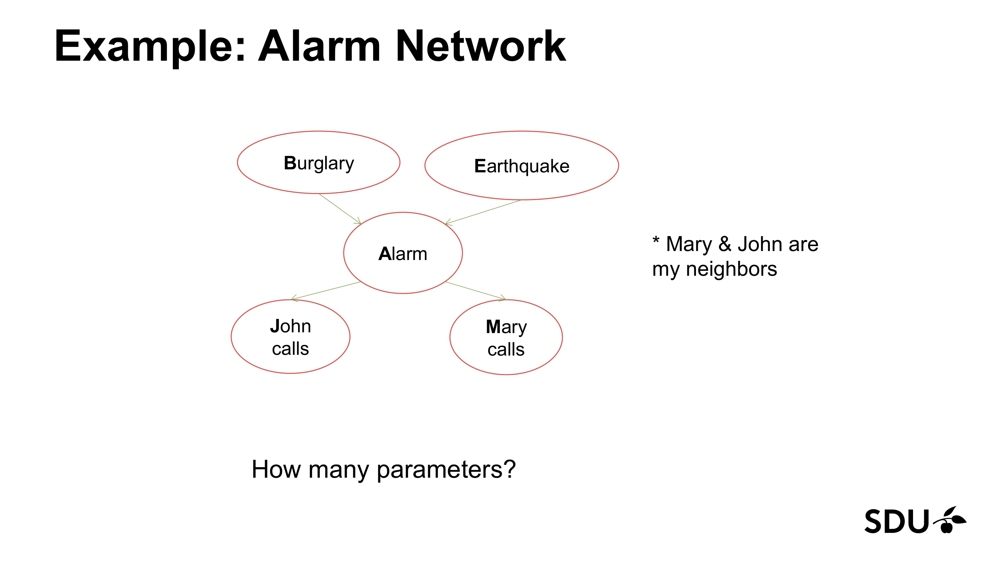
_Figure 9.24: Alarm-network DAG. (Lecture 9, slide 46.)_

CPTs (slide 47, using +x for $X = \text{true}$ and ¬x for $X = \text{false}$, and writing rows in the slide notation):

- $P(+b) = 0.001$.
- $P(+e) = 0.002$.
- $P(+a \mid +b, +e) = 0.95$; $P(+a \mid +b, \neg e) = 0.94$; $P(+a \mid \neg b, +e) = 0.29$; $P(+a \mid \neg b, \neg e) = 0.001$.
- $P(+j \mid +a) = 0.9$; $P(+j \mid \neg a) = 0.05$.
- $P(+m \mid +a) = 0.7$; $P(+m \mid \neg a) = 0.01$.

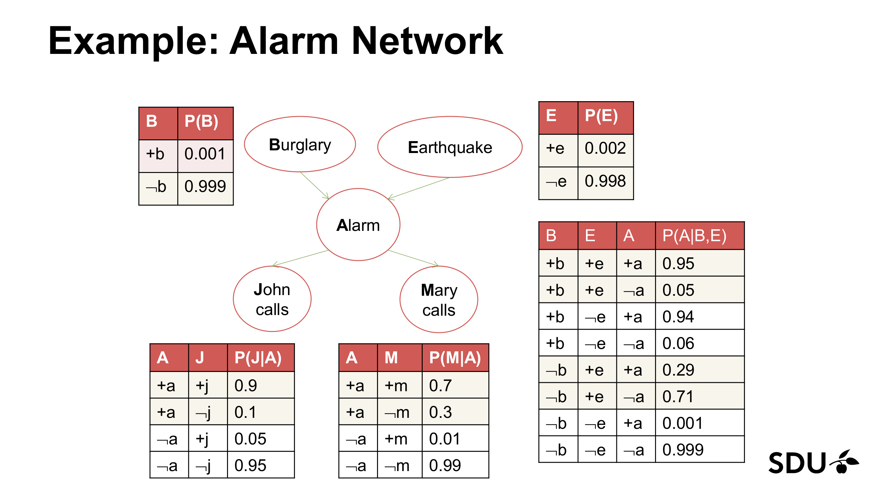
_Figure 9.25: Alarm-network CPTs. (Lecture 9, slide 47.)_

**Parameter count.** $1 + 1 + 4 + 2 + 2 = 10$ independent probabilities, compared with $2^5 - 1 = 31$ for the unrestricted joint over five Boolean variables.

**Slide 46 asks: "How many parameters?"** — the answer is the same 10. The compactness comes from the network's structure: even though the joint has 32 atomic events, only 10 numbers are needed to reconstruct any of them.

#### Slide 48 — the lecturer's worked sample joint

Slide 48 writes the factorisation in the network's variables:

$$\prod_i P(X_i \mid \text{Parents}(X_i)) \;=\; P(B)\,P(E)\,P(A \mid B, E)\,P(J \mid A)\,P(M \mid A),$$

and applies it to the assignment "real burglary, no earthquake, alarm sounds, John doesn't call, Mary calls":

$$P(+b, \neg e, +a, \neg j, +m) = P(+b)\,P(\neg e)\,P(+a \mid +b, \neg e)\,P(\neg j \mid +a)\,P(+m \mid +a).$$

Plug in slide-47 numbers:

$$= 0.001 \times 0.998 \times 0.94 \times 0.1 \times 0.7 = 6.57 \times 10^{-5}.$$

This is the "informative diagnostic" case — a real burglary with one non-calling neighbour.

#### A second sample joint — the "false alarm" case

The complementary "everything fires but nothing is happening" assignment:

$$P(+j, +m, +a, \neg b, \neg e) = P(+j \mid +a)\,P(+m \mid +a)\,P(+a \mid \neg b, \neg e)\,P(\neg b)\,P(\neg e)$$
$$= 0.9 \times 0.7 \times 0.001 \times 0.999 \times 0.998 = 6.28 \times 10^{-4}.$$

The false-alarm path is an order of magnitude *more probable* than the real-burglary path above, because $P(\neg b)P(\neg e) \approx 1$ swamps the tiny $P(+a \mid \neg b, \neg e) = 0.001$.

#### Explaining-away worked numerically — slide-46 collider in action

The alarm network has a collider at Alarm: $B \to A \leftarrow E$. By §3.9.1, $B$ and $E$ are independent marginally but become *dependent* once Alarm is observed. Let's verify numerically.

**Marginal independence (no conditioning).** $P(+b) = 0.001$ and $P(+b \mid +e)$ — by the structure, Burglary has no edge from Earthquake, so $P(+b \mid +e) = P(+b) = 0.001$. ✓

**Conditional dependence (Alarm observed).** Compute $P(+b \mid +a)$ vs $P(+b \mid +a, +e)$ to see the explanatory shift.

For $P(+b \mid +a)$, by Bayes' rule:
$$P(+b \mid +a) = \frac{P(+a \mid +b)\,P(+b)}{P(+a)},$$
where $P(+a \mid +b) = P(+a \mid +b, +e)P(+e) + P(+a \mid +b, \neg e)P(\neg e) = 0.95 \cdot 0.002 + 0.94 \cdot 0.998 = 0.00190 + 0.93812 = 0.94002$, and
$$P(+a) = \sum_{b, e} P(+a \mid b, e)\,P(b)\,P(e)$$
$$= 0.95 \cdot 0.001 \cdot 0.002 + 0.94 \cdot 0.001 \cdot 0.998 + 0.29 \cdot 0.999 \cdot 0.002 + 0.001 \cdot 0.999 \cdot 0.998$$
$$\approx 0.0000019 + 0.000938 + 0.000579 + 0.000998 \approx 0.002517.$$
So $P(+b \mid +a) \approx (0.94002)(0.001) / 0.002517 \approx 0.3735$.

For $P(+b \mid +a, +e)$:
$$P(+b \mid +a, +e) = \frac{P(+a \mid +b, +e)\,P(+b \mid +e)}{P(+a \mid +e)} = \frac{0.95 \cdot 0.001}{P(+a \mid +e)},$$
with $P(+a \mid +e) = P(+a \mid +b, +e)P(+b) + P(+a \mid \neg b, +e)P(\neg b) = 0.95 \cdot 0.001 + 0.29 \cdot 0.999 = 0.00095 + 0.28971 = 0.29066$.
So $P(+b \mid +a, +e) \approx 0.00095 / 0.29066 \approx 0.0033$.

**Compare:** $P(+b \mid +a) \approx 0.37$ vs $P(+b \mid +a, +e) \approx 0.003$. Learning that an earthquake hit drops the burglary probability by *two orders of magnitude* — the earthquake **explains away** the alarm. Marginally, knowing about the earthquake says nothing about the burglary; conditional on the alarm, it changes the burglary probability dramatically.

This is the most important conceptual demonstration in the chapter. Memorise the pattern: **collider + evidence at the collider ⇒ parents become dependent**.

#### Canonical alarm-network posterior — $P(+b \mid +j, +m)$

The textbook query for the alarm network is "given that both neighbours called, what is the probability of a burglary?" By inference by enumeration over the hidden variables $\{E, A\}$:

$$P(+b, +j, +m) = \sum_{e, a} P(+b)\,P(e)\,P(a \mid +b, e)\,P(+j \mid a)\,P(+m \mid a).$$

Walk through the eight terms (one per assignment of $(e, a)$):

| $e$ | $a$ | $P(e)$ | $P(a \mid +b, e)$ | $P(+j \mid a)$ | $P(+m \mid a)$ | term × $P(+b) = 0.001$ |
|---|---|---|---|---|---|---|
| +e | +a | 0.002 | 0.95 | 0.9 | 0.7 | $0.001 \cdot 0.002 \cdot 0.95 \cdot 0.9 \cdot 0.7 = 1.197 \times 10^{-6}$ |
| +e | ¬a | 0.002 | 0.05 | 0.05 | 0.01 | $0.001 \cdot 0.002 \cdot 0.05 \cdot 0.05 \cdot 0.01 = 5 \times 10^{-11}$ |
| ¬e | +a | 0.998 | 0.94 | 0.9 | 0.7 | $0.001 \cdot 0.998 \cdot 0.94 \cdot 0.9 \cdot 0.7 = 5.910 \times 10^{-4}$ |
| ¬e | ¬a | 0.998 | 0.06 | 0.05 | 0.01 | $0.001 \cdot 0.998 \cdot 0.06 \cdot 0.05 \cdot 0.01 = 2.994 \times 10^{-8}$ |

Sum: $P(+b, +j, +m) \approx 5.92 \times 10^{-4}$.

Repeat for $P(\neg b, +j, +m)$ (change $P(\neg b) = 0.999$ and $P(a \mid \neg b, e)$):

| $e$ | $a$ | $P(e)$ | $P(a \mid \neg b, e)$ | $P(+j \mid a)$ | $P(+m \mid a)$ | term × $P(\neg b) = 0.999$ |
|---|---|---|---|---|---|---|
| +e | +a | 0.002 | 0.29 | 0.9 | 0.7 | $0.999 \cdot 0.002 \cdot 0.29 \cdot 0.9 \cdot 0.7 \approx 3.650 \times 10^{-4}$ |
| +e | ¬a | 0.002 | 0.71 | 0.05 | 0.01 | $0.999 \cdot 0.002 \cdot 0.71 \cdot 0.05 \cdot 0.01 \approx 7.094 \times 10^{-7}$ |
| ¬e | +a | 0.998 | 0.001 | 0.9 | 0.7 | $0.999 \cdot 0.998 \cdot 0.001 \cdot 0.9 \cdot 0.7 \approx 6.283 \times 10^{-4}$ |
| ¬e | ¬a | 0.998 | 0.999 | 0.05 | 0.01 | $0.999 \cdot 0.998 \cdot 0.999 \cdot 0.05 \cdot 0.01 \approx 4.980 \times 10^{-4}$ |

Sum: $P(\neg b, +j, +m) \approx 1.492 \times 10^{-3}$.

Normalise:
$$P(+b \mid +j, +m) = \frac{5.92 \times 10^{-4}}{5.92 \times 10^{-4} + 1.492 \times 10^{-3}} \approx \frac{0.000592}{0.002084} \approx 0.284.$$

So given that both neighbours called, the probability of an actual burglary is about $28\%$ — surprisingly modest, because the prior on burglary ($0.001$) is so tiny. The classic Russell & Norvig answer, reproduced here for completeness; this is the canonical exam question for the alarm network.

[Lecture 9, slides 46–48.]

### 5.7 Lecture-late network — joint entry $P(T, \neg R, L, \neg M, S)$ (slides 55–56)

Slide 55 poses the question: on the lecture-late network, compute the joint entry $P(S, \neg M, L, \neg R, T)$ (the same five-variable assignment as in §4.3, written in the slide's order).

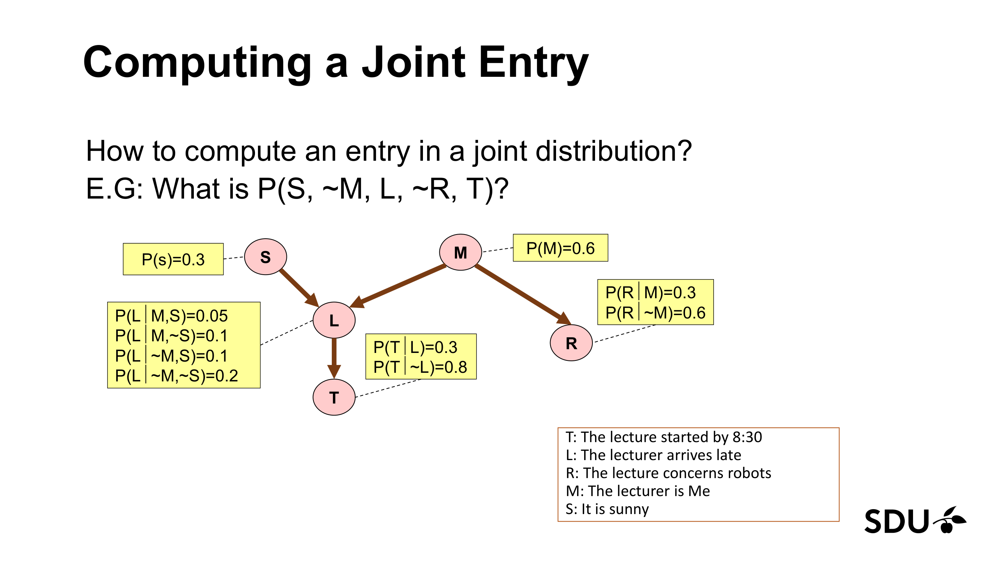
_Figure 9.26: Computing a joint entry on the lecture-late network — slide-55 setup. (Lecture 9, slide 55.)_

Stated and solved in §4.3 (slide 56 walks through the symbolic derivation, and the numerical answer is $0.00144$): $P(T \mid L)\,P(\neg R \mid \neg M)\,P(L \mid \neg M, S)\,P(\neg M)\,P(S) = 0.3 \cdot 0.4 \cdot 0.1 \cdot 0.4 \cdot 0.3 = 0.00144$.

### 5.8 Lecture-late network — query $P(R \mid T, \neg S)$ (slides 57–60)

Already sketched in §3.13 as the inference-by-enumeration template. Spell out the four joint entries that go into the *numerator* $P(R, T, \neg S)$, summing over the hidden $M$ and $L$:

$$P(R, T, \neg S) = \sum_{m \in \{T,F\}} \sum_{l \in \{T,F\}} P(M = m)\,P(\neg S)\,P(R \mid M = m)\,P(L = l \mid M = m, \neg S)\,P(T \mid L = l).$$

Plug in slide-53 numbers. With $P(S) = 0.3$, $P(\neg S) = 0.7$; $P(M) = 0.6$; $P(R \mid M) = 0.3$; $P(R \mid \neg M) = 0.6$; $P(L \mid M, \neg S) = 0.1$; $P(L \mid \neg M, \neg S) = 0.2$; $P(T \mid L) = 0.3$; $P(T \mid \neg L) = 0.8$:

| $m$ | $l$ | $P(M=m)$ | $P(R \mid m)$ | $P(L=l \mid m, \neg S)$ | $P(T \mid L=l)$ | product (× $P(\neg S) = 0.7$) |
|---|---|---|---|---|---|---|
| T | T | 0.6 | 0.3 | 0.1 | 0.3 | 0.6·0.3·0.1·0.3·0.7 = 0.00378 |
| T | F | 0.6 | 0.3 | 0.9 | 0.8 | 0.6·0.3·0.9·0.8·0.7 = 0.09072 |
| F | T | 0.4 | 0.6 | 0.2 | 0.3 | 0.4·0.6·0.2·0.3·0.7 = 0.01008 |
| F | F | 0.4 | 0.6 | 0.8 | 0.8 | 0.4·0.6·0.8·0.8·0.7 = 0.10752 |

Sum: $P(R, T, \neg S) \approx 0.00378 + 0.09072 + 0.01008 + 0.10752 = 0.21210$.

Repeat for the *denominator* contributor $P(\neg R, T, \neg S)$ — change $P(R \mid m)$ to $P(\neg R \mid m)$ (= $0.7$ and $0.4$ for $M = T$ and $M = F$ respectively):

| $m$ | $l$ | $P(M=m)$ | $P(\neg R \mid m)$ | $P(L=l \mid m, \neg S)$ | $P(T \mid L=l)$ | product (× $P(\neg S) = 0.7$) |
|---|---|---|---|---|---|---|
| T | T | 0.6 | 0.7 | 0.1 | 0.3 | 0.6·0.7·0.1·0.3·0.7 = 0.00882 |
| T | F | 0.6 | 0.7 | 0.9 | 0.8 | 0.6·0.7·0.9·0.8·0.7 = 0.21168 |
| F | T | 0.4 | 0.4 | 0.2 | 0.3 | 0.4·0.4·0.2·0.3·0.7 = 0.00672 |
| F | F | 0.4 | 0.4 | 0.8 | 0.8 | 0.4·0.4·0.8·0.8·0.7 = 0.07168 |

Sum: $P(\neg R, T, \neg S) \approx 0.00882 + 0.21168 + 0.00672 + 0.07168 = 0.29890$.

Normalise:

$$P(R \mid T, \neg S) = \frac{0.21210}{0.21210 + 0.29890} = \frac{0.21210}{0.51100} \approx 0.415.$$

So given that the lecture started on time and it's not sunny, the probability the lecture concerns robots is about $41.5\%$ — substantially higher than the marginal $P(R)$, because dry days correlate (via $M$ and $L$) with the lecturer-is-me, which correlates with the lecture being about robots.

The slide does *not* compute these numbers explicitly — slides 58–60 only sketch the structure as "Step 1 / Step 2 / Step 3 / 4 joint computes / 4 joint computes". The numerical solve above is provided here because it is exactly the kind of question the exam can pose. Make sure you can reproduce it.

[Lecture 9, slides 50–60.]

---

## 6. Common Pitfalls / Exam Traps

### 6.1 Mutually exclusive ≠ independent

If $A$ and $B$ cannot both happen ($A \cap B = \emptyset$), then $P(A \cap B) = 0$, which equals $P(A)\,P(B)$ **only** if one of them is the empty event. Otherwise mutually exclusive events are *anti*-correlated, not independent. Slide 25 makes this an explicit "yes/no" question; expect it on the exam.

### 6.2 Forgetting the denominator's total-probability expansion

In every Bayes-rule application $P(A \mid B) = P(B \mid A)\,P(A) / P(B)$, the denominator $P(B)$ usually has to be expanded as $P(B \mid A)\,P(A) + P(B \mid \neg A)\,P(\neg A)$. Forgetting that step (the Marie-wedding example, slide 24) leads to wildly wrong answers, often off by a factor of 5–10.

### 6.3 Base-rate fallacy

A symptom can be very likely *given* a disease ($P(\text{symptom} \mid \text{disease}) = 0.5$) while the disease is still very unlikely *given* the symptom ($P(\text{disease} \mid \text{symptom}) = 2 \times 10^{-4}$) because the prior $P(\text{disease})$ is tiny. The meningitis example (slide 21) is the textbook case.

### 6.4 Reading the wrong direction of a CPT

A CPT row $P(C = \text{true} \mid B = \text{true}) = 0.1$ does **not** say "if $C$ is true then $B$ is true with probability 0.1." It is causal/parent-to-child. Reversing the direction without Bayes' rule is the single most common BN error.

### 6.5 Cycle in the graph

A Bayesian network is a *directed acyclic graph*. Slide 35 emphasises *"No loops of any length are allowed"*. If you draw a cycle, the factorisation $P(\mathbf{X}) = \prod_i P(X_i \mid \text{Pa}(X_i))$ is not a probability distribution. A common student mistake: drawing $X \to Y$ and $Y \to X$ as a "mutual influence". You either need two separate (acyclic) sub-models or a fundamentally different formalism (Markov random field).

### 6.6 Conflating independence and conditional independence

$X \perp Y$ does not imply $X \perp Y \mid Z$, nor vice versa. The lecture's height/vocabulary example (slide 40) is the canonical illustration: height and vocabulary are *not* independent, but they *are* conditionally independent given age. Stating one when the question asks for the other is an easy point to lose.

### 6.7 Picking the wrong variable order when building a BN

A *bad* ordering (effects before causes) can force every later node to have many parents, blowing up the CPTs. The recipe on slide 49 says "minimal" parent set, but it does not say "no matter the order it stays small." Order causes first, effects later. This is implicit in the lecture-late example (slide 50 lists $T, L, R, M, S$ but the natural causal ordering used in the figure is $S, M, R, L, T$).

### 6.8 Forgetting that root nodes have priors, not CPTs

A root (parent-less) node carries a *prior* $P(X)$, written as a one-row table. Students sometimes leave it out and only fill in CPTs for nodes with parents — but then the BN's joint factorisation is undefined.

### 6.9 Misreading the "2^(k+1) entries" rule

Slide 38 says a Boolean variable with $k$ Boolean parents has $2^{k+1}$ probabilities — that is the count of *table cells*, not the count of *independent parameters*. Half of them are redundant by the row-sum-to-1 rule. For computing model size both numbers are sometimes asked; know which the question wants.

### 6.10 Naive-Bayes zero-frequency

In §3.11's worked example $P(\text{Married} \mid C = \text{Yes}) = 0$ killed the entire product. Real implementations apply Laplace smoothing ($+1$ to every count) so a single unseen feature value never zeros out a class. The slide does not smooth; if you see this on an exam, point out that smoothing would be applied in practice but solve the problem with the given numbers.

### 6.11 "Conditioning always creates independence" — wrong for colliders

Chains and forks (§3.9.1) get *blocked* by conditioning on the middle node — that's what creates conditional independence. But **colliders work the opposite way**: $X$ and $Y$ are independent marginally, then become dependent once you condition on the collider $Z$ (or any of its descendants). This is *explaining away*. The alarm network in §5.6 gives the canonical numerical demonstration: $P(+b \mid +a) \approx 0.37$ versus $P(+b \mid +a, +e) \approx 0.003$.

A panicking student writes "conditioning makes things independent" as a general rule. That rule is half right and half catastrophically wrong. Memorise the trichotomy in §3.9.1.

### 6.12 Forgetting to normalise after the joint sum

Step 3 of inference by enumeration (§3.13) is the **normalisation step** — dividing the per-value joint sums by their total so the conditional distribution sums to 1. Students often compute the numerator $\sum_y P(X = x, e, y)$, declare "$P(X = x \mid e)$ done", and miss that the answer must be divided through. The slide-58 "Step 1 / Step 2 / Step 3" framing exists precisely to keep this step visible. If your final answer doesn't sum to 1 across values of $X$, you forgot to normalise.

[Lecture 9, slides 25, 35, 38, 40, 49, 58.]

---

## 7. Connections to Other Lectures

Bayesian networks pull together threads from earlier lectures and feed two later ones.

### Inputs to L09a

- **L02 — Agents.** The "rational agent" of L02 §3 had to deal with uncertainty in the real world; this lecture's opening (slides 2–3) is the explicit probabilistic version of that motivation. Expected utility (the L09a slide-3 formula) is the probabilistic generalisation of L02's performance measure.
- **L07 — CSP.** Random variables on slide 5 are explicitly described as "*just like variables in CSP's*" — a fixed name, a fixed mutually-exclusive-exhaustive domain. The differences are (i) values come with probabilities, and (ii) you can ask conditional queries.

### Outputs from L09a

- **L09b — HMMs.** A hidden Markov model is a Bayesian network with a particular structure: a chain of hidden state variables $q_1 \to q_2 \to \dots \to q_T$ with each $q_t$ having an observation child $o_t$. Every concept in this lecture transfers — but L09b adds an additional structural assumption (the **Markov assumption** that $q_t$ depends only on $q_{t-1}$, slide 10 of L09b) which is just the parents-only restriction of §3.9 specialised to a chain. See L09b §3 for the corresponding chain rule + Markov derivation.
- **L10 — Intro to ML.** L10 slide 20 lists Naive Bayes and Bayesian Belief Networks as classification methods alongside decision trees, random forests, etc. Treat L09a §3.11 as the *derivation* and L10 §3 as the *cross-method comparison*. Conditional independence reappears in L10 implicitly — when the Naive-Bayes section mentions "attribute independence given the class", it is the conditional-independence assumption defined here in §3.6.

### Glossary terms reused

Per the cross-reference table (`_shared/cross-references.md`):

| Concept | Reused in |
|---|---|
| Bayes' rule | L09b (noisy-channel decoding), L10 (Naive Bayes) |
| Bayesian network | L10 (listed among classifiers) |
| Chain rule | L09b (forward-algorithm derivation) |
| Conditional independence | L09b (Markov assumption), L10 (Naive Bayes attribute independence) |
| Conditional probability | L09b (transition / emission), L10 |
| Evidence | L09b (HMM observations) |
| Naive Bayes | L10 (cross-method comparison) |
| Prior / Posterior | L09b (filtering, decoding) |
| Random variable | L09b (state and observation RVs), L10 |
| Uncertainty | L09b, L10 |
| Markov condition | (introduced here) — generalised as Markov assumption in L09b §3 |

### Forward-reference for Lab 7

This chapter is the conceptual foundation for **Lab 7 — Bayesian Networks** (`AI/Lab7/handout/`). Lab 7 asks you to implement a small `BayesianNetwork` class plus its enumeration-based inference engine. Specifically, expect to:

- Construct random `Variable` objects with a fixed Boolean (or finite-domain) value space — §3.1 here.
- Build a `BayesianNetwork` by registering variables with parents and CPTs — §3.7, §3.8.
- Compute joint probabilities via the §4.2 algorithm.
- Implement inference by enumeration as in §4.4, including the normalisation step in §3.13.

When solving Lab 7, the **mental model is the gossip-graph analogy** of §2: each variable asks its parents for their values, looks up the matching CPT row, and reports back. The mathematics is exactly the chain-rule-plus-Markov-condition factorisation of §3.10. See `study/_exam/Lab7-BN/variants.md` for the variant bank that probes your understanding.

[Lecture 9 → Lab 7, slides 35–62.]

---

## 8. Cheat-Sheet Summary

One-page recap. Each bullet ends with a one-line analogy reminder when the concept has one. Anchoring example: the **flight-to-the-airport scenario** of §1 — every action has a probability of success and a utility; the rational agent picks the action that maximises expected utility, and Bayesian probability is how it represents the "probability of success" part.

### Foundations
- **Random variable** $X$ — function from outcomes to numbers; takes values in a mutually-exclusive, exhaustive domain. *Like a CSP variable, but with probabilities.*
- **Atomic event** — a *full* assignment to *all* variables; the cells of the joint distribution. *One row of the master spreadsheet.*
- **Joint distribution** $P(X_1, \dots, X_n)$ — a number for every atomic event, summing to 1. $2^n$ entries for $n$ Boolean variables.
- **Marginal** $P(X = x) = \sum_y P(X = x, Y = y)$. *Sum the rows that match.*
- **Conditional probability** $P(A \mid B) = P(A \cap B) / P(B)$. *Restrict the world to where $B$ holds, then ask about $A$.*

### Bayes' rule & friends
- **Product rule.** $P(A, B) = P(A \mid B)\,P(B) = P(B \mid A)\,P(A)$.
- **Chain rule.** $P(A_1, \dots, A_n) = \prod_i P(A_i \mid A_1, \dots, A_{i-1})$.
- **Bayes' rule.** $P(A \mid B) = \dfrac{P(B \mid A)\,P(A)}{P(B)}$. *Turn the causal probability into the diagnostic answer.*
- **Total probability for the denominator.** $P(B) = P(B \mid A)\,P(A) + P(B \mid \neg A)\,P(\neg A)$.
- **Normalisation trick.** Whole conditional $P(X \mid y)$ = pick rows where $Y = y$, divide by the sum.
- **Prior / Posterior / Evidence.** Prior $= P(X)$ before evidence; posterior $= P(X \mid e)$ after evidence $e$.

### Independence
- **Independence:** $P(A, B) = P(A)\,P(B) \iff P(A \mid B) = P(A)$. *Useless to ask one once you know the other.*
- **Mutually exclusive ≠ independent.** Mutually exclusive ⇒ $P(A,B)=0 \neq P(A)P(B)$ in general.
- **Conditional independence:** $X \perp Y \mid Z \iff P(X, Y \mid Z) = P(X \mid Z)\,P(Y \mid Z)$. *Once you know the rain, the cloud is irrelevant to the umbrella.*

### Bayesian network
- **Two parts:** (i) DAG of random variables, (ii) one CPT $P(X_i \mid \text{Parents}(X_i))$ per node. *A gossip graph: each node hears only its parents.*
- **No cycles.** Ever.
- **CPT size:** Boolean node with $k$ Boolean parents has $2^{k+1}$ table cells, $2^k$ independent numbers.
- **Markov condition:** node $X$ is conditionally independent of every non-descendant given its parents. *Parents block the gossip from further upstream.*
- **Three connection patterns:** chain ($X \to Z \to Y$) and fork ($X \leftarrow Z \to Y$) — conditioning on $Z$ creates independence. Collider / V-structure ($X \to Z \leftarrow Y$) — conditioning on $Z$ creates *dependence* (**explaining away**).
- **BN factorisation (joint from chain rule + Markov):**
  $$P(X_1, \dots, X_n) = \prod_{i=1}^{n} P(X_i \mid \text{Parents}(X_i)).$$
- **Parameter savings:** $O(n \cdot d^k)$ for max in-degree $k$ and domain size $d$, vs. $O(d^n)$ for the unrestricted joint. The lecture's **trade-off spectrum** (§4.6): Strict independence → Naive Bayes → Sparse BN → Full joint, increasing in expressiveness and in parameter count.
- **Where the BN comes from:** expert design or learning from data (slide 65).

### Building a BN (slide 49)
1. Order variables — causes first, effects later.
2. For each $X_i$ in order: add it; choose minimal parents from already-added nodes such that $X_i$ is conditionally independent of the rest given those parents; fill in the CPT.

### Computing a joint entry
- Multiply CPT entries — one per node, looking up the row by the parent values in the assignment.

### Inference by enumeration
- $P(X \mid e) \propto \sum_y P(X, e, y)$ — sum over hidden $y$, normalise.
- **Cost:** exponential in the number of hidden variables; **NP-complete** in general. Approximate inference is the practical answer for large nets.

### Naive Bayes
- Smallest non-trivial BN: a class root $C$, $n$ feature leaves $A_1, \dots, A_n$, conditional independence among the $A_i$ given $C$.
- **Classify:** $\hat{c} = \arg\max_c P(c) \prod_i P(A_i \mid c)$.
- **Watch out for** zero-frequency (use Laplace smoothing in practice).

### Common traps
- Mutually exclusive ≠ independent.
- Forgetting to expand the Bayes-rule denominator.
- Base-rate fallacy (Marie's wedding: forecast says rain, actual posterior $\approx 11\%$).
- Reading a CPT in the wrong direction.
- Drawing a cycle.
- Confusing $X \perp Y$ with $X \perp Y \mid Z$.
- Bad variable ordering bloating the CPTs.
- Forgetting root-node priors.
- "Conditioning always creates independence" — wrong for colliders. Conditioning on a collider creates *dependence* (explaining away).
- Forgetting to normalise after the numerator-sum in inference by enumeration.

---

_Source: Lecture 9 (Bayesian Networks) slides 1–66, by Serkan Ayvaz. Real-world BN illustration: see Figure 9.27 below (slide 63)._

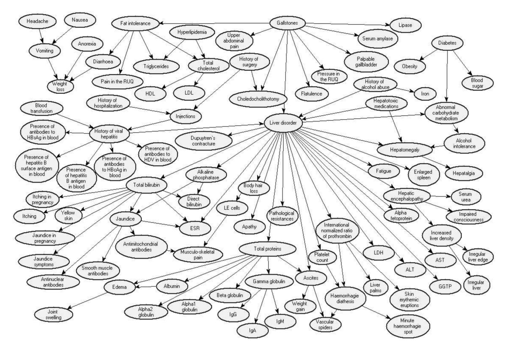
_Figure 9.27: "Bayes Nets for Real-world problems can be large" — motivates the move from exact to approximate inference. (Lecture 9, slide 63.)_
