# Lecture 9 (b): Hidden Markov Models

> **Reading time:** ~55 min  |  **Prereqs:** [L02 — Agents §3 partial observability](L02-Agents.md), [L09a — Bayesian Networks §3 conditional independence and Markov condition](L09a-Bayesian-Networks.md).
>
> **Glossary terms introduced:** Markov chain, Markov assumption (first-order), Hidden Markov Model (HMM), hidden state, observation, transition model (HMM), emission model (observation model), initial distribution, filtering, forward algorithm, Viterbi algorithm.
>
> **Naming note:** the slides use the names **Evaluation / Decoding / Learning** for the "three basic problems" of HMMs. Textbooks (and most exams) call the same three problems **filtering / smoothing-or-decoding / learning**. We use both names side-by-side so you are not lost on either wording — see §3.5.

---

## 1. Overview & Motivation

A **Hidden Markov Model (HMM)** is the workhorse model for any situation where:

1. The world steps through a discrete sequence of **states** that change over time,
2. The agent **cannot observe the state directly** — it only sees an **observation** (a noisy signal) emitted from the state,
3. And we want to reason backwards from the observation sequence to the hidden state sequence.

Two slogans from the slides capture this:

> "Evidence can be observed, but the state is hidden." [Lecture 9b, slide 2]
>
> "Observers can see the emitted symbols of an HMM but have no ability to know which state the HMM is currently in." [Lecture 9b, slide 22]

Examples from the lecture:

- **Speech recognition** — the acoustic waveform you observe is the noisy output of an underlying sentence; the *words* (states) are hidden. The slides motivate HMMs through the Noisy Channel Model:

  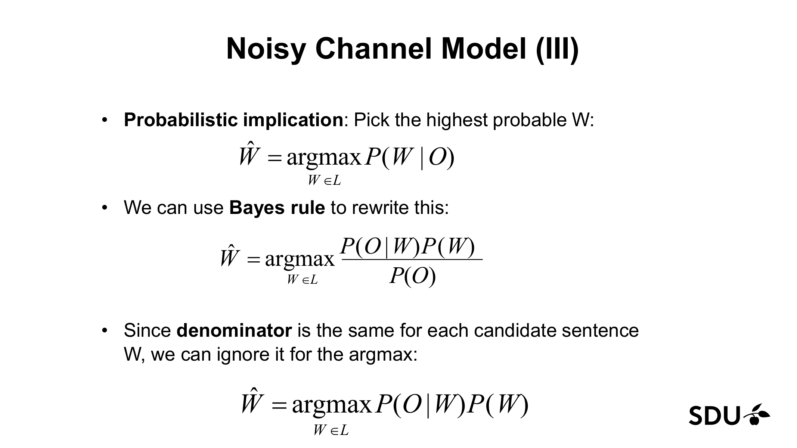

  _Figure 1.1: the Noisy Channel Model. We want the most likely sentence $W$ given the acoustic input $O$. By Bayes' rule, $\hat{W} = \arg\max_{W \in L} P(O \mid W) P(W)$. The denominator $P(O)$ is constant across candidates, so we ignore it. The HMM is exactly this generative story made concrete. (Lecture 9b, slide 5.)_

- **Part-of-speech tagging** — the words you see are observations; the part-of-speech tags (noun, verb, adjective, …) are the hidden states. [Lecture 9b, slide 16]

- **Named entity recognition** — same structure: words are observed, entity-type tags (PERSON, ORG, LOC) are hidden. [Lecture 9b, slide 16]

- **Genomics / coding-region detection** — observe a DNA base sequence; infer which region of the genome (intron, exon, regulatory) you are in.

- **The "Fair Bet Casino" toy example** — observe a stream of coin flips; the casino secretly switches between a Fair coin and a Biased coin. The hidden state is "which coin is in play". [Lecture 9b, slides 19–25]

- **The "ice cream" toy example** — observe how many ice creams Jason ate each day; infer whether each day was HOT or COLD. [Lecture 9b, slides 26–28]

**Where HMMs sit in the course.** The previous lecture (L09a) introduced Bayesian networks — a static, structured way to handle uncertainty. An HMM is a *particular* Bayesian network: one that has been unrolled across time, with a special chain structure. It is also the natural probabilistic upgrade of the **model-based reflex agent** from L02: instead of a deterministic internal state estimate, the agent maintains a probability distribution over hidden states.

Why two HMM-specific algorithms appear later (forward, Viterbi) instead of generic Bayes-net inference: the chain structure is so regular that we can do exact inference in $O(N^2 T)$ time rather than the exponential cost of generic inference by enumeration ([see L09a §3.13](L09a-Bayesian-Networks.md#313-inference-by-enumeration-exact-inference)).

[Lecture 9b, slides 1–5, 16.]

---

## 2. The Big Picture — Analogies

Before any formalism, install these analogies. The whole lecture is easier with them.

### 2.1 HMM as "watching the umbrella to guess the weather inside"

**Imagine your neighbour's house has no windows.** You can never see the weather inside. But every morning your neighbour walks out carrying or not carrying an umbrella. Over weeks of mornings you build up two intuitions:

1. Weather *persists*: a rainy day is more likely to be followed by another rainy day than by a sunny one (the **transition model** — how the hidden weather changes day to day).
2. Behaviour *betrays* the weather: on a rainy day your neighbour usually grabs the umbrella, but not always; on a sunny day usually not, but occasionally yes (the **emission / observation model** — how visible behaviour depends on the hidden state).

If you watch the umbrella for a week and want to guess "what was the weather sequence?", you are running **Viterbi**. If you only want to know "what's the probability the weather is rainy *today*, given what I have seen so far?", you are running **filtering** (and computing it via the **forward algorithm**).

**Where this analogy breaks down:** real weather has a continuous state (temperature, humidity), not a discrete one; real human behaviour is influenced by far more than the current weather. The HMM compresses the world into a finite set of discrete hidden states and assumes today's behaviour depends *only* on today's state (the **output-independence assumption** — §3.3). It also assumes tomorrow's weather depends only on today's, not on the trend over the last few days (the **first-order Markov assumption** — §3.2).

### 2.2 Markov chain as "a board game where your next square depends only on your current square"

A **Markov chain** is what you'd get if you played a board game where the only thing that determines your next move is what square you are *currently* on — not how you got there, not what you rolled last turn, not your strategy. Snakes & Ladders, played by a dice-only-no-choice rule, is a Markov chain. Each square is a state; the dice + board geometry is the transition matrix $A$.

**Where it breaks down:** in real-world systems, the past usually leaks information about the future beyond what is encoded in the present state. We *assume* it doesn't (the Markov assumption). Whether that approximation is acceptable depends on the application.

### 2.3 The forward algorithm as "totalling all the ways the story could have unfolded"

Suppose you see a 10-message text exchange between two people and you ask: "given the messages, how likely is it that the whole conversation happened?" Conceptually you would enumerate every possible mood sequence (frustrated, calm, frustrated, …) consistent with the messages and *total up* the probability of each. With 2 moods and 10 turns that's $2^{10} = 1024$ paths — feasible. With 50 turns it's $\approx 10^{15}$ — impossible.

The **forward algorithm** is the clever bookkeeping trick: instead of enumerating each full path, at each time step you keep a small running total per current state — "the total probability of all the ways the story could have unfolded that reach *this* mood at *this* turn, given what we have seen so far". Those running totals — one per state per time step — fold all the exponentially-many paths into an $N \times T$ table.

**Where this analogy breaks down:** two things lurk underneath the "total all the ways" framing.

1. The algorithm gives you a *sum* — the total likelihood. It does NOT tell you which individual path is most likely. For that, you need Viterbi.
2. The cell value $\alpha_t(j)$ is a **joint**, not a posterior — it equals $P(o_1, \ldots, o_t, q_t = j \mid \lambda)$. To get $P(q_t = j \mid o_1, \ldots, o_t)$ (the filtered posterior) you must normalise by $\sum_i \alpha_t(i)$. See §2.8 and §6 pitfall 1.

### 2.4 Viterbi as "GPS with breadcrumbs — best route reconstructed from where I am now"

You drive cross-country. At every city you arrive at, you remember "which previous city did I come from on the *cheapest* route to here?" (a back-pointer). At the end of the trip, no matter which city you finish in, you can walk backwards through the breadcrumbs to reconstruct the entire cheapest route.

**Viterbi** is exactly that, but instead of "cheapest route through cities" you reconstruct "most likely sequence of hidden states given the observations". At each (time, state) cell you store (a) the probability of the best path that ends here, and (b) which previous state that best path came from. At the end you find the highest-probability final cell and follow back-pointers to recover the entire most-likely state sequence.

**Where the GPS analogy breaks down:** GPS is finding a minimum-cost path through a *graph* of cities; Viterbi is finding a maximum-probability path through a *trellis* — a grid where the rows are states and the columns are time steps. Every column has all $N$ states; every cell is reachable from every cell in the previous column. The graph is denser than a road map, and probabilities multiply (so we work in log-space if numbers get small).

### 2.5 Forward vs Viterbi as "sum vs max"

The forward and Viterbi recursions look almost identical — same trellis, same transition and emission weights, same dynamic-programming structure. They differ in **one** operator: forward uses $\sum$, Viterbi uses $\max$.

- Forward asks: "totalling over all possible state sequences, how likely is the observation sequence?" (Sum.)
- Viterbi asks: "what is the single most likely state sequence, and how likely is it?" (Max.)

This is the cleanest one-line summary of the lecture's two algorithms.

**Where this analogy breaks down:** the operator-swap framing makes Viterbi sound like "forward with `max` instead of `sum`" — it is, *almost*. But three things lurk underneath:

1. Viterbi needs an extra piece of bookkeeping — **back-pointers** — to reconstruct the path. The `max` alone gives you the *score* of the best path, not the *sequence*; see §6 pitfall 8.
2. The numerical values differ in magnitude: $\sum$ over $k$ terms is always $\ge \max$ over the same $k$ terms, often by a large factor. The §5.5 ratio (Viterbi best path $\approx 48\%$ of the forward total) is this magnitude gap made concrete.
3. Long sequences underflow in both algorithms because probabilities multiply many times. In practice we work in log-space; see §6 pitfall 11. Also: Viterbi's $\arg\max$ can be non-unique (ties between paths), in which case the algorithm picks one arbitrarily — `sum` has no such ambiguity.

### 2.6 The first-order Markov assumption as "only checking the latest weather report"

A weather forecaster who follows the **first-order Markov assumption** to the letter looks at *today's* weather and answers "what is tomorrow?" without ever consulting the rest of the week. Ten straight days of rain? Doesn't matter — only the most recent day enters the prediction. The assumption is the *act of forgetting* the deeper history beyond the immediate previous step.

This is the modelling sleight-of-hand that makes everything tractable: it converts a problem with $O(N^T)$-many possible histories into one where every step only conditions on the previous step.

**Where this analogy breaks down:** real weather *does* have memory — a ten-day rain streak meaningfully shifts the next-day prediction relative to a single wet day, but a first-order Markov model cannot tell those two situations apart. A *second-order* Markov model would condition on the last two days, a $k$th-order model on the last $k$, but the parameter count and the table size both blow up exponentially in $k$. First-order is the standard compromise; the chapter assumes it everywhere.

### 2.7 The initial distribution as "the climatological prior on the day you arrived"

If you fly into Reykjavik on July 1st and you have no observations yet, your best guess for today's weather is the *climatological prior* for Reykjavik in July (often rainy, sometimes sunny). That long-run "what's typical on day one?" vector is $\pi$. Every HMM needs one to kick off the recursion — at $t = 1$ there is no $q_0$ to transition from, so $\pi$ has to do the work that $A$ would do at every later step.

**Where this analogy breaks down:** climatological priors aggregate decades of data. Many HMM applications have no such luxury — the prior is often guessed (uniform $\pi = 1/N$ for every state) or learned from data via Baum–Welch (§4.5). In the Fair Bet Casino chapter §5.2 we use $\pi_F = \pi_B = \tfrac{1}{2}$ by default; in the ice-cream HMM the slides hand us $\pi_C = 0.2, \pi_H = 0.8$ as a fact. Whichever you use, $\pi$ multiplies in *exactly once*, at $t = 1$ (§6 pitfall 5).

### 2.8 Filtering as "is it raining right now?" versus "how likely was the whole week?"

Watch the umbrella every morning for a week. Two distinct questions you might ask:

- **"What is the probability today's weather is rainy, given everything I've seen so far?"** — this is **filtering** in the strict textbook sense. It is a posterior over the *current* hidden state, $P(q_t \mid o_1, \ldots, o_t)$.
- **"How likely was the whole sequence of umbrella choices I saw?"** — this is the **observation-sequence likelihood** $P(O \mid \lambda)$, what the slides call Problem 1 — Evaluation, and what the slides also (loosely) call "filtering".

Both are computed from the same $\alpha_t(j)$ table. The likelihood is the column-sum at the final time step: $P(O \mid \lambda) = \sum_i \alpha_T(i)$. The filtered posterior is the normalised column at any time $t$: $P(q_t = j \mid o_1 \ldots o_t) = \alpha_t(j) / \sum_i \alpha_t(i)$. One algorithm, two outputs, depending on what you do at the end.

**Where this analogy breaks down:** this is a terminology trap, not an algorithmic one — see the §3.5 naming-note for the full slide-vs-textbook reconciliation. Also note: "smoothing" $P(q_t \mid o_1 \ldots o_T)$ uses *all* observations including the future, which needs a backward pass the lecture does not cover (§4.6); "prediction" $P(q_{t+k} \mid o_1 \ldots o_t)$ projects forward beyond the last observation. The umbrella analogy disambiguates all four cleanly: filtering = right now, smoothing = in hindsight after the week is over, prediction = tomorrow given this week, decoding (Viterbi) = the most likely whole-week weather sequence.

---

## 3. Core Concepts

### 3.1 The HMM picture

Every HMM has three ingredients, all named on slide 2:

1. **Priors** — initial state probabilities, written $\pi$.
2. **Transition model** — how states change from one time step to the next, written as matrix $A$.
3. **Observation / emission model** — how the observable signal depends on the current state, written as matrix $B$.

Plus an explicit **stationarity assumption**: the transition and observation models do not change with time. Whatever rules govern transitions at $t = 1$ govern them at $t = 100$ identically.

> "Changes are assumed to be caused by a stationary process. The transition and observation models do not change." [Lecture 9b, slide 2]

Recall the **umbrella analogy** from §2.1: $\pi$ tells you what the weather is likely to be on the morning you start observing; $A$ tells you weather-to-weather day-to-day rules; $B$ tells you weather-to-umbrella behaviour rules.

### 3.2 Markov chains — the observable foundation

Before HMMs, the slides build up **Markov chains** (also called *first-order observable Markov models*). In a Markov chain there is no hiding: the state and the observation are the same thing.

**Formal definition** [Lecture 9b, slide 9]:

- A set of states $Q = q_1, q_2, \ldots, q_N$. The state at time $t$ is written $q_t$.
- A **transition probability matrix** $A$. Each entry $a_{ij}$ is the probability of moving from state $i$ to state $j$:
  $$a_{ij} = P(q_t = j \mid q_{t-1} = i), \qquad 1 \le i, j \le N$$
- Each row sums to 1 (you have to go *somewhere* next):
  $$\sum_{j=1}^{N} a_{ij} = 1 \qquad \text{for every } i.$$
- Plus a **start state** $q_0$ and an **end state** $q_F$ (the slides use $\text{Start}_0$ and $\text{End}_4$ in the weather diagram).

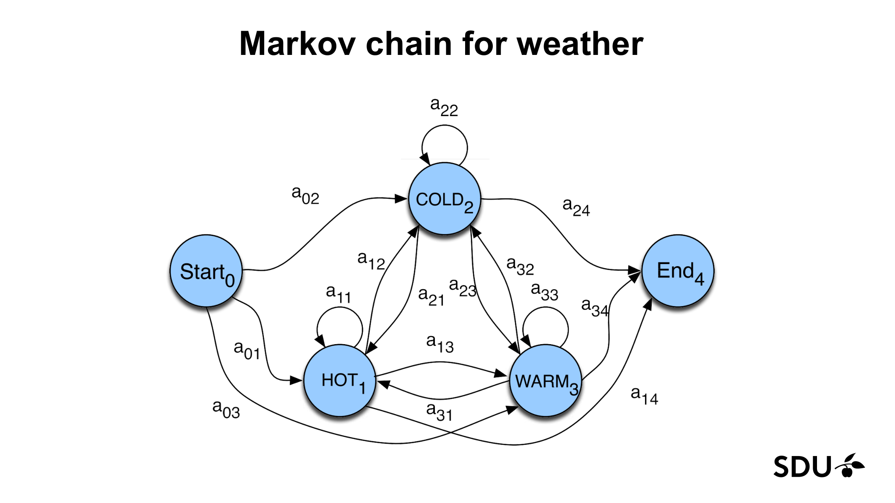
_Figure 3.1: a Markov chain over weather states HOT, COLD, WARM, with explicit Start and End. Every arrow $i \to j$ carries probability $a_{ij}$. Self-loops $a_{11}, a_{22}, a_{33}$ are the probabilities of staying in the same state. (Lecture 9b, slide 7.)_

**The Markov assumption** [Lecture 9b, slide 10] — this is the structural assumption that makes everything tractable:

$$P(q_i \mid q_1, q_2, \ldots, q_{i-1}) = P(q_i \mid q_{i-1}).$$

In English: *given the immediately previous state, the deeper past is irrelevant*. Recall the **board-game analogy** from §2.2 (the structure) and the **latest-weather-report analogy** from §2.6 (the act of forgetting).

**Initial distribution** [Lecture 9b, slide 11]. Instead of a hard-coded start state, we usually use a vector

$$\pi_i = P(q_1 = i), \qquad 1 \le i \le N, \qquad \sum_{j=1}^{N} \pi_j = 1.$$

Recall the **climatological-prior analogy** from §2.7 — $\pi$ is the "what's typical on day one" vector. The start state $q_0$ representation from the slide (with its $a_{0j}$ transitions) and the $\pi$-vector representation are *equivalent*: $a_{0j} \equiv \pi_j$.

For the weather example the lecture uses $\pi = [0.5, 0.3, 0.2]$ for $(\text{HOT}, \text{COLD}, \text{WARM})$:

![Weather Markov chain with specific numbers and π = [.5, .3, .2].](../extracted_figures/L09b/page13-render.png)
_Figure 3.2: the running weather example. Self-loops are .5 (HOT), .5 (COLD), .6 (WARM); cross-transitions are .2 (HOT→COLD), .3 (HOT→WARM), .2 (COLD→HOT), .3 (COLD→WARM), .1 (WARM→COLD), .3 (WARM→HOT). Initial distribution π = [.5, .3, .2]. (Lecture 9b, slide 13.)_

A Markov chain is a **weighted finite-state automaton (WFSA)** — every arc carries a probability and the probabilities leaving any state sum to 1. [Lecture 9b, slide 6.]

> **Glossary cross-link:** the *Markov assumption* here is the temporal analogue of the **Markov condition** in Bayes nets ([see L09a §3.9](L09a-Bayesian-Networks.md#39-the-markov-condition-aka-d-separation-informal-version)). Both say "given parents (or the immediately previous state), the rest of the past is irrelevant."

### 3.3 Hidden states and observations — the HMM upgrade

In a Markov chain the **output symbols = the states** [Lecture 9b, slide 16]: if today's state is HOT we observe HOT. But in most real problems the interesting states are not directly observable:

- We observe **words**; the hidden state is the **part-of-speech tag**.
- We observe **acoustic features**; the hidden state is the **phoneme** or **word**.
- We observe **ice cream count**; the hidden state is the **weather**.

So we extend Markov chains by separating the state from what gets emitted.

**Formal HMM definition** [Lecture 9b, slide 17 — definition table reproduced verbatim]:

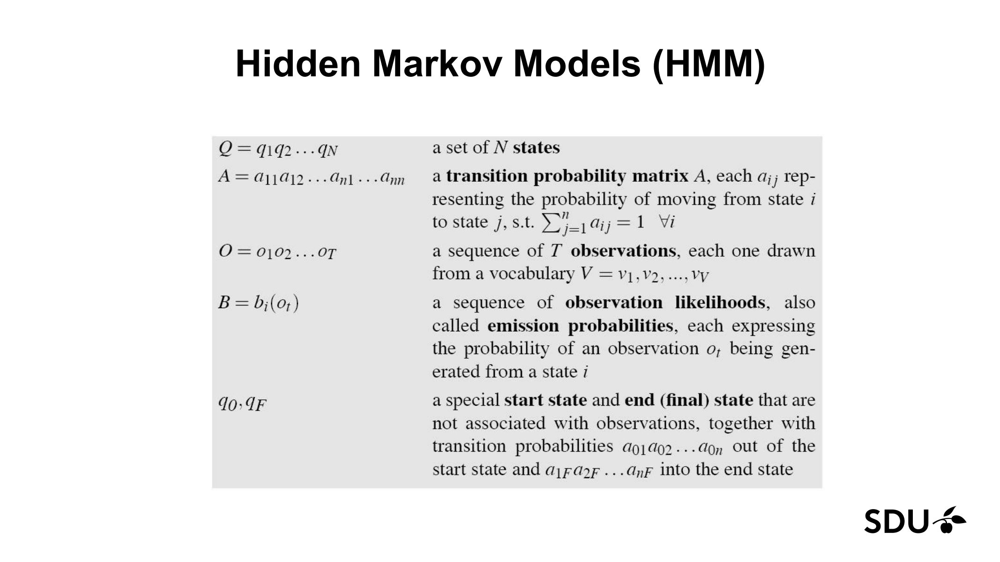
_Figure 3.3: the canonical HMM parameter table from the lecture. (Lecture 9b, slide 17.)_

- $Q = q_1 q_2 \ldots q_N$ — a set of **$N$ states**.
- $A = a_{11} a_{12} \ldots a_{n1} \ldots a_{nn}$ — a **transition probability matrix**, with $a_{ij}$ the probability of moving from state $i$ to state $j$. Each row sums to 1: $\sum_{j=1}^{n} a_{ij} = 1$ for all $i$.
- $O = o_1 o_2 \ldots o_T$ — a sequence of **$T$ observations**, each drawn from a vocabulary $V = v_1, v_2, \ldots, v_V$.
- $B = b_j(o_t)$ — a sequence of **observation likelihoods**, also called **emission probabilities**, each expressing the probability of an observation $o_t$ being generated from a state $j$. $b_j(o) = P(o \mid q = j)$.
- $q_0, q_F$ — special **start and end (final) states**, not associated with observations, with transition probabilities $a_{01} a_{02} \ldots a_{0n}$ out of the start state and $a_{1F} a_{2F} \ldots a_{nF}$ into the end state.

The compact way to write an HMM is $\lambda = (A, B, \pi)$ — model parameters in a single tuple.

*Recall §2.1: $\pi$ is the weather report on the day you start watching; $A$ is the day-to-day weather rule; $B$ is the umbrella-given-weather rule. The tuple $\lambda = (A, B, \pi)$ is the umbrella-and-weather story in three pieces.*

> **Notation caveat — $\lambda$ vs $\Phi$, $(A, B, \pi)$ vs $(A, B)$.** Slide 29 writes the parameters as $\Phi = (A, B)$, folding $\pi$ in implicitly with the start state $q_0$ (and the $a_{0j}$ transitions are *another* way of writing $\pi_j$ — the two notations are equivalent for the math but the $\pi$-vector form is the textbook standard). The chapter keeps $\pi$ explicit and uses $\lambda$ throughout. Treat $\lambda$, $\Phi$, $(A, B, \pi)$, and $(A, B)$ as the same model for exam purposes.

**Why "hidden"?** Slide 22 spells it out:

> $\Sigma$: set of emission characters (e.g. $\{H, T\}$ for coin tossing).
>
> $Q$: set of hidden states, each emitting symbols from $\Sigma$ (e.g. $\{F, B\}$ for coin tossing).
>
> Observers can see the emitted symbols of an HMM but have no ability to know which state the HMM is currently in.
>
> Each state has its own probability distribution, and the machine switches between states according to this probability distribution.
>
> Thus, the goal is to infer the most likely hidden states of an HMM based on the given sequence of emitted symbols.

[Lecture 9b, slide 22.]

**The two assumptions, side by side** [Lecture 9b, slide 18]:

1. **Markov assumption** — already met: $P(q_i \mid q_1 \ldots q_{i-1}) = P(q_i \mid q_{i-1})$. *Recall §2.2 / §2.6: the board-game rule applied to hidden states — only the previous square enters the prediction.*
2. **Output-independence assumption** — new. The observation at time $i$ depends only on the state at time $i$, not on previous states or observations:
   $$P(o_i \mid q_1 \ldots q_T, o_1 \ldots o_T) = P(o_i \mid q_i).$$
   *Recall §2.1: the umbrella analogy — today's umbrella choice betrays today's weather and nothing else; it is not influenced by yesterday's weather directly.*

Together they let us factor the joint probability of any state-observation sequence (we use this immediately in §4.1).

**Running example — the ice-cream HMM** [Lecture 9b, slide 28]:

![Ice cream HMM diagram: start → HOT (.8) or COLD (.2); HOT↔COLD with transitions .7/.3/.4/.6; emissions B_1 for HOT = [.2, .4, .4], B_2 for COLD = [.5, .4, .1].](../extracted_figures/L09b/page28-render.png)
_Figure 3.4: the ice-cream HMM. Two hidden states (HOT, COLD), three observations (1, 2, 3 ice-creams). Transitions: from start, P(HOT)=.8 and P(COLD)=.2; staying HOT=.7; HOT→COLD=.3; COLD→HOT=.4; staying COLD=.6. Emissions: from HOT, P(1)=.2, P(2)=.4, P(3)=.4; from COLD, P(1)=.5, P(2)=.4, P(3)=.1. This is the example used throughout §4 and §5. (Lecture 9b, slide 28.)_

### 3.4 The Fair Bet Casino — concrete HMM walkthrough

The lecture also runs through the **Fair Bet Casino** problem as an HMM. The dealer secretly switches between a Fair coin ($P(H) = P(T) = \tfrac{1}{2}$) and a Biased coin ($P(H) = \tfrac{3}{4}$, $P(T) = \tfrac{1}{4}$). The switch happens with probability 0.1 per flip.

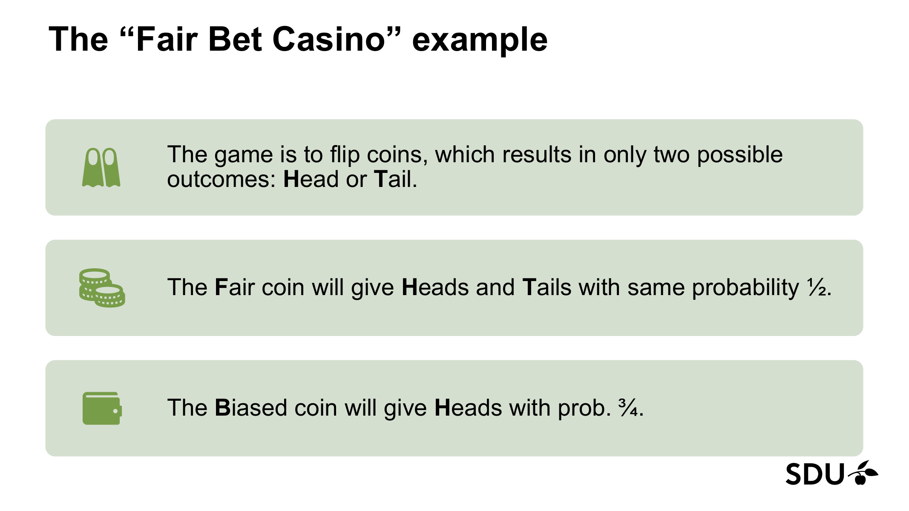
_Figure 3.5: the Fair Bet Casino setup. The hidden state is which coin is in play (F or B); the observation is the visible flip outcome. (Lecture 9b, slide 19.)_

As an HMM [Lecture 9b, slides 23–24]:

- $\Sigma = \{0, 1\}$ (0 = Tails, 1 = Heads).
- $Q = \{F, B\}$.
- Transitions:
  $$A = \begin{pmatrix} a_{FF} & a_{FB} \\ a_{BF} & a_{BB} \end{pmatrix} = \begin{pmatrix} 0.9 & 0.1 \\ 0.1 & 0.9 \end{pmatrix}.$$
- Emissions:
  $$B: \quad b_F(0) = \tfrac{1}{2}, \quad b_F(1) = \tfrac{1}{2}, \quad b_B(0) = \tfrac{1}{4}, \quad b_B(1) = \tfrac{3}{4}.$$

The same HMM drawn as a finite-state automaton:

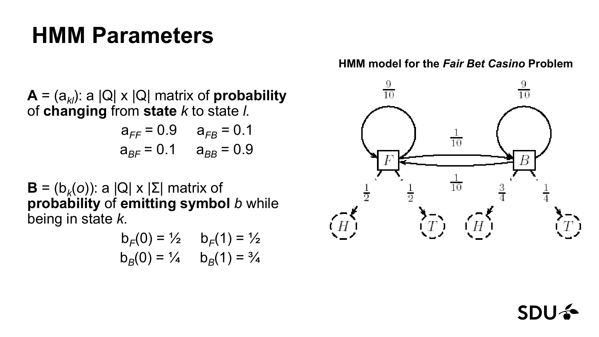
_Figure 3.6: the Fair Bet Casino HMM as a finite-state automaton. The two hidden states (F = Fair, B = Biased) sit in the middle; each has a self-loop ($a_{FF} = a_{BB} = 9/10$) and a cross-edge ($a_{FB} = a_{BF} = 1/10$). Each state emits H or T according to its bias: $b_F(H) = b_F(T) = \tfrac{1}{2}$, $b_B(H) = \tfrac{3}{4}$, $b_B(T) = \tfrac{1}{4}$. Same picture-shape as the ice-cream HMM in Figure 3.4. (Lecture 9b, slide 23.)_

### 3.5 The three basic problems of HMMs

*Recall §2.8: the umbrella story disambiguates the slide-vs-textbook usage of "filtering" — "is it raining right now?" (textbook filtering) versus "how likely was the whole week of umbrella observations?" (slide-Evaluation). The naming note below covers the full four-way taxonomy with prediction and smoothing.*

The lecture frames every HMM application as one of three problems [Lecture 9b, slide 29 — reproduced verbatim]:

| Slide name | Standard / textbook name(s) | What it computes |
|---|---|---|
| **Problem 1 — Evaluation** | **Likelihood evaluation** (forward-algorithm output $P(O \mid \lambda)$); related to but *not identical to* **filtering** — see naming note below | Given $O = o_1 o_2 \ldots o_T$ and $\lambda$, compute $P(O \mid \lambda)$ — the probability of the observation sequence given the model. **Algorithm: forward.** |
| **Problem 2 — Decoding** | **Most-likely state sequence** (also: Viterbi decoding / most-likely-explanation). *Not* the same as **smoothing**, which gives per-time-step marginal posteriors instead of the joint argmax | Given $O$ and $\lambda$, find the state sequence $Q = q_1 q_2 \ldots q_T$ that best explains the observations. **Algorithm: Viterbi.** |
| **Problem 3 — Learning** | **Parameter estimation** (also: Baum–Welch / EM training) | Adjust the parameters $\lambda$ to maximise $P(O \mid \lambda)$. The lecture mentions this but does NOT cover the algorithm. |

> **Naming note for the exam (important).** This course's slides label the three problems Evaluation / Decoding / Learning. In textbooks and many exam questions you will see *four* standard task names: **filtering**, **smoothing**, **prediction**, **most-likely-explanation (decoding)**. These are related-but-not-identical to the slide names:
>
> - **Filtering** strictly means computing $P(q_t \mid o_1 \ldots o_t)$ — the posterior over the *current* state given everything seen so far. Our glossary uses this stricter sense, while the slides call the *forward-algorithm probability* $P(O \mid \lambda)$ "filtering". Both rest on the forward recursion; the forward variable $\alpha_t(j)$ is one normalisation step away from the filtered posterior ($P(q_t = j \mid o_1 \ldots o_t) = \alpha_t(j) / \sum_i \alpha_t(i)$), so the slide and the textbook use of the algorithm are essentially the same algorithm pointed at slightly different output.
> - **Smoothing** means computing $P(q_t \mid o_1 \ldots o_T)$ — the posterior using *all* observations, including the ones after $t$. This needs a *backward* pass that we sketch in §4.6 (it is not in the slides). Lab 8 does not require it.
> - **Prediction** means computing $P(q_{t+k} \mid o_1 \ldots o_t)$ for $k > 0$ — the posterior over a *future* state given everything seen so far. Mechanically: run filtering up to $t$ to get $P(q_t \mid o_1 \ldots o_t)$, then push it forward through $A$ for $k$ steps with no observations to absorb. Not in the slides, but a standard exam-taxonomy term.
> - **Decoding** / **most-likely explanation (MLE)** means the single argmax sequence — exactly what Viterbi computes (slide 44).
>
> If an exam question says "filtering" without further qualification, default to "use the forward algorithm". If it says "smoothing", flag that the lecture didn't cover it and you would need a backward pass (or sketch the $\alpha_t \beta_t$ method from §4.6). If it says "prediction", filter up to the last observation and then propagate forward through $A$ alone. If it says "decoding" or "most likely state sequence", use Viterbi.

[Lecture 9b, slide 29.]

---

## 4. Algorithms / Methods

### 4.1 The naive approach (and why it fails)

For Problem 1 (likelihood), the question is: given $O$ and $\lambda$, compute $P(O \mid \lambda)$.

**If we knew the hidden state sequence $Q$**, the calculation is trivial thanks to the output-independence assumption:

$$P(O \mid Q) = \prod_{i=1}^{T} P(o_i \mid q_i).$$

For the ice-cream example with observation sequence $3, 1, 3$ and hidden state sequence $H, H, C$ [Lecture 9b, slide 32]:

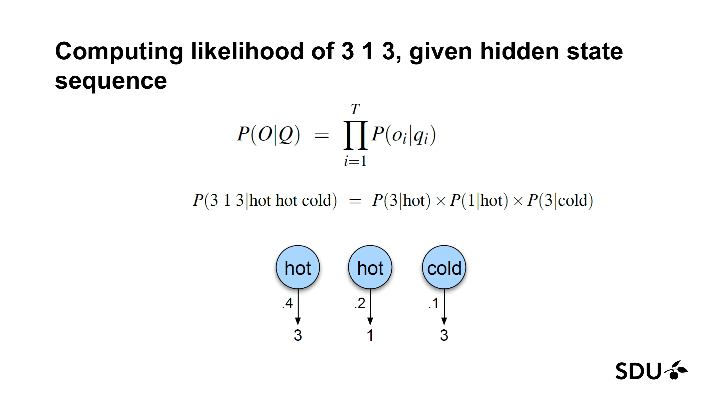
_Figure 4.1: likelihood of observations given a fixed state sequence is a product of emissions. (Lecture 9b, slide 32.)_

**The joint** $P(O, Q)$ adds in the transition probabilities [Lecture 9b, slide 33]:

$$P(O, Q) = P(O \mid Q) P(Q) = \prod_{i=1}^{T} P(o_i \mid q_i) \cdot \prod_{i=1}^{T} P(q_i \mid q_{i-1}).$$

*Recall §2.1: this is the umbrella story written as a product — the joint probability of "this whole week's umbrella choices AND this whole week's weather" equals (prob today's weather started where it did) × (prob each day's weather followed yesterday's, by $A$) × (prob each day's umbrella choice matched that day's weather, by $B$).*

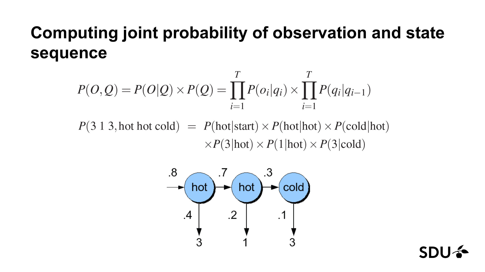
_Figure 4.2: the joint factors using the Markov + output-independence assumptions. For $3, 1, 3$ with $H, H, C$: $P(3 1 3, \text{HHC}) = \pi_H \cdot a_{HH} \cdot a_{HC} \cdot b_H(3) \cdot b_H(1) \cdot b_C(3) = .8 \cdot .7 \cdot .3 \cdot .4 \cdot .2 \cdot .1$. (Lecture 9b, slide 33.)_

**But we DON'T know $Q$.** To get the likelihood we must sum the joint over every possible state sequence [Lecture 9b, slide 34]:

$$P(O \mid \lambda) = \sum_{Q} P(O, Q \mid \lambda) = \sum_{Q} P(O \mid Q) P(Q).$$

For $T = 3$ observations and $N = 2$ states, that's $2^3 = 8$ sequences — fine. But the number of state sequences is $O(N^T)$. For $N = 2, T = 100$, that's $\approx 10^{30}$. Brute-force is impossible.

> "So we can't just do separate computation for each hidden state sequence." [Lecture 9b, slide 34]

This is exactly the **forward algorithm's** target.

### 4.2 The forward algorithm — Problem 1 (Evaluation / Filtering)

**Idea** [Lecture 9b, slide 35]: dynamic programming. Build a table where each cell stores the probability of all paths that reach a given state at a given time, then build the next column from the previous.

Recall the **"total all the ways the story could have unfolded" analogy** from §2.3.

**The forward variable** $\alpha_t(j)$ is defined as [Lecture 9b, slide 36]:

$$\alpha_t(j) = P(o_1, o_2, \ldots, o_t, \; q_t = j \mid \lambda).$$

In English: $\alpha_t(j)$ is the joint probability of having observed the first $t$ observations AND being in state $j$ at time $t$, given the model. It folds together every possible state sequence ending at $(j, t)$.

**Why the definition has that exact shape.** It is the joint with the future not yet integrated, marginalised over all earlier hidden states. The recursion below shows why this is the right quantity to carry forward.

**Deriving the recursion from the definition.** A derivation-style exam question may ask for this. Start from the definition and unfold step by step, citing which HMM assumption justifies each step:

1. *Definition.* $\alpha_t(j) = P(o_1, \ldots, o_t, q_t = j \mid \lambda).$
2. *Marginalise over the previous hidden state $q_{t-1}$.* Total probability over all $N$ possible values of $q_{t-1}$:
   $$\alpha_t(j) = \sum_{i=1}^{N} P(o_1, \ldots, o_t, q_{t-1} = i, q_t = j \mid \lambda).$$
3. *Factor the joint by the chain rule:*
   $$\alpha_t(j) = \sum_{i=1}^{N} P(o_1, \ldots, o_{t-1}, q_{t-1} = i) \cdot P(q_t = j \mid o_1, \ldots, o_{t-1}, q_{t-1} = i) \cdot P(o_t \mid o_1, \ldots, o_{t-1}, q_{t-1} = i, q_t = j).$$
4. *Apply the Markov assumption* (§3.3) to the middle factor — given $q_{t-1}$, earlier states and observations are irrelevant: $P(q_t = j \mid o_1, \ldots, o_{t-1}, q_{t-1} = i) = P(q_t = j \mid q_{t-1} = i) = a_{ij}.$
5. *Apply the output-independence assumption* (§3.3) to the last factor — given $q_t$, earlier states and observations are irrelevant: $P(o_t \mid o_1, \ldots, o_{t-1}, q_{t-1} = i, q_t = j) = P(o_t \mid q_t = j) = b_j(o_t).$
6. *Recognise* the first factor as $\alpha_{t-1}(i)$ and assemble:
   $$\alpha_t(j) = \sum_{i=1}^{N} \alpha_{t-1}(i) \, a_{ij} \, b_j(o_t).$$

That is the recursion. The two assumptions — Markov and output-independence — are *each used once*, at steps 4 and 5 respectively. (§6 pitfall 7 keeps them straight.)

**The recursion** [Lecture 9b, slide 37]:

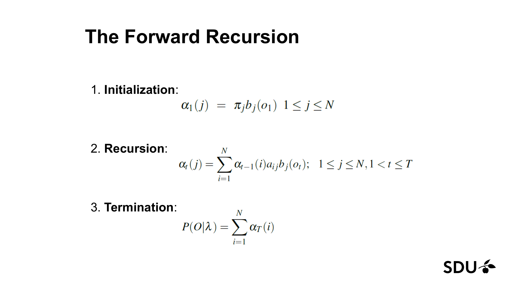
_Figure 4.3: the forward recursion in three steps. (Lecture 9b, slide 37.)_

1. **Initialization** — at $t = 1$, the only way to be in state $j$ is to start there and emit $o_1$:
   $$\alpha_1(j) = \pi_j \, b_j(o_1), \qquad 1 \le j \le N.$$

2. **Recursion** — to be in state $j$ at time $t$, you must have been in *some* state $i$ at time $t-1$, transitioned to $j$, and emitted $o_t$. Sum over all $i$:
   $$\alpha_t(j) = \sum_{i=1}^{N} \alpha_{t-1}(i) \, a_{ij} \, b_j(o_t), \qquad 1 \le j \le N, \; 1 < t \le T.$$

3. **Termination** — total likelihood is the sum over all final states:
   $$P(O \mid \lambda) = \sum_{i=1}^{N} \alpha_T(i).$$

**Reading the recursion as a sentence:** "the probability of reaching state $j$ at time $t$ having seen everything up to $o_t$ equals the sum, over every possible previous state $i$, of (the probability of reaching $i$ at time $t-1$ having seen up to $o_{t-1}$) × (the probability of transitioning $i \to j$) × (the probability of $j$ emitting $o_t$)."

**Complexity.** We fill an $N \times T$ table, and each cell requires summing over $N$ predecessors. Time $O(N^2 T)$; space $O(NT)$. Compare to brute force at $O(N^T)$.

> "By folding all the sequences into a single trellis." [Lecture 9b, slide 35]

**Pseudocode (slide 41)** — directly transcribed:

```
function FORWARD(observations of len T, state-graph of len N) returns forward-prob
    create a probability matrix forward[N, T]
    for each state s from 1 to N do                            ; initialization step
        forward[s, 1] <- pi_s * b_s(o_1)
    for each time step t from 2 to T do                        ; recursion step
        for each state s from 1 to N do
            forward[s, t] <- sum over s' from 1 to N of
                             forward[s', t-1] * a_{s', s} * b_s(o_t)
    forwardprob <- sum over s from 1 to N of forward[s, T]     ; termination step
    return forwardprob
```

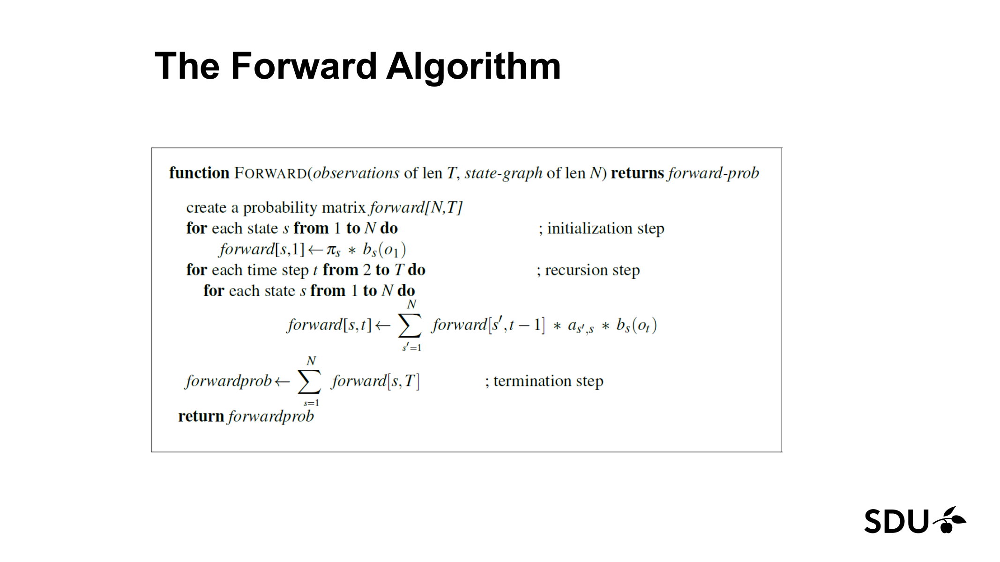
_Figure 4.4: the full forward-algorithm pseudocode. (Lecture 9b, slide 41.)_

A fully worked numerical trellis appears in §5.4 below.

### 4.3 The Viterbi algorithm — Problem 2 (Decoding / Most Likely State Sequence)

For Problem 2 we want the *single* most likely state sequence:

$$Q^* = \arg\max_{Q} P(Q \mid O, \lambda) = \arg\max_{Q} P(O, Q \mid \lambda).$$

(The equivalence holds because $P(O \mid \lambda)$ is constant across $Q$.)

**Why not brute force?** Same reason as forward: $O(N^T)$ possible state sequences. [Lecture 9b, slide 45.]

**The Viterbi insight** [Lecture 9b, slides 46–47]: replace the *sum* in the forward recursion with a *max*, and remember which predecessor achieved the max (the **back-pointer**). At the end, find the highest-probability final cell and follow back-pointers to recover the entire most-likely state sequence. Recall the **GPS-with-breadcrumbs analogy** from §2.4.

**The Viterbi variable** $v_t(j)$ is defined as:

$$v_t(j) = \max_{q_1, \ldots, q_{t-1}} P(q_1, \ldots, q_{t-1}, q_t = j, \; o_1, \ldots, o_t \mid \lambda).$$

In English: $v_t(j)$ is the probability of the *single best* path that ends in state $j$ at time $t$ having generated the observations up to $o_t$.

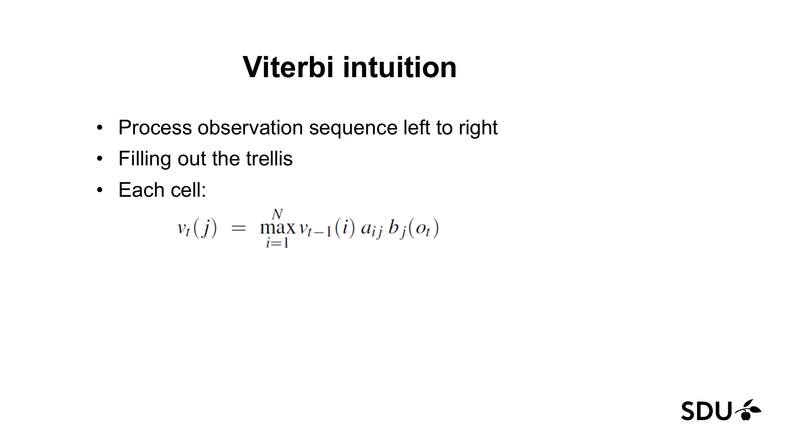
_Figure 4.5: each cell is the max-recursion analogue of the forward cell. (Lecture 9b, slide 47.)_

**The recursion** [Lecture 9b, slide 48]:

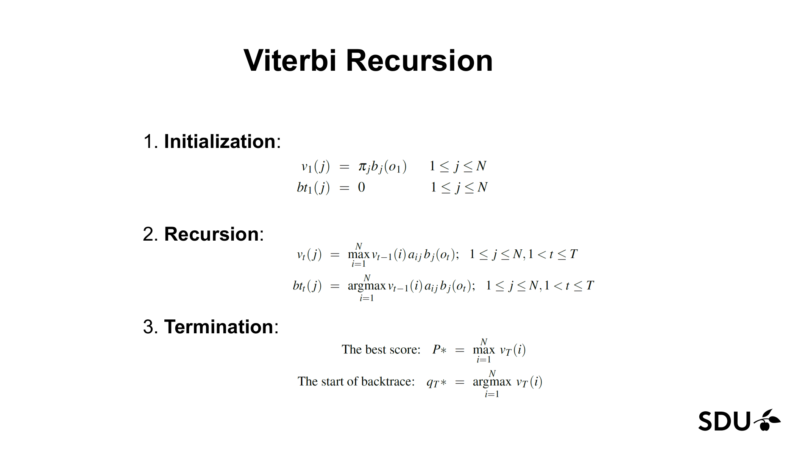
_Figure 4.6: the Viterbi recursion in three steps. (Lecture 9b, slide 48.)_

1. **Initialization** — same as forward, plus a back-pointer placeholder:
   $$v_1(j) = \pi_j \, b_j(o_1), \qquad bt_1(j) = 0, \qquad 1 \le j \le N.$$

2. **Recursion** — same as forward but with $\max$ in place of $\sum$, and store the argmax:
   $$v_t(j) = \max_{i=1}^{N} v_{t-1}(i) \, a_{ij} \, b_j(o_t),$$
   $$bt_t(j) = \arg\max_{i=1}^{N} v_{t-1}(i) \, a_{ij} \, b_j(o_t), \qquad 1 \le j \le N, \; 1 < t \le T.$$

3. **Termination** — the best score and the start of the backtrace:
   $$P^* = \max_{i=1}^{N} v_T(i), \qquad q_T^* = \arg\max_{i=1}^{N} v_T(i).$$

4. **Backtrace** (implicit in step 3 → continue): walk back through the $bt$ pointers to reconstruct $q_{T-1}^*, q_{T-2}^*, \ldots, q_1^*$:
   $$q_{t-1}^* = bt_t(q_t^*).$$

**Complexity.** Same as forward: $O(N^2 T)$ time, $O(NT)$ space (plus the backtrace storage).

**Pseudocode (slide 49)** — directly transcribed:

```
function VITERBI(observations of len T, state-graph of len N) returns best-path, path-prob
    create a path probability matrix viterbi[N, T]
    for each state s from 1 to N do                                ; initialization
        viterbi[s, 1] <- pi_s * b_s(o_1)
        backpointer[s, 1] <- 0
    for each time step t from 2 to T do                            ; recursion
        for each state s from 1 to N do
            viterbi[s, t]      <- max over s' from 1 to N of
                                  viterbi[s', t-1] * a_{s', s} * b_s(o_t)
            backpointer[s, t]  <- argmax over s' from 1 to N of
                                  viterbi[s', t-1] * a_{s', s} * b_s(o_t)
    bestpathprob    <- max     over s from 1 to N of viterbi[s, T] ; termination
    bestpathpointer <- argmax  over s from 1 to N of viterbi[s, T] ; termination
    bestpath <- the path starting at bestpathpointer, that follows backpointer[] back in time
    return bestpath, bestpathprob
```

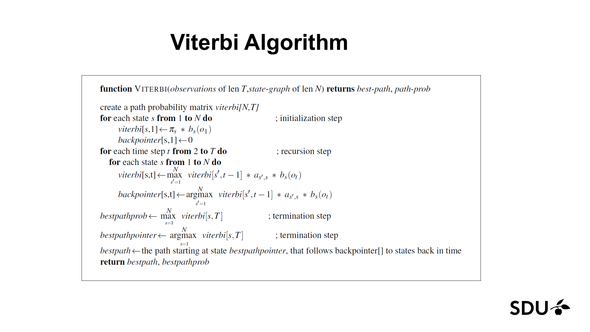
_Figure 4.7: the full Viterbi-algorithm pseudocode with backpointers. (Lecture 9b, slide 49.)_

### 4.4 Side-by-side comparison: forward vs Viterbi

| Property | Forward | Viterbi |
|---|---|---|
| **Question answered** | What is the total likelihood $P(O \mid \lambda)$? | What is the single most likely state sequence $Q^*$? |
| **Recursion operator** | $\sum_i$ | $\max_i$ |
| **What each cell holds** | $\alpha_t(j)$ — probability of all paths ending at $(j, t)$ | $v_t(j)$ — probability of the *best* path ending at $(j, t)$ |
| **Extra bookkeeping** | None | Back-pointer $bt_t(j)$ per cell |
| **Time** | $O(N^2 T)$ | $O(N^2 T)$ |
| **Space** | $O(NT)$ | $O(NT)$ for the table + $O(NT)$ for back-pointers |
| **Returns** | A scalar probability | A scalar probability AND a length-$T$ state sequence |
| **Lecture slide names** | Problem 1 — Evaluation | Problem 2 — Decoding |
| **Textbook names** | Filtering / likelihood | Most-likely-explanation / Viterbi decoding |

Two algorithms, one trellis structure, one operator-swap apart. Recall the **sum vs max analogy** from §2.5.

### 4.5 Problem 3 — Learning (briefly)

The lecture lists Problem 3 — adjusting $\lambda = (A, B)$ to maximise $P(O \mid \lambda)$ — but does not teach an algorithm for it. The standard solution is the **Baum–Welch algorithm**, an instance of the EM algorithm. For exam purposes: know that this is the *training* problem and that it is solved by EM (Baum–Welch); the lecture does not require you to derive it. Note also that HMM training is *unsupervised* — Baum–Welch sees only the observation sequences, not the hidden states.

[Lecture 9b, slide 29.]

### 4.6 The backward variable and smoothing (not in the slides — for reference)

The slides stop after forward and Viterbi. Standard HMM treatments also define a **backward** recursion that, combined with the forward variable, yields *smoothing* — the posterior $P(q_t \mid o_1 \ldots o_T)$ over a hidden state given the *entire* observation sequence (including observations *after* $t$). We include it here so that "how would you compute $P(q_5 \mid o_1 \ldots o_{10})$?" is not a question this chapter leaves unanswered.

**The backward variable** $\beta_t(j)$ mirrors the forward variable, looking the other way:

$$\beta_t(j) = P(o_{t+1}, o_{t+2}, \ldots, o_T \mid q_t = j, \lambda).$$

In English: $\beta_t(j)$ is the probability of *all the future observations from $t+1$ onwards*, given that we are in state $j$ at time $t$. It folds together every possible state sequence from $t+1$ to $T$.

**The backward recursion** runs right-to-left:

1. **Initialization** — at the very end, the future is empty, so the probability is 1 by convention:
   $$\beta_T(j) = 1, \qquad 1 \le j \le N.$$
2. **Recursion** — to be in state $j$ at time $t$ and see all future observations, you sum over every possible *next* state $i$, weighting by the transition $a_{ji}$, the emission $b_i(o_{t+1})$, and the future-from-$t+1$ probability $\beta_{t+1}(i)$:
   $$\beta_t(j) = \sum_{i=1}^{N} a_{ji} \, b_i(o_{t+1}) \, \beta_{t+1}(i), \qquad 1 \le j \le N, \; 1 \le t < T.$$

**Smoothing — combining forward and backward.** The smoothed posterior at any time $t$ is

$$P(q_t = j \mid O, \lambda) = \frac{\alpha_t(j) \, \beta_t(j)}{\sum_{i=1}^{N} \alpha_t(i) \, \beta_t(i)} = \frac{\alpha_t(j) \, \beta_t(j)}{P(O \mid \lambda)}.$$

The numerator is the joint $P(o_1, \ldots, o_T, q_t = j \mid \lambda)$: $\alpha_t(j)$ covers "the past up to and including $t$, ending in $j$", and $\beta_t(j)$ covers "the future from $t+1$ to $T$, given we are in $j$". The denominator normalises to a posterior over states at time $t$, and equals the observation likelihood (computable either as $\sum_i \alpha_T(i)$ from forward or as $\sum_i \pi_i b_i(o_1) \beta_1(i)$ from backward — both agree).

Complexity: another $O(N^2 T)$ pass for $\beta$, so smoothing the whole sequence is $O(N^2 T)$ total. Together, forward + backward is the **forward–backward algorithm**, which is also the E-step inside Baum–Welch (§4.5).

If an exam asks for the smoothed posterior at a single time $t$ given everything observed, this is the formula. If it asks only for filtering — the *current* state given observations up to *now* — you do not need $\beta$; just normalise the forward column at time $t$ (see §6 pitfall 1).

---

## 5. Worked Examples

### 5.1 Markov chain — probability of WARM-WARM-WARM-WARM

*Recall §2.2: the board-game framing — your next square depends only on your current square. The "probability of four consecutive WARM days" we compute below is just the probability of staying on the WARM square four turns in a row.*

Using the weather Markov chain from Figure 3.2 ($\pi = [0.5, 0.3, 0.2]$ for HOT/COLD/WARM; self-loop $a_{33} = 0.6$):

$$P(\text{WARM, WARM, WARM, WARM}) = \pi_3 \cdot a_{33} \cdot a_{33} \cdot a_{33} = 0.2 \times 0.6^3 = 0.2 \times 0.216 = 0.0432.$$

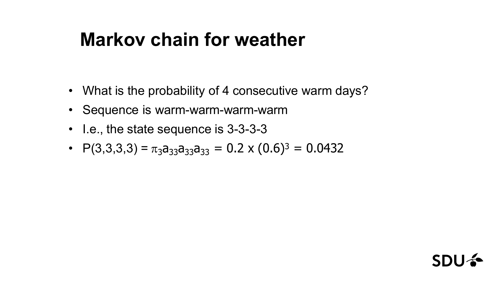
_Figure 5.1: probability of four consecutive WARM days in the weather Markov chain. (Lecture 9b, slide 14.)_

**Discussion prompt from the slides** [Lecture 9b, slide 15]: compare $P(\text{HOT, HOT, HOT, HOT})$ to $P(\text{COLD, HOT, COLD, HOT})$.

- $P(\text{HOT, HOT, HOT, HOT}) = \pi_1 \cdot a_{11}^3 = 0.5 \times 0.5^3 = 0.0625$.
- $P(\text{COLD, HOT, COLD, HOT}) = \pi_2 \cdot a_{21} \cdot a_{12} \cdot a_{21} = 0.3 \times 0.2 \times 0.2 \times 0.2 = 0.0024$.

The first is ~26× more likely. **What this tells us about real-world weather encoded in the model:** weather is autocorrelated — sequences that stay in the same state are much more likely than sequences that flip back and forth. That is what the high self-loops ($a_{11} = a_{22} = 0.5$, $a_{33} = 0.6$) encode.

### 5.2 The Fair Bet Casino — hidden paths

*Recall §2.1: the umbrella story, casino edition — the *coin in play* is the hidden weather, the *flip outcome* is the umbrella. The dealer secretly switches coins (transitions) and each coin emits H/T with its own bias (emissions). The table below walks one specific hidden path through both columns.*

From slide 25, consider the observed sequence $o = 0\,1\,0\,1\,1\,1\,0\,1\,0\,0\,1$ and one hypothesised hidden path $q = F\,F\,F\,B\,B\,B\,B\,B\,F\,F\,F$. Walk through it position by position [Lecture 9b, slide 25]:

| $i$ | $o_i$ | $q_i$ | $P(o_i \mid q_i)$ | $P(q_{i-1} \to q_i)$ |
|---|---|---|---|---|
| 1 | 0 | F | $b_F(0) = \tfrac{1}{2}$ | $\pi_F = \tfrac{1}{2}$ (assuming uniform prior) |
| 2 | 1 | F | $b_F(1) = \tfrac{1}{2}$ | $a_{FF} = 0.9$ |
| 3 | 0 | F | $\tfrac{1}{2}$ | $a_{FF} = 0.9$ |
| 4 | 1 | B | $b_B(1) = \tfrac{3}{4}$ | $a_{FB} = 0.1$ |
| 5 | 1 | B | $\tfrac{3}{4}$ | $a_{BB} = 0.9$ |
| 6 | 1 | B | $\tfrac{3}{4}$ | $a_{BB} = 0.9$ |
| 7 | 0 | B | $\tfrac{1}{4}$ | $a_{BB} = 0.9$ |
| 8 | 1 | B | $\tfrac{3}{4}$ | $a_{BB} = 0.9$ |
| 9 | 0 | F | $\tfrac{1}{2}$ | $a_{BF} = 0.1$ |
| 10 | 0 | F | $\tfrac{1}{2}$ | $a_{FF} = 0.9$ |
| 11 | 1 | F | $\tfrac{1}{2}$ | $a_{FF} = 0.9$ |

The joint probability of this observation+path is the product of all the entries in those two columns, after multiplying in $\pi_F$ once at the start. To choose *the best* path Viterbi (§4.3) would do this max-style for all $2^{11}$ candidates.

**Why we need transitions in the first place** [Lecture 9b, slide 21]: if the dealer never switches coins, the likelihood given each pure-coin hypothesis collapses to

$$P(o \mid \text{fair only}) = \prod_{i=1}^{n} P(o_i \mid \text{fair}) = \left(\tfrac{1}{2}\right)^n,$$

$$P(o \mid \text{biased only}) = \left(\tfrac{3}{4}\right)^k \left(\tfrac{1}{4}\right)^{n-k} = \frac{3^k}{4^n},$$

where $k$ is the number of heads in $o$. The fun starts when the dealer DOES switch — and that's when we need the transition model.

### 5.3 Ice-cream HMM — setup for the algorithms

The HMM diagram (Figure 3.4 / slide 28) is the running example for §5.4 (forward) and §5.5 (Viterbi). To recap the parameters:

> **⚠ Indexing convention — the slides disagree with themselves.** Slide 28 draws the ice-cream HMM with **HOT as state 1 and COLD as state 2** ("HOT₁", "COLD₂" labels, $B_1$ for HOT, $B_2$ for COLD). But the lecture's own trellis on slides 38 and 50 **inverts this**, placing $q_1 = $ COLD on the bottom row and $q_2 = $ HOT on the top row. The chapter follows the **trellis convention (COLD = 1, HOT = 2) throughout §5.3–§5.5** because that is what the worked-numerical-arithmetic slides use. If you had started a matrix with HOT as row 1 you would compute the same final answers but your matrix rows/columns would appear swapped relative to slide 38. Pick one convention, stick with it, and on the exam state which one you are using.

- States: $Q = \{\text{HOT}, \text{COLD}\}$, labelled $q_1 = $ COLD and $q_2 = $ HOT in the trellis convention.
- Observations: $V = \{1, 2, 3\}$ (number of ice creams eaten that day).
- Initial: $\pi = (\pi_{\text{COLD}}, \pi_{\text{HOT}}) = (0.2, 0.8)$.
- Transitions:
  $$A = \begin{pmatrix} a_{CC} & a_{CH} \\ a_{HC} & a_{HH} \end{pmatrix} = \begin{pmatrix} 0.6 & 0.4 \\ 0.3 & 0.7 \end{pmatrix}.$$
- Emissions:
  $$B = \begin{pmatrix} b_C(1) & b_C(2) & b_C(3) \\ b_H(1) & b_H(2) & b_H(3) \end{pmatrix} = \begin{pmatrix} 0.5 & 0.4 & 0.1 \\ 0.2 & 0.4 & 0.4 \end{pmatrix}.$$

> "Eisner task: Given Ice Cream Observation Sequence: 1, 2, 3, 2, 2, 2, 3, … Produce Weather Sequence: H, C, H, H, H, C, …" [Lecture 9b, slide 27]

### 5.4 Forward algorithm — fully worked on $O = 3, 1, 3$

*Recall §2.1 / §2.3: we are about to total the probabilities of every possible weather-week consistent with the ice-cream sequence $3, 1, 3$. Each $\alpha_t(j)$ cell is "the total probability over all the ways the story could have unfolded that end in weather state $j$ at day $t$" — not one path, but the sum over every path that lands there. The forward algorithm is the bookkeeping that makes this tractable.*

**Step 1: Initialization** ($t = 1$, observation $o_1 = 3$).

$$\alpha_1(\text{HOT}) = \pi_H \cdot b_H(3) = 0.8 \times 0.4 = 0.32.$$
$$\alpha_1(\text{COLD}) = \pi_C \cdot b_C(3) = 0.2 \times 0.1 = 0.02.$$

**Step 2a: Recursion at $t = 2$**, observation $o_2 = 1$.

For each new state $j$ we sum over both previous states $i \in \{\text{COLD}, \text{HOT}\}$, weighting by $\alpha_{t-1}(i) \cdot a_{ij}$, then multiply by $b_j(o_t)$:

- $\alpha_2(\text{HOT}) = [\alpha_1(\text{HOT}) \cdot a_{HH} + \alpha_1(\text{COLD}) \cdot a_{CH}] \cdot b_H(1)$
  $= [0.32 \times 0.7 + 0.02 \times 0.4] \times 0.2$
  $= [0.224 + 0.008] \times 0.2$
  $= 0.232 \times 0.2 = 0.0464.$

  (The slide writes this as `0.32*0.14 + 0.02*0.08 = 0.0464`, having pre-multiplied $a_{HH} \cdot b_H(1) = 0.7 \times 0.2 = 0.14$ and $a_{CH} \cdot b_H(1) = 0.4 \times 0.2 = 0.08$.)

- $\alpha_2(\text{COLD}) = [\alpha_1(\text{HOT}) \cdot a_{HC} + \alpha_1(\text{COLD}) \cdot a_{CC}] \cdot b_C(1)$
  $= [0.32 \times 0.3 + 0.02 \times 0.6] \times 0.5$
  $= [0.096 + 0.012] \times 0.5$
  $= 0.108 \times 0.5 = 0.054.$

  (The slide writes this as `α_2(1) = .32 · .15 + .02 · .30 = .054`, with $a_{HC} \cdot b_C(1) = 0.3 \times 0.5 = 0.15$ and $a_{CC} \cdot b_C(1) = 0.6 \times 0.5 = 0.30$.)

The complete trellis the slide draws:

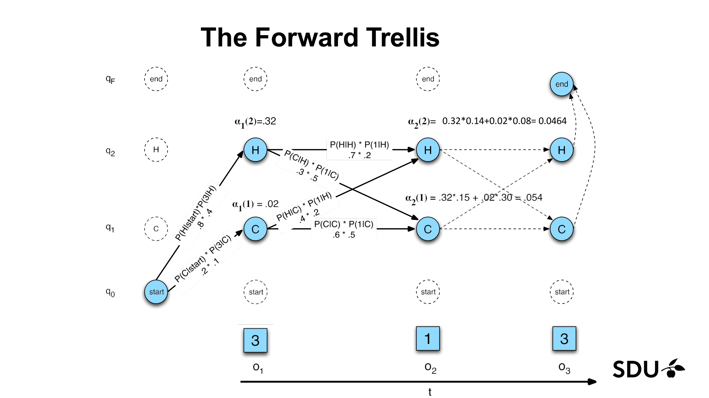
_Figure 5.2: the forward trellis on $O = 3, 1, 3$ for the ice-cream HMM. Cells at $t = 1$: $\alpha_1(\text{HOT}) = 0.32$, $\alpha_1(\text{COLD}) = 0.02$. Cells at $t = 2$: $\alpha_2(\text{HOT}) = 0.0464$, $\alpha_2(\text{COLD}) = 0.054$. (Lecture 9b, slide 38.)_

**Step 2b: Recursion at $t = 3$**, observation $o_3 = 3$.

- $\alpha_3(\text{HOT}) = [\alpha_2(\text{HOT}) \cdot a_{HH} + \alpha_2(\text{COLD}) \cdot a_{CH}] \cdot b_H(3)$
  $= [0.0464 \times 0.7 + 0.054 \times 0.4] \times 0.4$
  $= [0.03248 + 0.0216] \times 0.4$
  $= 0.05408 \times 0.4 = 0.021632.$

- $\alpha_3(\text{COLD}) = [\alpha_2(\text{HOT}) \cdot a_{HC} + \alpha_2(\text{COLD}) \cdot a_{CC}] \cdot b_C(3)$
  $= [0.0464 \times 0.3 + 0.054 \times 0.6] \times 0.1$
  $= [0.01392 + 0.0324] \times 0.1$
  $= 0.04632 \times 0.1 = 0.004632.$

**Step 3: Termination** — sum over all final states.

$$P(O \mid \lambda) = \alpha_3(\text{HOT}) + \alpha_3(\text{COLD}) = 0.021632 + 0.004632 = 0.026264.$$

So the total probability of seeing the ice-cream sequence $3, 1, 3$ from this HMM is approximately $0.0263$.

**Sanity check** — does it equal the sum of the joints over all $2^3 = 8$ state sequences? Yes; that's exactly what the forward recursion's $\sum$ encodes. The exponential brute-force computation has been folded into the trellis.

### 5.5 Viterbi algorithm — fully worked on $O = 3, 1, 3$

*Recall §2.4: GPS with breadcrumbs — at each (day, weather) cell we store both the probability of the best path that ends there *and* which previous weather state that best path came from. At the end we look for the highest-probability final cell and walk the breadcrumbs backwards to recover the whole most-likely weather sequence.*

Identical structure to §5.4 except we replace $\sum$ with $\max$ and keep back-pointers.

**Step 1: Initialization** ($t = 1$, observation $o_1 = 3$) — same as forward:

$$v_1(\text{HOT}) = \pi_H \cdot b_H(3) = 0.8 \times 0.4 = 0.32, \qquad bt_1(\text{HOT}) = 0.$$
$$v_1(\text{COLD}) = \pi_C \cdot b_C(3) = 0.2 \times 0.1 = 0.02, \qquad bt_1(\text{COLD}) = 0.$$

**Step 2a: Recursion at $t = 2$**, observation $o_2 = 1$ — same arithmetic as forward but with $\max$ in place of $\sum$:

- $v_2(\text{HOT}) = \max\Bigl(v_1(\text{HOT}) \cdot a_{HH} \cdot b_H(1), \; v_1(\text{COLD}) \cdot a_{CH} \cdot b_H(1)\Bigr)$
  $= \max(0.32 \times 0.14, \; 0.02 \times 0.08)$
  $= \max(0.0448, \; 0.0016) = 0.0448.$
  Back-pointer: $bt_2(\text{HOT}) = \text{HOT}$ (the HOT-source was the larger).

- $v_2(\text{COLD}) = \max\Bigl(v_1(\text{HOT}) \cdot a_{HC} \cdot b_C(1), \; v_1(\text{COLD}) \cdot a_{CC} \cdot b_C(1)\Bigr)$
  $= \max(0.32 \times 0.15, \; 0.02 \times 0.30)$
  $= \max(0.048, \; 0.006) = 0.048.$
  Back-pointer: $bt_2(\text{COLD}) = \text{HOT}$.

The slide annotates exactly this on the trellis:

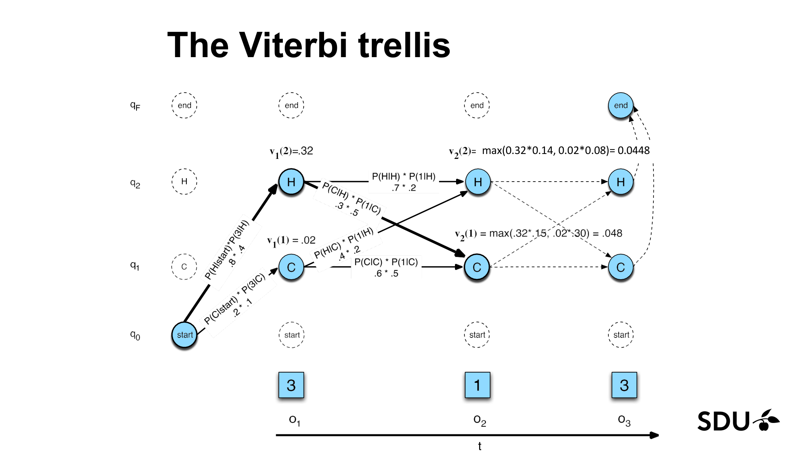
_Figure 5.3: the Viterbi trellis on $O = 3, 1, 3$ for the ice-cream HMM. Note the operator-swap from $\sum$ to $\max$ — the only difference from Figure 5.2 above. (Lecture 9b, slide 50.)_

**Step 2b: Recursion at $t = 3$**, observation $o_3 = 3$:

- $v_3(\text{HOT}) = \max(v_2(\text{HOT}) \cdot a_{HH} \cdot b_H(3), \; v_2(\text{COLD}) \cdot a_{CH} \cdot b_H(3))$
  $= \max(0.0448 \times 0.7 \times 0.4, \; 0.048 \times 0.4 \times 0.4)$
  $= \max(0.012544, \; 0.00768) = 0.012544.$
  Back-pointer: $bt_3(\text{HOT}) = \text{HOT}$.

- $v_3(\text{COLD}) = \max(v_2(\text{HOT}) \cdot a_{HC} \cdot b_C(3), \; v_2(\text{COLD}) \cdot a_{CC} \cdot b_C(3))$
  $= \max(0.0448 \times 0.3 \times 0.1, \; 0.048 \times 0.6 \times 0.1)$
  $= \max(0.001344, \; 0.00288) = 0.00288.$
  Back-pointer: $bt_3(\text{COLD}) = \text{COLD}$.

**Step 3: Termination.**

$$P^* = \max(v_3(\text{HOT}), v_3(\text{COLD})) = \max(0.012544, 0.00288) = 0.012544.$$

$$q_3^* = \arg\max = \text{HOT}.$$

**Step 4: Backtrace.**

- $q_3^* = $ HOT.
- $q_2^* = bt_3(\text{HOT}) = $ HOT.
- $q_1^* = bt_2(\text{HOT}) = $ HOT.

So the **most likely state sequence is $Q^* = \text{HOT, HOT, HOT}$**, with joint probability $0.012544$.

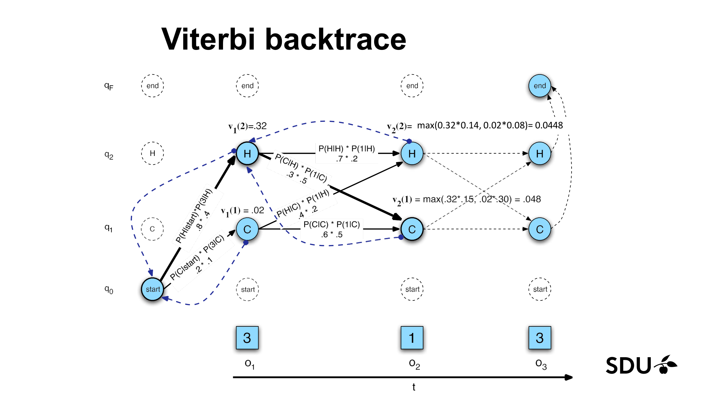
_Figure 5.4: the Viterbi trellis with the best-path back-pointers highlighted in bold. The reconstructed argmax sequence is HOT, HOT, HOT. (Lecture 9b, slide 51.)_

**Comparison to §5.4.** The forward algorithm gave $P(O \mid \lambda) = 0.0263$ — the *total* probability across all 8 state sequences. Viterbi gave $0.012544$ — the probability of the *single best* state sequence. Their ratio is $0.012544 / 0.026264 \approx 0.478$, meaning the most-likely sequence (HHH) accounts for about 48% of the total observation probability.

---

## 6. Common Pitfalls / Exam Traps

1. **"Filtering" means different things in the slides vs textbooks.** [§3.5, §2.8]
   - The lecture calls Problem 1 (Evaluation) "filtering"; standard usage reserves "filtering" for $P(q_t \mid o_1 \ldots o_t)$.
   - If the exam asks for "the probability of an observation sequence", they want forward-algorithm output $P(O \mid \lambda) = \sum_i \alpha_T(i)$.
   - If the exam asks for "the posterior over the current hidden state given everything so far" (i.e., textbook filtering), they want the *normalised* forward variable $\alpha_t(j) / \sum_i \alpha_t(i)$.
   - If the exam says "smoothing" they want $P(q_t \mid o_1 \ldots o_T)$, computed via forward × backward (see §4.6).
   - If the exam says "prediction" they want $P(q_{t+k} \mid o_1 \ldots o_t)$ for $k > 0$ — filter to $t$, then push forward through $A$.

2. **Confusing forward $\alpha$ with Viterbi $v$.** Both fill a trellis; both have the same initialization $\pi_j b_j(o_1)$. The only difference is the operator in the recursion. Lose a mark by writing $\sum$ when you meant $\max$ (or vice versa).

3. **Forgetting the emission factor $b_j(o_t)$.** A common error in trellis arithmetic is to multiply only $\alpha_{t-1}(i) \cdot a_{ij}$ and forget the emission $b_j(o_t)$ at the new time step. Every cell's recursion ends with "times $b_j(o_t)$".

4. **Indices: $a_{ij}$ vs $a_{ji}$.** The lecture uses the convention $a_{ij} = P(q_t = j \mid q_{t-1} = i)$ — read it as "from $i$ to $j$". In the recursion the previous state is the row index $i$ and the new state is the column index $j$. Reversing this is a classic sign-error-style mistake on exams.

5. **$\pi_j$ is the probability of *starting* in state $j$, not of being in state $j$ at any time.** Only multiply by $\pi$ at $t = 1$.

6. **$O(N^T)$ vs $O(N^2 T)$.** The brute-force enumeration over state sequences is $O(N^T)$ — exponential in sequence length. The forward / Viterbi DP is $O(N^2 T)$ — polynomial. This is the big-O contrast a question may ask for.

7. **Markov assumption vs output-independence assumption — keep them separate.** [§3.3]
   - Markov: $P(q_t \mid q_1 \ldots q_{t-1}) = P(q_t \mid q_{t-1})$ (state evolution).
   - Output-independence: $P(o_t \mid q_1 \ldots q_T, o_1 \ldots o_T) = P(o_t \mid q_t)$ (observation depends only on current state).
   - The HMM uses *both*. If a question asks "what assumption lets you factor $P(O, Q) = \prod P(o_i \mid q_i) \prod P(q_i \mid q_{i-1})$?", the answer is "both".

8. **Forgetting back-pointers in Viterbi.** Computing $v_t(j)$ alone gives you the *probability* of the best path but not the path itself. The exam may ask for the *sequence* — you need $bt_t(j)$.

9. **Rows-sum-to-1, not columns.** For $A$, the rows correspond to the source state and must sum to 1 (you must transition *somewhere*). For $B$, the rows correspond to the state and the columns to the observation vocabulary; row $j$ of $B$ ($b_j(v_1), b_j(v_2), \ldots$) must sum to 1.

10. **Stationarity.** The slides emphasise that $A$ and $B$ do not change with time [Lecture 9b, slide 2]. A question might describe a system where, say, the transition probabilities drift across the day — that is NOT a standard HMM and standard forward / Viterbi do not directly apply.

11. **Numerical underflow.** Probabilities multiply across many time steps; for long sequences $\alpha$ and $v$ values quickly underflow floating-point. In practice we work in log space: $\log v_t(j) = \max_i [\log v_{t-1}(i) + \log a_{ij} + \log b_j(o_t)]$. The exam may not test this directly, but Lab 8's implementation may; flag it if asked about implementation concerns.

12. **The "three basic problems" list is sequential, not exhaustive.** Problem 3 (Learning / Baum–Welch) is mentioned but not derived in this course. If asked "how would you train an HMM?", you can name Baum–Welch / EM but the lecture does not require deriving it.

---

## 7. Connections to Other Lectures

### Foundations being used

- **[L09a — Bayesian Networks](L09a-Bayesian-Networks.md)** — an HMM is a particular Bayesian network, unrolled across time: nodes $(q_1, q_2, \ldots)$ form a chain, each $q_t$ has parent $q_{t-1}$, and each observation $o_t$ has parent $q_t$. The HMM's two assumptions (Markov + output-independence) are statements about d-separation in that chain. The joint factorisation in §4.1, $P(O, Q) = \prod P(o_i \mid q_i) \prod P(q_i \mid q_{i-1})$, is exactly the BN chain-rule applied to this structure.
- **[L09a §3.3 — conditional probability, Bayes' rule, normalisation](L09a-Bayesian-Networks.md#33-conditional-probability-bayes-rule-normalisation)** — every entry of $A$ and $B$ is a conditional probability; Bayes' rule is also what motivates the Noisy Channel formulation $\hat{W} = \arg\max P(O \mid W) P(W)$ in §1.
- **[L09a §3.9 — Markov condition](L09a-Bayesian-Networks.md#39-the-markov-condition-aka-d-separation-informal-version)** — the Markov *condition* for general Bayes nets and the Markov *assumption* for HMMs are the same idea: given the immediate parents, the rest of the past is irrelevant.
- **[L02 — Agents §3 partial observability](L02-Agents.md)** — HMMs are the natural probabilistic agent for partially observable environments. The model-based reflex agent from L02 maintained a deterministic "internal state" estimate; an HMM agent maintains a probability *distribution* over hidden states and updates it via the forward recursion (filtering).
- **[L02 §3.6 — environment taxonomy](L02-Agents.md#36-environment-types-the-six-dimensional-taxonomy)** — HMM applies to environments that are **partially observable**, **stochastic**, **sequential**, **dynamic**, **discrete** (per the canonical formulation).

### Forward references — where the ideas reappear

- **Lab 8 — HMM** ([handout `Lab 8/handout/Lab 8.pdf`](../../Lab%208/handout/Lab%208.pdf)) implements exactly the algorithms of this lecture (forward and Viterbi). The lab's class `HiddenMarkovModel` has the parameters $A$ (transitions), $B$ (emissions / `obs_model`), $\pi$ (priors / `init_state`) from §3.3. The lab's exam variants exercise:
  - **Different observation sequence** — re-run forward / Viterbi on a new $O$, no model change.
  - **Different transition matrix** — change $A$ and re-run.
  - **Filtered vs smoothed posterior** — note the lecture only teaches the forward direction (filtering); smoothing would require a backward pass not covered here.
- **Dynamic programming pattern.** The forward/Viterbi trellis is the same DP shape as the **shortest-path** problem on a layered graph: layers are time steps, nodes per layer are states, edge weights are $a_{ij} \cdot b_j(o_t)$, and the operator is $\sum$ (forward, total flow) or $\min/\max$ (Viterbi, best path). Compare to [L03 — Uninformed Search](L03-Uninformed-Search.md) and notice that the recursion structure also resembles the value-iteration step from later course material.

### Mental-model continuity

The **umbrella-and-hidden-weather analogy** from §2.1 also fits **filtering / belief-state tracking** in any partially-observable agent. Whenever you see "we observe $X$ and want to infer hidden $Y$ over time", the HMM is the first model to reach for.

---

## 8. Cheat-Sheet Summary

### HMM in one breath

An HMM is a probabilistic model of a sequence of **hidden states** that emits **observations**. Parameterised by $\lambda = (A, B, \pi)$.

- $\pi_i = P(q_1 = i)$ — initial distribution. _Where the story starts._
- $a_{ij} = P(q_t = j \mid q_{t-1} = i)$ — transitions. _How the world evolves day to day._
- $b_j(o) = P(o_t = o \mid q_t = j)$ — emissions. _How the world betrays itself through what we see._

### The two assumptions

1. **Markov:** $P(q_t \mid q_1 \ldots q_{t-1}) = P(q_t \mid q_{t-1})$.
2. **Output-independence:** $P(o_t \mid q_1 \ldots q_T, o_1 \ldots o_T) = P(o_t \mid q_t)$.

Together they give:

$$P(O, Q \mid \lambda) = \pi_{q_1} b_{q_1}(o_1) \prod_{t=2}^{T} a_{q_{t-1} q_t} b_{q_t}(o_t).$$

### The three problems

| Slide name | Standard name | Algorithm | Returns |
|---|---|---|---|
| Evaluation | Filtering / likelihood | **Forward** | $P(O \mid \lambda)$ — scalar |
| Decoding | Most-likely state sequence | **Viterbi** | $Q^*, P^*$ — sequence + scalar |
| Learning | Parameter estimation | Baum–Welch (EM) — *not derived* | $\lambda^*$ |

_Mnemonic: **E**valuation/forward asks "how likely is **everything** I saw" (sum). **D**ecoding/Viterbi asks for the **D**efinite best path (max)._

### Forward recursion

$$\alpha_1(j) = \pi_j b_j(o_1), \qquad \alpha_t(j) = \sum_{i=1}^{N} \alpha_{t-1}(i) a_{ij} b_j(o_t), \qquad P(O \mid \lambda) = \sum_{i=1}^{N} \alpha_T(i).$$

_Analogy: total all the ways the story could have unfolded._

### Viterbi recursion

$$v_1(j) = \pi_j b_j(o_1), \qquad v_t(j) = \max_{i} v_{t-1}(i) a_{ij} b_j(o_t), \qquad bt_t(j) = \arg\max_{i} v_{t-1}(i) a_{ij} b_j(o_t),$$
$$P^* = \max_{i} v_T(i), \qquad q_T^* = \arg\max_{i} v_T(i), \qquad q_{t-1}^* = bt_t(q_t^*).$$

_Analogy: GPS with breadcrumbs — best route reconstructed via back-pointers._

### Complexities

| Brute force | $O(N^T)$ — useless for $T \gg 20$ |
| Forward | $O(N^2 T)$ time, $O(NT)$ space |
| Viterbi | $O(N^2 T)$ time, $O(NT)$ space (+ back-pointers) |

### One-line analogy reminders

| Concept | Analogy |
|---|---|
| Hidden Markov Model | _watch the umbrella to guess the weather inside the house — current weather = filtering (forward); whole-week weather = decoding (Viterbi)_ |
| Markov chain | _board game where your next square depends only on your current square_ |
| Markov assumption (1st-order) | _the weather forecaster who only looks at today's weather, ignoring the streak_ |
| Initial distribution $\pi$ | _the climatological prior on the day you arrived in town_ |
| Filtering | _"is it raining right now?" given the umbrellas seen so far_ |
| Forward algorithm | _total all the ways the story could have unfolded_ |
| Viterbi algorithm | _GPS with breadcrumbs — best route reconstructed from where you are now_ |
| Forward vs Viterbi | _$\sum$ vs $\max$ on the same trellis_ |

### Ice-cream HMM constants to memorise (for the exam)

$\pi = (\pi_C, \pi_H) = (0.2, 0.8)$. $a_{CC} = 0.6$, $a_{CH} = 0.4$, $a_{HC} = 0.3$, $a_{HH} = 0.7$. $b_C = (0.5, 0.4, 0.1)$, $b_H = (0.2, 0.4, 0.4)$ over $o \in \{1, 2, 3\}$. Forward on $O = 3, 1, 3$ gives $P(O \mid \lambda) \approx 0.0263$. Viterbi on the same sequence gives best path HOT-HOT-HOT with probability $\approx 0.01254$.

---

_Source: Lecture 9b slides 1–52._
