# Lecture 10: Introduction to Machine Learning

> **Reading time:** ~55 min  |  **Prereqs:** [L02 Agents](L02-Agents.md) (learning agent), [L09a Bayesian Networks](L09a-Bayesian-Networks.md) (Naive Bayes mentioned as a classifier).
>
> **Glossary terms introduced:** supervised learning, unsupervised learning, reinforcement learning, classification, regression, clustering, training set, test set, decision tree, Gini impurity, entropy (splitting criterion), information gain, overfitting, ensemble method, bagging, random forest. Also introduced inline (not in main glossary): Hunt's algorithm, CART, ID3, C4.5, SLIQ, SPRINT, misclassification (classification) error, underfitting, pre-pruning, post-pruning.

---

## 1. Overview & Motivation

Machine learning (ML) is the branch of AI that gets a computer to **do well on a task without being explicitly programmed** for that task, by **improving its performance on the task based on experience** [Lecture 10, slide 2]. In every earlier lecture the *designer* baked the agent's behaviour in (the reflex-agent rules, the search heuristics, the alpha-beta cutoffs, the CSP propagators, the Bayes-net structure). ML is the opposite stance: hand the agent a dataset of past experience and let it *infer* its own rules.

This lecture sits at the top of the ML mini-track. The next two lectures specialise it:

- **L11 Regression** — supervised learning with a continuous numeric output.
- **L12 Clustering** — unsupervised learning by grouping data points.

It also fixes the vocabulary the three machine-learning labs use: ML Lab 1 (Classification) is built directly on §3.1, §3.3, §4 and §6 of this chapter (decision trees, random forests, train/test split, overfitting).

Where ML sits in the larger AI picture, taken straight from slide 3:

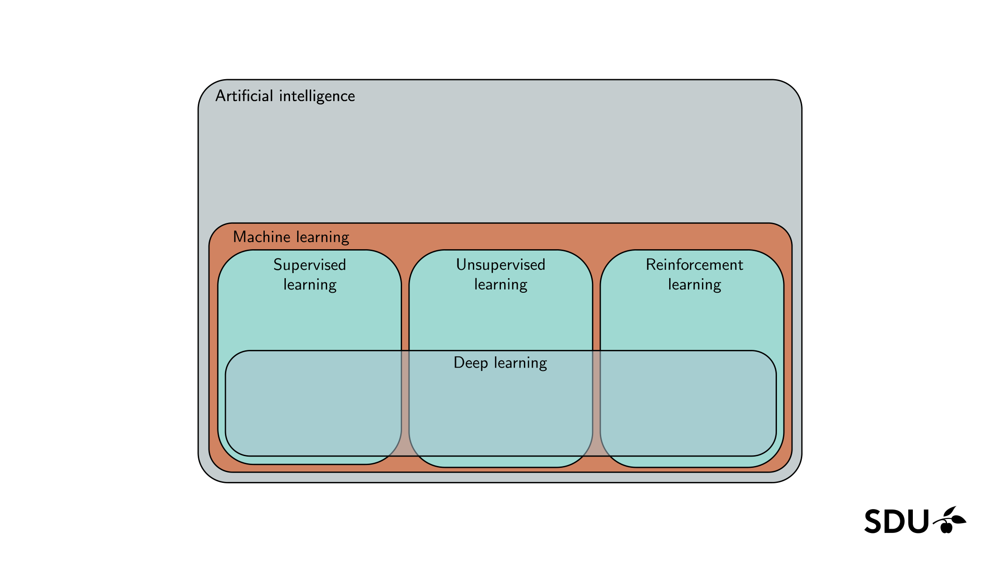
*Figure 1 — Machine learning is a subset of AI; Deep Learning is a set of techniques used inside every ML category. (Lecture 10, slide 3.)*

[Lecture 10, slides 1–3.]

---

## 2. The Big Picture — Analogies

Before any formalism, here is the mental model. Each analogy is the one to *recall* later when the formal definition feels abstract; each one ends with where the analogy breaks down so you do not over-extrapolate it.

### Supervised learning is like studying with an answer key

You are handed flashcards where the front shows a question (the input) and the back shows the answer (the label). You go through the deck, guess the back from the front, and the answer key tells you whether you were right. After enough flashcards your guesses get reliable, and when a new card with no back arrives — a real exam question — you can still produce an answer.

*Where it breaks down:* a human student understands *why* the answer is correct; a supervised learner only fits a function that matches the labels. Give a supervised model an unlabelled "exam" question outside the distribution of its flashcards (a Chinese question after studying English flashcards) and it will confidently produce nonsense.

### Unsupervised learning is like sorting laundry without knowing the categories

You pour a basket of mixed clothes onto a bed. Nobody tells you which clothes "go together" — no labels. But you notice that some are dark, some are pale; some are heavy denim, some are thin cotton; some smell of perfume, some don't. You make piles based on *similarity* and *difference*, even though no one defined "pile" for you.

*Where it breaks down:* you (the human) bring outside knowledge about what categories are useful (dark / light wash, hot / cold cycle). An unsupervised algorithm only sees raw features — it might cleanly cluster the laundry by *colour* when you actually wanted clusters by *fabric*. The clusters that emerge depend entirely on what features you give the algorithm and which distance metric you use.

### Reinforcement learning is like learning a video game without reading the manual

Nobody hands you flashcards. You press buttons, the screen reacts, sometimes the score goes up, sometimes a monster eats you. After many lives you learn which buttons-in-which-situations make the score go up. There is no labelled "the right move from this exact screen is button A" — only delayed, noisy feedback through the score.

*Where it breaks down:* a real player can also *imagine* counterfactual moves ("if I had jumped earlier..."); standard RL only learns from outcomes it actually observed. The chess example on slide 6 also simplifies the reward signal — a real chess RL agent must also handle sparse, delayed wins/losses, not just per-piece reward (slide 7 already raises this stochasticity caveat).

### Classification is like deciding "which bin does this go in?"

The post office sorts every letter into city-based bins. Each new letter is examined (address, zip code, weight) and dropped into exactly one bin out of a finite list. That is multi-class classification. Binary classification is the same, but only two bins (spam / not-spam).

*Where it breaks down:* the post office can return-to-sender or hold for further inspection; many real classifiers cannot say "I don't know" — they will always pick a bin. We address that with class-probability outputs and confidence thresholds, not in the bare framework on slide 18.

### Regression is like predicting tomorrow's temperature

A weather app eats today's inputs (today's temperature, humidity, pressure, wind) and produces a single real-valued number: tomorrow's noon temperature. The number is continuous — anything from −10.2°C to 32.7°C — not a category. A regression model behaves the same way: given a feature vector it predicts a real number, not a discrete label.

*Where it breaks down:* the prediction is not bounded the way a thermostat dial is. Without explicit constraints, a regression model will happily predict "negative human height" or "120°C summer day" if your test point is far outside the training range.

### A decision tree is like a game of 20 questions

Each internal node asks one yes/no (or category) question about the input, and each branch is a possible answer. After at most a handful of questions you reach a leaf, which is the prediction. The interpretation is so direct that you can read it back to a domain expert and they can immediately argue with it.

*Where it breaks down:* a human playing 20 questions is *strategic* — they pick the next question to halve the remaining possibilities, accounting for prior probability of each answer. A vanilla decision tree (Hunt's algorithm) is *greedy*: at each step it picks the locally-best split, never looking ahead. That is why two different decision trees can fit the same data (slide 23) and why post-pruning exists.

### A random forest is like asking many slightly-different experts and taking the majority vote

You have an unusual medical symptom. You ask twenty different doctors — each was trained at a different hospital, on slightly different patients, and you only let each one see part of your chart. You take the majority of their diagnoses as your final answer. Any single doctor might be confidently wrong, but the chance that *most* of them happen to be wrong in the same way is small.

*Where it breaks down:* the doctors in a random forest are not independent (they all use decision trees), so when the *data* itself is biased, all of them inherit that bias. Ensembles reduce variance but cannot cure systematic bias from the data.

### Overfitting is like memorising answers instead of understanding the topic

A student who memorises every past-paper answer scores 100% on those exact papers and fails the moment the question is rephrased. A student who understood the underlying topic scores a bit worse on the past papers (because they still occasionally misremember) but much better on the real exam.

*Where it breaks down:* memorisation can sometimes *be* understanding for the right tasks (rote learning phone numbers). The analogy is specifically about *generalisation to unseen examples*, not about whether memorising is ever good.

### Gini, entropy, and misclassification error are like "how messy is this drawer?"

A drawer with only socks is tidy (impurity = 0). A drawer with half-socks-half-pens is the messiest possible (impurity = max). Splitting on an attribute is like separating one big messy drawer into two smaller drawers — we want the *weighted average* mess of the two new drawers to drop as much as possible. The three measures (Gini, entropy, classification error) are three slightly-different ways to score "messiness"; **for a two-class drawer** they all peak at the 50/50 mix and all hit zero at a pure drawer. For more classes they all peak at the uniform mix (1/$n_c$ per class) instead, but the qualitative picture is the same. Their *shapes* differ — see Figure 16 in §5.9.

*Where it breaks down:* a real drawer has a finite number of items; in classification we score *proportions*, which can be more granular than physical items.

[Lecture 10, slides 1–60 — analogies map across the whole deck.]

---

## 3. Core Concepts

### 3.1 Three branches of machine learning

Machine learning is split by *what kind of feedback the learner gets*:

- **Supervised learning** — the training data consists of *(input, output)* pairs. The model learns the mapping from input to output and then predicts outputs for new inputs [Lecture 10, slides 8–9, 17–19]. Recall the *studying-with-answer-key* analogy in §2.
- **Unsupervised learning** — the training data consists of inputs only; no labels. The learner discovers structure (clusters, outliers, generating distribution, missing entries) [Lecture 10, slide 4]. Recall the *sorting-laundry* analogy.
- **Reinforcement learning (RL)** — there is no fixed dataset at all. The learner is an agent that interacts with an *environment* defined by a set of states, a set of actions, and a set of rewards. Its goal is to choose actions that maximise long-term rewards. It *gathers its own data* by acting [Lecture 10, slides 5–7]. Recall the *video-game-without-the-manual* analogy.

RL has three structural difficulties (slide 7) that supervised and unsupervised do not:

1. **Stochasticity.** Identical actions in identical states may yield different next-states or different rewards (e.g. chess opponents).
2. **Temporal credit assignment.** A reward arrives long after the action that caused it; the algorithm must figure out which earlier action deserves the credit.
3. **Exploration–exploitation trade-off.** Should the agent keep using a strategy it knows works ("exploit") or try a new strategy that *might* be better ("explore")? Always exploiting leaves the agent stuck at the first decent strategy; always exploring never lets it cash in on a discovery.

> Note: the slides also indicate (slide 3, Figure 1) that **deep learning** is a set of *techniques* (typically deep neural networks) used inside any of the three branches above — not a fourth branch.

[Lecture 10, slides 3–8.]

### 3.2 Supervised learning: equation, regression vs classification

A supervised learning model is "an equation relating input to output" [Lecture 10, slide 9]. Training is *searching* through a family of possible equations for the one that fits the (input, output) pairs best.

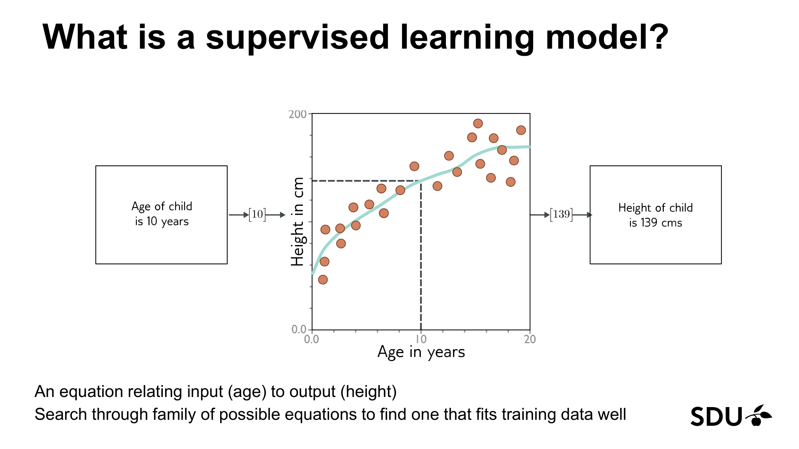
*Figure 2 — A supervised model is an equation: input → output. Training picks the best member of a family. (Lecture 10, slide 9.)*

Two binary distinctions cut across all supervised tasks [Lecture 10, slide 10]:

- **Regression** — the output is a **continuous** real value (age → height, advertising spend → sales). Predicts numbers.
- **Classification** — the output is one of a finite set of **discrete classes** (email → spam / not spam; image → cat / dog / bird).

And:

- **Univariate** — one output (height).
- **Multivariate** — more than one output (height *and* weight predicted jointly).

Within classification:

- **Binary (two-class)** — exactly two labels (slide 12, text classification spam vs ham).
- **Multi-class** — more than two labels (slide 13, music genre; slide 14, image classification).

These distinctions matter because the loss functions and evaluation metrics differ: classification uses accuracy / error rates / F1; regression uses sum of squared residuals / $R^2$ (see [L11 §3](L11-Regression.md)).

Examples shown in the slides [Lecture 10, slides 11–16]:

| Task | Output type | Model family named on slide |
|---|---|---|
| Predict height from age | Univariate regression | Fully-connected network |
| Spam / ham classification | Binary classification | Transformer |
| Music genre classification | Multi-class classification | Recurrent neural network |
| Image classification | Multi-class classification | Convolutional network |
| Image segmentation | Multivariate binary classification (per-pixel) | Conv encoder-decoder |
| Machine translation | Sequence output of discrete tokens — does not fit the regression/classification dichotomy on slide 10 | (slide gives no specific architecture) |

The neural-network families above are named for context only; this lecture builds out the *decision-tree* family of supervised classifiers in detail.

[Lecture 10, slides 8–17.]

### 3.3 Classification, formally

A **classification** task [Lecture 10, slide 18] is defined as follows:

- You are given a collection of records, called the **training set**. Each record contains a set of attributes; *one of the attributes is the class*. The class is what we want to predict.
- We **find a model for the class attribute as a function of the values of the other attributes**.
- The goal is that **previously unseen records should be assigned a class as accurately as possible**.
- A separate **test set** is used to estimate the model's accuracy on unseen data. The given dataset is normally split into training and test sets: the training set builds the model, the test set validates it.

Operationally, the classifier learns by **induction** from the training set and is then applied by **deduction** to new records (slide 19):

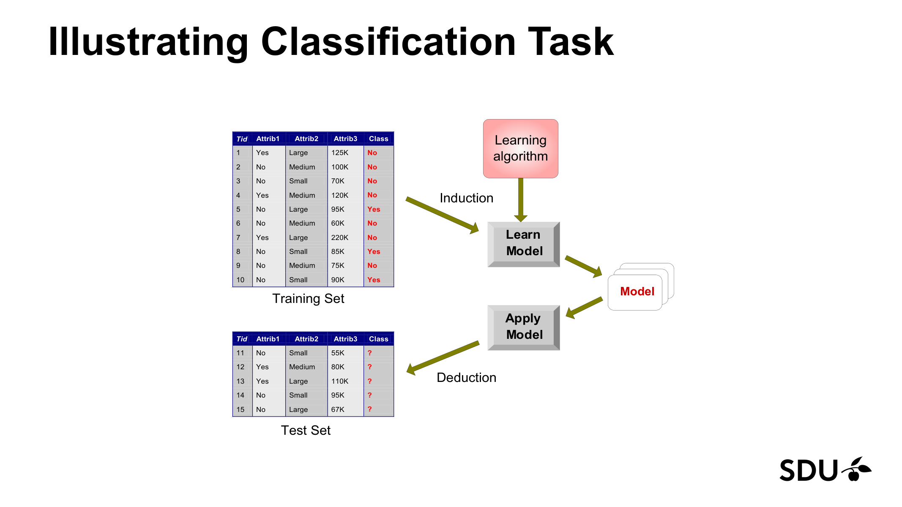
*Figure 3 — The induction/deduction cycle. The training set feeds a learning algorithm that produces a model; the model is applied to unlabelled test records to predict their classes. (Lecture 10, slide 19.)*

A classifier obeys a **train/test split**: the rows used to fit the model are **disjoint** from the rows used to evaluate it. Evaluating on training rows would just tell us how well the model memorised them, not how well it generalises (which is exactly what §6 will formalise as overfitting).

### 3.4 Common classification techniques

The slides survey the field [Lecture 10, slide 20]:

- **Rule-based methods** — explicit IF–THEN rules learned from data.
- **Distance / similarity-based methods** (e.g. k-Nearest Neighbour) — classify a new point by looking at its closest training points.
- **Decision-tree based methods** — the core of this lecture, §4 onwards.
- **Probabilistic methods** — Naive Bayes (see [L09a §6](L09a-Bayesian-Networks.md)) and Bayesian Belief Networks.
- **Support Vector Machines (SVMs).**
- **Artificial Neural Networks** — slide-mentions; deep learning lives here.
- **Ensemble methods** — Bagging, Boosting.
- **Random Forest.**
- **AdaBoost, CatBoost, XGBoost** — modern boosting variants, named only.

Bagging, random forest, and ensembles are revisited in §4.9 and §8.

### 3.5 Decision tree (informal)

A **decision tree** is a tree-shaped classifier where:

- Each **internal node** tests one attribute (e.g. "Is Marital Status = Married?").
- Each **branch** from that node corresponds to a value (or value-range) of that attribute.
- Each **leaf** holds a class label (the prediction).

To classify a new record: start at the root, walk down the branch matching the record's attribute value, and return the leaf's label.

Slide 22 shows a tree for the *cheat-on-taxes* dataset:

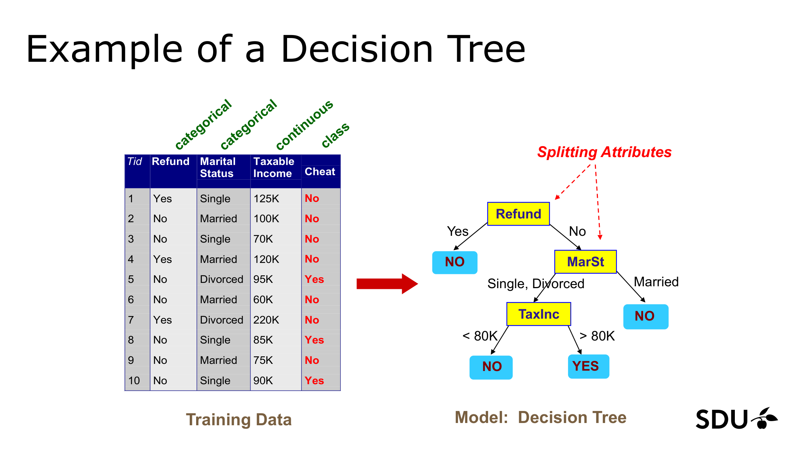
*Figure 4 — Example of a decision tree learnt from the cheat dataset; the rectangles labelled in yellow are the **splitting attributes**. (Lecture 10, slide 22.)*

A critical observation [Lecture 10, slide 23]: **there can be more than one tree that fits the same data**. The slide demonstrates this by giving an alternative tree on the same training set:

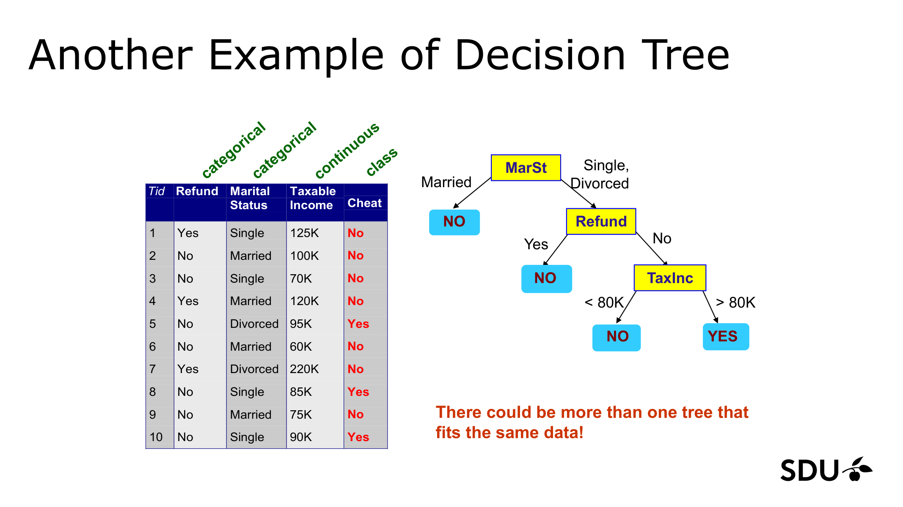
*Figure 5 — A different but equally-valid tree on the same training set. The tree you get depends on the order in which attributes are selected. (Lecture 10, slide 23.)*

That is why we need a principled **splitting criterion** (Gini / entropy / error) to choose which attribute to put at each node — see §4.

[Lecture 10, slides 18–23.]

---

## 4. Algorithms / Methods

### 4.1 The classification workflow

Decision-tree classification follows the standard induction/deduction loop. Training is **tree induction** (§4.2). Deployment is **tree application** (§5.2).

### 4.2 Tree induction algorithms

The slides name many tree-induction algorithms [Lecture 10, slide 32]:

- **Hunt's algorithm** — the earliest and the conceptual template the others extend.
- **CART** — Classification And Regression Trees (uses Gini).
- **ID3, C4.5** — Quinlan's algorithms (use entropy / information gain).
- **SLIQ, SPRINT** — efficient variants designed for large datasets.

Hunt's algorithm is the one the slides develop in detail. Let $D_t$ denote the set of training records that reach node $t$. The general procedure is recursive [Lecture 10, slide 33]:

1. If $D_t$ contains records that all **belong to the same class** $y_t$, then $t$ is a **leaf node** labelled $y_t$.
2. If $D_t$ is **empty**, then $t$ is a leaf node labelled by the **default class** $y_d$ (often the majority class of the parent).
3. Otherwise, $D_t$ contains records of more than one class. Choose an **attribute test** that splits $D_t$ into smaller subsets, and **recursively apply the same procedure** to each subset.

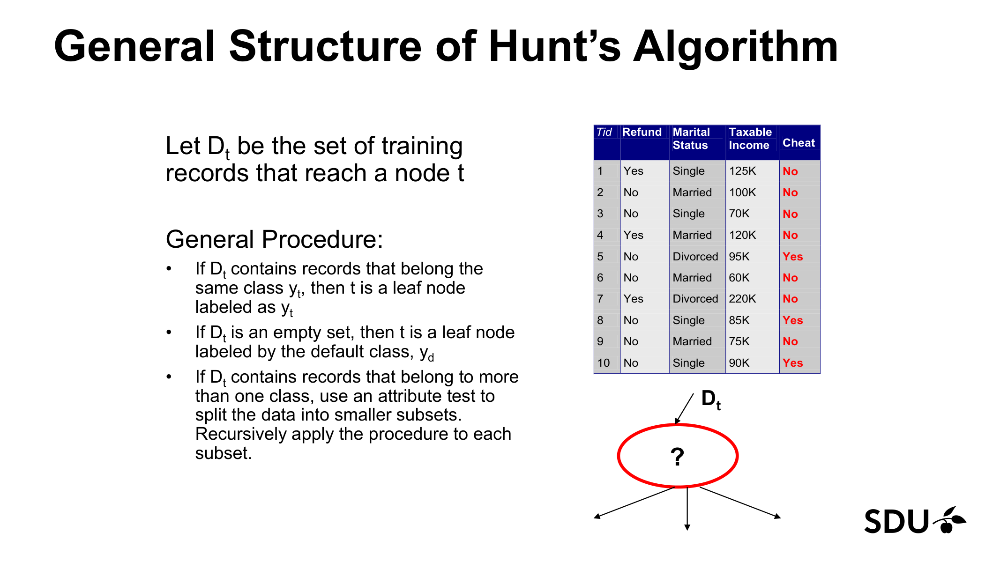
*Figure 6 — Hunt's algorithm: at each node, either declare a leaf (pure class or empty) or split and recurse. (Lecture 10, slide 33.)*

Step 3 hides everything that matters: how do we *choose* the attribute? That is the **best-split** problem (§4.4).

### 4.3 How to split: nominal, ordinal, and continuous attributes

When we decide to split node $t$ on attribute $A$, we need to declare *what the partitions are* [Lecture 10, slides 36–37].

**Nominal / ordinal (categorical) attributes** — two options:

- **Multi-way split.** Use as many partitions as distinct values: e.g. Size ∈ {Small, Medium, Large} → three branches; CarType ∈ {Family, Sports, Luxury} → three branches.
- **Binary split.** Split the values into two subsets. For Size you might choose `{Small, Medium}` vs `{Large}`, or `{Small, Large}` vs `{Medium}`, etc. Finding the optimal partition into two subsets requires checking all $2^{k-1}-1$ non-trivial partitions of $k$ values.

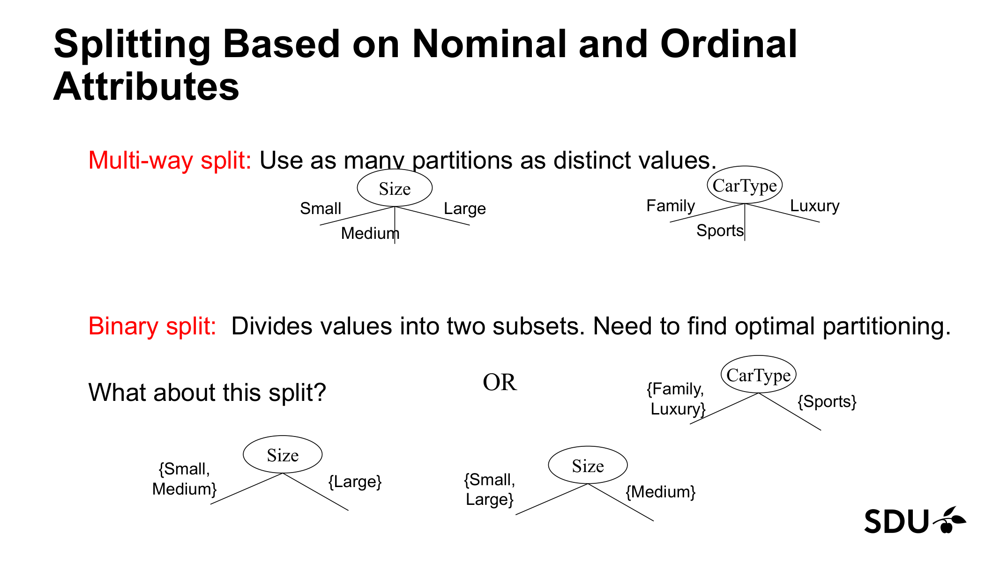
*Figure 7 — Multi-way vs binary splits on a categorical attribute. (Lecture 10, slide 36.)*

**Continuous attributes** [Lecture 10, slide 37] — two strategies:

- **Discretisation.** Turn the continuous attribute into an ordinal one by bucketing values. Bucketing can be *static* (done once before tree induction) or *dynamic* (computed at each node by equal-interval bucketing, equal-frequency bucketing / percentiles, or clustering).
- **Binary decision.** Choose a threshold $v$ and split on $A < v$ vs $A \geq v$. Considers all possible splits and picks the best one. More expensive to compute (you scan every distinct attribute value, see §4.5).

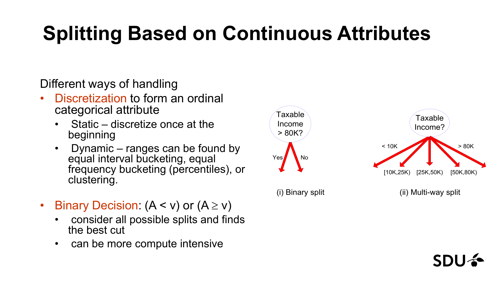
*Figure 8 — Binary vs multi-way splits on a continuous attribute. (Lecture 10, slide 37.)*

### 4.4 How to find the *best* split — impurity framework

Why do we even need an impurity measure? Slide 38 lays out three candidate tests on the same training set (10 records of class 0, 10 of class 1):

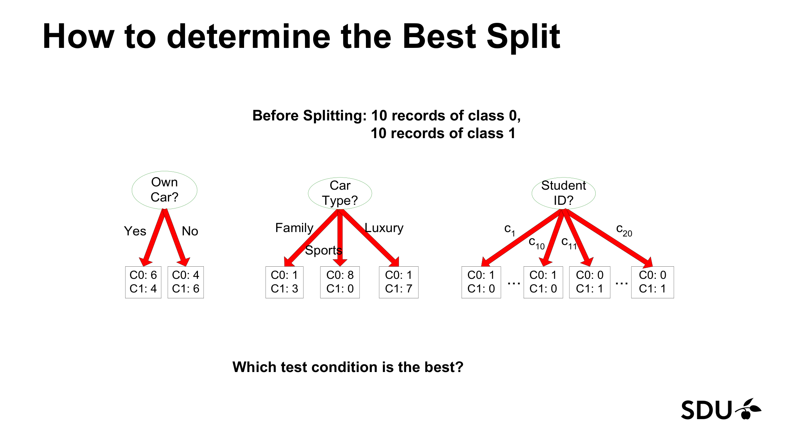
*Figure 9 — Which test condition is the best? A greedy splitter has to compare candidates. (Lecture 10, slide 38.)*

Intuition [Lecture 10, slide 39]: a **homogeneous** (pure) child node — every record in the child shares one class — is preferable because we can confidently assign that class. A **non-homogeneous** child (e.g. 5 / 5 mix) is uninformative.

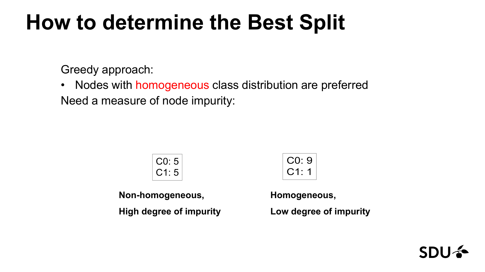
*Figure 10 — Low impurity (homogeneous) vs high impurity (non-homogeneous) child distributions. (Lecture 10, slide 39.)*

The candidate-split framework [Lecture 10, slide 41] is:

- Let $M_0$ be the impurity of the parent node *before* splitting.
- Let $M_1, M_2, \dots, M_k$ be the impurities of the children after a candidate split.
- Let $M_{1\dots k}$ be the **weighted average** of the children's impurities, weighting by their record counts.
- The **gain** of the split is $M_0 - M_{1\dots k}$.
- Greedy tree induction: at each node, try every candidate split and pick the one with the **highest gain** (equivalently, the lowest weighted child impurity).

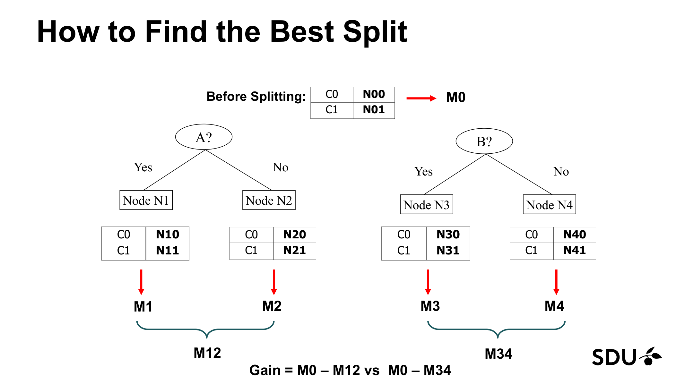
*Figure 11 — The best-split framework: rank candidate splits by the impurity drop $M_0 - M_{1 \dots k}$. (Lecture 10, slide 41.)*

We now need a concrete impurity measure. The slides cover **three** (slide 40): Gini index, entropy, and misclassification (classification) error.

### 4.5 Gini impurity

At a node $t$, let $p(j \mid t)$ denote the relative frequency of class $j$ at that node. The **Gini index** is [Lecture 10, slide 42]:

$$\operatorname{Gini}(t) = 1 - \sum_{j} \bigl[ p(j \mid t) \bigr]^{2}$$

Properties:

- **Minimum (0)** when all records belong to one class — the node is **pure**.
- **Maximum** $(1 - 1/n_c)$ when records are evenly distributed across the $n_c$ classes — the node is the most-impure possible. For a two-class node the maximum is $0.5$.

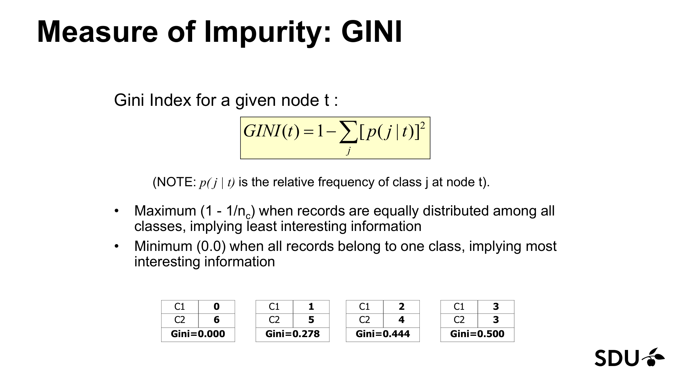
*Figure 12 — Gini values for four 6-record nodes. The 50/50 node has the maximum Gini. (Lecture 10, slide 42.)*

When a node $p$ is split into $k$ partitions (children), the **weighted Gini** of the split is [Lecture 10, slide 44]:

$$\operatorname{Gini}_{\text{split}} = \sum_{i=1}^{k} \frac{n_i}{n} \, \operatorname{Gini}(i)$$

where $n_i$ is the number of records at child $i$ and $n$ is the number at the parent. Used by CART, SLIQ, SPRINT.

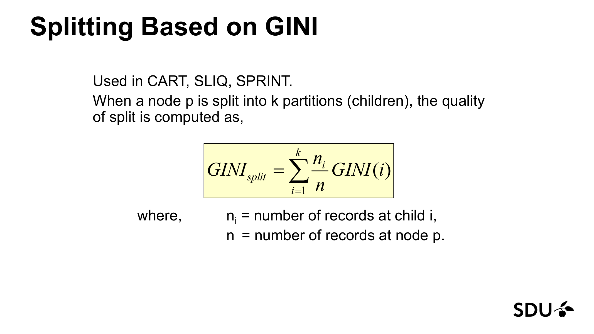
*Figure 12b — Splitting based on Gini: weighted average of child Gini, weighted by child record counts. (Lecture 10, slide 44.)*

**Computing Gini for a continuous attribute.** Naive method [Lecture 10, slide 46]: for each candidate threshold $v$ (the slides use the distinct values seen in the data plus the midpoints between adjacent values), scan the whole database, gather the count matrix for $A < v$ and $A \geq v$, compute the Gini, and keep the best $v$. This is correct but $O(N^2)$ — much wasted recomputation.

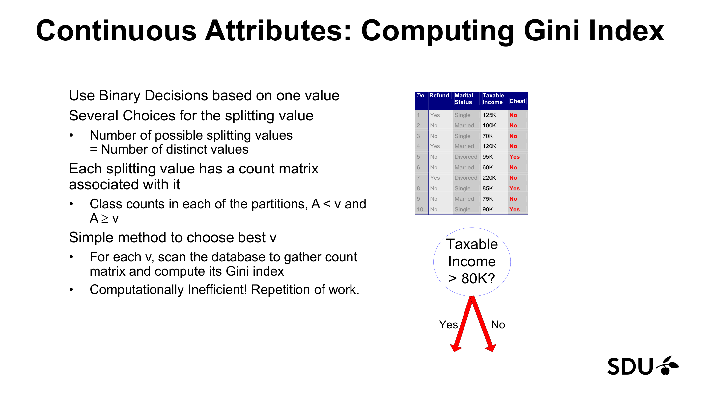
*Figure 13 — The naive (slow) way to evaluate a continuous-attribute split: scan the database once per candidate threshold. (Lecture 10, slide 46.)*

**Efficient sorted-scan method** [Lecture 10, slide 47]:

1. **Sort** the records by the attribute value.
2. **Linearly scan** them in order, **incrementally updating** the count matrix as each record's class moves from the "$\geq v$" side to the "$< v$" side.
3. At each candidate split position, compute the Gini index in $O(1)$ from the running counts.
4. **Pick the split position with the lowest Gini.**

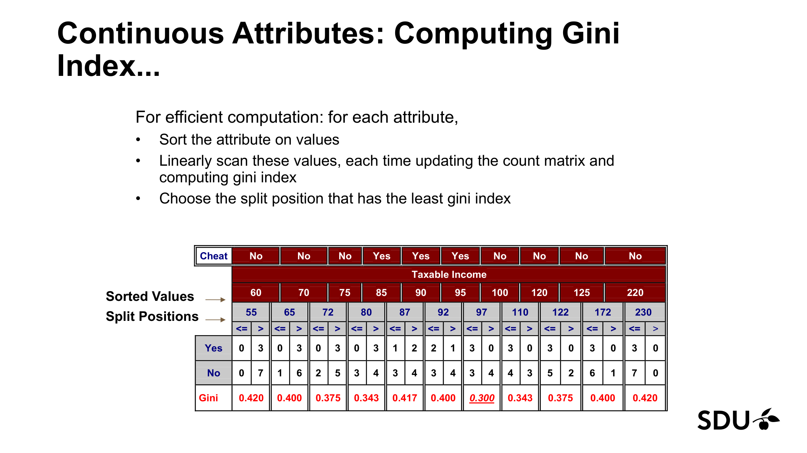
*Figure 14 — Efficient continuous-attribute Gini scan: sort once, scan once, find the minimum. (Lecture 10, slide 47.)*

The minimum Gini in Figure 14 is **0.300** at the threshold around **97** (between the sorted values 95K and 100K), where the left/right class counts are `(Yes=3, No=3)` vs `(Yes=0, No=4)`. That is the best split point for `Taxable Income`. (See §5.6 for the full table of every candidate threshold.)

### 4.6 Entropy

Entropy is the information-theoretic impurity measure [Lecture 10, slide 48]:

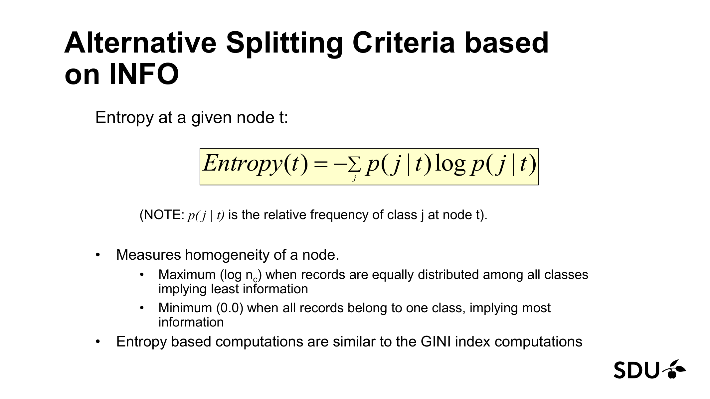
*Figure 12d — Entropy as a measure of node impurity. (Lecture 10, slide 48.)*

$$\operatorname{Entropy}(t) = -\sum_{j} p(j \mid t) \, \log_2 p(j \mid t)$$

(by convention $0 \log 0 = 0$). Properties:

- **Minimum (0)** when all records belong to one class.
- **Maximum** ($\log_2 n_c$) when records are evenly distributed across the $n_c$ classes. For a two-class node the maximum is $\log_2 2 = 1$.

The **information gain** of a split is the drop in entropy:

$$\operatorname{IG} = \operatorname{Entropy}(\text{parent}) - \sum_i \frac{n_i}{n} \operatorname{Entropy}(\text{child}_i)$$

ID3 and C4.5 maximise information gain at each node. The mechanics are identical to Gini (slide 48 notes: "Entropy based computations are similar to the GINI index computations") — the only difference is which impurity formula goes into the framework of §4.4.

### 4.7 Classification error (misclassification error)

The third impurity measure [Lecture 10, slide 50]:

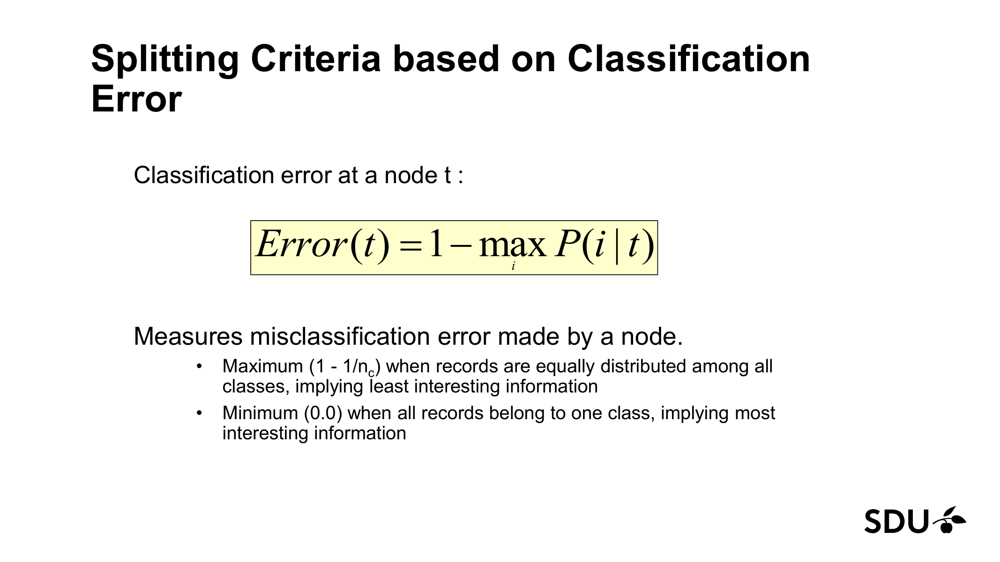
*Figure 12f — Classification (misclassification) error as a measure of node impurity. (Lecture 10, slide 50.)*

$$\operatorname{Error}(t) = 1 - \max_{i} P(i \mid t)$$

If the most-common class at node $t$ has probability $0.7$, the error is $0.3$. Properties match Gini's:

- **Minimum (0)** when all records belong to one class.
- **Maximum** $(1 - 1/n_c)$ at the uniform distribution. For a two-class node the maximum is $0.5$.

### 4.8 Stopping criteria

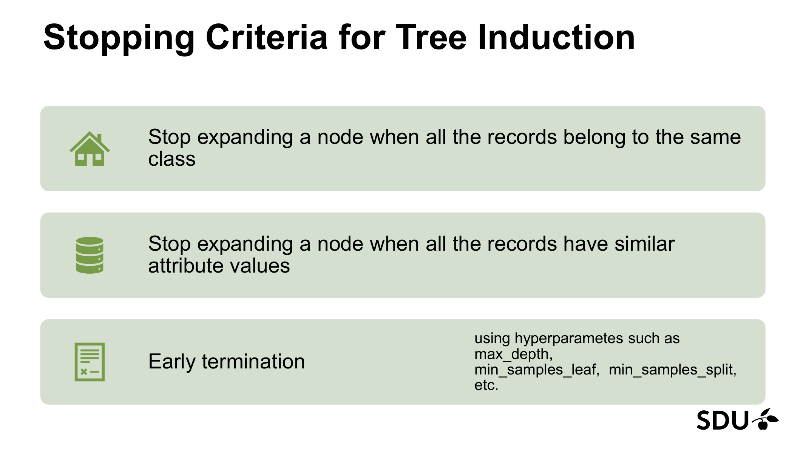
*Figure 12h — Stopping criteria for Hunt's algorithm. (Lecture 10, slide 53.)*

Without stopping, Hunt's algorithm would split until every leaf is perfectly pure, which is exactly the overfitting recipe of §6. The slides give four conditions [Lecture 10, slide 53]:

- Stop expanding a node when **all the records belong to the same class** (i.e. node is pure).
- Stop expanding a node when **all the records have similar attribute values** (no informative split available).
- **Early termination using hyperparameters**, which are pre-set numbers the tree-builder respects:
  - `max_depth` — the maximum allowed depth from root to leaf.
  - `min_samples_leaf` — the minimum number of training records a leaf may contain.
  - `min_samples_split` — the minimum number of records a node must have before it is even considered for splitting.

Together with the post-hoc pruning techniques in §6, these are the dials a practitioner turns to balance under- and overfitting.

### 4.9 Ensemble methods

> **Note — beyond the deck.** Slide 20 only *names* "Ensemble Methods (Bagging, Boosting), Random Forest, AdaBoost, CatBoost, XGBoost" as one bullet on the Classification-Techniques list. None of these methods are derived in the lecture. The descriptions below are added for this chapter because **ML Lab 1 (Classification)** uses `RandomForestClassifier` and you need a working mental model of bagging to tune `n_estimators`. Treat them as the chapter author's background gloss, not as lecture content the examiner can quote.

A single decision tree is interpretable but high-variance: a small change in training data can change which attribute wins at the root, producing a different tree (Figure 5 in §3.5). An **ensemble method** [Lecture 10, slide 20] combines many models so individual variance cancels out.

- **Bagging (bootstrap aggregating).** Draw many bootstrap samples (sample-with-replacement) from the training set. Train one decision tree per bootstrap sample. To predict, average (regression) or majority-vote (classification) the trees' outputs.
- **Random forest.** Bagging plus an extra randomisation: at *each split* of *each tree*, only a random subset of attributes is considered. This decorrelates the trees so the ensemble gains more than vanilla bagging.
- **Boosting** (AdaBoost, CatBoost, XGBoost) — listed but not derived in the deck. Conceptually (background, not on slides): train trees sequentially, each one focusing on examples the previous ones got wrong.

Recall the *many-doctors* analogy in §2 for random forest. The ML Lab 1 (Classification) lab is where you implement this: scikit-learn's `RandomForestClassifier(n_estimators=...)` builds the ensemble for you.

[Lecture 10, slides 20, 31–53.]

---

## 5. Worked Examples

### 5.1 The cheat-on-taxes dataset

The cheat dataset on slide 22 is the running example. The training set has 10 rows:

| Tid | Refund | Marital Status | Taxable Income | Cheat |
|-----|--------|----------------|----------------|-------|
| 1 | Yes | Single | 125K | No |
| 2 | No | Married | 100K | No |
| 3 | No | Single | 70K | No |
| 4 | Yes | Married | 120K | No |
| 5 | No | Divorced | 95K | Yes |
| 6 | No | Married | 60K | No |
| 7 | Yes | Divorced | 220K | No |
| 8 | No | Single | 85K | Yes |
| 9 | No | Married | 75K | No |
| 10 | No | Single | 90K | Yes |

The tree learned on this set is in Figure 4. The model is:

- Test **Refund**. If `Yes`, predict **No** (no cheaters refunded).
- Else test **Marital Status**. If `Married`, predict **No**.
- Else (`Single` or `Divorced`) test **Taxable Income**. If `< 80K`, predict **No**. Else predict **Yes**.

### 5.2 Applying the model to one test record

Slides 25–30 walk through a *single* test record being classified by the tree above. The record is:

| Refund | Marital Status | Taxable Income | Cheat |
|--------|----------------|----------------|-------|
| No | Married | 80K | ? |

Step-by-step traversal:

1. **Start from the root** (`Refund`). The record has Refund = No → take the right branch.
   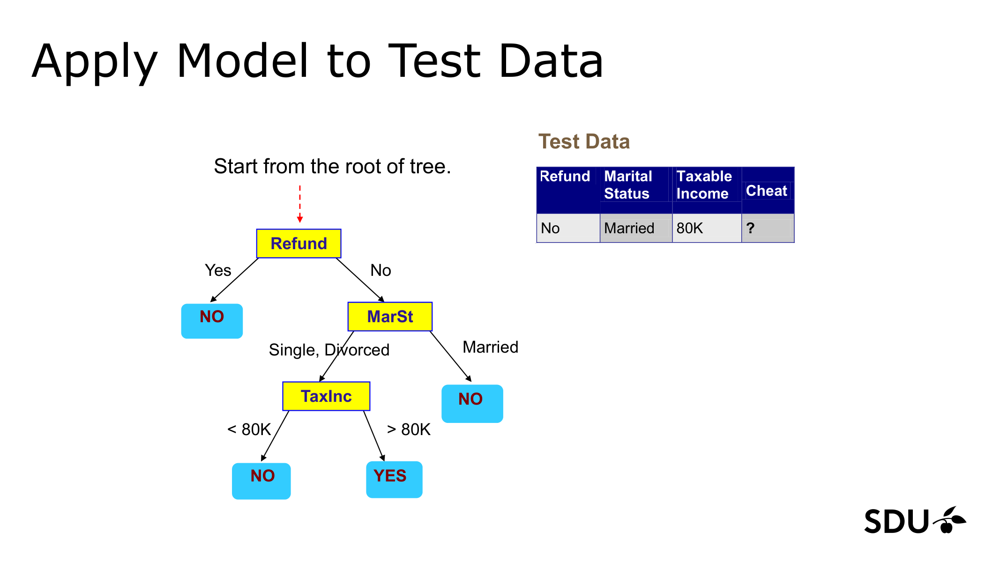
   *(Lecture 10, slide 25.)*
2. **Right child is MarSt.** The record has MarSt = Married → take the Married branch.
   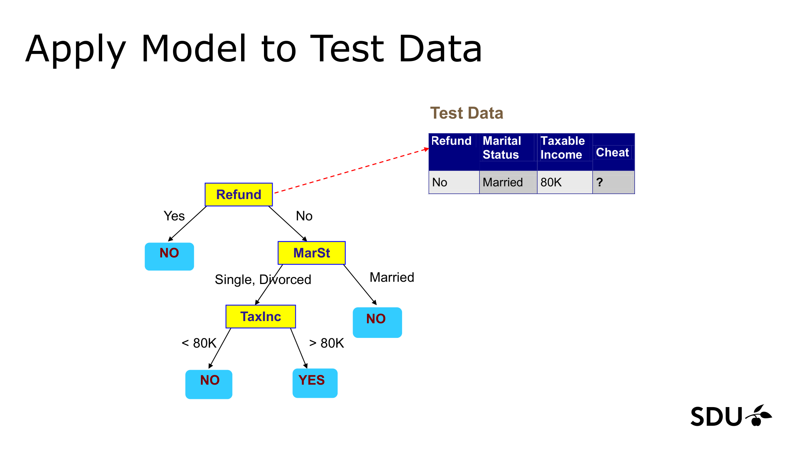
   *(Lecture 10, slide 26.)*
3. The Married branch leads directly to a **leaf labelled NO** (no further test needed: every "Refund=No, MarSt=Married" row in the training set was a non-cheater).
   
   *(Lecture 10, slide 27.)*
4. Slides 28–29 continue to emphasise the same step pictorially.
   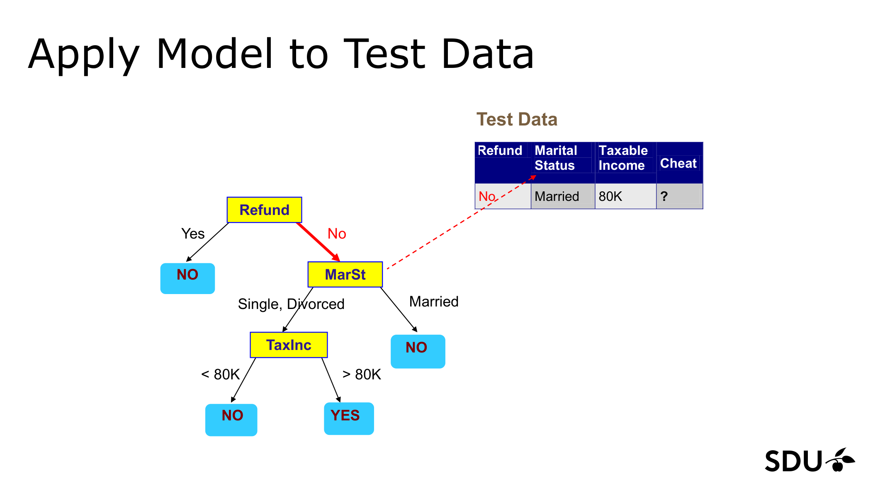
   *(Lecture 10, slide 28.)*
   
   *(Lecture 10, slide 29.)*
5. **Assign Cheat = No** to the test record [Lecture 10, slide 30].
   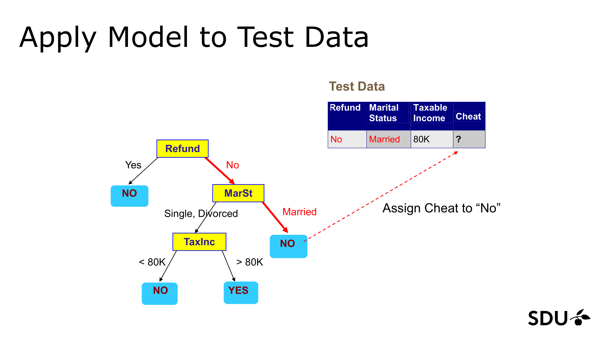
   *(Lecture 10, slide 30.)*

Notice that we never tested `Taxable Income` because the `MarSt = Married` path is a *terminal branch* of the tree on this particular training set. If the record had been `Refund=No, MarSt=Single, 80K`, we would have descended into the `TaxInc` test as well.

### 5.3 Hunt's algorithm worked through

Slide 34 walks Hunt's algorithm through the cheat dataset step by step:

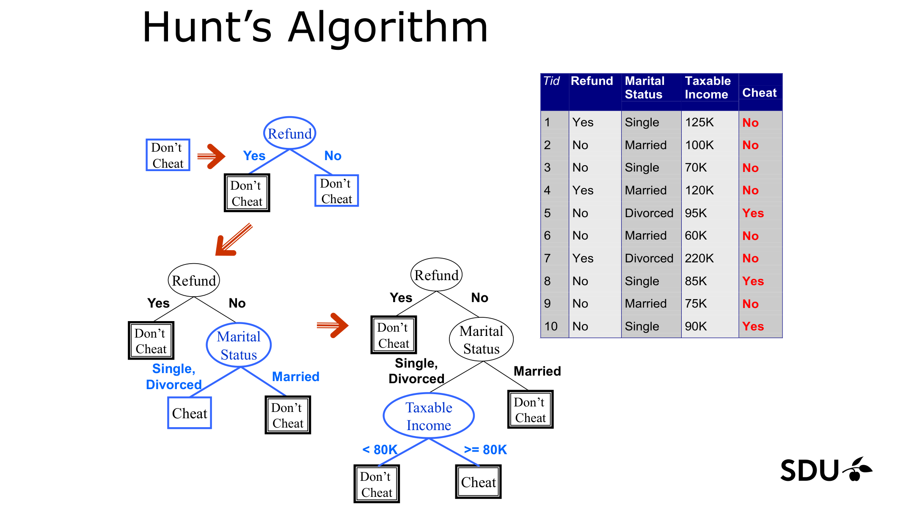
*Figure 15 — Hunt's algorithm growing the cheat-data tree in four steps. (Lecture 10, slide 34.)*

Reading the slide left-to-right:

1. **Start with one leaf**, "Don't Cheat" (the majority class — 7 of 10 rows are No-cheaters).
2. **Split on Refund.** The `Refund=Yes` rows (Tids 1, 4, 7) are all "No" → pure leaf "Don't Cheat". The `Refund=No` rows are mixed → keep going.
3. **Split the `Refund=No` subset on Marital Status.** The `Married` rows (Tids 2, 6, 9) are all "No" → pure leaf "Don't Cheat". The `Single, Divorced` rows are mixed → keep going.
4. **Split the `Refund=No, Single/Divorced` subset on Taxable Income** at threshold 80K. Below 80K (Tids 3) → "Don't Cheat". At or above 80K (Tids 5, 8, 10) → "Cheat". Now every leaf is pure; the algorithm terminates.

Each split was greedy: at each step the algorithm picks the attribute that most reduces impurity. The slide's chosen growth order is **Refund → MarSt → TaxInc**; the slide does not prove that this is the impurity-optimal order, only that it is one valid Hunt's-algorithm growth. (Recall slide 23 / Figure 5: a different growth order on the same data yields a different tree.)

### 5.4 Computing Gini on three small nodes

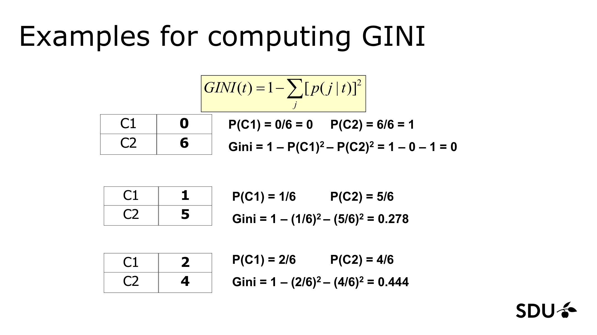
*Figure 12c — Worked Gini examples on three small nodes; the more balanced the node, the higher the Gini. (Lecture 10, slide 43.)*

From slide 43, three 6-record nodes:

- **Node A** has $C_1 = 0$, $C_2 = 6$.
  $P(C_1) = 0/6 = 0$, $P(C_2) = 6/6 = 1$.
  $\operatorname{Gini} = 1 - 0^2 - 1^2 = 0$. Pure node.
- **Node B** has $C_1 = 1$, $C_2 = 5$.
  $P(C_1) = 1/6$, $P(C_2) = 5/6$.
  $\operatorname{Gini} = 1 - (1/6)^2 - (5/6)^2 = 1 - 1/36 - 25/36 = 10/36 \approx 0.278$.
- **Node C** has $C_1 = 2$, $C_2 = 4$.
  $P(C_1) = 2/6$, $P(C_2) = 4/6$.
  $\operatorname{Gini} = 1 - (2/6)^2 - (4/6)^2 = 1 - 4/36 - 16/36 = 16/36 \approx 0.444$.

The more balanced the node, the higher the Gini. A 3-vs-3 split would give the two-class maximum of $0.5$.

### 5.5 Worked binary split (Gini)

Slide 45 builds a binary split for an attribute $B$ on a 12-record parent. Parent has $C_1 = 6, C_2 = 6$ so $\operatorname{Gini}(\text{parent}) = 1 - 0.5^2 - 0.5^2 = 0.500$.

The split sends 7 records to child $N_1$ with $(C_1 = 5, C_2 = 2)$ and 5 records to child $N_2$ with $(C_1 = 1, C_2 = 4)$.

- $\operatorname{Gini}(N_1) = 1 - (5/7)^2 - (2/7)^2 = 1 - 25/49 - 4/49 = 20/49 \approx 0.408$.
- $\operatorname{Gini}(N_2) = 1 - (1/5)^2 - (4/5)^2 = 1 - 1/25 - 16/25 = 8/25 = 0.320$.
- $\operatorname{Gini}_{\text{split}} = (7/12)(0.408) + (5/12)(0.320) = 0.238 + 0.133 = 0.371$.

Gain $= 0.500 - 0.371 = 0.129$. A second candidate split's gain would be compared against this number; the larger one wins.

### 5.6 Worked continuous-attribute scan

Slide 47 sorts the 10 Taxable Income values and walks through every candidate threshold. The Gini at each candidate split:

| Threshold position | Gini |
|---|---|
| ≤ 55 (everything on the right) | 0.420 |
| ≤ 65 | 0.400 |
| ≤ 72 | 0.375 |
| ≤ 80 | 0.343 |
| ≤ 87 | 0.417 |
| ≤ 92 | 0.400 |
| **≤ 97** | **0.300** |
| ≤ 110 | 0.343 |
| ≤ 122 | 0.375 |
| ≤ 172 | 0.400 |
| ≤ 230 | 0.420 |

The minimum is **0.300** at the threshold around 97 (between the 95K-Yes-cheater and the 100K-No row), so that is where Taxable Income should be split. Compare this against Gini-of-best-split for `Refund` and `MarSt` to decide which attribute to use at the parent.

### 5.7 Computing entropy on the same three nodes

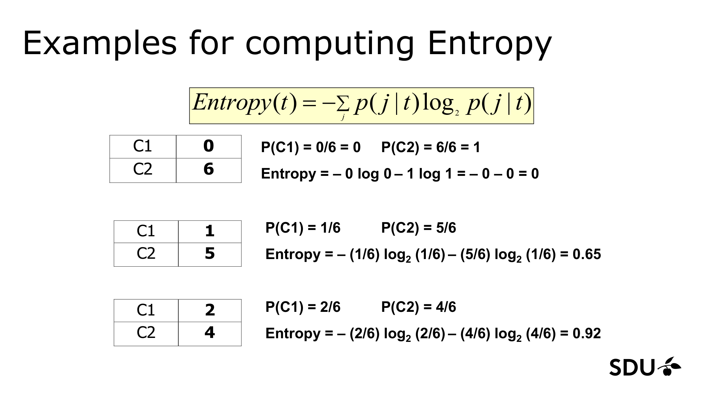
*Figure 12e — Worked entropy examples on the same three nodes as §5.4. (Lecture 10, slide 49.)*

Slide 49 redoes the §5.4 nodes with entropy. Recall $-0 \log 0 \equiv 0$.

- **Node A** ($0/6, 6/6$): $\operatorname{Entropy} = -0 \cdot \log 0 - 1 \cdot \log 1 = 0$.
- **Node B** ($1/6, 5/6$): $\operatorname{Entropy} = -\tfrac{1}{6}\log_{2}\tfrac{1}{6} - \tfrac{5}{6}\log_{2}\tfrac{5}{6} \approx 0.650$ (the slide rounds to $0.65$; a printing typo in the slide repeats `log2(1/6)` twice — the second factor should be `log2(5/6)`).
- **Node C** ($2/6, 4/6$): $\operatorname{Entropy} = -\tfrac{2}{6}\log_{2}\tfrac{2}{6} - \tfrac{4}{6}\log_{2}\tfrac{4}{6} \approx 0.918$ (slide rounds to $0.92$).

Compare the Gini and entropy curves on the same nodes: Node B (1/5 split) is Gini $\approx 0.278$, Entropy $\approx 0.65$; Node C (2/4 split) is Gini $\approx 0.444$, Entropy $\approx 0.92$. **Both measures peak at the same balance point** ($p = 0.5$) and both vanish at pure nodes; they just measure "impurity" with different magnitudes.

### 5.8 Computing classification error on the same three nodes

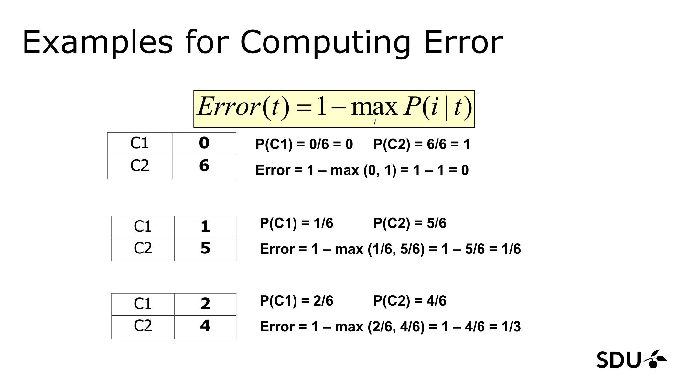
*Figure 12g — Worked classification-error examples on the same three nodes. (Lecture 10, slide 51.)*

Slide 51 redoes the same nodes with classification error:

- **Node A** ($0/6, 6/6$): $\operatorname{Error} = 1 - \max(0, 1) = 0$.
- **Node B** ($1/6, 5/6$): $\operatorname{Error} = 1 - \max(1/6, 5/6) = 1 - 5/6 = 1/6 \approx 0.167$.
- **Node C** ($2/6, 4/6$): $\operatorname{Error} = 1 - \max(2/6, 4/6) = 1 - 4/6 = 1/3 \approx 0.333$.

Same ordering (A < B < C) as Gini and entropy, but the magnitudes differ again. For a two-class problem, the formula simplifies to $\operatorname{Error}(t) = \min(p, 1-p)$ — a piecewise-linear function that rises linearly from 0 to 0.5 as $p$ moves from 0 to 0.5, then falls linearly back to 0 as $p$ moves from 0.5 to 1. That is the kink visible in Figure 16: classification error is a tent, Gini is a parabola, entropy is a smooth-arched curve.

### 5.9 Comparing the three impurity curves

![Plot of Entropy (red), Gini (blue), and Misclassification error (black) as functions of p ∈ [0, 1] for a two-class problem. Entropy peaks at 1.0 at p=0.5; Gini peaks at 0.5 at p=0.5; misclassification peaks at 0.5 at p=0.5 with a kink.](../extracted_figures/L10/fig16-page52-img1.png)
*Figure 16 — All three impurity measures for a 2-class problem agree on the location of pure (0, 1) and most-impure (0.5) nodes, but disagree on magnitude and curvature. Gini and entropy are smooth and convex; misclassification error is piecewise linear. In practice Gini and entropy almost always pick the same split. (Lecture 10, slide 52.)*

### 5.10 Multiple trees on the same data

The two trees in Figures 4 and 5 are both consistent with the cheat training set. Try to write down which records each tree predicts correctly:

- Both trees label every training row with the same `Cheat` value (because they were both fit to the same data) — but they would *generalise differently* on a test record. For example, the alternative tree (Figure 5) splits on `MarSt` first; on a test record with `Refund=No, MarSt=Single, 90K`, it might land at a different leaf than the Figure-4 tree depending on the exact subtree.

This non-uniqueness is exactly what motivates ensembles (§4.9): rather than agonise over which tree is "the" tree, train many and combine them.

[Lecture 10, slides 22–34, 42–51.]

---

## 6. Common Pitfalls / Exam Traps

### 6.1 Underfitting and overfitting

Two opposite failure modes [Lecture 10, slide 56]:

- **Underfitting** — the model is **too simple**; both training and test error are large. The model has not captured the structure in the data.
- **Overfitting** — the model is **more complex than necessary**. Training error keeps falling but **test error stops falling and starts rising**. The training error is no longer a reliable estimate of how well the tree will perform on unseen records.

The canonical diagnosis figure:

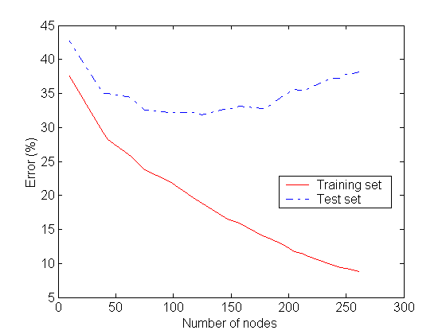
*Figure 17 — Training error decreases monotonically with tree size; test error has a U-shape. The minimum of the test curve is the sweet spot. (Lecture 10, slide 56.)*

This is the figure to recall whenever the exam asks "when is training error not enough?" — the answer is *always*, because the right-hand side of Figure 17 is unobservable from the training set alone.

### 6.2 Two distinct causes of overfitting

The slides separate them:

**Cause 1: Noise.** A single mislabelled or anomalous training point can distort the decision boundary if the tree is deep enough to chase it [Lecture 10, slide 57]:

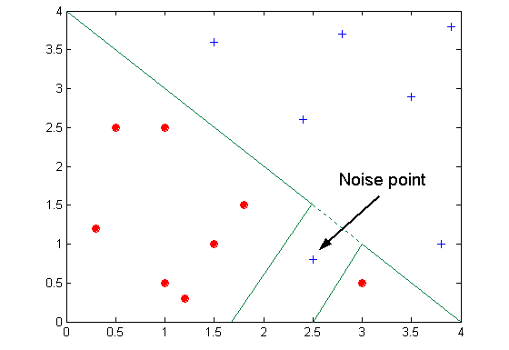
*Figure 18 — Overfitting due to noise: a single mislabelled point bends the boundary. (Lecture 10, slide 57.)*

**Cause 2: Insufficient examples.** Even with perfectly clean labels, regions of the feature space with too few training records will be classified by *whichever* nearby training records happen to be there — they may be irrelevant [Lecture 10, slide 58]:

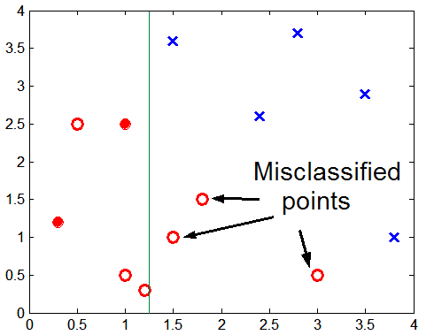
*Figure 19 — Overfitting due to insufficient examples: a sparse region inherits boundaries from a denser one. (Lecture 10, slide 58.)*

These two causes call for different fixes: noise rewards *simpler* models (pre/post-pruning); insufficient examples rewards *more data* (or transfer / data augmentation).

### 6.3 Addressing overfitting — pre- and post-pruning

**Pre-pruning** (early stopping rule) [Lecture 10, slide 59] stops the algorithm *before* the tree is fully grown:

- Stop if all instances at a node belong to the same class (the "pure" base case).
- Stop if all attribute values are the same (no informative split available).
- *More restrictive*:
  - Stop if the **number of instances** is less than a user-specified threshold (`min_samples_split`, `min_samples_leaf`).
  - Stop if the class distribution of the instances is **independent of the available features** (e.g. by a $\chi^2$ test for independence).
  - Stop if expanding the current node **does not improve impurity** (e.g. Gini or information gain falls below a threshold).

The risk of pre-pruning is what the chapter author calls the **horizon effect** (*beyond the deck — not named on any slide*): it might be that one more split *would* have unlocked a hugely informative second-level split, and pre-pruning never gets to find that out. Do not attribute the term "horizon effect" to the lecturer on an exam.

**Post-pruning** [Lecture 10, slide 60] is the opposite approach:

- **Grow the decision tree to its entirety** (i.e. each leaf is pure).
- **Trim the nodes** in a **bottom-up** fashion: replace a subtree by a leaf node if the **generalisation error improves** after trimming.
- The leaf's class label is the **majority class** of the instances that the subtree used to cover.
- Pruning decisions can be driven by **Minimum Description Length (MDL)** or **Cost Complexity Pruning** (the `ccp_alpha` hyperparameter in scikit-learn's `DecisionTreeClassifier`).

Post-pruning is typically more accurate than pre-pruning because it has seen the fully-grown tree before deciding what to keep — but it is more expensive.

### 6.4 Decision-tree advantages and limitations

From slide 54 (advantages):

- **Inexpensive to construct** (linear in $N \log N$ for sorted continuous attributes).
- **Extremely fast at classifying unknown records** (one traversal: $O(\text{depth})$ comparisons).
- **Easy to interpret** for small-sized trees (you can literally read the rules off the tree).
- **Accuracy is comparable** to other classification techniques for many simple datasets.

Limitations (implicit in §6.1–6.3 and the impurity curves):

- High variance — small data changes change the tree (motivates ensembles).
- Greedy — local choice may not be globally optimal.
- Bias toward attributes with **more values** *(background — not stated as such on slides)*: slide 38 shows the `Student ID?` split as one of three candidates (with a perfectly pure child for every student) but does not formally resolve why this split is undesirable. The well-known explanation — information gain rewards high-cardinality splits because each child's entropy is near zero by accident, even though the split is useless for unseen IDs — is the chapter author's gloss. The remedy (C4.5's **information gain ratio**) is also not on the slides; do not attribute either to the lecturer on an exam.

### 6.5 Common exam mistakes

- **Confusing train and test error.** Training error always falls with more model capacity. Only test error tells you about generalisation. A model with zero training error and 40% test error is overfit.
- **Computing Gini with wrong probabilities.** $p(j \mid t)$ is the *relative frequency at node $t$*, not the global class prior. Restart from $n_{i}/n_{t}$ for each node.
- **Forgetting the weighting in $\operatorname{Gini}_{\text{split}}$.** It is the weighted average over children, not the unweighted average. A pure child with one record is not as important as an impure child with 100.
- **Treating "more than one tree fits" as a bug.** It is fundamental (slide 23); the trees agree on training rows but can disagree on test rows. Different splitting orders → different trees.
- **Forgetting that `Refund=Yes` and `Refund=No` are both *categorical* values** — the binary split on Refund is implicit because Refund has only two values. A trinary categorical attribute would force a choice between multi-way and binary splits (§4.3).
- **Choosing too-deep trees for tiny datasets.** Section 6.2 cause 2: in tiny regions of feature space the tree picks up noise from irrelevant nearby points.
- **Confusing entropy and information gain.** *Entropy* is a measure of a single node's impurity. *Information gain* is the parent's entropy minus the weighted entropy of the children. ID3 uses information gain to choose a split, not entropy alone.

[Lecture 10, slides 53–60.]

---

## 7. Connections to Other Lectures

### Back-references (concepts L10 uses but did not introduce)

- **Agent / learning agent** — the [L02 Agents §3](L02-Agents.md) framing of a *learning agent* (a performance element fed by a learning element) is exactly what L10 makes concrete. Every ML algorithm in this lecture is one way to build the *learning element* inside that architecture.
- **Naive Bayes classifier** — listed on slide 20 as a "Probabilistic Methods" classifier. Defined in [L09a §6 — Naive Bayes](L09a-Bayesian-Networks.md). The conditional-independence assumption that powers Naive Bayes is also from L09a.
- **Bayesian Networks** — slide 20 names "Bayesian Belief Networks" as a classifier; the BN machinery is [L09a §3–§5](L09a-Bayesian-Networks.md).
- **Random variables** — every classifier feature is a random variable in the L09a sense.
- **Conditional probability** — $p(j \mid t)$ in every impurity formula is a conditional probability ([L09a §3](L09a-Bayesian-Networks.md)).
- **Discrete vs continuous environment property** — the supervised-learning regression/classification distinction is the same distinction as discrete-vs-continuous outputs from [L02 §4](L02-Agents.md).
- **Deterministic vs stochastic** — RL on slide 7 explicitly inherits stochasticity from [L02 §4](L02-Agents.md).

### Forward-references (concepts L10 introduces and later lectures reuse)

- **Supervised learning, classification, regression** — [L11 Regression](L11-Regression.md) builds the regression specialisation (continuous output).
- **Unsupervised learning, clustering** — [L12 Clustering](L12-Clustering.md) builds the clustering specialisation.
- **Training set, test set, overfitting** — both [L11 §6](L11-Regression.md) (multicollinearity, variable selection) and [L12](L12-Clustering.md) (selecting $K$) use the same generalisation logic.
- **Decision tree, random forest** — used directly in **ML Lab 1 — Classification** (`lab1_classification_handout.ipynb`), where you fit `DecisionTreeClassifier` and `RandomForestClassifier` and tune their hyperparameters (`max_depth`, `n_estimators`).

### Lab handoff

This lecture is the **foundation for ML Lab 1 (Classification)**. The lab uses:

- The train/test split logic from §3.3.
- `DecisionTreeClassifier(max_depth=...)` from §4.5 + §4.8 + §6.3 (`max_depth` is the pre-pruning knob).
- `RandomForestClassifier(n_estimators=..., max_depth=...)` from §4.9.
- The overfitting diagnosis from §6.1 (compare training vs test accuracy as `max_depth` grows).

The exam variants for ML Lab 1 (in `study/_exam/MLLab1-Classification/variants.md`) are all KNOB tweaks on these hyperparameters.

[Cross-references derived from `study/_shared/cross-references.md`.]

---

## 8. Cheat-Sheet Summary

One-page recap for last-minute review. Every line carries an italic analogy reminder where one was given in §2.

**Three branches**

- **Supervised** — *(input, output)* pairs; predict output for new inputs. *Studying with an answer key.*
- **Unsupervised** — inputs only; discover structure. *Sorting laundry without knowing the categories.*
- **Reinforcement** — states, actions, rewards; gather data by acting. *Learning a video game without the manual.* Difficulties: stochastic, temporal credit assignment, exploration–exploitation.

**Supervised sub-types**

- **Regression** — continuous output. *Predicting tomorrow's temperature.*
- **Classification** — discrete output. *Sorting letters into post-office bins.* Binary (2 classes) vs multi-class.
- **Univariate** vs **Multivariate** — one vs many outputs.

**Classification setup**

- **Training set** — labelled records used to fit the model (induction).
- **Test set** — disjoint set of labelled records used to estimate accuracy (deduction).
- Goal: low error on **unseen** records.

**Decision tree** — *20 questions.*

- Internal node = attribute test. Branch = value. Leaf = predicted class.
- Multiple valid trees exist for the same data.
- Apply: walk root → leaf; output the leaf label.

**Tree induction** — Hunt's recursive procedure:

1. Pure $D_t$ → leaf labelled with that class.
2. Empty $D_t$ → leaf labelled default class.
3. Mixed $D_t$ → split on best attribute, recurse.

**Splitting** — nominal (multi-way or binary), continuous (discretise or threshold $A < v$).

**Best split = max impurity drop $M_0 - M_{1\dots k}$** where $M_{1\dots k} = \sum_i (n_i / n) M_i$ is the weighted child impurity.

**Three impurity measures** (at node $t$, $p_j = p(j \mid t)$):

| Measure | Formula | Min | Max (2-class) |
|---|---|---|---|
| **Gini** | $1 - \sum_j p_j^2$ | 0 (pure) | $0.5$ |
| **Entropy** | $-\sum_j p_j \log_2 p_j$ | 0 (pure) | $1$ |
| **Classification error** | $1 - \max_i p_i$ | 0 (pure) | $0.5$ |

*All three are "how messy is this drawer?" — they peak at 50/50, vanish at pure.*

**Information gain** = $\operatorname{Entropy}(\text{parent}) - \sum_i (n_i/n) \operatorname{Entropy}(\text{child}_i)$. Used by ID3 / C4.5.

**Algorithms named** — Hunt's (template), CART (Gini), ID3 / C4.5 (entropy / info gain), SLIQ / SPRINT (scalable variants).

**Stopping criteria**

- Pure node, similar attribute values.
- Hyperparameters: `max_depth`, `min_samples_leaf`, `min_samples_split`.

**Overfitting** — *memorising past papers instead of understanding.* Training error keeps dropping; test error U-shapes. Two causes: **noise** and **insufficient examples**.

**Pre-pruning** — stop early (cheap, may horizon-effect).

**Post-pruning** — grow to entirety, trim bottom-up if generalisation improves. Use MDL or cost-complexity (`ccp_alpha`).

**Ensembles** — *many slightly-different experts voting.*

- **Bagging** — bootstrap samples + average / vote.
- **Random forest** — bagging + random attribute subset per split.
- **Boosting** (AdaBoost, CatBoost, XGBoost) — train sequentially on residual errors.

**Decision-tree pros** — cheap, fast at classify time, interpretable, comparable accuracy on simple data.

**Decision-tree cons** — high variance, greedy, biased toward high-cardinality attributes.

---

*Source: Lecture 10 slides 1–61.*
