# Lecture 11: Regression

> **Reading time:** ~50 min
> **Prereqs:** [L10 — Intro to ML](L10-Intro-to-ML.md) (especially supervised learning, training/test split, overfitting).
> **Glossary terms introduced:** linear regression, ordinary least squares (OLS), residual, intercept, slope, sum of squares (SST / SSE / SSR), $R^2$, adjusted $R^2$, p-value, confidence interval, dummy variable, interaction term, multicollinearity, polynomial regression (forward-reference only).

## 1. Overview & Motivation

Regression is the supervised-learning task whose target variable is **continuous**: predict a number, not a category. In the L10 taxonomy, classification spits out a label ("spam / not spam"), while regression spits out a quantity ("price = €243,500"). L11 is the first lecture in the course that drills into a concrete supervised algorithm end-to-end: data → equation → goodness-of-fit → interpretation → variable selection.

Why the course covers it at this point:

1. It is the simplest non-trivial supervised model: one or more numeric inputs, a linear equation, a closed-form fit. Everything more powerful (logistic regression, neural nets, gradient boosting) is best understood by first nailing the linear case.
2. It is the workhorse of business analytics. The lecture is framed around real decisions: "should we spend more on advertising?", "should we add another bathroom to a house?", "is there gender pay discrimination at this firm?" Each question becomes a coefficient and a p-value.
3. It introduces a vocabulary — residual, $R^2$, p-value, confidence interval, dummy variable, interaction term, multicollinearity — that recurs across every later quantitative method.

What L11 **does** cover (the source slides cap out at 48):
- Simple and multiple **linear regression**.
- **Ordinary Least Squares** as the fitting principle: minimise the sum of squared residuals.
- Interpretation of intercept and slope coefficients in context.
- Goodness-of-fit: $R^2$ and adjusted $R^2$ via the SST = SSR + SSE decomposition.
- Statistical significance via p-values; practical importance via 95% confidence intervals.
- Two recipes for making linear regression more flexible: **dummy variables** (categoricals encoded as 0/1 columns) and **interaction terms** (the row-by-row product of two predictors).
- **Multicollinearity** — what goes wrong when two predictors carry near-identical information — and how to diagnose it with correlation tables.

What L11 **does not** cover (explicitly flagged so you know where to look):
- **No gradient descent.** The slides treat OLS as a black-box closed-form solve; the iterative-optimisation perspective belongs to ML Lab 2 — Regression.
- **No mean-squared error (MSE) or root-mean-squared error (RMSE) by name.** The slides use the un-normalised sums SSE / SST / SSR and the ratio $R^2$. MSE = SSE/$n$; RMSE = $\sqrt{\text{MSE}}$. These metric names appear in ML Lab 2.
- **No polynomial regression** is formally derived. The lecture's "flexible regression models" section (slides 22–46) is about dummies and interactions, not about adding $x^2, x^3, \dots$ as features. The variant-bank for ML Lab 2 includes a "higher polynomial degree" variant, so the lab notebook fills this gap.
- **No learning rate, epoch, regularisation (ridge / lasso), or train/validation/test discipline.** These are ML Lab 2 territory.
- **No matrix-form derivation** ($\hat\beta = (X^\top X)^{-1} X^\top y$). The slides stay in scalar form for one or two predictors and lean on R output for everything bigger.

Use this chapter as the conceptual study guide for the exam, and use ML Lab 2 — Regression for the missing computational details.

[Lecture 11, slides 1–48]

---

## 2. The Big Picture — Analogies

Read this section first. The §3 formalism is much easier to absorb once you have a picture in your head for each concept.

- **Linear regression is like drawing a single straight flight path on a 2-D chart of cities.** Each city sits at a longitude (x) and at some altitude (y) on the chart; the flight path is a straight line on that chart. You cannot pass over every city exactly, so you compromise — picking the route that *on average* misses the least. The intercept is the altitude where the path crosses zero longitude; the slope is how many altitude units you gain per degree east. *Where it breaks down:* the analogy makes the line look like a physical object you draw on a map, when really it is the solution to a mathematical optimisation; and "cities" in higher-dimensional problems live in many more dimensions than a 2-D chart can render.

- **A residual is how far each city sits above or below the flight path on the chart.** If a city sits exactly on the path it has zero residual; if it sits *above* the line ($y_i > \hat y_i$) it has a large positive residual; *below* the line ($y_i < \hat y_i$) gives a negative residual. *Where it breaks down:* residuals are *signed*, so the "distance" intuition is only correct after squaring. (Forget compass directions like "south"; the sign is determined by the chart's y-axis, not by geography.)

- **Ordinary Least Squares (OLS) is like choosing the flight path that minimises the sum of squared city-offsets.** Squaring matters: a city 10 km off the path counts not twice but **four times** as much as a city 5 km off. OLS therefore weights large misses much more heavily than small ones, settling on the line that splits the difference between every "pull" the data exerts. *Where it breaks down:* a few extreme outliers can drag the whole line; this is why "robust regression" exists, though the L11 slides do not derive it.

- **$R^2$ is the share of the data's spread that the flight path absorbs.** Picture the altitudes as a shotgun blast on a target — wide spread = lots of variability, tight cluster = little. With **no model**, your only prediction for any city's altitude is the average altitude $\bar y$, and the total spread is SST. With the regression line, each city's deviation from $\bar y$ is split into "the part the line explains" (down to the line, summed and squared = SSR) and "the part it doesn't" (the residual to the line, summed and squared = SSE). $R^2 = \text{SSR}/\text{SST}$ is the fraction of the original spread the model absorbed. *Where it breaks down:* $R^2$ never goes down when you add a predictor, even a meaningless one (more on this in §3.7). Adjusted $R^2$ patches that.

- **A p-value is the probability that the predictor's apparent effect is just random noise dressed up to look like a real signal.** Imagine the "true" universe in which advertising has zero effect on sales; the p-value asks: how often, in that fake universe, would I see a slope at least as extreme as the one I just estimated, purely by random chance? If the answer is 1 in 100 (p = 0.01), the predictor is convincingly non-zero (noise *rarely* dresses up that well); if the answer is 1 in 3 (p = 0.33), the slope I saw is well within "random noise" range. *Where it breaks down:* p-values say nothing about whether the effect is **practically** important — that is what confidence intervals are for. (Avoid the inverted reading: a *small* p-value does **not** mean the effect is an illusion — it means the opposite.)

- **A 95% confidence interval is a dart-throw target ring around the true slope.** Each re-sample of the data is a new dart thrown at the true (unknown) slope; build the interval $\hat b \pm 2 \cdot \text{SE}(\hat b)$ around your estimate, and across many re-samples roughly 95 out of every 100 such intervals will land covering the true value. Concretely, if your business decision needs the slope to be at least 6000 and the lower end of the interval is 3649, the decision is *not* safe even though the point estimate (7883) clears the bar — the dart-spread reaches below the threshold too often. *Where it breaks down:* the "95%" interpretation is over the *procedure* across many re-samples, not over the probability that this particular interval contains the true slope — a subtle but classical statistician's footnote.

- **A dummy variable is like a light switch wired to a fixed bonus inside the equation.** When the switch is on (e.g. Male = 1) the wired-in bonus (e.g. + \$16,591) is added to the prediction; when off (Male = 0), no bonus. The regression equation has only one extra term whose value flips between 0 and "the bonus" depending on which group the row belongs to. *Where it breaks down:* if a categorical has $k$ levels, you wire in only $k-1$ switches (not $k$) — the "off-on-all-switches" state is reserved as the baseline and absorbed by the intercept. Wiring in a switch for every level produces the "dummy-variable trap" of perfect multicollinearity — see §3.10 and §3.12.

- **An interaction term is a throttle on the slope: the dummy decides whether the throttle is engaged, and the interaction coefficient is how much extra rise-per-year the throttle delivers when on.** Pure dummies (light switches above) say "men and women have parallel salary-vs-experience lines, just at different heights." That is unrealistic if men's pay grows *faster* per year. The interaction term Male × Experience throttles the experience slope upward only for male rows (Male = 1), tilting the male line steeper than the female line. *Where it breaks down:* every throttle you add doubles the headcount of coefficients to interpret, and small interaction p-values can be hard to estimate stably with little data.

- **Multicollinearity is two passports for the same person.** If you include both `Height in metres` and `Height in centimetres` as predictors, the algorithm cannot tell which one is "doing the work" — both carry identical information. The coefficients become unstable: small jiggles in the data swing them wildly, sometimes flipping their signs. *Where it breaks down:* perfect collinearity (correlation = 1) is impossible to fit at all (the math breaks); near-collinearity (correlation 0.9-ish) is the everyday version that gets diagnosed via correlation tables.

[Lecture 11, slides 1–48]

---

## 3. Core Concepts

### 3.1 What is a model? Predictive modelling.

A **model** is an abstraction of (or approximation to) reality that lets you separate data into a predictable part and an unpredictable part. By learning from patterns in past data, we hope to predict future data. Concretely, the lecture takes a model to be a **mathematical equation** of the form *output = (something) of inputs*.

Why models matter: business decisions are bets on the future. "How many customers will visit my store tomorrow?", "Should I manufacture 1,000 or 10,000 phones?", "Will the value of stock A go up tomorrow if I invest today?" — every one of these is a prediction problem.

The regression idea, in one sentence: **assume the output depends linearly on the inputs**, then find the linear coefficients that best fit the observed data.

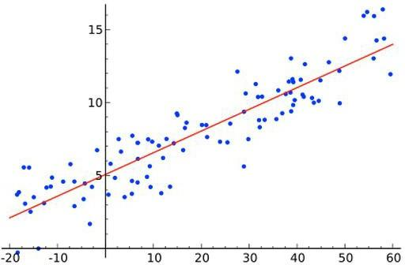
_Figure 9: A scatter of $(x, y)$ pairs and a fitted line. Regression is the procedure that turns the scatter into the line. (Lecture 11, slide 9.)_

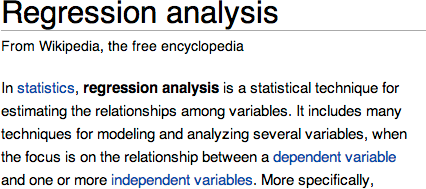
_Figure 10: For the record, the textbook definition — "a statistical technique for estimating the relationships among variables." The lecture displays it once as a sanity-check. We use the more compact definition above. (Lecture 11, slide 9.)_

> The slides quote a Wikipedia screenshot as the formal definition. We treat that as background; the operational definition is "fit a linear equation by minimising squared residuals."

**Where the name "regression" comes from.** The lecture's slide 9 also flashes the cover of Francis Galton's 1889 book *Natural Inheritance*. Galton studied the heights of fathers and sons and observed that very tall fathers tend to have sons who are *closer to the population mean* than the fathers themselves — sons "regress toward mediocrity," in his Victorian phrasing. That biological observation is now called **regression to the mean** and has nothing operationally to do with OLS, but the *word* "regression" entered statistics from Galton's study and stuck. So when this lecture says "linear regression," we are using a centuries-old name for "fit a line by least squares." Exam-style note: a question on "etymology of the term regression" expects the Galton answer.

[Lecture 11, slides 2–9]

### 3.2 Linear regression — the simple (one-predictor) case

The **simple linear regression** model is

$$y = a + b\,x$$

where $y$ is the response (the thing you predict), $x$ is the predictor (the thing you measure), $a$ is the **intercept** (the value of $y$ when $x = 0$), and $b$ is the **slope** (how much $y$ changes per one-unit change in $x$).

The lecture's running example begins with a soft-drink dataset: each row is one sales region, with the dollars spent on advertising in that region and the resulting sales.

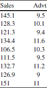
_Figure 4: The first nine rows of the running soft-drink example. (Lecture 11, slide 4.)_

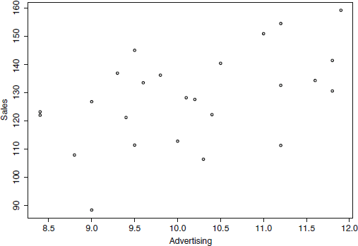
_Figure 5: A look at the raw data, before fitting any model. The question "is there a positive relationship between advertising and sales?" is one your eyes can already begin to answer. (Lecture 11, slide 5.)_

Slide 6 supposes a hypothetical model
$$\text{Sales} = \$10{,}000 + 5 \times \text{Advertising}$$
which would mean: with zero advertising, sales would still be \$10,000 (the intercept) and every additional advertising dollar would buy \$5 of sales (the slope). The lecture stresses that *the quality of the prediction depends on the quality of the model* — bad data in, bad predictions out.

The fitting problem: which $a$ and $b$ make the line best match the data? Three candidate lines through the same scatter all look plausible until you measure their fit numerically:

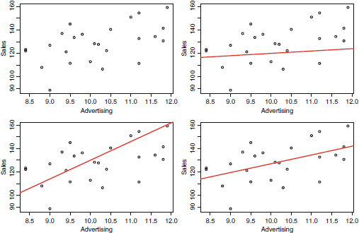
_Figure 8: Three different lines fitted to the same scatter. Eyeballing is not enough; we need a numeric criterion for "best." (Lecture 11, slide 8.)_

Recall the **flight-path analogy** from §2: the line is the route, and we want the route that on average misses the cities by the least. The OLS criterion in §3.3 makes that precise.

[Lecture 11, slides 4–9]

### 3.3 Residuals and Ordinary Least Squares (OLS)

A **residual** is the gap between an observed value and the model's prediction:

$$r_i = y_i - \hat y_i$$

where $y_i$ is the actual response of the $i$-th row and $\hat y_i = a + b\,x_i$ is what the model predicts. Residuals can be positive (point above the line) or negative (point below).

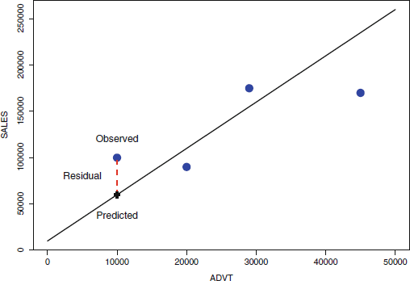
_Figure 12: The residual is the vertical gap between observed and predicted. OLS picks the line that makes the sum of these (squared) gaps as small as possible. (Lecture 11, slide 10.)_

The slide calls the criterion **least squares regression**: we pick the line that minimises

$$\text{SSE} = \sum_{i=1}^{n} (y_i - \hat y_i)^2 = \sum_{i=1}^{n} r_i^2.$$

Recall the **OLS-as-squared-penalty analogy** from §2: a residual of 10 counts not twice but four times as much as a residual of 5. Outliers therefore have disproportionate influence on the fit.

> **Why squared and not absolute residuals?** The lecture acknowledges that minimising $\sum |r_i|$ is *another* legitimate criterion (giving "least absolute deviation" regression), as are others. OLS is overwhelmingly the default because squaring (a) makes the problem differentiable in closed form, (b) gives more weight to large misses, and (c) produces statistical properties that line up with the Gaussian-noise assumption.

The lecture does **not** show the closed-form solution. For one predictor it is
$$\hat b = \frac{\sum_i (x_i - \bar x)(y_i - \bar y)}{\sum_i (x_i - \bar x)^2},\qquad \hat a = \bar y - \hat b\,\bar x.$$
ML Lab 2 derives this (and the matrix-form generalisation $\hat\beta = (X^\top X)^{-1} X^\top y$) and shows how iterative methods (gradient descent) reach the same answer without inverting matrices.

[Lecture 11, slide 10]

### 3.4 Interpreting intercept and slope

After fitting the soft-drink example, the lecture obtains
$$\text{Sales} = 51.849 + 7.527 \times \text{Advertising}.$$


_Figure 13: The fitted OLS line for the soft-drink data. (Lecture 11, slide 11.)_

**Unit convention used in the soft-drink example.** The slide displays the data as raw numbers (Advertising values like 9.5, 10.1; Sales values like 145.1, 128.3) without explicit units. The lecture interprets one numeric Advertising unit as "one thousand dollars of ad spend" and one numeric Sales unit as "one thousand units sold" — i.e. **Advertising in \$ thousands, Sales in thousands of units**. We use that convention throughout. (The slide-11 verbal interpretation "for every \$1 increase in advertising sales increase by \$7.527" is a *slide-loose* phrasing — strictly the slope is per *one numeric Advertising unit* = \$1,000 of ad spend, not per raw \$1. We make this explicit below.)

Interpretation:

- **Intercept $\hat a = 51.849$.** This is the predicted Sales when Advertising is **zero** — about 51,849 units sold even with no advertising spend in the region.
  > **Extrapolation warning (read this every time you interpret an intercept).** The intercept is only meaningful if $x = 0$ is inside (or near) the observed data range. The soft-drink advertising values are roughly $[8.5, 12]$ (in \$ thousands) — **Advertising = 0 is well outside that range**, so the intercept's literal reading ("predicted sales with no advertising at all") is an extrapolation, not an interpolation. Real businesses rarely test the "no advertising" regime; the regression cannot speak with confidence about a corner of the input space it has never observed. The same caveat applies to any prediction $\hat y$ for an $x$ outside the training range. (See §6 Pitfall 7 for the general statement.)
- **Slope $\hat b = 7.527$.** For every **one-unit** (= \$1,000) increase in advertising, sales increase by **about 7,527 units** *on average*. Equivalently, every additional \$1 of ad spend buys roughly 7.527 additional units of sales on average. The "on average" is doing work: any single region will be off the line by a residual.

[Lecture 11, slide 11]

### 3.5 Sum-of-squares decomposition: SST = SSR + SSE

We have a fitted line. How good is the fit? The lecture builds the answer in three steps.

**Step 1 — Total variability before any model: SST.** Imagine you have **no model** — your only forecast for any region is the overall mean $\bar y$. Each region's "miss" is then $y_i - \bar y$. Square and sum:

$$\text{SST} = \sum_{i=1}^{n} (y_i - \bar y)^2.$$

The **Total Sum of Squares** is proportional to the sample variance and quantifies *the total uncertainty / variability in the response*. SST is the modelling benchmark: every model must beat the "predict the mean" baseline.

**Step 2 — Variability still unexplained after the model: SSE.** Once we use the fitted line, each region's miss is the residual $y_i - \hat y_i$. Square and sum:

$$\text{SSE} = \sum_{i=1}^{n} (y_i - \hat y_i)^2.$$

The **Error Sum of Squares** measures how much variability the model has *failed* to model away. (This is the same SSE that OLS minimises in §3.3.)

**Step 3 — Variability that the model captured: SSR.** What the regression actually managed to explain is the difference between the total and the leftover:

$$\text{SSR} = \text{SST} - \text{SSE}.$$

The **Regression Sum of Squares** is the variability the regression "absorbed." There is also a **direct formula** for SSR — how far the fitted predictions $\hat y_i$ stray from the response mean $\bar y$:

$$\boxed{\,\text{SSR} = \sum_{i=1}^{n} (\hat y_i - \bar y)^2.\,}$$

> **Why are these two expressions equal?** Starting from $y_i - \bar y = (\hat y_i - \bar y) + (y_i - \hat y_i)$ and squaring and summing, the identity SST = SSR + SSE drops out **only if the cross-term** $2 \sum_i (\hat y_i - \bar y)(y_i - \hat y_i)$ **is zero**. That cross-term vanishing is a property of the **OLS normal equations** when the model includes an intercept: OLS forces the residuals to be orthogonal to every column of the design matrix (including the constant column, which makes $\sum_i (y_i - \hat y_i) = 0$, and the fitted-value column $\hat y$, which makes $\sum_i \hat y_i (y_i - \hat y_i) = 0$). The decomposition would **fail** for a different fitting criterion (e.g. least absolute deviations) or for a model without an intercept. So both forms of SSR coincide *because we are doing OLS with an intercept* — the standard L11 setup.

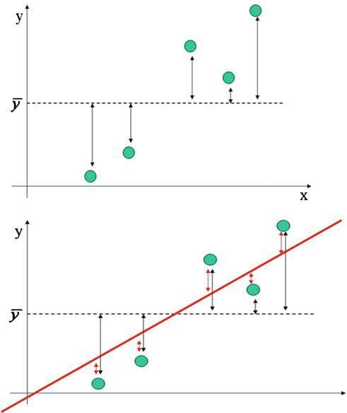
_Figure 15: The single most important diagram in the lecture. **Top**: with no model, every point's deviation is its distance from $\bar y$, and SST sums those squared distances. **Bottom**: with the regression line, each point splits its total deviation into two pieces — the part the line explains (the black arrow from $\bar y$ down to the line) and the part it does not (the red residual arrow from the line up to the point). Squaring and summing gives SST = SSR + SSE. (Lecture 11, slide 12.)_

### 3.6 R-squared ($R^2$)

The **coefficient of determination** is the proportion of total variability that the regression captures:

$$R^2 = \frac{\text{SSR}}{\text{SST}} = 1 - \frac{\text{SSE}}{\text{SST}}.$$

**Range of $R^2$ — read this carefully.** For an **OLS fit with an intercept evaluated on the training set**, $R^2 \in [0, 1]$ is *guaranteed* (the second form makes this obvious: $\text{SSE} \le \text{SST}$ because OLS+intercept is at least as good as the "predict $\bar y$" baseline). Outside that setup the bound can break:

- $R^2 = 0$: the model explains nothing — the regression line is no better than predicting $\bar y$ for every training point.
- $R^2 = 1$: the model passes through every training point exactly (SSE = 0). Suspicious in practice — usually a sign of overfitting or a coincidence with very few data points.
- **$R^2$ can be negative** on a *held-out test set* (or for a fit *without* an intercept). If your model predicts test values worse than just predicting the training mean $\bar y$, then $\text{SSE}_{\text{test}} > \text{SST}_{\text{test}}$ and $R^2_{\text{test}} < 0$. The lecture only displays training-set $R^2$, so the $[0,1]$ bound holds throughout the slides — but ML Lab 2 (which computes test-set $R^2$ on a train/test split) will let you see a negative $R^2$ in the wild. Exam-style question "Can $R^2$ be negative?" expects "Yes, on test data or for a no-intercept fit."

For the soft-drink example, the R output gives $R^2 = 0.2469$ — *the regression explains 24.69% of the variability in sales.*

**Is 24.69% good or bad?** Context-dependent:
- For a chemistry-lab experiment with tightly controlled inputs, $R^2 = 0.2469$ would be **outrageously poor** — chemists expect $R^2 > 0.95$.
- For a social-science study (e.g. predicting wages from education), $R^2 = 0.2469$ is **reasonably high** — human behaviour is noisy.

So $R^2$ is meaningful only relative to the discipline's norms.

Recall the **shotgun-spread analogy** from §2: $R^2$ is the share of the data's original spread your flight path absorbed.

[Lecture 11, slides 12–16]

### 3.7 Adjusted $R^2$ and comparing nested models

Slide 17 adds a second predictor, **Income** (the median household income in each sales region):

$$\text{Sales} = a + b_1 \times \text{Advertising} + b_2 \times \text{Income}.$$

The R output gives $R^2 = 0.4520$ — explanation rises from 24.69% to 45.20%. By the $R^2$ rule, the second model is better.

**But $R^2$ has a pathology**: *it never decreases when you add any predictor*, even one that is pure noise. Adding a "lucky number of the day" column to the regression will nudge $R^2$ up a tiny bit by sheer chance. So $R^2$ alone is *not* a fair way to compare models with different numbers of predictors.

**Adjusted $R^2$ fixes this** by penalising the model for the number of predictors. The slide quotes the Adjusted-$R^2$ values from R's output (0.2142, 0.4022, …) and asserts the property — **but does not print the underlying formula**. The standard expression (the one R itself uses to produce those numbers) is

$$R^2_{\text{adj}} = 1 - \frac{n-1}{n-p-1}\,(1 - R^2),$$

where $n$ is the sample size and $p$ is the number of predictors (the intercept is *not* counted in $p$; the residual degrees of freedom are $n - p - 1$).

> **EXTENSION — not on the slides.** Slide 18 only reports Adjusted-$R^2$ numbers from the R output; the formula above does not appear on any L11 slide. Memorise the *behaviour* ("penalises extra predictors; can decrease when a useless predictor is added") for safety; memorise the *formula* if you want full marks on a variant question that asks you to reproduce R's number.

**Why the $(n-1)/(n-p-1)$ multiplier is the right penalty.** The unexplained share $(1 - R^2)$ is the leftover spread the model failed to absorb. We multiply it by $(n-1)/(n-p-1)$: as $p$ grows, the denominator $n - p - 1$ shrinks, the multiplier swells above 1, and the inflated leftover drags Adjusted $R^2$ down. Raw $R^2$ would forgive every extra predictor; this multiplier *taxes* them. A useless extra predictor barely moves $R^2$ but bumps $p$, so $R^2_{\text{adj}}$ falls. A useful one raises $R^2$ enough to overcome the tax, so $R^2_{\text{adj}}$ rises.

**Sanity-checking the formula on the soft-drink table.** With $n = 25$ and Model 1 (ADVT only, $p = 1$, $R^2 = 0.2469$): $R^2_{\text{adj}} = 1 - (24/23)(1 - 0.2469) = 1 - 1.04348 \times 0.7531 = 0.2141$, which rounds to the **0.2142** R prints. With Model 2 ($p = 2$, $R^2 = 0.4520$): $R^2_{\text{adj}} = 1 - (24/22)(0.548) = 1 - 0.59782 = 0.4022$ ✓.

| Model | $n$ | $p$ | $R^2$ | Adjusted $R^2$ |
|---|---|---|---|---|
| Sales ~ ADVT | 25 | 1 | 0.2469 | 0.2142 |
| Sales ~ ADVT + INCOME | 25 | 2 | 0.4520 | 0.4022 |

(The Adjusted-$R^2$ values are visible in the R output of figures 18 and 19, §5.2.)

When comparing models, **report adjusted $R^2$**, not raw $R^2$.

[Lecture 11, slides 17–18]

### 3.8 Statistical significance: the p-value

R's `lm()` output reports a **p-value** for each coefficient. Slide 19 phrases the p-value as follows:

> *Slide 19's wording (quoted verbatim, but **technically incorrect** — see below):* "The p-value measures the probability that, given the current information, a particular predictor has no relationship with the response."

> ⚠ **This slide phrasing is the classical "inverse" misstatement of the p-value.** It conflates $P(\text{data} \mid H_0)$ with $P(H_0 \mid \text{data})$, which are not equal (this confusion is called the *prosecutor's fallacy* / *base-rate fallacy*). A frequentist p-value does **not** give the probability that $H_0$ is true given your data; you would need a Bayesian posterior for that, which requires a prior. A strict examiner will mark down a student who reproduces slide 19's phrasing as a *definition*. Use the corrected definition below.

**The correct definition.** A p-value is the probability of observing a coefficient *at least as extreme as the one estimated*, **assuming the true coefficient is zero** (the null hypothesis "this predictor has no effect"). Mathematically, for a coefficient $\hat b_j$ with standard error $\text{SE}(\hat b_j)$ and t-statistic $t_j = \hat b_j / \text{SE}(\hat b_j)$,

$$p_j = \Pr(|T| \ge |t_j| \mid H_0\colon \beta_j = 0),$$

where $T$ is the reference t-distribution on $n - p - 1$ degrees of freedom. Small p-value = unlikely to be a coincidence under $H_0$ = the predictor is statistically meaningful.

The lecture's cut-off (slide 19):
- p-value $< 0.05$ — *the predictor is statistically significant.*
- p-value $\geq 0.05$ — *the predictor is statistically insignificant* (we cannot rule out that its true effect is zero).

R typically annotates this with stars in the output: `***` for $p < 0.001$, `**` for $p < 0.01$, `*` for $p < 0.05$, `.` for $p < 0.1$, nothing for higher.

Recall the **fake-universe analogy** from §2: a small p-value means even in the universe where this predictor does nothing, the slope you measured would almost never happen by chance. (Equivalently: "noise rarely dresses up that well.")

**A note on intercept p-values.** R prints a p-value for the intercept too, but it tests the unhelpful null "is the intercept exactly zero?" — almost never an interesting business question. Don't use intercept p-values for variable selection; only the slope p-values matter for "does this predictor carry signal?".

[Lecture 11, slide 19]

### 3.8.1 The F-statistic — testing the whole model at once

Every R `lm()` summary ends with one extra line:

```
F-statistic: 7.54 on 1 and 23 DF,  p-value: 0.01151
```

The **F-statistic** tests the **joint** null hypothesis "**every** slope is zero" against the alternative "at least one slope is non-zero." It is the right test for "is this model, as a whole, better than predicting $\bar y$?", whereas the per-coefficient p-values answer "does *this* particular predictor add signal given the others are in?"

Mechanically, the F-statistic is the ratio of explained variance to unexplained variance, each scaled by its own degrees of freedom:

$$F = \frac{\text{SSR} / p}{\text{SSE} / (n - p - 1)},$$

where $p$ is the number of predictors. The two degree-of-freedom numbers R prints ("on $p$ and $n - p - 1$ DF") are the d.f. for the numerator (regression) and the denominator (residuals).

- Large F → the model explains a lot more variance per predictor than it leaves unexplained per residual → reject "all slopes are zero."
- The F-statistic comes with its own p-value; the convention is the same as for individual coefficients (p < 0.05 → significant).

**Special case (one predictor).** For a simple regression with a single predictor, the F-test on the model is *equivalent* to the t-test on that single slope, and $F = t^2$. In the soft-drink example, $t = 2.746$ for ADVT and indeed $F = 7.54 \approx 2.746^2$. With more than one predictor the F-test gives genuinely additional information that no single t-test can deliver.

> **Exam-style summary.** Per-coefficient p-values = "does *this* predictor matter (given the others)?" — one test per slope. F-statistic p-value = "does *any* predictor matter?" — one test for the whole model.

[Lecture 11, slide 16 (F-statistic visible in R output); concept extension — slides do not explicitly define F]

### 3.9 Practical importance: confidence intervals

Statistical significance is **not** the same as practical importance. The lecture's house-price example on slide 20 drives this home:

> Adding a bathroom only makes economic sense if it adds at least \$6,000 to the house's value. The regression says the slope of `Bathrooms` is \$7,883.278. Should we add a bathroom?

The point estimate \$7,883 clears the \$6,000 bar — but how confident are we?

The **95% confidence interval** for the slope is approximately

$$\hat b \pm 2 \cdot \text{SE}(\hat b),$$

where $\text{SE}(\hat b)$ is the standard error R reports next to the estimate.

> **Where the "2" comes from — and which direction the correction goes.** The exact 95% CI uses the **97.5% quantile of the t-distribution on $n - p - 1$ degrees of freedom**, $t^*_{0.975, n-p-1}$. The constant **1.96** is the corresponding quantile of the **standard normal**, which the t-distribution approaches as the d.f. grows. For *small* samples the t-quantile is **bigger** than 2 (so a true ±2·SE is mildly too narrow); for *large* samples it is below 2 and approaches 1.96 from above. Concrete numbers:
>
> - $n = 25$, $p = 1$ (soft-drink) → d.f. = 23 → $t^*_{0.975, 23} = 2.069$ (*larger* than 2).
> - $n = 128$, $p = 7$ (house-price example below) → d.f. = 120 → $t^*_{0.975, 120} = 1.980$ (just above 1.96).
> - $n \to \infty$ → $t^* \to 1.96$.
>
> So the "approximately 2" rule of thumb is reasonable across the lecture's examples but is **always at least as large as 1.96, never smaller** — small-sample regressions need a slightly *bigger* multiplier than 2, not smaller. (Earlier drafts of this chapter said the multiplier was "strictly closer to 1.96 for large samples" — the direction is correct but only for large samples; in small samples the multiplier moves *away* from 1.96, not toward it.)

For Bathrooms: $\text{SE} = 2{,}117.035$, so
$$7{,}883.278 \pm 2 \times 2{,}117.035 = [\$3{,}649.208,\ \$12{,}117.348].$$

(Slide 21 prints the upper bound as \$12,117.35; the precise arithmetic above gives \$12,117.348 — a rounding difference, not a discrepancy.)

The interval **straddles** \$6,000 — its lower end is \$3,649, well below the break-even. **Even though the coefficient is statistically significant (small p-value), we should not bet on the bathroom paying off in practice.** Statistical importance is *necessary but not sufficient* for practical importance.

> Recall the **dart-throw analogy** from §2: across many possible re-samples of the data, the procedure that builds the interval $\hat b \pm 2 \cdot \text{SE}$ will cover the true slope about 95% of the time. It does *not* say "there is a 95% probability that the true slope is in $[3649, 12117]$" given this single sample — that frequentist-vs-Bayesian subtlety is famous but not required for the exam.

[Lecture 11, slides 20–21]

### 3.10 Dummy variables (categorical → numeric)

Linear regression's inputs must be **numeric**, but real datasets are full of categorical variables (gender, neighbourhood, brick-or-not). A **dummy variable** is a 0/1 recoding that lets a numeric model carry categorical information.

For a binary categorical like Gender:

$$\text{Gender.Male} = \begin{cases} 1, & \text{if gender} = \text{"male"} \\ 0, & \text{otherwise} \end{cases}$$

The new column `Gender.Male` is numeric and can be passed straight into `lm()`. The level coded as 0 (female, here) is the **baseline** — its effect is absorbed by the intercept.

**Important constraint** (slide 34 footnote): you do not need a separate `Gender.Female` column. Since `Gender.Male = 1 − Gender.Female`, the two dummy columns plus the intercept column would be linearly dependent (the sum of all $k$ dummy columns equals the intercept column of 1s). The design matrix $X$ would then have rank deficient by 1, making $X^\top X$ **singular and non-invertible** — software either drops a redundant column for you or throws an error. **Rule:** for a categorical with $k$ levels, add $k-1$ dummies (the "dummy variable trap"). The omitted level becomes the **baseline** and its effect is folded into the intercept.

> **Worked 3-level example (visible in fig21, §5.3).** The house-price regression has a categorical Neighborhood with three levels {East, North, West}. R encodes it as **two** dummies — `NeighborhoodNorth` and `NeighborhoodWest` — and treats East as the baseline (East's effect is absorbed by the intercept). Following the $k - 1$ rule: 3 levels → 2 dummies. If both `NeighborhoodNorth` and `NeighborhoodWest` are zero, the row is East.

Recall the **light-switch analogy** from §2: the dummy is an extra equation term that adds a wired-in bonus only for the rows where the switch is on (here, male = 1).

[Lecture 11, slides 33–37]

### 3.11 Interaction terms (varying slopes)

A dummy variable on its own shifts the **intercept** between groups but leaves the **slope** identical — the regression lines are parallel. That is the right model only if the categorical changes the *level* of the response, not its *rate of change*.

An **interaction term** is the row-by-row product of two predictors. With Gender.Male and Experience:

$$\text{Gender.Exp.Int} = \text{Gender.Male} \times \text{Experience}$$

Concretely, the product is computed element-wise: for a male with 7 years of experience the term is $1 \times 7 = 7$; for a female with 11 years it is $0 \times 11 = 0$; for a female with 6 years it is $0 \times 6 = 0$. Female rows therefore contribute zero to the interaction, while male rows contribute their experience value.

Including the interaction lets the slope on Experience differ between groups: the regression line for females stays at the additive slope, and the male line picks up an extra slope-bonus equal to the interaction coefficient. The two lines are now **non-parallel** — see fig33 in §5.4.

Recall the **throttle analogy** from §2: the interaction term is the formal way to express "men's salaries grow faster per year than women's" — the dummy decides whether the throttle is engaged, and the interaction coefficient is the extra slope-rise the throttle delivers when on.

> **Plausible business examples of interaction terms** (slide 28 cites these in passing; reproduced here because they are exam-friendly "give your own example" prompts):
>
> - **Salary × Location**: the marginal value of an extra year of experience may be higher in a major city than in a rural region. Predictors: Experience, Location.City; interaction: Location.City × Experience.
> - **Price × Sales-channel**: a \$1 price cut may move more units through an online channel than a brick-and-mortar one. Predictors: Price, Channel.Online; interaction: Channel.Online × Price.
> - **Education × Gender** (parallel to our salary example): years of education might pay off differently for men and women in some labour markets.
>
> The recipe is always "add the row-by-row product of the two predictors as a new column" — the rest is OLS as usual.

[Lecture 11, slides 26–28, 41–46]

### 3.12 Multicollinearity

**Multicollinearity** is the situation where two (or more) predictors are strongly correlated. Conceptually they carry overlapping information; numerically the regression solver becomes ill-conditioned and the individual coefficients become unstable.


_Figure 34: A four-panel visual taxonomy of multicollinearity. The first panel — independent predictors — is the ideal: $X_1$ and $X_2$ each contribute uniquely to $Y$. The last panel — identical information — is the catastrophic case where one variable is literally a recoding of the other (think kilograms vs grams). Real-world multicollinearity sits closer to the bottom-left panel. (Lecture 11, slide 47.)_

**Diagnosis.** The two everyday tools are:

1. **Correlation tables.** Compute pairwise correlations between every pair of predictors. The lecture's example is sales of a firm being predicted by, among others, total assets — and their pairwise correlation is 0.9488:

   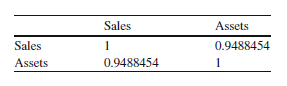
   _Figure 35: A two-variable correlation table. Sales and Assets are correlated 0.9488 — a serious multicollinearity warning if both are used as predictors. (Lecture 11, slide 48.)_

   **Rule of thumb (slide 48):** any pairwise correlation $\geq 0.8$ or $0.9$ should "always raise concern." A correlation of exactly 1 is the extreme case where the two variables encode the same information twice (units in kg vs grams) — the math literally cannot fit the model.

2. **Scatterplots / correlation matrices.** For more than two variables, visualise the entire correlation matrix:

   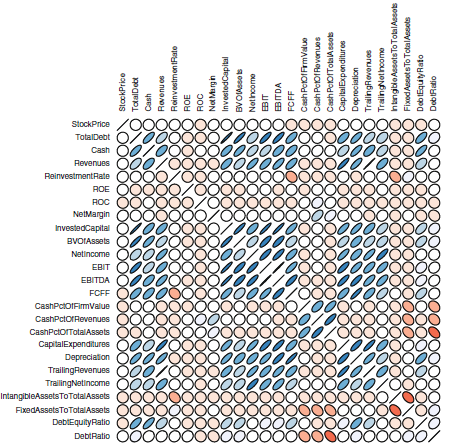
   _Figure 36: A scatter-plot-style correlation matrix for a multi-variable financial dataset. Each cell's ellipse colour encodes the sign of the correlation — **blue = positive correlation, red = negative correlation** — and the shape encodes the magnitude: **thinner / more tilted ellipses indicate stronger correlations** (close to ±1), while round circles indicate near-zero correlation. Tight, deeply-coloured diagonal ellipses are the cells that jump out as multicollinearity candidates. (Lecture 11, slide 48.)_

**Cure.** "Conceptually simple but practically hard": **careful selection of variables**. Drop one of every redundant pair. The lecture does not cover ridge / lasso regularisation, principal-components regression, or other automated cures — they appear in later coursework / ML Lab 2.

Recall the **two-passports-for-one-person analogy** from §2: when two predictors carry near-identical information, the regression cannot attribute credit between them, and the individual coefficients can flip sign or balloon in magnitude.

[Lecture 11, slides 47–48]

### 3.13 Why linearity is restrictive — and the route to flexibility

Slides 23–25 are the lecture's "linearity is convenient but limiting" sermon:

- Linearity is efficient to fit and easy to interpret.
- But many real phenomena are *not* linear: advertising shows **diminishing returns** ("saturation point") and may even backfire if overdone (inverse-U).
- A linear model trades accuracy for convenience.

The lecture's chosen routes to flexibility, in this lecture only, are **dummy variables** (§3.10) and **interaction terms** (§3.11). Both keep the model **linear in its parameters** $a, b_1, b_2, \dots$ — fitting is still standard OLS — but add new columns to the design matrix.

> **What "linear in parameters" means (and why it matters).** A regression model
> $$y = \beta_0 + \beta_1 f_1(\mathbf{x}) + \beta_2 f_2(\mathbf{x}) + \dots + \beta_k f_k(\mathbf{x}) + \varepsilon$$
> is **linear in its parameters** $\beta_0, \beta_1, \dots, \beta_k$ if the parameters enter only as multipliers (not inside exponents, products of each other, or other nonlinear functions). The feature functions $f_j(\mathbf{x})$ themselves can be *anything* of the inputs $\mathbf{x}$ — they can be the raw inputs ($f_1(\mathbf{x}) = x_1$), products of inputs (interactions: $f_3(\mathbf{x}) = x_1 \cdot x_2$), indicator functions (dummies: $f_4(\mathbf{x}) = \mathbb{1}[\text{group} = \text{male}]$), or higher powers (polynomial features: $f_5(\mathbf{x}) = x_1^2$, $f_6(\mathbf{x}) = x_1^3$). All of these are still "linear regression" because the **fitting equations** (normal equations / OLS) are the same — solving for the $\beta_j$ that minimise SSE is a linear-algebra problem regardless of how exotic the $f_j$ are.
>
> A model that is **non-linear in its parameters**, by contrast, looks like $y = \beta_0 \cdot \exp(\beta_1 x) + \varepsilon$ or $y = \beta_0 / (\beta_1 + x) + \varepsilon$ — here OLS no longer admits a closed-form solution and you need iterative non-linear-least-squares solvers (out of scope for L11).
>
> **Why this distinction matters for L11:** dummy variables and interaction terms add new feature functions $f_j(\mathbf{x})$ but the parameters $\beta_j$ still enter linearly, so the same closed-form OLS that fits `Sales ~ ADVT` also fits `Salary ~ Experience + Gender.Male + Gender.Male × Experience`. Same idea: build a design matrix with whatever columns you like, then solve the normal equations.

**Forward reference — polynomial regression.** The other classical route to flexibility is to add $x^2, x^3, \dots$ as new columns ("polynomial features"). This is not derived in the L11 slides. It is covered in ML Lab 2 — Regression and is listed as Variant 1 of that lab in §8.3 of the project spec ("higher polynomial degree"). The glossary entry for **polynomial regression** is therefore flagged FWD-REF.

[Lecture 11, slides 23–28]

---

## 4. Algorithms / Methods

L11 is light on explicit pseudocode — the slides treat the OLS fit as a black-box call to R's `lm()`. We summarise the operational recipe below.

### 4.1 Ordinary Least Squares — the procedure

> **Quick definition — degrees of freedom (d.f.).** Throughout this chapter, "**residual degrees of freedom**" means $n - p - 1$ — the number of observations $n$, minus the number of slope parameters $p$, minus 1 for the intercept. Equivalently: the number of independent residuals once the $p + 1$ fitted parameters are pinned down by the data. R prints this as the second number on the "Residual standard error: 14.51 on **23** degrees of freedom" line, and as the denominator d.f. in the F-statistic line. The numerator d.f. of the F-statistic is just $p$ (number of slopes). Why care? Standard errors, t-distributions for CIs, and F-distributions for the model test all depend on d.f.; small d.f. (few observations relative to predictors) makes every interval wider and every test less powerful.

```
Input: data points {(x_i, y_i)}_{i=1..n} (or design matrix X and response vector y for the multi-predictor case)
Output: coefficients (a, b1, b2, ...) such that the fitted predictions y_hat = a + b1*x1 + ... minimise SSE.

1. Form the design matrix X with one column per predictor and one column of 1s for the intercept.
2. Solve the normal equations  (X^T X) beta = X^T y   for beta.
   -- For one predictor, this reduces to the closed-form
        b_hat = sum((x_i - x_bar)(y_i - y_bar)) / sum((x_i - x_bar)^2)
        a_hat = y_bar - b_hat * x_bar
3. Compute fitted values y_hat_i = X[i, :] @ beta and residuals r_i = y_i - y_hat_i.
4. Compute the variance decomposition
       SST = sum((y_i - y_bar)^2)
       SSE = sum(r_i^2)
       SSR = SST - SSE
       R^2 = SSR / SST
5. Compute the standard errors SE(b_j) for each coefficient (software uses the residual standard error
   and the design matrix to produce these; the L11 slides read SE off the R output without deriving it).
6. Compute the t-statistic  t_j = b_hat_j / SE(b_j)  and the two-sided p-value Pr(|T| > |t_j|)
   with T a t-distribution on n - p - 1 d.f.
7. Confidence intervals: b_hat_j ± t*(0.975, n-p-1) * SE(b_j); the "2" rule of thumb (§3.9) approximates t*.
8. Compute the F-statistic  F = (SSR / p) / (SSE / (n - p - 1))  and its overall p-value against the F-distribution
   on (p, n - p - 1) d.f. (§3.8.1).
```

The L11 slides only do step 4 in detail and read steps 5–8 off R output. ML Lab 2 implements steps 1–4 from scratch in NumPy and verifies against `sklearn.linear_model.LinearRegression`.

### 4.2 Comparing two linear-regression workflows (lecture vs lab)

| Aspect | L11 lecture | ML Lab 2 |
|---|---|---|
| Fit method | Closed-form OLS via R's `lm()` (`solve`s the normal equations). | Closed-form **and** iterative (gradient descent). |
| Loss function | Sum of Squared Errors (SSE). | Mean Squared Error (MSE = SSE/n) and RMSE = √MSE. |
| Goodness of fit | $R^2$, adjusted $R^2$. | $R^2$ on **test** set (train/test split). |
| Significance | p-values, confidence intervals. | Not emphasised — focus is on predictive accuracy, not inferential statistics. |
| Flexibility recipe | Dummy variables, interaction terms. | Polynomial features, regularisation (if covered). |
| Hyperparameters | Essentially none — closed-form OLS has nothing to tune. | Learning rate, number of epochs, polynomial degree. |
| Overfitting controls | "Use adjusted $R^2$, prune redundant predictors." | Train/test split, cross-validation, regularisation. |

This contrast is exam-worthy because it makes vivid which concepts L11 introduces (intercept, slope, residual, SSE, $R^2$, p-value, CI, dummy, interaction, multicollinearity) and which concepts come from elsewhere (MSE/RMSE, gradient descent, learning rate, train/test split, polynomial degree).

[Lecture 11, slides 8–11 and overall structure]

---

## 5. Worked Examples

Every numeric example from the slides, fully expanded.

### 5.1 Soft-drink advertising — simple regression

**Setup.** A soft-drink manufacturer wants to know if its advertising spend is paying off. For **25 sales regions** (the slide displays only nine rows, but $n = 25$ is inferred from the "23 residual degrees of freedom" line of the lm output in figure 18: $n - p - 1 = 23$ with $p = 1$ gives $n = 25$). Each region records Advertising (in **\$ thousands** — so the raw value 9.5 means \$9,500 of ad spend) and Sales (in **thousands of units sold** — so the raw value 145.1 means roughly 145,100 units sold). All numeric interpretations in this section honour those units.


_Figure 4 (recall): the raw data. (Lecture 11, slide 4.)_

**Step 1 — Look at the raw data.**


_Figure 5 (recall): the scatter. Even by eye there is a positive trend. (Lecture 11, slide 5.)_

**Step 2 — Fit the model.** Running `lm(SALES ~ ADVT)` in R yields:


_Figure 18: R's output. **Part I** (top callout) holds the coefficient table — Estimate, Std. Error, t-value, p-value. **Part II** (bottom callout) holds the fit statistics — residual standard error, Multiple R-squared, Adjusted R-squared, F-statistic and overall p-value. (Lecture 11, slide 16.)_

The fitted equation is
$$\boxed{\,\text{Sales} = 51.849 + 7.527 \times \text{Advertising}.\,}$$

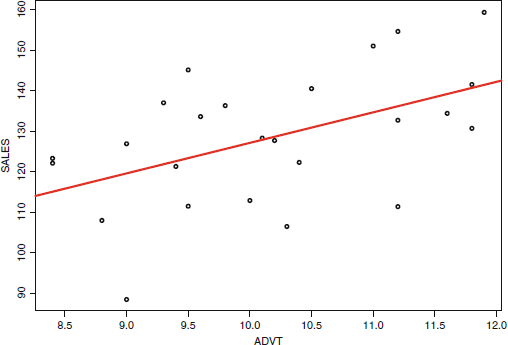
_Figure 13 (recall): the fitted line on the scatter. (Lecture 11, slide 11.)_

**Step 3 — Interpret.**

| Quantity | Value | Reading |
|---|---|---|
| Intercept $\hat a$ | 51.849 | With zero advertising, predicted Sales ≈ 51,849 units (51.849 thousand). **Extrapolation warning** — the data have Advertising in roughly $[8.5, 12]$ (in \$ thousands), so $x = 0$ is far outside the observed range; treat this prediction with caution. |
| Slope $\hat b$ | 7.527 | One extra unit of Advertising (= \$1,000 of ad spend) buys about 7.527 extra units of Sales (= about 7,527 units sold) **on average**. Equivalently, each additional \$1 of ad spend buys roughly 7.527 additional units of sales. |
| Intercept p-value | 0.0768 | Not significant at the 5% level; borderline at the 10% level (R marks it `.`). Tests "intercept = 0," which is usually uninteresting for variable selection. |
| Slope p-value | 0.0115 | Significant at the 5% level (and at the 1.5% level). Marked `*` in the output. The interesting test — "is the Advertising slope different from zero?" — is decisively rejected. |
| Multiple $R^2$ | 0.2469 | The model explains 24.69% of the variability in Sales. |
| Adjusted $R^2$ | 0.2142 | Slightly lower than $R^2$ because the model uses one predictor; see §3.7. |
| Residual std. error | 14.51 (on 23 d.f.) | Typical residual size is about 14.5 Sales units (= 14,500 units sold). The 23 d.f. = $n - p - 1 = 25 - 1 - 1$. |
| F-statistic | 7.54 (on 1 and 23 DF) | Overall-model test (§3.8.1). For one predictor, $F = t^2$ — and indeed $2.746^2 \approx 7.54$. |
| F-statistic p-value | 0.01151 | Same as the slope p-value (because one predictor only). Overall the model is significantly better than predicting $\bar y$. |

**Step 4 — Predict.** For Advertising = 10 (i.e. \$10,000 of ad spend),
$$\hat y = 51.849 + 7.527 \times 10 = 51.849 + 75.27 = 127.119,$$
i.e. ≈ 127,119 units of soft-drink sales predicted (= 127.119 thousand). The actual value for any single region will differ by a residual. (And note: Advertising = 10 is inside the data range of roughly $[8.5, 12]$, so this prediction is an interpolation, not an extrapolation — a safe use of the model.)

[Lecture 11, slides 4–16]

### 5.2 Adding Income — multiple regression

The lecture next adds a second predictor, INCOME (median household income in the region):
$$\text{Sales} = a + b_1 \times \text{Advertising} + b_2 \times \text{Income}.$$

Running `lm(SALES ~ ADVT + INCOME)` yields:


_Figure 19: R output with two predictors. Notice that INCOME's p-value is 0.0089 (`**`) while ADVT's p-value rises to 0.0585 (`.` borderline — no longer significant at the 5% level!). (Lecture 11, slide 17.)_

The fitted equation is
$$\hat{\text{Sales}} = 36.8948 + 5.0691 \times \text{Advertising} + 0.8081 \times \text{Income}.$$

**Comparison with the single-predictor model:**

| | Model 1 (ADVT only) | Model 2 (ADVT + INCOME) |
|---|---|---|
| $R^2$ | 0.2469 | 0.4520 |
| Adjusted $R^2$ | 0.2142 | 0.4022 |
| Residual std. error | 14.51 | 12.66 |
| ADVT slope | 7.527 *** | 5.0691 . |
| INCOME slope | — | 0.8081 ** |

Both raw and adjusted $R^2$ rise — the second model is genuinely better, *not* a fluke of "$R^2$ never decreases." But notice ADVT's slope and significance have dropped: some of the apparent ADVT effect in Model 1 was really INCOME masquerading (regions with higher income tend to have both higher ad spend and higher sales — a classic omitted-variable issue).

**Exam moral:** never read a single coefficient in isolation; the same variable will look different in different models depending on what else is included.

[Lecture 11, slides 17–18]

### 5.3 Should we add a bathroom? — confidence intervals in practice

**Question.** A homeowner is deciding whether to add a bathroom to their house. The renovation only pays off if it adds at least \$6,000 to resale value.

**Regression.** A model is fit with **Price (in US dollars)** as the response variable and seven predictors: SqFt (floor area), Bedrooms, Bathrooms, Offers (a market-pressure indicator), BrickYes (a dummy for "brick exterior"), and the two-dummy encoding NeighborhoodNorth and NeighborhoodWest for the 3-level Neighborhood factor (East as baseline). The R output is:

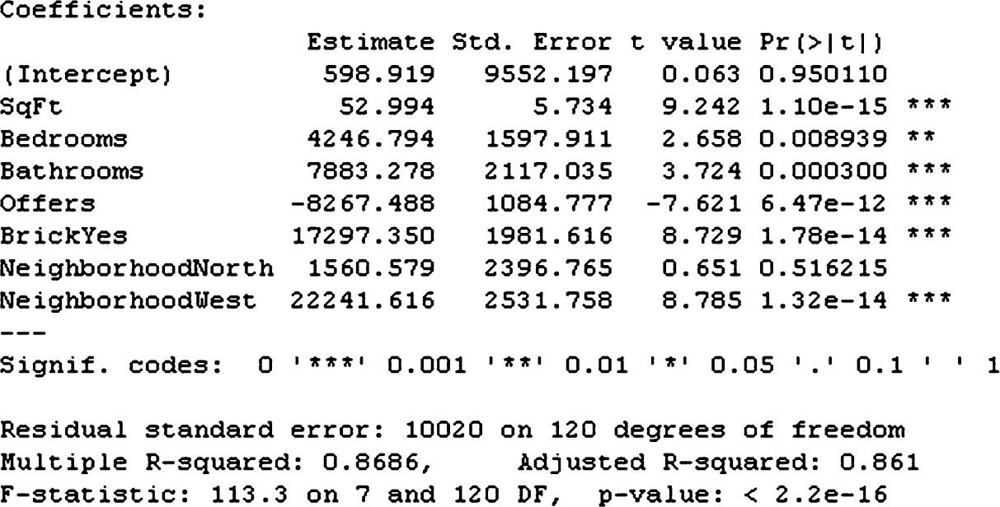
_Figure 21: R output for the house-price regression. Bathrooms has estimate \$7,883.278, standard error \$2,117.035, t = 3.724, p = 0.000300 — emphatically significant. (Lecture 11, slide 20.)_

**Apparent answer.** The point estimate \$7,883 clears the \$6,000 bar — yes, add the bathroom.

**Statistically sound answer.** Build a 95% confidence interval:
$$7{,}883.278 \pm 2 \times 2{,}117.035 = 7{,}883.278 \pm 4{,}234.07 = [3{,}649.208,\ 12{,}117.348].$$

The lower bound \$3,649 is **below** the break-even \$6,000. In other words: the true added value could plausibly be as low as \$3,649, in which case the renovation loses money. **Do not add the bathroom.**

**Take-away.** Statistical significance ($p = 0.0003$) tells us the slope is non-zero. Practical importance — whether the slope clears a business threshold — requires the confidence interval.

[Lecture 11, slides 20–21]

### 5.4 Gender pay gap — dummy variables and interaction terms

This is the longest worked example in the lecture (slides 29–46). It builds three nested models and shows how each unlocks more flexibility.

**Question.** *Do female employees earn less than male counterparts, all else equal?*

**Data.** 208 employees, each with Gender (Male/Female), Experience (years), and Salary (USD).

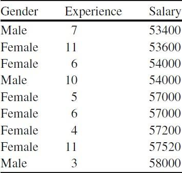
_Figure 23: First rows of the salary dataset. (Lecture 11, slide 29.)_

**First look — boxplots.**

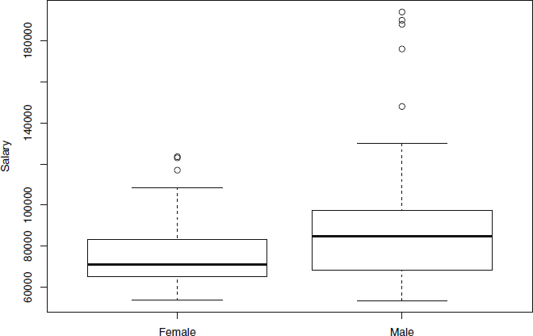
_Figure 24: Salary by gender. The male median sits well above the female median, and the highest male salaries dwarf the highest female salaries. (Lecture 11, slide 30.)_

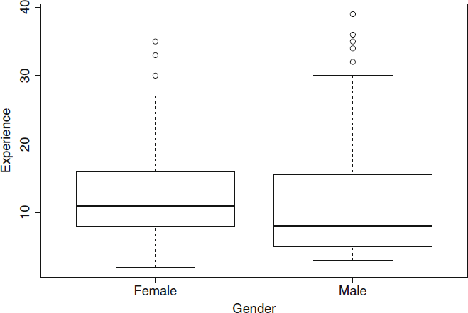
_Figure 25: Experience by gender. The female median experience is actually slightly **higher** than the male — so "women have less experience" is not the explanation for the salary gap. (Lecture 11, slide 31.)_

**Scatter — gender as a third dimension.**

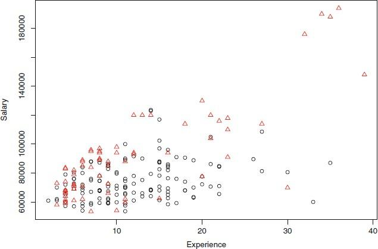
_Figure 26: Salary vs Experience, with gender overlaid (red triangles = male, black circles = female). The two groups follow visibly different paths — by eye the male triangles climb faster than the female circles. (Lecture 11, slide 32.)_

We need a model flexible enough to capture this. Three increasingly flexible models follow.

#### Model A — dummy variable only: `Salary ~ Gender.Male`

Create the dummy
$$\text{Gender.Male} = \begin{cases} 1 & \text{if male} \\ 0 & \text{otherwise.} \end{cases}$$

Fit `lm(Salary ~ Gender.Male)`:

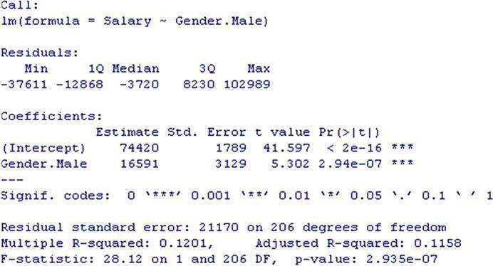
_Figure 28: Model A — dummy-only regression. (Lecture 11, slide 35.)_

The fitted equation:
$$\hat{\text{Salary}} = 74{,}420 + 16{,}591 \times \text{Gender.Male}.$$

**Interpretation.** For females (Gender.Male = 0) the predicted salary is \$74,420 — that is the intercept. For males (Gender.Male = 1) the predicted salary is \$74,420 + \$16,591 = \$91,011. So on average, **male employees earn \$16,591 more than female employees** — a difference that is highly statistically significant ($p = 2.94 \times 10^{-7}$).

$R^2 = 0.1201$ — just 12% of salary variation is explained by gender alone. We need more.

#### Model B — additive dummy + experience: `Salary ~ Experience + Gender.Male`

Fit `lm(Salary ~ Experience + Gender.Male)`:

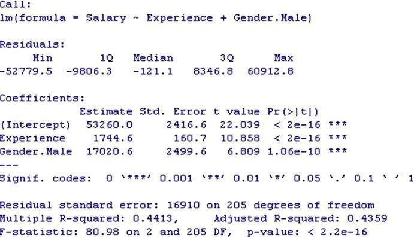
_Figure 29: Model B — additive dummy plus experience. (Lecture 11, slide 38.)_

The fitted equation:
$$\hat{\text{Salary}} = 53{,}260 + 1{,}744.6 \times \text{Experience} + 17{,}020.6 \times \text{Gender.Male}.$$

To read this as two group-specific lines:

- **Female-specific line (Gender.Male = 0):** $\hat{\text{Salary}} = 53{,}260 + 1{,}744.6 \times \text{Experience}$.
- **Male-specific line (Gender.Male = 1):** $\hat{\text{Salary}} = (53{,}260 + 17{,}020.6) + 1{,}744.6 \times \text{Experience} = 70{,}280.6 + 1{,}744.6 \times \text{Experience}$.

The two lines have **the same slope** ($1{,}744.6$) but **different intercepts** (\$53,260 vs \$70,280.6). The male line is shifted up by \$17,020.6 over the entire range of experience.

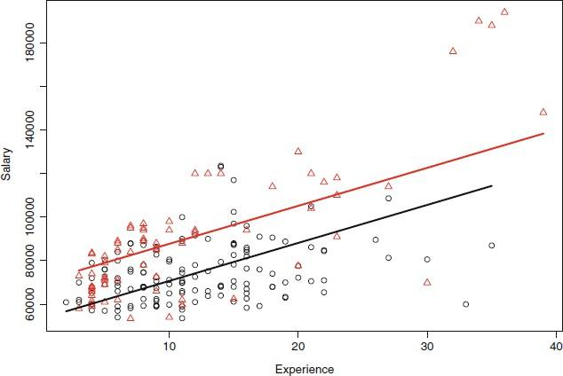
_Figure 30: Model B's parallel fitted lines. Same rate of salary growth per year, but the male intercept is higher. (Lecture 11, slide 40.)_

$R^2 = 0.4413$ — up from 12%. But the parallel-lines assumption is suspicious: by eye in figure 26 the male triangles seem to climb faster, not just sit higher. We need an interaction.

#### Model C — with interaction: `Salary ~ Experience + Gender.Male + Gender.Exp.Int`

Define the interaction
$$\text{Gender.Exp.Int} = \text{Gender.Male} \times \text{Experience}.$$

For each row, multiply the dummy by experience. Female rows get 0 (because Gender.Male = 0); male rows get their experience value.

Fit `lm(Salary ~ Experience + Gender.Male + Gender.Exp.Int)`:

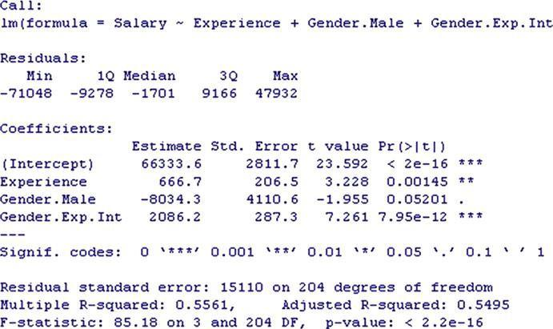
_Figure 32: Model C — with interaction term. Notice the dummy coefficient flipped sign (now −8,034) and the interaction term is highly significant (p = 7.95 × 10⁻¹²). (Lecture 11, slide 43.)_

The fitted equation:
$$\hat{\text{Salary}} = 66{,}333.6 + 666.7 \times \text{Experience} - 8{,}034.3 \times \text{Gender.Male} + 2{,}086.2 \times \text{Gender.Exp.Int}.$$

Reading it as two lines:

- **Female line (Gender.Male = 0, so Gender.Exp.Int = 0):**
  $$\hat{\text{Salary}} = 66{,}333.6 + 666.7 \times \text{Experience}.$$
- **Male line (Gender.Male = 1, so Gender.Exp.Int = Experience):**
  $$\hat{\text{Salary}} = 66{,}333.6 + 666.7 \times \text{Experience} - 8{,}034.3 + 2{,}086.2 \times \text{Experience}$$
  $$= (66{,}333.6 - 8{,}034.3) + (666.7 + 2{,}086.2) \times \text{Experience}$$
  $$= 58{,}299.3 + 2{,}752.9 \times \text{Experience}.$$

So now the male line has a **lower** intercept (\$58,299 vs \$66,334) but a **steeper** slope (\$2,752.9/year vs \$666.7/year). The lines cross somewhere early in a career and then diverge:

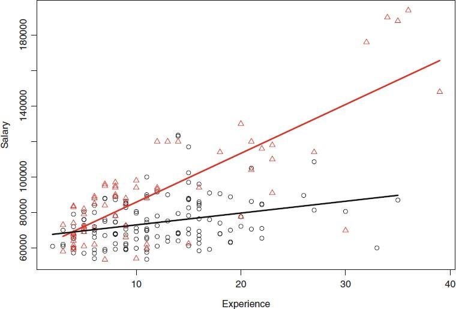
_Figure 33: Model C's non-parallel fitted lines. The male line starts slightly lower but climbs much faster — the pay gap widens with experience. (Lecture 11, slide 46.)_

$R^2 = 0.5561$ — up from 44%. The interaction-term model captures the data substantially better.

**Important read.** In Model A the male coefficient is \$+16,591 (a flat bonus). In Model C the male coefficient is **\$−8,034** (at zero experience, men's intercept is **about 12% lower** than women's: \$58,299 vs \$66,334 — that's a $-\$8{,}034 / \$66{,}334 \approx -12\%$ deficit, **not** a small "touch") but the interaction coefficient is **\$+2,086.2 per year of experience** (males' salaries pull ahead by \$2,086 every additional year). Solving for where the two lines cross: $66{,}333.6 + 666.7 E = 58{,}299.3 + 2{,}752.9 E$ gives $E \approx 3.85$ years — i.e. men start *meaningfully* lower at $E = 0$ but overtake women within the first ~4 years of experience, then keep accelerating away. Model A could only express a fixed gap and so it averaged the early-career deficit and the long-career surplus into a single +\$16,591.

**Summary across the three models:**

| Model | $R^2$ | Adjusted $R^2$ | Story |
|---|---|---|---|
| A: dummy only | 0.1201 | 0.1158 | Men make \$16,591 more on average, full stop. |
| B: dummy + Experience | 0.4413 | 0.4359 | At any given experience level, men make \$17,020 more. Parallel lines. |
| C: dummy + Experience + interaction | 0.5561 | 0.5495 | The pay gap *grows* with experience. Non-parallel lines. |

[Lecture 11, slides 29–46]

### 5.5 Multicollinearity — sales vs assets

Slide 48 sketches one minimal example: a firm's Sales and Assets are correlated 0.9488 (figure 35). If both are used as predictors of, say, stock price, the regression will struggle to attribute credit between them — their individual coefficients can flip sign, balloon, or become statistically insignificant even though together they explain the response well.

The lecture's remedy: drop one of the two correlated predictors before fitting. Which one to drop depends on domain knowledge — typically you keep the more interpretable / more directly measurable one.

[Lecture 11, slides 47–48]

---

## 6. Common Pitfalls / Exam Traps

1. **Reading R-squared without context.** $R^2 = 0.25$ is wonderful for social science, dismal for chemistry. Always frame "good or bad?" against the domain. The lecture explicitly calls out this trap on slide 16.

2. **Confusing statistical with practical significance.** A coefficient can be tiny but statistically significant (large sample, low noise — slope is 0.001 with p $< 10^{-9}$) or large but statistically insignificant (small sample, high noise — slope is \$50,000 with p = 0.4). Always quote the **confidence interval** alongside the p-value before drawing a business conclusion. (See §3.9 and the bathroom example in §5.3.)

3. **Naively comparing $R^2$ across models with different numbers of predictors.** Raw $R^2$ never decreases when you add a variable, so it always "rewards" extra noise predictors. Use **adjusted $R^2$** for model comparison, not raw $R^2$.

4. **The dummy-variable trap.** A categorical with $k$ levels needs $k - 1$ dummies (not $k$). Adding both `Gender.Male` and `Gender.Female` makes the design matrix rank-deficient (perfect multicollinearity), and most software will either silently drop one column or throw an error. Always identify the **baseline** category explicitly.

5. **Forgetting to interpret coefficients relative to the baseline.** In Model B of §5.4, the intercept \$53,260 is the *female* salary at zero experience. If you forget that the baseline is "female", the +\$17,020 male coefficient looks like the absolute male salary, which is wrong. The baseline is whichever category has the dummy = 0.

6. **Misinterpreting the sign of a coefficient after adding an interaction.** Model A: Gender.Male = +\$16,591. Model C: Gender.Male = −\$8,034 (with a +\$2,086 interaction). The slides flag this on slide 44: *"Also the sign of the dummy variable has changed: it was positive before, it is negative for the model including the interaction term."* Coefficients are **always** interpreted in the context of the other variables in the model; in particular, the "main effect" of the dummy when an interaction is present is the effect *at zero experience*, not on average.

7. **Extrapolating beyond the data range.** The Intercept is the prediction at $x = 0$. If your training data has $x \in [8.5, 12]$, the intercept's literal interpretation ("sales when advertising is zero") is an extrapolation and should be treated with suspicion. The same applies to predictions for any $x$ outside the observed range.

8. **Multicollinearity → unstable coefficients, not big errors.** Multicollinearity does *not* make the *predictions* bad — they can still be accurate — but it makes the *individual coefficients* untrustworthy. Hence the symptom is wild swings or sign flips in coefficients when minor changes are made to the data or the included variables.

9. **Assuming linearity is always appropriate.** L11 explicitly warns on slide 23: "Linearity is often only an approximation to reality." Saturation, diminishing returns, and inverse-U effects are *not* expressible by any linear model on the raw variables. The lecture's flexibility recipes (dummy, interaction) keep the model linear-in-parameters; ML Lab 2 covers polynomial features which still keep linearity-in-parameters while breaking linearity in the inputs.

10. **Confusing the names of the sums of squares.** Mnemonic: **T**otal, **E**rror, **R**egression. SST = total variability (full spread), SSE = leftover error variability (what the model failed to explain), SSR = explained variability (what the regression captured). SST = SSE + SSR; $R^2 = $ SSR / SST. Some textbooks call SSR "SS-explained" and SSE "SS-residual" — same quantities, different names. The L11 slides stick with SST/SSE/SSR throughout.

11. **Forgetting that p-values are predictor-by-predictor, but the F-statistic tests the model as a whole.** R's `lm()` output gives one p-value per coefficient (does *this* predictor matter, given the others?) and an overall F-statistic p-value at the bottom (does *any* predictor matter?). Both are useful and they answer different questions.

12. **Course-specific: L11 does not name MSE, RMSE, gradient descent, learning rate, epoch, or polynomial regression.** If the exam asks for them by name, the answer is "covered in ML Lab 2" — but the underlying ideas (squared-error objective, iterative optimisation, more-flexible features) are intuitively introduced in L11.

13. **Treating the intercept's p-value as informative.** R prints a p-value for the intercept row too, but it tests the typically-unhelpful null "is the intercept exactly zero?" — almost never a question that matters. **Use slope p-values for variable selection, ignore the intercept p-value** unless you have a specific business reason to care whether the intercept is zero.

14. **Misstating the p-value's meaning.** The lecturer's slide 19 says the p-value is "the probability that a particular predictor has no relationship with the response." That is the **inverse fallacy** — see §3.8. The correct phrasing is "the probability of seeing a coefficient at least this extreme, *assuming* the true coefficient is zero." Don't reproduce slide 19's loose wording as a definition; a careful examiner will mark it down.

15. **Asserting $R^2 \in [0,1]$ without qualification.** True for an OLS fit *with intercept on training data* (the L11 setup). On a held-out test set or for a no-intercept fit, $R^2$ can be **negative**. ML Lab 2 sets the train/test split and may show this.

16. **Forgetting the units of the regression's input/output when interpreting slopes.** The soft-drink slope 7.527 is "per unit of Advertising" — and one unit of Advertising in that data set is \$1,000 of ad spend, not \$1. Always check the data's recorded units before translating a slope into a business statement.

[Lecture 11, slides 16, 18, 19, 20–21, 33–34, 44, 47–48]

---

## 7. Connections to Other Lectures

- **L10 — Intro to ML.** Regression is the **continuous-output** sibling of classification (L10 §3). The L10 [training set / test set / overfitting](L10-Intro-to-ML.md) machinery applies directly: every L11 fit should be evaluated on held-out data in practice, even though the L11 slides display only training-set fit. L10's [overfitting](L10-Intro-to-ML.md) trap is the deeper reason adjusted $R^2$ exists — too many predictors makes the model memorise training noise.

- **L10 — supervised learning.** L11's whole topic falls under [supervised learning](L10-Intro-to-ML.md): given input/output pairs, learn the input-to-output mapping. Compare against L12's unsupervised clustering, which has no target $y$.

- **L05 — Local Search.** The OLS objective "minimise SSE" is itself an [optimisation problem](L05-Local-Search.md). The L11 closed-form solution side-steps the search — but iterative methods (gradient descent, used in ML Lab 2) traverse the SSE surface much like the [hill-climbing / simulated-annealing](L05-Local-Search.md) algorithms of L05, except they *descend* to a minimum rather than *climb* to a maximum, and the surface is convex so descent always reaches the global optimum.

- **L09a — Bayesian Networks (probabilistic framing of regression).** The p-value's "what if the true coefficient were zero" question is a frequentist setup; the Bayesian counterpart asks "what is the posterior distribution of the coefficient given the data?", which uses L09a's [conditional probability](L09a-Bayesian-Networks.md) and Bayes' rule. The L11 slides stay strictly frequentist.

- **ML Lab 2 — Regression.** Implements the OLS fit from scratch, then again with gradient descent, on a synthetic dataset. Covers the items L11 omits: **MSE / RMSE** as alternative loss-metric names; **gradient descent** as an iterative optimisation algorithm; **learning rate** and **epoch** as hyperparameters; **polynomial features** for non-linear flexibility; train/test split. Use ML Lab 2 to answer any exam variant that needs computational depth (e.g. "what learning rate makes gradient descent converge?", "how does test RMSE change as the polynomial degree increases from 2 to 10?").

- **ML Lab 1 — Classification.** The companion lab for classification. Its KNOB structure mirrors ML Lab 2 — `max_depth`, `n_estimators`, etc. — and the train/test discipline carries over verbatim.

[Lecture 11, full deck; cross-refs from L10 §3, L05 §3, L09a §3, and the spec §8.3 variant bank for ML Lab 2]

---

## 8. Cheat-Sheet Summary

> One-page recap. Each bullet carries its analogy reminder in italics.

**The model**
- Simple linear regression: $\hat y = a + b\,x$. *Best flight path through a 2-D chart of cities.*
- Multiple: $\hat y = a + b_1 x_1 + b_2 x_2 + \dots$. *Flight path in higher-dimensional sky.*
- "Linear in parameters" = the parameters $a, b_j$ enter only as multipliers; the feature functions of $x$ (dummies, interactions, polynomial features) can be anything.
- Intercept $a$ = predicted $y$ when every predictor is 0. *Beware extrapolation if $x = 0$ is outside the data range.*
- Slope $b_j$ = average change in $y$ per unit change in $x_j$, **holding the other predictors fixed**.

**The fit**
- Residual: $r_i = y_i - \hat y_i$. *How far each city sits above/below the path (signed).*
- OLS: pick coefficients to minimise $\text{SSE} = \sum_i r_i^2$. *Penalise big misses extra (squared).*
- Slides do **not** derive gradient descent or matrix-form normal equations; ML Lab 2 does.
- One-predictor closed form: $\hat b = \sum (x_i - \bar x)(y_i - \bar y) / \sum (x_i - \bar x)^2$ and $\hat a = \bar y - \hat b\,\bar x$.

**Goodness of fit**
- $\text{SST} = \sum (y_i - \bar y)^2$. Total spread. *Variability before any model.*
- $\text{SSE} = \sum (y_i - \hat y_i)^2$. Leftover spread. *Variability the model fails to explain.*
- $\text{SSR} = \text{SST} - \text{SSE} = \sum (\hat y_i - \bar y)^2$. Captured spread. (Second equality requires OLS + intercept.)
- $R^2 = \text{SSR} / \text{SST}$. Bounded $\in [0,1]$ for **OLS with intercept on training data**; **can be negative** on a held-out test set or for a no-intercept fit. *Share of the shotgun spread that the path absorbed.*
- $R^2$ never decreases with more predictors → use **adjusted $R^2$** to compare nested models fairly.
- Adjusted $R^2 = 1 - \frac{n-1}{n-p-1}(1 - R^2)$ (EXTENSION — slide quotes the values, not the formula).

**Inference**
- p-value < 0.05 → predictor is statistically significant. *Effect unlikely to be just random noise dressed up.*
- ⚠ Slide-19's "probability the predictor has no effect" phrasing is the inverse fallacy — the correct definition is "probability of seeing a coefficient this extreme, assuming the true coefficient is zero."
- 95% CI: $\hat b \pm 2 \cdot \text{SE}(\hat b)$. *Dart-throw spread around the true slope.* Exact multiplier is the t-quantile $t^*_{0.975, n-p-1}$ (e.g. 2.069 for n=25, p=1; 1.96 in the large-sample limit).
- Statistical significance ≠ practical importance. Bathroom: $\hat b = 7883$ (p = 0.0003) but CI lower bound \$3,649 < break-even \$6,000 → **don't add the bathroom**.
- F-statistic = $(\text{SSR}/p) / (\text{SSE}/(n-p-1))$ tests "are *all* slopes zero?" (whole-model test, §3.8.1), vs the per-coefficient t-tests for individual predictors.
- **Degrees of freedom:** residual d.f. = $n - p - 1$.

**Flexibility (still keeping the model linear in parameters)**
- Dummy variable: 0/1 recoding of a categorical. *Light switch wired to a fixed bonus.* For $k$ levels use $k - 1$ dummies; the omitted level is the baseline absorbed by the intercept. Using all $k$ dummies + intercept produces a singular $X^\top X$ (the dummy-variable trap).
- Interaction term: row-by-row product of two predictors. *Throttle on the slope.* Allows non-parallel regression lines for different categories.
- **NOT covered in L11:** polynomial features ($x^2, x^3, \dots$) — see ML Lab 2. Glossary entry for polynomial regression is FWD-REF.

**Multicollinearity**
- Two predictors strongly correlated → unstable coefficients (signs can flip, magnitudes balloon). *Two passports for one person.*
- Diagnose with correlation tables / scatter matrices. Pairwise correlation $\geq 0.8$ or $0.9$ → concern.
- Cure: careful variable selection (drop redundant predictors). L11 doesn't cover ridge/lasso.

**Exam-day formula sheet**
$$\hat y = a + b_1 x_1 + \dots + b_p x_p \quad\quad \text{SSE} = \sum r_i^2 \quad\quad \text{SST} = \sum (y_i - \bar y)^2 \quad\quad \text{SSR} = \sum (\hat y_i - \bar y)^2$$
$$R^2 = \frac{\text{SSR}}{\text{SST}} = 1 - \frac{\text{SSE}}{\text{SST}} \quad\quad R^2_{\text{adj}} = 1 - \frac{n-1}{n-p-1}(1-R^2)$$
$$\hat b = \frac{\sum_i (x_i - \bar x)(y_i - \bar y)}{\sum_i (x_i - \bar x)^2} \quad\quad \hat a = \bar y - \hat b\,\bar x \qquad \text{(one-predictor closed form)}$$
$$t_j = \frac{\hat b_j}{\text{SE}(\hat b_j)} \quad\quad F = \frac{\text{SSR} / p}{\text{SSE} / (n - p - 1)}$$
$$\text{95\% CI for }b_j:\ \hat b_j \pm t^*_{0.975, n-p-1}\cdot \text{SE}(\hat b_j) \approx \hat b_j \pm 2\cdot \text{SE}(\hat b_j)$$

**Reading R output (recurring exam skill)**
| Row / column | Meaning |
|---|---|
| `Residuals: Min 1Q Median 3Q Max` | Five-number summary of $r_i$; a quick sanity check for symmetry around zero and outliers. |
| `Estimate` | The coefficient $\hat b_j$ (or $\hat a$ for the intercept row). |
| `Std. Error` | $\text{SE}(\hat b_j)$. Used for the CI. |
| `t value` | $\hat b_j / \text{SE}(\hat b_j)$. |
| `Pr(>|t|)` | The per-coefficient p-value (§3.8). Stars: `***` < 0.001, `**` < 0.01, `*` < 0.05, `.` < 0.1. Intercept p-value is usually uninteresting. |
| `Multiple R-squared` | $R^2$ — for *describing* this model. |
| `Adjusted R-squared` | For *comparing* this model to others with different numbers of predictors. |
| `Residual standard error` | Typical residual size; on $n - p - 1$ degrees of freedom. |
| `F-statistic: F on p and n-p-1 DF, p-value: …` | Whole-model test (§3.8.1): "are *all* slopes zero?" Tiny p-value → at least one predictor matters. |

[Lecture 11, all slides — distilled]

---

_Source: Lecture 11 slides 1–48 ("Linear Regression", Serkan Ayvaz). Cross-references to L05 §3, L09a §3, L10 §3, and ML Lab 2 — Regression as noted. Forward-references to polynomial regression / MSE / RMSE / gradient descent / learning rate / epoch are explicitly flagged in §1, §3.13, §4.2, and §7._
