# Lecture 12: Clustering

> **Reading time:** ~45 min  |  **Prereqs:** [L10 Intro to ML](L10-Intro-to-ML.md) (unsupervised learning, training set).
>
> **Glossary terms introduced:** clustering, K-means clustering, centroid, hierarchical clustering, agglomerative clustering, dendrogram, DBSCAN. Inline glossary terms not in `_shared/glossary.md`: partitional clustering, divisive (top-down) clustering, density-based clustering, bisecting K-means, proximity matrix, single-link linkage (MIN), complete-link linkage (MAX), group-average linkage, centroid linkage (a.k.a. "distance between centroids" on the slides), Ward's method, core point, border point, noise point, density edge, density-connected, Eps (ε-radius), MinPts, k-distance plot, cluster validity.

---

## 1. Overview & Motivation

Clustering is the **unsupervised** sibling of classification: we still want to organise data points into groups, but nobody hands us the labels [Lecture 12, slide 1]. Instead, the algorithm groups points so that **intra-cluster distance is minimised and inter-cluster distance is maximised** [Lecture 12, slide 2]. Two points in the same cluster should look like each other; two points in different clusters should look as different as possible.

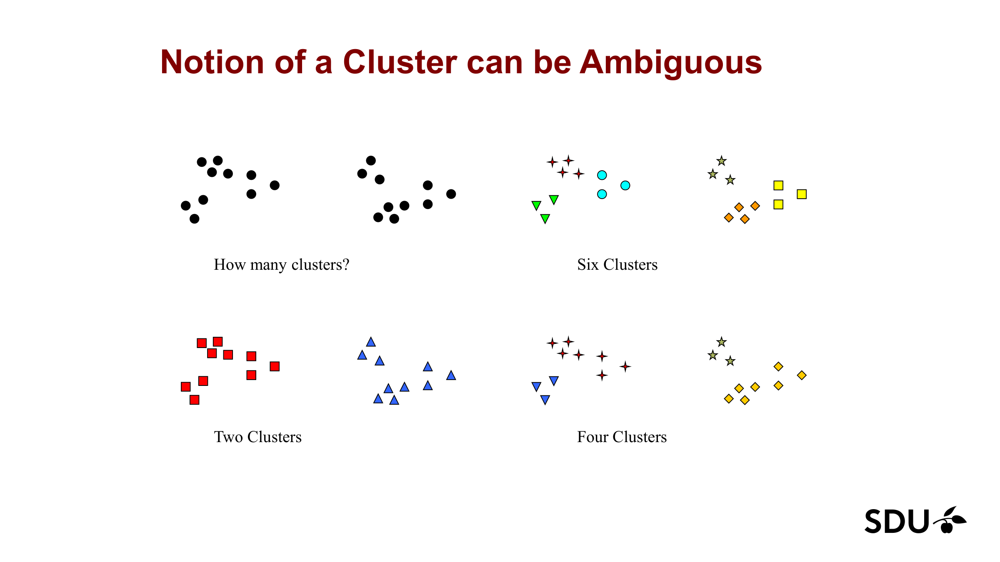
*Figure 1 — The same point cloud admits two-, four-, or six-cluster interpretations; the "right" number is in the eye of the beholder. (Lecture 12, slide 3.)*

Where this lecture sits in the course:

- It is the *unsupervised* leaf of the machine-learning mini-track. The supervised leaves are [L10 Intro to ML §3](L10-Intro-to-ML.md#3-core-concepts) (classification via decision trees) and [L11 Regression](L11-Regression.md). See L10's introduction of `clustering` on slide 4.
- It is the conceptual companion to [ML Lab 3 — Clustering](../../lab3_clustering_handout.ipynb), which exercises K-means on real numeric features.

**Honest scope notes.** The source slide deck covers three concrete algorithms — K-means, hierarchical (agglomerative), and DBSCAN — together with the inter-cluster similarity measures used by hierarchical clustering and a final cluster-validity discussion. Several techniques that the wider clustering literature (and ML Lab 3) cover are **not on the slides** and are flagged below rather than smuggled in:

- **K-means++** initialisation is not on the slides. The slides discuss the initialisation problem qualitatively (slides 11–17) and list "multiple runs", "select more than k initial centroids and pick the most widely separated", "post-processing", and "bisecting K-means" as remedies. K-means++ is the canonical modern answer; if it appears on the exam it will come from ML Lab 3 and the textbook, not from this deck.
- **Elbow method** and **silhouette score** for choosing $K$ or evaluating clusters are not derived on the slides. Slide 11 lists "how to choose $K$" as an open issue and slide 44 / 45 lists "determining the correct number of clusters" as one of the cluster-validity tasks — but neither method is named. Again, ML Lab 3 fills the gap.
- **Bisecting K-means** is mentioned by name (slide 17) and pictured (slide 18) but its algorithm is not spelled out in the deck. We give a tight description in §4.

This chapter covers every slide of the deck, in the order the lecturer presented them. [Lecture 12, slides 1–47.]

---

## 2. The Big Picture — Analogies

Before any formalism, here is the mental model for each major concept. Each analogy ends with where it breaks down so you do not over-extrapolate it.

### Cluster analysis is like sorting laundry without being told the categories

You dump a pile of clean clothes on the bed and start making piles: jeans here, socks there, T-shirts in a third pile. Nobody told you what the right categories are — you decide by *similarity* (rough fabric, similar shape, similar size). Someone else might split the same heap into "dark / light / colour" instead, and they would not be wrong, just using a different notion of "similar". The algorithm sees only raw features (shirts vs trousers, dark vs bright) and a distance function — you, the human, decide which similarity matters.

*Where it breaks down:* a real human peeking at a sock thinks "this is a winter sock"; the algorithm only sees a vector and does not know what a sock is. Different distance choices yield different piles, and there is no objective answer to "which is correct".

### K-means clustering is like K party hosts each claiming the nearest guests

You drop $K$ pre-selected hosts onto the dance floor. Every guest walks to the *nearest* host and joins their conversation circle. The host then shuffles to the gravitational centre of their circle — the average position of all their guests. Now some guests are closer to a different host than to their current one; they switch circles. Hosts shuffle again. After a few rounds, no one wants to switch and the hosts stop moving: that is convergence.

*Where it breaks down:* in a real party people choose friends, not nearest geometric points. Real-world clusters can be non-convex (a *banana-shaped* group of friends sharing a long table); K-means cannot find those, because "nearest centroid" is a straight-line measure. Real hosts also have personalities (different cluster shapes / sizes / densities); K-means treats every cluster as roughly the same round blob.

### Hierarchical clustering is like building a family tree of point similarities

Start with every point as its own one-person family. At each step, find the two closest families and *marry* them — combine them into one larger family. Keep marrying until every point is in one giant clan. Record the marriage order on a vertical tree (the *dendrogram*): the height of each junction is how dissimilar the two families were when they joined. To get $k$ clusters, slice the tree horizontally at the height that cuts exactly $k$ branches.

*Where it breaks down:* once two families marry they can never divorce — a wrong early merge is permanent. And a real family tree is built from one true history, but hierarchical clustering uses arbitrary "distance between groups" rules (MIN, MAX, average, centroid, Ward); different rules produce different trees on the same data.

### Centroid is the gravitational centre of a cluster

Imagine each point as a unit-mass pebble. The centroid sits at the cluster's balance point — the average of every member's coordinates. It is the point that minimises total squared distance to its members, which is exactly why K-means picks it as the new "host" each iteration.

*Where it breaks down:* the centroid is not necessarily *itself* a member of the cluster (it sits in the empty middle), and it has no meaning for categorical features — what is the "average" of {red, red, blue}? K-means therefore needs numeric, comparable features; categorical attributes require a different algorithm (k-modes) not covered in this course.

### DBSCAN is like exploring through dense neighbourhoods and leaving loners behind

You drop yourself onto a noisy map of point pins. You agree on two house rules (precise definitions live in §3.7; we use the canonical Ester-et-al. convention "≥ MinPts including the point itself" throughout the chapter):

1. A pin is **dense** if its Eps-radius circle contains at least `MinPts` pins (counting itself).
2. You wander from any dense pin to another dense pin within `Eps`, then to another, then another, growing one cluster. Pins next to (but not themselves) dense pins join the same cluster. Pins that have neither *been* dense nor *touched* a dense pin are tagged as noise and ignored.

*Where it breaks down:* "dense" needs a global radius and count; if the dataset contains regions of *varying* density (one tight blob, one diffuse blob — slide 43), no single `(Eps, MinPts)` pair labels both correctly. The algorithm also degrades in high dimensions because distances concentrate (every pair becomes "about the same distance"), making the notion of "neighbourhood" useless.

### A dendrogram is like an upside-down family tree of cluster mergers

Picture an upside-down tree (or, equivalently in the slide-23 figure, one laid on its side): every leaf is a single data point, every internal junction marks a merge between two sub-trees, and the **height** of each junction records how dissimilar the two parties were when they joined. If you saw it horizontally at any chosen height, the branches you cut off are your flat clusters.

*Where it breaks down:* the *shape* of the dendrogram (which branches are tall, which short) depends on the linkage rule (MIN, MAX, average, centroid, Ward). The dendrogram looks like a fixed history but is really one algorithmic choice among several.

(Each linkage rule — MIN, MAX, group-average, centroid, Ward — has its own intuition. Because the linkages only make sense once hierarchical clustering itself is defined, those analogies live in §4.4 next to their formulas.)

Hold these analogies in your head as you read §3 — each formal definition below points back to its analogy here.

[Lecture 12, slides 1–34, used throughout the rest of this chapter.]

---

## 3. Core Concepts

### 3.1 Cluster analysis (the task)

> **Definition** — Given a dataset of $n$ points $\{x_1, \ldots, x_n\}$, with no labels, partition them into groups such that points in the same group are similar to each other and points in different groups are dissimilar [Lecture 12, slide 2].

The slides emphasise that the *notion* of a cluster is ambiguous: the same point cloud can be partitioned into two, four, or six clusters and each partition is defensible (Figure 1 above). The clustering algorithm encodes a specific definition of "similar" via its distance measure and a specific definition of "group" via its model assumptions.

Recall the **sorting-laundry analogy** from §2: you (the human) bring outside knowledge of which categories matter; the algorithm only sees raw features and a distance function.

[Lecture 12, slides 1–3.]

### 3.2 Types of clustering

Three high-level families [Lecture 12, slide 4]:

1. **Partitional clustering** — a single division of the data into non-overlapping subsets so that every point belongs to exactly one subset. K-means and its variants are the canonical partitional algorithms.
2. **Hierarchical clustering** — a nested family of clusters organised as a tree. You can read off a $k$-cluster solution at any level by cutting the tree.
3. **Density-based clustering** — clusters are maximal regions of high point density separated by regions of low density. DBSCAN is the canonical density-based algorithm.

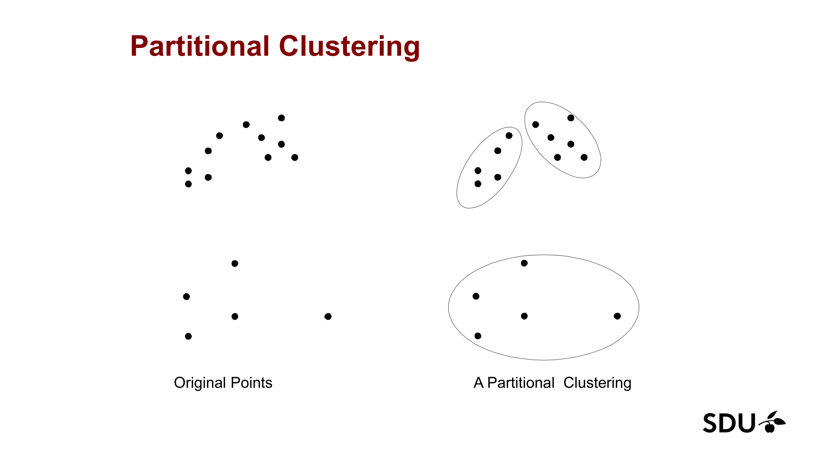
*Figure 2 — Partitional clustering: every input point falls into exactly one of three subsets. (Lecture 12, slide 5.)*

**Traditional vs non-traditional hierarchical clustering** [Lecture 12, slide 6]. The lecturer's "traditional" dendrogram is the classical bottom-up picture where every leaf becomes part of exactly one ancestor at every height — it represents a strict nested partition. A "non-traditional" hierarchical clustering allows a point to belong to *more than one* cluster at the same level (overlapping or fuzzy hierarchical clustering); the corresponding "non-traditional dendrogram" therefore is not a tree in the strict graph-theory sense. The rest of this chapter — and the rest of the deck — develops only the traditional variant.

**Clustering algorithms catalogue** [Lecture 12, slide 7]. The slide tabulates the families against named algorithms:
- Partitional → **K-means and its variants**.
- Hierarchical → **Agglomerative (bottom-up)** clustering and **Top-down (divisive)** clustering.
- Density-based → **DBSCAN**.

The deck only develops K-means, agglomerative, and DBSCAN in detail. Divisive (top-down) hierarchical clustering is named on slide 7 but never engaged again — there is no algorithm, no example, no figure. Exam-relevant fact: it exists, it starts with one all-inclusive cluster and recursively splits, and bisecting K-means (§4.5) is its only concrete instance in the deck.

[Lecture 12, slides 4–7.]

### 3.3 Centroid

> **Definition** — The centroid $\mu_k$ of cluster $C_k$ is the mean of the points currently assigned to it:
> $$\mu_k = \frac{1}{|C_k|} \sum_{x \in C_k} x.$$

The slides call it the *center point* [Lecture 12, slide 8]. Recall the **gravitational-centre analogy**: the centroid is the position that minimises the sum of squared distances to the members of the cluster, which is why K-means updates centroids to means rather than to (say) medians.

Centroid distances also reappear as one of the hierarchical-clustering linkage methods (§4.4).

[Lecture 12, slides 8, 28–32.]

### 3.4 Dendrogram

> **Definition** — A tree-shaped diagram that records the sequence of merges (in agglomerative clustering) or splits (in divisive). Leaves at the bottom are individual data points; the height of each internal node is the dissimilarity at which the two child clusters were joined.

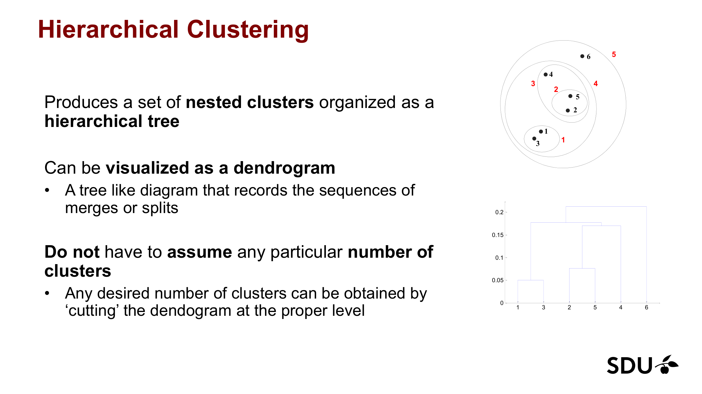
*Figure 3 — Hierarchical clustering produces a nested tree (dendrogram); any number of clusters is obtained by cutting the tree horizontally at the appropriate height. (Lecture 12, slide 20.)*

Note: the slides spell it "dendogram" (visible in Figure 11 below and on the slide-20 / slide-23 rendered images) — that is a typo for *dendrogram*. They are the same word; expect the typo on the slides and use the canonical spelling in your own answers unless the question literally quotes the typo. Recall the **upside-down family-tree analogy** from §2.

[Lecture 12, slides 6, 20, 23.]

### 3.5 Hierarchical clustering

> **Definition** — A clustering technique that produces a set of *nested* clusters organised as a tree (the dendrogram). Two main subtypes:
> - **Agglomerative** (bottom-up): start with every point as its own cluster; at each step, merge the two closest clusters; stop when only one cluster remains (or $k$ remain).
> - **Divisive** (top-down): start with one cluster containing every point; at each step, split a cluster; stop when every point is a singleton (or $k$ clusters remain).

Hierarchical algorithms do **not** assume a particular number of clusters $K$ — you choose $K$ after the fact by cutting the dendrogram. They use a *similarity (proximity) matrix* of all pairwise distances and merge or split one cluster at a time.

The slides only develop the agglomerative variant in detail [Lecture 12, slides 21–34].

### 3.6 Agglomerative clustering

> **Algorithm** — Bottom-up hierarchical clustering:
> 1. Compute the proximity matrix.
> 2. Let each data point be its own cluster.
> 3. Repeat:
>    4. Merge the two closest clusters.
>    5. Update the proximity matrix.
> 6. Until only a single cluster remains.

The *key operation* is step 4 — computing the proximity of two clusters — and different choices of that proximity define different algorithms (see §4.4) [Lecture 12, slide 22].

### 3.7 DBSCAN — density-based clustering

DBSCAN partitions points into **dense regions** separated by **not-so-dense regions** [Lecture 12, slide 35]. The two parameters that define "dense" are:

- **Eps** (ε, the radius): the size of the neighbourhood around a point.
- **MinPts**: how many other points must lie inside an Eps-neighbourhood to call it "dense".

Each point is then classified as one of three types [Lecture 12, slide 36]:

| Type | Condition |
|---|---|
| **Core point** | Its Eps-neighbourhood contains **≥ MinPts** points (counting itself). Interior of a dense region. |
| **Border point** | Has **< MinPts** points in its own Eps-neighbourhood, but lies inside some core point's Eps-neighbourhood. Edge of a cluster. |
| **Noise point** | Neither core nor border. Discarded. |

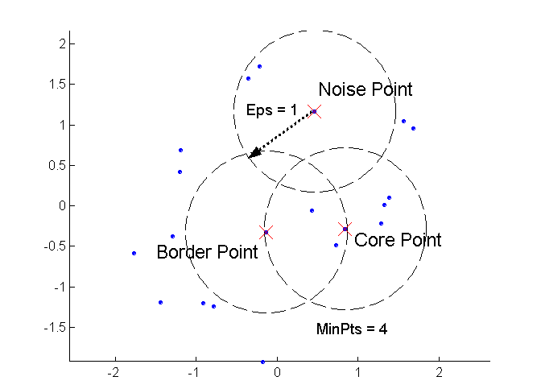
*Figure 4 — DBSCAN point taxonomy: the core point's Eps-circle contains ≥ MinPts neighbours (other circles do not). (Lecture 12, slide 37.)*

> **Definitional caveat — read carefully on the exam.** The deck phrases the core-point rule two ways: slide 35 says a dense region "contains **at least** MinPts points" and slide 36 says a core point has "**more than** … MinPts within Eps". These are not the same thing — "more than $k$" is strictly $> k$, but "at least $k$" is $\ge k$. The figure on slide 37 illustrates a core point whose Eps-circle visibly contains exactly MinPts = 4 points (one of which is the core point itself), which only fits the $\ge$ reading. The canonical Ester-et-al. (1996) DBSCAN paper, and Tan/Steinbach/Kumar's textbook, both use **"≥ MinPts including the point itself"** — that is the convention this chapter uses everywhere. If an exam question literally quotes "more than MinPts", reproduce the slide phrasing in your answer and flag the convention; otherwise default to $\ge$.

Two further structural definitions [Lecture 12, slide 39]:

- **Density edge** — between two core points $p$ and $q$ if $\text{dist}(p, q) \le \text{Eps}$.
- **Density-connected** — $p$ is density-connected to $q$ if there is a path of density edges from $p$ to $q$ (possibly via intermediate core points).

The slide phrasing of "density-connected" is loose by textbook standards: Ester et al. (1996) decompose this into *density-reachable* (a chain of core points each within Eps of the next, ending at a possibly-non-core point) and *density-connected* (two points are density-reachable from a common core point). The slide-39 definition collapses both into "path of edges". For exam purposes, use the slide's wording; for the textbook follow-up, remember the two layers exist.

DBSCAN clusters are then maximal sets of density-connected core points, with border points attached to the cluster of their closest core point.

[Lecture 12, slides 35–40.]

---

## 4. Algorithms / Methods

### 4.1 K-means

K-means is a **partitional** clustering algorithm. The user must specify $K$ in advance. Each cluster is associated with a *centroid* (its mean); each point is assigned to the cluster with the closest centroid [Lecture 12, slide 8].

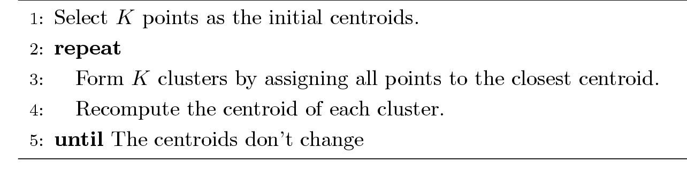
*Figure 5 — The K-means algorithm in five lines. (Lecture 12, slide 8.)*

In symbols:

$$\text{repeat: }\; C_k = \{x : \|x - \mu_k\|_2 < \|x - \mu_j\|_2 \;\forall j \neq k\}, \quad \mu_k = \frac{1}{|C_k|}\sum_{x \in C_k} x \;\;\text{until }\mu \text{ stable.}$$

The objective K-means is locally minimising is the **within-cluster sum of squares** (also called *inertia* or SSE in the labs):

$$\text{SSE} = \sum_{k=1}^{K} \sum_{x \in C_k} \|x - \mu_k\|_2^{2}.$$

The slides do not write SSE explicitly, but the assign/recompute loop is exactly coordinate descent on this objective: the assignment step minimises SSE over $\{C_k\}$ holding $\{\mu_k\}$ fixed, and the centroid step minimises SSE over $\{\mu_k\}$ holding $\{C_k\}$ fixed. Convergence is guaranteed — SSE is **non-increasing** at every step (strictly decreasing whenever at least one point switches cluster, equal to the previous value when nothing changes) and the set of possible assignments is finite, so the algorithm terminates after finitely many iterations. It terminates at a **local** minimum, not a global one — see §6.

> **K-means is local search in disguise.** Compare with [L05 Local Search](L05-Local-Search.md) hill climbing: SSE is the objective surface, the assign/recompute loop is coordinate descent on it, every initialisation is a different starting point in the energy landscape, and slide-17's "multiple runs" remedy is literally L05's *random-restart hill climbing*. The "stuck in a local minimum" warning is not an analogy — it is the same theorem. Bisecting K-means is local search with a problem-reduction step in between.

Recall the **party-host analogy**: the assignment step is guests walking to the nearest host; the centroid step is each host shuffling to the centre of their circle.

**Complexity.** Per iteration: $O(n K d)$ for $n$ points, $K$ clusters, $d$ features (every point compared against every centroid). Number of iterations is typically small (5–50) and not theoretically bounded by a useful function of $n$.

[Lecture 12, slides 8–16.]

### 4.2 Issues and limitations of K-means

Slide 11 lists the open issues explicitly:

- **How to choose initial centroids?** The output depends on them — different initialisations give different final partitions (see §5 and §6).
- **How to choose $K$?** The algorithm requires it as input; the slides do not give a method, but the elbow method and silhouette score from ML Lab 3 are the standard answers.
- **How to handle outliers?** A distant point in its own neighbourhood can drag a centroid far from the bulk of its cluster.
- **Clusters that differ in shape, density, or size.** K-means assumes roughly spherical, roughly equal-size, roughly equal-density clusters; deviations cause it to slice clusters down the middle (see slide 12 sub-optimal-vs-optimal figure in §5).

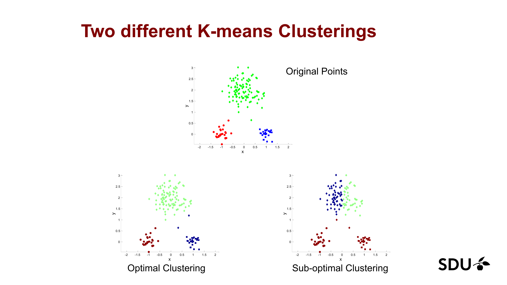
*Figure 6 — Same input data (top), different initial centroids: the sub-optimal panel (middle) shows K-means convergence with two centroids stranded in the left half of the data — no point now wants to switch clusters, so the algorithm halts even though SSE is much higher than the optimal partition (bottom). The optimal panel separates the three round blobs cleanly. (Lecture 12, slide 12.)*

[Lecture 12, slide 11.]

### 4.3 Solutions to the initial-centroid problem

Slide 17 — verbatim — lists the following five mitigations:

> - Multiple runs
>   - Helps, but probability is not on your side
> - Sample and use hierarchical clustering to determine initial centroids
> - Select more than k initial centroids and then select among these initial centroids
>   - Select most widely separated
> - Postprocessing
> - Bisecting K-means
>   - Not as susceptible to initialization issues

Expanded with one-sentence glosses:

1. **Multiple runs.** Restart with different random initialisations and keep the lowest-SSE result. The slide's "probability is not on your side" caveat: the chance of all $R$ random starts landing in good basins shrinks with $K$ — pure restarts are necessary but not sufficient.
2. **Sample + hierarchical clustering for initialisation.** Run hierarchical clustering on a small sample to find $K$ well-separated centres, then seed K-means with them.
3. **Select more than $k$ initial centroids and choose among them.** Pick a candidate pool of size $> K$, then select the $K$ that are most widely separated (slide phrasing).
4. **Post-processing.** Run K-means, then split high-SSE clusters or merge close ones to repair pathological partitions.
5. **Bisecting K-means** — see §4.5. The lecturer flags it as "not as susceptible to initialisation issues" — that is the slide-grounded fact; the algorithm itself is not on the slides.

(Not on the slides but standard: **K-means++** is a smarter random initialisation that picks each next centroid with probability proportional to the squared distance from the nearest already-chosen centroid. It is the de-facto default in `scikit-learn` and is exercised in ML Lab 3.)

[Lecture 12, slides 13–17.]

### 4.4 Hierarchical clustering linkages (how to define inter-cluster similarity)

The proximity matrix of *points* is given. After we merge two clusters into one, we must define the proximity of the merged cluster to every other cluster. The slides catalogue four classical linkages plus one objective-driven variant [Lecture 12, slides 28–33]:

| Linkage | Distance between clusters $A$ and $B$ | Behaviour |
|---|---|---|
| **MIN (single-link)** | $\min_{a \in A,\,b \in B} d(a, b)$ | Sensitive to noise — a single nearby pair chains clusters. Good at finding non-elliptical shapes. |
| **MAX (complete-link)** | $\max_{a \in A,\,b \in B} d(a, b)$ | Less prone to chaining; tends to keep big straggly clusters from forming (one outlier holds otherwise-close groups apart). Biased toward globular clusters. |
| **Group average** | $\dfrac{1}{|A|\,|B|}\sum_{a \in A}\sum_{b \in B} d(a, b)$ | Compromise between MIN and MAX; computationally more expensive (all $|A| \times |B|$ pairwise distances per merge). |
| **Distance between centroids** | $\|\mu_A - \mu_B\|$ | Cheap to update incrementally; can introduce *inversions* in the dendrogram (see Ward subsection below for the explanation). |
| **Ward's method** | Increase in squared error (SSE) caused by merging $A$ and $B$ | See §4.4.5 below. |

The four geometric linkages are illustrated by the four slide-renders below, all on the same example pair of cluster blobs:

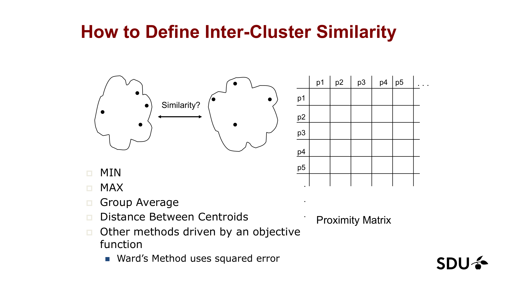
*Figure 7a — Inter-cluster similarity, the four options. (Lecture 12, slide 28.)*

#### 4.4.1 MIN / single-link

*Analogy:* **like joining two clans the moment any single member shakes hands.** Two groups of pins are "close" if their *closest pair* is close — one ambassador, one handshake, one merge.

*Where it breaks down:* a single bridge of close points is enough to chain two visually distinct clusters together — the "single-link chaining" effect. One noisy outlier between two clusters can collapse them into one.

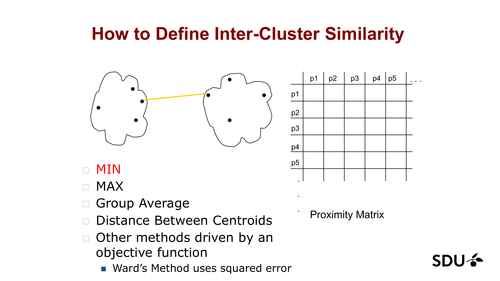
*Figure 7b — MIN / single-link: distance is the closest pair across the two clusters. (Lecture 12, slide 29.)*

#### 4.4.2 MAX / complete-link

*Analogy:* **like demanding *every* member shake hands first.** Two groups are "close" only if the *farthest pair* across them is close. The farthest border point on one cluster to the farthest border point on the other defines the distance.

*Where it breaks down:* the linkage refuses to merge large straggly groups even when most of their members are nearby — a single distant pair holds the two clusters apart. The result is that what *should* have been one cluster ends up split across multiple branches of the dendrogram. (MAX does not literally "break" clusters — agglomerative clustering never splits — but it stops them from forming in the first place.)

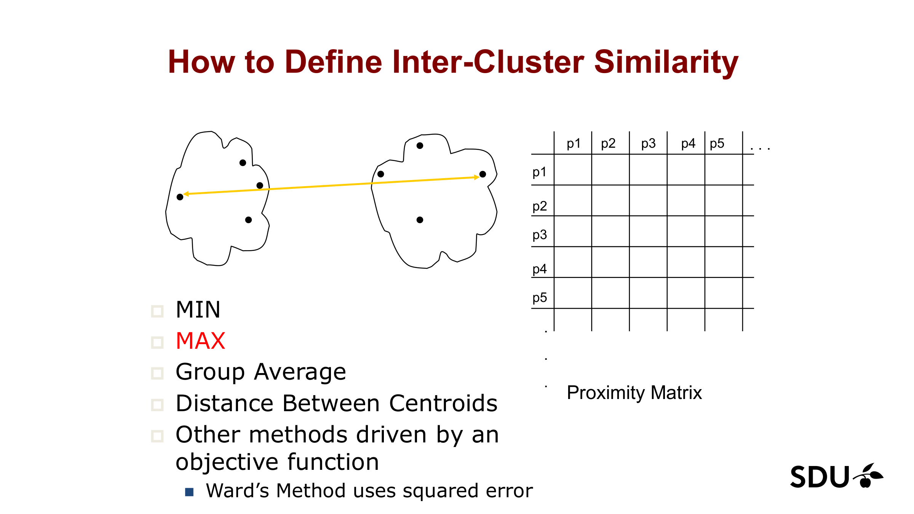
*Figure 7c — MAX / complete-link: distance is the farthest pair across the two clusters. (Lecture 12, slide 30.)*

#### 4.4.3 Group average

*Analogy:* **like averaging every diplomatic handshake.** Average the pairwise distance over every pin in cluster $A$ times every pin in cluster $B$. Less sensitive than MIN to a single chain, less sensitive than MAX to a single straggler.

*Where it breaks down:* requires computing all $|A| \times |B|$ pairwise distances per merge — most expensive of the four geometric linkages.

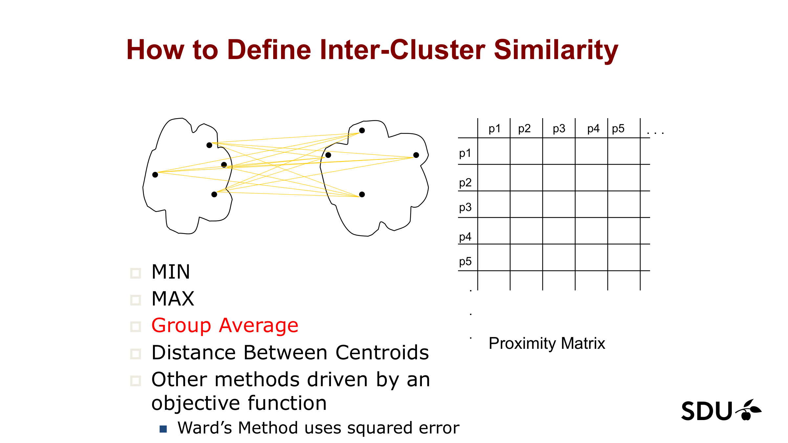
*Figure 7d — Group average: distance is the mean of every cross-cluster pairwise distance. (Lecture 12, slide 31.)*

#### 4.4.4 Centroid linkage (distance between centroids)

*Analogy:* **like measuring city-to-city distance between capitals.** Each cluster has a centroid (its capital). The distance between two clusters is the straight-line distance between the two centroids. Cheap to compute and update.

*Where it breaks down:* centroid distance can *decrease* as you merge. Concrete example with one-dimensional points: clusters $A = \{0\}$ and $B = \{10\}$ have centroids at 0 and 10, so $d(A,B) = 10$. If $A$ and $B$ merge, the new centroid sits at 5. A third cluster $C = \{4\}$ has centroid 4: its distance to the *merged* $A \cup B$ is now $|5 - 4| = 1$ — smaller than its distance to either original parent ($|0-4|=4$, $|10-4|=6$). The dendrogram height for the next merge would therefore be *below* the height of the parent merge — a so-called *inversion* (the dendrogram heights stop being monotone as you climb the tree). Inversions are visually confusing because the dendrogram no longer reads as "earlier-merged = more-similar". The phenomenon is *not on the slides* — only "Distance Between Centroids" is listed — but it is the standard textbook reason centroid linkage is rarely used.

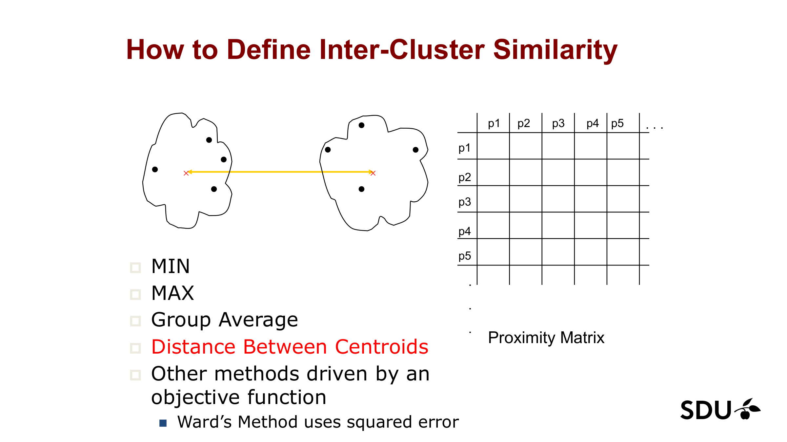
*Figure 7e — Centroid linkage: distance is the straight-line distance between cluster centroids. (Lecture 12, slide 32.)*

#### 4.4.5 Ward's method

Slide 33 lists Ward's method with four bullets — preserved here:

1. **Similarity of two clusters is based on the increase in squared error when two clusters are merged.** Concretely, $d_{\text{Ward}}(A, B) = \text{SSE}(A \cup B) - \text{SSE}(A) - \text{SSE}(B)$ where $\text{SSE}(C) = \sum_{x \in C} \|x - \mu_C\|^2$. We merge the pair whose union increases the total SSE the least.
2. **Similar to group average if distance between points is distance squared.** Algebraically, Ward and squared-distance group-average produce nearly identical dendrograms in many cases.
3. **Less susceptible to noise and outliers** than MIN, because a single bridging point cannot create a low merge cost; the merge must improve the SSE objective for the whole cluster.
4. **Biased towards globular clusters** — minimising squared error favours roughly spherical, equal-variance shapes (same bias K-means has).
5. (Bonus, from the same slide.) **Hierarchical analogue of K-means** — both algorithms minimise total within-cluster squared error, just under different greedy strategies. Ward can be used to **initialise K-means** (the §4.3 "sample + hierarchical" remedy, in its most natural form).

Ward is the only objective-driven linkage on slide 33; the four above are purely geometric.

[Lecture 12, slides 22, 24–33.]

### 4.5 Bisecting K-means

> **Slide-grounded facts only.** The deck names bisecting K-means on slide 17 with one bullet — "Not as susceptible to initialization issues" — and shows the slide-18 picture (a single K=2 split, red vs blue) as its only illustration. Everything below other than those two facts is textbook background, useful for understanding but not safe to quote as "lecture content" on the exam.

Bisecting K-means is a hybrid of the partitional and hierarchical philosophies and produces a binary hierarchy as a side effect.

Algorithm (reconstructed from the textbook; not spelled out on the slide deck):

1. Start with one cluster containing all points.
2. Pick the cluster with the highest SSE (or the largest size) to split.
3. Run K-means with $K = 2$ on that cluster, optionally for several restarts; keep the split with the lowest SSE.
4. Replace the chosen cluster with the two children.
5. Repeat steps 2–4 until you have $K$ leaf clusters.

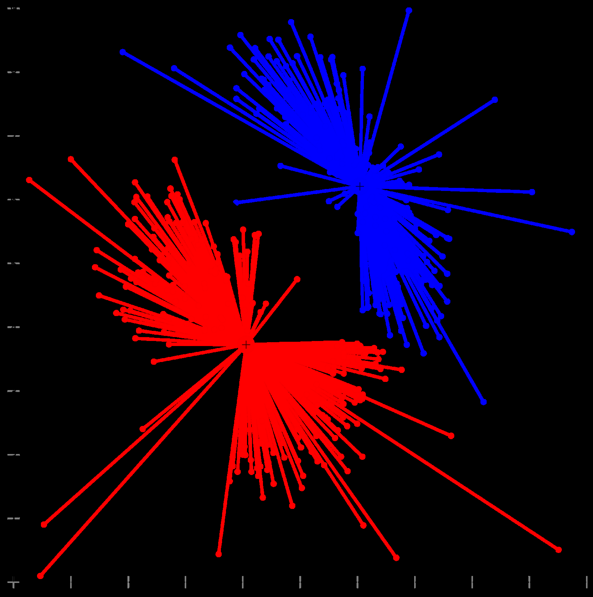
*Figure 8 — Slide 18 illustrates a single K = 2 split (red vs blue rays of a starburst): a bisection at one node of the bisecting-K-means tree, not the full recursive decomposition. The recursion produces a tree whose leaves are the final clusters. (Lecture 12, slide 18; image from Wikipedia.)*

The reason it dodges the "bad random init" failure of flat K-means is that each split is a tiny problem (only $K=2$) on a smaller subset; even random initialisation rarely gets it badly wrong on a 2-cluster problem.

[Lecture 12, slides 17, 18.]

### 4.6 DBSCAN algorithm

After labelling points (§3.7), DBSCAN runs as follows [Lecture 12, slide 40]:

1. Label every point as core / border / noise using `Eps`, `MinPts`.
2. Eliminate noise points (set aside; they do not belong to any cluster).
3. For every core point $p$ not yet assigned to a cluster:
   - Create a new cluster containing $p$ and every other point that is density-connected to $p$ (transitive closure along density edges between core points).
4. Assign each border point to the cluster of its closest core point.

**Choosing the parameters.** Slide 41 gives a clever recipe: for any fixed $k$, the $k$-th nearest neighbour distance of points *inside* a cluster is roughly uniform, while noise points sit much farther from their $k$-th neighbour. So:

1. Pick a $k$ (typical default $k = 4$ → `MinPts = 4`).
2. For every point compute the distance to its $k$-th nearest neighbour.
3. Sort those distances ascending and plot them.
4. The plot rises slowly, then sharply: the "knee" / "elbow" is where cluster points end and noise begins.
5. Read off `Eps = d_knee`, set `MinPts = k`.

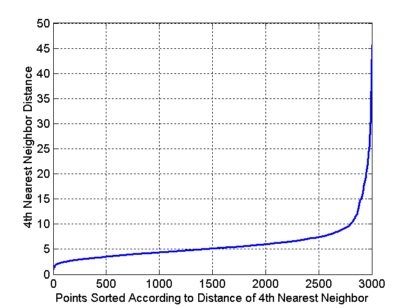
*Figure 9 — The DBSCAN k-distance knee plot. The elbow at distance 7–10 gives `Eps ≈ 7–10` with `MinPts = 4`. (Lecture 12, slide 41.)*

[Lecture 12, slides 35–41.]

### 4.7 Algorithm comparison

| Property | K-means | Hierarchical (agglomerative) | DBSCAN |
|---|---|---|---|
| Need $K$ upfront? | Yes | No — cut dendrogram later | No — derives clusters from density |
| Cluster shape | Spherical (assumes equal variance per axis) | Depends on linkage; MIN handles non-globular | Arbitrary shape (any density-connected region) |
| Handles noise? | No — every point joins a cluster | No — every point ends up in the tree | Yes — noise points are explicitly discarded |
| Sensitive to outliers? | Yes — outliers drag centroids | Depends on linkage; MIN very sensitive, Ward less so | No — outliers become noise |
| Deterministic? | No (depends on initial centroids) | Yes given a linkage | Yes given (Eps, MinPts) |
| Complexity¹ | $O(n K d)$ per iteration | $O(n^{2} \log n)$ time, $O(n^{2})$ space | $O(n \log n)$ with spatial index; $O(n^{2})$ without |
| Main pitfall | Local-minima / bad initialisation (slide 12) | One bad merge is permanent (slide 34) | Varying-density data / parameter sensitivity (slide 43) |

> ¹ **Complexity row is not on the slides.** Slide 34 only says hierarchical clustering has "computational complexity in time and space" without a closed form, and the deck never quantifies K-means or DBSCAN complexity. The figures above are the standard textbook values (Tan/Steinbach/Kumar): hierarchical $O(n^{2} \log n)$ assumes a priority-queue update — the naive implementation is $O(n^3)$. Use as exam *background*; do not cite as "from the lecture".

[Lecture 12, slides 8–43.]

---

## 5. Worked Examples

### 5.1 K-means on a one-dimensional dataset

The lecture works K-means in 1-D on the dataset $\{2, 3, 4, 10, 11, 12, 20, 25, 30\}$ with $K = 2$ and initial centroids $\mu_1 = 2$, $\mu_2 = 4$ [Lecture 12, slides 9–10]. In one dimension, the "dance floor" of the party-host analogy collapses to a number line, and "walks to the nearest host" becomes "smallest absolute-value distance to $\mu_k$" — the math is identical.

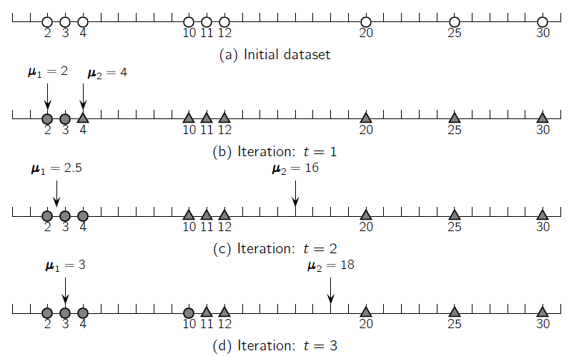
*Figure 10a — K-means iterations $t=1$ through $t=3$ on the 1-D dataset. Panel (b) "Iteration $t=1$" shows the initial centroids μ₁=2, μ₂=4 *before* any assignment; panel (c) "$t=2$" shows the centroids after the first reassignment-and-update, etc. (Lecture 12, slide 9.)*

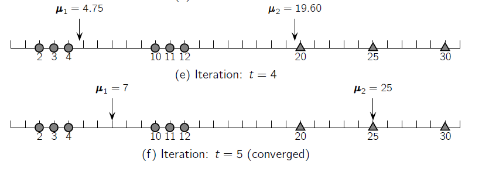
*Figure 10b — K-means iterations $t=4$ and $t=5$ (converged) on the same dataset. (Lecture 12, slide 10.)*

> **Convention.** We label iterations exactly as the slides do: $t=k$ records the **state of the centroids at the start of iteration $k$** — i.e. the centroids that are used for the assignment step of iteration $k$. So $t=1$ is the initial state (just-initialised centroids, no assignment performed yet) and $t=5$ is the converged state (an assignment using these centroids reproduces the same partition, so the next update would not move them). On the exam: if the lecturer asks "what is $\mu_2$ at $t=2$?", the answer is $\mu_2 = 16$ — the value displayed in panel (c) of slide 9.

The iteration trace, step by step:

| $t$ | $\mu_1$ | $\mu_2$ | Assignment $C_1$ produced by this state | Assignment $C_2$ produced by this state |
|---|---|---|---|---|
| 1 (initial) | 2.00 | 4.00 | $\{2, 3\}$ | $\{4, 10, 11, 12, 20, 25, 30\}$ |
| 2 | mean$\{2,3\} = 2.5$ | mean$\{4,10,11,12,20,25,30\} = 16$ | $\{2, 3, 4\}$ | $\{10, 11, 12, 20, 25, 30\}$ |
| 3 | mean$\{2,3,4\} = 3$ | mean$\{10,11,12,20,25,30\} = 18$ | $\{2, 3, 4, 10\}$ | $\{11, 12, 20, 25, 30\}$ |
| 4 | mean$\{2,3,4,10\} = 4.75$ | mean$\{11,12,20,25,30\} = 19.60$ | $\{2, 3, 4, 10, 11, 12\}$ | $\{20, 25, 30\}$ |
| 5 (converged) | mean$\{2,3,4,10,11,12\} = 7$ | mean$\{20,25,30\} = 25$ | $\{2, 3, 4, 10, 11, 12\}$ | $\{20, 25, 30\}$ — identical to the $t=4$ assignment, so the algorithm has converged |

Reading: each row's centroid values come from the *previous* row's assignment. The midpoint between $\mu_1$ and $\mu_2$ acts as the boundary on the number line — every $t$ partitions the number line at $(\mu_1 + \mu_2)/2$.

The interesting feature of this example is the *bias* of the initial centroids $\{2, 4\}$ — both started in the leftmost block. K-means recovers from it, but slowly: it takes the full five iterations and the right cluster expands one point at a time as $\mu_2$ crawls right.

**Final converged partition.**

$$C_1 = \{2, 3, 4, 10, 11, 12\}, \qquad C_2 = \{20, 25, 30\}.$$

The corresponding final centroids are $\mu_1 = \frac{2+3+4+10+11+12}{6} = 7$ and $\mu_2 = \frac{20+25+30}{3} = 25$.

**Final SSE** at the converged state ($\mu_1=7, \mu_2=25$):

$$
\text{SSE} = \underbrace{(2-7)^2 + (3-7)^2 + (4-7)^2 + (10-7)^2 + (11-7)^2 + (12-7)^2}_{C_1\text{ terms}} + \underbrace{(20-25)^2 + (25-25)^2 + (30-25)^2}_{C_2\text{ terms}}
$$
$$= (25 + 16 + 9 + 9 + 16 + 25) + (25 + 0 + 25) = 100 + 50 = 150.$$

Had the algorithm been initialised at $\{3, 25\}$, it would have converged in one iteration with the same partition and the same SSE.

### 5.2 Agglomerative clustering on five companies

Slide 23 gives a 5-company distance matrix:

|          | Co#1  | Co#2  | Co#3  | Co#4  | Co#5 |
|----------|------:|------:|------:|------:|-----:|
| **Co#1** | 0.00 |      |      |      |      |
| **Co#2** | 1.49 | 0.00 |      |      |      |
| **Co#3** | 3.42 | 2.29 | 0.00 |      |      |
| **Co#4** | 1.81 | 1.99 | 1.48 | 0.00 |      |
| **Co#5** | 5.05 | 4.82 | 4.94 | 4.83 | 0.00 |

**Linkage.** The slide-23 dendrogram is drawn without an explicit label, but its merge heights (≈1.48, ≈1.49, ≈1.8, ≈4.8) match a **MIN (single-link)** reconstruction exactly (verified below). We therefore work the example with MIN. Under MAX, the height of the final merge would be $\max(5.05, 4.82, 4.94, 4.83) = 5.05$, not 4.82, and would not match the figure. The chapter's golden rule "when the exam says 'draw the dendrogram', state the linkage first" applies to this example too — declare MIN.

Trace agglomerative clustering with **MIN (single-link)** linkage:

1. Initial clusters: $\{1\}, \{2\}, \{3\}, \{4\}, \{5\}$. Smallest pairwise distance in the matrix is $d(3, 4) = 1.48$. **Merge 3 and 4** at height 1.48.
2. Updated distances using MIN: $d(\{3,4\}, \cdot) = \min$ of row-3 and row-4 entries.
   - $d(1, \{3,4\}) = \min(3.42, 1.81) = 1.81$
   - $d(2, \{3,4\}) = \min(2.29, 1.99) = 1.99$
   - $d(5, \{3,4\}) = \min(4.94, 4.83) = 4.83$
   Remaining pairwise distances now include $d(1, 2) = 1.49$. Smallest of *all* current pairs is $d(1, 2) = 1.49$. **Merge 1 and 2** at height 1.49.
3. Updated distances: $d(\{1,2\}, \{3,4\}) = \min(1.81, 1.99, 3.42, 2.29) = 1.81$. $d(\{1,2\}, 5) = \min(5.05, 4.82) = 4.82$. $d(\{3,4\}, 5) = 4.83$. Smallest: $1.81$. **Merge $\{1,2\}$ and $\{3,4\}$** at height 1.81.
4. Two clusters left: $\{1,2,3,4\}$ and $\{5\}$, with distance $\min(4.82, 4.83) = 4.82$. **Merge them** at height 4.82.

That produces the dendrogram shown on slide 23 (companies 1–4 fuse first, company 5 joins last at exactly height 4.82). Note the slides spell it "Dendogram" — that is the typo discussed in §3.4; treat it as the same word.

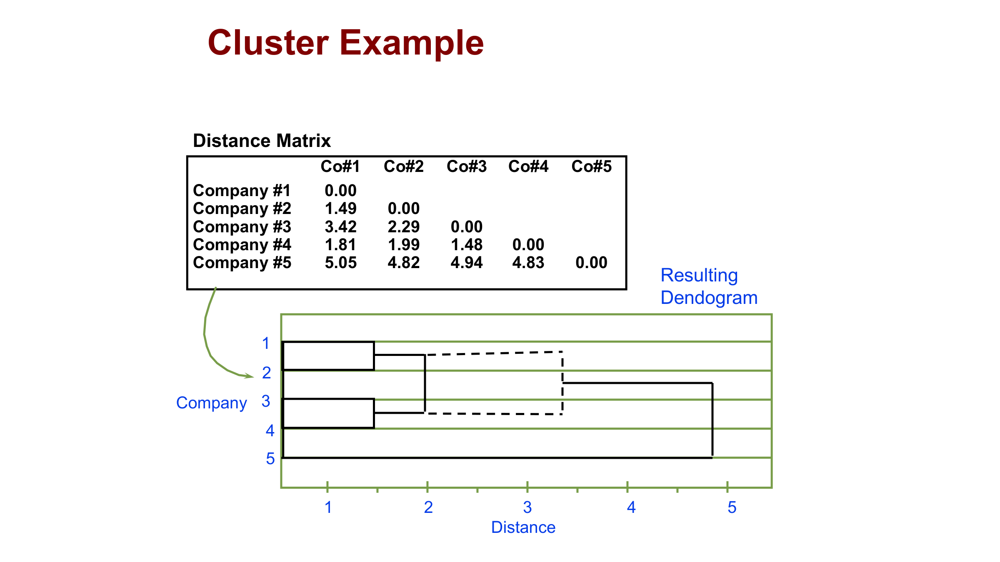
*Figure 11 — Agglomerative clustering with MIN linkage on the 5-company distance matrix. (Lecture 12, slide 23.)*

(Slides 24–27 generalise the same trace. Slide 24 starts from twelve raw points $p_1, \ldots, p_{12}$ with a full $p_i \times p_j$ proximity matrix; slides 25–27 then abstract over partial mergers with five surrogate clusters $C_1, \ldots, C_5$ and explicitly visualise the merger of the two closest clusters $C_2 \cup C_5$, then ask "how do we update the proximity matrix?" — that question is answered by the four linkage methods of §4.4.)

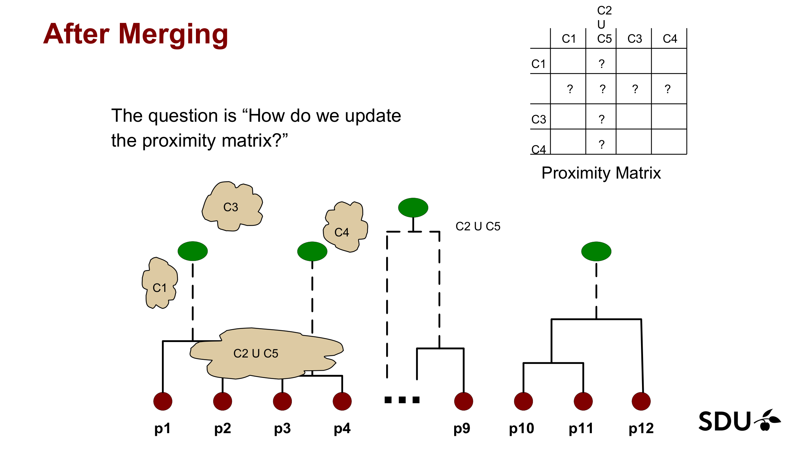
*Figure 12 — After merging C2 and C5, the new row/column of the proximity matrix is undefined until we choose a linkage rule. (Lecture 12, slide 27.)*

[Lecture 12, slides 23–34.]

### 5.3 DBSCAN on a 3-letter point-cloud benchmark

Slides 38, 42 show a 2-D dataset whose ~3 000 blue points form three visually distinct letter-shaped clusters (the exact letters are illegible in the deck rendering and not relevant to the algorithm — what matters is that there are three irregular, non-globular shapes plus uniform noise).

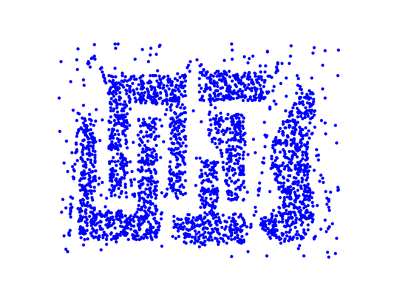
*Figure 13a — DBSCAN input: ~3000 points forming three irregular letter shapes plus surrounding noise. (Lecture 12, slide 38.)*

With `Eps = 10, MinPts = 4` the algorithm produces:

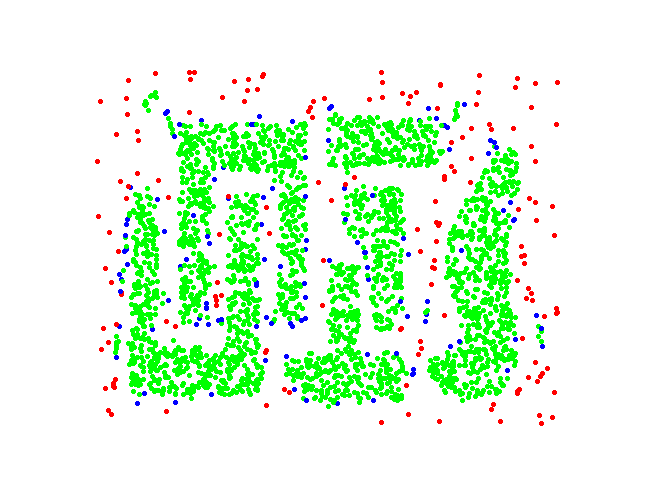
*Figure 13b — DBSCAN output on the same data with `Eps = 10, MinPts = 4`: core points in green, border points in blue, noise points in red. (Lecture 12, slide 38.)*

And the final clustering, after step 4 of the algorithm assigns border points to the closest core point's cluster:

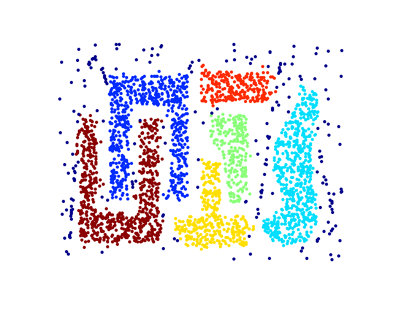
*Figure 14 — DBSCAN recovers six clusters matching the human reading of the strokes inside the three letter shapes (one cluster per visually-isolated stroke). Noise is explicitly discarded. The colour mapping has changed between Fig 13b and Fig 14: in 13b "blue = border", but in 14 "blue = one of the six final clusters". (Lecture 12, slide 42.)*

### 5.4 DBSCAN failure on varying-density data

Slide 43 shows the same algorithm failing when the data contains clusters of very different densities.

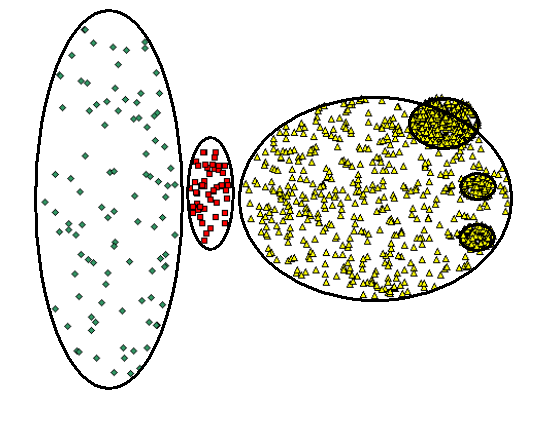
*Figure 15a — Ground-truth clusters: green sparse, red dense, yellow medium with embedded denser sub-clusters. (Lecture 12, slide 43.)*

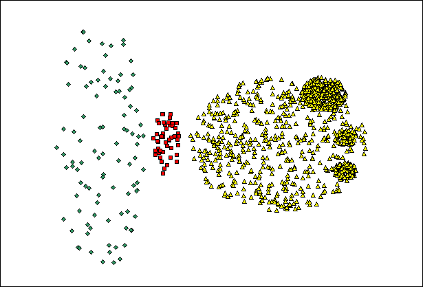
*Figure 15b — DBSCAN, `MinPts = 4, Eps = 9.75`: green sparse cluster (cyan dots) and red dense cluster (red dots) recover, but the medium-density yellow region is over-merged. (Lecture 12, slide 43.)*

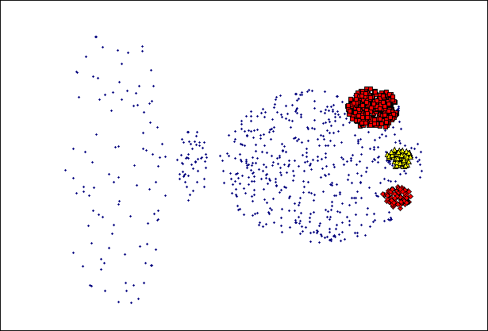
*Figure 15c — DBSCAN, `MinPts = 4, Eps = 9.92`: a 1.7 % change in Eps reclassifies most of the sparse cluster as noise. (Lecture 12, slide 43.)*

A change of `Eps` from 9.75 to 9.92 — a difference of less than 2 % — turns the result from "two of three clusters recovered" to "the entire sparse cluster classified as noise". No single `(Eps, MinPts)` setting can simultaneously handle a sparse and a dense cluster, because by definition the same `Eps`-neighbourhood is "dense" in one region and "sparse" in another.

[Lecture 12, slides 38, 42, 43.]

---

## 6. Common Pitfalls / Exam Traps

1. **Forgetting that K-means converges to a local minimum.** SSE is non-increasing at every step (strict decrease whenever a point switches cluster; equality when nothing changes), but the basin K-means settles in depends entirely on the initial centroids — slide 12. The exam-classic mistake is "K-means finds the optimal clustering"; it does not, even with infinite iterations. (Mitigations: multiple runs, K-means++, bisecting K-means.)
2. **Confusing "the algorithm converged" with "the answer is right".** Convergence in K-means just means centroids stopped moving (or no point switched cluster). Two runs from different inits both converge, both to *different* answers. Always report SSE (or inertia) and re-run.
3. **Choosing $K$ by eyeballing.** Slide 3 makes the same dataset look like 2, 4, or 6 clusters. The lecture does **not** prescribe a method for $K$; if the exam asks "how would you choose $K$?", the slide-deck answer is "you have to pick it — it is an input"; the lab-3 answer is "elbow on inertia vs $K$, or silhouette score".
4. **Treating the dendrogram as canonical.** Different linkages produce different dendrograms on the same data. The four linkages (MIN, MAX, group average, centroid) and Ward have systematically different biases (MIN chains, MAX breaks large clusters, Ward favours globular blobs). When the exam says "draw the dendrogram", state the linkage rule first.
5. **Once-merged-never-undone.** Hierarchical agglomerative clustering is greedy — a wrong merge early on cannot be reversed (slide 34). No objective function is directly minimised by the procedure itself, only by the linkage choice's implicit one.
6. **Single-link / MIN "chaining" effect.** A single bridge of intermediate points fuses two visually distinct clusters into one. If the data has noise *between* clusters, MIN is the wrong linkage.
7. **DBSCAN parameter sensitivity** (slide 43). Tiny changes in `Eps` flip results between two regimes. The k-distance plot (slide 41) is the principled way to choose, but it only suggests a single `Eps`; if the data has varying density, no single setting works. The exam answer is "DBSCAN fails when clusters have substantially different densities — use OPTICS or per-region adaptive Eps". (OPTICS is not on the slides but is the standard follow-up.)
8. **Conflating "noise" with "outlier" in K-means.** K-means has no notion of noise — every point lands in some cluster. If the question is "which clustering algorithm should you use when the data is known to have noise / outliers?", the answer is DBSCAN (or K-medoids), not K-means.
9. **High-dimensional curse.** Slide 19 raises it without solving it: titled "What to do in high-dimensional data?", it shows only an illustrative network-graph image and gives no resolution. As dimensionality grows, every pair of points becomes "about the same distance" (distance concentration), so any algorithm whose core operation is "find the nearest point" or "is the neighbourhood dense?" degrades. Mitigation (not on the slides): dimensionality reduction (PCA) before clustering. **Do not rank the algorithms by dimensional robustness on the exam — the lecturer offers no ranking and the textbooks disagree.**
10. **Forgetting feature scaling.** Not on the slides, but exam-relevant: K-means and DBSCAN both compute Euclidean distance, which is dominated by the largest-range feature. Always z-score (or min-max) features first when they have heterogeneous units.
11. **Cluster validity is hard and subjective.** Slide 44 quotes "clusters are in the eye of the beholder"; slide 46 calls validation "the most difficult and frustrating part of cluster analysis". The reasons to validate (slide 44):
    - Avoid finding patterns in noise.
    - Compare clustering algorithms.
    - Compare two sets of clusters.
    - Compare two clusters.

    Five aspects to evaluate (slide 45):
    1. **Clustering tendency** — does non-random structure exist?
    2. Compare to **external** labels (if available).
    3. Compare to **internal** structure (using only the data).
    4. Compare **two** clusterings to each other.
    5. Determine the **correct number** of clusters.

    Slide 45 adds an important hinge clause: for aspects 2, 3, and 4 we can further distinguish whether we evaluate **the entire clustering** as a whole (one global score) or **individual clusters** within it (one score per cluster). The exam-relevant slogan: validation can be *global* or *per-cluster*, and the choice depends on which question you are trying to answer (compare two whole partitions vs flag one weak cluster inside an otherwise-good partition).

    > **Not on the slides — exam disclaimer.** The deck never names specific validity indices. The textbook follow-ups are: **silhouette**, **Calinski–Harabasz**, **Davies–Bouldin** for internal evaluation; **ARI** (Adjusted Rand Index) and **NMI** (Normalised Mutual Information) for comparing to external labels. If the exam asks "what does *this lecture* cover for cluster validity?", name only the five aspects above and the four reasons to validate. Do **not** volunteer silhouette / CH / DB / ARI / NMI unless the question explicitly asks for textbook indices.
12. **Topics this lecture omits.** K-means++, elbow method, silhouette score, OPTICS, Gaussian mixture / EM clustering, spectral clustering — none on the slides. If exam-relevant they come from ML Lab 3 or the textbook.

[Lecture 12, slides 3, 11, 12, 17, 19, 34, 41, 43–46.]

---

## 7. Connections to Other Lectures

- **L10 Intro to ML §1**: `clustering` was introduced there as the unsupervised task. L12 is the algorithms chapter for that task. The sorting-laundry analogy in [L10 §2](L10-Intro-to-ML.md#2-the-big-picture--analogies) anticipates the §2 laundry/party-host framing here.
- **L10 §3**: contrasts clustering with classification and regression (the two supervised cousins).
- **L11 Regression §3**: shares the *feature scaling* concern (continuous attributes only) and the *overfitting* concept under the relabelled name *cluster validity / finding patterns in noise* (slide 44).
- **L11 §3 polynomial features**: clustering algorithms also live in feature space, and adding more features (lifting to higher dimensionality) hurts clustering more than regression because of distance concentration (slide 19).
- **ML Lab 3 — Clustering** ([`lab3_clustering_handout.ipynb`](../../lab3_clustering_handout.ipynb)): the lab exercises K-means on numeric features, including the topics this deck omits — K-means++ initialisation, elbow / silhouette for choosing $K$, and feature scaling. Treat the lab as the hands-on completion of this chapter.
- **L05 Local Search §3**: K-means is a *local search* in cluster-assignment space, doing coordinate descent on SSE. The "stuck in a local minimum" warning of L05 hill climbing (slide 14) is exactly the trap in §6.1 here, and the slide-17 remedies (multiple restarts, sample-based init, post-processing) are direct cousins of *random-restart hill climbing* in L05.

[Cross-references derived from `study/_shared/cross-references.md`.]

---

## 8. Cheat-Sheet Summary

**Cluster analysis — task.** Given unlabelled $\{x_1, \ldots, x_n\}$, partition (or nest) them so intra-cluster distance is small and inter-cluster distance is large. The "right" number of clusters is ambiguous (slide 3).
*Analogy: sorting laundry without knowing the categories.*

**Three families.**
- **Partitional** — one non-overlapping partition. K-means.
- **Hierarchical** — nested tree. Agglomerative (bottom-up); divisive (top-down, named on slide 7 but never developed; bisecting K-means is the deck's only concrete divisive instance).
- **Density-based** — clusters are dense regions separated by sparse ones. DBSCAN.

**K-means.** Input $K$, initial centroids. Repeat: assign each point to nearest centroid; recompute each centroid as the mean of its members. Until centroids stable. Local minimum of $\text{SSE} = \sum_k \sum_{x \in C_k} \|x - \mu_k\|^2$. Complexity $O(nKd)$ per iteration (textbook, not slide-grounded).
*Analogy: K party-hosts each claim the nearest guests, then re-arrange until nobody wants to switch.*

**Slide-9 iteration convention.** $t=1$ = initial centroids (no assignment yet); $t=k$ = centroids at the start of iteration $k$. So in the worked example $\mu_2$ at $t=2$ is **16**, not 4. Re-read §5.1 if this surprises you on an exam.

**K-means issues.** (slide 11) Choice of initial centroids, choice of $K$, outliers, clusters that differ in shape / density / size.

**Centroid.** $\mu_k = \frac{1}{|C_k|} \sum_{x \in C_k} x$. The gravitational centre — minimises sum of squared distances to members. *Analogy: the balance point of a cluster of pebbles.*

**Initialisation remedies** (slide 17): multiple runs; sample → hierarchical → seeds; over-select then prune; post-processing; bisecting K-means. (K-means++ is the modern default, not on these slides.)

**Bisecting K-means.** Recursively split the highest-SSE cluster into 2 via K-means; produces a binary tree as a by-product. Less sensitive to initialisation.

**Hierarchical agglomerative algorithm.** (slide 22) Compute proximity matrix; each point its own cluster; merge two closest clusters; update matrix; repeat until one cluster.
*Analogy: building a family tree of point similarities; once married, never divorced.*

**Linkages** (how to define inter-cluster distance):
| Linkage | Formula | Pitfall |
|---|---|---|
| MIN (single-link) | $\min d(a,b)$ | Chaining via noise. |
| MAX (complete-link) | $\max d(a,b)$ | Keeps big straggly clusters from forming (one outlier holds them apart). |
| Group average | mean $d(a,b)$ | Expensive. |
| Centroid | $\|\mu_A - \mu_B\|$ | Can invert dendrogram. |
| Ward | Increase in SSE on merge | Globular bias; hierarchical K-means. |

**Dendrogram.** Tree with leaves = points, junction heights = merge dissimilarities. Cut horizontally at height $h$ to get a flat clustering of however-many clusters intersect the cut. *Analogy: an upside-down family tree of mergers; cut it where you like.* (Slides spell it "dendogram"; same word.)

**Hierarchical limits** (slide 34). Computational complexity in time and space (slide 34 does not quantify; textbook ≈ $O(n^2)$ space, $O(n^2 \log n)$ time with priority queue); once merged never undone; no global objective directly minimised; varies in sensitivity to noise / unequal cluster sizes / convex shapes / breaking large clusters depending on linkage.

**DBSCAN.** Parameters Eps (radius), MinPts. Each point: core (≥ MinPts within Eps), border (in some core's neighbourhood but itself sparse), noise (neither). Cluster = maximal set of density-connected core points + their borders. Algorithm: label all points → drop noise → grow each cluster from an unassigned core point's density-connected component → attach borders to closest core's cluster.
*Analogy: expand through dense neighbourhoods; loners are outliers.*

**Choosing (Eps, MinPts).** Fix $k$ (typical 4). Plot sorted distance to $k$-th nearest neighbour. The knee gives `Eps`, with `MinPts = k`. (slide 41.)

**When DBSCAN wins.** Resistant to noise; arbitrary cluster shapes; arbitrary sizes (slide 42).

**When DBSCAN fails** (slide 43). Varying densities; high-dimensional data; sensitive to parameters (Eps change of 2 % flips result).

**Algorithm cheat-table.**
| Algorithm | Need $K$? | Shape | Noise? | Pitfall |
|---|---|---|---|---|
| K-means | Yes | Spherical, equal-size | No | Local minimum (slide 12) |
| Agglomerative | No (cut later) | Linkage-dependent | No | Once merged, never undone (slide 34) |
| DBSCAN | No | Arbitrary density-connected | Yes | Varying density (slide 43) |

**Cluster validity** (slides 44–46). "Clusters are in the eye of the beholder." Five aspects: tendency, external-label comparison, internal evaluation, two-clustering comparison, choosing $K$. Validate to (i) avoid finding patterns in noise, (ii) compare algorithms, (iii) compare two clusterings, (iv) compare two clusters.

**This lecture omits** (cover from ML Lab 3 / textbook): K-means++, elbow method, silhouette score, OPTICS, Gaussian mixture / EM, spectral clustering, feature scaling.

[Lecture 12, slides 1–47.]

---
_Source: Lecture 12 slides 1–47 ("Cluster Analysis", Serkan Ayvaz)._
