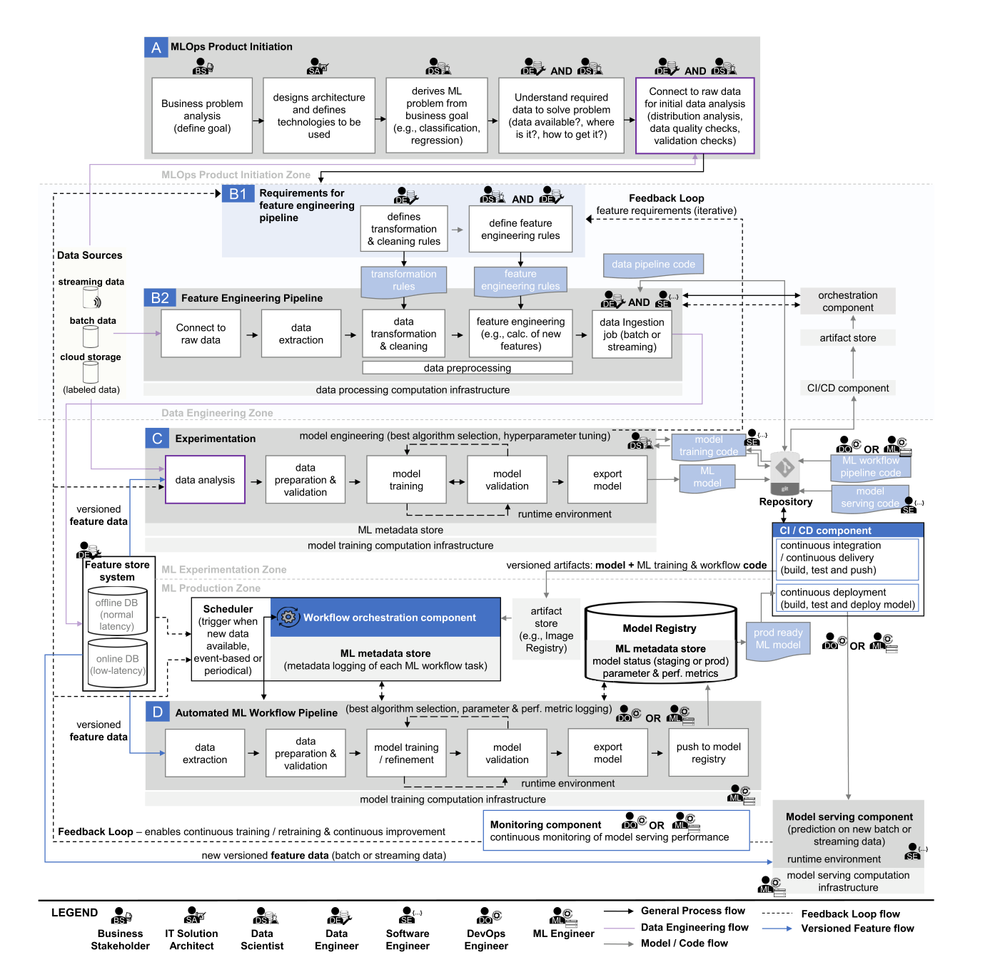

# Case Study 3: MLOps — End-to-End Architecture for Production Machine Learning

> **Source:** case-3.pdf (14 pages) — Kreuzberger, Kühl & Hirschl, *"Machine Learning Operations (MLOps): Overview, Definition, and Architecture"*, IEEE Access, vol. 11, 2023, DOI 10.1109/ACCESS.2023.3262138.
> **Likely tied to:** L3 (Integrability / Modifiability), L4 (Testability / Deployability), L6 (Microservices, CI/CD, resilience — Hystrix case), L8 (DevOps & continuous practices). The paper itself is essentially a *reference architecture* exercise — the same kind of artifact L2 introduces and the rest of the course refines.

---

## Scenario

The paper studies the recurring industrial failure mode of machine-learning (ML) projects: data scientists build a model that works in a notebook, but the organisation cannot turn it into a production service. Gartner-style figures cited in the paper put a large share of ML proofs of concept never reaching production, mainly because the surrounding *system* — pipelines, infrastructure, monitoring, retraining, governance — is missing. The authors set out to define and document what is needed to bridge this "Dev–Ops" gap *for ML* and call the resulting paradigm **MLOps**.

Methodologically the paper is a mixed-method synthesis: a systematic literature review (27 articles out of 1,864 retrieved), a tool review of 11 open-source and commercial ML platforms (TensorFlow Extended, Airflow, Kubeflow, MLflow, Databricks, SageMaker, Azure ML Pipelines, Azure ML, GCP Vertex AI, IBM Cloud Pak for Data, and others), and eight semi-structured expert interviews with senior ML practitioners. From this evidence base the authors derive a *technology-agnostic reference architecture* for ML systems plus a definition of MLOps.

The "system" being designed is therefore not a single product but a **reference architecture** — a blueprint that any team building a production ML platform should be able to instantiate with their stack of choice. It covers product initiation, the feature-engineering pipeline, an experimentation zone, an automated training pipeline, a model registry, model serving, monitoring, and feedback-driven retraining.

## Stakeholders & context

The paper is unusually explicit about *roles*, which doubles as its stakeholder list:

- **R1 Business stakeholder** (a.k.a. product owner / project manager) — owns ROI and the business problem.
- **R2 Solution / IT architect** — chooses technologies and produces the architecture.
- **R3 Data scientist** — translates the business problem into an ML problem; owns model engineering.
- **R4 Data engineer (DataOps)** — builds and operates feature pipelines and feature store ingestion.
- **R5 Software engineer** — applies design patterns and coding standards; productionises serving code.
- **R6 DevOps engineer** — owns CI/CD and orchestration.
- **R7 ML engineer / MLOps engineer** — cross-functional role spanning data-science, data-eng, software-eng and DevOps; runs the ML platform end-to-end.

Context and constraints flagged repeatedly in the literature and interviews:

- **Fluctuating compute demand** — training workloads are spiky, voluminous and varying; infrastructure must be elastic (CPU/RAM/GPU).
- **Constant new data** — retraining is a repetitive task, so automation is non-negotiable.
- **Multi-team / multi-skill** — eight roles spanning data, software, ops, and business; risk of silos.
- **Heterogeneous stacks** — open-source + cloud-managed services that have to integrate via APIs.
- **Governance & traceability** — regulated industries demand versioning of data, model, *and* code.
- **Skills shortage** — interview consensus that architects, data engineers, ML engineers, and DevOps engineers are scarce.

## Quality attributes in play

This case is a *quality-attribute parade*; nearly every QA from L2–L8 maps onto one or more of the nine MLOps principles.

| QA (lecture concept) | How the case puts it into play |
|---|---|
| **Deployability** (L4) | CI/CD component (C1), automated build/test/delivery, image-registry-based artifact promotion, A/B testing of champion vs. challenger models. |
| **Testability** (L4) | CI pipeline runs unit + integration tests; experimentation stage isolated from production; feature-store offline DB enables reproducible training data. |
| **Modifiability** (L3) | Workflow defined as DAGs (Apache Airflow / Kubeflow Pipelines) so steps can be swapped; technology-agnostic component model. |
| **Integrability** (L3) | Explicit component boundaries (C1–C9) with named interfaces (REST APIs for serving, image registry, feature store APIs); "best-of-breed" mix-and-match philosophy. |
| **Reproducibility** (cross-cutting, foundational here — P3) | Versioning of data, model and code; feature store separates feature definitions from raw data; metadata store records lineage. |
| **Observability / Monitoring** (L6) | Continuous monitoring component (C9) tracks prediction accuracy, infra metrics, and CI/CD health; Prometheus + Grafana / ELK / TensorBoard. |
| **Scalability / Performance** (L7) | Distributed training infra (Kubernetes / OpenShift), GPU-optimised compute, distributed feature processing (Spark, Kafka). |
| **Availability / Resilience** (L6) | Workflow orchestrator re-runs failed tasks; offline/online feature DBs separate latency profiles; serverless inference for elastic load. |
| **Auditability / Governance** | Metadata store records training date, duration, parameters, lineage; model registry tracks staging vs. production status. |

The headline scenario the paper repeatedly returns to: *"a model in production whose accuracy drifts because the input distribution changes — detect the drift, automatically retrain, redeploy."* That single scenario stitches monitoring, feedback loops, continuous training, versioning, CI/CD, and deployment together.

## Architectural decisions / patterns used

The reference architecture decomposes the system into **nine principles (P1–P9), nine technical components (C1–C9), and seven roles (R1–R7)**. The components-to-principles mapping is the core architectural artifact:

The full end-to-end architecture below is the single most important figure in the paper — it shows components, roles, data flow, control flow, and feedback loops in one view:

### Decision 1 — Make pipelines the unit of work (DAG-based orchestration)

- **Decision:** Replace ad-hoc scripts and notebooks with workflow-orchestrated DAGs (Airflow, Kubeflow Pipelines, SageMaker Pipelines, etc.) for both the feature-engineering pipeline (B) and the automated training pipeline (D).
- **Rationale:** ML tasks have complex, dependency-rich execution orders; CI/CD tools alone can't express the dependencies cleanly. DAG orchestrators give automatic retries, metadata capture, and isolation per step.
- **Trade-off:** Adds a heavyweight piece of infrastructure that has to be operated and tuned; raises the bar for who can author a pipeline. Lecture link: this is the classic L3 modifiability vs. complexity trade-off — explicit dependency graphs are easier to evolve but heavier to set up.

### Decision 2 — Centralise features in a feature store with offline + online DBs

- **Decision:** Component C4 holds two databases — *offline* (high-latency, large reads for training) and *online* (low-latency reads for production prediction).
- **Rationale:** Training and serving have completely different latency profiles; sharing one feature definition across both prevents training/serving skew, a notorious ML bug class.
- **Trade-off:** Two stores to keep consistent; pipeline complexity grows. Lecture link: L3 integrability (one canonical feature definition → fewer integration faults) at the cost of L7 scalability complexity (dual-write or CDC consistency).

### Decision 3 — Treat the model as a first-class versioned artifact (model registry + metadata store)

- **Decision:** C6 (model registry) stores trained models; C7 (metadata store) records lineage — training date, parameters, code version, feature data version, metrics, status (staging / production).
- **Rationale:** Reproducibility (P3), versioning (P4), and metadata tracking (P7); essential for audit and rollback.
- **Trade-off:** Storage cost and operational overhead; teams must commit to disciplined promotion (staging → production). Lecture link: matches the L4 deployability story — versioned artifacts in a registry are precisely the L4 "deployable units" pattern.

### Decision 4 — Continuous training driven by monitoring feedback loops

- **Decision:** C9 monitoring observes prediction accuracy and infra; once a drift threshold is crossed, the feedback loop (P9) triggers the orchestrator to retrain (P6 continuous training).
- **Rationale:** Concept drift is unavoidable; manual retrigger is too slow and error-prone.
- **Trade-off:** Risk of cost blow-ups (every drift signal kicks off a GPU-heavy retraining run); risk of feedback-induced instability if the drift detector is noisy. Lecture link: this is the textbook L6 resilience / control-loop pattern — like a circuit breaker (Hystrix) but for model quality.

### Decision 5 — CI/CD for both code and model artifacts

- **Decision:** C1 component runs lint, build, test, and deliver for ML code (training, inference, application) *and* for ML pipeline definitions. On successful experimentation it builds containerised artifacts and pushes them to an image registry.
- **Rationale:** Bring DevOps (L8) into the ML world; idempotent builds; rapid feedback.
- **Trade-off:** ML test suites are harder to write than for normal code (statistical, non-deterministic). Lecture link: directly the L8 / L4 continuous-delivery pipeline pattern, augmented for ML peculiarities (data tests, model-quality tests, A/B / champion-challenger).

### Decision 6 — Serving via containerised REST APIs with deployment-mode choice

- **Decision:** C8 model serving runs on Kubernetes with REST endpoints, with three deployment modes: real-time (REST), batch (MapReduce / Spark), or serverless.
- **Rationale:** Different use cases need different latency/cost profiles; containerisation gives portable, scalable serving.
- **Trade-off:** Three modes means three operational playbooks; champion–challenger A/B testing adds traffic-shaping complexity. Lecture link: L6 microservices + L7 scalability — same patterns, plus an ML-quality dimension on top.

### Decision 7 — Technology-agnostic reference architecture

- **Decision:** The architecture is deliberately specified in *terms of components and roles*, not products. Each component lists multiple example technologies (open-source and cloud).
- **Rationale:** ML tool market is moving too fast to lock to one vendor; mix-and-match via APIs is the realistic path.
- **Trade-off:** Integration risk is pushed onto the adopter; "every API can talk to every API" is theoretical, not actual. Lecture link: matches the reference-architecture concept in L2 — useful as a thinking tool but not a turnkey solution.

### Decision 8 — Define a cross-cutting role (ML engineer / MLOps engineer)

- **Decision:** Beyond data scientists and DevOps engineers, the architecture *needs* a role at the intersection of data, software, DevOps and backend skills.
- **Rationale:** Without this glue role, silos persist and the system never becomes end-to-end automated.
- **Trade-off:** Such people are rare and expensive; the paper flags this as the #1 organisational challenge.

### Tooling landscape evaluated

The tool review backs the architecture with concrete examples — useful exam fodder for "name a tool that implements component X":

## Lessons learned / key takeaways

- **MLOps = DevOps + ML + Data Engineering.** It's not a tool; it's a paradigm. Trying to "buy MLOps" without the cultural/role shift fails.
- **Pipelines, not notebooks.** The single biggest behavioural shift is moving from notebook-driven model building to DAG-orchestrated, versioned, automated pipelines.
- **Version everything** — code, data, *and* models. Without all three, reproducibility and rollback are impossible.
- **Two databases in the feature store.** Offline for training, online for serving; one canonical feature definition feeds both — this is how you avoid training/serving skew.
- **The control loop is the heart.** Monitor → detect drift → retrain → redeploy is the loop that makes an ML system *operational* instead of a one-shot deployment.
- **You need a cross-functional engineer.** The MLOps engineer is the linchpin role; without them the components don't connect.
- **Test for model quality, not just code.** ML CI/CD must include data-validation, model-quality, and A/B tests — classical unit tests are insufficient.
- **Open challenges aren't solved by buying a platform.** Skills shortage, silo culture, fluctuating compute demand, support root-cause analysis across mixed stacks — these are organisational, not technical, problems.

## Exam relevance

Very high. This case is a goldmine for several exam question patterns Ruohonen's course rewards:

1. **"Design a reference architecture for X"** style questions — Figure 4 is a near-perfect template you can adapt (rename components, keep the pipeline / registry / monitor / feedback-loop skeleton).
2. **"Identify the quality attributes and trade-offs"** — every component has a clear primary QA driver and a clear trade-off (see the table above).
3. **CI/CD for ML** — extends the basic L4/L8 CI/CD pipeline with data tests, model-quality tests, model registry promotion, and A/B traffic-shifting. Expect a question asking how CI/CD differs from classical software.
4. **Feedback loops & continuous training** — concept drift detection, retraining triggers, control-loop architecture. Classic L6 resilience-pattern thinking.
5. **Roles and Conway's law** — the role overlap (Figure 3) is a textbook illustration that team structure shapes the system; expect a question linking it to integrability and modifiability.
6. **Map principles ↔ components ↔ roles** — Figure 2 + Figure 3 + Figure 4 together give a small structured taxonomy you can memorise (nine P, nine C, seven R) and reproduce on a whiteboard.
7. **Pitfalls of "buying" an architecture** — the technology-agnostic decision is a great example of when a reference architecture genuinely helps vs. when adopters underestimate integration cost.

Likely exam framings: *"Sketch an end-to-end MLOps architecture, identify the components, explain which quality attributes each addresses, and discuss two trade-offs."*

## Cross-references to lectures

- **L1 — What is software architecture / reference architectures:** the paper *is* a reference-architecture artifact; useful as a worked example.
- **L2 — Quality attributes (general):** the paper maps almost every QA from the course onto concrete components, making it a Rosetta stone for QA discussion.
- **L3 — Integrability & Modifiability:** explicit component boundaries (C1–C9), API-based integration of best-of-breed tools, DAG-based pipelines as modifiability enablers.
- **L4 — Testability & Deployability:** CI/CD pipeline (C1), model registry promotion, champion-challenger A/B testing, automated test gates including data and model-quality tests.
- **L5 — Distributed transactions / Sagas:** less directly relevant, but the multi-step training pipeline with compensating retries (failure of a step triggers an orchestrator-driven recovery) shares the saga-like coordination shape.
- **L6 — Microservices / Resilience / Hystrix:** model serving as a containerised microservice; monitoring + feedback loops as a control-loop pattern, analogous to circuit breakers but for model quality; drift detection ≈ health-check-driven failover.
- **L7 — Scalability / Performance:** distributed training infrastructure, GPU specialisation, distributed feature processing (Spark, Kafka), elastic compute and serverless inference.
- **L8 — DevOps / Continuous practices:** the paper explicitly positions MLOps as DevOps applied to ML; CI/CD, monitoring, automation, and culture all carry over with ML-specific extensions.
