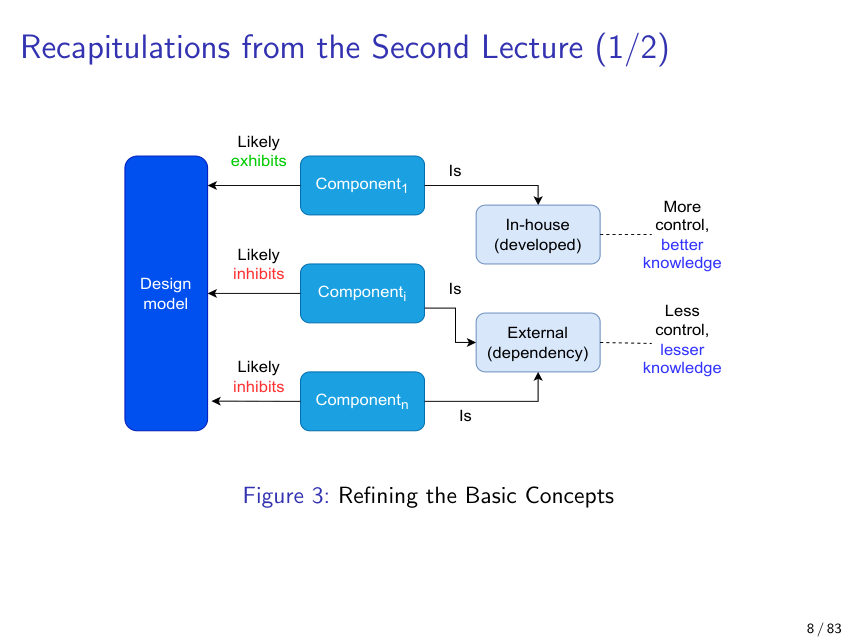
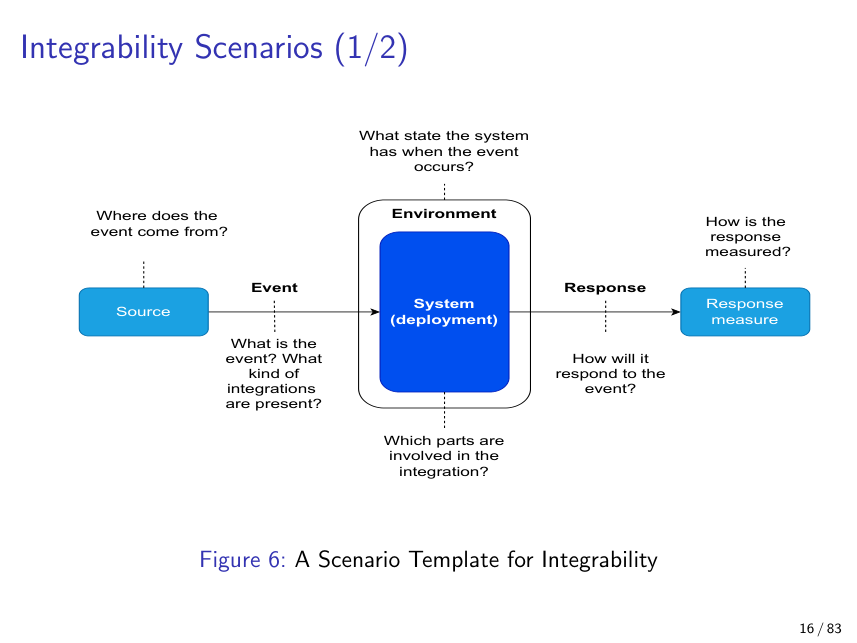
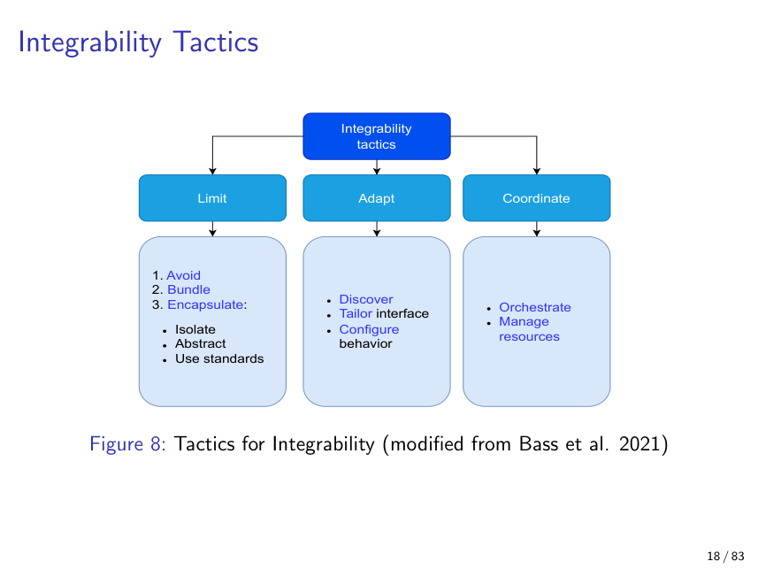
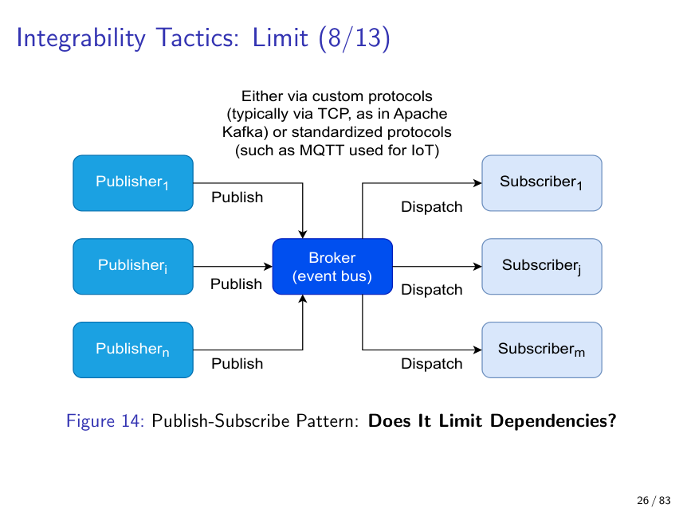
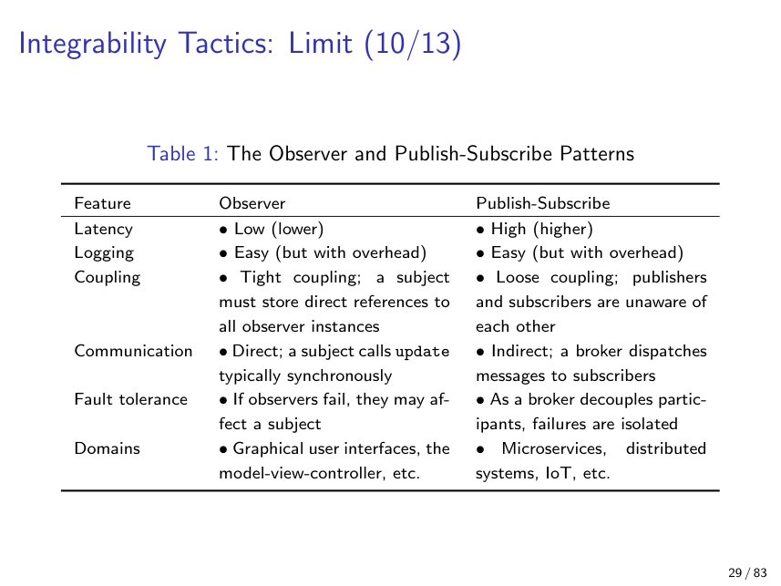
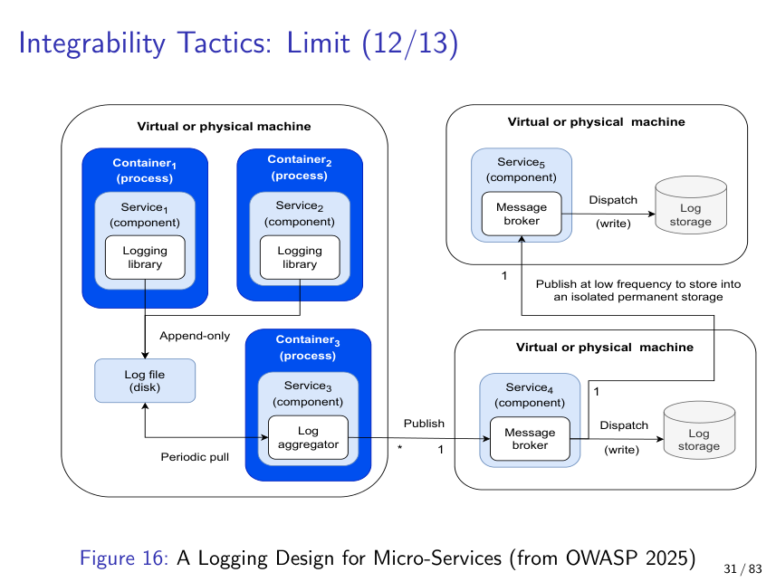
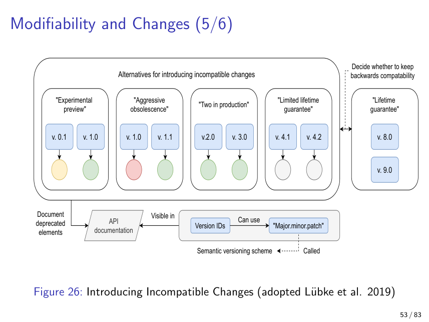
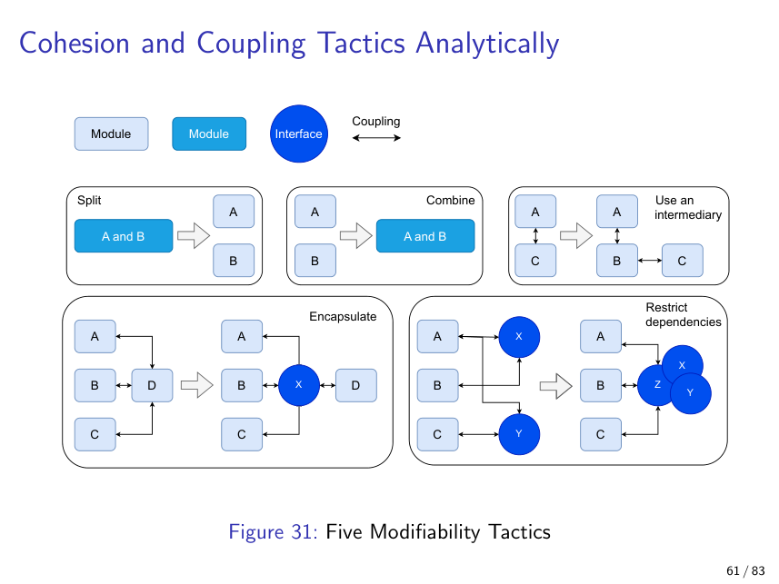
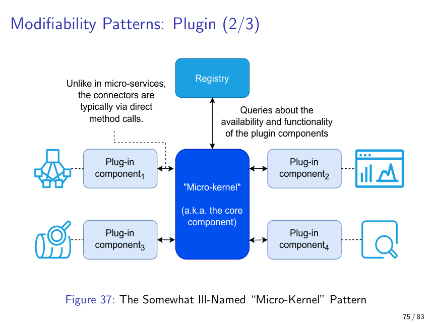
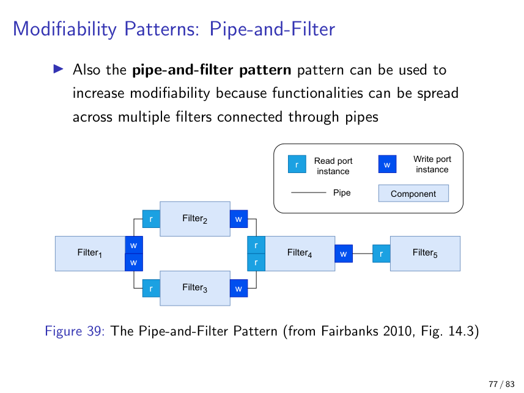

# Lecture 3: Integrability and Modifiability as Quality Attributes

> **Source:** lecture_3.pdf (83 pages)
> **Lecturer:** Jukka Ruohonen
> **Date (if stated):** February 24, 2026
> **Course:** Software Architecture (T630019402)

## Themes covered

1. **Integrability as a distinct quality attribute** — how to evaluate, measure and design for the ability of a system to absorb, swap or wire together components.
2. **Dependencies as the unit of analysis** — taxonomy (run-time, dev, installed, transitive, syntactic, semantic) and the *size × distance* model for grading them.
3. **Integrability tactics** — Bass et al.'s three-branch tree: **Limit, Adapt, Coordinate** (avoid / bundle / encapsulate / standards / discover / tailor / configure / orchestrate / manage resources).
4. **Integrability patterns** — Observer vs Publish-Subscribe, wrappers, bridges, mediators, SOA.
5. **Maintenance as the long tail of software cost** — releases, staging trees, ~80% cost rule, lifetime decisions.
6. **Modifiability as a sub-QA of maintainability** — the six planning questions (what / how likely / what to support / where / who / cost), backwards compatibility, semantic versioning, deprecation alternatives.
7. **Modifiability tactics** — reduce coupling, increase cohesion, defer binding (compile / startup / runtime), plus the five canonical modifiability moves (split, combine, encapsulate, intermediary, restrict).
8. **Modifiability patterns** — publish-subscribe, layering, client-server, MVC, plugin/micro-kernel, pipe-and-filter, batch-sequential.

## Concepts

### Architectural tactics vs architectural patterns
**Definition:** A **tactic** is a high-level, fairly abstract design choice aimed at one quality attribute; a **pattern** is a smaller, more concrete and reusable design that realises tactics.
**Why it matters:** The vocabulary is not universal — Fairbanks calls tactics "styles" — but inside this course Bass et al.'s usage is the reference, and exam answers must use it consistently.
**Detailed explanation:** Think of tactics as *intentions* (e.g. "encapsulate the dependency", "defer binding"), while patterns are *blueprints* (Observer, Publish-Subscribe, Wrapper, Bridge, MVC). A single tactic typically has several patterns realising it, and the same pattern can serve multiple tactics for different QAs.
**Analogy:** A tactic is a coach saying "press high up the pitch"; a pattern is the 4-3-3 formation the team actually lines up in. The instruction is the tactic; the diagram on the whiteboard is the pattern.
**Example:** The *encapsulate* tactic is realised by the *Wrapper* pattern (one specific module hides another).
**Common pitfall / nuance:** Students mix the two terms freely; on the exam keep tactics abstract and patterns concrete.

### Dependency (general)
**Definition:** Any relation between two software elements such that one cannot fulfil its purpose without the other.
**Why it matters:** Integrability is *defined* in terms of counting and weighting dependencies; you cannot measure or improve it until you can name them.
**Detailed explanation:** Latendresse et al. (2022) split dependencies along two axes — *when* they bite (run-time, development-time, install-time) and *how deep* they go (depth = level in the tree, with anything below the first level called *transitive*). Bass et al. add a *type* axis: syntactic dependencies (a call, an inheritance, an interface) vs semantic dependencies (a shared protocol, a file format, a meta-data convention). On top of those, two components can also be coupled *temporally* (they must agree on time/order) or via *shared resources* (CPU, RAM, network, disk).
**Analogy:** A dependency tree is like a Russian doll. The outermost doll is *your* code; one level in is a direct dependency; everything nested inside is transitive — you didn't pick it, but you carry it.
**Example:** Your Node.js project lists `express` (direct, run-time, depth 1). `express` itself pulls in `body-parser`, which pulls in `qs` — both transitive, both still loaded in production.
**Common pitfall / nuance:** "Dev dependency" doesn't mean "harmless" — your test framework can still inject a supply-chain attack at build time.

### Size and distance (the σ metric)
**Definition:** Bass et al. evaluate each component C in system S by **size** (number of potential dependencies between C's interfaces and S) and **distance** (how hard it is to resolve each dependency); σ = Σ C_i sums size across all components.
**Why it matters:** It is the only quantitative handle the textbook offers for integrability; expect a slide-style question asking you to recite size, distance, and the five distance dimensions.
**Detailed explanation:** Size is mostly objective: count the calls, count the interfaces. Distance is subjective and decomposes into five sub-distances:
1. **Syntactic** — agreement on data shape (XML vs JSON, int vs float).
2. **Data semantic** — agreement on meaning of the data (seconds vs nanoseconds, km vs miles, Celsius vs Kelvin).
3. **Behavioural semantic** — agreement on protocol/state (who starts up first, client vs server roles).
4. **Temporal** — agreement on timing (10 Hz vs 100 Hz, 10 ms vs 100 ms latency).
5. **Resource** — agreement on shared resources (memory, CPU, disk, bandwidth).
**Analogy:** Plugging an appliance into a foreign wall socket. Size = how many prongs are in the plug. Syntactic distance = "do the prong shapes match?" Data-semantic = "is 230 V the same number my appliance reads as 230 V?" Behavioural = "does the outlet expect a switch flip before delivering power?" Temporal = "50 Hz vs 60 Hz?" Resource = "is enough amperage available?"
**Example:** The Mars Climate Orbiter loss (1999): software A spoke pound-seconds, software B spoke newton-seconds — perfect syntactic match, fatal data-semantic distance.
**Common pitfall / nuance:** Two components passing the same JSON schema can still have *huge* semantic distance; never declare integrability solved by interface matching alone.

### Integrability scenario template
**Definition:** A six-slot template — *source, event, environment, system, response, response measure* — used to elicit concrete integrability requirements.
**Why it matters:** It turns vague "should be integrable" requirements into testable specifications. Bass-style scenarios are a recurring exam format.
**Detailed explanation:** The slots map to questions: where does the change request originate (vendor, stakeholder, marketplace)? what does it ask for (add new component, integrate new version, integrate in a new way)? in what phase (development, integration, deployment)? against which part (entire system, set of components, meta-data, configuration)? how should the system respond (changes completed/integrated/tested/deployed, new configuration honours all guarantees)? and how do we measure success (components changed, % code changed, tests pass/fail, money, time)?
**Analogy:** Like a press-release template before launching a product — forcing the team to write the headline, audience, key benefit and success metric *before* coding.
**Example:** "When a *vendor* (source) releases a *new sensor firmware version* (event) during *production* (environment), the *sensor adapter component* (system part) shall be *deployed without disrupting data collection* (response), with *zero dropped readings* (measure)."
**Common pitfall / nuance:** Skipping the response measure produces unfalsifiable requirements. Always write a number.

### Integrability tactics taxonomy: Limit / Adapt / Coordinate
**Definition:** Bass et al.'s three-branch tactic tree: *Limit* dependencies, *Adapt* to differences, *Coordinate* component activities.
**Why it matters:** Almost every concrete integrability move maps to one of three branches; memorising the tree gives you a structured way to answer "what would you do?" questions.
**Detailed explanation:**
- **Limit** = reduce the number / strength of dependencies → *avoid*, *bundle* (vendor a copy into your tree), *encapsulate* (isolate, abstract, use standards).
- **Adapt** = bridge differences without changing the components themselves → *discover* (service discovery), *tailor* interface (add/remove capabilities), *configure* behaviour (build/start/runtime flags).
- **Coordinate** = manage interactions among components → *orchestrate* (centralised conductor), *manage resources* (thread pool, quota arbiter).
**Analogy:** Hosting a dinner party. *Limit* = invite fewer people, or make sure the loud cousin sits in another room. *Adapt* = put labels on dishes for the vegan guest. *Coordinate* = a host who decides who speaks when and serves wine in turn.
**Example:** Bundling `lodash` into your repo (limit/bundle) vs publishing a discovery endpoint that lists active microservices (adapt/discover) vs running Kubernetes (coordinate/orchestrate).
**Common pitfall / nuance:** The branches overlap — using standards is a *limit* tactic but also avoids *adapt* work later; tactics combine, they don't compete.

### Bundling vs package-management
**Definition:** *Bundling* means copying a dependency directly into your repository's tree; *package management* means listing the dependency and letting a tool resolve and download it.
**Why it matters:** Russ Cox (2019) argues bundling is often the safer default for high-trust contexts; package managers risk supply-chain attacks (typosquatting, fake stars on GitHub, malicious updates).
**Detailed explanation:** Bundling trades reproducibility and isolation for storage and update-friction. Package managers trade convenience for trust in the registry. *Pinned dependencies* — locking to a version identified by a cryptographic hash — recover some bundling-style safety without giving up the manager. OpenSSF Scorecard automates checks (known vulnerabilities, code reviews, signed releases) so you can grade an open-source package before adopting it.
**Analogy:** Bundling = freezing your own meals at home. Package manager = ordering takeout — fast, but you must trust the kitchen.
**Example:** Go's vendoring directory bundles dependencies; npm's `package-lock.json` with integrity hashes is closer to pinning.
**Common pitfall / nuance:** "Many stars" ≠ "trustworthy"; the CMU 2026 ICSE paper on fake GitHub stars (cited on slide 20) shows star counts can be cheaply gamed.

### Observer pattern vs Publish-Subscribe pattern
**Definition:** **Observer** is a module-level pattern where a *subject* keeps direct references to *observer* instances and calls `update()` on each; **publish-subscribe** is a distributed pattern where publishers and subscribers communicate through an intermediary *broker (event bus)*, unaware of each other.
**Why it matters:** They look similar in textbook diagrams but have opposite coupling, latency and failure profiles. Exam-favourite comparison.
**Detailed explanation:** Observer is *tight* — the subject holds references, so adding an observer means attaching to the subject. Latency is low, communication is direct (often synchronous), failure of an observer can affect the subject, and it lives in GUI/MVC code. Publish-subscribe is *loose* — publishers and subscribers don't know each other; the broker dispatches asynchronously. Latency is higher, fault tolerance is better (broker isolates failures), but determinism, end-to-end encryption, testability and delivery guarantees suffer because nothing knows the full route. Used in microservices, IoT (often via MQTT), distributed systems.
**Analogy:** Observer is a teacher with a class roster — when something changes, she calls each named student. Publish-subscribe is a radio station — anyone tuned in hears the broadcast; the DJ doesn't know who's listening.
**Example:** Observer = a Java Swing button firing `ActionEvent` to registered listeners. Publish-subscribe = Apache Kafka over TCP, or MQTT for IoT temperature sensors.
**Common pitfall / nuance:** A "noisy publisher" (one publisher flooding the bus) can starve other subscribers because a typical broker has no global scheduler. Slide 28 illustrates this exactly.

### Logging design for microservices (encapsulation in practice)
**Definition:** An OWASP-recommended logging architecture where each service writes locally via a logging library, log aggregators periodically pull and forward via a message broker to isolated permanent storage.
**Why it matters:** It shows multiple integrability tactics combined: encapsulation (services log only via the library), use of a broker (publish-subscribe), and resource management (low-frequency publishing to limit bandwidth).
**Detailed explanation:** The lecturer asks "what is inconsistent in the figure?" — the slide reveals how tactic mixing in real designs often produces small mismatches (e.g. one container writes to disk while another publishes directly via broker, mixing semantics).
**Analogy:** A hospital with each ward keeping its own paper log (local file), a clerk visiting periodically (aggregator), and a central archive locked behind a single door (permanent storage).
**Example:** ELK stack (Elasticsearch + Logstash + Kibana) with Fluentd shippers, or Loki + Promtail, mirrors this exact shape.
**Common pitfall / nuance:** Direct writes from a service to permanent storage skip the encapsulation, making it harder to swap storage later.

### Wrapper vs Bridge vs Mediator
**Definition:** Three encapsulation patterns differing in scope and binding time.
- **Wrapper** — module-specific; exposes fewer interfaces than the wrapped module; routes all calls to the wrapped module.
- **Bridge** — more general; translates "required" assumptions of one component to "provided" assumptions of another; the translation is fixed at design/build time.
- **Mediator** — like a bridge, but determines the "required" assumptions *at runtime*.
**Why it matters:** They are easy to confuse on the exam. The differentiator is *generality* and *binding time*.
**Detailed explanation:** A wrapper is bound to its target module; you write `LoggingFileWrapper` around `File`. A bridge is independent of either side — PCI bridges connect any host bus to any PCI device. A mediator centralises *runtime* coordination (object_1 asks the mediator for object_2's current state instead of holding a reference). The "god class" anti-pattern lurks here when a mediator grows too big.
**Analogy:** Wrapper = a translator who only ever interprets between English and your specific cousin from Mexico. Bridge = a phonebook that converts area codes between any two countries with a published table. Mediator = a live operator who, when you call, decides on the fly whom to connect you to.
**Example:** Wrapper = `java.io.BufferedReader` around a `Reader`. Bridge = a RESTful gateway between mobile clients and backend microservices (slide 43). Mediator = a chat-room server deciding at message time who else is in the room.
**Common pitfall / nuance:** Wrappers don't translate; they restrict and route. Translation usually means you have a bridge.

### Service discovery
**Definition:** An architectural pattern where clients learn the address/capabilities of services dynamically rather than via hard-coded references.
**Why it matters:** It is the canonical *Adapt → Discover* tactic and underlies cloud-native systems.
**Detailed explanation:** Classic examples are DNS (name → address) and DHCP (host → network configuration). The DHCP handshake is *Discover → Offer → Request → Acknowledge*; the client broadcasts, the server offers, the client requests, the server acknowledges. Service discovery in microservices (Consul, etcd, Kubernetes Services) generalises this idea.
**Analogy:** Walking into a hotel lobby and asking the concierge where the gym is, instead of memorising every floor plan in advance.
**Example:** A new Kubernetes pod registers itself; downstream services find it via a virtual service IP, not a hard-coded one.
**Common pitfall / nuance:** Discovery solves *location* coupling but adds a new dependency on the registry; if the registry dies, nothing finds anything.

### Orchestration (and its god-class danger)
**Definition:** A coordinate-branch tactic that centralises decisions about *what runs where and when* in a dedicated component (the orchestrator).
**Why it matters:** It is the model behind Kubernetes, Airflow, and most container platforms.
**Detailed explanation:** The orchestrator combines service discovery, configuration and resource management. The flow on slide 37: an event hits the orchestrator (1), which consults service discovery (2), reads meta-data (3), provisions resources on a machine (4), and forwards data (5). Meta-data (slide 39) drives the choices — e.g. `{"tag":"(a)","id":"machine_2","cpus":"4","ram":"16GB","ram_min":"8GB"}` tells the orchestrator who can host the workload.
**Analogy:** An air-traffic control tower. Pilots could in principle radio each other, but the tower centralises sequencing — at the cost of being a single point of failure.
**Example:** Kubernetes' scheduler picking nodes based on pod resource requests and node taints/tolerations.
**Common pitfall / nuance:** Pushing too much logic into the orchestrator gives the god-class anti-pattern — every change ripples through it.

### Maintenance phase and the 80% rule
**Definition:** The phase that begins when the first release reaches production; routinely 60–80% of a system's total lifetime cost.
**Why it matters:** It anchors why modifiability (a maintenance-time sub-QA) is worth optimising up front.
**Detailed explanation:** A typical release pipeline has a staging tree (release-candidate 1 … n) and a release tree, with selection-by-test gating each transition. Once a release reaches production the maintenance clock starts. Maintenance includes bug fixing, security patching, performance tuning, dependency updates and feature evolution. The longer the support window (Linux kernel ≠ commercial product), the heavier the patching backlog becomes — fixing a vulnerability in code released a decade ago is genuinely difficult.
**Analogy:** Buying a house. Closing day (the first release) is when you start paying for plumbing, repainting, roof repairs — and that ongoing cost dwarfs the purchase price over decades.
**Example:** Windows XP receiving paid extended-support security patches more than a decade after release.
**Common pitfall / nuance:** "Cheap to write" rarely means "cheap to maintain"; modifiability is paid once, maintenance is paid forever.

### Six modifiability planning questions
**Definition:** Bass et al.'s checklist used during design: (1) What can change? (2) How likely? (3) What should be supported? (4) Where will changes be made? (5) Who will make them? (6) What does each change cost?
**Why it matters:** Provides a structured way to *anticipate* changes, which is the core of modifiability design.
**Detailed explanation:** Question 1 includes laws (GDPR, CRA), hardware, internal env (cloud platform), external env (protocols), and other QAs. Question 4 distinguishes change locations — source code, compile-time flags, configuration, deployment environment. Question 6 has two halves: cost-per-change and cost-of-making-changes-easier. The latter only pays off when changes are frequent.
**Analogy:** Buying renovation insurance. You estimate which rooms might be remodelled (what can change), how often (likelihood), which renovations you'll actually pay for (what is supported), whether you'll DIY or hire (who), at the design stage or after move-in (where), and whether the insurance premium beats out-of-pocket costs (cost).
**Example:** Anticipating that the EU may classify your IoT device under the CRA → encapsulate logging and update mechanisms so legal requirements can be slotted in later without rewriting.
**Common pitfall / nuance:** Making *everything* changeable is over-engineering ("don't go overboard" — slide 64 on Spring framework).

### Ripple effects
**Definition:** A change in one element propagates ("ripples") through related elements, forcing further changes elsewhere.
**Why it matters:** The whole point of cohesion-and-coupling design is to bound ripple radius.
**Detailed explanation:** Ripples cross artifact boundaries: a legal change (e.g. a new GDPR Article) → requirements → implementation → tests → documentation. They also cross component boundaries: changing component 3 may force changes in components 4, 5 and 8 (slide 59). Modifiability tactics aim to localise the ripple to as few components as possible.
**Analogy:** A pebble dropped in a pond. You can't stop ripples — but you can choose whether to drop it in a small basin (localised) or an open lake (system-wide).
**Example:** Renaming a public REST endpoint forces changes in every client and every integration test — a wide ripple. Renaming a private method ripples only inside one class.
**Common pitfall / nuance:** Tests are part of the ripple set — "I only changed one line of production code" is rarely the whole story.

### Backwards compatibility and semantic versioning
**Definition:** *Backwards compatibility* = newer versions remain interoperable with older binaries, data, or callers. *Semantic versioning* = `MAJOR.MINOR.PATCH` where MAJOR bumps signal incompatibility, MINOR signals compatible new features, PATCH signals compatible bug fixes.
**Why it matters:** Whole industries (x86 instruction set, the C language, Windows) are still shaped by compatibility decisions made decades ago. Versioning is the contract through which users learn what to expect.
**Detailed explanation:** Lübke et al. (2019) catalogue alternatives for introducing incompatible changes: *experimental preview* (0.x — anything goes), *aggressive obsolescence* (v1.0 to v1.1, drop the old), *two in production* (run v2 and v3 side by side), *limited lifetime guarantee* (support v4.1 only for a window), and *lifetime guarantee* (v8 / v9 supported forever). Semantic versioning makes the choice visible to callers in the version number itself; deprecation marks the in-between phase where v1 functionality is still alive but flagged for removal.
**Analogy:** Phone chargers. Lightning → USB-C is an aggressive obsolescence; USB-A surviving for two decades is a lifetime guarantee; "this beta cable may break" is an experimental preview.
**Example:** Python 2 → Python 3 was advertised with a long deprecation window (two-in-production), but in practice the transition took over a decade.
**Common pitfall / nuance:** Bumping MINOR while sneaking in a breaking change is the cardinal sin of semantic versioning — it silently breaks downstream pinned ranges.

### Five core modifiability moves (split, combine, encapsulate, intermediary, restrict)
**Definition:** A canonical menu of structural changes that improve cohesion/coupling: **split** an incohesive module into two; **combine** two modules that share responsibility; **encapsulate** to hide details behind an interface; insert an **intermediary** (mediator, broker, wrapper); **restrict** dependencies (allow only specific calls).
**Why it matters:** Almost every concrete refactoring you'll do at the design stage is a composition of these five.
**Detailed explanation:** *Split* (A & B → A and B) when responsibilities differ. *Combine* (A and B → A & B) when they overlap. *Encapsulate* an interface around a module to control its surface. *Intermediary* — insert a C between A and B so A no longer talks directly to B. *Restrict* — keep all elements where they are, but enforce that some calls are forbidden (e.g. a layering rule).
**Analogy:** Rearranging a kitchen. Split the all-in-one drawer into utensils and cutlery (split). Merge two spice cabinets into one (combine). Put a door on the pantry (encapsulate). Use a serving hatch between kitchen and dining room (intermediary). Tape a "no entering with shoes" sign on a door (restrict).
**Example:** Extracting a `UserAuthService` from a `UserService` (split); inserting a Kafka topic between two tightly coupled services (intermediary).
**Common pitfall / nuance:** Splitting too aggressively gives nano-services — same total coupling, distributed over the network.

### Defer-binding tactic
**Definition:** Make commitments as late as possible in the development → deployment → runtime timeline.
**Why it matters:** Each delayed binding turns a code change into a config or runtime change — moving cost from "engineer + release cycle" to "operator + restart".
**Detailed explanation:** Three stages of binding: **compile time** (preprocessor flags like `#ifdef DEBUG`), **start-up time** (read `config.xml` when the process boots), and **runtime** (signals from other processes, GUI sliders, command-line interaction). Polymorphism and parameters defer to runtime; configuration files defer to start-up; conditional compilation defers to compile time. Bass et al.'s notation: `f(x)` with hard-coded `b=1` is less general than `f(x, b)` — start with the parameter even if you ship `b=1`.
**Analogy:** Shipping a car. Compile-time binding = welding the seat in at one position. Start-up binding = setting the seat when you turn on the ignition. Runtime binding = a power seat the driver moves anytime.
**Example:** Feature flags in production let you flip behaviour without redeploying.
**Common pitfall / nuance:** Excessive late binding (Spring's XML-driven dependency injection is the canonical example) makes the system's behaviour invisible from the source code alone.

### Modifiability principles: least surprise, small interface, DRY, uniform access
**Definition:** Four general design heuristics from Bass et al. (2021).
- **Principle of least surprise** — interfaces should behave consistently with caller expectations.
- **Small interface** — two interacting interfaces should exchange as little as possible.
- **Don't repeat yourself** — avoid redundant ways to reach the same goal.
- **Uniform access** — do not leak implementation; a resource is requested the same way whether served from cache, disk, or freshly computed.
**Why it matters:** They are the litmus tests when reviewing an API for modifiability.
**Detailed explanation:** Uniform access is the most subtle — Eiffel's invention: `account.balance` looks identical whether `balance` is a field or a method, freeing the implementer to change between the two without breaking callers.
**Analogy:** Light switches in a house. Least surprise: up = on everywhere. Small interface: a switch has two positions, not seventeen. DRY: one switch controls each light, not three switches in parallel. Uniform access: you flick the switch without caring whether the bulb is LED, incandescent or fluorescent.
**Example:** REST endpoints returning `200 OK` consistently for both cached and freshly computed responses — uniform access in practice.
**Common pitfall / nuance:** DRY can be over-applied; two snippets that look the same today may serve different purposes tomorrow.

### Plugin / micro-kernel pattern
**Definition:** A core component exposes a stable connector through which independently developed *plugins* extend functionality, often advertised via a *registry*.
**Why it matters:** Drives ecosystem patterns: browsers (extensions), VS Code, Eclipse, Photoshop, WordPress.
**Detailed explanation:** Coupling is mostly confined to the connector, so different teams (and even end-users) can deliver plugins without modifying the core. Unlike microservices, plugin-to-core communication is usually via direct method calls inside the same process. Big drawback: a plugin runs arbitrary code with the same privileges as the host — slide 76 references Firefox/Chrome/Edge extensions being weaponised for spying.
**Analogy:** A games console (core) + game cartridges (plugins). The core defines the connector; cartridge makers don't know each other but can all plug in.
**Example:** Eclipse IDE — every menu item, perspective and editor is loaded from a plugin via a manifest registry.
**Common pitfall / nuance:** "Micro-kernel" is misleading here — it borrows the OS term but does not require a kernel-style boundary. It's plugin-pattern with marketing.

### Pipe-and-filter vs batch-sequential
**Definition:** Both compose components in a directed flow; the difference is granularity. **Pipe-and-filter** = each filter streams output to the next; **batch-sequential** = each stage finishes completely before the next starts.
**Why it matters:** Promotes modifiability (filters/stages can be added, swapped or reordered) and is the architectural model behind classic Unix pipelines, data processing systems, and ETL.
**Detailed explanation:** Pipes and filters have read/write port instances and connect via pipes; data trickles through. Batch-sequential is the same DAG shape but each stage waits for its predecessor to finish — like nightly Hadoop MapReduce jobs versus a Kafka Streams topology.
**Analogy:** Pipe-and-filter is a car wash conveyor — every station works on a different car simultaneously. Batch-sequential is one car going through the wash from start to end before the next enters.
**Example:** `cat file.log | grep ERROR | sort | uniq -c` is pipe-and-filter. A nightly ETL that dumps yesterday's data to disk, then loads it, then aggregates it, is batch-sequential.
**Common pitfall / nuance:** Pipe-and-filter limits how much state any filter can carry — if a filter needs the whole dataset to make a decision, you've effectively switched to batch-sequential.

### Modifiability via other patterns: layering, client-server, MVC
**Definition:** Each is a classical pattern that, when applied properly, localises change.
**Why it matters:** Asked repeatedly across all modifiability lectures.
**Detailed explanation:**
- **Layering** — changes at lower layers don't ripple upward if the layer interface is stable; downsides are performance (crossing layers) and constraining upper-layer developers when the lower layer hasn't yet shipped what they need.
- **Client-server** — clients and servers evolve independently; clients have no coupling to each other; scaling the server side scales the system. Drawbacks: network dependency, security exposure (C/I/A).
- **MVC** — views and controllers don't depend on each other (both depend on the model), so UI/interaction logic changes don't cascade.
**Analogy:** Layering = a building where you can renovate the basement without touching the penthouse. Client-server = a restaurant — many diners, one kitchen, no diner knows any other. MVC = a stage play where actors (controllers) and audience (view) only share a script (model).
**Example:** OSI model layers; HTTP client/server; web frontends consuming a REST model.
**Common pitfall / nuance:** "MVC" in modern JS frameworks is often actually MVVM or Flux/Redux; check what is depending on what before claiming modifiability benefits.

## Important diagrams (catalog)

- `lecture_3_p08_img1_refining_basic_concepts.png` — In-house vs external components and the control/knowledge axis; sets up why integrability matters.
- `lecture_3_p16_img1_integrability_scenario_template.png` — The six-slot scenario template (source / event / environment / response / measure).
- `lecture_3_p18_img1_integrability_tactics_tree.png` — Full taxonomy of integrability tactics: Limit, Adapt, Coordinate.
- `lecture_3_p26_img1_publish_subscribe_pattern.png` — Pub-sub broker pattern with publishers and subscribers decoupled.
- `lecture_3_p29_img1_observer_vs_pubsub_table.png` — Six-row comparison table: latency, logging, coupling, communication, fault tolerance, domains.
- `lecture_3_p31_img1_logging_microservices_design.png` — Real-world OWASP logging stack combining encapsulation + broker + isolated storage.
- `lecture_3_p53_img1_incompatible_change_alternatives.png` — Five options for shipping incompatible changes and the semantic-versioning scheme.
- `lecture_3_p58_img1_modifiability_tactics_tree.png` — Reduce coupling / increase cohesion / defer binding taxonomy with sub-tactics.
- `lecture_3_p61_img1_five_modifiability_tactics.png` — The five-move cohesion/coupling palette: split, combine, encapsulate, intermediary, restrict.
- `lecture_3_p75_img1_plugin_micro_kernel_pattern.png` — Core + plugins + registry diagram.
- `lecture_3_p77_img1_pipe_and_filter_pattern.png` — Five-filter pipeline with read/write ports and pipes.

## Exam-relevant takeaways

1. Use Bass et al.'s vocabulary precisely: **tactics** are abstract intentions, **patterns** are concrete designs. Fairbanks calls tactics "styles" but this course follows Bass.
2. Integrability = **size × distance**, where distance decomposes into five axes: **syntactic, data-semantic, behavioural-semantic, temporal, resource**. Be able to give an example of each.
3. The integrability tactic tree has three branches: **Limit (avoid / bundle / encapsulate), Adapt (discover / tailor / configure), Coordinate (orchestrate / manage resources)**.
4. **Observer vs Publish-Subscribe** is high-yield: tight vs loose coupling, low vs higher latency, GUI/MVC vs microservices/IoT — and a single noisy publisher can starve a broker because there is no scheduler.
5. **Wrapper / Bridge / Mediator** distinction: wrapper is module-bound, bridge is general and design-time, mediator is general and runtime.
6. Maintenance is roughly **80% of total lifetime cost**; this is the economic justification for spending design effort on modifiability up front.
7. The **six modifiability questions** (what / how likely / what is supported / where / who / cost) are the standard checklist.
8. **Semantic versioning** = MAJOR.MINOR.PATCH; know the five Lübke alternatives for shipping incompatible changes (experimental, aggressive obsolescence, two-in-production, limited lifetime, lifetime).
9. The **five canonical modifiability moves**: split, combine, encapsulate, intermediary, restrict.
10. **Defer-binding tactic** with three timing buckets: compile-time (`#ifdef`), start-up (config files), runtime (signals/GUI/polymorphism); don't go overboard.
11. **Four modifiability principles**: least surprise, small interface, DRY, uniform access — learn one example for each.
12. Modifiability-promoting patterns to be able to discuss with trade-offs: **publish-subscribe, layering, client-server, MVC, plugin/micro-kernel, pipe-and-filter, batch-sequential**.

## Cross-references

- **Likely connects to Lecture 2 (Quality Attributes overview)** — integrability and modifiability are presented here as the *first* QAs after the general framework; expect Lecture 2 to introduce the QA hierarchy and the scenario template structure.
- **Likely connects to a later "Scalability" lecture** — slide 55 explicitly defers scalability ("there will be a lecture on this topic"), and scalability is listed as one of four change-type drivers.
- **Likely connects to "Security" lecture(s)** — every modifiability/integrability tactic was repeatedly annotated with security trade-offs (encapsulation vs end-to-end encryption, plugin pattern arbitrary code execution, supply-chain attacks via package managers).
- **Likely connects to a "Performance / Distributed Systems" lecture** — temporal distance, broker latency, layering performance costs, client-server scaling all set up performance content.
- **Likely connects to a "Microservices / Cloud" lecture** — orchestration, service discovery, configuration, OWASP logging architecture and the publish-subscribe pattern are presented as building blocks.
- **Likely connects to a "Testing / DevOps" lecture** — the maintenance phase figure (staging tree, release candidates, deployment, production) and testability/security trade-offs hint at later release-engineering content.
