# Lecture 7: Scalability — Service Meshes, Load Balancing, and Diagnosis

> **Source:** lecture_7.pdf (72 pages)
> **Lecturer:** Jukka Ruohonen
> **Date (if stated):** April 7, 2026

## Themes covered

1. **Scalability defined** as a distinct QA: performance proportionally increased by added resources.
2. **Mathematical scaling models** — Amdahl's law and its multi-core refinement by Hill & Marty.
3. **Service meshes / cluster computing**, with **Kubernetes** as the reference platform (nodes, pods, containers, kubelet, kube-proxy, autoscaler).
4. **Cluster patterns** — **gateway** and **sidecar** for managing communication and cross-cutting concerns.
5. **Horizontal vs. vertical scaling** at workload and infrastructure viewpoints; autoscalers, geofencing, eventual consistency.
6. **Load balancing revisited** — DNS-based static algorithms (round-robin, MX records), CDNs (Cloudflare/Akamai), SDN (OpenStack L7 policies).
7. **Latency / throughput decomposition** into networking (a), computing (b), I/O (c); space-time and distance scalability (Bondi 2000).
8. **Diagnosis of performance/scalability problems** — bottlenecks, log analysis, statistical debugging, retrospective triaging.

## Concepts

### Scalability (Ruohonen's working definition)
**Definition:** A system is *scalable* if its performance can be **proportionally** increased by increasing resources (CPUs, machines, memory).
**Why it matters:** Distinguishes scalability from raw performance — a faster single machine improves performance but says nothing about scalability. The QA is about *how* the system reacts to adding resources.
**Detailed explanation:** Lecture 7 explicitly notes the term is overloaded (also used in economics/business). The architectural meaning hinges on the word **proportionally** — doubling resources should roughly double useful capacity. Amdahl's law shows this is rarely true in practice because of the serial fraction.
**Analogy:** A restaurant that doubles its kitchen staff but still has only one cash register: throughput plateaus at the register, not the kitchen — the "serial fraction" caps the speedup.
**Example:** A web service handling 1,000 req/s on one server. If adding a second identical server brings throughput to ~2,000 req/s, the system is scaling well; if it only reaches 1,200 req/s, the serial portion (shared DB lock, single load balancer) is dominating.
**Common pitfall:** Confusing scalability with performance — a non-scalable system can still be fast for small loads, and a scalable system can have terrible latency per request.

### Amdahl's law
**Definition:** Speedup `y = 1 / (a + (1−a)/p)`, where `p` = number of CPUs, `a` = serial (non-parallelizable) share, `1−a` = parallel share.
**Why it matters:** Quantifies the hard ceiling on speedup; explains why throwing cores at a problem hits diminishing returns.
**Detailed explanation:** As `p → ∞`, `y → 1/a`. So if 10% of the workload is sequential (`a = 0.1`), maximum speedup is 10× no matter how many cores you have. Footnote in the slides: Amdahl's 1967 paper had no equations; this formulation is Gustafson's (1988).
**Analogy:** A relay race with 10 legs where one leg must be run alone. No matter how many spare runners you bring, the single-runner leg sets the floor on race time.
**Example:** A batch ETL job whose final "write to single output table" step is 20% of runtime can never go faster than 5× through parallelism alone.
**Common pitfall:** Treating `a` as fixed. Hill & Marty (2008) refined this for multi-core, and Gustafson (1988) argued the parallel share itself often grows with problem size ("scaled speedup").
**Related diagram:** 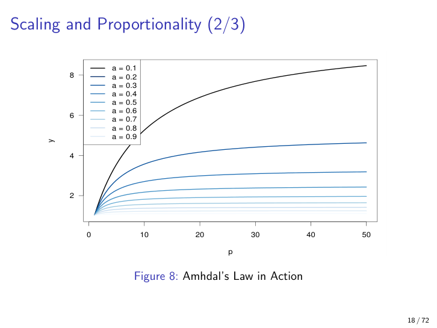

### Service mesh (treated as ≈ cluster computing / HPC)
**Definition:** A high-level scalability tactic that distributes workloads across a cluster of nodes; the lecture equates it to cluster computing in the HPC sense.
**Why it matters:** It is the *architectural unit* for scaling modern cloud-native systems. Most concrete scaling tactics (autoscaling, sidecar, gateway) live inside a service mesh.
**Detailed explanation:** Terminology is deliberately vague and vendor-specific. The lecture uses Kubernetes as the canonical reference but stresses that alternatives (Nomad, Mesos, plain HPC schedulers) exist with their own equally vague vocabulary.
**Analogy:** A shipping logistics network: pods/containers are individual parcels, nodes are warehouses, the mesh is the dispatching system that routes work and reassigns parcels when warehouses fill up.
**Example:** Kubernetes cluster running a microservices app with 50 services, each replicated across 3 worker nodes, communicating via kube-proxy.
**Common pitfall:** Calling everything a "service mesh"; strictly the term often refers to the inter-service communication layer (Istio, Linkerd) while Kubernetes itself is the orchestrator beneath it. The lecture treats them as interchangeable for QA purposes.

### Kubernetes anatomy: cluster / node / pod / container
**Definition:** A **cluster** holds multiple **nodes** (virtual/physical machines); each node runs one **kubelet** (manages pod state/health) and one **kube-proxy** (TCP/IP load-balancer); a **pod** is a scheduling unit with its own IP that holds one or more **containers** sharing IPC / local storage.
**Why it matters:** The exam expects fluent use of these terms — they appear in mock-up Q2 and Case #7.
**Detailed explanation:** Pods are the unit of scheduling, not containers. Containers inside a pod share localhost and can use POSIX shared memory / message queues / local files; pods communicate over TCP/IP. Each pod has its own IP from a node-level bridge subnet (e.g., 10.0.1.0/24).
**Analogy:** Cluster = office building; node = floor; pod = office room (one phone line = IP); container = desk inside the room (people on the same desk just hand papers over; people in different rooms must phone each other).
**Example:** A web-app pod with `nginx` + `auth-sidecar` containers; the two share a Unix socket and never touch the network.
**Common pitfall:** Treating pod and container as synonyms. Putting frequently-chatting components in *different* pods is a common performance bug because IPC is far faster than TCP/IP.
**Related diagram:** 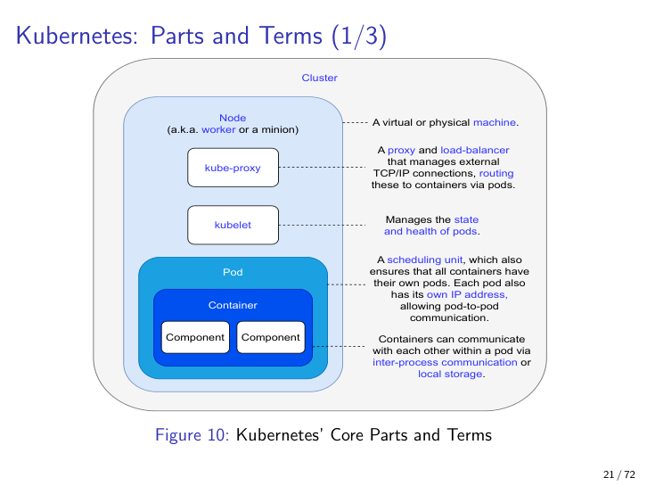

### kubelet vs kube-proxy
**Definition:** **kubelet** = per-node agent managing pod **state and health**; **kube-proxy** = per-node proxy + load-balancer managing external **TCP/IP** connections and routing them to containers via pods.
**Why it matters:** Splitting "health/lifecycle" from "traffic routing" is a textbook separation of concerns; understanding which one fails explains different cluster outages.
**Detailed explanation:** kubelet talks to the master/control plane to start/stop containers and report status. kube-proxy implements the Service abstraction and can perform DNS-based round-robin load balancing across pods.
**Analogy:** kubelet is the building manager (lights, water, leases); kube-proxy is the receptionist routing visitors to the correct floor.
**Common pitfall:** Blaming kube-proxy for crash-loop restart issues — those are kubelet's domain.
**Related diagram:** 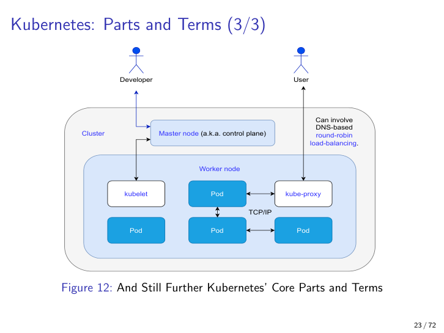

### Pod-to-pod vs container-to-container communication
**Definition:** Containers in the *same* pod communicate via **IPC / shared local storage**; pods communicate over **TCP/IP** via node-level bridges (e.g., 10.0.1.0/24 → 10.0.2.0/24).
**Why it matters:** Performance/scalability trade-off — choosing the wrong colocation costs orders of magnitude in latency.
**Detailed explanation:** IPC (POSIX shared memory, message queues, local files) bypasses the network stack entirely. TCP/IP through kube-proxy involves serialization, kernel network stack, and possibly cross-node routing.
**Analogy:** Whispering across a desk vs. sending a courier across town.
**Example:** Logging sidecar reading from a shared volume = local IPC; logging service running in a separate pod = TCP/IP per log line.
**Common pitfall:** Premature decomposition of a chatty workflow into separate pods "for cleanliness" — it ruins latency.
**Related diagram:** 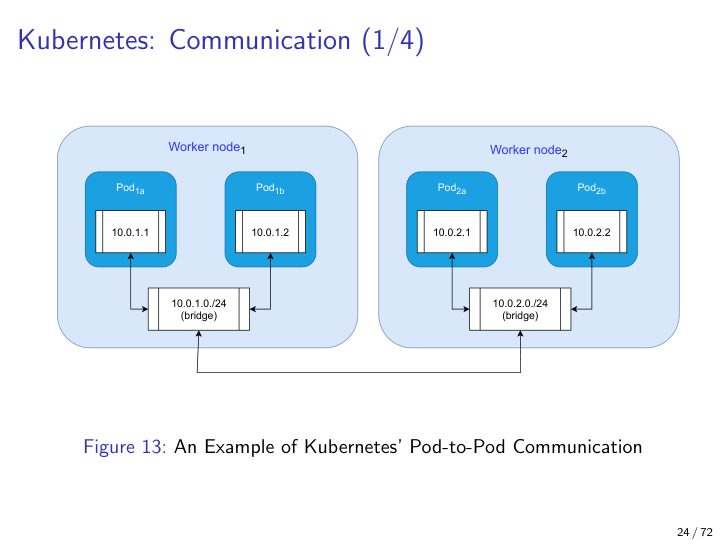

### Gateway pattern
**Definition:** A single component that fronts a set of services, handling cross-service routing, protocol translation, and aggregating high-latency network calls into low-latency local ones.
**Why it matters:** Microsoft's catalog pattern. Solves the problem of clients needing to talk to many incompatible services; also reduces per-call latency by colocating the gateway with services.
**Detailed explanation:** The lecture shows refactoring from a client → 3 services topology (each call high-latency) into client → gateway → 3 services (one high-latency hop to gateway, then low-latency local calls). The gateway can also paper over incompatible APIs.
**Analogy:** A hotel concierge: instead of guests calling housekeeping, room service, and the spa individually, they call the concierge who deals with all three on a local intercom.
**Example:** An API gateway that fans a single client request into 5 microservice calls within the cluster.
**Common pitfall:** Making the gateway itself a single point of failure / bottleneck — it must then be replicated, defeating part of the simplification.
**Related diagram:** 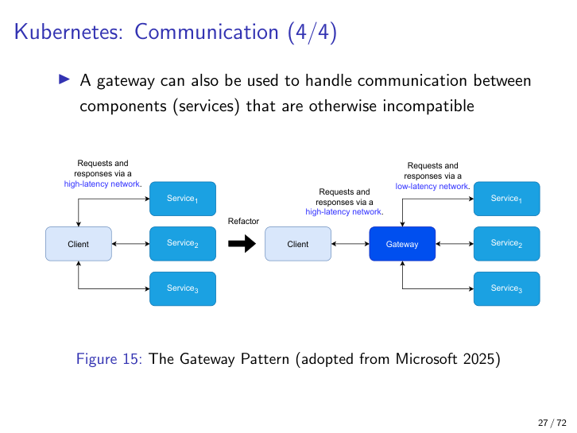

### Sidecar pattern
**Definition:** Cross-cutting concerns (analytics, circuit-breaking, logging, TLS, monitoring) are placed in their own container *next to* each business-logic container in the same pod (or extracted into a dedicated pod that polls).
**Why it matters:** Avoids duplicating cross-cutting code in every business service; aligns with Kubernetes' co-location semantics.
**Detailed explanation:** Lecture shows three variants: (1) no sidecar — analytics + circuit-breaker duplicated in each pod, (2) sidecar — analytics + circuit-breaker as separate containers in the same pod, (3) standalone sidecar — separate Pod4 hosting circuit-breaker + analytics, contacted via heartbeats / polling. Each variant trades complexity for resource usage.
**Analogy:** A coach attached to a train (sidecar = literally a side car on a motorcycle): the coach (business logic) does the main work; the side car (analytics) rides along but doesn't drive.
**Example:** Service-mesh proxy (Envoy) injected as a sidecar to handle mTLS and telemetry transparently.
**Common pitfall:** Google (2024) warns that putting too much into sidecars bloats pod image size — autoscalers must download images when spawning replicas, hurting cold-start scalability.
**Related diagram:** 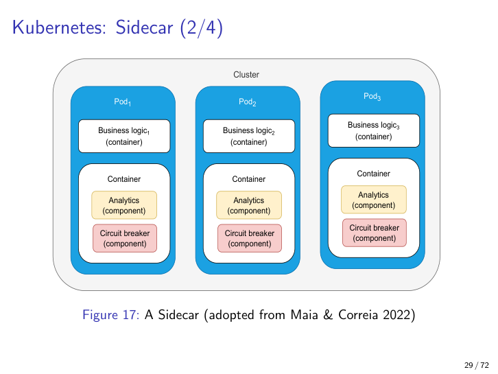

### Horizontal vs vertical scaling (workload vs infrastructure viewpoint)
**Definition:** **Horizontal** = add more pods/nodes (replicas); **Vertical** = give existing pods/nodes more resources (CPU, RAM). Both apply at both *workload* (pod) and *infrastructure* (node) viewpoints, giving four cells.
**Why it matters:** The four-cell matrix is a clean exam-friendly mental model. Autoscalers normally do horizontal pod scaling; vertical scaling usually requires restarts.
**Detailed explanation:** Default Kubernetes autoscaler also scales *down* once load decreases. Both directions hit diminishing returns (cf. Amdahl). Costs in hyperscaler clouds favor setting both **minimums** and **maximums** explicitly to avoid bill surprises.
**Analogy:** Horizontal = hire more cooks; vertical = give each cook a bigger stove. Workload viewpoint = pods (the cooks); infrastructure viewpoint = nodes (the kitchens).
**Example:** A traffic spike triggers the HPA to add 20 new pods (horizontal/workload). If the existing nodes lack capacity, the cluster autoscaler adds new nodes (horizontal/infrastructure).
**Common pitfall:** Reaching for horizontal scaling to fix latency bugs that are really bad code or misconfiguration (Dinesh 2018).
**Related diagram:** 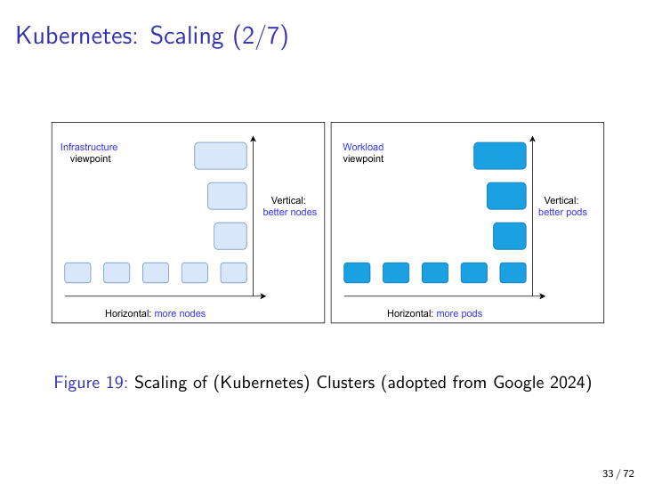

### Autoscaler and the cluster size limits
**Definition:** Dynamic algorithm that uses metrics (typically CPU usage) to add/remove pods or nodes; bounded by user-set min/max.
**Why it matters:** Operationalizes scalability — but is the source of most cost-surprise bills if maximums are unset.
**Detailed explanation:** Kubernetes' documented hard limits: ≤ 110 pods/node, ≤ 5,000 nodes, ≤ 150,000 total pods, ≤ 300,000 total containers. Google (2024) recommends minimizing startup/shutdown times and keeping images small because the autoscaler must download images for each new replica.
**Example:** LUMI supercomputer (Finland, top-10 worldwide) has 362,496 cores but computing is split into smaller clusters within those limits.
**Common pitfall:** Excessive logging in huge clusters becomes itself a cost driver.

### Geofencing and eventual consistency in hyperscale clouds
**Definition:** **Geofencing** = routing clients to geographically near data centers. **Eventual consistency** = a replicated read may return stale data; not every read returns the most recent write.
**Why it matters:** Both are architectural concessions to scale at internet scope; they create observable behaviours (e.g., a user's edit not appearing on a colleague's screen for a few seconds).
**Analogy:** Eventual consistency = postal mail vs. a phone call; geofencing = always shopping at your local branch rather than HQ.
**Example:** Serving Danish clients from Copenhagen, not Morocco; replicating a CDN cache lazily so cache-hits eventually replace cache-misses.
**Common pitfall:** Designing UIs that assume strong consistency (e.g., immediate read-your-writes); they break subtly under eventual consistency.

### Static vs dynamic load-balancing algorithms
**Definition:** **Static** = distribute load without checking server state (e.g., DNS round-robin). **Dynamic** = use current state/health (autoscaler, throttling, scheduling).
**Why it matters:** Static is cheap and provides coarse failover but keeps routing to dead servers until clients time out; dynamic needs monitoring/heartbeats but supports true active-active and active-passive setups (from lecture 5).
**Example:** DNS-based round-robin returns multiple A records and clients try them in order; this provides crude failover even with no health monitoring.
**Common pitfall:** Assuming DNS round-robin gives you HA — it doesn't, because clients (and DNS caches) won't notice a dead server until timeout.

### DNS-based load balancing (A records, MX records)
**Definition:** Servers publish multiple A (IPv4) or AAAA (IPv6) records under a name; resolvers receive them in rotated order. For email, MX records additionally carry priority numbers.
**Why it matters:** Foundational, simple, and still in production at internet scale (Netflix example in slide 42).
**Detailed explanation:** Lecture's email example: client first asks `MX domain.tld?` → resolver replies with one or more mailservers (each having a priority); client picks an MX, queries its A records, gets a list of IPs, opens SMTP to the first. Behind the scenes, the operator may host the IPs on one machine (config A) or two (config B — better for scalability and fault tolerance).
**Analogy:** A restaurant's list of phone numbers on a flyer — call the first, if busy try the next.
**Common pitfall:** Some functions (like email MX) use *semi-static* logic with priorities — pure round-robin is not the only DNS scheme.
**Related diagram:** 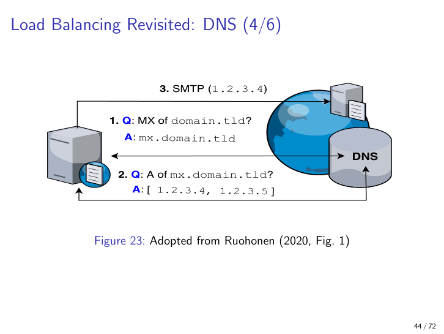

### Content Delivery Network (CDN)
**Definition:** A geographically distributed network of caching proxies that serve content on behalf of an origin host; configured by aliasing DNS records to the CDN operator.
**Why it matters:** Dominant scalability tactic for web; also bundles DDoS protection, WAF, and DNS in commercial offerings (Cloudflare, Akamai).
**Detailed explanation:** Multi-tier architecture (lower-tier edge data centers + higher-tier upstream centers + origin). A request hits the nearest lower-tier center; if it's a cache miss it cascades to higher-tier, then to origin. Subsequent requests hit the cache. May conflict with usability (e.g., Cloudflare CAPTCHA challenges for AI crawlers can lock out legitimate users).
**Analogy:** A bookshop chain: head office (origin) prints the books, regional warehouses (higher-tier) hold pallets, local branches (lower-tier) hold one or two copies; if your branch is out, they pull from the warehouse, and only then from HQ.
**Example:** SDU homepage aliasing through Elsevier and Cloudflare (slide 48 shows actual aliasing chain).
**Common pitfall:** Forgetting that CDNs cache *static* content well but dynamic personalized content needs careful cache-key design or bypass.
**Related diagram:** 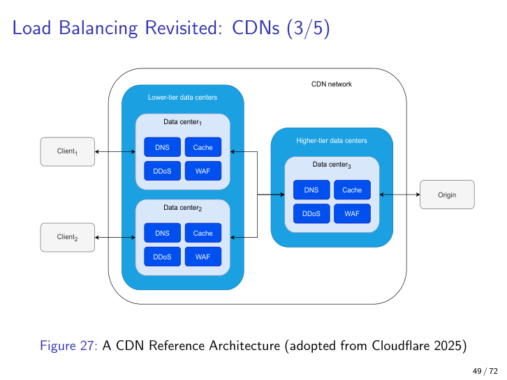

### Software-Defined Networking (SDN)
**Definition:** Networking where switches, routers, firewalls and load-balancers are configured by software (typically via a controller / IaaS like OpenStack) instead of hand-configured hardware.
**Why it matters:** Bridges low-level machine view ↔ middleware ↔ large-scale network view; many cluster and cloud scalability tactics are *defined* in SDN terms.
**Detailed explanation:** OpenStack example shows compute/storage/network nodes plus tunnel and VLAN networks, switches, firewalls, DHCP service. Network segmentation embodies the **isolation/encapsulation** tactics from lecture 3 (modifiability).
**Analogy:** Old telephony with operators rewiring jacks (hardware networking) vs. a modern PBX where extensions are reprogrammed in software.
**Example:** Routing computing-node writes via a tunnel network for security while reads from the Internet go via the VLAN network.
**Common pitfall:** Treating SDN purely as a security or networking concern — it is just as much a *scalability* lever (e.g., L7 load-balancing in OpenStack).
**Related diagram:** 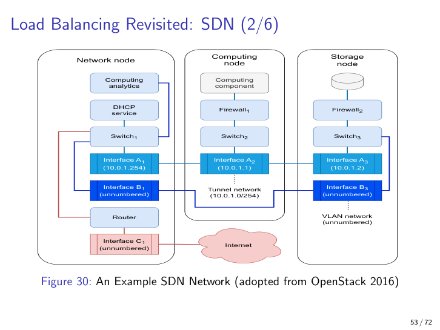

### Layer-7 load balancing (OpenStack)
**Definition:** Load balancing at the HTTP/application layer using policy actions (REJECT, REDIRECT_TO_URL, REDIRECT_TO_POOL) matched on rule types (HEADER, PATH, FILE_TYPE).
**Why it matters:** Allows fine-grained routing decisions a L4 (TCP) balancer can't make — e.g., routing /web-api/* to a different pool than /static/*.png.
**Example:** REJECT any request with header `DNT: 1` (privacy-aware users); REDIRECT_TO_POOL `Pool A` for requests with PATH `/web-api`.
**Common pitfall:** Using L7 policies as a primary security mechanism — they are a routing tool; a WAF is the proper place for security rules.
**Related diagram:** 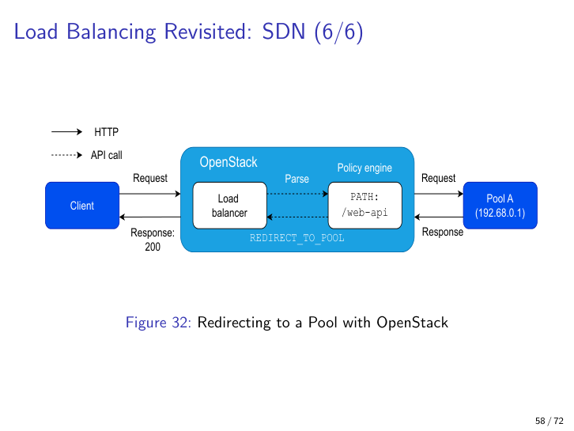

### Latency decomposition (a + b + c)
**Definition:** Overall latency `y = a + b + c` where **a** = networking latency, **b** = computing latency, **c** = I/O latency (read + write). Performance/scalability QAs require understanding each separately.
**Why it matters:** Lumping latency into one number hides which subsystem is the bottleneck. With virtualization (Kubernetes, OpenStack) the proportions shift compared with bare-metal.
**Detailed explanation:** Latency depends also on throughput — extreme throughput with minimal `a` shifts the choke point to `b` and `c`. Each of `a`, `b`, `c` can be decomposed further (slide 60: load balancer → connection pools → databases each adding their own a/b/c).
**Analogy:** Travel time = drive to airport + flight + drive from airport; improving only one leg has bounded effect.
**Common pitfall:** Optimizing computing (b) when the real bottleneck is the cross-region network hop (a).
**Related diagram:** 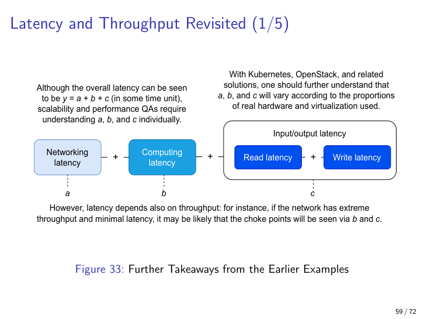

### Bondi's scalability dimensions (space-time, distance, structural)
**Definition:** Bondi (2000) distinguishes:
1. **Load (time) scalability** — graceful as request rate grows.
2. **Space scalability** — graceful as data size grows.
3. **Space-time scalability** — graceful in both.
4. **Distance scalability** — works well over short *and* long distances.
5. **Speed/distance scalability** — works well at high *and* low speeds across distances.
6. **Structural scalability** — implementation/standards do not impede growth in object count within a chosen time frame.
**Why it matters:** Refines a vague single word into operational categories you can test against.
**Example:** A system using Bluetooth has neither distance nor speed/distance scalability.
**Common pitfall:** Treating "scalability" as one knob; Bondi's taxonomy shows several orthogonal axes can each fail independently.

### Performance/scalability diagnosis (Bondi 2000)
**Definition:** A six-point diagnostic checklist:
1. Identify absorbing states (deadlocks, wholesale failures).
2. Identify parts that can run in parallel.
3. Identify self-expanding performance bottlenecks (cascading-failure analog).
4. Identify and eliminate unproductive execution cycles.
5. Minimize temporary execution cycles.
6. Identify whether scalability problems are scheduling problems.
**Why it matters:** Provides a structured procedure when "the system is slow" is the only symptom.
**Common pitfall:** Steps 1–6 mostly require full runtime deployment, which itself is hard for large clusters; NetBSD example: planned automated benchmarks were dropped because they couldn't be made robust under virtualization.

### Statistical debugging and log triaging
**Definition:** Diagnosing performance issues by statistical patterns across many runs/logs rather than single-trace debugging (Song & Lu 2014; Bansal et al. 2020).
**Why it matters:** Performance regressions are common but hard to detect even with sophisticated DevOps, because the symptom is "a bit slower" not "crashed".
**Detailed explanation:** Logs are typically unstructured/semi-structured, high-velocity, voluminous, high-dimensional, and often not retained long enough. Diagnosis is closer to data science than to stepping through a debugger. Retrospective triage asks: impact? users affected? local or global? known bug? happened before?
**Analogy:** Diagnosing flu in a population (epidemiology, statistics) vs. diagnosing one patient (traditional debug).
**Common pitfall:** Trying to repro a perf bug locally — many cluster perf bugs only manifest at scale and require log-based statistical methods.

## Important diagrams (catalog)

- `page018_amdahls_law_chart.png` — Speedup curves for serial fractions a ∈ {0.1..0.9} showing the 1/a ceiling.
- `page021_kubernetes_core_parts.png` — Cluster/Node/Pod/Container hierarchy with kubelet and kube-proxy roles annotated.
- `page023_kubernetes_kubelet_kubeproxy.png` — End-to-end developer/user-to-pod path through master node + kube-proxy with DNS round-robin annotation.
- `page024_kubernetes_pod_to_pod.png` — Two worker nodes each with two pods, each pod on a node-level bridge subnet; illustrates TCP/IP pod-to-pod communication.
- `page027_gateway_pattern.png` — Before/after refactor: client → 3 services over high-latency network vs. client → gateway → services over low-latency network.
- `page029_sidecar_pattern.png` — Same business-logic pods but with analytics + circuit-breaker as sidecar containers instead of duplicated business code.
- `page033_scaling_horizontal_vertical.png` — 2x2 matrix of horizontal/vertical scaling at workload (pod) and infrastructure (node) viewpoints.
- `page040_prometheus_monitoring.png` — Prometheus pulling metrics from nodes, storing data, pushing alerts via alert manager; includes service-discovery step.
- `page044_dns_mx_query.png` — Sequence: client → DNS for MX, then for A records, then SMTP to chosen IP.
- `page049_cdn_reference_architecture.png` — CDN tiered topology: clients ↔ lower-tier edge ↔ higher-tier ↔ origin, each tier with DDoS/DNS/Cache/WAF blocks.
- `page053_sdn_openstack_example.png` — OpenStack SDN with compute/storage/network nodes, switches, firewalls, tunnel + VLAN networks.
- `page058_openstack_redirect_pool.png` — L7 policy flow: client → load balancer → policy engine (PATH match `/web-api`) → REDIRECT_TO_POOL Pool A.
- `page059_latency_decomposition.png` — Visual breakdown of total latency into networking (a) + computing (b) + I/O (c).

## Exam-relevant takeaways

- **Definition test:** Scalability = performance scales *proportionally* with resources. Be ready to articulate this and contrast it with performance.
- **Amdahl's law formula:** `y = 1 / (a + (1−a)/p)`. Maximum speedup is `1/a`. Know what `a`, `p` mean.
- **Horizontal vs vertical** scaling at workload and infrastructure viewpoints — be ready to draw or place an example in the 2×2.
- **Kubernetes terminology:** cluster, node, pod, container, kubelet (health/state), kube-proxy (TCP/IP routing), autoscaler with min/max bounds, hard limits (110 pods/node, 5,000 nodes, 150,000 pods, 300,000 containers).
- **Gateway pattern** — used when many services need to be reached from a client; turns N high-latency hops into 1 high-latency + N local low-latency hops.
- **Sidecar pattern** — co-locates cross-cutting concerns (analytics, circuit breaker, telemetry) with business logic; trade-off with image size for autoscaler cold starts.
- **Static vs dynamic load balancing** — DNS round-robin is static, provides crude failover; active-active/active-passive (lecture 5) requires monitoring (dynamic).
- **CDN architecture** — multi-tier (edge → higher-tier → origin), DNS-aliased; bundles DDoS + WAF + DNS commercially.
- **SDN** — software-defined networking ties cluster-level segmentation to the isolation/encapsulation modifiability tactics from lecture 3.
- **Latency decomposition** — total latency `y = a + b + c` (network, compute, I/O); each decomposable further; throughput shifts the choke point.
- **Bondi's scalability dimensions** — load, space, space-time, distance, speed/distance, structural; Bluetooth fails on distance and speed/distance.
- **Diagnosis discipline** — Bondi's 6 steps; logs are unstructured/voluminous; statistical debugging > traditional debugging for perf regressions; triage by impact/scope/known-bug.
- **Mock-up question style:** Expect figures with `?` marks where you must identify the pattern (gateway, sidecar, pub/sub, MQTT broker, layered, logging) and explain its rationale in *brief, prioritized* sentences. Over-answering = zero points.

## Cross-references

- **Lecture 1 (foundations)** — Lecture 7 explicitly reverses an L1 idea: "an architecture may be designed scalable but an implementation hinders reaching that potential" (Bondi's *structural scalability*).
- **Lecture 2 (quality attributes)** — Scalability is positioned alongside the QAs from L2; the lecture references the L2 point that *scaling the business* often matters more than scaling the system.
- **Lecture 3 (integrability + modifiability)** — SDN's network segmentation is explicitly framed as the **isolation/encapsulation** modifiability tactics from L3.
- **Lecture 4 (testability + deployability)** — Lecture 7 notes that diagnosing perf/scalability is hard precisely because (continuous) deployability of large clusters is hard; the NetBSD anecdote is a deployability/testability cautionary tale.
- **Lecture 5** — Direct reference: "active-active and active-passive (standby) load-balancing scenarios from the fifth lecture require heartbeats, polling, or other monitoring." L5 likely covered availability + load-balancing patterns; lecture 7 contrasts dynamic (L5) vs static (DNS round-robin) algorithms.
- **Lecture 6 (performance, presumed)** — Lecture 7 explicitly extends performance into scalability: "Analogously to the previous lecture on performance, at a high-level of abstraction, we can think about time scalability and space scalability." Latency decomposition, throttling, scheduling, and statistical debugging are all built on L6 foundations. Mock-up Q8 ("difference between performance and scalability?") is the direct bridge between L6 and L7.
- **Case study #7** — Designing a Prometheus alert system for Kubernetes node/pod failure: bring in the Prometheus monitoring diagram (page 40), explicit Kubernetes terminology, and at least one other QA (e.g., complexity / availability).
