# Chapter 1 — Foundations: What Architecture Is, the Ten-Term Vocabulary, Views, SOLID at Component Scope, and Layering

## Opening

This chapter is the floor on which every other chapter stands. By the time you finish it you should be able to do nine things on demand: (1) recite the Bass-Clements-Kazman definition of software architecture verbatim, (2) place any design decision into the design / architecture / implementation pyramid and justify why it belongs there, (3) use the ten-term vocabulary (module, interface, component, process, machine, system, deployment, environment, element, connector) without slipping, (4) sketch a Kruchten 4+1 layout for a sample system, (5) apply the Liskov-style component substitution rule and spot a violation in a diagram, (6) recognise cohesion / segregation / SRP / OCP / no-vendor-lock-in violations on a picture, (7) explain layered architecture using both the operating-system and manufacturing-automation examples, (8) distinguish system architecture from enterprise architecture, and (9) reproduce — and *defend* — the lecturer's claim that the top three qualities of a software architect are communication-related.

The whole chapter uses one running example: a small **flight-and-hotel reservation system**. The system reappears throughout the book (most heavily in Chapter 7's saga discussion), so spend a moment getting comfortable with it: a client wants to reserve flights *and* hotel rooms; a server provides both services; later, we will split flights and hotels into their own components, replicate them, deploy them in a cloud, and stress-test them against quality attributes. For now it is just two boxes and an arrow. That is enough.

Two thirds of the exam vocabulary is set here. Chapter 2 develops the *quality-attribute* side of these tensions (ASRs, scenarios, ISO/IEC 25010, risk, SBOM). Chapters 3–12 each pick one quality attribute and instantiate the patterns and tactics that satisfy it. Chapter 9 returns to layering at industrial scale (Kubernetes); Chapter 15 reads the Linux network stack as layering in textbook form. Pay particular attention to two stretches: the SOLID-at-component-scope section (often misread as ordinary OO SOLID) and the architect-role section at the end (explicitly flagged by the lecturer as exam-counted).

---

### 1. Software architecture (the working definition)

**Definition.** A software architecture is the set of structures needed to reason about a computing system; these structures comprise software *elements*, *relations* among them, and *properties* of both (Bass, Clements, Kazman 2012, cited via Fairbanks 2010). Three pieces in that one sentence — **elements, relations, properties** — are the atoms of the whole course.

**Why it matters.** Every later concept on this course — quality attributes, views, tactics, patterns, deployments — bottoms out in "elements + relations + properties." If you cannot point to those three in any diagram you draw, you have not drawn an architecture.

Notice three subtleties. First, architecture is *plural*: there is no single picture of a system, but many structures — component, module, deployment, behavioural — each chosen to answer a different question. Second, it exists for *reasoning*, not for documentation alone: if a diagram does not let you predict or argue about system behaviour, it is not architectural. Third, "properties" are first-class: latency, availability, modifiability, and security arise *from* the elements and their relations and are part of the architecture itself, not an afterthought.

**Analogy.** A city is not its skyline photo. To reason about traffic, you use a road map; to reason about power outages, an electrical-grid map; to reason about flood risk, a topographic map. Each map is a *structure* — a deliberate choice of elements (intersections, substations, contour lines), relations (roads, lines, gradients), and properties (capacity, voltage, elevation). The architecture is the bundle, not any one map.

**Example.** For the flight-and-hotel reservation system the lecture draws several structures at once: a UML component diagram, an informal "pseudo" diagram, and a cloud deployment sketch. None alone is "the" architecture; together they let stakeholders reason about it.

**Pitfall.** Students conflate the architecture with a single boxes-and-arrows diagram. Structures live in the head and the repository; *views* are diagrams of them.

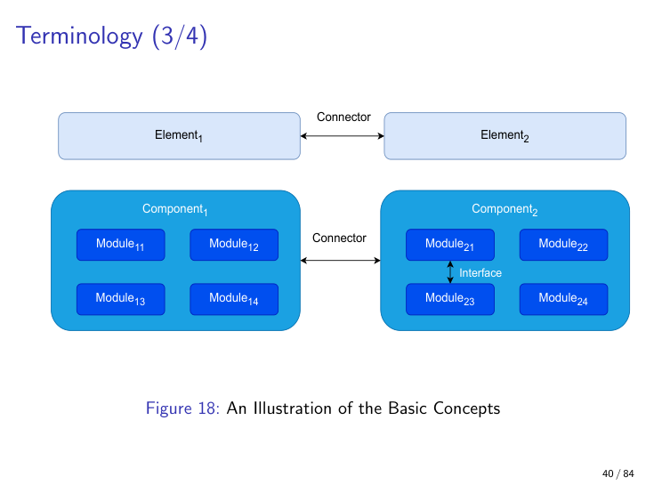
*The ten-term vocabulary illustrated — the figure you will return to all course.*

---

### 2. Six truisms about software architecture (Bass et al.)

**Definition.** Six baseline facts: (1) architecture is an *abstraction*; (2) it is *engineering, not art*; (3) it is *software design*, but not all software design is architecture; (4) every system *has* an architecture (even an accidental one); (5) not all architectures are *good*; (6) architectures usually carry *both* requirements and constraints, plus domain expertise.

**Why it matters.** These six block several common student moves: "I just picked a stack, that's the architecture" (false — see #2 and #5), "small projects have no architecture" (false — see #4), "architecture is personal style" (false — see #2).

The loaded one is "engineering, not art." Ruohonen contrasts Sydney Opera House (admired, but famously over-budget and behind schedule) with brutalist concrete buildings (ugly, but functional and budget-respecting): *fit-for-purpose under constraints* matters more than visual elegance. Truism #3 marks the boundary against detailed design — architectural decisions are macroscopic. Truism #4 is the sneaky one: a hacked prototype still has an architecture; the only question is whether it was *chosen* or *accreted*.

**Analogy.** A bridge built without an engineer still has a structural design — gravity reveals it when the bridge collapses. Same with software.

**Example.** The "Not Like This" slides juxtapose the Opera House, a brutalist block, and a chaotic pseudo-scientific diagram to argue the point visually.

**Pitfall.** Don't read truism #2 as "boring is good." It means "answer the right engineering questions under real constraints." Aesthetic clarity in a diagram is itself an engineering virtue (it aids communication and onboarding).

---

### 3. Design vs. architecture vs. implementation (the three-layer pyramid)

**Definition.** Three layers of decision-making: **design** is the umbrella; **architecture** is the macroscopic subset of design that fixes the system's structure and quality attributes; **implementation** is the line-by-line realisation. Between every pair lie *tensions* driven by requirements, constraints, domain knowledge, and quality attributes.

**Why it matters.** The exam will ask trade-off questions ("how do you settle tensions among competing qualities in this design?"). This three-layer mental model is where every decision gets placed.

Fairbanks (2010) sharpens it: architecture covers macroscopic parts and their connections; detailed design covers everything else. Architecture *constrains* implementation in good ways (clear seams, predictable performance) and bad ways (rigidity, hard-to-change choices). The decisions you make architecturally are, by definition, the ones you cannot easily reverse later — that is what makes them architectural.

**Analogy.** Building a house: architecture is the floor plan and where the load-bearing walls go; detailed design is the kitchen-cabinet layout; implementation is the actual carpentry. Repaint a wall (implementation) cheaply. Re-tile a kitchen (detailed design) with effort. Move a load-bearing wall (architecture) and you pay for the project again.

**Example.** "Healthcare emergency system must be available 24/7/365" is a requirement that pushes architecture toward redundancy. "Team has no healthcare experience" is a constraint pushing toward simpler patterns. "Budget fixed by public procurement" caps hardware. These three tensions are settled architecturally, *before* anyone writes code.

**Pitfall.** Architecture is not "UML produced upfront." It is the set of hard-to-change *decisions*; diagrams document them.

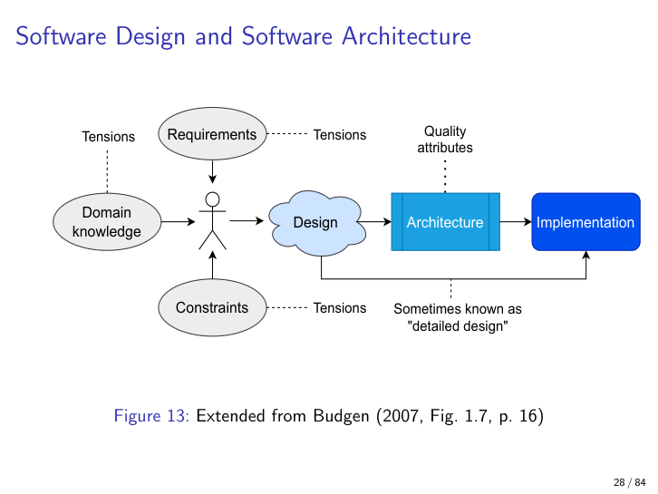
*The central mental model: design ⊃ architecture ⊃ implementation, with tensions from requirements, constraints, domain, and quality attributes.*

---

### 4. Quality attributes (set up here, fully developed in Chapter 2)

**Definition.** Non-functional properties of a system — availability, performance, modifiability, security, scalability, usability, and so on — that the architecture is designed to fulfil. They derive from non-functional requirements, constraints, and domain knowledge.

**Why it matters.** Architectures are evaluated by *prioritised* quality attributes, not by whether they "do the feature." "The system reserves a flight" matters less to the architect than "the system is available 99.99% of the time."

Quality attributes almost always conflict — more security usually costs performance; more modifiability usually costs upfront simplicity. The architect's job is to *prioritise* and pick tactics and patterns that emphasise the top-ranked attributes without dropping the others below acceptable thresholds. A good architecture also enables *incremental implementation*: you build piece by piece instead of integrating everything at once.

**Analogy.** Ordering a car. "Drives, brakes, signals" is the feature list — it tells you nothing about Ferrari vs Volvo vs Hilux. The interesting decisions are non-functional: top speed (performance), crash safety (reliability), repairability (modifiability), fuel cost (efficiency). You can't maximise all of them; you rank.

**Example.** "Availability of utmost importance" changes the reservation architecture from a single VM to redundant deployments across regions, even though the feature list never mentions availability.

**Pitfall.** Students list quality attributes flatly. Without ranking, an architecture cannot be evaluated — every architecture is good at *something* and bad at something else.

---

### 5. Constraints (the two flavours)

**Definition.** Constraints are limits the architect did not get to choose. They come in two places: constraints that flow **into** the architecture (budget, regulations, hardware, team skills) and constraints the architecture **imposes on** the implementation (chosen stack, allowed connectors, deployment model).

**Why it matters.** The architect's freedom is bounded on both sides. Recognising which constraints come from above (given) and which you are *creating* (your decision becomes someone else's given) is the discipline of architecture.

"We must use Java because the rest of the company uses Java" is incoming. "Modules in this system must talk only via REST" is outgoing — *you* imposed it. Constraints can **inhibit** (rule things out) or **exhibit** (enforce certain qualities).

**Analogy.** A composer writing a symphony is constrained by the available instruments (incoming). Once they write "string quartet only" in bar 32, every subsequent musician has a new constraint they did not choose (outgoing).

**Example.** Healthcare emergency system: public procurement caps the budget (incoming); the architect then forbids vendor-specific cloud services to avoid lock-in (outgoing constraint on implementers).

**Pitfall.** Don't mistake constraints for requirements. A requirement says "the system shall…"; a constraint says "the system cannot…" or "the system must use…". Both shape the design but enter the problem differently.

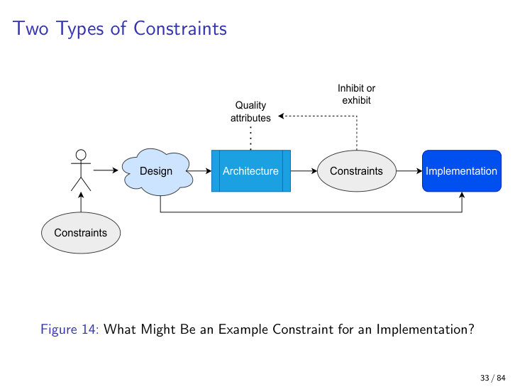
*Constraints flow in from outside the architecture and are imposed by the architecture on implementation — inhibit or exhibit.*

---

### 6. The Twin Peaks model (Cleland-Huang et al. 2013)

**Definition.** Requirements and architecture are depicted as *two peaks* that are explored together: as requirements get more detailed and implementation-dependent, the architecture also gets more detailed; the two **co-evolve** rather than one preceding the other.

**Why it matters.** It refutes the waterfall myth that requirements come first and architecture follows. In practice you discover architectural constraints while elaborating requirements, and vice versa.

Three variants: (a) the *basic* twin peaks — two triangles, requirements on the left, architecture on the right, both growing from general/independent to detailed/dependent; (b) the *design alternatives* version — multiple candidate architectures considered against requirements; (c) the *mountain range* version — many partial peaks of requirements and many partial peaks of architecture, exchanged back and forth as the system matures. The mountain range is the realistic one.

**Analogy.** Two people building Lego with no instructions — one knows the finished shape (requirements), the other knows how blocks snap (architecture). Neither finishes their picture without conversation; every refinement on one side prompts a refinement on the other.

**Example.** Reservation system. Customer: "users must log in." Architect: "OAuth." Customer: "actually our users have no email accounts." Now the requirement refines ("identity without email") and the architecture refines (phone-OTP). Both peaks grow taller together.

**Pitfall.** Students draw the twin peaks once and treat it as static. Keep the right-hand peaks *few* — two or three alternatives at each round is enough; the point is iteration, not breadth.

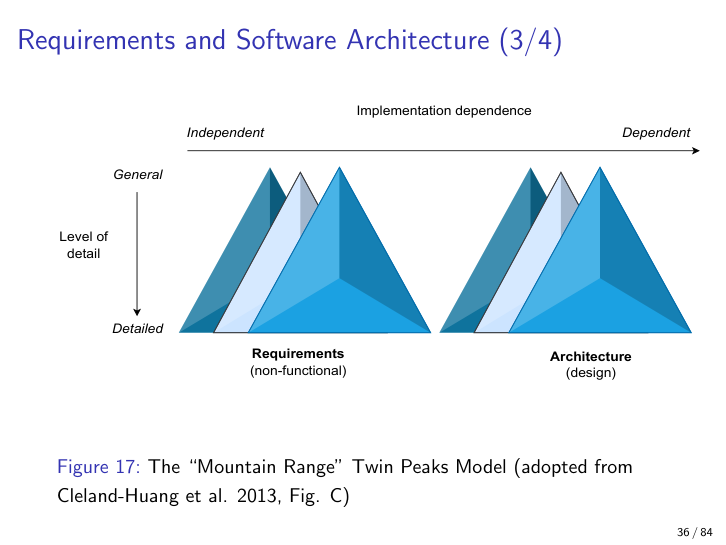
*The realistic mountain-range form: many small alternating refinements between requirements and architecture.*

---

### 7. The ten-term vocabulary

**Definition.** A precise set of ten terms the course will use, blended from Bass et al. and Lano & Tehrani:

1. **Module** — a large unit of source code (think Java packages).
2. **Interface** — connects two or more modules.
3. **Component** — a large collection of source-code modules and other elements (servers, databases, etc.).
4. **Process** — a Unix-style OS process.
5. **Machine** — a physical or virtual machine running an OS.
6. **System** — one or more machines with components.
7. **Deployment** — a system actually running in production.
8. **Environment** — the surroundings of a deployment.
9. **Element** — generic catch-all (module / component / process / machine / system / deployment).
10. **Connector** — catch-all for everything (including interfaces) through which elements talk.

**Why it matters.** Every later lecture and every exam answer uses these words with these meanings. Mixing them up loses points directly.

Two facts to internalise. First, the *containment hierarchy*: code → modules → components → processes → machines → systems → deployments → environments. Second, the *no-1:1 rule*: many components can run in parallel built from the same modules; a single component may host multiple processes (a container counts as one). The course mainly concerns large distributed systems with potentially millions of machines, but the smallest legal system is a single component with two processes on a laptop.

**Analogy.** A restaurant chain. *Modules* are recipes. *Components* are kitchens that combine recipes into menus. *Processes* are individual cooks. *Machines* are buildings. *System* is the company at one moment. *Deployment* is the company actually operating in cities today. *Environment* is the economy and customer base around them. Two restaurants of the same chain share recipes (modules) but run as separate components.

**Example.** In the reservation system: "Reserve flights" and "Reserve hotel rooms" are modules; "Server" and "Client" are components; the arrows between provided and required interfaces are connectors.

**Pitfall.** Don't expect 1:1 between modules and components. The same module can live in many components running in parallel. Most architectural reasoning happens at the **component level**; modules are reserved for code-level discussions.

---

### 8. Component structures

**Definition.** A component structure describes the major executing components and how they interact. Component structures are the *key units* of architecture for this course.

**Why it matters.** Component diagrams are what you draw most often. Exam prompts about "major components, who replicates, where parallelism lives, how data flows" all live here.

A good component is **cohesive** (one clear responsibility), **encapsulated** (internals hidden behind interfaces), **reusable**, **substitutable**, **independently deployable**, and **composable** into larger systems. A component structure helps you answer: what are the major executing units, which parts can be replicated, how does data flow, where can parallel/concurrent execution happen?

**Analogy.** Lego bricks. Each brick (component) snaps onto others via studs (provided interfaces) and accepts studs in its holes (required interfaces). You don't open a brick to use it — you just snap it. You can swap a 2x4 for two 2x2s as long as the connection points match.

**Example.** In the reservation system, "Server" provides flight services and hotel rooms; "Client" requires them. Each is reusable, substitutable, and deployable on its own.

**Pitfall.** Don't confuse component with class or module. A component is much bigger — code + data + runtime — built from many modules.

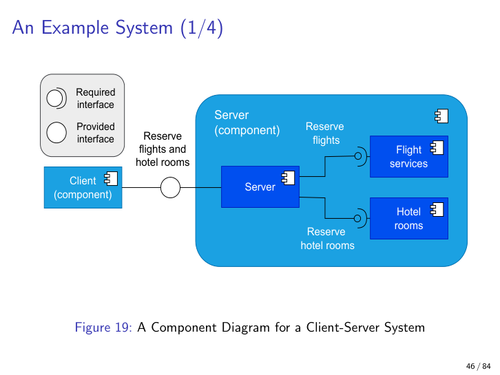
*The running example as a UML-style component diagram with provided and required interfaces.*

---

### 9. Views and viewpoints

**Definition.** A **view** is a representation of one or more structures, chosen to highlight what some stakeholder needs to see. A **viewpoint** is the perspective / convention from which a view is built. Different views are different *representations* of the same architecture.

**Why it matters.** No single diagram captures a system. Different stakeholders (developers, ops, customers, security) need different views. Producing the right view for the right audience is a core architect skill — and one the exam will probe.

Fairbanks (2010) lists nine view *operations* you can apply when moving between views: **projection** (subset of details), **partition** (subdivide), **composition** (combine), **classification** (type→instance), **generalisation** (supertype→subtype), **designation** (correspondence), **refinement** (low→high detail), **binding** (conform to pattern), and **dependency** (one model changing forces another). Use them as a vocabulary for how diagrams relate.

The lecturer also stresses that *documentation isn't only internal*: views matter when *buying and selling* software, when onboarding, and when defending architectural choices to non-engineers.

**Analogy.** A house drawing. The floor plan (logical) shows rooms; the electrical schematic (process) shows wiring; the plot map (physical) shows the lot. The architect draws all three — each is a view of the same house. The carpenter cares about one set, the electrician about another, the city inspector about a third.

**Example.** The reservation system in four views: full UML component diagram, a refinement, a "pseudo" simplified version, and a cloud-internet sketch. They are *designations* of one another — same system, different views.

**Pitfall.** Students show one diagram and call it "the architecture." The right move: declare *which view*, *which viewpoint*, and *who it's for*.

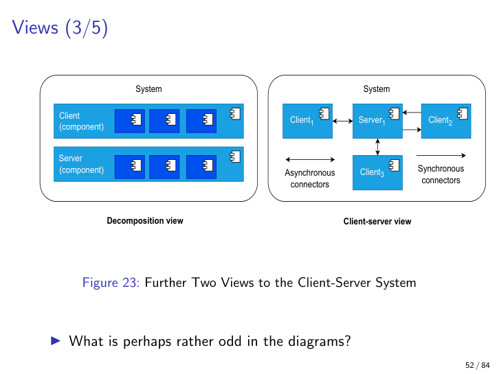
*Two different views of the same reservation architecture, with synchronous and asynchronous connectors.*

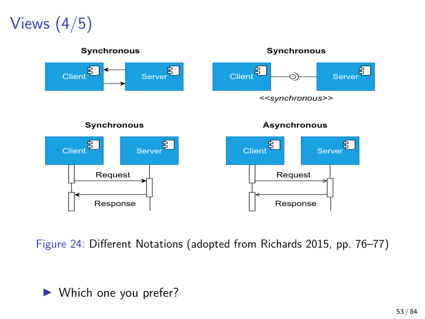
*Any style works as long as you're consistent — pick one and stick to it.*

---

### 10. Kruchten's 4+1 viewpoints

**Definition.** Kruchten's classic viewpoint set: **Logical** (end-users, functionality), **Development** (developers, product owners), **Process** (integrators, performance, scalability), **Physical** (system engineers, topology), plus **Scenarios** in the centre that tie all four together by walking through concrete use cases.

**Why it matters.** 4+1 is the canonical multi-view answer to "which views should I draw?" — and it is a frequent exam-recognition question (given a diagram, name the viewpoint).

The "+1" is doing real work: Scenarios are not a fifth viewpoint but the *glue*. A scenario like "user reserves a flight and a hotel together" can be traced through the Logical view (which functional pieces it touches), the Process view (which processes communicate, in what order), the Physical view (which machines and links it crosses), and the Development view (which packages and teams own the code). If your four diagrams cannot tell a story consistently, the architecture is broken.

**Analogy.** Four blueprints and a film. Floor plan, wiring schematic, plumbing diagram, lot map — and then a short film of a family moving in and using the house. The film exposes the contradictions the static drawings hide.

**Example.** For the reservation system: Logical = "Reserve flight / Reserve hotel" functions; Development = the Java packages and the team that owns each; Process = the running server and client processes; Physical = the cloud region and the user's browser; Scenarios = "book a Berlin-Helsinki return with two hotel nights."

**Pitfall.** Drawing four diagrams without ever tracing a scenario through them. The "+1" is the part that catches inconsistencies.

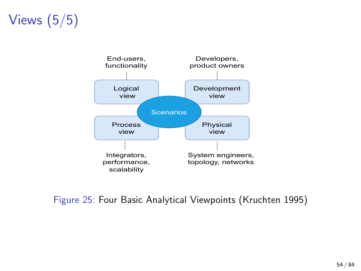
*Logical, Development, Process, Physical — with Scenarios tying them together at the centre.*

---

### 11. The substitution principle (Liskov, lifted to components)

**Definition.** Component B can substitute for component A if **(1)** B preserves all of A's *provided* interfaces (B provides the same or more, with unchanged signatures and behaviour), and **(2)** B *requires* the same or fewer interfaces than A did.

> **Course note.** This — and the next four sections — are **Lano & Tehrani's lift of OO SOLID to the component scope**. The exam often probes whether you can recognise the *component-level* version, not just the familiar class-level one. Read each principle as "OO concept, but now the unit is a deployable component."

**Why it matters.** Substitutability is the architectural guarantee behind upgrades, A/B testing, vendor swaps, and gradual migrations. If you cannot substitute, you cannot evolve safely.

The intuition: the surrounding system relied on A's contract; the replacement must honour that contract entirely. B can be *richer* on provided (extra optional interfaces) and *leaner* on required (fewer dependencies), but never the reverse. If B asks for something A never asked for, the host system isn't equipped to give it.

**Analogy.** Replacing an appliance. A new toaster that uses the same plug and voltage (provided preserved) and asks nothing extra (no required added) drops in. A toaster that also needs gas — *added required interface* — cannot drop into an electric-only kitchen.

**Example.** The lecture walks three swaps for the reservation Server. **A** (flight + hotel) → **B** (same interfaces, different internals): valid. → **C** (only hotel rooms, drops the flight interface): invalid (clients still expect flights). → **D** (matches A's provided interfaces but adds extra required ones): invalid (host can't satisfy the new requirements).

**Pitfall.** Students get the direction wrong: "more is better." For *provided*, more is fine. For *required*, more is fatal.

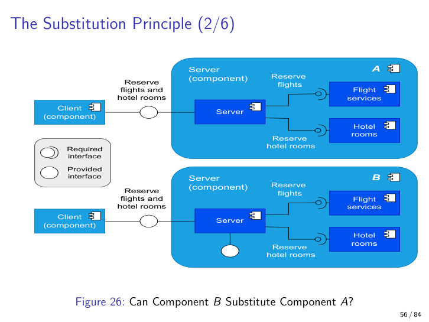
*Substitution Q1: B has the same interfaces as A — yes, a valid replacement.*

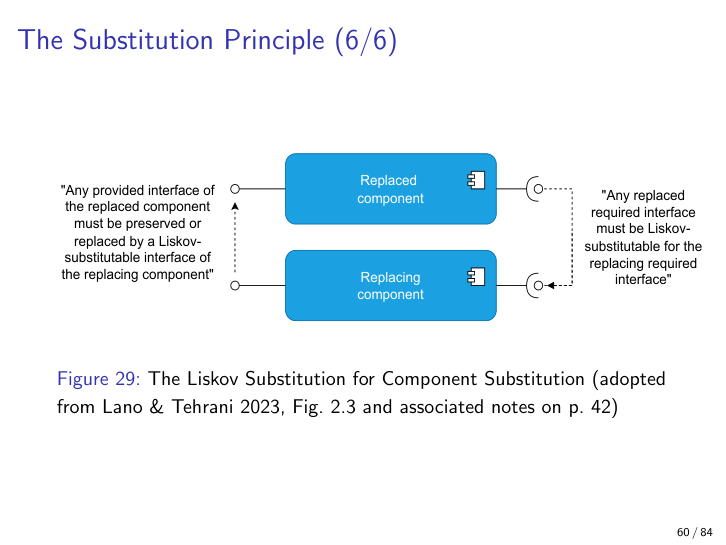
*Provided interfaces: preserved or extended. Required interfaces: preserved or shrunk. Never the reverse.*

---

### 12. Cohesion (and the no-vendor-lock-in corollary)

**Definition.** A **cohesive** component does one related thing well; a non-cohesive component bundles unrelated responsibilities. The lecturer adds a corollary from Bass et al.: an architecture should **never depend on a particular vendor** and its tool versions. If a vendor dependency is unavoidable, the architecture should make swapping vendors cheap — the **no-vendor-lock-in** principle.

**Why it matters.** Cohesion is the first sanity check on whether you've drawn the right component boundaries. Low cohesion almost always signals an architecture problem. Vendor lock-in compounds it: a non-cohesive component glued to a single vendor becomes immortal.

The running example: the "Server" component also contains a "Marketing" module that talks to Google Ads. Two failures at once — low cohesion (marketing has no business in the reservation server) and vendor lock-in (Google specifically baked in).

**Analogy.** A kitchen drawer. A cohesive drawer holds all your forks. A non-cohesive drawer holds forks, screwdrivers, batteries, and last year's tax receipts — the source of "where did I put…" panic for years.

**Example.** Reservation Server with flight services, hotel rooms, *and* a marketing module talking to Google. Split the marketing into its own component, and abstract the ad-network connector so Google can be swapped for another provider.

**Pitfall.** Cohesion is not "fewer responsibilities is always better." A *single* responsibility is the goal (see SRP), but within a single responsibility, multiple modules cooperating is fine — the test is whether they all serve the *same* clearly defined purpose.

---

### 13. Segregation (interface segregation, component scope)

**Definition.** Components and their modules should not depend on components, connectors, or interfaces they do not actually use. Equivalently: prefer many small fine-grained interfaces over one fat one.

**Why it matters.** Unnecessary dependencies waste dev effort, slow deployments, and create legal / security / licensing risk surfaces. Microservices (a topic of a later chapter) are largely a story of segregation taken to its extreme.

Two perspectives. (a) For *in-house* architectures, autonomous components are usually preferable — they may duplicate functionality (some bloat), but autonomy beats coupling. (b) For *suppliers* of components (libraries, services), fine-grained interfaces beat one fat one forced on all users. A client that wants only hotel-room search should not have to depend on the whole flight-services interface.

**Analogy.** A buffet vs. a fixed menu. A buffet (fine-grained interfaces) lets each diner take exactly what they want. A fixed menu (one fat interface) forces everyone to "accept" dishes they will never touch — and the kitchen still has to prepare them.

**Example.** Extending the marketing case: the server now has both a "Run ads" *required* interface (to Google) and a "Do marketing" *provided* interface exposing the marketing module to clients. If no client actually uses "Do marketing," it's a segregation violation — a connector with no purpose.

**Pitfall.** Don't confuse segregation with cohesion. Cohesion is about *what's inside* (one purpose); segregation is about *what's exposed or required* (no unused dependencies).

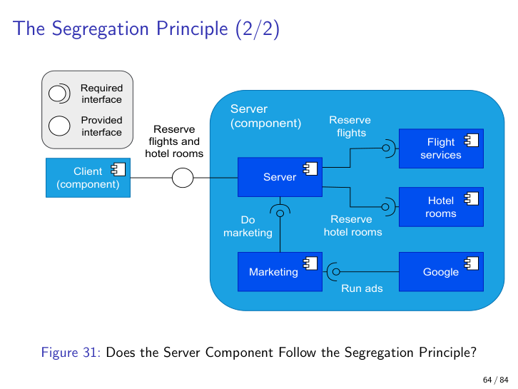
*Extra "Do marketing" provided interface and "Run ads" required interface to Google — both violations.*

---

### 14. Single Responsibility and Open-Closed (at the component level)

**Definition.** **Single Responsibility (SRP).** Each component should have only one reason to change — one well-defined responsibility. **Open-Closed (OCP).** Components should be changed by *adding* new functionality, not by *modifying* existing functionality.

**Why it matters.** Together they keep components stable and growable. SRP minimises "shotgun surgery" (a single feature change touching many components); OCP minimises regression risk on existing behaviour. These are again Lano & Tehrani's lift of OO SRP and OCP to the *component* scope.

SRP says: if your component changes for two unrelated reasons (e.g., flight-service updates *and* marketing-campaign tweaks), it's two components glued together; split them. OCP says: if a new feature forces you to rewrite existing code paths, you've built a closed system; instead provide extension points (interfaces, plugins, configuration) that let new behaviour plug in without rewriting old behaviour.

**Analogy.** SRP: a Swiss Army knife is convenient but bad architecture — sharpening the scissors risks bending the screwdriver. OCP: a power strip is "open" — plug in any device without rewiring the wall; the wall socket itself is "closed" — once installed, you don't rewire it for each new device.

**Example.** Even the reservation example is mildly SRP-deficient: ideally *flight* and *hotel* services would *provide* interfaces that a separate "business component" *requires*, so flight changes don't touch hotel logic. The lecture flags this as an exercise.

**Pitfall.** "One reason to change" is more useful than "does one thing." Two responsibilities that change together for the same business reason can coexist; two that change for different reasons must be split, even if they look similar.

---

### 15. Module structures and the data-vs-compute separation

**Definition.** A **module structure** partitions a system into modules — implementation units, including source code. Modules range from layers and packages down to classes, files, functions, variables. Relations are "is-a" (inheritance) and "has-a" (composition).

**Why it matters.** Module structures answer the *code-level* questions: how are modules isolated? How do they depend on each other? Who uses whom? They are the structure you give to a new developer on day one.

Two sub-ideas. First, the *user module structure*: a useful abstraction asking which modules use functionality from which other modules — perfect for analysing the impact of a change. Second, Bass et al.'s wisdom: components/modules that **produce or store data** should be **separate** from those that **consume data**. Mixing them couples change cadences: data changes on one cadence, algorithms on another; the architecture should let each side evolve independently.

**Analogy.** A library and its readers. The library (data) and the reading rooms (compute) are separate. Adding a new reader (algorithm) doesn't require re-shelving books. Adding new books (data) doesn't evict readers. Merge them — books stacked on every desk — and every change to one wrecks the other.

**Example.** A minimal ensemble-learning sketch: a Data component on one side; an Algorithm component (containing Algorithm₁…Algorithmₙ plus a Voting module) on the other; an interface between them. Each side evolves independently.

**Pitfall.** The producer/consumer separation is *also* a separation of *change frequency*. Mix them and you couple cadences; later, every data refresh forces an algorithm redeploy.

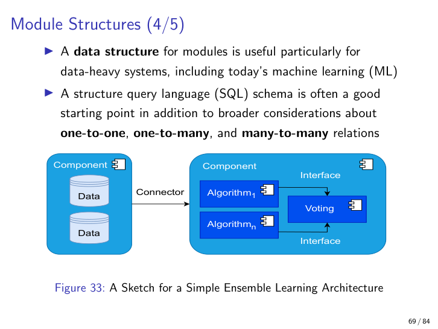
*Data component on one side, Algorithm component (with internal Voting) on the other — independent evolution.*

---

### 16. Layered structures

**Definition.** A **layered structure** organises modules into layers that allow only controlled, neighbour-only interaction. In a *strictly* layered system, each layer talks only to the layer immediately above or below — no jumping. Each layer is typically a single component.

**Why it matters.** Layering is the classical architectural choice for separating concerns by abstraction level. It enables independent reasoning per layer, swap-ability of any layer's implementation, and clean isolation of change. It is the structure Chapter 9 (Kubernetes) and Chapter 15 (Linux network stack) will return to.

Two canonical examples. **Operating systems**: hardware → device drivers → kernel (file systems, processes, I/O buffering) → system calls → userland libraries → userland programs. Each layer interacts (synchronously or asynchronously) only with its immediate neighbour. **Manufacturing automation** (Nagl & Westfechtel): Sensors (L0) → PLCs (L1) → SCADA (L2) → MES (L3) → ERP (L4) — each layer a different abstraction (physical signal → control → supervision → execution → business). The benefits are the same in both: each layer has clear responsibilities; you can upgrade drivers without recompiling the kernel; abstraction levels are explicit and pedagogically clear.

**Analogy.** A military chain of command. A private (L0) talks to their sergeant (L1), not directly to the general (L4). The sergeant talks to the lieutenant, the lieutenant to the captain. Each rank knows its neighbours. Skip-level communication breaks the system: orders get mangled, accountability is lost.

**Example.** OS layering (Bass et al. Fig. 1.7) and manufacturing-automation layering (Nagl & Westfechtel Fig. 4.4) — see below.

**Pitfall.** Real systems sometimes allow "skip-layer" jumps for performance (relaxed layering); the strict form is what the lecture is talking about. Also, each layer can run on different hardware with many parallel instances at the lower layers (many sensors, many PLCs) and fewer at higher ones (one ERP). Layering is *conceptual*, not necessarily 1-to-1 with hardware.

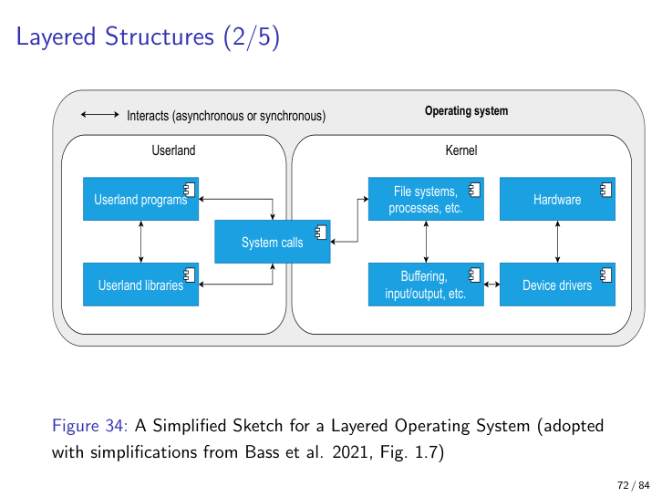
*Hardware → drivers → kernel → syscalls → libraries → programs.*

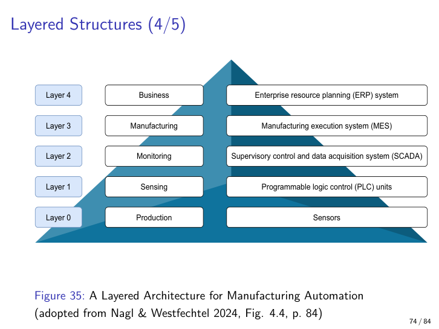
*Sensors → PLC → SCADA → MES → ERP — physical signal up to business.*

---

### 17. System architecture vs. enterprise architecture

**Definition.** A **system architecture** is the totality of hardware, software, and humans involved in a single system. An **enterprise architecture** describes an organisation's processes, information flows, personnel, organisational units (departments, teams), and how they support business goals.

**Why it matters.** The two scopes have different quality attributes and different stakeholders. A system architect optimises a deployable artifact; an enterprise architect optimises how an organisation runs. The course mostly does the former but flags the existence of the latter — and the exam may ask you to tell them apart.

The manufacturing-automation example straddles both: it's a system architecture (PLCs, sensors, ERP servers, networks), but its layers also map to organisational divisions (sensing teams, control teams, supervision teams, manufacturing planning, business). An enterprise architecture's central quality attribute is *alignment*: how well does the architecture support the organisation's goals?

**Analogy.** System architecture is the design of one ship. Enterprise architecture is the design of the shipping company (routes, ports, crew rosters, maintenance schedules, financial systems). The two interact, but they answer different questions.

**Example.** A hospital's emergency-response system is a system architecture. The hospital's broader IT landscape (patient records, billing, supply chain, staff scheduling, regulatory reporting) is the enterprise architecture.

**Pitfall.** Don't try to do both at once on the exam. If the question says "design a system," draw a system architecture. If it says "how does this fit the organisation," widen to enterprise concerns.

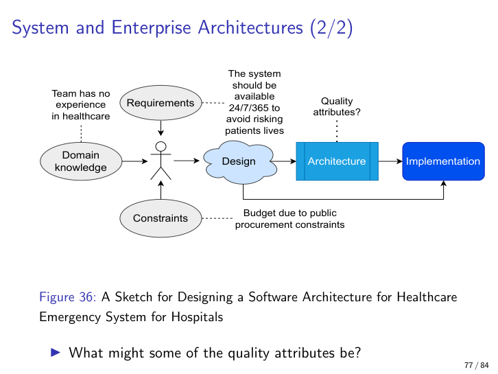
*Availability requirement, public-procurement budget constraint, team's lack of healthcare experience — QA-tension thinking previews Chapter 2.*

---

## The Architect's Role: Why the Top Three Job Qualities Are Communication-Related (Exam-Counted)

The lecturer flags this section explicitly as exam-counted. Treat the next four paragraphs as compulsory revision material.

**Definition.** A software architect is a (usually senior) software engineer responsible for making and communicating the macroscopic structural decisions of a system. The job is structurally *collaborative* — not a lone code-genius role.

**The Ayas et al. (2024) ranking.** Based on microservices job-ad analysis, the most-sought architect qualities are, in order: (1) **articulation and transferability of knowledge**, (2) **stakeholder management**, (3) **communication / presentation / negotiation**, (4) problem solving and leadership, (5) coaching and mentoring, (6) personal development. The lecturer bold-faces the first three as exam-relevant. **Memorise the ranking — being able to recite the top three in order, and explain *why* they are communication-related, is a likely short-answer question.**

**Why communication wins.** The architect's outputs are decisions that other people must execute. A perfectly correct decision that no one understands is worthless. Documentation with multiple views isn't just for engineers — it lets new team members onboard, lets the business reason about cost and schedule, and lets the company sell or buy software with credible technical claims. Fairbanks suggests yardsticks like "30% of working time on actual design" — the rest goes to communication, documentation, and review. The Twin Peaks mountain-range model (Section 6) only works because the architect keeps talking to the requirements side; the SOLID-at-component-scope principles (Sections 11–14) only land in code because the architect *explained* them to implementers; the multi-view documentation (Section 9) only helps stakeholders if the architect knows which view to draw for whom.

**The trap to avoid.** The architect who refuses to talk to stakeholders is the one who builds beautiful but unusable systems — the "ivory tower" failure Bass et al. warn against. Pure technical brilliance is necessary but insufficient. The paradox the lecturer ends with: the hardest-to-change architectural decisions are also the ones that *enable* you to reason about and manage change as the system evolves — and reasoning is, fundamentally, a communicative act.

**On the exam.** Expect a short-answer prompt of the form "Why does the literature rank communication-related skills above pure technical ones for software architects?" Answer with: (a) the Ayas et al. top-three (articulation / stakeholder management / communication-presentation-negotiation), (b) Fairbanks's ~30% design-time yardstick, (c) the multi-stakeholder nature of architectural decisions (many views, many audiences), and (d) the irreversibility of architectural decisions, which makes *getting buy-in early* cheaper than fixing them later.

---

## Chapter Takeaways

1. **Software architecture = elements + relations + properties**, organised into multiple structures, used for *reasoning* about a system. Memorise verbatim.
2. **Architecture is engineering under constraints, not art.** Every decision is justified by quality attributes, requirements, and constraints — not by elegance alone.
3. **Quality attributes must be prioritised.** A flat list of "ilities" cannot evaluate an architecture; rank first, then judge.
4. **Constraints come in two flavours:** incoming (given) and outgoing (imposed by the architecture on the implementation). Be ready to identify both.
5. **Twin Peaks model:** requirements and architecture co-evolve via a *mountain range* of small alternating refinements — never pure waterfall.
6. **Ten-term vocabulary** — module, interface, component, process, machine, system, deployment, environment, element, connector. Know each precisely.
7. **Component structures answer the macro questions:** which units run, which can replicate, where parallelism lives, how data flows.
8. **A view is a representation of structures, chosen for a stakeholder.** Multiple views per system are the norm; **Kruchten's 4+1** (Logical, Development, Process, Physical, +Scenarios) is the canonical set.
9. **Substitution rule (Liskov for components):** replacement must *preserve* provided interfaces and *not add* required interfaces. More provided is fine; more required is fatal. — and the next four principles (cohesion, segregation, SRP, OCP) are **Lano & Tehrani's lift of OO SOLID to the component scope**.
10. **Layered structures = strict neighbour-only interaction.** OS and manufacturing automation are the two canonical examples; system architecture differs from enterprise architecture in scope; **the architect's top three job qualities are communication-related** (articulation, stakeholder management, communication/negotiation) — explicitly exam-counted.
