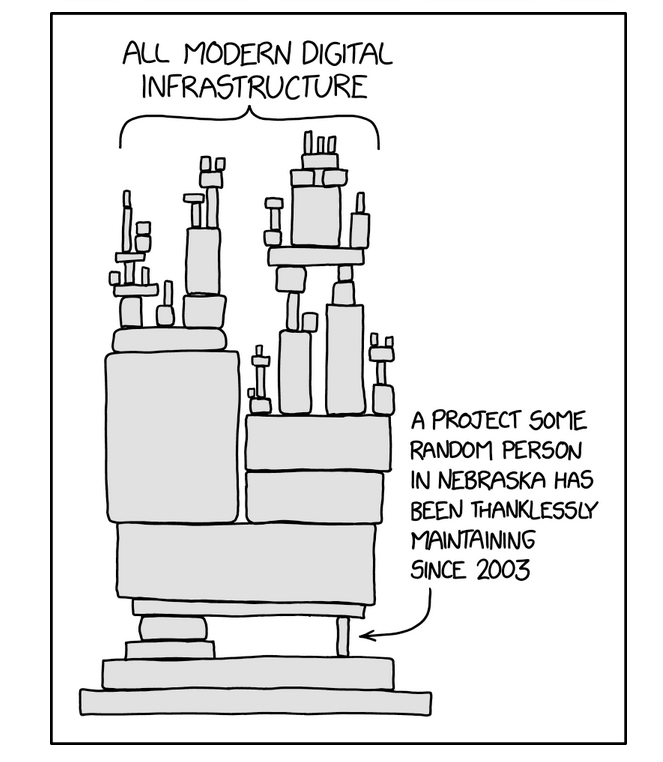

# Chapter 2 — The Quality-Attribute Framework: ASRs, Scenarios, ISO/IEC 25010, Risk, SBOM, Domain Modeling

> *"A measurable or testable property of a system that indicates how well the system satisfies stakeholder needs beyond its basic functions."*
> — Bass, Clements & Kazman (2021), the definition this entire book hangs on.

---

## 2.0 Why this chapter is the machinery

Chapter 1 gave us the vocabulary: a system has elements, relations, and properties; an architecture is the macroscopic subset of design that fixes those structures; quality attributes (QAs) live in tension with one another and must be prioritized rather than maximized.

This chapter is where that vocabulary turns into a working toolkit. Almost every chapter from here on — integrability, modifiability, testability, deployability, availability, performance, scalability, safety, security, usability, power — will open the same way: it will pick a QA, populate a *six-slot scenario template* with QA-specific values, point to its slot on the *ISO/IEC 25010 taxonomy*, and then go hunting for tactics and patterns. The tactics and patterns are the body of the book. **The framework in this chapter is the skeleton.**

If you internalize three things from Chapter 2, the rest of the course is downhill:

1. **The 6-slot QA scenario template.** It is the single most reused artefact in the book.
2. **The ISO/IEC 25010 taxonomy.** Eight categories, each with at least one sub-attribute you can name on demand.
3. **Risk = Probability × Impact**, plus the defence-in-depth response to cascading risks.

Everything else in this chapter — ASR sniffing, BDUF vs. Iteration 0, reference architectures, RFC 1958, domain modelling, deployment metamodels, SBOMs under the EU CRA — supports those three pillars. Take them seriously and the rest of the book is recall-friendly. Skim them and Chapters 3–12 will feel like a fog.

A note on diagrams. Lecture 2 contains many useful figures (the QA scenario template, the ISO/IEC 25010 tree, risk cascades, defence-in-depth stacks, the domain-modelling chain, the deployment metamodel, the CycloneDX schema) but they were all drawn directly into the PDF as vector primitives — they are not embedded raster images we can paste here. The chapter therefore renders those figures as clean markdown tables and ASCII diagrams. Only one raster image was extracted from the lecture: XKCD 2347, which sits at the SBOM section.

---

## 2.1 Quality Attribute (QA)

**Definition.** A QA is a *measurable or testable property* of a system that indicates how well the system satisfies stakeholder needs *beyond* its basic functions (Bass et al. 2021). Memorize that phrasing — it shows up on exam papers verbatim.

**Why it matters.** A system can implement every functional requirement perfectly and still be a disaster: slow, insecure, unmaintainable, unscalable. QAs are how the architect decides *which* trade-offs to make. They are also how the architect is judged after the fact — performance regressions, security incidents, downtime, and unmaintainable codebases are all QA failures, not functional ones.

**Detailed explanation.** A QA is always anchored to a stakeholder need but is distinct from the "basic function" of the system. The definition demands *measurability* or *testability*, so a QA must eventually reduce to numbers or pass/fail tests. Some QAs reduce easily — performance becomes milliseconds, availability becomes a number of nines. Others (security, usability) resist direct measurement and must be decomposed:

```
QAᵢ → { SubQAᵢ₁ , SubQAᵢ₂ , … , SubQAᵢₙ }
              ↓
        concrete metric per leaf
```

Many QAs require understanding *runtime* behaviour rather than just source code. You cannot read a code listing and confidently conclude "this system has high availability" — you must watch it survive faults, monitor recovery times, and measure mean-time-between-failures.

**Analogy.** A car's functional requirement is "drives from A to B." Its QAs are *how* it does so: acceleration (performance), fuel economy (efficiency), crash safety, brake response, ease with which a mechanic can swap a part (maintainability). Two cars both "drive from A to B," yet one is a Ferrari and the other a moped — the QAs are the entire difference.

**Example.**

| Bad QA | Better QA |
|---|---|
| "The system should be secure." | "The system shall comply with PCI DSS." |
| "The system shall scale." | "The web application shall scale up to ten million users within a year of operation." |
| "It should be fast." | "p99 dashboard render < 200 ms under 5 000 concurrent users." |

**Common pitfall.** Confusing a QA with a feature. *"Adds a dashboard button"* is a function. *"The dashboard renders in under 200 ms at the 99th percentile under 5k concurrent users"* is a QA. The test of a good QA is whether you can write a falsifiable check for it.

---

## 2.2 Functional vs. Non-Functional Requirements

**Definition.** *Functional* requirements specify *what* the system does (concrete behaviours that deliver utility or business value). *Non-functional* requirements specify *how well* it does them, and they map onto QAs.

**Why it matters.** Almost every real-world requirements document is dominated by functional requirements — CRUD forms, screens, business rules. The QAs have to be *inferred* from the document. If you do not actively look for them, your architecture will silently optimize for nothing in particular, which is a polite name for the Big Ball of Mud (§2.7).

**Detailed explanation.** The line between functional and non-functional is famously fuzzy. A "function" — *drive an engine* — cannot be designed without immediately invoking QAs (performance, fuel efficiency, emissions). Bass et al. (2021) recommend the pragmatic move of *decomposing non-functional requirements into functional ones* wherever possible:

```
Security  ─►  Access controls  ─►  "A key unlocks the doors"
                              └─►  "A key starts the car"
```

The car-ownership example from the lecture shows the chain: the abstract QA "Security" becomes the sub-attribute "Access controls," which becomes two concrete functional requirements you can build and test.

**Analogy.** *"I want a delicious dinner"* is non-functional. *"Serves four, ready in 30 minutes, peanut-free, under 600 calories"* is the decomposition into functions you can cook against.

**Example.** *"Pressing a button shows daily analytics"* looks purely functional, but it simultaneously implies *performance* (how fast?), *availability* (how often is it allowed to fail?), and *modifiability* (can you add new algorithms later?). One feature, three overlapping QAs.

**Common pitfall.** Treating non-functional requirements as second-class citizens. They are often the things that get you fired when they fail.

---

## 2.3 Architecturally Significant Requirements (ASRs)

**Definition.** ASRs are the subset of requirements — usually QA-related — that meaningfully constrain or shape the architecture (Bass et al. 2021).

**Why it matters.** A "perfect" architecture would fulfil every QA, but that is impossible (QAs are in tension). ASRs are the ones you cannot ignore without breaking the architecture. They are what the architect must spend time on.

**Detailed explanation: how to "sniff" ASRs.** Most requirement documents are full of functional details that do not affect the architecture (button colours, validation messages, error text). To find the ones that do, you read for *signals* — anything that hints at structural impact:

| Signal | Why it is an ASR signal |
|---|---|
| Named technologies or vendors | Constrains stack choice ("must integrate with SAP") |
| Integration points to external systems | Forces explicit boundary design |
| Deployment hints ("on-premise", "cloud") | Pins down the runtime topology |
| Data volumes and rates | Drives performance and scalability tactics |
| Networking constraints (TCP/IP, 5G, Bluetooth, custom protocols) | Constrains protocol stacks and latency budgets |
| Expected user counts; internationalization | Drives scalability, localization, and concurrency design |
| Compliance regimes (GDPR, PCI DSS, HIPAA, EU CRA) | Inherits a large set of QAs as legal obligations |

**Analogy.** When buying a house, you read the listing but you also walk the neighbourhood at 2 a.m., check flood maps, and look up the school district. The listing is the requirements doc; the rest is sniffing for ASRs.

**Example (from the lecture's interview snippet).** *"We operate in two European countries… BYOD principle… SAP integration… on-premise servers… 200 employees but only ~3 users."* The ASRs hidden in those sentences:

- SAP integration → interoperability
- GDPR (two European countries) → security/compliance
- BYOD → security + portability
- ~3 users → no need to over-architect for scalability (small-scale is itself an ASR)
- On-premise → deployment constraint

**Common pitfall.** Confusing "architecturally significant" with "important to the user." A user may desperately want a dark-mode toggle; that is important but architecturally trivial. ASRs are about what shapes the *structure* of the system, not what shapes the user's mood.

---

## 2.4 The QA Scenario Template — the most important table in the book

**Definition.** A QA scenario is a structured, testable specification of a quality attribute, written as a six-slot template:

| # | Slot | Question it answers | Typical values |
|---|---|---|---|
| 1 | **Source** | *Who or what* triggers the stimulus? | End user, attacker, peer system, sensor, internal subsystem, clock |
| 2 | **Stimulus (Event)** | *What event* do they trigger? | Request, fault, attack, configuration change, signal, deadline |
| 3 | **Environment** | *Under what operating conditions?* | Normal operation, peak load, degraded mode, after a partial outage, during a deployment |
| 4 | **Artifact (Deployment)** | *Which part of the system* is hit, and in what deployment? | Whole system, web tier, message bus, database, mobile client, on-prem cluster, edge node |
| 5 | **Response** | *What must the system do?* | Detect, prevent, recover, log, alert, retry, fail safely, degrade gracefully |
| 6 | **Response Measure** | *How well, in numbers?* | Time-to-detect, time-to-recover, throughput retained, % requests served, MTBF, p99 latency, success ratio |

**Why it matters.** This table is the spine of every QA chapter that follows. Each QA-specific chapter (Chapters 3 through 12) will introduce a "menu" of typical values for each of these six slots — performance has one menu, security has another, modifiability a third — and then teach tactics that turn those scenarios into design choices.

**Detailed explanation.** The template forces a vague QA ("the system should be reliable") into a form that is concrete, testable, and easy to share with stakeholders. It also aligns naturally with agile artefacts: user stories, use cases, and *misuse cases* (the security equivalent of a user story) all map onto the six slots with a little reformatting.

**Worked example: a denial-of-service scenario.**

| Slot | Value |
|---|---|
| **Source** | External user (anonymous, untrusted) |
| **Stimulus** | Network packet flood (volumetric DoS) |
| **Environment** | Peak business hours, normal staffing |
| **Artifact** | Current production deployment, public web tier |
| **Response** | Detect the flood and rate-limit the offending source(s); keep legitimate traffic flowing |
| **Response Measure** | Detection within 30 seconds; throughput for legitimate users retained at ≥ 80 % of nominal |

**Analogy.** A QA scenario is the system's equivalent of a fire drill: *given* the building is on fire (event), *with* this many people inside (environment), *the alarm must sound within 10 seconds and everyone must be out within 4 minutes* (response + measure). Without numbers, you do not have a fire drill — you have a fire fantasy.

**Common pitfall.** Students write scenarios that omit the *response measure*. Without numbers, the scenario is just a story. A scenario without slot 6 is never accepted on the exam, no matter how well-written the other five slots are.

---

## 2.5 ISO/IEC 25010 — the shared QA vocabulary

**Definition.** ISO/IEC 25010 is an international standard that organizes software quality into eight top-level categories, each refined into sub-attributes. It is the shared map architects use to argue about QAs without talking past each other.

**Why it matters.** When two teams argue about "availability," they can point at ISO/IEC 25010 to agree on what they mean. It also acts as a *checklist* — a way to make sure you have not forgotten an entire category of QA before signing off on a design.

**The eight top-level categories with at least one sub-attribute each.** Memorize *all eight names* and *at least one sub-attribute per category*. This is a recall layup on the exam.

| # | Top-level QA | Representative sub-attributes |
|---|---|---|
| 1 | **Functional suitability** | Functional completeness, functional correctness, functional appropriateness |
| 2 | **Performance (efficiency)** | Time behaviour (latency), resource utilization, capacity |
| 3 | **Compatibility** | Co-existence, interoperability |
| 4 | **Usability** | Learnability, operability, accessibility, user error protection |
| 5 | **Reliability** | Maturity, **availability**, fault tolerance, recoverability |
| 6 | **Security** | Confidentiality, integrity, non-repudiation, accountability, authenticity |
| 7 | **Maintainability** | Modularity, reusability, analyzability, modifiability, testability |
| 8 | **Portability** | Adaptability, installability, replaceability |

Visually, the taxonomy is a two-level tree:

```
ISO/IEC 25010 Software Quality
│
├── 1  Functional suitability ── completeness · correctness · appropriateness
├── 2  Performance efficiency ── time behaviour · resource use · capacity
├── 3  Compatibility ────────── co-existence · interoperability
├── 4  Usability ────────────── learnability · operability · accessibility · …
├── 5  Reliability ──────────── maturity · availability · fault tolerance · recoverability
├── 6  Security ─────────────── confidentiality · integrity · non-repudiation · accountability · authenticity
├── 7  Maintainability ──────── modularity · reusability · analyzability · modifiability · testability
└── 8  Portability ──────────── adaptability · installability · replaceability
```

**Analogy.** Like the food pyramid for nutrition — nobody eats by literally consulting it during dinner, but it is the backstop that ensures you do not forget vitamins exist.

**Example.** A security review that only checks "is the password hashed?" misses non-repudiation (audit logs), accountability (who did what), and authenticity (is the user actually who they claim?). ISO/IEC 25010 forces all five security sub-attributes into the conversation, not just the one the reviewer happened to think of first.

**Common pitfall.** Treating the taxonomy as exhaustive. It is a useful *map*, not the territory; specific domains will add their own QAs — *energy efficiency* for IoT and embedded systems, *explainability* for ML systems, *deployability* (which we will spend a whole chapter on, even though 25010 does not list it as a top-level).

---

## 2.6 Falsifiable QA

**Definition.** A *falsifiable* QA is one expressed such that it can be conclusively tested as either true or false (Fairbanks 2010).

**Why it matters.** Falsifiability is the strongest form of measurability — not just "we can measure it" but "we can definitively pass or fail it." Quality gates (§2.10) and ATAM-style evaluations (Chapter 14) become theatre unless the underlying QAs are falsifiable.

**Detailed explanation.** Performance QAs are easily falsifiable: *"throughput ≥ 100 transactions/second at peak."* Security QAs are usually only *partially* falsifiable: *"passes the OWASP Top 10 scan"* — yes or no, but the absence of known attacks does not prove security. Usability QAs are hardest of all. Even so, a falsifiable usability QA (*"a new student completes onboarding in under one hour"*) is dramatically more useful than the woolly directive "make it user-friendly."

**Analogy.** *"Make a tall building"* is unfalsifiable. *"Building shall exceed 200 metres"* is falsifiable with a tape measure.

**Common pitfall.** Insisting on falsifiability for QAs where it is genuinely impossible. Sometimes "measurable" is the best you can get; do not let perfect be the enemy of good.

---

## 2.7 Big Ball of Mud — the anti-QA failure mode

**Definition.** A *Big Ball of Mud* (Fairbanks 2010) is a system that lacks clear connectors between elements, promotes no single QA, and contains no considered trade-offs.

**Why it matters.** It is the architectural failure mode that motivates the entire discipline. Even when all functional requirements are met, the system becomes a maintenance nightmare and is often rewritten — not because it does the wrong thing, but because no one understands *how* it does anything.

**Detailed explanation.** Related concepts:

- **Technical debt** — decisions today that will cost interest tomorrow.
- **Legacy code** — frequently a euphemism for Big Ball of Mud.

Systems are usually redesigned not because the functionality is broken but because of accumulated *quality erosion*. The architecture has lost its prioritized QAs and become unsteerable.

**Analogy.** A house added to one room at a time over 40 years by different owners with no plan: load-bearing walls cut, plumbing rerouted through closets, electrical panels in three different rooms. It "works" but no one dares touch anything.

**Common pitfall.** Believing that "agile = no architecture" produces clean systems. It produces mud unless someone is consciously preserving structural integrity — which is precisely the role Iteration 0 (§2.8) carves out.

---

## 2.8 BDUF vs. Iteration 0 vs. Emergent

**Definition.** Three contrasting models for how much architectural effort to invest *before* iterative implementation begins.

| Approach | Up-front design effort | Typical outcome |
|---|---|---|
| **BDUF** (Big Design Up Front) | Almost everything frozen before coding | Inflexible; decisions freeze before market signal arrives |
| **Iteration 0** | A skeleton design / "big picture" only | Foundation + load-bearing walls fixed; details emerge |
| **Emergent** | Near-zero up-front design; let architecture grow | Mud unless the team is small and the system is trivial |

**Why it matters.** The BDUF/Emergent dichotomy is a false choice. Yang et al.'s (2016) systematic review found that *Iteration 0* — a skeleton design followed by iterative refinement — best aligns architecture with agile delivery.

**Detailed explanation.** Pure BDUF inhibits agility because architectural decisions freeze before any market signal arrives. Pure Emergent collapses for non-trivial systems because architectural choices are the *hardest* to change later — once you have shipped a monolith to 50 000 users, refactoring to microservices is a years-long project. Iteration 0 is the pragmatic compromise: enough design to choose a deployment topology, integration boundaries, and ASR-driven structures; then build features iteratively on top.

**Analogy.** Building a house:

- **BDUF** = fully blueprinted before any concrete is poured.
- **Emergent** = start nailing planks, see what we get.
- **Iteration 0** = pour the foundation and frame the load-bearing walls; everything else can shift as you live in the house.

**Example.** The manufacturing-automation example the lecturer keeps revisiting: nobody would seriously try to evolve a real-time industrial control system from "we'll figure it out." But once the safety-critical skeleton is fixed, dashboards and analytics can be agile add-ons.

**Common pitfall.** Treating Iteration 0 as BDUF in disguise. It is *skeletal*, not *complete* — the right amount is "the minimum that lets the team make local choices without breaking the system."

---

## 2.9 Risk = Probability × Impact

**Definition.** Risk is quantified as the product of how *likely* an undesirable event is and how *much damage* it would do; sometimes extended to *Probability × Severity × Impact*.

**Why it matters.** Risk-based reasoning is how architects (especially in security and safety domains) prioritize. You cannot defend everything equally; you defend in proportion to *expected loss*.

**Detailed explanation.** A risk lurks behind every QA, but the formulation is most explicit in cybersecurity and safety. The architect identifies hot spots (high probability × high impact) and designs them first, using known *tactics and patterns* (Chapter 13) rather than ad-hoc inventions. The formula also defangs the rhetorical trap of *"but the impact would be catastrophic!"* — if the probability is negligible, the expected loss is too, and the risk can often be parked.

**Analogy.** Insurance pricing. Earthquake insurance in Tokyo is expensive (high probability × high impact). Earthquake insurance in Helsinki is cheap (negligible probability).

**Example (from the lecture).** *"Our on-premise data centre on a mountaintop gets flooded."* Probability: negligible. Severity: high. Impact: high. Conclusion: *bypass the scenario*. The numbers prevent you from wasting design effort on theatrical-but-implausible threats.

**Positive risk.** The lecture explicitly notes that risks can be *positive* — *"our two-year startup project becomes a unicorn."* A positive-risk-aware architecture might deliberately *under-scale* early in order to ship fast, accepting that a full rewrite is the *plan* if success arrives. The Heroku-to-Kubernetes evolution of many successful start-ups is exactly this.

**Common pitfall.** Treating risk as purely negative, and refusing to weigh probability honestly. The formula does not respect drama; it respects arithmetic.

---

## 2.10 Cascading Risks and Defense in Depth

**Definition.** A *cascading risk* is one whose realization raises the probability (or impact) of subsequent risks. *Cascading impacts* are the downstream damages those subsequent realizations cause. *Defense in depth* is the principle of layering *independent* countermeasures so that no single failure cascades all the way through.

**Why it matters.** Real-world failures rarely have a single cause. A power failure crashes servers → traffic routes to backups → backups overload → throttling kicks in → customers think the site is down → they hammer reload → throttling tightens → … Modelling these chains lets you place safeguards at multiple layers.

**The cascade, drawn out.**

```
Risk₁ realized
   │  raises P(Risk₂ | Risk₁)
   ▼
Risk₂ realized
   │  raises P(Risk₃ | Risk₂)
   ▼
Risk₃ realized
   │  …
   ▼
ESCALATION  ← cascade has compounded rather than fizzled
```

When the conditional probabilities *compound* rather than fizzle, the system has tipped from a cascade into an **escalation**. The architect's job is to break the chain.

**Defense-in-depth answer: independent layered reducers.** Each layer below lowers the probability of one link in the chain so the chain breaks. The classic web-app stack against SQL injection looks like this, top of stack first:

```
┌──────────────────────────────────────────────┐
│  Layer 1 :  Web Application Firewall (WAF)   │  ← blocks known attack patterns at the edge
├──────────────────────────────────────────────┤
│  Layer 2 :  Rate limiting                    │  ← caps burst probability of a brute attempt
├──────────────────────────────────────────────┤
│  Layer 3 :  Input validation                 │  ← rejects malformed payloads at app boundary
├──────────────────────────────────────────────┤
│  Layer 4 :  Parameterized SQL (prepared stmt)│  ← removes the injection vector itself
├──────────────────────────────────────────────┤
│  Layer 5 :  Least-privilege DB user          │  ← caps blast radius if injection succeeds
├──────────────────────────────────────────────┤
│  Layer 6 :  Encryption at rest               │  ← protects data even if exfiltrated
└──────────────────────────────────────────────┘
```

An SQL-injection attempt must beat **all six** to succeed. The cascade is interrupted at every layer. This stack returns repeatedly in Chapters 10 and 11.

**Analogy.** A castle. The moat reduces the probability attackers reach the wall; the wall reduces the probability they reach the keep; the keep's locked doors reduce the probability they reach the throne room. Any single layer can fail without the kingdom falling.

**Common pitfall: correlated layers.** Defenders sometimes layer *correlated* mechanisms — for example, three different firewalls all configured by the same admin with the same blind spot, or three subsystems all dependent on the same single shared library. They look like depth but fail together. The "independent" in *independent layered reducers* is doing real work in the definition.

---

## 2.11 Quality Gates — signals, not stop-the-line

**Definition.** Quality gates are checkpoints throughout development at which a defined subset of ASRs/QAs must be passing.

**Why it matters.** They give project owners visibility *without* halting agile flow. Unlike waterfall gates, they signal rather than block (except in catastrophic situations).

**Detailed explanation.** A typical quality-gate table maps QAs to gates. Sprints 1–3 might be checked against throughput and availability; sprints 4–6 add latency; sprints 7-end add confidentiality and integrity. Gates are most useful for large projects where the temptation to defer QA verification to "the end" is greatest.

| Gate | QAs enforced at this gate |
|---|---|
| QG1 (early sprints) | Performance/throughput; Reliability/availability |
| QG2 (mid sprints) | + Performance/latency; + Maintainability/modifiability |
| QG3 (late sprints) | + Security/confidentiality; + Security/integrity |

**Analogy.** Routine doctor checkups during a long illness. You don't stop the treatment if a number is slightly off; you adjust. But persistent failure at multiple gates means something is structurally wrong.

**Common pitfall.** Quality gates with non-falsifiable QAs ("Security: pass/fail?") are theatre. The QAs *must* be measurable — and ideally falsifiable — for gates to be meaningful.

---

## 2.12 Reference Architecture

**Definition.** A "guardrail" or "blueprint" architecture for a domain, technology, or standard, used as a reference when designing actual architectures.

**Why it matters.** It encodes domain expertise into reusable form, promotes best practices, facilitates interoperability between vendors, and conveys intent in standards and regulations.

**Detailed explanation: bidirectional derivation.** Reference architectures are derived in two directions:

```
   Domain / Standard / Technology ASRs
                │  top-down
                ▼
        ┌───────────────────┐
        │ Reference         │
        │ Architecture      │ ◄───── change triggers (evolution)
        └───────────────────┘
                ▲
                │  bottom-up
   Existing architectures + Patterns + Styles + Tactics
```

The reference architecture is *consumed* by stakeholders and organisations to seed new concrete architectures, and *fed* by both real systems (bottom-up) and standards/domain knowledge (top-down). Cloud providers (AWS, Azure, GCP) publish reference architectures for "cloud-native ML platform," "secure VPC web app," and so on — these double as engineering artefacts *and* as marketing material for the platform.

**Analogy.** IKEA assembly instructions for a class of furniture. The instructions are not the chair; they are the reference, allowing many factories to build many chairs that interoperate (same Allen key, same screw threads).

**Example.** CPython is the reference *architecture and implementation* for the Python interpreter. Other implementations — PyPy, Jython, MicroPython — must conform to its semantics; deviations are bugs or explicit dialects.

**Common pitfall: over-conformance.** The lecture poses this as an in-class question. The risk of reference architectures is that *every team builds the same blueprint* — innovation dies, and weaknesses in the blueprint propagate across the whole industry. Reference architectures can also become outdated more slowly than the technology they reference, so what was once a guardrail becomes a leash. This pitfall returns explicitly in Chapter 11 (security reference architectures) and in Case Study 3.

---

## 2.13 Standards as ASR Carriers — and Postel's Robustness Principle

**Definition.** Industry and government standards encode ASRs into binding form, often with backwards-compatibility commitments that propagate decisions for decades.

**Why it matters.** Designing against a standard means inheriting *all* of its QAs — and you cannot easily renegotiate them later. Standards bake ASRs into the architectural equivalent of constitutional law.

**Detailed explanation: IETF RFC 1958.** The lecture cites *RFC 1958 — Architectural Principles of the Internet* as a paradigm example. Its principles double as ASRs:

- Heterogeneity must be supported (*compatibility*).
- Designs must scale to many millions of sites (*scalability*).
- Performance and cost must both be considered (two QAs + a constraint).
- Keep it simple (a QA in its own right).
- Modularity is good.
- Prefer "almost complete now" to "perfect later."
- Avoid options (configurability is a tax — every option is a fork in interoperability).
- *Be strict when sending and tolerant when receiving* — Postel's Law.
- Discard faulty input silently.

These principles still shape Internet protocol design more than 30 years after they were written.

**Postel's Robustness Principle (verbatim).**

> **"Be conservative in what you send, liberal in what you accept."**
> — Jon Postel, TCP specification (RFC 793, 1981); restated in RFC 1958, §3.9.

This single sentence is itself an ASR. Every networking implementation since has had to honour it — implementations must accept malformed input without crashing while emitting only well-formed output. It is also a recurring touchstone in this book; later chapters on integrability, testability, and security will all refer back to it.

**Analogy.** A constitutional amendment. Once ratified, every law that follows must respect it, regardless of how fashion changes.

**Common pitfall.** Designing against an outdated standard simply because "we have to." Sometimes the right move is to deviate explicitly and document the deviation, rather than inherit a 1996 assumption that no longer fits.

---

## 2.14 Domain Modeling — Fairbanks's Chain

**Definition.** *Domain modeling* is the discipline of explicitly modelling the problem domain — its "enduring facts… not in our control" — to inform architectural decisions. It is distinct from model-driven engineering's *generative* use of models.

**Why it matters.** Software is often built without explicit stakeholders (consumer products, COTS software). Even when stakeholders exist, *the architecture is not latent in the domain* — you cannot extract it by introspection. Modelling makes implicit domain assumptions visible.

**Fairbanks's layered chain.**

```
   Domain model
        │   designation (clean correspondence) — ideal
        ▼   refinement   (messy mapping)       — reality
   Boundary model
        │
        ▼
   Architecture model
        │
        ▼
   Design model
        │
        ▼
   Code model
```

The architect provides multiple *views* of each model: concept views, snapshot views, scenario views, statistics, deployment views, component views, and *spanning views* that cut across the others (security, cross-cutting QA trade-offs).

**Analogy.** Cartography before exploration. You map the coastline (domain) before deciding where to build the harbour (architecture). The harbour design is *not* hidden in the coastline; the coastline only constrains what is possible.

**Example.** Modelling the airline-booking domain reveals enduring facts: aircraft have finite seats, time zones exist, fares are non-symmetric, passenger names are governmental identity, weather causes cancellation. These facts *constrain* — but do not *determine* — whether you build a monolithic reservation system or a microservices mesh.

**Common pitfall — and Fairbanks's five rebuttals.** Fairbanks lists the standard objections to modelling and demolishes each:

| Objection | Fairbanks's response |
|---|---|
| "You already know your domain." | Less true than you think — especially in "boring" domains. |
| "The domain is too simple." | It rarely is. |
| "The domain is irrelevant to architecture." | False. The domain *influences* architecture without *determining* it. |
| "That's someone else's job." | No. |
| "The best way to learn is to write code." | Sometimes — but often "overwhelmingly cost-effective to model on paper first." |

The danger is *analysis paralysis*, which is real. The right amount of modelling is *just enough* for ASRs and trade-offs to become visible.

---

## 2.15 Designation vs. Refinement

**Definition.** *Designation* is the ideal mapping in which each high-level model element has a clean correspondence to lower-level model elements. *Refinement* is the messier reality where lower layers expand, reinterpret, or partially deviate from the higher layer.

**Why it matters.** Knowing the difference keeps the architect honest. Pretending designation has happened when refinement has actually occurred hides drift between intent and reality.

**Analogy.** Translation between languages. *Designation* = perfect 1:1 word translation (rare). *Refinement* = the translator paraphrased, expanded idioms, dropped untranslatable bits — useful but lossy.

**Common pitfall.** Teams claim their architecture diagrams "match" the code when in fact they refined past designation years ago. The fix is either to update the diagrams or to accept the refinement and document it.

---

## 2.16 Non-Technical (Business) QAs

**Definition.** Quality attributes anchored in *business outcomes* rather than runtime behaviour — time-to-market, total cost of ownership (TCO), market share, company reputation.

**Why it matters.** Business QAs can outweigh technical QAs. A technically gorgeous architecture that misses the market window is a failure.

**Detailed explanation.** Like technical QAs, business QAs should be *measurable*. They map onto the domain model alongside ASRs/QAs. AWS/Azure being "expensive" per CPU-hour can still win on TCO if scalability is business-critical, because the operations cost of building equivalent infrastructure in-house is higher. Technical debt has a direct business equivalent: an architecture that is hard to modify slows feature delivery, costing market share.

**Analogy.** A restaurant whose food is technically perfect but takes 90 minutes to serve will lose to a competitor with merely-good food served in 20. *Time-to-market* is the QA.

**Example.** A start-up choosing Heroku over a custom Kubernetes stack — Heroku is technically inferior on most QAs but vastly superior on time-to-market and operational TCO until roughly 50 employees.

**Common pitfall.** Architects who treat business QAs as "marketing's problem." They are *your* problem because they constrain technical choices.

---

## 2.17 Deployment Modeling

**Definition.** Modeling how a system's components are placed onto *machines*, within *internal environments*, surrounded by *external environments* — the runtime view of architecture.

**Why it matters.** Many QAs — performance, availability, scalability, security — are only meaningful at runtime. A static component diagram is insufficient. You need to know *where things actually run*.

**The deployment metamodel.**

```
   Deployment
       │ 1..*
       ▼
   Machine ── operates in ──► Internal Environment (OS, runtime, container)
       │ 1..*
       ▼
   Component
       │
       ▼
   surrounded by ──► External Environment
                     (datacenter, building, network, regulatory jurisdiction)
```

| Primitive | What it captures |
|---|---|
| **Deployment** | The overall runtime configuration of the system |
| **Machine** | A physical or virtual host (VM, container host, mobile device, edge node) |
| **Component** | The runtime artefact that executes on a machine |
| **Internal environment** | OS, runtime, container, libraries the component executes *in* |
| **External environment** | Datacenter, building, network, regulatory jurisdiction the system *operates in* |

Key questions become answerable: *What machines run our components? How capable are they? How many are there? Where physically and legally?* Answers vary wildly by domain — a mobile app and a cloud-native ML platform have almost nothing in common at this level.

**Analogy.** A restaurant menu (components) versus where the kitchens, suppliers, and delivery drivers actually are (deployment). A pizza chain with 500 locations is a *deployment* story, not a *recipe* story.

**Common pitfall.** Drawing only "logical" architecture diagrams. They look elegant but cannot answer *"will it stay up during a regional outage?"* or *"are we GDPR-compliant for European users?"* Deployment modelling is what makes those questions answerable. Deployment diagrams return in detail in Chapters 8 (performance) and 9 (scalability).

---

## 2.18 Software Bill of Materials (SBOM) — and the EU CRA mandate

**Definition.** A Software Bill of Materials is a systematic catalogue of a system's primary (typically top-level) external dependencies — frameworks, libraries, containers, OS packages, ML models, training data, cryptographic assets, firmware.

**Why it matters.** SBOMs are *mandated* by recent law. In the European Union, the **Cyber Resilience Act (CRA)** makes an SBOM a legal requirement for "products with digital elements" placed on the EU market — full applicability by **2027** (Ruohonen 2025). In the US, equivalent obligations exist through executive order. Having an SBOM is now a mandatory ASR for many domains.

**The XKCD 2347 motivation slide.**



*XKCD 2347, "Dependency," by Randall Munroe. A giant unstable tower labelled "all modern digital infrastructure" balances on a single tiny block at its base labelled "a project some random person in Nebraska has been thanklessly maintaining since 2003." The joke became the canonical motivation slide for SBOMs after the 2014 Heartbleed bug, the 2016 left-pad incident, and the 2021 Log4Shell vulnerability — each of which propagated through global software supply chains via dependencies that nobody had bothered to catalogue. Without an SBOM, you cannot tell whether the tiny block in the picture is in your stack until the day it breaks.*

**Detailed explanation: CycloneDX (the reference schema).** The lecture references the OWASP CycloneDX schema (v1.7), which classifies dependencies by type and tracks both Supplier and Manufacturer metadata.

**CycloneDX component types (rendered from the vector original):**

```
CycloneDX Component
│
├── type  ∈  {
│            application
│            framework
│            library
│            container
│            platform
│            operating-system
│            device
│            device-driver
│            firmware
│            file
│            machine-learning-model
│            data
│            cryptographic-asset
│         }
│
├── supplier        (bom-ref, name, address, url, contact)
├── manufacturer    (bom-ref, name, address, url, contact)
├── name, version, hashes
├── licenses
└── dependencies →  (transitive graph of other components)
```

SBOMs make supply-chain risk *visible*: when CVE-2024-XXXX hits library Y, every system with Y in its SBOM can be located in minutes rather than weeks. The 2021 Log4Shell scramble — in which organisations worldwide had to grep their codebases for *log4j* — is exactly the cost of *not* having an SBOM.

**Transitive dependencies.** The most common modelling mistake is cataloguing only *direct* dependencies. The vulnerabilities tend to live in *transitive* dependencies — your library's libraries, three or four hops down the graph. Modern SBOM tools (Syft, CycloneDX CLI, SPDX tooling) traverse the full graph and emit the entire transitive closure.

**Analogy.** A food ingredients label. You cannot prove a meal is peanut-free without knowing every ingredient; you cannot prove a system is vulnerability-free without knowing every dependency, *including* the ones your dependencies depend on.

**Common pitfall.** Treating SBOM generation as a one-off compliance task. Dependencies change every sprint; the SBOM must be regenerated on every build and stored alongside the artefact it describes. Under the EU CRA, the SBOM is not just an internal artefact — it is part of the legal product documentation.

---

## 2.19 Putting it together — a one-page mental model

If a student remembers nothing else from Chapter 2 going into the exam, this one-page summary should be enough to reconstruct most of the framework from first principles:

```
                          STAKEHOLDERS' NEEDS
                                  │
                                  ▼
                  ┌─────────── REQUIREMENTS ───────────┐
                  │                                    │
            Functional req's                    Non-functional req's
                  │                                    │   (= QAs)
                  │                                    │
                  └───────────────► sniff ◄────────────┘
                                     │
                                     ▼
                          ARCHITECTURALLY SIGNIFICANT
                          REQUIREMENTS (ASRs)
                                     │
                                     ▼
                       6-slot QA SCENARIOS
                  (Source · Stimulus · Environment ·
                   Artifact · Response · Response Measure)
                                     │
                                     ▼
                     classified by ISO/IEC 25010
                                     │
                                     ▼
                     prioritized by RISK = P × I
                                     │
                                     ▼
        countered with TACTICS + PATTERNS (Chapters 3-13)
                                     │
                                     ▼
                     verified at QUALITY GATES
                                     │
                                     ▼
                    deployed with SBOM (CycloneDX)
```

Every later chapter will pluck one node off this map and zoom in.

---

## 2.20 Chapter takeaways

- A **quality attribute** is *a measurable or testable property of a system that indicates how well the system satisfies stakeholder needs beyond its basic functions* (Bass et al. 2021). Memorize this verbatim.
- **Functional vs. non-functional** is a fuzzy boundary; the practical move is to *decompose* non-functional requirements into functional ones whenever possible.
- **ASRs** are sniffed from requirement documents by looking for named technologies/vendors, integration points, deployment hints, data volumes, networking constraints, scale and i18n expectations, and compliance regimes.
- The **6-slot QA scenario template** — Source, Stimulus, Environment, Artifact, Response, Response Measure — is the spine of every QA chapter. *Never* omit the response measure.
- **ISO/IEC 25010** has eight top-level categories: functional suitability, performance, compatibility, usability, reliability, security, maintainability, portability. Know at least one sub-attribute per category.
- **Falsifiability** is the strongest form of measurability and is what makes quality gates meaningful.
- **Risk = Probability × Impact** (sometimes also × Severity). Negligible probability justifies parking otherwise scary scenarios; risks can also be positive.
- **Defense in depth** answers cascading risk by inserting *independent* layered reducers (WAF → rate limit → input validation → parameterized SQL → least-privilege DB user → encryption at rest). Correlated layers do not count.
- **BDUF** and pure **Emergent** both fail for non-trivial systems; **Iteration 0** (skeleton design + iterative refinement) is the pragmatic agile-compatible choice (Yang et al. 2016).
- **Reference architectures** encode domain expertise but risk *over-conformance* and slow obsolescence; CPython is the canonical example.
- **Standards** carry ASRs forward for decades; **Postel's Robustness Principle** — *"be conservative in what you send, liberal in what you accept"* — is itself an ASR.
- **Domain modelling** (Fairbanks 2010) layers Domain → Boundary → Architecture → Design → Code, with *designation* as the ideal and *refinement* as the messy reality.
- **Business QAs** (time-to-market, TCO) can outweigh technical QAs and must also be measurable.
- **Deployment modelling** captures runtime topology: Deployment → Machine → Component, executing in internal environments inside external environments.
- **SBOM** (CycloneDX schema) becomes a legally mandatory ASR in the EU by 2027 under the Cyber Resilience Act; it must include transitive dependencies, ML models, and cryptographic assets, not just top-level libraries.

---

*Next chapter — Integrability — opens with its own QA scenario filled into the six-slot template, classifies itself against ISO/IEC 25010 (compatibility/interoperability), introduces the size × distance dependency model, and sets up the tactics tree pattern that recurs through Chapters 3–12.*
