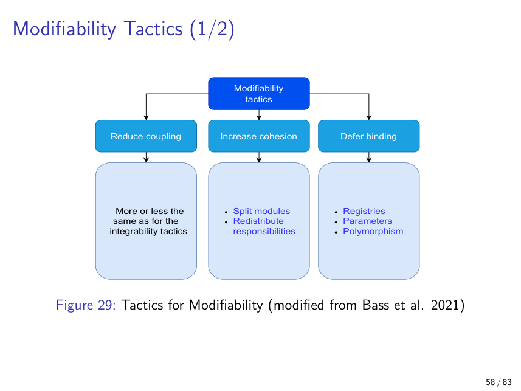
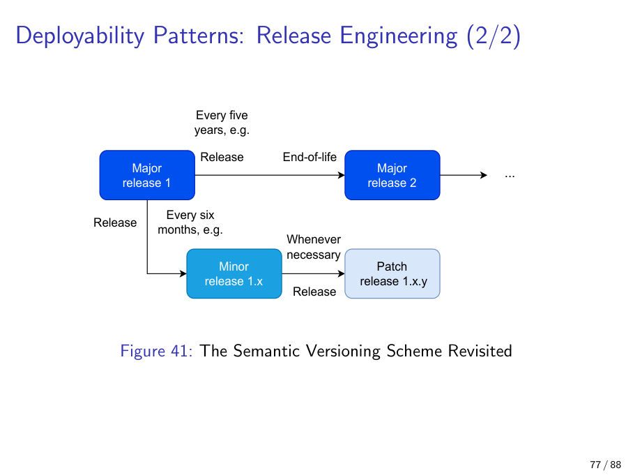

# Chapter 4 — Modifiability

> *"The first release is when the bills start arriving."*

If integrability (Chapter 3) was about welcoming new code in, **modifiability** is about welcoming *change itself* — long after the first deploy, when the original architects have moved on and the system is on its eighth team. It is the quality attribute that decides whether your codebase ages like wine or like milk.

This chapter does six things. First, it sets the **economics** of maintenance — why this attribute is worth optimising for at all. Second, it gives you the **six modifiability planning questions** to ask before you draw a single box. Third, it explains **ripple effects** — the propagation pattern that all modifiability tactics fight against. Fourth, it teaches the **modifiability tactics tree** (reduce coupling / increase cohesion / defer binding), with the **five canonical moves** (split, combine, encapsulate, intermediary, restrict) and the **three defer-binding buckets** (compile time / start-up / runtime) at its centre. Fifth, it covers the **four modifiability principles** (least surprise, small interface, DRY, uniform access). Sixth, it lands on **semantic versioning** — the public contract that *makes ripple effects visible to callers* — including Lübke et al.'s five alternatives for shipping incompatible changes. The chapter closes with the patterns that actively promote modifiability: layering, client-server, MVC, plugin/micro-kernel, pipe-and-filter and batch-sequential.

A note on terminology. **Tactics** are abstract intentions ("reduce coupling between A and B"). **Patterns** are concrete designs ("introduce a publish-subscribe broker"). This course follows Bass et al.'s vocabulary; Fairbanks calls tactics "styles", but we will not. Watch for the word **move** below — it is shorthand for *a refactoring step in the structural sense*, not a Bass-defined term, but it captures the way the five core operations compose into real refactorings.

---

## 4.1 The Maintenance Phase and the 80 % Rule

**Definition.** The *maintenance phase* begins the moment your first release reaches production. It routinely accounts for **60–80 % of a system's total lifetime cost**.

**Why it matters.** Modifiability is the quality attribute that pays its dividend during maintenance. If maintenance is most of the bill, modifiability is most of the savings opportunity.

**Detailed explanation.** A real release pipeline is shaped like two trees. The **staging tree** holds release-candidate 1, 2, … *n*, each gated by *selection-by-test*: only if RCn passes does it progress. The **release tree** holds the versions that actually shipped. Once a build moves from staging to release, the maintenance clock starts and never stops. Maintenance covers bug fixing, security patching, performance tuning, dependency updates and feature evolution. The longer the support window, the heavier the patch backlog: fixing a vulnerability in code released a decade ago is genuinely difficult — the original engineers are gone, the build toolchain has bit-rotted, and the dependencies have moved on three major versions.

**Analogy.** Buying a house. Closing day — the day you actually move in — is when you start paying for the plumbing, the repainting, the roof repair, the new boiler. Those ongoing costs dwarf the purchase price over decades. The first release is closing day for software.

**Example.** Microsoft shipped Windows XP in 2001 and was still selling paid extended-support security patches for it more than a decade later. The original engineering investment was small compared with the long tail.

**Common pitfall.** Conflating "cheap to write" with "cheap to maintain". Modifiability is paid once. Maintenance is paid forever. A clever shortcut that saves a sprint of effort can cost years of carry.

---

## 4.2 Six Modifiability Planning Questions

**Definition.** Bass et al.'s checklist used during *design* — six questions to ask about every system, before you start drawing arrows:

1. **What can change?**
2. **How likely is each change?**
3. **What should be supported?**
4. **Where will changes be made?**
5. **Who will make them?**
6. **What does each change cost?**

**Why it matters.** Modifiability is fundamentally about *anticipating* change. These six questions provide a structured way to do it without descending into "everything must be configurable" paralysis.

**Detailed explanation.** Question 1 asks about external pressures: laws (GDPR, the EU Cyber Resilience Act), hardware refresh cycles, internal environment (cloud platform migration), external environment (protocol upgrades, e.g. TLS 1.2 → 1.3) and other quality attributes (suddenly we need to be highly available). Question 4 separates change locations: source code, compile-time flags, configuration, deployment environment. This question maps directly onto the defer-binding tactic later in the chapter. Question 6 is two questions in one: **cost-per-change** and **cost-of-making-changes-easier**. The latter only pays off when changes are frequent; otherwise you have built a flexibility you will never use.

**Analogy.** Buying renovation insurance. You estimate (1) which rooms you might remodel, (2) how often, (3) which renovations you'll actually pay for, (4) whether the work happens at design stage or after you move in, (5) whether you DIY or hire a contractor, and (6) whether the premium beats out-of-pocket costs.

**Example.** Anticipating that an IoT device might be classified under the EU Cyber Resilience Act, you *encapsulate* the logging subsystem and the firmware-update mechanism behind narrow interfaces. Two years later the CRA arrives, you swap implementations behind those interfaces, and the rest of the system never noticed.

**Common pitfall.** Trying to make *everything* changeable. This is over-engineering — and is exactly what the next section warns about, in the lecturer's own words.

---

## 4.3 Don't Go Overboard — the Spring-XML Caveat

A direct, exam-relevant aside the lecture made on slide 64:

> **"Don't go overboard."**

The lecturer used Spring's XML-driven dependency injection as the canonical cautionary tale. When *every* class is wired together through XML configuration, the system's behaviour disappears from the source code — you cannot read a Java file and know which collaborators it will be handed at runtime, because the binding lives in `applicationContext.xml`. Late binding is a tactic, not a virtue; binding everything as late as possible is just hiding the architecture from the people who maintain it.

Memorise this. "Don't go overboard" is one of those quotable sentences that turns up in exam answers.

---

## 4.4 Ripple Effects

**Definition.** A change in one element propagates — *ripples* — through related elements, forcing further changes elsewhere.

**Why it matters.** The whole point of cohesion-and-coupling design is to bound the ripple's radius. Every modifiability tactic in the tactics tree is, in some sense, a ripple-control mechanism.

**Detailed explanation.** Ripples cross *two* boundaries in particular.

- **Artifact boundaries.** A legal change (e.g. a new GDPR Article) ripples: regulations → requirements → architecture → implementation → tests → documentation → release notes → user training. A "small legal tweak" can therefore mean weeks of work across artifact types.
- **Component boundaries.** Changing component 3 forces changes in components 4, 5, and 8, because they depended on something component 3 used to guarantee. Modifiability tactics aim to localise the ripple to as few components as possible.

**Analogy.** A pebble dropped in a pond. You can't stop ripples — but you can choose whether to drop it in a small basin (localised, bounded) or an open lake (system-wide).

**Example.** Renaming a *public* REST endpoint forces changes in every client and every integration test — a wide ripple that may even cross organisational boundaries. Renaming a *private* method only ripples inside one class.

**Common pitfall.** Counting only production-code lines. Tests are part of the ripple set; documentation is part of the ripple set; downstream consumers are part of the ripple set. "I only changed one line of production code" is almost never the whole story.

---

## 4.5 The Modifiability Tactics Tree

This is the anchor figure of the chapter. Everything else hangs off it.



Bass et al.'s tactics tree has three top-level branches:

- **Reduce coupling** — make modules depend on fewer other modules, and on narrower aspects of them. Sub-tactics include *encapsulate*, *use an intermediary*, *restrict dependencies*, *refactor*, *abstract common services*.
- **Increase cohesion** — keep things that change together close together. Sub-tactics include *split* (separate responsibilities that change at different rates) and *combine* (merge responsibilities that always change together).
- **Defer binding** — push decisions later in the build/deploy/run timeline, so that what was a code change becomes a config change or even a runtime knob.

The next two sections — the five moves and the defer-binding buckets — are how these branches express themselves in actual refactorings.

---

## 4.6 The Five Canonical Modifiability Moves

**Definition.** A small, exam-friendly palette of structural operations: **split**, **combine**, **encapsulate**, **intermediary**, **restrict**. Almost every concrete refactoring you ever do is a composition of these five.


Each move pairs with a concrete refactoring you can name in an exam.

### Split

**What it does.** Take one module with two responsibilities and pull it apart into two cohesive modules.
**Refactoring example.** *Extract `UserAuthService` from `UserService`.* The original `UserService` mixed profile management with authentication; auth has different change drivers (password policy, MFA, OAuth providers) than profile editing. After the split, password-policy changes ripple only inside `UserAuthService`.
**Watch out for.** Splitting too aggressively gives **nano-services** — same total coupling, but now distributed over the network. You traded a method call for a TCP handshake and gained nothing.

### Combine

**What it does.** The inverse of split. Two modules that always change together collapse into one cohesive module.
**Refactoring example.** *Merge `AddressFormatter` and `AddressValidator` into `AddressService`* when every address-format change requires a matching validation change.
**Watch out for.** Two modules that *currently* change together may diverge in the future. Combining is easy to undo only if you remember why you did it.

### Encapsulate

**What it does.** Hide a module's implementation behind a narrow interface; callers see only the interface.
**Refactoring example.** *Wrap a third-party billing SDK behind a `PaymentGateway` interface.* The SDK can be swapped (Stripe → Adyen) without touching call sites.
**Watch out for.** "Encapsulated" in name only — if the interface leaks Stripe-specific types or error codes, you have not encapsulated anything; you have given the leak a doorbell.

### Intermediary

**What it does.** Insert a *C* between *A* and *B* so that *A* no longer talks directly to *B*. The intermediary can be a mediator (in-process), a broker (out-of-process), a wrapper, or a proxy.
**Refactoring example.** *Insert a Kafka topic between `OrderService` and `InventoryService`.* The two services were synchronously coupled by HTTP; now `OrderService` publishes `OrderPlaced`, `InventoryService` consumes at its own pace. Either side can be redeployed without breaking the other.
**Watch out for.** An intermediary adds a hop, a failure mode and an operational artifact. You are buying decoupling with latency and complexity — only spend the money when the decoupling is worth it.

### Restrict

**What it does.** Leave the structure alone but enforce that certain dependencies are *not allowed*. Used to preserve layering rules.
**Refactoring example.** *Add an ArchUnit rule forbidding `controller.*` from importing `repository.*` directly.* Controllers must go through the service layer; the rule fails the build if anyone shortcuts the architecture.
**Watch out for.** Restrictions only matter if they are enforced. A rule in a Confluence page is not a restriction; a failing CI check is.

A useful mnemonic: think of a kitchen. **Split** an all-in-one drawer into utensils and cutlery. **Combine** two spice cabinets. **Encapsulate** the pantry with a door. **Intermediary** = a serving hatch between kitchen and dining room. **Restrict** = a "no shoes" sign on the dining-room door.

---

## 4.7 Defer Binding — Three Buckets, Three Code Snippets

**Definition.** Make commitments as late as possible in the development → deployment → runtime timeline. Each delayed binding turns a *code* change into a *config* or *runtime* change — moving cost from "engineer + release cycle" to "operator + restart" to "user + nothing".

Bass et al.'s notation captures the spirit: hard-coding `b = 1` inside `f(x)` is less general than `f(x, b)`. Even if you ship `b = 1` for now, the parameter is already there for the day you need it.

The three buckets, with side-by-side code.

### Bucket 1 — Compile-time binding

The choice is baked in by the preprocessor or build system. Cheapest at runtime; most expensive to change (you need to rebuild and redeploy).

```c
// compile-time binding via #ifdef
#ifdef ENABLE_TLS_1_3
    use_tls13();
#else
    use_tls12();
#endif
```

To switch TLS versions you change the compile flag and ship a new binary. Suitable for choices that *never* change after build — hardware target, instruction set, license edition.

### Bucket 2 — Start-up binding

The choice is read from a configuration file when the process boots. A restart suffices; no rebuild.

```xml
<!-- config.xml read at process start-up -->
<application>
    <database>
        <url>jdbc:postgresql://prod-db:5432/orders</url>
        <pool-size>32</pool-size>
    </database>
    <feature-flag name="new-checkout" enabled="true"/>
</application>
```

This is the right bucket for environment differences (dev/staging/prod) and for slow-moving operational knobs. You pay nothing at runtime; an operator can change behaviour without recompiling, but a restart is needed.

### Bucket 3 — Runtime binding

The choice is made *during execution*, via a parameter, a signal, a GUI control, or polymorphism. The most flexible bucket; usually the most expensive in code complexity.

```java
// runtime binding via parameter + polymorphism
public interface DiscountStrategy {
    Money apply(Money price);
}

public class Checkout {
    private final DiscountStrategy strategy;
    public Checkout(DiscountStrategy strategy) {   // injected at runtime
        this.strategy = strategy;
    }
    public Money total(Money price) {
        return strategy.apply(price);              // dispatched dynamically
    }
}

// A/B test switch: which strategy is active is chosen per-request,
// e.g. via a feature-flag service consulted at call time.
DiscountStrategy s = featureFlags.isOn("flash-sale", user)
    ? new FlashSaleDiscount()
    : new StandardDiscount();
new Checkout(s).total(cart.price());
```

Feature flags in production are the textbook example: flip a switch in the flag system and behaviour changes without redeploying anything.

**Analogy across the buckets.** Shipping a car. Compile-time binding = welding the seat in at one position. Start-up binding = setting the seat when you turn on the ignition. Runtime binding = a power seat the driver moves at any moment.

**Common pitfall.** Excessive late binding. Spring's XML-driven DI (see §4.3) is the classic example: the system's behaviour becomes invisible from the source code alone. Don't go overboard.

---

## 4.8 Four Modifiability Principles

Four general design heuristics from Bass et al. (2021). Each comes with one example you can quote.

### Principle of least surprise

Interfaces should behave consistently with caller expectations.
*Example.* Light switches in a house: up = on, everywhere. A switch in the cellar that flips the polarity violates least surprise. In code: a `save()` method that *also* sends an email violates least surprise — callers expect `save()` to save.

### Small interface

Two interacting interfaces should exchange as little as possible — both in surface area (number of methods) and in payload (number of fields per call).
*Example.* A switch has two positions, not seventeen. In code: a `UserAuthService.login(username, password)` is small; a `login(User user, Session session, AuditContext ctx, ...)` taking nine arguments is not.

### DRY — Don't Repeat Yourself

Avoid redundant ways to reach the same goal.
*Example.* One switch controls each light, not three switches wired in parallel. In code: one validation function for email addresses, called from every input form, not three near-duplicates that drift over time.

### Uniform access (Eiffel)

Do not leak implementation: a resource is requested the same way whether served from cache, disk, or freshly computed. Bertrand Meyer's invention in Eiffel.
*Example.* `account.balance` looks identical whether `balance` is a stored field or a computed method. The implementer can change between the two without breaking any caller. In REST: an endpoint that returns `200 OK` for both cached and freshly computed responses, with the same body shape, honours uniform access.

**Common pitfall.** DRY can be over-applied. Two snippets that look identical today may serve different purposes tomorrow; deduplicating prematurely couples two responsibilities that should have stayed apart. The cure is sometimes worse than the disease.

---

## 4.9 Backwards Compatibility and Semantic Versioning

This is the canonical home for semver in the study guide. Chapter 6 will cross-reference back here.

**Definition.**
- **Backwards compatibility** = newer versions remain interoperable with older binaries, data formats, or callers.
- **Semantic versioning** = a three-part version number `MAJOR.MINOR.PATCH` where:
  - **MAJOR** bumps signal **incompatible** changes;
  - **MINOR** bumps signal **backward-compatible new features**;
  - **PATCH** bumps signal **backward-compatible bug fixes** (including security patches).

**Why it matters.** Whole industries are still shaped by compatibility decisions made decades ago: the x86 instruction set, the C language, the Win32 API. Versioning is the public contract through which users — and downstream package managers — learn what to expect.



### Lecture's mental model (slide-cum-Fig. 41 of Lecture 4)

The lecture's release-engineering picture pairs semver with concrete cadences:

- **Major release** (e.g. 1 → 2) — roughly every **~5 years**; potentially **breaking**.
- **Minor release** (1.x) — roughly every **~6 months**; **backward-compatible additions**.
- **Patch release** (1.x.y) — **"whenever necessary"**; bug or security only.

Each released version has both a *release date* and an *end-of-life*. **LTS** (long-term-support) versions typically receive only patch releases — security fixes, no new features.

**Analogy.** A car model line. The 1998 model is still serviced (LTS) with safety recalls, but no one is adding a touchscreen to it; new features go into the 2024 model.

**Common pitfall.** Believing continuous deployment makes versioning obsolete. It doesn't — CD makes patch versions trivial to ship, not unnecessary. You still need the contract that tells callers *which* version they are calling.

### The cardinal sin

Bumping MINOR (or PATCH!) while sneaking in a breaking change. Downstream consumers who pinned `^1.4` thought they were safe; they were not. The whole point of MAJOR is to be visible: *if* you break, *say* you broke.

---

## 4.10 Lübke et al.'s Five Alternatives for Incompatible Changes

Sometimes you simply must ship a breaking change. Semver tells you to bump the major; **Lübke et al. (2019)** catalogue the *operational strategies* you can use around that bump.


| # | Strategy | What it means | Typical version range | Real-world echo |
|---|----------|--------------|-----------------------|------------------|
| 1 | **Experimental preview** | The API is openly unstable; callers accept that it may break. | 0.x | Most pre-1.0 npm packages; new `--experimental-` flags. |
| 2 | **Aggressive obsolescence** | Bump major, drop the old. Short or no deprecation window. | v1.0 → v1.1 with old removed | Lightning → USB-C in some Apple devices. |
| 3 | **Two in production** | Run the old and the new major side by side for an extended period. | v2 *and* v3 both live | Python 2 vs Python 3 — over a decade of co-existence. |
| 4 | **Limited lifetime guarantee** | Support v4.1 for a defined window — say, three years — then end it. | v4.1 supported until 2027-Q4 | Most commercial LTS offerings (Ubuntu LTS, JDK LTS lines). |
| 5 | **Lifetime guarantee** | Support v8 / v9 forever. | v* supported indefinitely | The x86 instruction set; USB-A surviving for two decades. |

**How to choose.** Experimental preview is the cheapest and the most honest before 1.0. Aggressive obsolescence is the cheapest *after* 1.0 — but it dumps the cost onto callers, so it works only when you have leverage. Two-in-production is the most expensive for you (two parallel codebases, two patch streams) and the kindest to callers. Limited and lifetime guarantees are the contracts you sell to enterprise customers — they pay for the promise.

**Connection to semver.** Each Lübke strategy is a different shape on the semver timeline. Aggressive obsolescence is a major bump with no overlap. Two-in-production is two majors with a long overlap and parallel patch streams. Limited lifetime is the same with a hard end-of-life date drawn on the chart.

---

## 4.11 Modifiability-Promoting Patterns

The chapter closes by surveying the patterns the lecture explicitly nominated as modifiability-promoting. Each one is a structural commitment that helps localise change.

### Plugin / micro-kernel


**Definition.** A core component exposes a stable connector through which independently developed *plugins* extend functionality, often advertised via a *registry*.

**Why it matters.** Drives whole ecosystems: browsers (extensions), VS Code, Eclipse, Photoshop, WordPress. The pattern decouples third parties from each other and from the core; coupling is mostly confined to the connector.

**Detailed explanation.** Unlike microservices, plugin-to-core communication is usually via direct method calls inside the same process. Different teams — and even end-users — can deliver plugins without modifying the core; the registry tells the core what is loaded.

**Security caveat (don't skip this).** A plugin runs **arbitrary code with the same privileges as the host**. Slide 76 explicitly cites Firefox / Chrome / Edge extensions being weaponised for spying. The same trade-off applies to any plugin model: you bought extensibility with privilege exposure. Sandboxing helps but rarely eliminates the risk.

**Analogy.** A games console (core) + game cartridges (plugins). The core defines the connector; cartridge makers don't know each other but can all plug in.

**Naming pitfall.** "Micro-kernel" here is borrowed from OS terminology but does not imply a kernel-style boundary. It's plugin-pattern with marketing.

### Pipe-and-filter vs Batch-sequential


**Definition.** Both compose components in a directed flow; the difference is *granularity of handover*.

- **Pipe-and-filter** — each filter streams output to the next; data trickles through. Filters have *read* and *write* port instances connected by *pipes*.
- **Batch-sequential** — same DAG shape, but each stage finishes completely before the next begins.

**Why it matters for modifiability.** Filters / stages can be added, swapped, or reordered without rewriting their neighbours, as long as the pipe contract is preserved.

**Examples.**
- Pipe-and-filter: `cat file.log | grep ERROR | sort | uniq -c` — the canonical Unix shell pipeline.
- Batch-sequential: a nightly ETL that dumps yesterday's data to disk, then loads it, then aggregates it.

**Common pitfall.** Pipe-and-filter limits how much state any filter can carry. If a filter needs the whole dataset to make a decision, you have effectively switched back to batch-sequential — the streaming benefit is gone.

**Cross-reference.** Chapter 15 (Linux network stack) treats Netfilter as pipe-and-filter at scale. Chapter 10's SIEM example reuses this exact diagram.

### Layering

**What it gives modifiability.** Changes at lower layers don't ripple upward, *if* the layer interface is stable. A renovation in the basement doesn't touch the penthouse.

**Drawbacks.** Performance — every cross-layer call adds indirection. Productivity — upper-layer developers are constrained when the lower layer hasn't yet shipped what they need.

**Example.** The OSI model. The application layer is blissfully unaware of whether the link layer is Ethernet or Wi-Fi.

### Client-server

**What it gives modifiability.** Clients and servers evolve independently. Clients have no coupling to each other. Scaling the server side scales the system.

**Drawbacks.** Network dependency (failure mode). Security exposure across the C/I/A triad (confidentiality, integrity, availability) — the network is hostile.

**Example.** Every HTTP-fronted web app. Many diners, one kitchen, no diner knows any other.

### Model-View-Controller (MVC)

**What it gives modifiability.** Views and controllers don't depend on each other; both depend on the model. UI/interaction logic changes don't cascade.

**Drawbacks.** "MVC" in modern JavaScript frameworks is often actually MVVM or Flux/Redux. Before claiming modifiability benefits, check what is depending on what.

**Example.** A stage play. The actors (controllers) and the audience (view) only share a script (model).

---

## 4.12 Takeaways

1. **Maintenance is 60–80 % of total lifetime cost.** This is the economic justification for spending design effort on modifiability up front. Memorise this number — it's exam-quotable.
2. **The six modifiability planning questions** are: *what can change? how likely? what is supported? where? who? at what cost?* Question 6 has two halves — cost-per-change and cost-of-making-changes-easier.
3. **Ripple effects cross both artifact boundaries (legal → docs → tests) and component boundaries.** Tactics aim to localise the ripple radius.
4. **The modifiability tactics tree has three branches:** reduce coupling, increase cohesion, defer binding. Be able to draw it.
5. **The five canonical modifiability moves:** *split*, *combine*, *encapsulate*, *intermediary*, *restrict*. Pair each with a refactoring (extract `UserAuthService` from `UserService` = split; insert a Kafka topic = intermediary; ArchUnit layering rule = restrict).
6. **Defer-binding has three buckets** along the dev → deploy → run timeline: **compile-time** (`#ifdef`), **start-up** (config.xml), **runtime** (parameter + polymorphism, feature flags). Pick the latest bucket that the change frequency justifies — and *don't go overboard*.
7. **Four modifiability principles:** least surprise, small interface, DRY, uniform access (Eiffel). One example each.
8. **Semantic versioning** is `MAJOR.MINOR.PATCH`; major = breaking, minor = backward-compatible additions, patch = bug/security fixes. Continuous deployment does not abolish it.
9. **Lübke et al.'s five alternatives** for incompatible changes: *experimental preview*, *aggressive obsolescence*, *two in production*, *limited lifetime guarantee*, *lifetime guarantee*. Each is a different shape on the semver timeline.
10. **Modifiability-promoting patterns to discuss with trade-offs:** layering, client-server, MVC, plugin / micro-kernel (with its arbitrary-code-execution caveat), pipe-and-filter, batch-sequential. Publish-subscribe — covered in Chapter 3 — also belongs in this list.
11. **"Don't go overboard"** — the Spring-XML caveat — is itself an exam-relevant quote. Late binding is a tactic, not a virtue.

Modifiability is the long game. The architect who refuses to write `f(x, b)` instead of `f(x)` saves five minutes today and pays for it for a decade. The architect who XML-configures every collaborator pays today *and* for a decade. The five moves, the three buckets, and the four principles together are how you find the middle.
