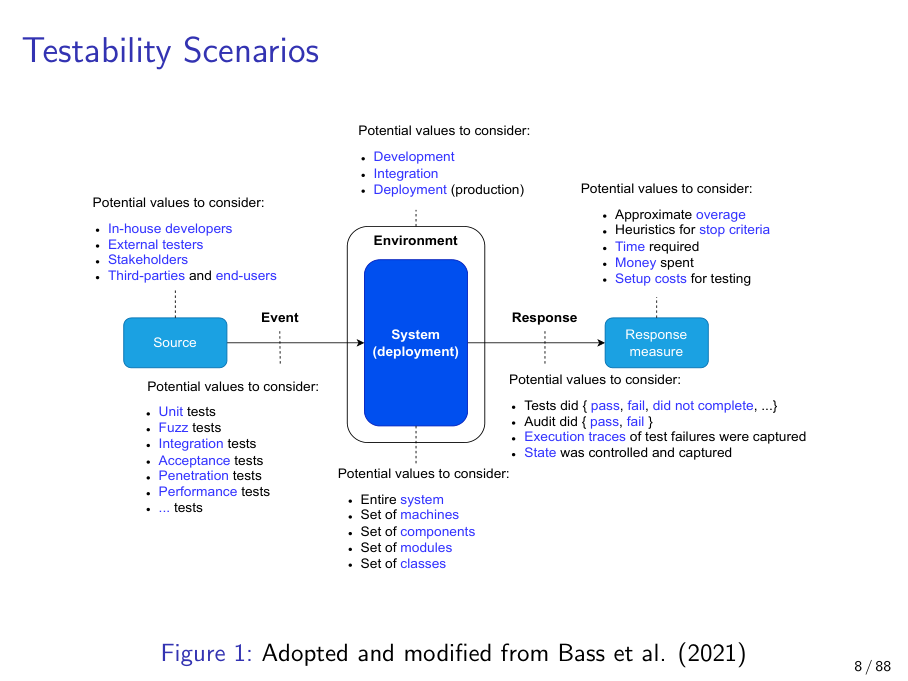
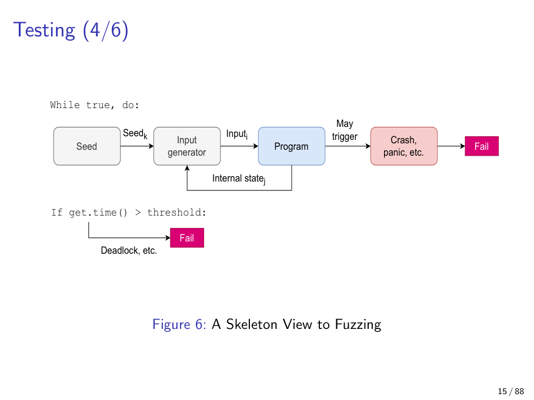
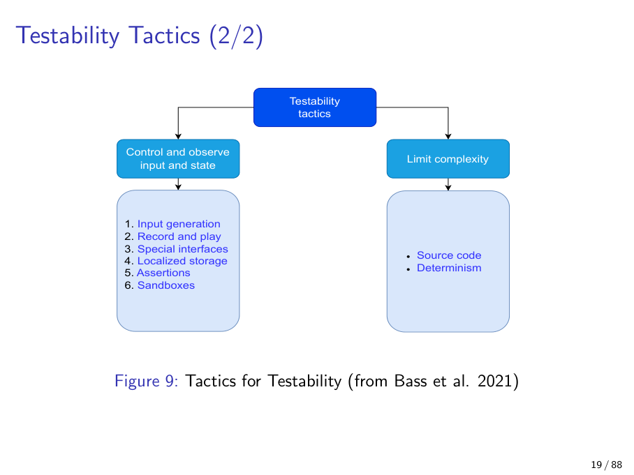
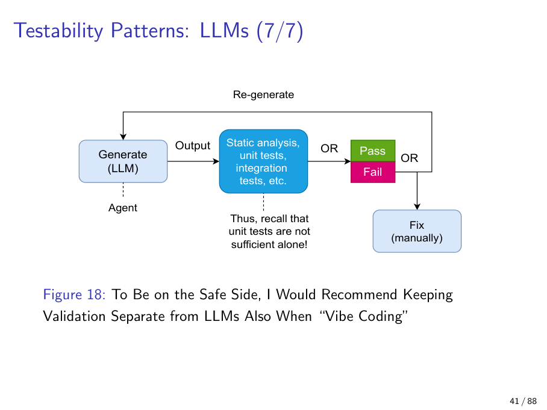

# Chapter 5 — Testability

> *"Testability is not the same as 'we have tests'. Testability is a property of the **system**, not of the test suite."*
> — paraphrased from Jukka Ruohonen, Lecture 4 (March 3, 2026)

## Opening — what this chapter is about

If you remember one sentence from this chapter, let it be the epigraph above. The single most common student mistake on this topic is to hear "testability" and answer with a story about CI pipelines, coverage percentages, or how many unit tests the team wrote last sprint. Those things are *consequences* of testability (or compensations for the lack of it), but they are not testability itself.

Bass et al. (2021) define **testability** as

> *the ease with which software can be made to demonstrate its faults.*

Read that carefully. It is the *software* that demonstrates faults — not the engineer, not the test runner. Testability is an architectural property: *given* that a fault exists, how much effort is required to expose it? A system with low testability hides its bugs, no matter how diligently the team writes tests. A system with high testability surfaces bugs cheaply, even when the test suite is modest.

That reframing matters for the exam, and it matters in practice. It tells you what to do when you are stuck:

- Don't write *more* tests against an untestable system — make the system more testable first.
- Don't claim a system is "well-tested" because it has 100 % line coverage — covered lines can hide bugs along uncovered paths.
- Don't assume "we use TDD" implies high testability — TDD is a process, testability is a structural property.

This chapter is organised in three movements. **First**, we set the framing — verification vs. validation, the 6-slot scenario, and the oracle problem. **Second**, we walk the testability tactics tree: control/observe input & state (with its six sub-tactics), and limit complexity. **Third**, we cover the patterns — dependency injection, strategy, intercepting filter, type safety, regression testing — and close with the modern, exam-fresh material on *LLM verification debt* (Bouzoukas 2026; Chou et al. 2025).

> **Cross-reference.** The "limit complexity" tactic restates earlier modifiability ideas (encapsulation, dependency reduction — see Ch 4). The fuzzing loop reappears as a chaos-engineering primitive in Ch 6 (Deployability). Assertions reappear as a *detect* tactic in Ch 10 (Safety).

---

## 1. Verification vs. validation (Boehm 1984)

**Definition.** *Verification* asks "are we building the product right?" — does the code match the spec? *Validation* asks "are we building the right product?" — does the spec match the user's needs?

**Why it matters.** Testability concerns **verification only**. A system can have perfect testability and still ship the wrong product. The architect needs both, but the QA labelled "testability" is narrower than the colloquial word "testing".

**Explanation.** Verification is *internal*: tests, assertions, fuzzing, static analysis, type checking. Validation is *external*: user research, acceptance tests, requirements review, business sign-off. The Boehm 1984 distinction is the canonical exam framing — recognise it and apply it.

**Analogy.** *Verification* is "the cake matches the recipe". *Validation* is "the customer wanted a cake at all, not a pie".

**Example.** A microservice with 100 % branch coverage that perfectly implements an obsolete protocol — verified but invalid.

**Pitfall.** Conflating the two in exam answers. If a question asks about testability, stay inside verification. If it asks about *requirements engineering*, that is the validation half.

---

## 2. The 6-slot testability scenario

**Definition.** A Bass-style quality-attribute scenario, instantiated for testability, with six slots: **Source, Stimulus (Event), Environment, System (Artifact), Response, Response Measure**.

**Why it matters.** Forces the architect to make testability *measurable and falsifiable*, not aspirational. The template is the same shape you have already seen in Ch 3 for other QAs; what changes are the example values.

**Slot meanings, populated for testability.**

| Slot | What goes in it (testability flavour) |
|------|----------------------------------------|
| Source | Who runs the test — in-house developer, external testers, third-party auditor |
| Stimulus (Event) | The kind of test — unit, fuzz, integration, acceptance, penetration, performance |
| Environment | Lifecycle stage — development, integration, staging, production |
| System (Artifact) | Scope under test — whole system, set of machines, modules, classes |
| Response | What is captured — pass/fail/timeout, execution traces, coverage data |
| Response measure | The bound or threshold — coverage %, time/CPU budget, money, stop-criterion heuristic |

**Worked example.**
> "An **in-house developer** (source) launches a **fuzz test** (stimulus) in the **integration environment** (environment) against the **entire system** (artifact); **execution traces of test failures must be captured** (response), with **approximate coverage reported and a cap of 4 CPU-hours** (response measure)."

**Analogy.** A six-axis fingerprint of a test situation — like an aviation pre-flight checklist. Every slot must be answered before testability is well-defined.

**Pitfall.** Treating the template as paperwork instead of as a design-constraint generator. The slots are not for the report; they tell you what *architectural decisions* the system must support.



*Figure 5.1 — The 6-slot testability scenario template. Each slot is one design constraint generator.*

---

## 3. The Oracle Problem and the four oracle types

This is one of the most exam-friendly slices of the lecture. Expect a "name and example each" question.

**Definition.** The *oracle problem* is the problem of deciding, for a given input, **whether the program's output is correct** — i.e. of having an authoritative judge ("oracle") for test outcomes.

**Why it matters.** Tests without oracles are theatre. The oracle, not the input, is usually the limiting reagent in testing. Generating inputs is cheap; deciding what *correct* means is hard.

**Barr et al. (2015) taxonomy — the four oracle types.**

1. **Specified oracle.** The textbook case: a precise, machine-checkable statement of what the output should be.
   - *Example:* `assertEqual(1 + 1, 2)`. Or a postcondition `assert f(x) > 0 for all x in domain`.
   - *Used by:* unit tests with concrete expected values, formal verification.

2. **Pseudo-oracle.** A *separate, independent* implementation of the same specification. If both outputs agree, the test passes; if they diverge, at least one is wrong. Reference implementations and reference architectures play this role.
   - *Example:* differential testing — run two TLS libraries on the same input, compare outputs.
   - *Used by:* differential fuzzing, multi-version regression testing.

3. **Implicit oracle.** What *any* program is expected not to do — independent of its spec. Crashes, segfaults, deadlocks, buffer overflows, memory leaks, kernel panics. The "thing the program must not do" oracle.
   - *Example:* fuzzing the Linux kernel — any **kernel oops is a bug**, regardless of input.
   - *Used by:* fuzzers (very heavily), sanitizers (ASAN, UBSAN, TSAN).

4. **Derived oracle.** Extracted from external artifacts: standards, protocols, requirements documents, user feedback, runtime behaviour traces.
   - *Example:* testing an HTTPS implementation against **RFC 8446**. The RFC tells you what valid behaviour looks like; your test compares your implementation against it.
   - *Used by:* conformance testing, protocol-suite testing.

**Memorisation analogy.** Think of a spelling bee.
- *Specified:* the printed dictionary at the judge's desk.
- *Pseudo:* a second judge who learned the language independently.
- *Implicit:* "if the contestant screams or faints, it's wrong" — true regardless of the word.
- *Derived:* "the regional accent guide says this pronunciation is acceptable."

**Pitfall.** Assuming every test can have a specified oracle. **Most can't.** That is precisely why fuzzing (implicit oracle), differential testing (pseudo-oracle), and metamorphic testing (a derived-style oracle) exist — they are workarounds for the absence of a specified oracle.

---

## 4. Stop criterion — "when do we stop testing?"

**Definition.** The decision rule for terminating a testing activity, given that exhaustive testing is impossible.

**Why it matters.** Without an explicit stop criterion, testing is either *over-invested* (diminishing returns, wasted budget) or *under-invested* (premature ship). Both are forms of architectural failure.

**Heuristics, none of them complete.**
- **Coverage thresholds** (e.g. via `coverage.py`): "stop at 80 % branch coverage".
- **Time budgets**: "stop after 4 CPU-hours", "stop at the end of sprint".
- **Statistical reliability models**: model the bug-arrival rate as a *non-homogeneous Poisson process* (NHPP) — the rate decreases as testing matures; stop when expected new bugs/hour falls below a threshold.
- **Engineering judgement**: "no critical bugs found in the last *n* runs *and* the high-risk areas are covered".

**Analogy.** "When is a stew done?" — there is no analytic answer, only experienced cooks with timers and tasting spoons.

**Pitfall.** Treating **100 % line coverage** as a stop criterion. Coverage is necessary, not sufficient — *covered lines can still hide bugs along uncovered paths*. Coverage tells you what was executed, not what was checked.

---

## 5. Fuzzing — the skeleton loop

Fuzzing is the canonical demonstration that good testability tactics pay off. **Every successful fuzzer is built on controllable input, observable state, and assertions.**

**Definition.** An automated dynamic testing technique that repeatedly generates inputs from a seed corpus and feeds them to a program, watching for crashes, deadlocks, or other implicit-oracle violations.

**The skeleton loop.**

```
seed corpus ──► input generator ──► program under test ──► observe
   ▲                                                              │
   │                              ┌── crash / panic ── FAIL ──────┤
   │                              ├── time > threshold ─ FAIL ────┤  (deadlock)
   │                              └── coverage feedback ──────────┘
   └────── new interesting inputs added back to corpus ◄──────────┘
```

The loop is intentionally simple — `while true { input = generate(seed); run(program, input); check_implicit_oracle() }` — and that simplicity is the point. The hard work happens in the **architecture of the system under test**: it must accept inputs from outside (controllable input), it must surface its state to the harness (observable state), and it must trip an implicit oracle when it goes wrong (assertions, sanitizers, watchdogs).

**Extensions.** The same loop generalises naturally:
- Add a **latency threshold** → you have a performance fuzzer.
- Add a **memory-growth threshold** → you have a leak detector.
- Feed **branch coverage back to the input generator** → you have a coverage-guided fuzzer (AFL, libFuzzer, syzkaller).

**Analogy.** A monkey at a typewriter, but the monkey reads the previous page and is rewarded when it crashes the printing press. Add a stopwatch and a fuel gauge — now it also flags slow and overheating runs.

**Example.** Google's **OSS-Fuzz**; **syzkaller** for the Linux kernel (used in Ruohonen & Rindell 2019 to study time-to-fix of kernel bugs).

**Pitfall.** Believing fuzzing replaces unit tests. Fuzzing is excellent at **implicit-oracle** bugs (crash, hang, leak); it **cannot** tell you that `tax_total` is off by 0.5 %.



*Figure 5.2 — The canonical fuzzing skeleton. Crash and timeout are the two implicit-oracle arms; coverage feedback closes the loop.*

---

## 6. The testability tactics tree — two branches

Bass et al. (2021) split testability tactics into **two top-level branches**:

1. **Control and observe input & state** — make the inputs controllable from outside and the internal state observable from outside. Six sub-tactics.
2. **Limit complexity** — reduce states, dependencies, and non-determinism so that tests are reproducible. Two sub-themes (source-code complexity, structural complexity / determinism).



*Figure 5.3 — The testability tactics tree. Memorise both branches and all six sub-tactics on the left branch.*

### 6.1 Branch 1 — Control & Observe Input & State (six sub-tactics)

A near-certain exam item is "name three sub-tactics of control/observe". Memorise all six and an example for each.

#### 6.1.1 Input generation
Automated input creation: random, mutation-based, model-based, grammar-based, coverage-guided. The "input" side of fuzzing.
- *Example:* AFL mutating a seed PNG to discover libpng bugs.

#### 6.1.2 Record and play
Capture inputs (and ideally state) so that a failure can be **replayed** deterministically. Reproducibility, the lecturer notes, is "one of the grand challenges" — especially for distributed systems and LLM-based tests where outputs are non-deterministic by default.
- *Example:* recording the exact HTTP request sequence that crashed staging, then replaying it in dev.

#### 6.1.3 Special interfaces
`get()`, `set()`, `report()`, `print_debug()`, `reset()` — exposed *only* under a testing flag. The lecture's canonical example uses **`#ifdef TESTING`**:

```c
// production-safe by default; only compiled in for the test build.
#ifdef TESTING
    void  scheduler_set_clock(uint64_t now);   // override clock
    State scheduler_get_state(void);           // peek internal state
    void  scheduler_reset(void);               // wipe between tests
#endif
```

The compiler simply does not include these symbols in the production binary, so the production attack surface is unchanged. This pattern lets you have intrusive, white-box test hooks **without** shipping them.

- *Warning, repeated by the lecturer:* special interfaces enlarge the attack surface **if you forget the guard**. The reason `#ifdef TESTING` (or its equivalent — Java's package-private, Python's `if __debug__:`, Rust's `#[cfg(test)]`) exists is precisely to confine them to the test build.

#### 6.1.4 Localized storage
Put state where it can be snapshotted and inspected — a known data structure, a known address, a known file. Especially important in distributed systems where state is otherwise scattered across services and caches.
- *Example:* the `etcd` cluster behind a Kubernetes control plane; the entire cluster state can be dumped and replayed.

#### 6.1.5 Assertions
Pre-conditions, post-conditions, invariant checks. Fuzzers love assertions because **each one is a free implicit oracle** — an assert that fires is a bug, no spec required.

The lecture pushed this further with two speculative, memorable forms:

```c
// "speculative" assertions from the lecture — likely on the exam
ASSERT_FUTURE_STATE(10s) == SHUTDOWN;
ASSERT_PROBABILITY(model, test_set) > 0.7;
```

The first says: "in 10 seconds from now, the system should be in state `SHUTDOWN`." The second says: "the ML model must score above 0.7 on this test set." Both are *forward-looking* assertions — not just "what is true now" but "what must become true". They demonstrate that assertions are not just `assert x > 0`; they can encode temporal and statistical invariants too.

> **Exam-friendly recall hook.** `ASSERT_FUTURE_STATE(10s) == SHUTDOWN` is unusual enough to be memorable; if you can quote it back, you'll signal that you watched the lecture, not just the slides.

#### 6.1.6 Sandboxes
Run tests in isolation — VM, container, jail, ephemeral cloud env — so they cannot disturb the host, production state, or each other. Sandboxing is what makes parallel test execution safe.
- *Example:* GitHub Actions spinning up a fresh Ubuntu container per CI job; `docker compose up` for integration tests; `pytest`'s tmp directory fixtures.

#### Analogy for the whole branch
A chemistry lab bench with **calibrated burettes** (input generation), **CCTV** (record and play), **dedicated probe ports** (special interfaces), **labelled reagent cabinets** (localized storage), **pH paper at every step** (assertions), and a **fume hood** (sandbox). Take any one away and the lab becomes untestable.

#### Common pitfall
Adding `get_` / `set_` for *everything* without conditional compilation — production binaries then ship with **debugging back-doors**. The `#ifdef TESTING` (or `#[cfg(test)]`, or `if __debug__:`) is non-negotiable.

### 6.2 Branch 2 — Limit complexity (and determinism)

**Definition.** Tactics that reduce the number of states, dependencies, and non-deterministic interactions in a system, with the explicit goal of making tests **reproducible**.

**Why it matters.** Complex systems contain more bugs *and* are harder to test for them — a *multiplicative* penalty. Determinism, in particular, is what makes tests trustworthy: a non-deterministic test failure is indistinguishable from a flaky test, and flaky tests train teams to ignore the red light.

**Two sub-themes.**

1. **Source-code complexity.** Reuses earlier-lecture techniques: encapsulation, dependency reduction, modularity (see Ch 4 — Modifiability). A unit with no hidden global state and few collaborators is easier to test in isolation than a class with eleven private mutable fields and three singleton dependencies.
2. **Structural complexity / determinism.** Large systems have an irreducible *stochastic* element (thread scheduling, network jitter, ML-model output, clock drift). The honest engineering response is to acknowledge it: the **NetBSD** test suite uses *flagged oracles* — tests can be tagged "expected failure due to a known difficult bug" or "sometimes fails on ARM64/MIPS for unknown reason". This is not capitulation; it is data. A test marked *known-flaky-on-ARM64* tells the next maintainer where to focus, instead of being silently disabled.

**Analogy.** A clockmaker reduces a watch to as few moving parts as possible — not because they enjoy minimalism, but because each gear they remove is one fewer thing that can stick.

**Pitfall.** Treating flaky tests as "ignore the red light" rather than as evidence of insufficient complexity-limitation. Every silenced flaky test is a future incident.

---

## 7. Regression testing — organisational memory

**Definition.** A test whose explicit purpose is to detect that a previously-fixed bug has returned.

**Why it matters.** Regression tests are the bridge between testing, documentation, and complexity management. They are **organisational memory** — encoded knowledge that this specific failure mode mattered enough to record.

**Convention.** When you fix a bug, add a regression test that *would have failed before the fix and passes after*. The test stays in the suite forever.

**Empirical footnote.** Ruohonen & Alami (2024) found that in the Linux kernel between 2021–2024, the bulk of regression bugs concentrates in `drivers/` and `fs/` — practical intelligence about where to invest regression effort.

**Analogy.** A vaccination scar. The body remembers the previous attack and rejects it on sight.

**Example.** A bug NetBSD developers fixed in 2012; without a regression test recording the failure mode, no one in 2026 would remember it exists.

**Pitfall.** Treating regression tests as second-class. They are arguably the most valuable tests because each one is a documented "lesson learned" — they encode the **why** as much as the **what**.

---

## 8. Testability patterns

The tactics above are the *what*; patterns are the *how*. Five patterns are explicit in the lecture.

### 8.1 Dependency Injection (DI)

**Definition.** A construction technique in which a function or object receives the collaborators it needs (services, configs, clocks) **as parameters**, instead of constructing them itself.

**Why it matters.** This is the single highest-leverage testability pattern. Without it, controllable inputs and observable state are essentially impossible to retrofit.

**Minimum viable form.**

```python
# Untestable — hidden coupling to real clock, real HTTP, real config
class OrderService:
    def __init__(self):
        self.now = datetime.now()        # global state
        self.http = requests.Session()    # real network
        self.cfg  = load_config()          # filesystem

# Testable — collaborators injected
class OrderService:
    def __init__(self, clock, http, cfg):
        self.clock = clock
        self.http  = http
        self.cfg   = cfg
```

In tests, you pass a *FakeClock*, a *MockHttpClient*, and an in-memory config object — the production code path is exercised, but every collaborator is under test control.

**Trade-off.** A small amount of boilerplate and indirection, in exchange for the ability to swap in test doubles, mocks, and spies.

**Analogy.** A power tool with interchangeable bits vs. a power tool with a *welded* bit. The first is universal; the second is a museum piece.

**Pitfall.** Going to the other extreme — every collaborator passed through several layers of injection container — until the **configuration itself becomes untestable**. DI containers are tools, not virtues.

### 8.2 Strategy Pattern

**Definition.** A design pattern in which a *behaviour* is selected at runtime from a family of interchangeable implementations behind a common abstract interface.

**Why it matters.** Lets a test substitute a known, simple strategy for a complex production one — the same hook as DI, but at the *algorithm* level.

**Lecture's example.**

```python
def classify(type, X):
    if   type == "RANDOM_FOREST":          return RandomForest().fit_predict(X)
    elif type == "SUPPORT_VECTOR_MACHINE": return SVM().fit_predict(X)
    elif type == "DEEP_NEURAL_NET":        return DNN().fit_predict(X)
    # ... etc.
```

In tests, register `"STUB_CONSTANT"` that returns a fixed array. The test exercises the classification *pipeline* without paying the training cost of a real model.

**Analogy.** Camera lenses — same body, swappable optics. Tests can fit a *lens cap* lens.

**Pitfall.** Readability suffers when the number of strategies grows. The `switch`/`if-elif` chain becomes a dispatch table you need to maintain in two places.

### 8.3 Intercepting Filter

**Definition.** A pattern in which pre- and post-processing filters are injected *around* a function's primary method.

**Why it matters.** Provides a uniform place to add cross-cutting concerns — logging, assertions, instrumentation, authorization — without modifying the primary method.

**Code shape.**

```python
def call_with_filters(x, pre=None, post=None):
    if pre  is not None: pre(x)        # pre-filter: assertions on input, capture
    z = g(x)                            # the primary method
    if post is not None: post(z)       # post-filter: assertions on output, capture
    return z
```

The pre-filter is where you assert preconditions and capture inputs; the post-filter is where you assert postconditions and capture outputs. Both filters are *injectable* — they're DI for cross-cutting concerns.

**Analogy.** Airport security and customs — every passenger goes through the same checks before and after the flight, without the airline embedding them in flight operations.

### 8.4 Type Safety

**Definition.** Using a strongly typed language, or type annotations in a weakly typed one, so that *static analysis* can catch defects before runtime.

**Why it matters.** Shifts entire classes of bugs (wrong-type arguments, null-deref, mismatched units) into the **compile phase**, dramatically reducing what dynamic tests must cover.

**Extension.** Type information enables **taint analysis** — tracking "tainted" (user-controlled, untrusted) data across the program. A taint tracker can warn when a tainted string flows into `sql.execute(...)` without sanitization.

**Pitfall, explicit in the lecture.** Python's annotations are **not enforced at runtime**:

```python
def add(x: int, y: int) -> int:
    return x + y

add("hello", "world")   # returns "helloworld" — no error
```

If you need runtime enforcement in Python, use explicit checks (`assert isinstance(x, int)`), `pydantic`, or `beartype`. Type *annotations* are a lint and IDE hint; type *enforcement* needs a runtime check or a stricter language.

**Analogy.** A jigsaw puzzle where pieces only physically fit in the correct slots; you cannot construct a wrong picture even if you try.

### 8.5 LLMs and Verification Debt — the new pattern

This is the freshest material in the lecture, drawn from Bouzoukas (2026) and the Chou et al. (2025) "vibe coder" vignette. Treat it as exam-likely.

**Definition.** *Verification debt* (Bouzoukas 2026) is the accumulating burden of **un-verified LLM output** sitting inside a codebase. As more code is generated by LLMs and reviewed only superficially, the system accumulates verification-debt the same way a project accumulates technical debt — silently, with compounding interest.

**Why it matters.** LLMs erode the assumption that *the developer has actually read what they shipped*. The architect now needs deliberate **independence** between LLM-generated code and the things that verify it.

**The anti-pattern.** "LLM generates, another LLM (or the same LLM in a different prompt) verifies." Both can be wrong **in correlated ways** — they share training data, biases, and failure modes. Two reviews, one bias.

**The Chou et al. (2025) vibe-coder vignette** captures the problem viscerally:

> *"All the tests are passing... but it [the LLM] probably wrote the tests [so they would] pass."*

If the same agent that wrote the implementation also wrote the tests, the tests certify the agent's own opinion of correctness — not correctness itself. A confident-but-wrong implementation comes with confident-but-wrong tests. The green CI badge is a lie.

**Security debt as a sub-debt.** Bouzoukas frames security debt as a *child* of verification debt: LLMs ship insecure code with high probability, and unverified code propagates through supply chains (npm, PyPI, container base images). One unreviewed LLM commit can become thousands of downstream vulnerabilities.

**The safe pattern — keep validation outside the LLM.** Diagrammed below. The LLM generates code; **independent** static analysis, **human-written** unit tests, and integration tests with **deterministic** oracles verify it. On failure, the result feeds back — either re-generate or repair manually. The LLM never marks its own homework.

<p align="center">



</p>

*Figure 5.4 — The "safe" LLM-coding pipeline (lecture Fig. 18). The LLM generates; **independent** static analysis, unit tests, and integration tests verify. On failure, control flows back to re-generation or manual fix. The validation chain is **human / deterministic**, never the same LLM in another costume. **Likely exam material.***

**Analogy.** Asking a student to mark their own exam — and then asking *a second copy of the same student* to mark it again. Two reviews, one bias.

**Pitfall.** Trusting LLM-generated tests as ground truth without an independent oracle. If you can't point to *something not produced by the LLM* in the verification chain, you don't have verification — you have a hallucinated review.

---

## 9. Exam-relevant takeaways

A short, memorable list — most of these are recall items.

- **Testability ≠ tests.** Testability is *the ease with which software can be made to demonstrate its faults* (Bass et al. 2021). It is a property of the **system**, not the suite.
- **Boehm 1984.** *Verification* = "building the product right"; *Validation* = "building the right product". Testability concerns **verification**.
- **Six-slot scenario template.** Source / Stimulus / Environment / Artifact / Response / Response measure — same shape as every other QA scenario.
- **The four oracle types (Barr et al. 2015).** *Specified* (printed dictionary), *Pseudo* (independent second implementation), *Implicit* (crash / hang / leak — fuzzers' bread and butter), *Derived* (RFC, standard, requirements doc).
- **Stop criterion is heuristic.** Coverage, time budget, NHPP for bug arrivals — none are correct, but you need one explicitly. **100 % line coverage is not a stop criterion.**
- **Fuzzing skeleton loop.** seed → generate → run → check implicit oracle → (coverage feedback) → loop. The same loop generalises to performance and leak detection.
- **Testability tactics tree — two branches.** *Control & observe input/state* (six sub-tactics) and *Limit complexity* (encapsulation, dependency reduction, NetBSD's flagged oracles for honest non-determinism).
- **Six control/observe sub-tactics.** **Input generation, record & play, special interfaces, localized storage, assertions, sandboxes.** Memorise all six.
- **Special interfaces** must be guarded — `#ifdef TESTING`, `#[cfg(test)]`, `if __debug__:`. Without the guard, your debug hooks ship in production binaries.
- **Speculative assertions** — `ASSERT_FUTURE_STATE(10s) == SHUTDOWN` and `ASSERT_PROBABILITY(model, test_set) > 0.7` — show that assertions can encode temporal and statistical invariants, not just point-in-time facts.
- **Testability patterns.** **Dependency injection** (the highest-leverage one), **strategy**, **intercepting filter**, **type safety** (with taint analysis), and **regression testing** as organisational memory.
- **LLM verification debt (Bouzoukas 2026).** Keep validation **independent of generation**. Do not let an LLM mark its own homework. The "safe" pipeline (Fig. 5.4) is exam-likely.
- **The Chou et al. (2025) vibe coder.** *"All the tests are passing... but it probably wrote the tests [so they would] pass."* If you remember one LLM-era quote, make it this one.

---

> **Where this connects.** *Modifiability* (Ch 4) supplied the encapsulation and dependency-reduction tactics that the "limit complexity" branch reuses. *Deployability* (Ch 6) will reuse the fuzzing loop as a chaos-engineering primitive. *Availability* (Ch 7) and *Safety* (Ch 10) will both pick up the assertion idea — assertions are detect-tactics there. Keep the oracle taxonomy in mind for *Security* (Ch 9 / 11) too: penetration testing leans heavily on implicit and derived oracles.
