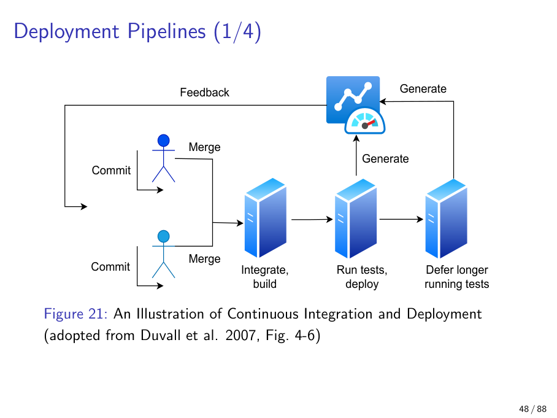
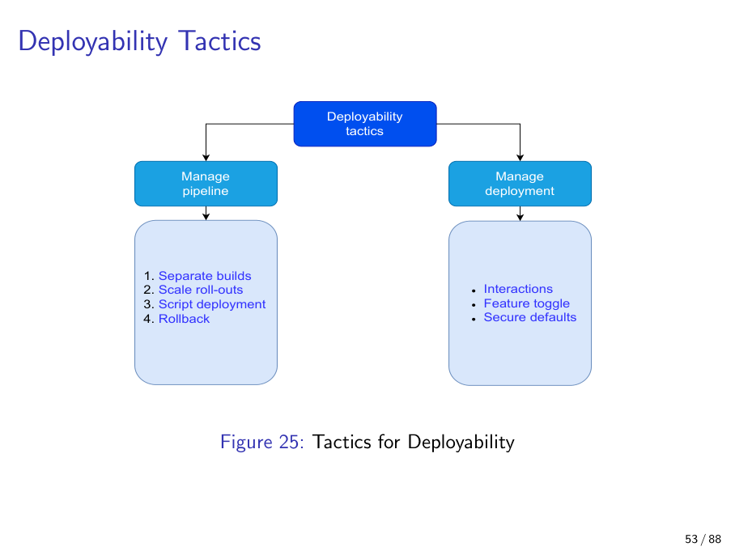
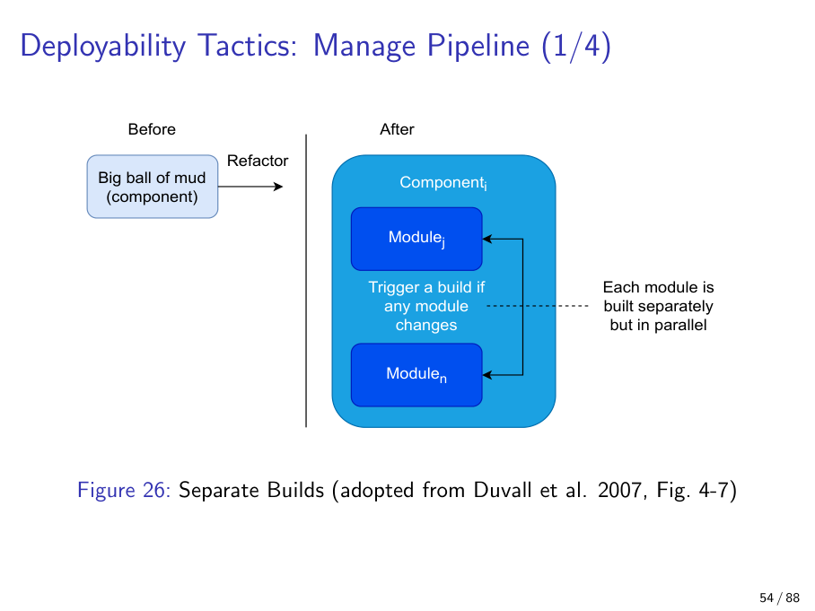
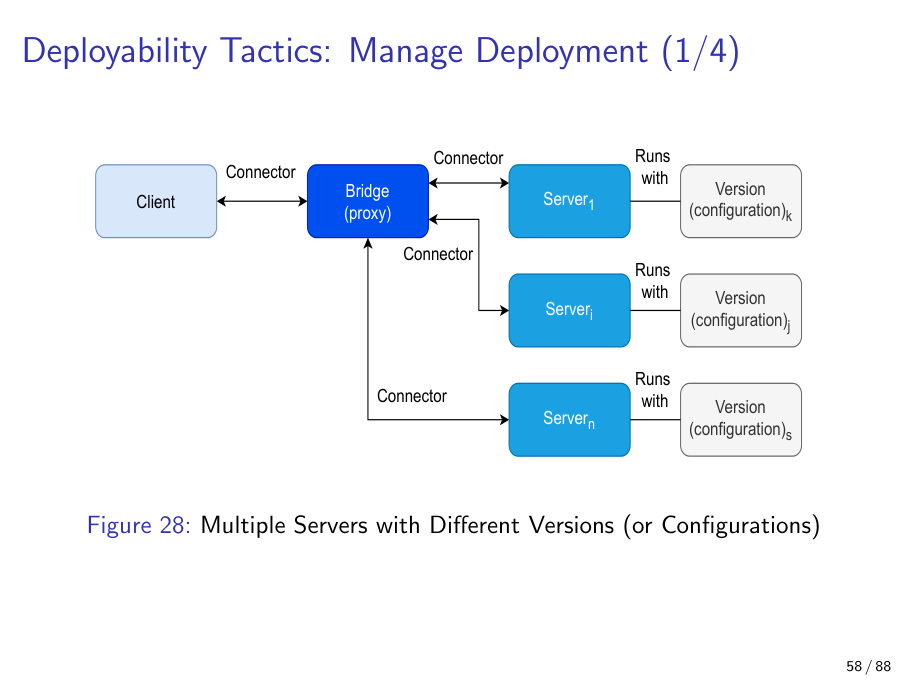
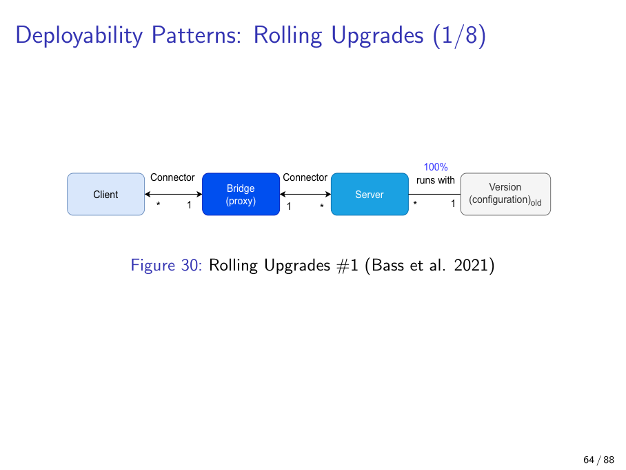
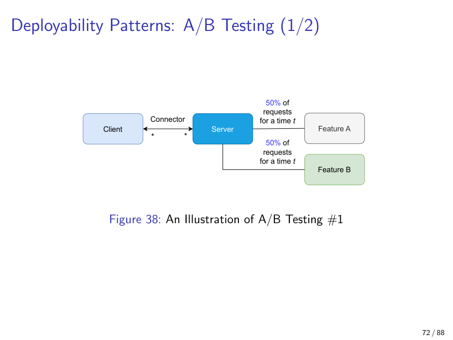
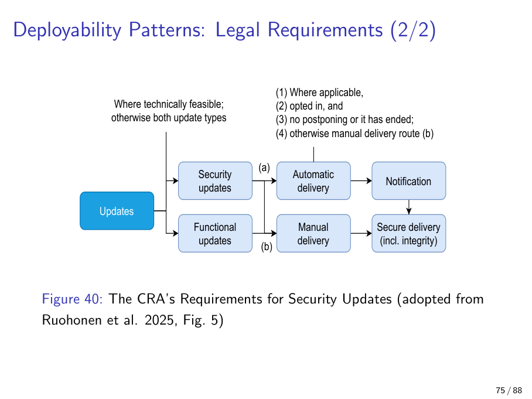
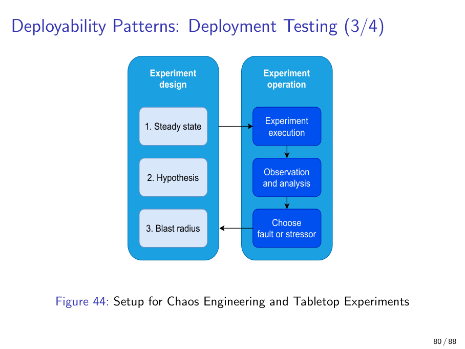

# Chapter 6 — Deployability

> CI / CD / DevOps / GitOps, rolling upgrades, A/B testing, microservices-as-deployment, the EU Cyber Resilience Act, chaos engineering, and Ruohonen's safe-and-secure defaults.

---

## 6.0 Opening: deploying is an architectural concern

For a long time, "release" was treated as something that happened *after* architecture — a checklist for ops, a Friday evening of stress, a paragraph in the README. Modern practice flips that: the *pipeline itself is an architectural artefact*. How quickly a commit can be put in front of a real user, with how much confidence, and how quickly it can be pulled back if it misbehaves, are now first-class quality attributes that constrain the rest of the design just as availability or security do.

Bass et al. (2021) capture this with a deceptively simple definition:

> **Deployability** is the property that a developed system can actually be deployed into production with a *predictable* and *acceptable* amount of time and effort.

Read that twice. The QA is not "we deploy often". Frequency is a *consequence*; the QA is the *predictability* of time and effort. A team that ships every six weeks like clockwork has high deployability; a team that ships ten times on a good day and zero times on a bad week does not. Ruohonen flags in lecture that the word itself is barely in dictionaries — treat it operationally, by its three measurable sub-attributes:

1. **Cycle time** — wall-clock time from a developer commit to that commit being live in production.
2. **Traceability** — can you trace a commit *forward* to the artefacts and environments it landed in, and trace any production incident *backward* to the commit (and config, and image, and dependency tree) that caused it?
3. **Repeatability** — given the same inputs, does the pipeline produce the same outputs? The mere existence of [reproducible-builds.org](https://reproducible-builds.org) is evidence that this is harder than it sounds.

The rest of this chapter is what architects do to control those three numbers. We will work through the practices that operationalise deployability (CI, CD, DevOps, GitOps and the "X-as-code" family), the deployability tactics tree (manage pipeline vs. manage deployment), the patterns that the tactics compose into (microservices, rolling upgrades, A/B testing), the external legal pressure that has recently made deployability mandatory in the EU (the **Cyber Resilience Act**), and finally the validation discipline that closes the loop — chaos engineering, tabletop exercises, and safe-and-secure defaults.

A useful frame as you read: every section either lowers cycle time, raises traceability, or raises repeatability. If it doesn't do any of those, it is not really about deployability.

---

## 6.1 Deployability as a quality attribute

**Definition.** The property that a developed system can be deployed to production with a *predictable* and *acceptable* amount of time and effort (Bass et al. 2021).

**Why it matters.** Traditional release engineering was slow, manual, and unpredictable: a "release engineer" cut a tag, ran scripts, hand-edited configuration, and prayed. The deployability framing turns release into a measurable QA and the pipeline into an architectural artefact in its own right — something to be designed, reviewed, and refactored.

**Explanation.** Bass et al.'s three sub-attributes give the QA its measurable shape:

| Sub-attribute   | Measures                                              | Typical lever                                  |
|-----------------|--------------------------------------------------------|------------------------------------------------|
| Cycle time      | Commit-to-production duration                          | Pipeline parallelisation, smaller batch size   |
| Traceability    | Commit-to-prod and prod-to-commit identification       | Immutable artefacts, signed images, SBOMs      |
| Repeatability   | Same artefact in → same outcome out                    | Reproducible builds, pinned dependencies, IaC  |

Note the interplay. Rollback (a tactic, §6.3) is *only possible* when you have both traceability (which prior version was running?) and repeatability (can you reconstruct it?). Canary deployments (also §6.3) are only safe when you have traceability (which subset got the new build?) and the cycle time to abort cheaply.

**Analogy.** Deployability is the *logistics* discipline of software. The product (code) might be wonderful, but if shipping takes six weeks and one in three packages arrives damaged, the business fails. The factory floor (where the code is written) and the loading dock (where it is deployed) are equally architectural.

**Example.** Two teams ship the same feature. Team A: 12 minutes from merge to canary, automatic rollback if error rate > 1 %, an audit trail from URL back to commit hash. Team B: a person SSHes to a box and copies a JAR. Both "deployed". Only one has deployability.

**Pitfall.** Equating "we deploy frequently" with deployability. Frequency is the *result*; predictability and effort are the QA. A team that ships ten times a day with no rollback path is reckless, not deployable.

> **Recall trio.** *Cycle time, Traceability, Repeatability.* If the exam asks "what are the three sub-attributes of deployability", these three nouns are the answer.

---

## 6.2 CI, CD, DevOps, GitOps, and the X-as-code family

**Definition.** Practices and cultures for continuously building, testing, and deploying a system.

- **Continuous Integration (CI)** — every commit is automatically merged, built, and tested against the trunk. The output is *a known-good integrated build*.
- **Continuous Deployment (CD)** — every known-good build is automatically pushed to production (sometimes via canary or rolling stages). The output is *production reflecting trunk*.
- **DevOps** — the cultural/operational umbrella that says the people who write the software also run it; tears down the dev/ops wall.
- **GitOps** — Git is the *single source of truth* for both application code *and* operational state. The cluster pulls its desired state from a Git repo; merges and reverts in Git are deployments and rollbacks.

**Why it matters.** These are the *mechanism* by which the three sub-attributes are achieved in practice. Cycle time falls because the pipeline is automated; traceability rises because every step is logged and artefact-addressed; repeatability rises because the same scripts run every time.

**Explanation — separated environments.** All of this requires the classic environment ladder:

```
develop  →  integration  →  staging  →  production
```

A commit climbs the ladder, getting more expensive and more realistic tests at each rung. Fast unit tests run in *integration*; long-running end-to-end and load tests run in *staging*; production-like soak tests can run as the final gate. The pipeline diagram below captures the standard shape:



The flow is left-to-right but the *feedback* arrow back to "commit" is the deployability-relevant part: a failed deploy or a failed test must surface fast enough that the developer who broke trunk has not yet context-switched to another task.

**X-as-code.** Once "pipeline-as-code" works (the pipeline itself is a versioned file, not a UI configured by clicks), the move generalises:

- **Infrastructure-as-code** (Terraform, Pulumi) — servers, networks, DNS as declarative files.
- **Configuration-as-code** — feature flags, environment variables, secrets references in Git.
- **Compliance-as-code** (Wei et al. 2025) — controls and audit rules expressed as testable assertions.
- **Security-as-code** — policies (e.g. OPA/Rego, network policies) versioned and reviewed like code.
- **Network-as-code** — switches and routers configured from declarative manifests.

Ruohonen's lecture posed the (rhetorical) question: *"Do you think 'everything as code' might be the future?"* For the purposes of deployability the answer is yes — anything that *isn't* in Git is, by definition, not traceable or repeatable.

**Analogy.** A factory conveyor belt. You don't ship the prototype the engineer just finished on his bench; you ship whatever just rolled off the end of the belt, having passed every QC station automatically.

**Example.** A GitOps cluster watches a manifests repo. A developer opens a PR that bumps an image tag. CI builds the image; once merged, the cluster reconciles to the new tag — no human runs `kubectl apply`. Rollback = `git revert`.

**Pitfall.** Confusing CI with CD. CI ensures *a* working build always exists. CD pushes it to users. You can have CI without CD (and most large enterprises do); you cannot meaningfully have CD without CI.

> **Cross-reference.** This pipeline becomes a security target in Chapter 11 (OWASP CI/CD Top-10, SDL Gate 2) and is reused for ML systems in Chapter 16 (MLOps).

---

## 6.3 Deployability tactics — Manage Pipeline

The tactics tree splits cleanly: tactics that shape the *build/deploy machinery itself* (Manage Pipeline) and tactics that govern the *running system* (Manage Deployment).



Manage Pipeline gives us four tactics.

### 6.3.1 Separate builds

**Definition.** Refactor a "big ball of mud" component into modules built independently, in parallel, so a change in module *M* triggers only *M*'s build, not the whole tree.

**Why it matters.** Build time is the dominant lower bound on cycle time. A 90-minute monolithic build is a 90-minute lower bound; ten 9-minute parallel module builds is a 9-minute lower bound.

**Explanation.** This is the deployability-flavoured restatement of *modularity* (Chapter 4) and *encapsulation*: the same architectural moves that allow independent change also allow independent build. The diagram captures the refactor:



**Pitfall.** "Independent" modules that share a generated artefact (a giant protobuf schema, a shared header) silently re-couple. Check the dependency graph, not the directory tree.

### 6.3.2 Scale roll-outs (canary)

**Definition.** Deploy to a small subset of users first; watch health metrics; expand if green, abort if red.

**Why it matters.** The blast radius of a bad deploy becomes proportional to the canary fraction. A 2 % canary that catches a 5 % error-rate regression touches 0.1 % of users.

**Explanation.** Canary is fundamentally a *staged rolling upgrade with a measurement gate*. Sheehy & Reed (2025) emphasise two architectural pre-conditions:

1. **Pre-defined health metrics** — error rate, p99 latency, saturation, business KPIs — with thresholds set *before* the deploy, not negotiated mid-incident.
2. **Documented verification plan** — what we will check, in what order, and what triggers the abort.

For very large systems, define multiple canary subsets (by geography, account tier, configuration) so a regression that only shows up in one slice is caught before fleet-wide rollout.

**Analogy.** Restaurant chains try a new menu in one region for a month before nation-wide. Same idea: a small, observable subset is the gate to the whole population.

**Pitfall.** Canary without health metrics and an abort criterion is *deploy-and-pray with extra steps* — slow blast radius instead of fast. Always pair canary with §6.3.4.

### 6.3.3 Script deployment

**Definition.** Automate everything possible; manual configuration is a last resort.

**Why it matters.** Manual steps destroy repeatability and obscure traceability. A `README.md` step that says *"now SSH to the box and edit /etc/foo"* is a deployability bug, not a documentation choice.

**Explanation.** This is what makes infrastructure-as-code load-bearing rather than ornamental. The deploy script is the contract between trunk and production; humans cannot improvise on it without breaking the QA.

**Pitfall.** "Glue" scripts that aren't versioned with the application — a `deploy.sh` on a release engineer's laptop is *not* scripted deployment, it is folklore.

### 6.3.4 Rollback

**Definition.** Be able to revert to the previous version (binary + config + schema) on demand.

**Why it matters.** Rollback is what makes risk-taking on deploys acceptable. Without it, every deploy carries the full cost of failure; with it, the cost is bounded by mean-time-to-rollback.

**Explanation.** Rollback is *not free*. It requires:

- **Traceability**: which artefacts and which config were live before this deploy?
- **Repeatability**: can we reconstruct that state byte-for-byte?
- **Compatible data**: §6.5's caveat — if the new version migrated the schema irreversibly, you cannot roll the application back without rolling the data back. Backward-compatible migrations are the architectural workaround (additive changes first, retire the old column in a later release).

The lecture shows ZFS rollback as a *filesystem-level* analogue: ZFS snapshots make it trivial to roll an entire filesystem to a previous state, which is exactly the move we want for application state but rarely have for free.

**Analogy.** A factory's continuous-improvement (kaizen) toolkit: break monoliths into stations, test new methods on one line before going fleet-wide, automate the line, keep a quick "undo" lever.

**Pitfall.** "We can always redeploy the old image" is *not* rollback if the old image cannot read the new database. The data layer is where rollback strategies live or die.

---

## 6.4 Deployability tactics — Manage Deployment

Pipeline tactics shape the *journey*; deployment tactics shape the *destination*. Even with a perfect pipeline, runtime interactions, version mixes, and on/off feature states can wreck a deploy.

### 6.4.1 Multi-version interaction

**Definition.** Clients reach servers through a proxy/bridge, and different server instances may run different versions or configurations simultaneously.

**Why it matters.** This is the architectural *substrate* for both rolling upgrades and A/B testing. Without it, those patterns are not even expressible.

**Explanation.** The proxy gives you a routing seam: same client, different server pool, decided per-request. Once you have that seam you can route by version, by user cohort, by region — whatever the deploy or experiment demands.



**Pitfall.** Putting the proxy *inside* the application (clients call services directly) — now you cannot change the routing without redeploying everyone.

### 6.4.2 Feature toggle

**Definition.** A runtime switch that enables or disables a feature without redeploying. A *kill-switch* is the special case where the only direction is "off".

**Why it matters.** Decouples *deployment* (the code is shipped) from *release* (users see it). Lets you ship dark code, ramp it slowly, and shut it off without a redeploy if it misbehaves.

**Explanation.** A feature toggle is, architecturally, a small piece of *configuration-as-code* — versioned, reviewable, auditable. Pairs naturally with the canary tactic (§6.3.2): a feature behind a toggle can be turned on for 1 % of users without any deploy at all.

**Analogy.** A theatre rigged so each light, sound cue, and prop can be turned on or off live without rebuilding the set.

**Pitfall.** The *toggle graveyard*. Shipping features behind toggles and never deleting the dead branches creates a complexity tax that compounds. Every toggle has a sunset date or it metastasises.

### 6.4.3 Secure defaults

**Definition.** Out of the box, functional/optional features are OFF and security/protective features are ON.

**Why it matters.** Most users never change defaults. **Defaults *are* the policy.** Ruohonen 2025 treats this as a (rare) trade-off-free heuristic for the *default* state — you still ship the toggle, you just choose its starting position carefully.

**Explanation.** Combines with §6.4.2: every feature has a toggle, but the toggle's default is conservative. Functional features default-off means nothing dangerous is enabled by accident; security features default-on means MFA, TLS, rate-limiting, audit-logging are guarding the user before they know they need to think about it.

**Analogy.** A new car ships with seatbelts engaged and the panic alarm armed; the heated steering wheel is off. The user can change all three — but the defaults protect them.

**Example.** A database server that defaults to no remote root login, requires a password on first start, and enables audit logging — and ships its experimental query optimiser disabled.

**Pitfall.** Inverting the heuristic to make demos look good — features ON, security OFF — and then forgetting to flip them for shipping. Every "secure by default" failure in the last decade has some version of this story.

> **Ruohonen 2025.** This heuristic — "functional off, security on" — is published material from the lecturer's own research and is therefore *very likely* to appear on the exam. Memorise the slogan.

---

## 6.5 Pattern — Microservices as a deployment pattern

**Definition.** An architectural style where the system is decomposed into many small, independently deployable services communicating over the network.

**Why it matters.** In this chapter microservices are treated *primarily as a deployment pattern* — the style optimises for distributed development and deployability, not for run-time efficiency or simplicity. Other lectures will revisit it as a structural style; here we evaluate it against the three sub-attributes.

**Explanation — benefits.**

1. **Distributed development and deployment.** Teams pick their own languages and runtimes, deploy on their own cadence; integration errors fall because the contract is the network interface, not a shared binary.
2. **Elastic scaling.** Instances added dynamically to match demand — only the bottleneck service has to scale.

**Drawbacks (the lecture's five).**

| # | Drawback                              | What it costs                                                                |
|---|---------------------------------------|------------------------------------------------------------------------------|
| 1 | Connector overhead                    | A network hop is orders of magnitude slower than an in-memory call.          |
| 2 | Transaction synchronisation           | Distributed transactions are *hard*; sagas (Chapter 7) become the workaround.|
| 3 | Heterogeneity                         | Many languages/runtimes raises whole-system complexity and on-call load.     |
| 4 | Granularity decisions                 | Splitting services right is an open design problem — too fine = chatty, too coarse = monolith with extra steps. |
| 5 | SBOM / service-catalog overhead       | You now need a *catalog* of services and a Software Bill of Materials per service — both governance and tooling cost. |

**Analogy.** A food court vs. a single full-service restaurant. The food court swaps vendors easily, scales popular stalls independently, and lets each kitchen pick its tools — but ordering one meal across several stalls is awkward, and managing the vendor contracts (SBOMs) becomes a job in itself.

**Pitfall.** Adopting microservices for the deployability benefit without paying the complexity cost. Common at small organisations where the team-size argument for microservices simply does not apply — the result is a distributed monolith with all of the drawbacks and none of the benefits.

> **Cross-reference.** The transaction drawback (#2) is where the **saga pattern** in Chapter 7 (Availability) earns its keep. The SBOM drawback (#5) gets even sharper in §6.7 — the CRA imposes SBOM-tracking requirements as a legal matter.

---

## 6.6 Patterns — Rolling upgrades and A/B testing

These two patterns share the same machinery (multi-version interaction + proxy routing); they differ in *intent*. Rolling upgrade is *roll-out flavoured*; A/B testing is *measurement flavoured*.

### 6.6.1 Rolling upgrades

**Definition.** Upgrading a fleet of server instances incrementally — replace some, watch, replace more — so the system stays available throughout.

**Why it matters.** Couples deployability with availability: no maintenance window, no big-bang cutover.

**Two flavours.**

1. **In-place rolling upgrade (instance replacement).** At each step a percentage of *server instances* is moved to the new version. The proxy routes uniformly across whatever pool exists. Steps:
   - Step 1: 100 % of instances old.
   - Step 2: 50 % of instances new.
   - Step 3: 100 % of instances new.
   - Step 4: old instances removed.
2. **Traffic-split rolling upgrade.** Both versions run side by side; the *proxy* sends a percentage of *traffic* to the new version (10 % → 50 % → 90 % → 100 %); old instances are drained later. This is the more flexible variant — it decouples instance count from traffic share, allowing very small canaries (1 %) without provisioning a fleet just to host them. Blue-green and modern canary deployments inherit from this flavour.



**Analogy.** Replacing the wheels on a moving lorry one at a time vs. driving alongside the new lorry until everyone has migrated. Same destination, different mechanic-vs-traffic-controller character.

**Example.** A Kubernetes Deployment with `strategy: RollingUpdate, maxSurge: 25%, maxUnavailable: 0` is *in-place rolling upgrade #1*. A service mesh (Istio, Linkerd) shifting `weight: 90 / 10` between two Deployments is *traffic-split #2*.

**Pitfall — the data layer.** During a rolling upgrade, old and new versions read and write the *same* database. If the new version changes the schema in a way the old version cannot read, the proxy is now routing some users into a broken read. The architectural answer is *expand-and-contract*: add the new column first (compatible with both versions), migrate readers, migrate writers, then remove the old column in a *later* release. Skipping this is the most common rolling-upgrade outage.

### 6.6.2 A/B testing

**Definition.** Routing different subsets of traffic to two feature variants for a fixed time, then deciding which to keep using statistical tests.

**Why it matters.** Couples deployment with *experimentation* — the production system becomes an evidence-producing instrument, not just a service.

**Explanation.** The mechanics:

- **Phase 1.** Route 50 % of users to Feature A, 50 % to Feature B for a pre-declared duration *t*.
- **Phase 2.** Run a statistical test (t-test, chi-square — pick the right one for the metric) on the metric you care about (conversion, latency, error rate, revenue per user). Promote the winner to 100 %.



The substrate is *identical* to a 50/50 traffic-split rolling upgrade. The only differences are:

- **Intent** — roll-out vs. measurement.
- **Endpoint** — "ship the new one" vs. "ship whichever wins".
- **Duration discipline** — A/B requires the test to run for the *pre-declared* duration before a decision.

**Analogy.** Two recipes served in alternating sittings, then the kitchen keeps whichever got more clean plates — but only after a full week of sittings, not after lunch on day one.

**Pitfall — peeking.** Stopping the test as soon as A looks better destroys statistical validity. Pre-declare *t* (or a sequential-test design that controls for early peeks); resist the urge to call it early.

> **Recall question shape.** "Rolling upgrade and A/B testing use the same machinery — what makes them different?" Answer: *intent and termination condition* — roll-out-to-100 % vs. measure-then-keep-winner.

---

## 6.7 The EU Cyber Resilience Act — deployability becomes law

**Definition.** EU regulation, enforceable from 2027, mandating that security updates be delivered throughout a product's life cycle, *automatically by default* where technically feasible and opted into, and *separated* from functional updates.

**Why it matters.** External *legal* pressure now drives deployability architecture. A system that cannot deliver security updates separately, automatically, and over a secure channel is illegal to sell into the EU. Deployability has crossed from "nice QA" to "market-access requirement".

**Explanation — the decision flow.** Ruohonen et al. 2025 reconstruct the act's update logic as a decision tree (the lecture's Fig. 5). This is one of the few raster diagrams in Lecture 4 and is a *very likely* exam image — study it carefully:



Walking the tree:

1. **Classify the update.** Is it a *security* update or a *functional* update? The architecture must keep these two streams distinguishable.
2. **Security update branch.** Default route is **automatic delivery**, but it is taken only when:
   - the automatic mechanism is *applicable* (the device supports it), AND
   - the user has *opted in* (or has not opted out where opt-out is allowed), AND
   - any user-requested *postponing window* has ended.
   If any of those gates fails, fall back to **manual delivery**. Both routes still pass through a **secure delivery** (integrity) gate — signed packages, verified before install.
3. **Functional update branch.** Default route is **manual** — users decide when to take new features.
4. **Separation requirement.** The two streams must be separable where technically feasible. A monolithic "update everything" bundle that mixes a CVE patch with a UI redesign is *not* CRA-compliant.

**Analogy.** Like food labelling. The regulator does not dictate what you cook — it dictates how you package and ship it, and what defaults you must provide. "I forgot" is no longer a defence.

**Example.** Operating system updates today often bundle features and security fixes; the CRA pushes vendors toward separate "security-only" channels that can be opted into independently, with automatic install by default. Think macOS's split between system security responses and full OS upgrades, or Windows' security-only vs. monthly rollup packages — the CRA codifies that pattern as a legal floor.

**Pitfall.** Treating the CRA as a documentation issue. It is *an architecture issue*: separate update channels, automatic-delivery infrastructure, signed integrity checks, opt-in/postpone tracking, and SBOMs are all design constraints that must be present *before* you ship.

> **Quotable.** The slogan to remember: **"automatic, separated, secure-delivered security updates by 2027."** That phrase compresses the entire requirement and is exactly the kind of thing the lecturer will reward on the exam.

> **Cross-reference.** The SBOM drawback of microservices (§6.5) is sharpened here — the CRA effectively requires per-product SBOMs across the entire supply chain. Security-side details continue in Chapter 11.

---

## 6.8 Release engineering and semantic versioning (recap)

**Definition.** The discipline of structuring releases over time: parallel release lines (LTS, short-support, current) and explicit version numbers conveying compatibility.

**Why it matters.** CD does not mean "one moving target". Most real systems support multiple parallel release lines with different cadences and lifespans — and the version number is the contract that lets downstreams reason about upgrade risk.

**Explanation.** The mental model:

- **Major release** (e.g. 1 → 2) — every ~5 years; allowed to break compatibility.
- **Minor release** (1.x) — every ~6 months; backward-compatible additions.
- **Patch release** (1.x.y) — "whenever necessary"; bug or security fix only, no behaviour change.

Each version has a release date and an end-of-life date. **LTS** (Long-Term Support) versions get security patches for years but typically *no new features* — that energy goes into the current line.

**Pitfall.** Believing CD makes versioning obsolete. It doesn't. CD makes patch versions *trivial to produce*, not *unnecessary*. Downstreams still need a stable contract.

> **Cross-reference.** **Semantic versioning is canonically documented in Chapter 4** (Modifiability), where the semver figure lives. This chapter only references it; turn back to Ch 4 for the full breakdown of MAJOR.MINOR.PATCH semantics and the breaking-change contract.

---

## 6.9 Chaos engineering and tabletop exercises

**Definition.** Deliberately injecting faults or stressors into a production-like system (*chaos engineering*), or walking through disaster scenarios on paper (*tabletop*), to test deployability and resilience.

**Why it matters.** Closes the loop on deployability. "We can deploy" must also mean "we can survive things going wrong during or after deployment". Untested rollback is not really rollback; untested failover is not really failover.

**Explanation — the experiment design loop.** The lecture's diagram (Fig. 44) captures the discipline:



**The three "experiment design" inputs** — and this is a recall trio that is very likely on the exam:

1. **Steady state.** Define what *normal* looks like, measurably. (E.g. "p99 latency < 300ms, error rate < 0.1 %, throughput within ±5 % of baseline.")
2. **Hypothesis.** State, before injecting the fault, what you *expect* to happen and what would falsify the system's resilience claim. (E.g. "If we kill one Redis replica, steady-state should hold within 30s.")
3. **Blast radius.** Cap the damage *up front*. What fraction of users / instances / regions is in scope, and what triggers an emergency stop? Chaos without a blast-radius cap is just an outage.

After the design phase: **choose a fault or stressor** (instance kill, network partition, latency injection, disk fill, clock skew, DNS failure), **execute**, **observe**, **analyse**. Anything that violates the hypothesis is a finding; anything that violates steady state with a *smaller-than-expected* fault is a bigger finding.

**Tabletop exercises** are the paper-based analogue: gather the team, present a scenario ("the primary database is unreachable for 30 minutes during a deploy"), walk through the response step by step. Cheap, fast, no production risk; finds organisational gaps that chaos engineering's technical scope misses (who pages whom? who has the credentials? who can authorise a public statement?).

**Analogy.** Fire drills for software. You do not wait for a real fire to discover that the alarm is broken — and you also do not light the building on fire to test the drill. Bound the experiment.

**Example.** Netflix's *Chaos Monkey* terminates random instances during business hours, on purpose. The principles and tooling are publicly documented at [principlesofchaos.org](https://principlesofchaos.org) and [chaostoolkit.org](https://chaostoolkit.org). The USENIX ;login: literature treats tabletop exercises in detail.

**Pitfall.** Running chaos exercises with no blast-radius cap — turning a drill into the disaster you meant to drill against. The blast-radius input is *non-negotiable*.

> **Recall trio.** *Steady state, hypothesis, blast radius* — the three design inputs to any chaos experiment.

---

## 6.10 Safe and secure defaults (Ruohonen 2025)

**Definition.** The design heuristic that, out of the box, functional/optional features are OFF and security/protective features are ON.

**Why it matters.** Most users never change defaults. The default state of the system *is* the policy the typical user runs under. Choosing those defaults is therefore a design responsibility, not a packaging detail.

**Explanation.** Drawn from Ruohonen 2025, this heuristic pairs naturally with feature toggles (§6.4.2): the toggle exists, the user can still change it, but the default is the conservative one. Unlike most architecture trade-offs, this one is essentially *free* — better defaults cost no flexibility because every feature is still toggleable. (This is part of why Ruohonen emphasises the heuristic: most QA trade-offs are real trade-offs; this one mostly isn't.)

**Concretely:**

- **Functional features default OFF.** Experimental query planner, telemetry uploads, third-party integrations, remote-debug endpoints.
- **Security features default ON.** TLS, password complexity, MFA prompts, rate limits, audit logging, signature verification.

**Analogy.** A new car comes with seatbelts engaged, the panic alarm armed, and child-locks on the rear doors; the heated steering wheel is off. The user can change all of those — but the *defaults* protect them.

**Example.** Compare two databases that ship with the same featureset. DB-A defaults: remote root login disabled, TLS required, audit log on, experimental optimiser off. DB-B defaults: remote root open, TLS optional, audit log off, experimental optimiser on. Both can be configured to be either. The one that ships with DB-A's defaults will have a measurably better breach record across its user base, *because* most users never change defaults.

**Pitfall — the demo trap.** Inverting the heuristic to make first-run demos look impressive (everything on, security off) and then forgetting to flip them for shipping. The CRA (§6.7) effectively criminalises this pattern in the EU from 2027.

> **Exam quotable.** *"Functional features off by default, security features on by default."* Ruohonen 2025. Memorise the slogan; cite the author.

---

## 6.11 Chapter takeaways

1. **Deployability ≠ "deploys often."** The QA is *predictability and effort* of deployment, measured by **cycle time, traceability, repeatability**. Frequency is the consequence, not the metric.
2. **CI/CD/DevOps/GitOps** are the operational mechanism of deployability. They require *separated environments* (dev → integration → staging → production) and benefit from the **X-as-code** family (pipeline, infrastructure, configuration, compliance, security, network — all in Git).
3. **The tactics tree splits two ways.** *Manage Pipeline*: separate builds, scale roll-outs (canary), script deployment, rollback. *Manage Deployment*: multi-version interaction, feature toggle, secure defaults.
4. **Rolling upgrades come in two flavours.** *Instance replacement* (change the pool) and *traffic split* (change the proxy weights). The traffic-split flavour is the substrate for blue-green, canary, and A/B testing.
5. **A/B testing = rolling upgrade with measurement intent.** Same machinery, different termination condition — and statistical discipline (no peeking) is non-negotiable.
6. **Microservices are a deployment pattern with five drawbacks** — connector overhead, transaction synchronisation, heterogeneity, granularity, SBOM/catalog overhead. Adopt them for the deployability benefit only when the organisation is big enough to pay the complexity tax.
7. **The CRA (2027)** turns deployability into a market-access requirement: **automatic, separated, secure-delivered security updates**. The decision-tree figure (§6.7) is exam-image candidate #1 for this chapter.
8. **Chaos engineering** has three experiment-design inputs to memorise: **steady state, hypothesis, blast radius**. Tabletop exercises are the paper-based, organisational dry-run analogue.
9. **Safe and secure defaults (Ruohonen 2025)**: *functional features off by default, security features on by default*. A rare trade-off-free heuristic; quote it on the exam.
10. **Semantic versioning lives in Chapter 4.** CD makes patch versions trivial, not unnecessary — the version number is still the contract with downstreams.

---

## 6.12 Cross-references

- **Chapter 4 (Modifiability)** — canonical home of semantic versioning; "separate builds" tactic restates modularity/encapsulation in deployability flavour.
- **Chapter 5 (Testability)** — the CI pipeline's "run tests" stage is where the testability tactics tree pays off in deployability terms (fast feedback = lower cycle time).
- **Chapter 7 (Availability)** — reuses the multi-version / proxy substrate for *shadow deployments* and the canary → shadow morph; sagas (Ch 7) solve the transaction-sync drawback of microservices (§6.5).
- **Chapter 11 (Security part 2)** — re-examines CI/CD as a security target (OWASP CI/CD Top-10, SDL Gate 2) and revisits the CRA on the security side.
- **Chapter 16 (MLOps case)** — the full deployability story for ML systems: drift detection as canary health metric, model rollback, shadow deployments.
