# Chapter 7: Availability

Availability is the quality attribute that asks the most disarmingly simple question in software architecture: *is the system there when it is needed?* The trick is that the answer is never a clean yes or no. It lives in the gaps between security ("available to *authorized* parties"), reliability ("available *despite* faults"), and maintainability ("available *outside* scheduled downtime"). Lecture 5 builds availability the same way it built every prior quality attribute — a definition, a six-slot scenario, a tactics tree, a pattern catalogue — but lands on a four-branched tree (Detect, Repair, Reintroduce, Prevent) instead of three, and closes with Williams's 2026 provocation that all this resilience machinery has itself become technical debt. This chapter walks every branch, draws the canonical circuit breaker and saga diagrams, populates the "nines" budget with concrete domain examples, and ends with that critique so you remember the limits of the toolbox you just learned.

### Availability (the definition)

**Definition.** The ability of a system to be available to serve, use, deliver, or otherwise function whenever it is needed (Bass et al.). Equivalently, "the ability of a system to prevent, mask, and repair faults so that they do not become failures."

**Why it matters.** Even brief outages of high-traffic services have severe revenue, safety, and trust consequences. The lecture's running cases — CrowdStrike (July 2024) and Cloudflare (December 2025) — are reminders that single bad updates can take the global internet partially offline for hours.

Availability sits at the intersection of three other quality attributes. From the **security** side, the CIA triad's "A" requires that the system be available to *authorized* parties only — every additional authentication check costs availability. From the **reliability** side, availability becomes the system's ability to keep functioning despite faults. From the **maintainability** side, every minute of scheduled downtime for upgrades is a minute the system is unavailable.

**Analogy.** A 24/7 supermarket. Security wants ID checks at the door (slows entry). Reliability wants the freezers to keep running through power dips (needs backup generators). Maintenance wants the floor waxed (closes a lane). All three reduce the hours customers can shop. That overlap is what availability is.

**Example.** A "five nines" system can be down only 5 min 15 s per year. A 90% system can be down 3 days 15.6 hours per year.

**Pitfall.** Availability is *not* uptime alone. A system that is "up" but returning wrong answers, or refusing authorized users, is not available. The definition is anchored in *functioning whenever needed*.

### Fault vs Failure vs Trigger

**Definition.** A **failure** is a deviation of the system from its specification. A **fault** is the internal or external *cause* that could become a failure. A **trigger** is the event that activates a latent fault.

**Why it matters.** Almost every availability tactic targets one specific link in this chain — prevent the fault, stop the trigger, mask the failure, or repair fast. Mixing the terms up is the single most common exam mistake.

Faults can sit dormant for years (a null-pointer code path that is never executed) until a trigger fires (a particular input arrives). Fault-tolerant design tries to maximise the *route* fault → trigger → repair → recovery and minimise the *route* fault → trigger → failure (or, if failure does happen, minimise the time-to-repair).

**Analogy.** A fault is a crack in a dam. The trigger is a flood. Failure is the dam breaking. Repair is the patch and the re-fill. The whole game is keeping cracks small and re-filling fast.

**Example.** Lecture's flow diagram: two parallel arrows leave the "fault + trigger" node. Route (a) goes to repair; route (b) goes to failure.

**Pitfall.** Beginners equate "bug" with "failure". A bug is a fault. It only becomes a failure if a user-visible specification is violated.

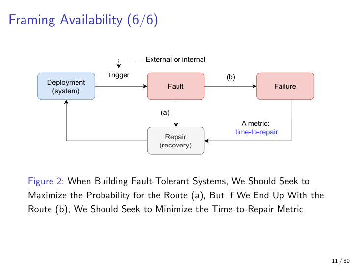

### The Nines of Availability

**Definition.** Availability targets expressed as a percentage of total time the system must function, conventionally written with nines: 90%, 99%, 99.9% ("three nines"), 99.99% ("four nines"), 99.999% ("five nines"), 99.9999% ("six nines").

**Why it matters.** Each extra nine is roughly a 10× cost increase in redundancy and engineering effort, so it is the cleanest way to quantify availability requirements in QA scenarios. The right answer to "how many nines?" is almost always *fewer than the customer initially asks for*.

The de-facto telecom and high-availability cloud standard is five nines (5 minutes downtime per year). Six nines (32 seconds per year) essentially demands geographically distributed active-active redundancy and is reserved for a handful of safety-critical systems. Four nines (52 minutes per year) is the sweet spot for most serious web applications.

| Target | Downtime per year | Downtime per day | Realistic domain |
|---|---|---|---|
| 90% | ~36.5 days | ~2.4 hours | Hobby blog, personal project, prototype |
| 99% | ~3 days 15 h | ~14.4 minutes | Small e-commerce, internal corporate tool |
| 99.9% (three) | ~8 h 46 min | ~1.4 minutes | SaaS dashboards, mid-tier APIs |
| 99.99% (four) | ~52 minutes | ~8.6 seconds | Online banking, large retail checkout |
| 99.999% (five) | ~5 min 15 s | ~0.86 seconds | Telecoms, stock exchanges, AWS S3 SLAs |
| 99.9999% (six) | ~31.5 seconds | ~8.6 ms | Air-traffic control, defence radar, pacemakers |

**Analogy.** A bathroom-stall lock that fails once a year at 99.999% feels safe. A heart pacemaker with the same SLA is terrifying. The number is meaningless without the domain.

**Example.** A telecoms switch contractually guaranteeing five nines must architect for geographically redundant active-active hardware. A weekend side-project blog at 99% is fine running on a single VPS.

**Pitfall.** Nines must always be defined against (a) a *measurement window* (per year vs. per quarter vs. per 90 days) and (b) a *what counts as "up"* definition (full feature set vs. degraded mode counts as up?).

### Availability QA Scenario (6 slots)

**Definition.** A structured template for stating an availability requirement so it is measurable and testable: **Source → Event → Environment → System (deployment) → Response → Response Measure**.

**Why it matters.** Forces stakeholders to convert vague "the system must be reliable" into auditable acceptance criteria with concrete time bounds.

The same template family used in Chapters 3-5 (modifiability, integrability, testability, deployability) is populated here with availability-flavoured values: **Source** = external/internal, people/hardware/software/physical; **Event** = fault, crash, omission, incorrect timing, incorrect response; **Environment** = normal/startup/repair/degraded/overloaded; **System** = entire/machines/components/connectors/modules/classes; **Response** = log/notify/recover/disable/postpone/degrade/fix; **Response Measure** = uptime %, time-to-detect, time-to-repair, time in degraded mode, proportion of faults prevented.

**Analogy.** A medical incident report. Instead of "patient got worse", the form requires *who*, *what symptom*, *under what conditions*, *which organ*, *what the response was*, and *how it was measured*.

**Example.** "When (source) an external user request triggers (event) a database connection timeout in (environment) overloaded operation, (system) the order-service component must (response) retry with exponential back-off and degrade by serving cached results, with (response measure) time-to-recover < 5 s in 99.9% of cases."

**Pitfall.** Do not conflate Source with Event. The Source is the *origin* of the stimulus (a person, a sensor, the OS). The Event is the *nature* of the disturbance (a crash, a timing violation).

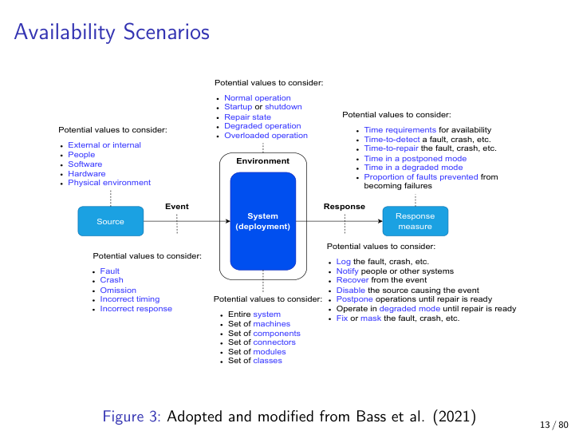

### The Four-Branch Tactics Tree

**Definition.** A taxonomy of design moves that improve availability, organised into four branches: **Detect faults**, **Recover by Repair**, **Recover by Reintroduce**, **Prevent faults**.

**Why it matters.** Acts as the master menu for the rest of the lecture and the cognitive scaffold for exam questions. "Name three Detect tactics", "which tactic is a circuit breaker?", and "draw the tactics tree" are all plausible exam prompts.

The shape echoes the integrability, modifiability, testability, and deployability tactics trees from earlier chapters — Ruohonen is consistent. **Detect** = sense that something is wrong. **Repair** = put the system back into a working state with the existing (possibly degraded) components. **Reintroduce** = bring a repaired component back into service safely. **Prevent** = stop faults from happening in the first place.

**Analogy.** A hospital ER workflow. Detect = triage and vital-sign monitors. Repair = treat the patient. Reintroduce = post-op recovery ward and discharge. Prevent = public-health campaigns and vaccination drives.

**Example.** "Heartbeat" is Detect; "exponential back-off retry" is Repair; "shadow phase before promotion" is Reintroduce; "isolation by failure domain" is Prevent.

**Pitfall — exam-critical.** Recover has *two* sub-branches in this tactics tree (Repair and Reintroduce), unlike the simpler trees in earlier chapters. **Students drop the Reintroduce branch consistently.** If you can name only three branches on the exam, you have already lost points. Memorise the four-letter mnemonic **D-R-R-P**: Detect, Repair, Reintroduce, Prevent.

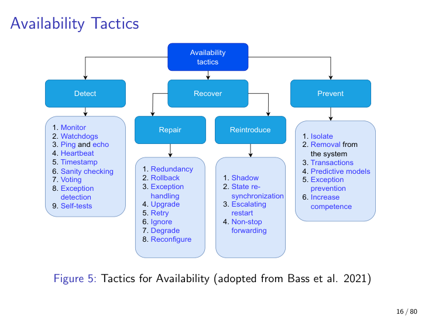

### Watchdog and Heartbeat (Detect)

**Definition.** A **watchdog** is a separate component, often a hardware timer, that resets the monitored component if a periodic "I'm alive" signal is not received within a threshold. A **heartbeat** is the same idea inverted: the monitored component proactively pings the monitor on a schedule.

**Why it matters.** Cheapest way to detect a fully hung component that is no longer responding even to itself. Almost every production system has one of these somewhere.

Watchdog timers were originally hardware in embedded systems — a counter on the motherboard that the OS must reset before it overflows, otherwise it triggers a hard reboot. Heartbeats generalise the idea to distributed systems: every N seconds, "I'm still here" — silence implies death. Both are paired with a *threshold* (how many missed beats = dead?) which trades responsiveness against false positives during garbage-collection pauses or network blips.

**Analogy.** A diver's surface line. The boat captain expects a tug every 2 minutes. Three missed tugs means pull up.

**Example.** Linux kernel `/dev/watchdog`; Kubernetes liveness probes; Kafka consumer-group heartbeats.

**Pitfall.** Set the threshold too tight and a stop-the-world GC pause reboots a healthy node. Too loose and a real crash goes undetected for minutes. There is no universally right number — it is per-system tuning.

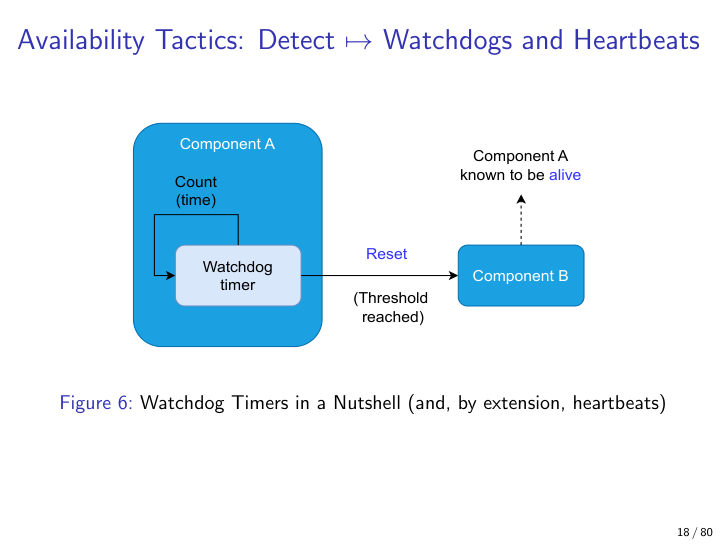

### Timestamps vs Sequence Numbers (Detect)

**Definition.** Both attach monotonically increasing markers to events so that out-of-order or missing events can be detected. Sequence numbers are integers (1, 2, 3...); timestamps are wall-clock or monotonic-clock readings.

**Why it matters.** In distributed systems, clocks drift, jump backwards on NTP correction, and disagree across machines, so sequence numbers are usually safer for ordering.

The lecture's framing question is "why might sequence numbers be preferred over timestamps?" The answers: monotonic by construction, no clock-skew problem, smaller (integers vs nanosecond timestamps), and easy to detect gaps (n+1 should always follow n). Timestamps have the advantage of being meaningful for *latency* analysis — you can compute "this event took 47 ms" only from timestamps.

**Analogy.** Numbered tickets at the deli (sequence numbers) versus writing the time the customer arrived (timestamps). Tickets never tie or run backwards; clocks can.

**Example.** TCP sequence numbers; Kafka offsets; Lamport clocks.

**Pitfall.** Sequence numbers wrap (32-bit will eventually overflow). Long-running flows need *sequence number + epoch*, or 64-bit counters.

### Sanity Checking and CRC (Detect)

**Definition.** Verification of operations, states, inputs, and outputs at runtime against expected properties. **Cyclic Redundancy Check** (CRC) is the classical error-detection code that appends a checksum to a payload so that corruptions in transit can be detected.

**Why it matters.** Catches a huge class of detectable faults — bit flips, malformed packets, off-by-one offsets — before they propagate into failures.

A firewall receiving an ICMP echo verifies the packet type (8 bits), checksum (16 bits), identifier (16 bits), sequence number (16 bits), and payload. Mismatches → drop the packet and log. CRC "appends a check value without adding new information"; if recomputation at the receiver does not match, the receiver knows the data is corrupted, but typically *not by whom*.

**Crucially: CRC is for integrity, not security.** It is trivially forgeable. Do not use it as a hash for authentication. The lecture flags this explicitly because students reach for CRC when they should reach for SHA-256 or HMAC.

**Analogy.** The last digit of an ISBN — designed to catch single-digit typos and most adjacent-digit swaps. Useless against deliberate fraud.

**Example.** Ethernet frame CRC; ZIP-file CRC-32; ICMP checksums.

**Pitfall.** Confusing detection (CRC) with cryptographic integrity (HMAC, signatures). They look similar; they protect against radically different threats.

### Voting: Replication, Functional, Analytical Redundancy (Detect)

**Definition.** Comparing outputs from multiple components that should produce the same answer and choosing the right output by some rule (majority, unanimity, weighted).

**Why it matters.** Lets a system survive *any* single component fault — and, with diversity, also design or implementation faults that would defeat plain replication.

Three flavours of escalating diversity:

- **Replication.** Identical copies of the same component. Survives independent hardware failures, but every copy has the same bugs.
- **Functional redundancy.** Components do the same job by the same broad approach but written differently — different teams, different languages, different libraries. Resists common-mode software bugs.
- **Analytical redundancy.** Components compute the same quantity by *entirely different methods*. For example, altitude derived from GPS *and* a radar altimeter *and* an inertial-navigation system, cross-checked.

**Boeing 737 MAX MCAS — exam-quotable anti-pattern.** The lecture explicitly cites the Boeing 737 MAX MCAS disaster as the failure of analytical redundancy. MCAS was driven from a *single* angle-of-attack sensor, with no analytical cross-check against pitch, airspeed, or alternate AoA vanes. When that one sensor faulted, MCAS pitched the nose down into the ground. Two crashes, 346 deaths. A trivial analytical-redundancy design would have saved the planes. **Memorise this for the exam.**

**Analogy.** A jury. A single judge can be biased (replication of one). Three judges from the same law school may share blind spots (replication of N). Three judges from law, medicine, and engineering analysing the same case in their own framework (analytical) catches errors none would catch alone.

**Example.** Triple-modular redundancy in avionics; Raft/Paxos quorum reads in Etcd/Consul; cross-checking sensor data.

**Pitfall.** Replication does **not** protect against design or implementation errors. Three identical copies all have the identical bug. Diversity is the only fix.

### Majority Gate

**Definition.** A logic gate that outputs 1 if and only if at least 2 of its 3 inputs are 1 — the canonical triple-modular-redundancy voter.

**Why it matters.** Mechanical, exam-ready way to reason about how voting tolerates one faulty component.

Truth table: rows (0,0,0), (1,0,0), (0,1,0), (0,0,1) output 0; rows (1,1,0), (1,0,1), (0,1,1), (1,1,1) output 1. Survives any one input being wrong.

**Analogy.** Best 2-out-of-3 in a tie-breaker game.

**Example.** Avionics flight computers running three independent boards through a majority gate.

**Pitfall.** Tolerates *exactly one* failure. If two voters disagree with reality, the gate confidently outputs the wrong answer with the same certainty as before.

### Active-Active vs Active-Passive Load Balancing (Repair)

**Definition.** **Active-active** spreads load across two or more live components — each carries a share, e.g. 50/50. **Active-passive** ("standby") routes 100% of traffic to one and keeps the other(s) warm but idle until takeover.

**Why it matters.** Trades cost and complexity for failover speed and steady-state capacity.

Active-active doubles capacity at steady state but requires every replica to handle full load if its sibling dies — so you must over-provision by 50% to survive one loss. Active-passive wastes the standby's compute during normal operation, but the failover semantics are simpler — there is no live state divergence to merge because only one node was ever writing.

**Analogy.** A two-engine plane in active-active uses both engines all the time and can fly on one with reduced performance. An aircraft with one main engine and an APU in active-passive keeps the APU spun down until needed.

**Example.** Two PostgreSQL primaries with logical replication (active-active, hard). One primary plus one warm standby with streaming replication (active-passive, common).

**Pitfall.** Active-active is only safe when writes are commutative or the system tolerates eventual consistency. Otherwise the divergence is worse than the failover delay you saved.

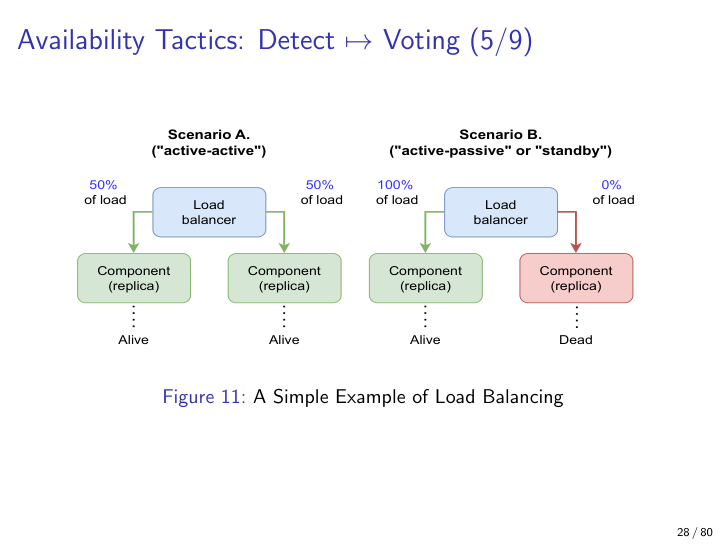

### Consistency vs Availability Trade-off (Repair)

**Definition.** Four consistency models on a single trade-off axis:

- **Eventual** — replicas converge eventually if no new writes arrive.
- **Quorum** — a write succeeds only when a majority of replicas acknowledge it (R+W>N).
- **Synchronized** — simultaneous writes everywhere with conflict resolution.
- **Read-after-write** — every read after a write reflects that write regardless of which replica answers.

**Why it matters.** Direct application of the CAP theorem (revisited in Chapter 8) to availability tactic choice.

As consistency strength increases (eventual → quorum → synchronized / read-after-write), availability decreases because you must wait for more replicas to agree before responding. The lecture draws this as a simple 2-axis chart — eventual top-left (high availability, low consistency), synchronized bottom-right (low availability, high consistency).

**Analogy.** A group chat. **Eventual** = everyone sees messages whenever they happen to open the app. **Quorum** = the message is only considered "sent" after 3 of 5 people open it. **Synchronized** = the message only goes out when *everyone* has the app open. Faster vs more agreed-upon.

**Example.** DynamoDB default = eventual; quorum reads in Cassandra = quorum; Google Spanner global transactions = synchronized; "read your own writes" in many cloud databases = read-after-write.

**Pitfall.** "Eventual" does not mean "soon". Under network partition it can mean "after the partition heals", which may be hours.

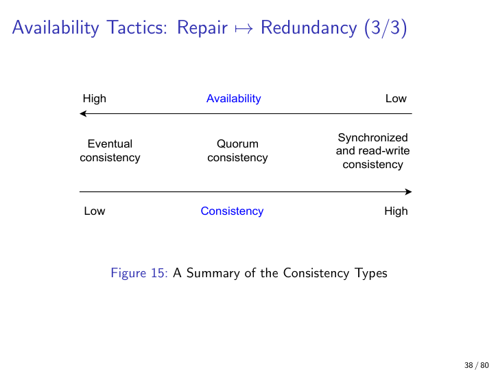

### Retry with Exponential Back-off and Jitter (Repair)

**Definition.** Reattempt a failed operation a bounded number of times with an exponentially increasing sleep between attempts (`sleep = base * 2^i`), plus random jitter so synchronised clients do not retry on the same beat.

**Why it matters.** Solves transient faults — a dropped packet, a momentary overload — without overwhelming the very system you are retrying against.

A naïve `while i < max_retries: sleep(constant)` causes thundering-herd retries that prolong outages. Exponential back-off gives the downstream room to recover. Jitter (random ±20% of the back-off window) prevents the synchronised retry storm that exponential back-off alone still allows after a wide outage.

**Analogy.** Calling a friend whose phone is dead. Calling every 5 seconds drains your battery; calling at 1, 2, 4, 8, 16 minutes is gentler on both phones and still catches them when they are back. Now add jitter so you and three other friends do not all dial at the 16-minute mark.

**Example.** AWS SDK default retry; HTTP `Retry-After`-respecting clients; gRPC's built-in retry budget.

**Pitfall.** Without jitter, exponential back-off still produces synchronised retry storms after wide outages. Back-off without jitter is half a tactic.

### Circuit Breaker (Repair) — canonical state diagram

**Definition.** A three-state pattern wrapping calls to a downstream service so the caller can **fail fast** when the downstream is repeatedly unhealthy. States: **Closed**, **Open**, **Half-open**. (Montesi & Weber 2016.)

**Why it matters.** Stops cascading failures by refusing to keep loading a clearly broken downstream — protects both caller resources and downstream's recovery. This is *the* canonical figure of the lecture; Chapter 8 reuses the breaker as a throttling primitive and shows only the application curve, so the state machine is documented here once and for all.

The three states and their transitions:

- **Closed.** Requests flow through normally. Each failure increments an error counter. When the failure rate crosses a threshold (e.g. > 50% errors over the last 20 requests, with a minimum-volume gate), the breaker trips to **Open**.
- **Open.** Requests fail immediately *without* hitting the downstream. The caller gets a fast error, freeing its threads and pool slots. After a configured cool-down period, the breaker transitions to **Half-open**.
- **Half-open.** A limited number of probe requests is allowed through. If they succeed, the breaker returns to **Closed** and resumes normal traffic. If any probe fails, the breaker snaps back to **Open** and restarts the cool-down clock.

It pairs naturally with retry, timeout, and bulkheads. The original Hystrix library from Netflix is the lecture's Case #5 and the historical canonical implementation; modern equivalents include Resilience4j (JVM) and Polly (.NET).

**Analogy.** A house electrical circuit breaker. When too many devices short out, the breaker trips (Open). Flipping it back without unplugging anything just trips it again. After unplugging, you carefully flip it on (Half-open) and test one device at a time before plugging the rest back in (Closed).

**Example.** Hystrix (deprecated but conceptually canonical); Resilience4j; Polly; Envoy outlier detection.

**Pitfall.** Setting the failure threshold by error *count* rather than error *rate* misfires under variable traffic. Use error rate plus a minimum-volume threshold — otherwise a low-traffic window of five requests trips the breaker on a single transient blip.

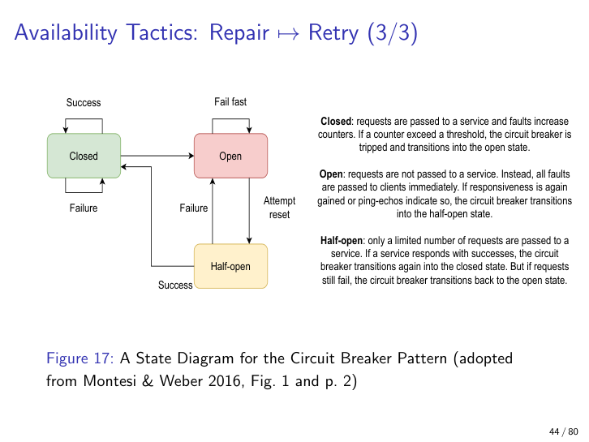

### Graceful Degradation (Repair)

**Definition.** Maintain the availability of *critical* functions while suspending, slowing, or dropping less critical ones.

**Why it matters.** Lets a stressed system stay *useful* instead of going dark entirely.

The architect picks a sacrificable surface so the core function survives. Variants include: priority-based (only critical functions), geographic (only certain regions), demographic (majority over minority), and drain-mode (finish in-flight work, refuse new). The lecture's example: under a DoS attack on a public-transport site, drop maps and timetables but keep the *payment system* running.

**Analogy.** An overloaded airplane. To keep flying, the captain dumps fuel, sheds non-essential systems, and drops to a lower altitude — degrades gracefully rather than crashing.

**Example.** YouTube serving 240p instead of 1080p under load; banking apps disabling new transfers but still showing balances; Twitter showing cached timelines.

**Pitfall.** Requires up-front classification of "critical" functions. Done in cold blood at design time, not in panic during the incident.

### Shadow, State Re-synchronisation, Escalating Restart (Reintroduce)

**Definition.** Three tactics for safely returning a repaired component to service:

- **Shadow.** The repaired component is brought up but its outputs are *not* used. They are observed in parallel with the live one for a probation period.
- **State re-synchronisation.** The repaired component pulls (or is pushed) the latest state, often via checksums or hashes, before it carries any production traffic. Traffic is then migrated incrementally (0 → 30% → 70%).
- **Escalating restart.** Restart progressively wider scopes of functionality (5% → 25% → 60% → 100%) so the smallest-blast-radius restart is tried first.

**Why it matters.** **This is the branch students forget.** A naïve "just put it back in" often re-triggers the very fault that caused the failure, or floods the just-repaired component with traffic it cannot yet handle. The Reintroduce branch is *its own thing* and is not implied by the Repair branch.

Shadow is the recovery analogue of the *canary* deployment from Chapter 6 — same idea, different point in the lifecycle. Escalating restart applies KISS to recovery: try the cheapest reset first (restart just the affected thread), only if that fails escalate to process, then container, then host, then cluster.

**Analogy.** A pilot grounded for medical reasons does not go straight to long-haul. They fly with an instructor in the right seat (shadow), then short domestic routes (escalating), then full duty.

**Example.** Erlang/OTP "let it crash" supervisor trees implement escalating restart by design — supervisors restart workers, then sub-supervisors, then the whole subtree.

**Pitfall.** Shadow needs a way to *compare* shadow output to live output, and a hard guarantee that the shadow's writes do not actually hit production storage. Without that guarantee, "shadow" is just "double-writing".

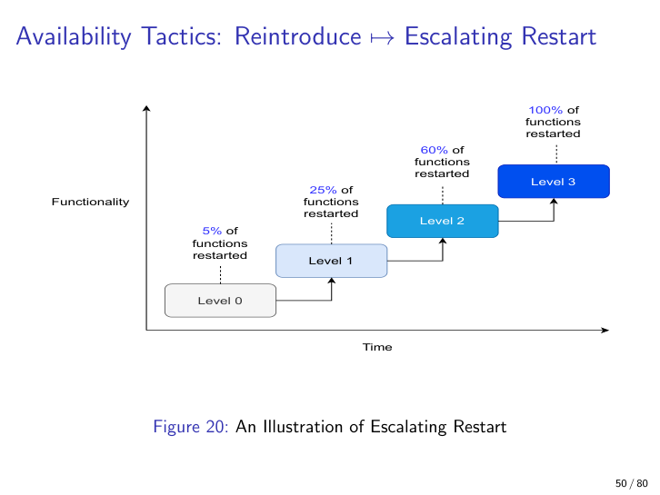

### Isolation and Blast Radius (Prevent)

**Definition.** **Isolation** is partitioning a system so a failure in one part cannot reach another part. **Blast radius** is the set of components a single fault actually affects.

**Why it matters.** The whole point of isolation is to bound the blast radius — no single fault should be able to take down the entire system.

Adkins et al. (2020), the lecture's main reference here, recommend two practices: **functional separation** (different failure domains do different things) and **data isolation** (each failure domain has *its own* data so corrupted data in one cannot poison the others — including configurations, not just user data). The companion concept is **cascading failure** — without isolation, a single fault can ripple through the whole system. **Sharding** is the most common implementation.

**Analogy.** Watertight compartments in a ship. The Titanic sank because the bulkheads were not tall enough — water spilled over from one flooded compartment to the next. Real isolation means each compartment can flood completely without flooding its neighbours.

**Example.** AWS regions and availability zones; Kubernetes namespaces with resource quotas; per-tenant database sharding in multi-tenant SaaS.

**Pitfall.** "Isolation" reuses Chapter 1's coupling discussion but is *not* the same. Two components can be loosely coupled at the interface level and still share a failure domain (same host, same power supply, same network switch). Coupling is about *change*; isolation is about *fault propagation*.

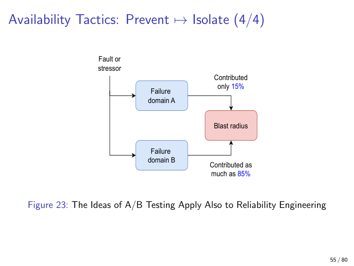

### Hot / Warm / Cold Spare

**Definition.** Three redundancy patterns, distinguished by how synchronised the standby is with the active component.

- **Active (hot spare).** Spare receives every input in parallel with the active component and maintains state *synchronously*. Failover is near-instant.
- **Passive (warm spare).** Spare's state is updated *periodically* by the active component. Failover involves catching up the gap.
- **Spare (cold spare).** Spare is dormant and only initialised when needed. Failover is slow, but cheapest to run.

**Why it matters.** Choosing the right shade of redundancy is the single biggest cost-versus-availability lever in most architectures.

Hot spare gives sub-second failover but doubles compute and network costs and risks the spare diverging in subtle ways from the active. Warm spare amortises cost (state sync is bulk-async) at the price of a recovery-point-objective gap. Cold spare is essentially "we have the same hardware in the closet, ready to be configured" — used where minutes-to-hours of downtime are acceptable.

**Analogy.** A goalie. Hot spare = a second goalie on the ice watching every shot, instant in if the first goes down. Warm spare = a backup on the bench warming up between periods. Cold spare = the practice goalie at home, has to drive to the rink.

**Example.** Hot — synchronous PostgreSQL replication. Warm — streaming async replicas. Cold — nightly backups plus a provisioned-but-stopped EC2 AMI.

**Pitfall.** "Active-active" is a special case of hot-spare where *both* sides carry production load instead of one being idle. The naming overlap confuses everyone at least once.

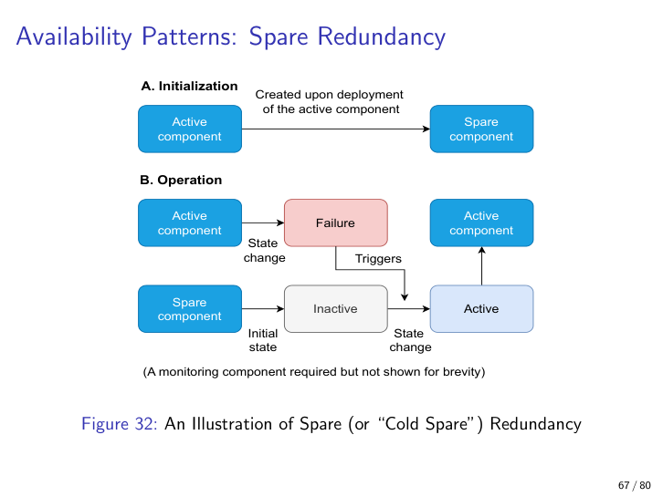

### Bulkheads (Prevent / Equitable Resource Allocation)

**Definition.** Separate resource pools for different request classes so that heavy use of one pool cannot starve the others.

**Why it matters.** Without bulkheads, a single misbehaving client (or query type) can monopolise the connection pool, thread pool, or queue and bring down the whole service for everyone else.

The lecture's example: many small frequent requests plus a few rare large requests, all hitting a shared handler, is fragile — the large ones can monopolise threads. Splitting into a small-request pool and a large-request pool quarantines the damage. The pattern is named after the watertight bulkheads in a ship's hull — the same naval-architecture metaphor as isolation, applied at the resource-pool level.

**Analogy.** Two checkout lanes at a supermarket — one for ≤10 items, one for full carts. Without the split, a single full cart blocks every quick shopper.

**Example.** Hystrix thread-pool isolation; per-tenant connection-pool quotas in databases; Kubernetes resource requests and limits per namespace.

**Pitfall.** Bulkheads only help if the resource being partitioned is the actual bottleneck. Partitioning CPU when the bottleneck is the database connection achieves nothing.

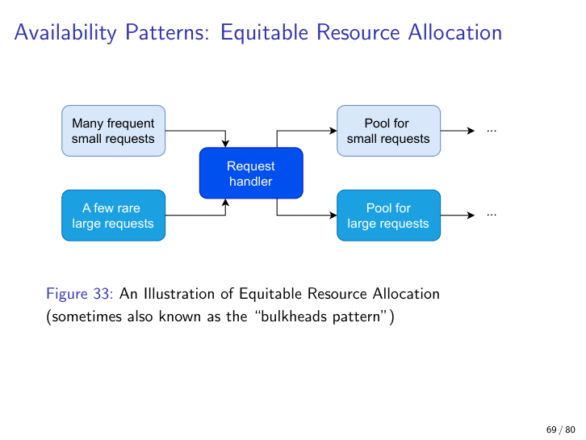

### Saga Pattern — flight + hotel booking walkthrough

**Definition.** A long-lived business transaction decomposed into a sequence of local transactions, each in a different service, where each step has a corresponding **compensating** transaction that undoes its effect if a later step fails.

**Why it matters.** Distributed transactions across microservices cannot use traditional two-phase commit — it is too slow, too coupled, and forces the entire transaction graph to hold locks for the duration. The saga is the de-facto microservices answer. (Reference: Dürr et al. 2021.)

Each local transaction is atomic *within its own service*, and on success it notifies the next step. On failure of step N, the saga rolls back by invoking *compensating* transactions for steps N-1, N-2, ... 1 in reverse.

**The course's running example — flight + hotel booking.** The lecture uses this scenario in multiple lectures and the exam will almost certainly assume it. The happy path and the failure path both matter.

*Happy path (both succeed):*

1. Customer initiates trip booking → **Begin saga.**
2. **Local transaction A: book hotel.** Hotel service charges card, reserves room, commits locally. *Notify success* → trigger next step.
3. **Local transaction B: book flight.** Flight service charges card, reserves seat, commits locally. *Notify success* → trigger next step.
4. **End saga.** Customer receives confirmation.

*Failure path (flight fails after hotel succeeds — the canonical case):*

1. **Begin saga.**
2. **Local transaction A: book hotel.** Succeeds. State: hotel reserved, money taken.
3. **Local transaction B: book flight.** Fails — no seats left, payment declined, airline API down, anything. Saga must roll back.
4. **Abort saga.** Now run compensations in reverse.
5. **Compensating transaction B': cancel flight (no-op if it never committed, but always invoked defensively).** State: nothing pending in flight service.
6. **Compensating transaction A': cancel hotel.** Hotel service releases the room and *issues a refund*. State: hotel cleared, money returned.
7. **End saga.** Customer told the booking failed; account is whole.

**Analogy.** Erecting a multi-stage rocket. Each stage fires and reports back; if stage 3 fails, mission control fires reverse-thrust on the already-flying stages rather than trying to re-merge them mid-flight.

**Example.** Travel booking (the lecture's recurring example); e-commerce order with separate inventory, payment, and shipping services; ride-hailing with separate driver-match, route-plan, and pricing services.

**Pitfall — semantic vs syntactic undo.** Compensating transactions are *not* the byte-level inverse of the original transaction. They are *semantic* undo. Cancelling a hotel reservation includes refund + cancellation email. Side-effects that have already become visible to the world — a confirmation email to the customer, a charge that has already cleared the merchant — cannot literally be unsent or un-charged. The compensating transaction is whatever business action *most closely* restores the customer to the pre-saga state. That is why a refund is the right compensation for a payment, not "delete the database row".

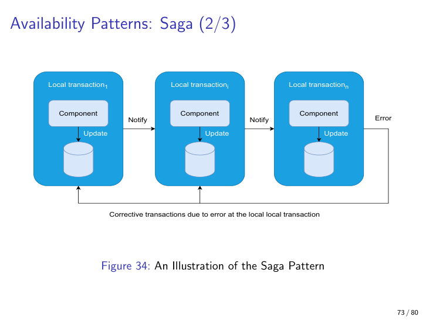

### Taint and Quarantine (Prevent)

**Definition.** When corruption is detected, mark the affected data as "tainted" so that no downstream action depends on it, and move the data to a quarantine area for offline analysis.

**Why it matters.** Stops a single bad record from being amplified into a cascading bad output. Without quarantine, the natural response of a system is to *act* on whatever data it has — which is the worst possible response when the data is poisoned.

Closely related to the data-isolation tactic above. File systems and disk firmware do this routinely (bad-block remapping, ZFS scrub-and-quarantine). The same dynamic appears in security — tainted input must not sink to a database, a UI, or a downstream service.

**Analogy.** A blood bank's positive-screening sample is moved to a quarantine fridge, never thrown back into the donor pool, and analysed separately.

**Example.** ZFS putting checksum-mismatched blocks into a "degraded" pool state; SMTP greylisting and spam quarantine; Kafka dead-letter queues.

**Pitfall.** Quarantine is only useful if someone reviews the quarantine. Write-only quarantines become silent data loss. Schedule the review the same day you build the quarantine.

### Williams 2026: Over-engineering as the New Technical Debt

**Definition.** The lecture's closing argument (Williams 2026): designing for hypothetical scale and edge cases adds operational complexity that *itself* degrades the system. Resilience for resilience's sake is debt.

**Why it matters.** Counterweight to the seventy slides of tactics you just learned. Every tactic in this chapter — every circuit breaker, every bulkhead, every analytical-redundancy cross-check — has an operational cost. Stack enough of them and the operating-cost line on the availability ledger crosses the original-failure-cost line. Past that point you are *losing* availability by adding more resilience.

Williams's three claims, paraphrased from the lecture's closing slide:

1. Traces look fine and dashboards stay green while performance quietly erodes. The tactics that were supposed to make problems visible are themselves obscuring the problems.
2. Teams build resilience against hypothetical traffic patterns while ignoring the cost of running today's actual system. The cost of the resilience exceeds the cost of the events it was supposed to mitigate.
3. Services exist to justify their own abstractions. Configuration replaces code. The architecture technically works "only because people avoid touching it." This is the most damning sentence in the lecture.

**Analogy.** A house with a backup generator, a backup-backup generator, two sump pumps, a battery bank, three smoke alarms, and a tornado shelter. If the homeowner has to spend six hours a month maintaining all of it, the *house* is now less reliable than a plain house with one good generator and an attentive owner. The maintenance load is the new failure mode.

**Example.** Microservice topologies where 80% of incidents trace to the inter-service plumbing (service mesh, sidecars, retries, breakers) rather than to business logic. The plumbing was supposed to make the system robust. Instead it became the system's main failure surface.

**Pitfall.** Do not confuse this with YAGNI for *features* — it is YAGNI for *resilience*. Sometimes the right answer is a monolith on one big VM with daily backups and a clear runbook. That sentence is allowed to be said aloud in an architecture review.

### Patterns Summary

The lecture closes with a two-column cheat-sheet mapping common availability scenarios — unstable network, fickle network, bandwidth-limited, inconsistent transactions, cascading failures, high-availability priority — to recommended patterns. Use it as a revision aid: if the exam paints a scenario, the table tells you which pattern earns the marks.

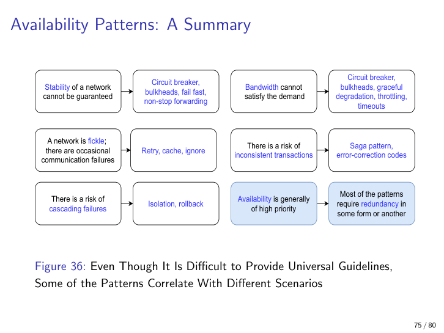

## Ten takeaways

1. **Memorise the four-letter mnemonic D-R-R-P** — Detect, Repair, Reintroduce, Prevent. **Reintroduce is the branch students drop.** Drawing the tree without it loses marks.
2. **Fault ≠ failure ≠ trigger.** A bug is a fault. It becomes a failure only when a user-visible specification is violated. A trigger is what activates the latent fault. Exam questions hinge on this trichotomy.
3. **Each extra nine costs ~10× more.** Five nines = 5 min 15 s/year, the telecom standard. Four nines = 52 min/year, the right answer for online banking. 99% = 3 days 15 h/year, the right answer for a hobby blog. Pick the nine that matches the domain, not the customer's optimism.
4. **The 6-slot scenario template is reused** from earlier QA chapters; populate every slot with availability-flavoured values (Source = ext/int, Event = fault/crash/omission/timing/incorrect-response, Environment = normal/startup/repair/degraded/overloaded, etc.).
5. **Replication ≠ functional redundancy ≠ analytical redundancy.** Only analytical/functional diversity survives common-mode design defects. **Boeing 737 MAX MCAS** — a single AoA sensor with no analytical cross-check — is the exam-quotable anti-pattern. 346 deaths.
6. **The circuit breaker has three states** — Closed, Open, Half-open — and "fails fast" in Open. This chapter holds the canonical state diagram; Chapter 8 reuses the breaker for throttling but shows only the application curve. Know which transitions are triggered by failures, by successes, and by the cool-down timeout.
7. **Consistency trades against availability.** Eventual is most available, synchronized and read-after-write are least. Quorum sits in the middle. CAP and PACELC (Chapter 8) formalise this.
8. **Pair retry with exponential back-off *and* jitter.** Back-off without jitter still produces synchronised retry storms. Both together are the minimum tactic.
9. **Bulkheads = ship's bulkheads = separate resource pools.** Isolation = ship's compartments = separate failure domains. Same naval analogy at two different scales. The Titanic sank because the bulkheads were not tall enough — a real engineering metaphor, not just a name.
10. **Saga = local transactions + semantic compensating transactions, not 2PC.** The course's running example is **flight + hotel booking** — hotel commits, flight fails, compensations run in reverse: cancel flight (no-op), cancel hotel (refund + release). Compensation is semantic undo; emails already sent stay sent. **And finally — Williams 2026:** every tactic has a cost. Stack too many and the resilience itself becomes the largest failure surface in the system.
