# Chapter 8: Performance — Latency vs Throughput, CAP/PACELC, Caching Topologies, Throttling, Scheduling, MapReduce, Claim-Check

Performance is not Scalability, and confusing the two will lose you marks on the exam — mock Q8 is built exactly around that distinction. **Performance is "do more with what you have"**: the same hardware, smarter; the same workers, better-organised; the same network, less abused. **Scalability is "add resources proportionally"**: more servers, more cores, more replicas. They are siblings, not synonyms. A purist performance answer never reads "spin up another box"; that lever exists, but it lives in Chapter 9. This chapter lives in the territory of latency budgets, tactic trees, queue policies, schedulers, caches, throttling state, and distributed-systems fallacies — every move you make to extract more useful work from a fixed allocation. Read it with the understanding that almost every tactic here is, at heart, a way to pay homage to the eight fallacies of distributed computing: assumptions you must stop making before you can design anything that does not melt under load.

---

### Performance (the QA itself)

**Definition.** A system's ability to meet its resource requirements — both time (latency, throughput) and space (memory, disk) — under a given workload.

**Why it matters.** Performance is the quality attribute that turns a "functionally correct" system into a usable one. It is also the QA most frequently violated under unanticipated load, which is exactly where a system is graded.

**Explanation.** Ruohonen frames performance through algorithmic complexity: *time performance* (timing) and *space performance* (memory/disk). Pure performance is about doing more with the resources you have — better algorithms, smaller payloads, fewer hops, smarter scheduling. The instinct to add boxes is a separate quality attribute (scalability) with its own trade-offs against cost, complexity, and availability.

**Analogy.** Performance is making your existing kitchen feed more diners faster: better knife skills, smarter prep order, a leaner mise-en-place. Scalability is hiring more chefs and installing more stoves.

**Example.** A Python service that handles 1,000 req/s on a single core after switching from thread-per-request to an async event loop has improved its *performance*. Bumping the same service to four EC2 instances behind a load balancer is *scalability*.

**Pitfall.** Treating "buy a bigger box" as a performance improvement. It often *works* — but architecturally it is the scalability lever with different cost and availability consequences, and it does nothing to fix the underlying inefficiency.

---

### Latency vs Throughput

**Definition.** *Latency* is the time taken to perform a single action or produce one result. *Throughput* is the number of actions or results per unit time. The shared optimum is maximum throughput at minimum latency.

**Why it matters.** Almost every architectural choice optimises one at the expense of the other. A scenario that does not specify both, with statistics, is not testable.

**Explanation.** Batching ten thousand records before flushing maximises throughput but each record sees terrible latency. A streaming, non-batching pipeline minimises per-record latency but the per-record overhead caps throughput. "Fast" is meaningless; "median latency < 200 ms at 5,000 req/s sustained throughput" is testable. Tail latency (P99, P99.9) is where queues and contention bite — averages lie cheerfully about the user experience.

**Analogy.** Latency is how long one letter takes to reach the recipient. Throughput is how many letters the postal service moves in a day. A jumbo cargo plane has enormous throughput and terrible latency per letter; a courier on a motorbike is the opposite.

**Example.** An L1 cache reference is sub-nanosecond; sending a TCP/IP packet from Denmark to Japan is hundreds of milliseconds — nine orders of magnitude apart inside one software stack.

**Pitfall.** Optimising mean latency without looking at P99. The 99th percentile usually drives customer perception and SLA breaches.

---

### Units-of-Time Intuition

**Definition.** A mental ladder ordering the cost of fundamental operations: L1 cache (<1 ns), main memory (~100 ns), SSD I/O (microseconds), intra-data-centre TCP (sub-millisecond), transcontinental TCP (~100 ms), satellite links (Handley 2018: spikes to ~100 seconds).

**Why it matters.** Architectural choices that move work across a tier in this ladder — cache → memory → disk → network — change latency by *orders of magnitude*, not percentages.

**Explanation.** Kernels schedule in nanoseconds; HTTP services live in milliseconds; satellites live in seconds. Saying "latency" without a tier is meaningless. Latency is therefore *stochastic rather than deterministic*, which has direct consequences for how timeouts and SLAs should be written.

**Analogy.** Distance scales in physics — nanometres, metres, kilometres, light-years. Treating them as interchangeable produces nonsense.

**Example.** Moving a hot lookup from main memory (~100 ns) to out-of-process Redis (~500 µs) is a 5,000× slowdown — even when both feel "fast."

**Pitfall.** Designing a uniform "150 ms timeout" for all calls in a system that spans an SSD read and a satellite hop.

---

### Eight Fallacies of Distributed Computing — One-Page Sidebar

> Every distributed-systems performance tactic in this chapter is, in some sense, a refutation of one or more of these. Memorise the list — it is fair game on the exam.

1. **The network is reliable.** It is not. Packets drop, links flap, switches reboot. Every replication, retry, and circuit-breaker tactic admits this.
2. **Latency is zero.** It is not. Even a same-rack hop is hundreds of microseconds; a transatlantic hop is hundreds of milliseconds.
3. **Bandwidth is infinite.** It is not. Even data-centre fabric saturates; mobile networks saturate constantly.
4. **The network is secure.** It is not. Assume sniffers, MITMs, and tampering on every link (cf. zero-trust networking, Chapter 11).
5. **Topology does not change.** It does — nodes come up, go down, get rebalanced, get migrated to new VPCs.
6. **There is one administrator.** There is not — multiple teams, multiple clouds, multiple SLAs, multiple change windows.
7. **Transport cost is zero.** It is not — every byte over the wire costs CPU on both ends and dollars at the egress meter.
8. **The network is homogeneous.** It is not — different protocols, different MTUs, different latency profiles, different reliability guarantees per leg.

**Source.** Originally Peter Deutsch (Sun, 1994); popularised in modern form by Wilson (2015).

**Exam framing.** If asked "name N fallacies of distributed computing," the answer must include numbers, not paraphrases. The lecturer favours crisp recall lists.

---

### Performance Scenario (6-slot template)

**Definition.** A Bass-style scenario specialised for performance with six slots: Source, Stimulus (Event), Artifact (system under deployment), Environment, Response, Response Measure.

**Why it matters.** Without a written scenario, "the system should be fast" is unfalsifiable.

**Explanation.** Each slot has performance-specific value menus. *Source*: external (users, sensors, external systems) or internal (timers, watchdogs). *Stimulus*: periodic, stochastic, sporadic, or cyclic, with a weight. *Environment*: normal / peak / overload / emergency / degraded. *Artifact*: whole system, machine, component, connector, module, class. *Response*: respond / error / no return / ignore / switch mode / prioritise. *Response measure*: latency (with scale + statistic), share of failed/rejected requests, jitter, resource levels.

**Analogy.** A Mad Libs sheet for non-functional requirements — fill all six blanks and you have something a tester can hold you to.

**Example.** *"During Black Friday peak load mode (10× normal traffic) the checkout component must respond to user payment-submit events with P99 latency < 800 ms and < 0.1 % rejected requests."*

**Pitfall.** Specifying only an *average* — the interesting failures live in the tail. Always cite a percentile or a hard cap.

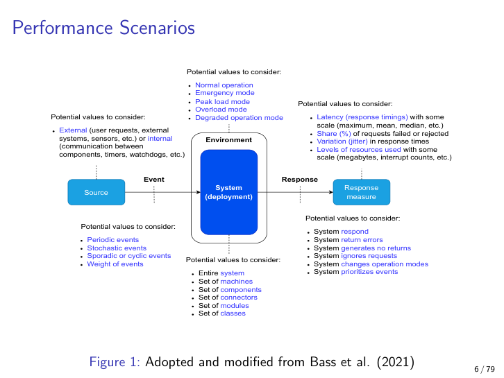

---

### Performance Tactics Tree (two branches × six tactics)

**Definition.** A taxonomy with two top-level branches — *Control demand* and *Manage resources* — each carrying six tactics. Twelve tactics in total.

**Why it matters.** Every performance review should be able to point at which tactics were chosen, which were rejected, and why. The tree is the menu.

**Explanation.** *Demand* tactics (do less): 1. Manage requests, 2. Limit responses, 3. Prioritize events, 4. Reduce overhead, 5. Bound execution, 6. Increase efficiency. *Resource* tactics (use what you have better): 1. Increase resources, 2. Increase concurrency, 3. Multiple copies of computations, 4. Multiple copies of data, 5. Bound queues, 6. Schedule resources.

**Analogy.** Either eat fewer calories (demand) or burn them more efficiently (resources). Both work; both have side effects.

**Pitfall.** Assuming "manage resources" only means "add resources." Adding is one of six resource-side tactics, and it crosses over into scalability — the other five live squarely inside performance.

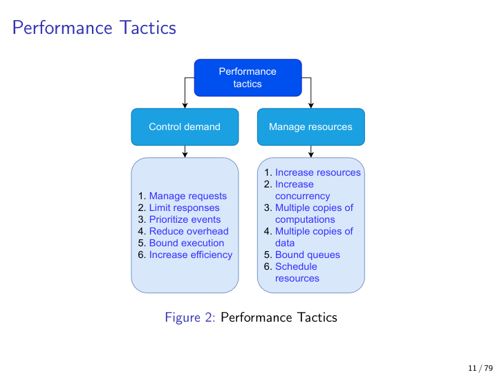

---

### Demand Tactic 1 — Manage Requests

**Definition.** Bounding the arrival rate or sampling frequency of requests, often externally via terms of service or SLAs.

**Why it matters.** The cheapest performance fix is the work you do not do.

**Explanation.** Rate-limit clauses in B2B SLAs, reduced video-stream fidelity under congestion, sensor sampling at 1 Hz instead of 1 kHz. Always a QoS trade-off: fewer or smaller requests means lower fidelity for the client.

**Example.** Cloudflare's "I'm under attack" mode is manage-requests applied wholesale. AI-scraper rate limits are the same pattern at policy level.

**Pitfall.** Confusing manage-requests with throttling. Manage-requests is *static, contractual* shaping — set once at the boundary. Throttling is *dynamic, reactive* — kicks in when load crosses a measured threshold.

---

### Demand Tactic 2 — Limit Responses (Drop vs Queue)

**Definition.** When a resource threshold is reached, either *drop* new requests immediately or *queue* them for later processing.

**Why it matters.** This is the system's behaviour when it cannot keep up — and it must be a deliberate *design choice*, not a default panic.

**Explanation.** Dropping (A) protects the system but cuts off availability for excess load. Queueing (B) preserves availability but trades it for latency and memory pressure. Linux's OOM killer is a brutal drop: kill the most memory-hungry process. Setting `/proc/sys/vm/panic_on_oom = 1` chooses the even more uncompromising "crash loudly" variant.

**Analogy.** A nightclub at capacity: turn people away at the door (drop) or have them wait in line outside (queue). Both are bouncer policies; "no policy" produces a brawl.

**Example.** A REST API returning HTTP 429 ("Too Many Requests") is limit-by-drop. A message broker holding events in a bounded backlog is limit-by-queue.

**Pitfall.** Unbounded queues. They look like graceful degradation but actually convert a CPU problem into a memory problem, hide load from upstream observers, and eventually fail much harder.

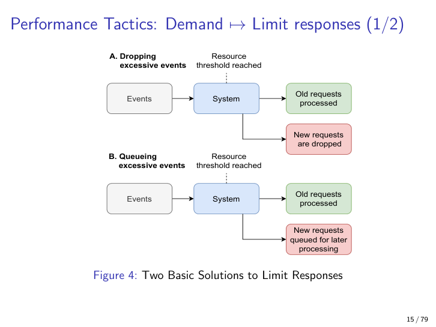

---

### Demand Tactic 3 — Prioritize Events (Priority vs Stochastic Fairness)

**Definition.** Assigning priority values to events so higher-priority work runs first; or, alternatively, using stochastic fairness so no class is starved.

**Why it matters.** Without prioritisation, important and trivial work share a FIFO and the important work suffers head-of-line blocking.

**Explanation.** OS network stacks support priority queues; Cho (1999) introduced *stochastic fairness queueing* as a compromise that picks the next queue at random. Trade-offs: who assigns priority? if you never exceed capacity, the bookkeeping is pure cost.

**Analogy.** Hospital triage — green/yellow/red tags. Necessary because some patients can wait and others cannot.

**Example.** Audio packets prioritised over video packets in WebRTC. Background backup jobs running at "idle" priority.

**Pitfall.** Static priorities starve the low end; pure fairness misses deadlines on the high end. Stochastic fairness is the named compromise.

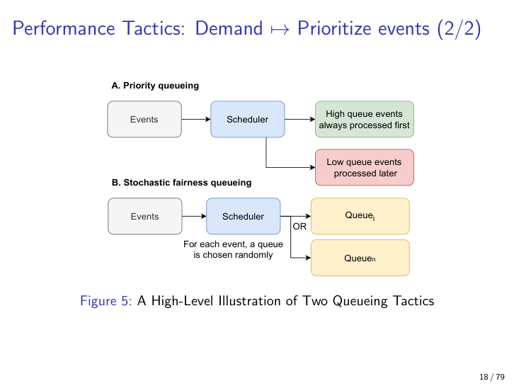

---

### Demand Tactic 4 — Reduce Overhead

**Definition.** Cut intermediaries — wrappers, filters, pipe stages, network hops — between request and answer.

**Why it matters.** Every layer adds latency; architectures accrete intermediaries that nobody can later justify.

**Explanation.** Ruohonen calls out "maybe numerous wrappers were not a good idea after all" and "maybe you had too many filters in your pipe-and-filter pattern." Co-locating components on one machine (vs spread across machines with network hops) is the classic illustration. The trade-off is against maintainability and modifiability (Chapter 3): flat code is faster but harder to evolve.

**Analogy.** Removing speed bumps from a road. Faster commute, more accidents.

**Example.** Inlining a logging middleware that ran on every request hot path, after profiling showed it consuming 15 % of CPU.

**Pitfall.** Reducing overhead by inlining everything until the codebase becomes unmaintainable. Performance gains die at the next refactor.

---

### Demand Tactic 5 — Bound Execution

**Definition.** Capping the time, memory, or other resource a unit of work is allowed to consume.

**Why it matters.** Bounds are reserve capacity, an interpretability tool, and a security control all at once.

**Explanation.** A machine-learning training loop with `max_iterations = 10000` is bound-execution. NetBSD's `setrlimit(2)` lets you cap CPU time, file size, address space, and stack size per process. The same primitive that prevents an algorithm running forever also prevents fork-bomb attacks.

**Analogy.** A parking meter — your car can stay, but only for as long as the budget you paid for.

**Example.** AWS Lambda's default 3-second execution timeout — bound-execution at the infrastructure layer.

**Pitfall.** Bounds set without monitoring. A silent timeout that retries forever produces the same retry-storm pathology a circuit breaker is meant to fix.

---

### Demand Tactic 6 — Increase Efficiency (Better Algorithms)

**Definition.** Replacing an algorithm or implementation with a faster equivalent.

**Why it matters.** Sometimes the only way out of an O(n²) cliff.

**Explanation.** Trade-offs are against maintainability and portability. Ruohonen notes that some kernel routines once hand-written in x86 assembly were removed because nobody else understood them; that x86 game-engine assembly does not survive a port to ARM.

**Analogy.** Replacing a wooden spoon with a stand mixer. Faster, but now you have a stand mixer to maintain.

**Example.** Replacing a hand-rolled string search with a Boyer–Moore implementation; replacing a sort comparator with one that exploits known key structure.

**Pitfall.** Premature micro-optimisation before profiling; equally, refusing to optimise hot paths because "the compiler will figure it out."

---

### Resource Tactic — Increase Concurrency (Concurrency vs Parallelism)

**Definition.** Doing multiple things during overlapping time windows. Conventional simplification: *concurrency = threads = single-CPU interleaving*; *parallelism = processes = multiple CPUs at the same instant*.

**Why it matters.** The terminology distinction is exam-relevant *and* practically relevant — multi-core CPUs blur the line, and the right model informs whether you reach for threads, processes, or async event loops.

**Explanation.** In a single-CPU world, processes are switched by context switches; threads inside one process share heap, code, and data, and are cheaper to switch. With multi-core CPUs the simplification breaks down: kernel-level threads on different cores actually run *in parallel*. The first design choice is whether threads are even the right tool — Apache uses a thread pool, but Lighttpd and Nginx use a single async event-driven thread (made possible by 2000s-era OS innovations like `kqueue`).

**Analogy.** Concurrency is one cook juggling several pans on one stove (interleaving). Parallelism is several cooks each at their own stove.

**Pitfall.** Throwing threads at I/O-bound workloads when an async event loop would handle it with a fraction of the memory and no contention.

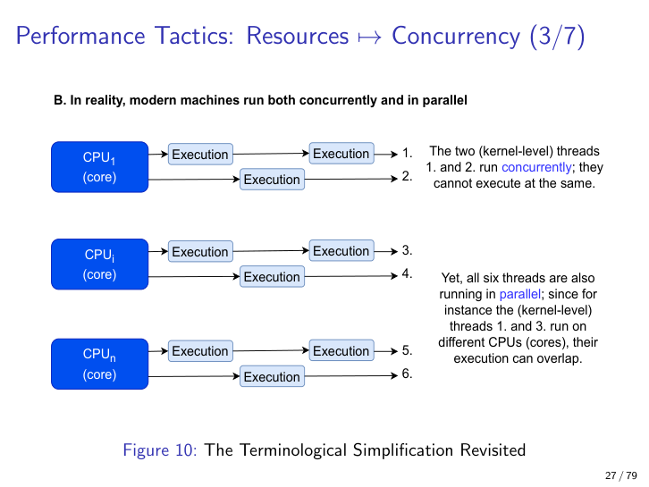

---

### Resource Tactic — Thread Pool vs Spawn-Per-Request

**Definition.** Two thread-management strategies: (A) spawn a fresh thread for every request, (B) maintain a fixed-size pool and dispatch requests to idle workers.

**Why it matters.** Spawning is conceptually simple but creates unbounded resource consumption under load; pools cap the parallelism level and reuse expensive thread state.

**Explanation.** Classical Apache uses pattern B; pattern A is a known footgun under DoS because every malicious request is a new thread. The lecturer's Python sketch — a `Parent` class with 500 daemon worker threads, a `queue.Queue`, and a `threading.Lock` — is the canonical thread-pool skeleton:

```python
import queue
import threading

class Parent:
    def __init__(self, num_workers=500):
        self.queue = queue.Queue()
        self.lock = threading.Lock()
        self.workers = []
        for _ in range(num_workers):
            t = threading.Thread(target=self._worker, daemon=True)
            t.start()
            self.workers.append(t)

    def submit(self, job):
        self.queue.put(job)

    def _worker(self):
        while True:
            job = self.queue.get()        # blocks until work arrives
            try:
                with self.lock:           # serialise access to shared state
                    self._handle(job)
            finally:
                self.queue.task_done()

    def _handle(self, job):
        # actual work — keep short; long jobs starve the pool
        ...
```

Three properties to notice: (1) workers are `daemon=True` so they do not block process exit; (2) the queue is the back-pressure point — under bound-queue policy you would cap its size; (3) the lock is the contention point — coarse locks here defeat the parallelism the pool is meant to deliver.

**Analogy.** Pool = a stable kitchen brigade. Spawn-per-request = hiring a new chef each time a customer walks in.

**Pitfall.** Choosing the pool size by guesswork. Too small and the queue grows unboundedly; too large and you context-switch to death. Profile under representative load.

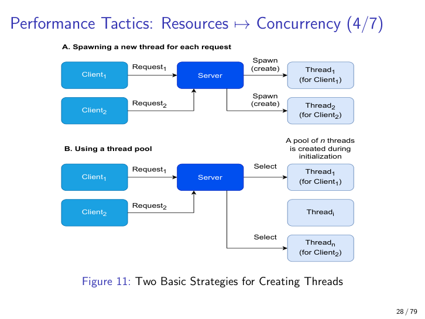

---

### Resource Tactic — Multiple Copies of Computations

**Definition.** Duplicating the result of work, or the workers that do it, so that reads scale independently of writes.

**Why it matters.** The single most-used resource-side performance tactic in modern web stacks.

**Explanation.** Read-write replica patterns (writes to a primary, reads to many read replicas) work because read/write ratios are typically extremely skewed. ML inference is a textbook case: train rarely, serve predictions millions of times. Load balancers and server pools generalise the idea to whole servers.

**Analogy.** A bestselling book — you do not have the author write a new copy for each reader; you print thousands.

**Example.** PostgreSQL streaming replication with a primary and three read replicas behind PgBouncer.

**Pitfall.** Treating replicas as authoritative for writes — split-brain when the primary returns, lost updates, manual reconciliation.

---

### CAP Theorem (Brewer 2000)

**Definition.** A distributed system can simultaneously guarantee *at most two* of: **C**onsistency (every read sees the latest write or an error), **A**vailability (every request gets some response), **P**artition tolerance (the system keeps working despite network partitions).

**Why it matters.** When a partition happens — and partitions *do* happen, that is fallacy #1 — you must consciously pick C or A.

**Explanation.** Partition tolerance is non-negotiable in any real distributed system, so the practical choice is CP vs AP. CP: refuse requests or time out under a partition (good for atomic reads/writes such as payments). AP: serve possibly-stale data (good when eventual consistency is acceptable, e.g. an Instagram feed). Segregation is the practical resolution: different components within the same product can sit on different sides of CAP.

**Analogy.** During a power cut you must choose: keep the freezer running (consistency of food state, no availability of light) or keep one light on (availability) but spoil some food (consistency lost).

**Pitfall.** Treating CAP as a single global choice for "the system." It is per-component — checkout can be CP while social feed is AP.

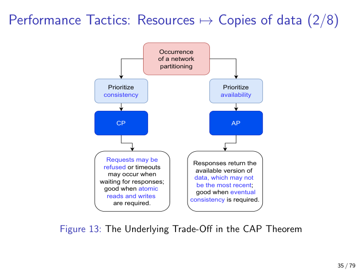

---

### PACELC Theorem (Abadi 2010) — With Real-System Classifications

**Definition.** An extension of CAP: if there *is* a Partition (P), choose Availability or Consistency (A/C); *Else* (E) — i.e. in normal operation — choose Latency or Consistency (L/C). A system is classified by both halves, e.g. PA/EL.

**Why it matters.** Even *without* a partition, replicated systems trade latency against consistency. PACELC names that always-on trade-off that CAP elides — and it is the kind of crisp classification question the lecturer favours.

**Explanation.** Synchronous replication waits for ack from N replicas (EC — strong consistency, higher latency). Asynchronous replication returns immediately (EL — low latency, stale reads possible). Classifying a system as PA/EL or PC/EC is a more honest description than just AP or CP. The four canonical cases:

| System                              | Under Partition | Else (normal op) | PACELC class |
|-------------------------------------|-----------------|------------------|--------------|
| **Cassandra**                       | Availability    | Latency          | **PA/EL**    |
| **Google Spanner**                  | Consistency     | Consistency      | **PC/EC**    |
| **Amazon DynamoDB**                 | Availability    | Latency          | **PA/EL**    |
| **Single-region SQL (e.g. Postgres synchronous primary)** | Consistency | Consistency | **PC/EC**    |

Cassandra and DynamoDB share the "tunable consistency, low latency, never refuse a write" philosophy — that is what PA/EL means. Spanner pays for global consistency with TrueTime hardware clocks and round-trip latency — that is PC/EC. A single-region SQL primary, when configured for synchronous replication, refuses to ack a write until the replica confirms — same class.

**Analogy.** CAP is "during an emergency, do you save the cat or the dog?" PACELC adds "...and *also*, on a normal Tuesday afternoon, are you spending money on cat food or dog food?"

**Pitfall.** Citing only the partition half. "Cassandra is AP" is incomplete; "Cassandra is PA/EL" carries the always-on trade-off too.

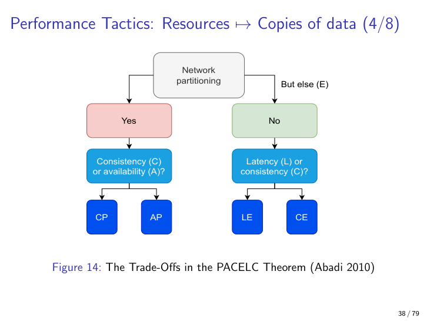

---

### Caching Topologies — Five Patterns Compared

**Definition.** A family of patterns for placing copies of data closer to readers and managing how those copies are filled and invalidated.

**Why it matters.** Caching is the dominant tactic for hiding read latency in modern systems, but each variant has a distinct consistency / data-loss trade-off.

**Explanation.** Two orthogonal axes: *placement* (local vs distributed) and *fill/write strategy* (cache-aside, refresh-ahead, write-through, write-back, write-around). The full 2×5 menu:

| Pattern \ Placement | **Local (in-process)** | **Distributed (Redis/Memcached)** |
|----------------------|------------------------|-----------------------------------|
| **Cache-aside**      | App checks local map first; miss → DB → populate map. Trivial; per-instance; staleness across instances. | App checks Redis; miss → DB → populate Redis. Shared; one stale entry serves everyone until refreshed. |
| **Refresh-ahead**    | Background timer refreshes hot keys before TTL expires. Avoids latency spikes; wastes cycles on cold data. | Scheduled job refreshes hot keys in shared cache; same waste pattern, one source of truth. |
| **Write-through**    | App writes to local map *and* DB synchronously. Strong consistency for this instance; other instances still stale. | App writes to Redis *and* DB synchronously. Strong consistency cluster-wide; slower writes. |
| **Write-back**       | App writes to local map only; flushes to DB later. Fast; lost on crash; only safe with WAL. | App writes to Redis only; DB updated later. Fastest writes; data loss risk if Redis dies. |
| **Write-around**     | App writes to DB only; local map populated lazily on next read miss. Good for write-heavy / rarely-re-read keys. | App writes to DB; Redis populated lazily. Same trade-off shared across cluster. |

**Analogy.** Cache-aside = "I only restock the fridge when I find it empty." Refresh-ahead = "I restock every Sunday whether or not the fridge is empty." Write-through = "I always write the recipe in *both* my notebook and the fridge label." Write-back = "I write the fridge label and update the notebook later." Write-around = "I always write the notebook and let the fridge label catch up on next opening."

**Example.** A read-heavy product-catalogue API: cache-aside in Redis. A bulletin-board "trending now" tile: refresh-ahead. A bank ledger view: write-through. A user-session counter that can lose a few increments: write-back. An audit-log writer never re-read by the API itself: write-around.

**Pitfall.** Choosing write-back without budgeting for the data-loss risk; choosing write-through without budgeting for the latency cost; choosing cache-aside in a cluster and being surprised by per-node staleness.

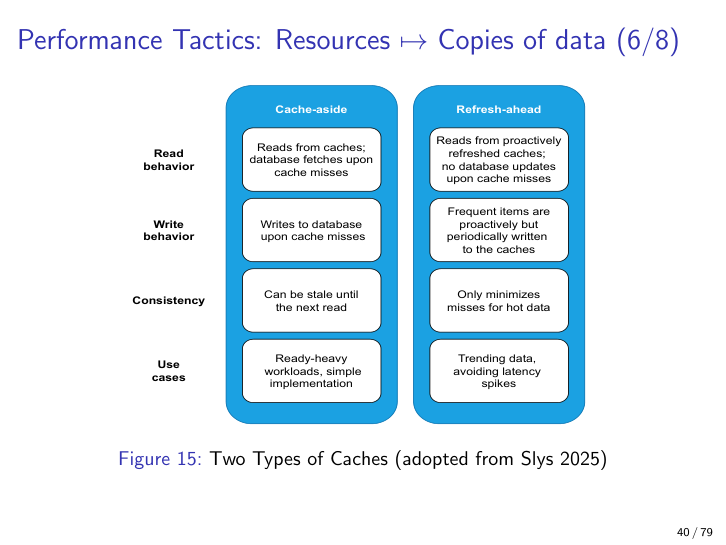

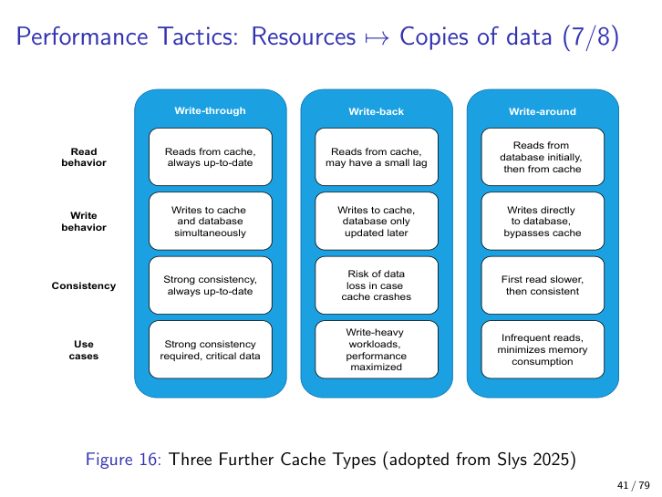

---

### Resource Tactic — Bound Queues

**Definition.** Capping the maximum number of queued events and defining a policy when the cap is exceeded.

**Why it matters.** An unbounded queue under sustained overload becomes a memory leak that fails much harder than a bounded queue would have.

**Explanation.** Simple to implement, but the *overflow policy* is the real design choice: drop, drop-stochastically (Cho 1999), shed lowest-priority, or apply back-pressure upstream. Ruohonen's snippet:

```python
def enqueue(self, events, max=1000):
    k = min(len(events), max)            # cap arrivals
    for i in range(k):
        self.queue.put_nowait(events[i])
```

**Pitfall.** Bounded with no policy — just raising an exception that the caller does not handle gracefully. Same crash, slightly later.

---

### Resource Tactic — Schedule Resources (FIFO, SJF, EDF, Rate-Monotonic, Idle, Batch, Round-Robin, Semantic-Importance)

**Definition.** Deciding *which* runnable task gets a resource (CPU, disk, IRQ) *when*.

**Why it matters.** Context switches are expensive; the scheduler choice directly determines tail latency and cache locality.

**Explanation.** A *poor* CPU scheduler rotates Tasks A→E in lockstep across all CPUs — every CPU does a context switch at the same moment. A *better* scheduler keeps each task on one CPU for a longer slice: fewer switches, better cache locality. Overlapping execution lets Task B use disk while Tasks A and C run on CPU — I/O and compute overlap.

The named scheduling disciplines:

- **FIFO** — trivial, fair-ish, but one long job blocks the queue (the supermarket queue).
- **SJF (Shortest Job First)** — minimises average waiting time when job durations are known (the express lane).
- **EDF (Earliest Deadline First) / deadline-monotonic** — higher priority for shorter deadlines; basis of real-time schedulers (the ER triage on imminent-death basis).
- **Rate-monotonic** — priority by task *period* (shorter period = higher priority).
- **Idle** — non-time-critical work only when system is idle (overnight backups).
- **Batch** — maximises throughput of background jobs at low priority.
- **Round-robin** — equal circular time slices per task; e.g. DNS round-robin (a kindergarten taking turns on the swing).
- **Semantic-importance** — priorities from domain knowledge (audio over video).

Granularity matters: database writes are scheduled in seconds; OS kernels schedule interrupts and processes in nanoseconds; `irqbalance` distributes hardware interrupts across CPUs to avoid hot-spotting one core.

**Pitfall.** Fair scheduling is the default but is the *wrong* default for hard real-time systems where missing a deadline = system failure (Ruohonen's car-brake example). For a brake controller, EDF/rate-monotonic — not round-robin — is the right answer.

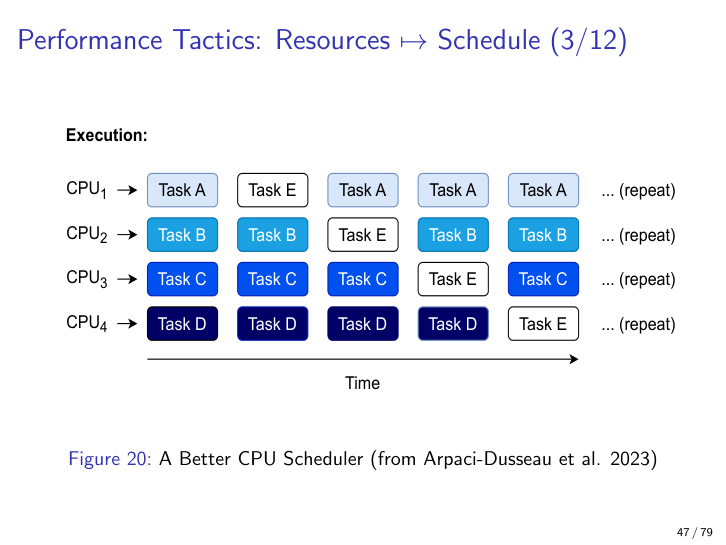

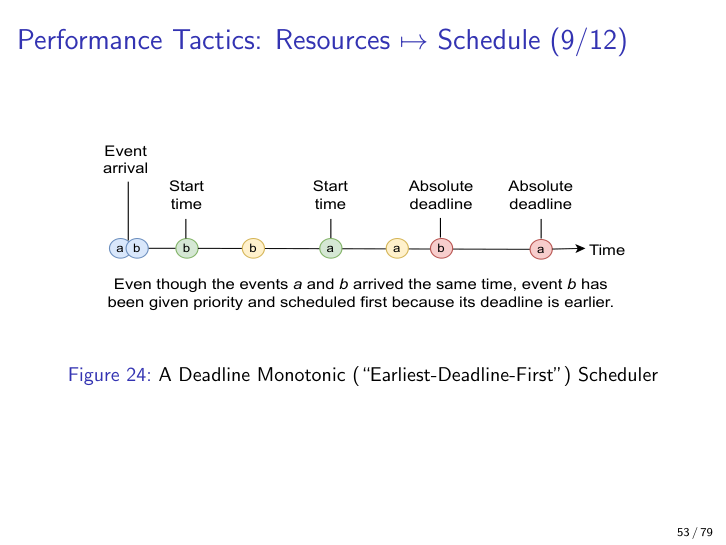

---

### Throttling Pattern — Circuit Breaker + Back-off + Jitter (Canonical Here)

**Definition.** A performance pattern that limits resource usage when a measured load crosses a threshold. Implemented as a circuit breaker state machine: **Closed → Half-open (throttling / graceful degradation) → Open (errors only)**, paired with exponential back-off and jitter on the client side.

**Why it matters.** Throttling is the canonical production answer to "we cannot serve all this traffic." It is on the exam, and the lecturer flagged drawing the throttling-plus-circuit-breaker-plus-jitter combination as realistic. This chapter is its **canonical home** in the study guide.

**Explanation.** In the Closed state the breaker passively measures load. When the threshold is crossed, the breaker moves to Half-open, where load is reduced via graceful degradation — lower fidelity, fewer features, sampling. If degradation succeeds the breaker returns to Closed; if load worsens it trips Open and clients receive errors immediately. With cloud computing, the breaker can be combined with *dynamic scaling*: instead of throttling at threshold crossing, allocate more capacity. Both halves of the dual — scale up vs throttle down — have costs: scaling up costs money and time; scaling down or throttling costs QoS and may cut off availability.

**Critical refinements (Brooker 2019).**

- **Exponential back-off.** Every retry by a client waits exponentially longer (e.g. 100 ms, 200 ms, 400 ms, 800 ms…). Absorbs retry storms by spreading load over time.
- **Jitter.** Add randomness to the back-off interval (and even to normal request timing) so retrying clients do not synchronise into a thundering herd. Without jitter, every client that failed at T retries together at T+100ms, T+200ms, T+400ms — recreating the exact spike the back-off was meant to dampen.
- **Layered queries.** Internal layers also retry; a single user-facing failure may produce many internal retries, multiplying load. The lecturer's page-65 warning that "layered architectures contribute to the retry-storm problem" connects directly to Chapter 1 — strict layering has a performance cost when each layer adds independent retry logic.

**Cross-reference (mandatory).** The **circuit-breaker state diagram itself** — Closed / Half-open / Open with the precise transition predicates — lives in **Chapter 7 (Availability)**, where the circuit breaker is introduced as an availability tactic. This chapter shows the breaker's *application* to throttling: the resource-utilisation curve crossing the threshold into the half-open region. When you draw a throttling answer on the exam, draw the resource-utilisation curve here; when you draw a circuit-breaker answer, draw the state diagram from Chapter 7. The exam-favourite drawing is both side-by-side, with back-off + jitter annotated on the client side.

**Analogy.** A nightclub bouncer. Closed door = normal operation. "Slow down, only ten at a time" = half-open / throttling. "Closed for the night" = open. Adding a second bouncer is dynamic scaling.

**Example.** A REST API throttles to 50 % of normal capacity at 80 % CPU; clients retry with exponential back-off seeded by `random.uniform(0, 100ms) * 2 ** attempt`; if CPU stays >95 % for 30 s, the breaker opens and returns HTTP 503 with `Retry-After`.

**Pitfall.** Naive retries without back-off + jitter — the classic retry storm that turns a partial outage into a full one. Equally pernicious: opening the breaker without telling clients (no `Retry-After` header), so they hammer the open breaker indefinitely.

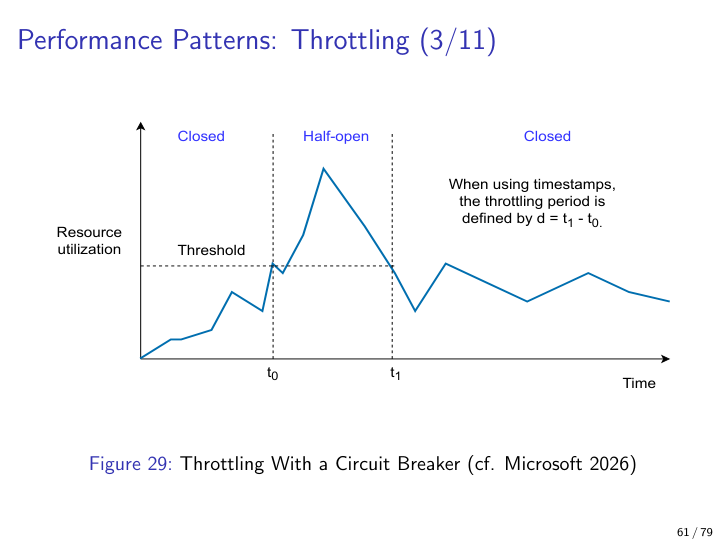

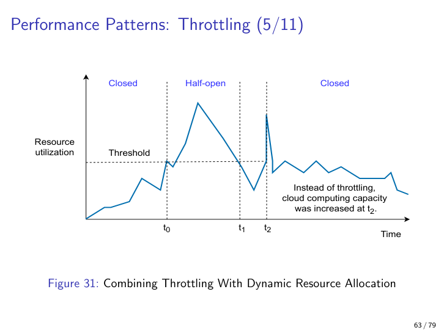

---

### MapReduce (Dean & Ghemawat 2008)

**Definition.** A parallel-processing pattern where a *Map* step distributes work across many workers (each reading a split of input and emitting key/value pairs) and a *Reduce* step aggregates the per-key intermediate results into a final dataset.

**Why it matters.** Even with effectively unlimited cloud resources, algorithmic discipline still matters — MapReduce is the canonical example of using simple primitives (map, reduce) to make big data tractable. It is also the textbook counter-example to "just add resources."

**Explanation.** The main process forks N mapper workers; each worker reads its split of the input files locally, processes it, and writes intermediate results remotely. A reducer worker reads the remote intermediates and writes a single output file. The pattern scales horizontally because workers within a phase do not depend on each other.

**Analogy.** Counting votes in a national election: each polling station (mapper) counts its own ballots and reports a tally; a central office (reducer) sums the tallies.

**Example.** Counting word frequencies across a terabyte corpus: mappers emit `(word, 1)` for each occurrence; reducers sum the 1s per key.

**Pitfall.** Applying MapReduce to problems where the dependencies between records are not key-aligned — most graph problems, for example, fight the model and you end up shuffling more data than you process.

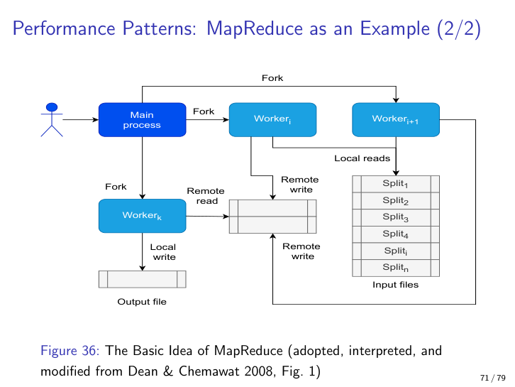

---

### Claim-Check Pattern

**Definition.** Instead of sending a large payload over a network, send a small "claim-check" token that points to the payload in a shared store; the receiver retrieves the payload from the store using the token.

**Why it matters.** A triple win — performance (less network bandwidth), reliability (the message bus carries small messages it can handle), and security (tokens can be cryptographically signed or scoped).

**Explanation.** MapReduce aligns with this pattern: input data lives in a shared store, workers read locally and write intermediates that other workers later retrieve. More generally, any message bus that transports references to a blob store (e.g. S3) instead of the blob itself implements claim-check.

**Analogy.** A coat-check at a restaurant — you carry a paper tag, not the coat.

**Example.** An Azure Service Bus message carrying a SAS URL to a blob in Azure Storage; the receiver fetches the blob with the URL. Token is signed, time-limited, and scoped to one blob.

**Pitfall.** Forgetting that the shared store now becomes the choke point — claim-check moves the bottleneck rather than removing it. Size the blob store accordingly.

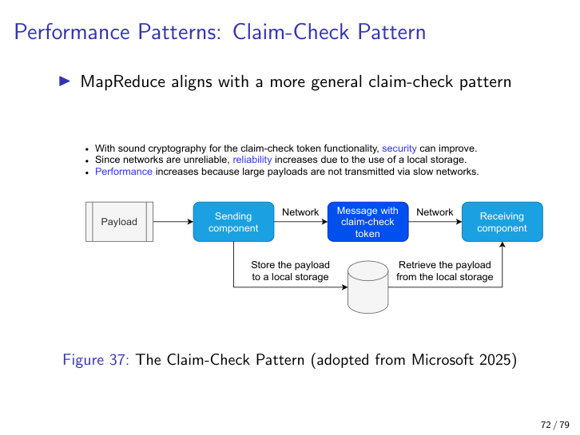

---

### Static / Dynamic Content Separation and Materialized Views

**Definition.** A web-tier performance pattern: serve static assets (images, JS, CSS, HTML) from one tier (often a CDN) and dynamic content from another. Materialized views additionally pre-compute heavy results and store them as separate tables.

**Why it matters.** Static content has different scaling, caching, and security profiles than dynamic content; mixing them on the same server wastes both.

**Explanation.** CDNs (Chapter 9) push static content close to the user. Materialized views trade write latency and staleness for read latency — a costly SQL aggregate becomes a row lookup.

**Analogy.** A library separates reference books (static — read often, never changed) from the active borrowing collection (dynamic).

**Example.** A dashboard whose "daily sales by region" tile is backed by a nightly-refreshed materialized view, not a live aggregate query.

**Pitfall.** Stale materialized views that the BI team treats as live data — name them clearly and surface their refresh timestamp.

---

### Database Performance Patterns

**Definition.** A catalogue of database-specific tactics: caching, read replicas, sharding, indexing, lock debugging, batched writes, connection pools, query optimisation.

**Why it matters.** Databases are a commonplace bottleneck — most of the other performance tactics in this chapter interact with database behaviour at some point.

**Explanation.**

- **Sharding** — horizontal partitioning by key (European users on one shard, Asian on another). Reads stay local to a shard; cross-shard queries are expensive.
- **Indexing** — secondary B-tree or hash structures that turn O(n) scans into O(log n) lookups, at the cost of slower writes (every index must be updated).
- **Locking debug** — know how your DB takes row vs table locks, when deadlocks form, and how the engine resolves them. PostgreSQL's `pg_locks` view is the standard introspection.
- **Batched writes** — amortise per-statement overhead by grouping inserts/updates into one round trip.
- **Connection pools** — TCP + auth handshake per request is expensive; pool and reuse connections (PgBouncer, HikariCP).
- **Query optimisation** — read query plans, fix N+1 patterns, push predicates down to indexes, avoid `SELECT *` in hot paths.

**Pitfall.** Over-indexing. Each new index speeds reads but slows every write that touches the indexed columns; profile both sides before adding.

---

## Exam-Relevant Takeaways

1. **Performance ≠ Scalability.** Performance is "do more with what you have"; Scalability is "add resources proportionally." Mock Q8 tests exactly this distinction — a purist performance answer never reads "add servers."
2. **The two basic measures are latency and throughput.** Any performance scenario without a *statistic* (median, P99) and a *unit/scale* is incomplete and untestable.
3. **The six-slot scenario template is universal.** The value menus on the L6 slide are performance-specific: Stimulus (periodic/stochastic/sporadic/cyclic + weight), Environment (normal/peak/overload/emergency/degraded), Response Measure (latency + jitter + failed-share + resource levels).
4. **The Performance Tactics Tree has two branches × six tactics.** Know all twelve and give a one-sentence example of each: manage requests, limit responses, prioritize events, reduce overhead, bound execution, increase efficiency / increase resources, increase concurrency, multiple copies of computations, multiple copies of data, bound queues, schedule resources.
5. **Limit-responses is drop vs queue.** "Unbounded queue" is not an alternative — it is a deferred crash.
6. **CAP forces a partition-time pick; PACELC names the always-on latency/consistency pick.** Classify systems by both letters: Cassandra PA/EL, Spanner PC/EC, DynamoDB PA/EL, single-region SQL PC/EC.
7. **Five named cache patterns.** Cache-aside, refresh-ahead, write-through, write-back, write-around — each with a distinct consistency / data-loss / latency profile, across the local-vs-distributed axis.
8. **Scheduler choice is a performance tactic.** At minimum know FIFO, SJF, EDF (deadline-monotonic), rate-monotonic, idle, batch, round-robin, semantic-importance. Fair-by-default is wrong for hard real-time.
9. **Throttling is canonically implemented via the circuit breaker** (Closed → Half-open → Open) plus exponential back-off plus jitter; layered architectures multiply retry storms. The circuit-breaker *state diagram* lives in Chapter 7; this chapter is its application home.
10. **MapReduce and Claim-Check are the named distributed patterns.** MapReduce shows algorithmic discipline still beats raw resource throwing; Claim-Check sends the token, not the payload — performance, reliability, and security all in one move.
