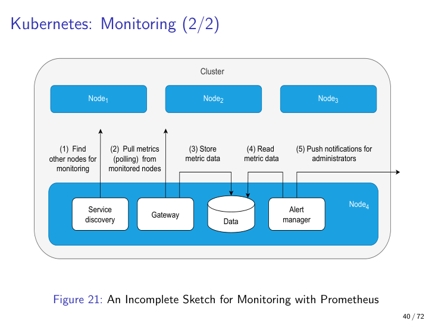

# Chapter 9: Scalability

> **Source lecture:** Lecture 7 (Jukka Ruohonen, 7 April 2026)
> **Primary analysis file:** `../analysis/lecture_7_analysis.md`
> **Sibling chapter you should keep open:** Chapter 8 (Performance) — this chapter is its sequel and references it constantly.

---

## 9.1 Opening: performance is not scalability

Almost every student writes "performance and scalability" in the same breath, and almost every exam question separates them on purpose. So let us settle the distinction first, because the rest of this chapter only makes sense once you have it.

**Performance** (Chapter 8) is about how fast *one* request gets answered, or how many requests *one* deployment can serve. It is a snapshot question. You measure latency, throughput, or jitter on a given configuration and you are done.

**Scalability** is the question Performance refuses to answer: *what happens when I add more resources?* A system is scalable if its performance can be **proportionally** increased by adding resources — more CPUs, more machines, more memory. The keyword is *proportionally*. Double the resources should roughly double useful capacity. A faster single machine improves performance and says nothing about scalability; a sluggish but well-engineered cluster can have terrible per-request latency *and* perfect scalability.

This is exactly mock question Q8: "What is the difference between performance and scalability?" The answer is two sentences:

> *Performance is the latency and throughput of a fixed configuration. Scalability is the proportional gain in performance per unit of added resource. A system can be performant without being scalable (a single very fast machine), and scalable without being performant (a cluster that doubles capacity each time you double nodes, but every individual request is slow).*

That is a full-marks answer. Notice it is **brief and prioritised** — the L7 mock warns explicitly that over-answering yields zero points. If a figure has `?` marks, identify the pattern and its rationale in one or two sentences. Do not retell the whole lecture.

The rest of this chapter unfolds in eight movements:

1. The mathematics of scaling (Amdahl, Gustafson).
2. The vocabulary of scaling (Kubernetes, service mesh).
3. The patterns of scaling (gateway, sidecar).
4. The directions of scaling (horizontal vs vertical, workload vs infrastructure).
5. The realities of scaling (autoscalers, geofencing, eventual consistency).
6. The load-balancing toolbox (static vs dynamic, DNS, CDN, SDN, L7).
7. The diagnostic lens (latency decomposition, Bondi's six dimensions, Bondi's checklist).
8. The investigative discipline (statistical debugging, triage).

By the end of it you should be able to draw the Kubernetes anatomy from memory, apply Amdahl to a numeric problem, and recite Bondi's six dimensions with a fail-mode example each. Those three are the exam's high-yield core.

---

## 9.2 Amdahl's law: the ceiling on parallel speedup

### Definition

For a workload with serial share `a` and parallel share `1 − a`, distributed across `p` processors, the speedup is

> **y = 1 / (a + (1 − a) / p)**

This formula is a recall item — write it down before reading on, if only to anchor it in muscle memory.

### Why it matters

Amdahl quantifies the *hard ceiling* on parallel speedup. As `p → ∞`, the parallel term `(1 − a)/p` vanishes and the speedup approaches

> **y_max = 1 / a**

So a workload that is 10% serial (`a = 0.1`) cannot be sped up beyond 10×, no matter how many cores you throw at it. The serial fraction is the architectural floor; only redesign — not more hardware — moves it.

### Explanation

A historical footnote that often appears in margins: Amdahl's 1967 paper had no equations at all. The formula above is **Gustafson's (1988) restatement** of Amdahl's argument. Gustafson then went further and pointed out that in real systems the *parallel share itself grows with problem size* — bigger inputs are often more parallelisable — so the practical speedup ceiling can be much higher than the static `1/a` suggests. This is sometimes called "scaled speedup." Hill & Marty (2008) refined the analysis again for asymmetric multi-core chips.

### Worked example

Suppose a batch ETL job's final "write to single output table" step is 20% of its runtime, and the rest is embarrassingly parallel. Then `a = 0.20`, `1 − a = 0.80`. With `p = 4` workers:

> y = 1 / (0.20 + 0.80 / 4) = 1 / (0.20 + 0.20) = 1 / 0.40 = **2.5×**

With `p = 16`:

> y = 1 / (0.20 + 0.80 / 16) = 1 / (0.20 + 0.05) = 1 / 0.25 = **4.0×**

With `p → ∞`:

> y_max = 1 / 0.20 = **5.0×**

So sixteen workers already extract 80% of the theoretical ceiling, and quadrupling to 64 workers buys you only fractional improvements. The lesson is operational: if the cloud bill quadruples but throughput improves by 15%, you have hit the Amdahl wall. Stop adding workers and rewrite the serial step.

### Analogy

A 10-leg relay race where one leg must be run alone. No matter how many spare runners you bring, the single-runner leg sets a floor on race time.

### Pitfall

Treating `a` as fixed across all workload sizes. Often `a` shrinks for bigger inputs (Gustafson's point); sometimes it grows (e.g., coordination overhead in distributed locks). Always state the regime in which you are claiming a value of `a`.

---

## 9.3 Service mesh ≈ cluster computing

Before the patterns, a vocabulary check. The lecture treats **service mesh** as roughly equivalent to **cluster computing** in the HPC sense: a layer that distributes workloads across many nodes and provides the plumbing (discovery, routing, retries, telemetry) for them to act as one system. Kubernetes is the canonical reference; Nomad, Mesos, and bare HPC schedulers occupy the same niche with their own vocabularies.

Strictly speaking the term "service mesh" often refers to the *inter-service communication layer* on top of an orchestrator — Istio and Linkerd are the textbook examples, both implemented as sidecars (see §9.5). Ruohonen treats orchestrator and mesh as interchangeable for QA purposes; you should too, unless an exam question specifically asks you to separate them.

**Analogy.** A shipping logistics network. Pods/containers are individual parcels. Nodes are warehouses. The mesh is the dispatching system that routes work and reassigns parcels when warehouses fill up.

---

## 9.4 Kubernetes anatomy (canonical here; Chs 10–11 reference back)

This is the chapter where Kubernetes vocabulary is introduced *properly*. Chapters 10 and 11 will reuse it for `securityContext`, privilege drop, and zero-trust sidecars, so commit it now.

### The hierarchy

- **Cluster** — the whole deployment. One or more nodes plus a control plane.
- **Node** — a virtual or physical machine. Runs exactly one **kubelet** and one **kube-proxy**.
- **Pod** — the unit of scheduling. Has its own IP address allocated from a node-level bridge subnet (e.g., `10.0.1.0/24`). Holds one or more containers.
- **Container** — the workload unit. Containers inside the same pod share `localhost`, POSIX shared memory, message queues, and local files.

Note the asymmetry: *pods*, not containers, are the unit Kubernetes schedules. You can put one container in a pod (common) or many (sidecar pattern); but you cannot move a single container off its pod.

### kubelet vs kube-proxy (textbook separation of concerns)

| Component   | Responsibility                                                     | Failure mode you'd see                  |
|-------------|---------------------------------------------------------------------|------------------------------------------|
| **kubelet**   | Per-node agent. Talks to the master. Starts/stops containers. Reports pod state and health. | Crash-loop restarts, "ImagePullBackOff", pods stuck in Pending. |
| **kube-proxy**| Per-node TCP/IP proxy + load balancer. Implements the Service abstraction. Can do DNS-based round-robin across pod replicas. | Traffic not reaching healthy pods, Service IP unreachable. |

If a pod refuses to start, blame kubelet. If healthy pods are not receiving traffic, blame kube-proxy. Distinguishing these in an exam answer is precision points.

**Analogy.** The cluster is an office building. Nodes are floors. A pod is an office room with one phone line (its IP). Containers are desks inside the room — people at the same desk just hand papers over (IPC); people in different rooms must phone each other (TCP/IP). The kubelet is the building manager (lights, water, leases); the kube-proxy is the receptionist routing visitors to the correct floor.

### Pod-to-pod vs container-to-container communication

This is a high-yield trade-off:

- **Containers in the *same* pod** communicate over **IPC / shared local storage** — POSIX shared memory, message queues, local files, a Unix domain socket. They bypass the network stack entirely.
- **Pods** communicate over **TCP/IP** via node-level bridges. Even on the same node this involves the kernel network stack, serialisation, and kube-proxy. Across nodes it adds physical NICs and possibly tunnels.

The performance gap is orders of magnitude. The classic pitfall is **premature decomposition**: splitting a chatty workflow into two pods "for cleanliness" turns whispers across a desk into couriers across town.

**Example.** A logging sidecar reading from a shared volume = local IPC. A logging *service* in a separate pod = TCP/IP per log line, plus an extra hop through kube-proxy.

---

## 9.5 The two cluster patterns: gateway and sidecar

These are the patterns the exam loves to put `?` marks on. Learn to recognise the topology in a diagram and explain the rationale in one or two sentences.

### Gateway pattern

**Definition.** A single component that fronts a set of services. It handles cross-service routing, protocol translation, and aggregation of high-latency network calls into low-latency local ones.

**Why.** Microsoft's catalog pattern. Two problems it solves:

1. **Client coupling.** Clients no longer need to know about every individual microservice or speak each one's protocol; they call one gateway.
2. **Latency.** Refactoring a client → 3 services topology (each call a high-latency external hop) into client → gateway → 3 services collapses three high-latency hops into *one* high-latency hop plus three local ones inside the cluster.

**Analogy.** A hotel concierge. Instead of guests calling housekeeping, room service, and the spa individually, they call the concierge who deals with all three on a local intercom.

**Pitfall.** The gateway is the obvious single point of failure. It must be replicated and load-balanced itself, partially defeating the simplification — but the latency win usually still pays for the extra plumbing.

### Sidecar pattern

**Definition.** Cross-cutting concerns (analytics, circuit breaking, logging, TLS, telemetry) live in their own container *next to* each business-logic container — usually inside the same pod, sometimes as a dedicated polling pod.

**Why.** It avoids duplicating cross-cutting code in every business service, and it leverages Kubernetes' co-location semantics so the sidecar and the business container share localhost.

**The three variants** the lecture sketches:

1. **No sidecar.** Each pod's business container also contains its own analytics + circuit-breaker code. Duplicated everywhere; impossible to update centrally.
2. **In-pod sidecar.** Analytics and circuit-breaker are separate containers inside the same pod. Communication is local IPC. This is what Istio's Envoy injection does.
3. **Standalone sidecar pod.** A dedicated `Pod4` hosts the analytics + circuit-breaker and is contacted via heartbeats or polling. Cleaner resource accounting; pays a TCP/IP cost per call.

**Analogy.** Literally a side-car on a motorcycle. The motorcycle (business logic) does the main work; the side-car (analytics) rides along but does not drive.

**Pitfall — Google 2024 image-size warning.** Stuffing too much into sidecars bloats pod image size. Autoscalers must download images when spawning new replicas, so a fat sidecar hurts **cold-start scalability**. Sidecars trade per-replica image weight for per-deployment code de-duplication; pick the trade consciously.

---

## 9.6 Horizontal vs vertical scaling — the 2×2 mental model

This is the cleanest exam-friendly mental model in Lecture 7. Internalise it.

**Two axes:**
- **Horizontal vs vertical.** Horizontal = *more* of the thing (replicas). Vertical = *bigger* version of the thing (more CPU/RAM).
- **Workload vs infrastructure.** Workload = pods. Infrastructure = nodes.

That gives four cells:

|                 | **Horizontal** (more replicas) | **Vertical** (bigger units)       |
|-----------------|----------------------------------|------------------------------------|
| **Workload (pods)**    | Add more pod replicas — the default Horizontal Pod Autoscaler (HPA) action. | Give each pod more CPU/RAM via resource requests/limits — usually needs a restart. |
| **Infrastructure (nodes)** | Add more nodes — the Cluster Autoscaler's job when no pod will fit. | Replace nodes with larger machine types — disruptive; rare in steady-state operations. |

**Analogy.** Horizontal = hire more cooks. Vertical = give each cook a bigger stove. The workload viewpoint is the cooks (pods). The infrastructure viewpoint is the kitchens (nodes).

**Worked example.** A traffic spike triggers the HPA to add 20 new pods (horizontal / workload). If the existing nodes do not have capacity to schedule those new pods, the **cluster autoscaler** kicks in and adds new nodes (horizontal / infrastructure). Vertical scaling does happen but typically as a one-shot tuning exercise, not as a reflex to load.

**Pitfall.** Reaching for horizontal scaling to fix a latency bug that is really *bad code or misconfiguration* (Dinesh 2018). Adding pods to a workload bottlenecked by a single shared DB lock makes the bill go up without making the system faster — this is Amdahl in operations clothing.

---

## 9.7 Autoscalers, cluster limits, and the cost of hyperscale

### Autoscaler

A dynamic algorithm that uses runtime metrics (typically CPU utilisation) to add or remove pods or nodes, bounded by user-set minimum and maximum replica counts. The Kubernetes HPA also scales *down* once load decreases — important for cost control and equally important for not being woken at 03:00 by an over-aggressive scale-up.

**Always set explicit min and max.** Unbounded autoscalers are the largest single source of "surprise cloud bill" incidents. Cross-ref Chapter 8: pair autoscalers with **throttling** to bound load before it reaches the autoscaler at all.

### Kubernetes hard limits

These are documented recall items:

- **≤ 110 pods per node**
- **≤ 5,000 nodes per cluster**
- **≤ 150,000 total pods per cluster**
- **≤ 300,000 total containers per cluster**

Above these you partition into multiple clusters.

**LUMI side-note.** Finland's LUMI supercomputer is in the global top ten with **362,496 cores** — well past the per-cluster limits above. So compute is partitioned into smaller logical clusters within these bounds. Worth name-dropping in an exam answer if asked about real-world hyperscale.

### Google (2024) recommendations

To make the autoscaler responsive:
- Minimise container startup and shutdown times.
- Keep images small — the autoscaler must download them per new replica (this is the same warning that caps sidecar fatness in §9.5).
- Watch logging volume: excessive logs become themselves a cost driver at cluster scale.

### Geofencing and eventual consistency

Two architectural concessions that hyperscale demands:

- **Geofencing.** Route clients to geographically near data centres. Danish users get Copenhagen, not Morocco.
- **Eventual consistency.** Replicated reads may return stale data. Not every read returns the most recent write.

Both are scaling levers. Both produce observable user behaviour: an edit not appearing on a colleague's screen for a few seconds; a CDN cache that is "warm" in one region and "cold" in another.

**Pitfall.** UIs that assume strong consistency (immediate read-your-writes) break subtly. Either accept eventual consistency in the UX or pay the latency cost of synchronous replication.

---

## 9.8 Load balancing — static vs dynamic, then DNS, CDN, SDN, L7

### Static vs dynamic algorithms

- **Static.** Distribute load without checking server state. DNS round-robin is the canonical example. Cheap. Provides crude failover (clients try next IP after timeout), but keeps routing to dead servers until each client times out.
- **Dynamic.** Use current state/health — heartbeats, polling, scheduling. This is what Chapter 7's *active-active* and *active-passive* load-balancing scenarios need. More expensive but supports true high availability.

**Pitfall.** Treating DNS round-robin as HA. It is not. Caches won't notice a dead server until they expire; clients won't until they time out.

### DNS-based load balancing (A records, MX records)

Servers publish multiple A (IPv4) or AAAA (IPv6) records under a single name; resolvers return them in rotated order. For email, **MX records** additionally carry priority numbers — pure round-robin is not the only DNS scheme.

**Worked flow (email).** Client → DNS query `MX domain.tld?` → resolver returns one or more mailservers, each with a priority → client picks an MX → queries its A records → gets a list of IPs → opens SMTP to the first that answers. The operator may host all those IPs on one machine (cheap, single point of failure) or several (better scalability and fault tolerance).

**Analogy.** A restaurant's flyer with a list of phone numbers — call the first; if busy, try the next.

### Content Delivery Network (CDN)

A geographically distributed network of caching proxies serving content on behalf of an origin. Configured by **aliasing DNS records** (CNAME) to the CDN operator (Cloudflare, Akamai).

**Multi-tier architecture.** Lower-tier edge data centres + higher-tier upstream centres + origin. A request hits the nearest edge; on cache miss it cascades to higher tier, then to origin. Subsequent requests hit the cache. Commercial offerings bundle DDoS protection, WAF, and DNS in the same product — which is why you often see Cloudflare in front of an entire production stack.

**Analogy.** A bookshop chain. Head office (origin) prints books, regional warehouses (higher tier) hold pallets, local branches (lower tier) hold one or two copies. If the branch is out, the warehouse fills the gap; only then does it touch HQ.

**Pitfall.** CDNs cache *static* content well. Dynamic personalised content needs careful cache-key design (or explicit bypass). And Cloudflare-style CAPTCHAs for AI crawlers can lock out legitimate users — the usability trade is real.

### Software-Defined Networking (SDN)

Networks where switches, routers, firewalls, and load balancers are configured by software (typically through a controller / IaaS like OpenStack), instead of hand-rewired hardware. The lecture's reference is OpenStack: compute, storage, and network nodes plus tunnel and VLAN networks, switches, firewalls, and DHCP services.

**Why scalability.** SDN bridges the low-level machine view, the middleware view, and the large-scale network view. Many cluster scalability tactics are *defined* in SDN terms — including L7 load balancing below.

**Cross-ref to Chapter 4.** SDN's **network segmentation** is the cluster-scale realisation of the **isolation / encapsulation** modifiability tactics from Lecture 3. Chapter 15 (Linux network stack) will show the actual base of OpenStack SDN (`br-int`, `br-tun`, `qbr`, `qvb`, `qvo`).

**Analogy.** Old telephony with operators rewiring jacks (hardware networking) vs. a modern PBX where extensions are reprogrammed in software.

### Layer-7 load balancing (OpenStack)

Routing at the **HTTP application layer**, using policy actions matched on rule types.

**Actions (in OpenStack):**
- `REJECT`
- `REDIRECT_TO_URL`
- `REDIRECT_TO_POOL`

**Rule types:**
- `HEADER`
- `PATH`
- `FILE_TYPE`

**Examples.**
- `REJECT` any request with header `DNT: 1` (turn away privacy-aware users — a controversial but real policy).
- `REDIRECT_TO_POOL Pool A` for requests with `PATH /web-api`.
- `REDIRECT_TO_POOL Pool B` for requests with `FILE_TYPE png`.

This is precisely the routing precision a Layer-4 (TCP) balancer cannot offer — at L4 you only see IPs and ports.

**Pitfall.** L7 policies are a *routing* tool, not a security one. Use a WAF for security rules. (Yes, commercial CDNs blur this; the architectural distinction still matters at exam time.)

---

## 9.9 Latency decomposition — y = a + b + c

A scalability QA cannot be diagnosed if you stuff all latency into a single number. Decompose it:

> **y = a + b + c**

where
- **a** = **networking** latency,
- **b** = **computing** latency,
- **c** = **I/O** latency (read + write).

Why this matters: optimising the wrong component is the most common waste of engineering effort. Speeding up `b` when the real bottleneck is a cross-region hop in `a` produces no user-visible improvement. With virtualisation (Kubernetes, OpenStack) the proportions shift compared with bare-metal — the same workload may be network-bound in a cluster but compute-bound on a bare machine.

**Recursion.** Each of `a`, `b`, `c` can be decomposed further. A request through a load balancer to a connection pool to a database has its own `a/b/c` at each hop; the lecture's slide 60 illustrates this nesting. Throughput also matters: at extreme throughput with minimal `a`, the choke point shifts to `b` and `c`.

**Analogy.** Total travel time = drive to airport + flight + drive from airport. Improving only one leg has bounded effect.

---

## 9.10 Bondi's six scalability dimensions

Bondi (2000) refines the vague single word "scalability" into six operational categories, each of which can fail independently. The exam may ask you to recite them and to apply them — the Bluetooth example below is the canonical fail-mode tour.

| # | Dimension                       | Definition                                                                                  | Bluetooth fail-mode example                                                                 |
|---|----------------------------------|----------------------------------------------------------------------------------------------|----------------------------------------------------------------------------------------------|
| 1 | **Load (time) scalability**       | Graceful behaviour as the request rate grows.                                                | Bluetooth holds up if a few headphones connect — pile on dozens of beacons and it chokes.   |
| 2 | **Space scalability**             | Graceful behaviour as data size grows.                                                       | Bluetooth's tiny MTU forces fragmentation; transferring a large file is painful.            |
| 3 | **Space-time scalability**        | Graceful in both — large data *and* high rate.                                               | Many small writers streaming concurrently saturate the radio and the protocol both.         |
| 4 | **Distance scalability**          | Works well over short *and* long distances.                                                  | Bluetooth simply does not reach across rooms (~10 m class-2). **Distance failure.**         |
| 5 | **Speed/distance scalability**    | Works well at high *and* low speeds across those distances.                                  | A fast-moving wearable loses sync quickly even within range. **Speed/distance failure.**    |
| 6 | **Structural scalability**        | The implementation and standards do not impede growth in object count within a chosen time frame. | Bluetooth's piconet design caps active devices per primary; the standard itself constrains growth. |

So **Bluetooth specifically fails on distance and speed/distance** — that is the canonical example Ruohonen uses. If asked for a system that fails Bondi's dimensions, Bluetooth is the safe pick.

**Pitfall.** Treating scalability as one knob. Bondi's taxonomy shows several orthogonal axes — a system can be excellent on load and space, terrible on distance.

---

## 9.11 Bondi's 6-point diagnosis checklist

When "the system is slow" is the only symptom, Bondi (2000) gives you a structured procedure:

1. **Identify absorbing states** — deadlocks, wholesale failures, anything from which the system cannot recover unaided.
2. **Identify parts that can run in parallel** — what can be moved out of the serial fraction (cf. Amdahl, §9.2).
3. **Identify self-expanding performance bottlenecks** — the cascading-failure analogue: a slow component that causes upstream queues to grow, which slows the system further. Throttling and circuit breakers (Chapter 8) are the textbook countermeasures.
4. **Identify and eliminate unproductive execution cycles** — work the system does that produces no useful output (busy-waits, polling loops, retries against an already-known-bad endpoint).
5. **Minimise temporary execution cycles** — work that is necessary but not on the critical path; push it to background queues or batch it.
6. **Identify whether scalability problems are scheduling problems** — sometimes the cluster has the capacity but the scheduler is wasting it.

**Pitfall.** Steps 1–6 mostly require **full runtime deployment**, which is itself hard at cluster scale. The NetBSD cautionary tale: planned automated benchmarks were dropped because they could not be made robust under virtualisation. This is why diagnosis and deployability are intertwined (cross-ref Chapter 6 on testability and deployability).

---

## 9.12 Statistical debugging and retrospective triaging

Traditional debugging — set a breakpoint, step through a trace — works for crashes. It does not work for "the cluster got 8% slower last Tuesday."

**Statistical debugging** (Song & Lu 2014; Bansal et al. 2020) diagnoses performance issues from **patterns across many runs and logs**. The skill set is closer to data science than to single-trace debug. Logs at cluster scale are:

- **Unstructured** or semi-structured.
- **High-velocity** (events per second).
- **Voluminous** (terabytes per day in big shops).
- **High-dimensional** (many tags, many sources, many fields).
- **Not retained long enough** to do the retrospective analysis you actually need.

**Retrospective triaging asks five questions:**
- What is the impact?
- Which users are affected (or what fraction)?
- Is the problem local or global?
- Is this a *known* bug?
- Has it happened before?

**Analogy.** Diagnosing flu in a population (epidemiology, statistics) vs. diagnosing one patient (traditional debug). Cluster performance is epidemiology.

**Pitfall.** Trying to reproduce a cluster perf bug locally. Many such bugs only manifest at scale — the load pattern, the timing, the cross-node coordination, none of which your laptop can recreate. Log-based statistical methods are the only realistic path.

---

## 9.13 Takeaways — what to drill before the exam

1. **Define scalability vs performance in two sentences.** Scalability is the *proportional* gain from added resources; performance is a snapshot. Mock Q8 wants exactly this.
2. **Recall Amdahl's formula and the 1/a ceiling.** `y = 1 / (a + (1−a)/p)`. Maximum speedup is `1/a`. Know what `a` and `p` mean.
3. **Walk the Kubernetes anatomy fluently.** Cluster → node → pod → container; kubelet does health/state; kube-proxy does TCP/IP routing. Hard limits: 110 pods/node, 5,000 nodes, 150,000 pods, 300,000 containers per cluster.
4. **Distinguish pod-to-pod TCP/IP from container-to-container IPC.** Orders of magnitude apart. Co-locate the chatty parts.
5. **Identify gateway vs sidecar on sight.** Gateway = fronts services for the *client*. Sidecar = wraps a service with cross-cutting *infrastructure*. Sidecar image size hurts autoscaler cold starts (Google 2024).
6. **Place an example in the 2×2.** Horizontal vs vertical × workload vs infrastructure. The HPA does horizontal-workload; the cluster autoscaler does horizontal-infrastructure.
7. **Know the load-balancing toolbox.** Static (DNS round-robin) vs dynamic (heartbeats + monitoring). CDN = multi-tier DNS-aliased cache + bundled DDoS/WAF. SDN = software-controlled networks (OpenStack). L7 = routing on HTTP semantics (`PATH`, `HEADER`, `FILE_TYPE` → `REJECT`, `REDIRECT_TO_URL`, `REDIRECT_TO_POOL`).
8. **Decompose latency.** `y = a + b + c`: network + compute + I/O. Throughput shifts the choke point. Each part decomposes further.
9. **Recite Bondi's six dimensions.** Load, space, space-time, distance, speed/distance, structural. **Bluetooth fails on distance and speed/distance.**
10. **Apply Bondi's 6-point diagnostic checklist** and pair it with the statistical-debugging mindset for performance regressions. Triage by impact / scope / known-bug.
11. **Answer style.** When a diagram has `?` marks, name the pattern and give one or two prioritised sentences of rationale. **Over-answering = zero points.** This is the explicit warning from L7 and it generalises across the whole exam.

---

> **Cross-references.**
> - **Chapter 8 (Performance)** — throttling pairs with autoscaling (§9.7); `y = a + b + c` (§9.9) is the latency vocabulary L6 establishes.
> - **Chapter 10 (Safety & Security Part 1)** — reuses the Kubernetes vocabulary above for `securityContext`, `runAsUser`, privilege drop.
> - **Chapter 11 (Security Part 2)** — reuses the sidecar pattern (§9.5) as the zero-trust enforcement point.
> - **Chapter 15 (Linux network stack)** — shows the bridges (`br-int`, `br-tun`, `qbr`, `qvb`, `qvo`) that sit *underneath* the OpenStack SDN of §9.8.
> - **Chapter 16 (MLOps)** — uses the same Kubernetes for model serving + GPU scheduling.
