# Chapter 10 — Safety and Security, Part 1

> *"Safety asks what if the bridge collapses. Security asks what if someone is trying to collapse it."*
> — paraphrased from Jukka Ruohonen, Lecture 8 (April 14, 2026)

## Opening — why safety and security share a lecture

For the rest of the course you have studied quality attributes that describe how a system behaves **in normal operation**: testability, modifiability, integrability, availability, scalability. This chapter is the first of two on QAs that describe how a system behaves when **something has gone wrong** — when a sensor lies, when a process crashes in mid-write, when an attacker is *trying* to make it crash, when an LLM agent decides to follow an instruction it found inside a web page it was supposed to summarise.

Safety and security are taught in one lecture for three concrete reasons, and you should be ready to defend each one on the exam:

1. **They are both failure-mode QAs.** Neither is about doing the right thing faster or with less code; both are about behaving acceptably when the world (or an adversary) sends something nasty into the system. That shared shape lets them share a single mental rhythm — *detect / repair / reintroduce / prevent*, the same vocabulary used for availability in Chapter 7.
2. **Their tactics trees rhyme.** Safety branches into *Avoidance / Detection / Containment / Recovery*. Security branches into *Detect / Resist / React / Recover*. Two of the four leaves are identical (Detection, Recovery); a third (Containment ≈ Resist) describes the same idea — "do not let the bad thing spread" — at different abstraction levels; only the first leaf differs in spirit (Avoid the unsafe state vs. Detect the adversary). Once you have learned to draw one tree, the second costs you very little.
3. **They share architectural primitives.** Monitor-actuator, validators, brokers, barriers, isolation, redundancy, audit — these mechanisms appear on both sides of the safety/security boundary. A SIEM is a *security* application of the same pipe-and-filter pattern (Ch 3) that a sensor-voting system uses for *safety*.

The single axis on which they cleanly separate is the **intentional adversary**. Safety is neutral about *why* a system entered an unsafe state — it could be rust, a cosmic ray, a bug, or sabotage. Security always presumes an actor with intent. This single axis is the most common exam-question hook in the lecture; if a scenario says "an attacker" you are in security-land, if it says "a sensor failure" you are in safety-land, and if it says "the brakes failed because someone disabled them" you are in **both**.

This chapter walks the safety half first (definition, scenarios, tactics, monitor-actuator), then makes the hinge explicit, then walks the security half (definition, scenarios, tactics, SIEM), then spends the rest of its budget on the **fresh material** that came out of this lecture for the first time: OWASP Top-10 for LLMs, the LLM gateway, input validation, trust boundaries for agentic AI, identity-binding (Sierra 2026), the CB4A credential broker, and the canonical privilege drop / privilege separation patterns from qmail, Postfix, Kubernetes, and OpenBSD `pledge`. Privilege drop is canonically *here* — Chapter 11 will refer back to this chapter for it.

A short navigation note before we start. Chapter 11 (the second of these two security chapters) deepens security into the Microsoft Security Development Lifecycle, threat modelling, the cyber kill chain, zero-trust + sidecar, MitM, and the cryptography lifecycle. Where Chapter 10 introduces a concept (e.g. *least privilege*), Chapter 11 will tend to embed it in a process (e.g. SDL Gate 3). Chapter 9 (Kubernetes/Scalability) is the prerequisite for the `securityContext` discussion below. Chapter 7 (Availability) is the prerequisite for the fault/failure overlap with safety. Chapter 13's pattern catalogue houses the canonical write-ups of SIEM, broker, monitor-actuator, and sidecar.

---

# Part A — Safety

## 1. Safety as a quality attribute

**Definition.** A system's ability to **avoid straying into states that cause or lead to damage, injury, or loss of life to actors in its environment** (Bass et al. 2021).

**Why it matters.** Safety is one of the only QAs in the course defined entirely around *impact on the physical world*, not on the system itself. Availability cares whether the service is up; safety cares whether the service is up *and not killing anybody*. That impact dimension — damage / injury / loss of life — is what separates safety from every other QA in your toolkit.

**Detailed explanation.** Read the definition again and notice what it does *not* say: it says nothing about why the system entered the unsafe state. The cause could be a sensor that rusted shut, a software bug that overflowed a buffer, a configuration mistake, a cosmic ray flipping a bit in DRAM, or a malicious adversary cutting a wire. Safety as a QA is **agnostic about the source of the fault** — what matters is the consequence in the physical world.

This neutrality is exactly the axis on which safety differs from security. Security always presupposes intent. Safety covers *all* paths into the unsafe state, intent-bearing or not. Many safety tactics will therefore re-use availability/fault-tolerance vocabulary (redundancy, sanity check, timeout) — what is genuinely new is the **impact framing** and a small handful of tactics like *barrier* and *abort* that exist because the consequence is physical, not informational.

**Analogy.** A railway-crossing barrier is a safety device whether it fails because of a rusted hinge (no attacker), a sensor glitch (no attacker), or a vandal cutting the cable (attacker). All three threaten the same outcome — a car on the track — so safety engineering must cover all three. The barrier doesn't care whose fault it was; it only cares whether the bar comes down in time.

**Example.** A medical infusion pump that locks itself into "stop infusion" if its dose sensor reports a value outside the configured range is using the *abort* impact-limiting tactic. The dose sensor might be miscalibrated, the firmware might have a bug, or the device might have been tampered with — the pump's response is the same.

**Common pitfall / nuance.** Students reflexively equate safety with security, or with reliability, or with availability. The relation between safety and security is **asymmetric**: insecurity *can* cause safety failures (an attacker turns off a brake), but a safety failure rarely implies a security failure (a rusted hinge is not a security incident). The relation to availability is **overlap, not identity**: a system can be available and unsafe (a runaway robot that never crashes), or unavailable but safe (a robot that powered itself off when it lost sight of a human).

---

## 2. The safety scenario template

**Definition.** A six-part description of a safety-relevant situation — **Source, Event (stimulus), Environment, System (artifact), Response, Response measure** — instantiated with safety-specific vocabulary.

**Why it matters.** Every QA in this course is taught with the same scenario template (Chapter 2 introduced it); safety's variant gives you the **unsafe state** as the central concept that the response and measure both refer back to.

**Slot meanings, populated for safety.**

| Slot | What goes in it (safety flavour) |
|------|----------------------------------|
| Source | User action, data source, time source |
| Event | **Omission** (a value/call never arrives), **Commission** (an incorrect execution, spurious event/data), **Timing** (too late, too early, wrong order, wrong rate) |
| Environment | Normal operation, degraded operation, maintenance, manual override |
| System | The (sub-)system whose behaviour the scenario constrains |
| Response | Avoid an unsafe state; recover; continue in degraded/safe mode; shutdown gracefully; switch to manual; switch to backup; notify; log entries into unsafe states |
| Response measure | *Share* and *time* in unsafe / degraded / manual / shutdown states |

The three event categories — **omission**, **commission**, **timing** — are the high-yield item to memorise. Almost every safety scenario can be cast as one of them: a thing didn't happen (omission), a thing happened wrong (commission), or a thing happened at the wrong moment (timing).

**Worked example.**
> *"When a temperature sensor stops sending readings (**omission**) during normal operation (**environment**), the boiler controller (**system**) must enter a safe-stop within 200 ms (**response**) with at most 0.1 % of such events failing to reach safe-stop (**response measure**)."*

**Analogy.** Like an aviation incident report template — every field forces you to specify a property you would otherwise hand-wave. Who, what, when, where, how the plane responded, how long it took to stabilise. The template is not paperwork; it is a *design constraint generator*, just like the testability template in Chapter 5.

**Pitfall.** Students conflate "shutdown gracefully" with "abort". *Abort* is one impact-limiting tactic. *Graceful shutdown* is a **response category** that may or may not use abort. A boiler that depressurises slowly is shutting down gracefully without aborting; a boiler that slams its emergency-stop valve is aborting.

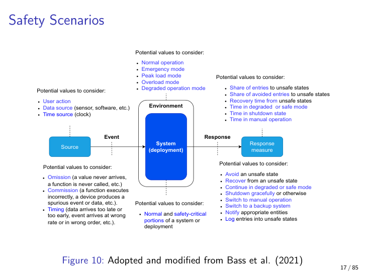

*Figure 10.1 — Safety scenario template. The event categories (omission / commission / timing) and the impact-framed response measure (share/time in unsafe state) are what distinguish this from other QA scenarios.*

---

## 3. The safety tactics tree

**Definition.** A categorised inventory of design moves for safety, grouped under **Avoidance**, **Detection**, **Containment**, and **Recovery**.

**Why it matters.** It is the directly examinable structure that mirrors the QA-tactic-tree pattern set up in lectures 3–7. If you can draw availability's tactic tree, you can draw safety's by re-using two branches verbatim and adding two more.

**The four branches and their leaves.**

- **Avoidance** — don't go near the unsafe state at all.
  - *Substitution* — replace the dangerous component with a safer one.
  - *Predictive models* — anticipate unsafe trajectories before they happen.
- **Detection** — notice that the system is entering, or has entered, an unsafe state.
  - *Sanity check* — does this value even make sense?
  - *Comparison* — is this reading consistent with the others?
  - *Timeout* — has this taken too long?
  - *Monitoring* — keep watching even when nothing is wrong.
  - *Timestamps* — when did this happen, in what order?
- **Containment** — once the unsafe state happens, do not let it spread.
  - *Redundancy* — Replication, Analytical redundancy (compute the same value two different ways), Functional redundancy (provide the same function two different ways).
  - *Limit impact* — Masking (hide the effect), **Abort** (stop the operation hard), Degradation (continue in a reduced mode).
  - *Barrier* — Firewall (security-specific variant), generic Barrier (a physical/logical wall stopping propagation).
- **Recovery** — return the system from an unsafe to a safe state.
  - *Isolate* — keep the bad part off the network/bus.
  - *Removal from the system* — eject the failing component.
  - *Transactions* — atomic units of change that roll back on failure.
  - *Predictive models* — used here to forecast safe recovery trajectories.
  - *Exception prevention* — avoid the situation that triggers the recovery.
  - *Increase competence* — pull in a human expert.

Most of these leaves overlap with availability/fault-tolerance tactics from Chapter 7 — sanity check, comparison, timeout, monitoring, replication, isolation, transactions. The *genuinely safety-flavoured* leaves are **Barrier** (think a blast wall between an unsafe state and the people it would harm), **Abort** (the controlled hard-stop), and the fact that **Increase competence** is filed under Recovery — sometimes the correct architectural move is "bring in a human".

**Analogy.** Castle defence in layers — moat (avoidance), watchtower (detection), inner wall (containment), siege-recovery plan (recovery). Each layer assumes the previous one has failed.

**Example.** A nuclear control room. Three independent sensors (**Redundancy/Replication**), a voting circuit that compares them (**Detection/Comparison**), a SCRAM button that drops the rods into the core (**Containment/Limit-impact/Abort**), and physically isolated coolant loops so a leak in one cannot contaminate the others (**Recovery/Isolate**). One leaf from each branch, one diagram.

**Common pitfall / nuance.** Students forget that **Increase competence** is a tactic — it sounds non-architectural, but bringing a human into the loop *is* an architectural decision: it determines how the system exposes state, what manual-control affordances exist, what training the on-call engineer needs. Treat it as first-class.

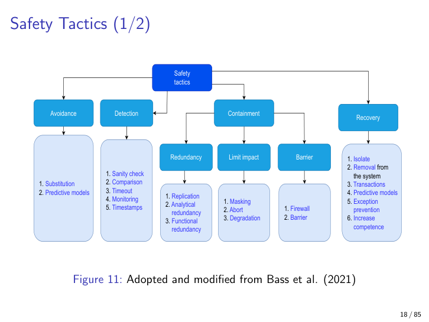

*Figure 10.2 — The safety tactics tree. Containment is the sub-branch where safety-specific vocabulary (Barrier, Abort) appears most distinctly.*

---

## 4. Monitor-actuator pattern (the canonical safety pattern)

**Definition.** A safety pattern in which a software actuator's commands are checked by an **independent monitor** before they reach the hardware actuator. On a faulty check the operation is either **dropped (Variant A)** or **actively aborted (Variant B)**.

**Why it matters.** It is the clean, exam-friendly synthesis of redundancy + sanity check + barrier + assertion tactics into one pattern with a name. The lecture explicitly identifies it as the canonical safety pattern of the chapter.

**Detailed explanation.**

- **Variant A — verify, then forward** (permissive). The monitor sees the software actuator's command, checks it against a specification, and *only* forwards it to the hardware actuator if the check passes. If the check fails, the command is silently dropped. Useful when "do nothing" is a safe default.
- **Variant B — verify, then abort on fault** (active). On a faulty check the monitor does not just suppress the command; it *escalates* by aborting the path entirely — cutting power, raising an interlock, halting the motor. Useful when "do nothing" is not safe (a robot in mid-swing).

Both variants depend critically on the **independence** of the monitor. If the monitor and the software actuator share their failure mode — same code path, same clock, same power supply, same library bug — then a single fault knocks out both and the pattern degenerates into theatre. Independent power, independent clock, ideally a different programming language and a different team are the textbook recommendations.

The pattern is a worked example of **multiple tactics combining**: the monitor is *redundancy* (it duplicates judgement), it performs *sanity check* and *comparison* (the leaves under Detection), and on fault it triggers *abort* (under Containment/Limit impact). One pattern, four tactics.

**Analogy.** A second pilot whose only job is to verify the captain's commands before the autopilot accepts them. The second pilot's seat is wired to a different electrical bus, fed by a separate instrument panel, and follows a checklist written by a different team. The "veto" power is the abort variant; the "approve" power is the forward variant.

**Example.** In an industrial robot, the motion controller (software actuator) sends a position command. A watchdog co-processor (monitor) verifies that the command stays within the geometric envelope the robot is allowed to occupy. If yes, the servo amplifier (hardware actuator) drives the motor. If no, depending on the variant chosen, either the command is dropped (Variant A — the robot pauses) or the safety contactor is opened (Variant B — power is cut to the servo).

**Common pitfall / nuance.** The independence requirement is the one students forget. A monitor that runs as a thread in the same process, on the same CPU, with the same library version, against the same memory image as the actuator is *not* independent — a buffer overflow in the actuator will corrupt the monitor's state, too. The monitor must be a logically (and ideally physically) separate component.

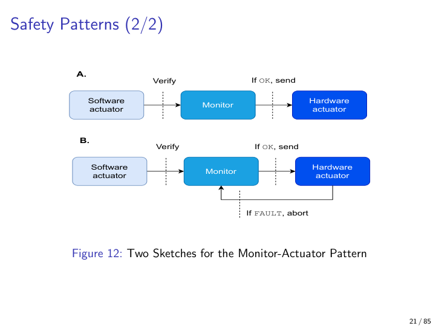

*Figure 10.3 — Monitor-actuator pattern, two variants. The independence of the monitor is what makes the pattern more than wishful thinking.*

---

# Hinge — why safety and security share a lecture

You have now seen the safety half: a QA defined by impact (damage / injury / loss of life), a scenario template hinged on omission/commission/timing, a tactics tree (Avoidance / Detection / Containment / Recovery), and a canonical pattern (monitor-actuator). The next half — security — will look uncannily familiar.

Three observations bind the two halves together and you should be ready to articulate each one:

**1. Both are failure-mode QAs.** Neither is about doing the right thing; both are about behaving acceptably *when something has gone wrong*. The shared rhythm is what Chapter 7 (Availability) called **detect / repair / reintroduce / prevent** — find the bad event, fix the damage, bring the component back, stop it from happening again. Safety phrases this as Detect-Contain-Recover (with Avoid bolted on the front); security phrases it as Detect-Resist-React-Recover (with React bolted on between Resist and Recover for notification/audit reasons). Same shape, different vocabulary.

**2. They differ on one axis only: the intentional adversary.** Safety is neutral about cause. Security assumes intent. Everything else — scenarios, tactics, patterns — bends around that single axis. If you can articulate this single difference clearly, you can answer almost every "compare and contrast" exam question about safety vs. security.

**3. They share architectural primitives.** Brokers, validators, monitors, barriers, isolation, redundancy, audit, voting — these primitives reappear on both sides of the line. A SIEM is a *security* application of the same pipe-and-filter pattern (Chapter 3) that a triplicated sensor system uses for *safety*. The monitor-actuator pattern reappears, lightly disguised, as the *enforcer + validator + specification registry* triad of input validation in §6. This is also why the course's pattern catalogue (Chapter 13) houses both safety and security patterns under one roof.

A scenario can simultaneously involve safety *and* security — an attacker disabling the brakes of a car is both a safety failure (the brakes don't work) and a security failure (someone with intent caused it). When you see such a scenario on the exam, name both QAs, but be precise about which tactic family addresses which aspect.

---

# Part B — Security

## 5. Security as a quality attribute (and the CIA triad)

**Definition.** A QA concerned with system properties **under intentional adversarial action**. Canonical violations are framed as the **CIA triad**:

- **Confidentiality** — only authorised parties can read protected data.
- **Integrity** — protected data and computations cannot be modified by unauthorised parties.
- **Availability** — authorised parties can use the system when they need to.

**Why it matters.** The triad gives you a vocabulary for *what* an adversary might be trying to violate, which in turn shapes both the scenario template (events are CIA violations) and the tactics tree (the four leaves are how you respond at each phase of an attack). The lecturer's framing is deliberately classical — Confidentiality / Integrity / Availability, in that order — because almost every security incident in the news reduces to one of those three violations.

**Detailed explanation.** Security scenarios differ from safety scenarios mainly in the **source** slot — instead of "user / data / time", security sources span *insider / outsider, human / machine / AI, known / unknown*. Events are CIA violations. Responses include security controls, authentication, authorisation, encryption, logging, incident management, damage control. Measures expand beyond latency into **attack detection accuracy, blast radius, time-to-discover, time-to-notify, time-to-recover, financial losses, legal consequences, post-incident analysis**.

Notice the regulatory framing in those measures. *Time-to-notify* is on the list because the GDPR (72 hours to the regulator) and the Cyber Resilience Act both impose statutory clocks. *Financial losses* and *legal consequences* are on the list because security failures cost money in fines, not just in engineering time. Security as a QA has a stronger interface with law than any other QA in the course.

**Analogy.** Safety asks "what if the bridge collapses?". Security asks "what if someone is trying to collapse it?". The same bridge, the same physics — but a different threat model and a different set of defensive moves.

**Example.** A ransomware attacker exfiltrates database backups. This is a *confidentiality* violation by an *external human* (or a botnet they control). The response measure includes **blast radius** (which records were leaked? all customers or only one tenant?) and **time-to-notify** (the regulator clock under GDPR/CRA starts the moment you know).

**Common pitfall / nuance.** Even when the immediate stimulus is machine-generated — a botnet, an AI agent, a self-replicating worm — *someone still controls the botnet*. The actor abstraction in security stays human even when the network packets are machine-emitted. Be careful in exam answers not to attribute autonomy to the malware itself.

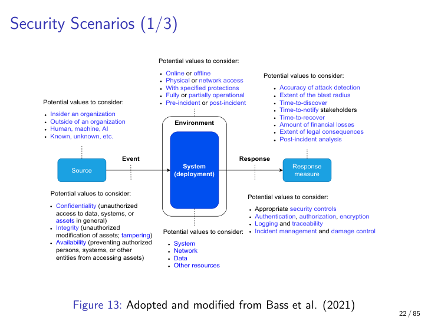

*Figure 10.4 — Security scenario template. The source slot widens (insider/outsider, human/machine/AI), events become CIA violations, and the measures pick up regulatory clocks.*

---

## 6. The security tactics tree (Detect / Resist / React / Recover)

**Definition.** Four-branch tree of security design moves: **Detect**, **Resist**, **React**, **Recover**.

**Why it matters.** Maps the CIA-anchored scenario above to architectural moves the student can name in an exam. This is high-yield: drawing the tree with at least two sub-tactics per branch is on the list of explicit goals for the chapter.

**The four branches and their leaves.**

- **Detect** — notice the attack.
  - *Intrusions* — someone is in who shouldn't be.
  - *Service denials* — something is being overwhelmed.
  - *Integrity violations* — something has been changed that shouldn't have been.
  - *Anomalies* — something is statistically off, even if not yet attributable.
- **Resist** — make the attack fail (or at least cost more than its expected payoff).
  - *Threat modelling* — yes, threat modelling is itself a tactic (it is an architecture-time activity, not just a runtime mechanism — see Chapter 11 for the full SDL treatment).
  - *Authentication* — who is this?
  - *Authorisation* — are they allowed to do this?
  - *Isolate* — keep the dangerous bit in its own box.
  - *Minimise attack surface* — fewer doors mean fewer ways in.
  - *Limit resources* — rate-limit, quota, budget cap.
  - *Encrypt* — make the data unintelligible without the key.
  - *Validate input* — the central tactic of §10 below.
  - *Change credentials* — rotate keys, passwords, certificates.
  - *Revoke access* — kick the adversary out, even if they're already in.
  - *Restrict access* — narrow what the credential can do.
- **React** — respond once an attack is in progress or has succeeded.
  - *Inform actors* — tell the user, tell the operator.
  - *Audit* — log everything for forensics.
  - *Non-repudiation* — bind every action to an identity, so the actor cannot later deny it.
  - *Inform stakeholders* — regulators, customers, board, press.
  - *Minimise damage* — quarantine, throttle, reduce blast radius.
- **Recover** — return to a clean operating state.
  - *Isolate* (shared with Resist) — keep the compromised part away from the rest.
  - plus the usual recovery vocabulary (restore from backup, replay, re-issue credentials, rebuild).

The course concentrates on **SIEM** (a Detect realisation, §7), **input validation** and **attack-surface minimisation** (Resist, §10–§11), and **authentication/authorisation in the LLM/agentic context** (§14–§15).

**Analogy.** A bank's security stack: cameras and alarms (Detect), vaults and guards (Resist), call the police and freeze the account (React), insurance and rebuild (Recover).

**Example.** Rate-limiting an API endpoint = *limit resources* (Resist). Blocking a host after detection = *revoke access* (Resist) plus *inform actors* (React). Recovering a compromised account from a backup = *isolate* + *change credentials* (Recover + Resist).

**Common pitfall / nuance.** Students forget that **threat modelling** is itself a tactic. It feels like a process or a meeting, not an architecture move — but the lecturer counts it as a Resist tactic because the architecture you produce afterwards is shaped by what the threat model surfaced. Chapter 11 will treat threat modelling as a first-class activity in the Microsoft SDL.

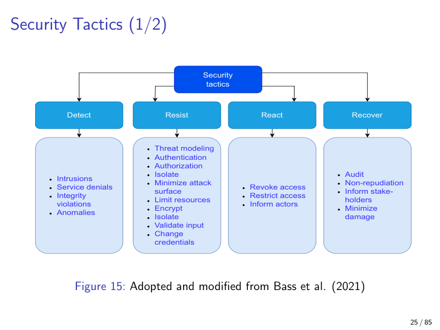

*Figure 10.5 — Security tactics tree. Note how Detect/Recover mirror safety verbatim; Resist is the security flavour of Containment; React is the new branch that doesn't appear in safety.*

---

## 7. SIEM / SOC — the broker pattern in action

**Definition.** A **Security Information and Event Management (SIEM)** system centralises security telemetry from across an organisation. A **Security Operations Centre (SOC)** is the organisational counterpart — the room, the team, the on-call rota — and is often used as a near-synonym for SIEM.

**Why it matters.** SIEM is the canonical *Detect-tactic* realisation at scale. It is also a working example of brokers, filters, and the **pipe-and-filter** pattern from Chapter 3. If you can recognise that a SIEM is "the broker pattern applied to security events", you have answered half of the exam questions you might be asked about it. **(Cross-reference: Chapter 3 introduced the broker as a many-to-many mediator; the SIEM uses brokers at every stage where the relationship is many-to-many — many sources, many alerts, many subscribers.)**

**Detailed explanation.** Internal sources (IDS, spam filters, firewall logs, audit trails, application logs) and external sources (threat-intelligence feeds, vulnerability databases) flow into the pipeline in roughly this order:

```
   IDS / firewall / app logs / audit trails / threat feeds
                            │
                            ▼
                     Log broker  ◄── many sources → one bus
                            │
                            ▼
                     Log filter  ─── drop noise, keep candidates
                            │
                            ▼
       Raw archiver ◄── Normaliser ── Enricher (geo-IP, threat intel)
                            │
                            ▼
                     Event broker ◄── many normalised streams → one bus
                            │
                            ▼
                     Alert broker ─── correlation, deduplication, scoring
                            │
                            ▼
     Archiver ◄── GUI (analyst dashboard) ── Email/SMS notifier
```

Brokers are drawn at the points where the relationships are **many-to-many** — many log sources need to fan out to many normalisers, many alerts need to fan out to many subscribers. This is exactly the situation that the broker pattern (Ch 3) was invented to handle, and the SIEM is a textbook realisation. The filters between brokers are the *pipe-and-filter* part: each stage transforms the stream into a more refined form (raw → normalised → enriched → event → alert).

Vakulov (2026) argues the human-analyst workload at the *GUI* stage has two functions:

1. **Classify maliciousness** — is this alert a true positive?
2. **Act on true positives** — invoke the playbook, page the on-call, contain the host.

AI can reduce both via **operational autonomy** (the AI handles the boring true negatives), **analytical assistance** (the AI suggests a classification), and **delegated decisions** (the AI is allowed to act on low-stakes responses). The 2026 framing is that the SIEM stays the same; the analyst gets an AI co-pilot.

**Analogy.** Air traffic control tower. Every radar, weather station, transponder, and pilot transmission funnels into one room where humans (and increasingly software) decide what is anomalous and what action to take. The radar feeds are the log sources; the consoles are the analyst dashboard; the controllers are the SOC team.

**Example.** A login attempt arrives from a country the user has never logged in from. The audit trail in the application emits an event → log broker → log filter (passes, it's not noise) → normaliser (parses the `auth.log` line into a structured event) → enricher (geo-IP lookup plus threat-intel reputation on the source IP) → event broker → alert broker (correlated with two other login attempts in the last hour from neighbouring IPs — scored as suspicious) → GUI (analyst sees it on the dashboard) → SMS to on-call (notifier).

**Common pitfall / nuance — the bottleneck.** The lecture asks where the bottleneck is in this architecture. The answer is **the GUI/analyst stage** — it is the human throughput limit. Every other stage scales horizontally; analysts do not. This is why Vakulov's 2026 framing focuses on AI relief for that one stage, and it is also a useful reminder that *security* problems often have *performance/usability* bottlenecks (a SOC analyst with too many alerts to triage is a security problem caused by performance).

A second pitfall: students sometimes describe the SIEM as event-driven *only*. It is event-driven, *with brokers between stages*. The "with brokers" is the part the lecture wants you to name explicitly, because that is the architectural choice — anyone can wire components in series, the broker is what lets many-to-many relationships emerge.

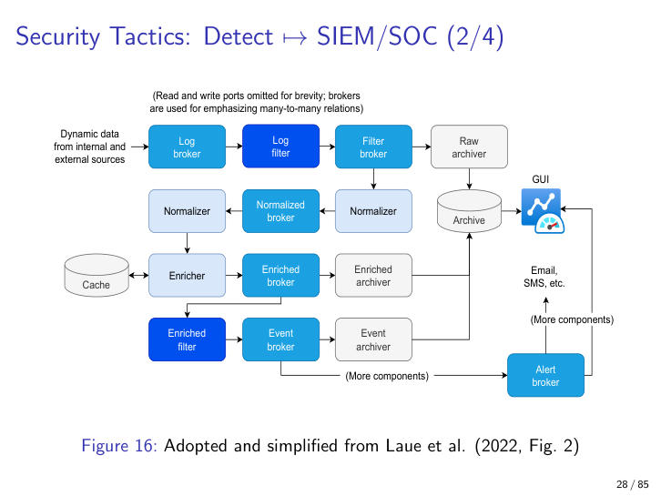

*Figure 10.6 — SIEM as pipe-and-filter with brokers. Brokers appear wherever the relationship is many-to-many; the bottleneck is the GUI/analyst stage.*

---

## 8. OWASP Top-10 for LLM applications (2024/2025) — fresh material

**Definition.** A community-curated list of the ten most critical security risks for **LLM-based** systems. This list is freshly examinable in 2026 and is the launching pad for the rest of the chapter.

**Why it matters.** It is the closest thing to a canonical *LLM threat catalogue*, and the lecturer signposted it as the structure that organises everything after the SIEM section.

**The list (memorise the names; you do not need verbatim descriptions, but you should be able to recognise each on a scenario).**

| # | Risk | One-sentence shape |
|---|------|--------------------|
| 1 | **Prompt injection** | Adversary inserts text that the LLM treats as instructions, not data. |
| 2 | **Information disclosure** | The model leaks secrets, PII, or training data through its outputs. |
| 3 | **Supply chains** | A compromised model, dataset, plugin, or library reaches your runtime. |
| 4 | **Data and model poisoning** | Adversary corrupts training data or model weights, biasing future outputs. |
| 5 | **Improper output validation** | Downstream systems trust the LLM's output as if it were safe code/SQL/HTML. |
| 6 | **Excessive agency** | The agent has too many tools, too few guardrails, or too broad authority. |
| 7 | **Prompt leakage** | The system prompt (with its instructions, examples, secrets) leaks to the user. |
| 8 | **Embedding weaknesses** | Vector DBs leak, allow inversion, or accept poisoned embeddings. |
| 9 | **Misinformation** | The model produces confidently false output that downstream actors trust. |
| 10 | **Unbounded resource consumption** | A prompt drives the model into runaway cost, latency, or token consumption. |

**Detailed explanation.** Note that these categories **overlap heavily**. A prompt-injection payload (#1) may also be data poisoning (#4) if it persists in memory or in a retrieved document. The Telnyx/litellm supply-chain incident from April 2026 — a malicious package release on the LiteLLM stack — is simultaneously #3 (supply chain) and arguably #4 (effectively model/data poisoning at the package level).

The lecture's caution is therefore: **do not treat the list as orthogonal categories**. Think in *attack sequences*. A typical agentic attack chain looks like:

> Agent → fetches content from a malicious page (#1 prompt injection inside the page) → interprets injected instruction → calls a malicious tool installed by supply-chain compromise (#3) → exfiltrates secrets via DNS (#5 improper output validation lets it through).

The exam question to expect is "label the OWASP risks present in this scenario" rather than "define risk #6 in isolation".

**Analogy.** Like a chef's "top 10 kitchen hazards". Fire and burns and oil splatters aren't really separate problems when the oven explodes; they are co-occurring symptoms. The list is a *checklist for design reviews*, not a taxonomy with clean partitions.

**Example.** The Telnyx/litellm supply-chain incident: a malicious release on a widely depended-upon library affected every downstream agent that installed it within the window before detection. Map to OWASP: **#3 supply chain** is the primary label, but downstream impact is **#4 model/data poisoning** (the package modified prompts or outputs) and **#2 information disclosure** (any secrets touched were exposed).

**Common pitfall / nuance.** Reflexively treating the list as orthogonal categories. The lecturer explicitly cautions to think in attack sequences. Also: do not confuse OWASP **Top-10 for LLM** (this list) with OWASP **Top-10 for Web Applications** (a separate, older list — injection, broken auth, etc.) or OWASP **CI/CD Top-10** (Chapter 11's territory).

---

## 9. LLM gateway placement — the broker pattern again

**Definition.** A **gateway** component that mediates between the internal system and external LLM providers (OpenAI, Anthropic, etc.), enforcing rate limits, budget caps, routing, authentication, and policy.

**Why it matters.** It (a) reduces attack surface by collapsing many trust boundaries into one, (b) centralises policy enforcement, and (c) makes the *trust boundary* between internal code and external LLMs explicit instead of implicit. It is also, again, the **broker pattern** (Ch 3) applied to a new context.

**Detailed explanation.** Without a gateway, every microservice that talks to an LLM is its own trust boundary, its own place to leak secrets, its own place to apply (or forget to apply) rate limits, its own potential exfiltration channel. With a gateway, there is **one chokepoint** to monitor, rate-limit, budget, and inspect — and exactly one place to attack, which is itself a risk that must be designed for (isolation, replication, least privilege of the gateway itself).

The gateway sits **behind firewalls/IDS on the local network**, exposed to internal services, and brokers all outbound LLM traffic. Typical responsibilities:

- Authenticate the *calling service* (mTLS, service tokens).
- Authorise per-service: "service A is allowed to call provider X with a $100/day cap".
- Rewrite prompts to strip PII before they leave the perimeter.
- Inspect responses for policy-violating output (jailbreaks, leaked secrets).
- Log every request and response for audit (non-repudiation, §15).

**Analogy.** A corporate VPN concentrator. Instead of every laptop dialing the internet directly, all traffic threads through one inspected pipe where the security team can apply policy.

**Example.** An internal RAG application routes every embedding-and-generation call through `llm-gateway.internal`. The gateway checks the caller's service token, enforces a $/day budget, rewrites the prompt to strip detected PII, calls the chosen upstream provider, inspects the response, and logs the entire exchange.

**Common pitfall / nuance.** The gateway can become **the bottleneck** and **a single point of compromise** — design it like any other critical infrastructure: isolation, replication, monitoring, least privilege, breakglass. A compromised gateway is worse than a compromised service, because the gateway has everyone's secrets.

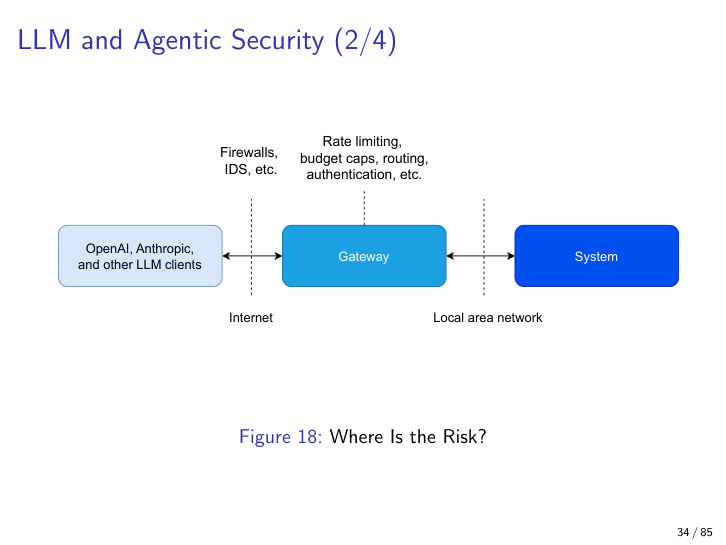

*Figure 10.7 — LLM gateway placement. The gateway is the broker pattern (Ch 3) re-used to centralise the trust boundary between internal services and external LLM providers.*

---

## 10. Input validation — the central security tactic

**Definition.** The architectural tactic of **checking all data crossing a trust boundary against a specification before processing**.

**Why it matters.** The lecture is blunt: roughly **99 % of attacks involve malicious input**. If you remember exactly one Resist tactic, remember this one. It is the bedrock of every other security move; without it, encryption, authentication, and least privilege all collapse because the attacker is already inside.

**Detailed explanation — what counts as input.** A TCP/IP packet is input. So is a config file, a CLI argument, an LLM response, an HTTP header, a JSON body, a filename in a directory you didn't create, a database row in a DB you share with another tenant, an environment variable, a clipboard paste, a row in a CSV someone emailed you. *All of these cross a trust boundary, and all of them must be validated.*

To validate well, the architect must (a) understand which components are external-facing and (b) trace the propagation of input through the system — because input from an "internal" service may have originated externally three hops upstream.

**The Arce et al. (2014) five design principles — exam-quotable.**

1. **Use a centralised validator.** A single, audited validator component (preferably built on a well-known library — never roll your own regex zoo) handles all input validation. The principle is *don't scatter*; one place to look, one place to test, one place to audit.
2. **Canonicalise the data first.** Be aware of UTF-8 encoding, percent-encoding, double-encoding, Unicode normalisation, case folding, path normalisation. *Then* validate. Canonicalise first, validate second, never validate first then canonicalise.
3. **Recall that valid inputs depend on state.** "Username" is valid during registration; the same string is invalid as a password. State-aware validation is rarely automatic; it needs design.
4. **Audit the nearby code.** Even if validation is centralised, the code immediately downstream of the validator must be reviewed — that is where assumptions silently sneak back in.
5. **Prefer strongly-typed memory-safe languages.** Buffer overflows, integer overflows, format-string bugs, and use-after-free errors are validation problems the language can solve before they reach your validator. Rust, Go, Kotlin, Swift, TypeScript over C, C++, raw assembly when you have a choice.

**The pattern — three components.** The lecture's diagram (Figure 10.8) presents the enforcement architecture as:

- **Enforcer** — the gate the input has to pass through. Receives the input, queries the specification registry by data type, dispatches to the validator, and either lets the data into the system or returns an error.
- **Validator** — applies the spec (a regex, a JSON schema, a parser combinator, a typed library call) and returns OK/NOT-OK.
- **Specification registry** — a catalogue of validation specs keyed by data type. Centralised so updating one spec updates every place that uses it.

Notice how closely this triad mirrors the **monitor-actuator** pattern from §4 — the enforcer is the actuator, the validator is the monitor, the specification registry is the rulebook. One pattern, two contexts, two names.

**Analogy.** Customs at an airport. Every traveller (input) is checked once, by trained staff (validator), against a written specification (registry), at a controlled chokepoint (enforcer), regardless of how friendly they seem.

**Example.** An order-submission endpoint receives a JSON body. The enforcer reads the `Content-Type`, looks up "order/v3" in the specification registry, dispatches to a JSON-schema validator. On OK, the order is enqueued. On error, an error response is sent back through the enforcer without ever reaching the order pipeline.

**Common pitfall / nuance — validating at the wrong layer.** Many systems validate only at the web UI ("the form has client-side checks!") or only at the outermost API gateway. By the time data reaches a sub-component, the trust boundary has already been crossed — and an attacker who reaches the inner service directly (via SSRF, lateral movement, or an internal misuse) bypasses the validation entirely. Validate **at every trust boundary**, not only at the outer one. **(Cross-reference: this is the principle of defence in depth from Chapter 2 — multiple layers, no single point of trust.)**

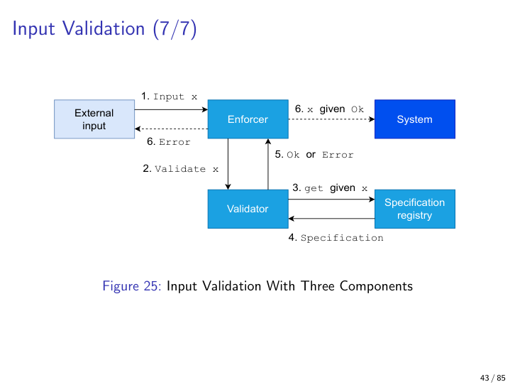

*Figure 10.8 — The three-component input-validation pattern. The enforcer queries the specification registry by data type, dispatches to the validator, and only forwards on OK.*

---

## 11. Attack-surface minimisation

**Definition.** Reducing the **number**, **breadth**, and **exposure** of external-facing components that accept input.

**Why it matters.** Fewer inputs ⇒ fewer places to validate ⇒ fewer places to get validation wrong. It is the *complement* of input validation: input validation makes each surface safer; attack-surface minimisation makes there be fewer surfaces.

**Detailed explanation.** The lecture shows successive sketches of a system: first with many external-facing components, then with fewer, finally with one input channel and two validating components. But the principle interacts subtly with complexity: if the one remaining input channel has a million lines of code behind it, you have *moved* the problem rather than *solved* it. Surface area is roughly *number-of-channels × complexity-of-each-channel*; minimise the product, not just the count.

**Analogy.** A medieval castle with three small, well-guarded gates is safer than a castle with thirty random doorways — but *only* if each gate is genuinely well-guarded. Three poorly-guarded gates can be worse than thirty well-guarded ones, if the three are also more attractive targets.

**Example.** Closing all unused TCP ports on a host. Putting all external HTTP behind one reverse proxy that handles TLS, bot filtering, and rate limiting *before* traffic touches the application. Stripping debug endpoints from production builds. Removing unused features from a library before shipping.

**Common pitfall / nuance.** Minimising the *number* of channels does not automatically minimise the *attack surface area*. One large complex endpoint can be worse than several small simple ones — favour endpoints that have a narrow specification over endpoints that accept "anything we might eventually need".

---

## 12. Trust boundaries (SRI, CSP, and the empirical 31 %)

**Definition.** A **trust boundary** is a line in the system where data passes between zones of different trust assumptions, requiring explicit validation or authorisation.

**Why it matters.** Most successful exploits cross a trust boundary *without being noticed* — the architecture failed to mark the line and so the system failed to enforce the check. Making trust boundaries explicit is a prerequisite for input validation, authn/authz, and least privilege.

**Detailed explanation.** Classical trust boundaries: between consumer clients (untrusted) and a web app (trusted), between a web app and a CDN that serves third-party JavaScript, between a microservice and its database, between the host kernel and a user-space process. *Modern* (post-2024) boundaries: between an agentic browser and the user's host, between an agent and a tool, between a tool and its supply chain, between a runtime and an execution sandbox, between memory and a runtime, between an LLM agent and the **content** it reads. We cover the agentic boundaries in detail in §14.

**SRI and CSP — concrete examinable instances.** Two W3C standards harden the web-app/CDN trust boundary:

- **Subresource Integrity (SRI)** — adds an `integrity="sha384-…"` hash to `<script>` and `<link>` tags. The browser computes the hash of the response body and refuses to execute or apply the resource if the hash does not match the one baked into the page. A compromised CDN cannot silently substitute attacker-controlled JS.

  ```html
  <script src="//cdn.example.com/lib.js"
          integrity="sha384-XYZ..."
          crossorigin="anonymous"></script>
  ```

- **Content Security Policy (CSP)** — an HTTP header listing the allowed origins for scripts, styles, images, fonts, frames, etc. Default-deny by design — if an origin is not on the list, the browser refuses to load from it.

**The empirical hook.** The Ruohonen et al. (2018) study found that **~31 % of external JavaScript on ~35 000 popular websites changed within a 10-day polling window**. Every one of those changes was, technically, a re-cross of an under-policed trust boundary. SRI plus CSP plus vendor discipline are the architectural response.

**Analogy.** A national border. You don't need a customs officer between two rooms of the same house, but you do at the airport. Marking the border explicitly is the prerequisite for stationing the officer.

**Example.** A bank's web page that loads `jquery.min.js` from a public CDN: SRI on the `<script>` tag pins the hash; CSP restricts to a small allow-list of origins; the architecture team monitors the upstream library for legitimate updates and bumps the hash in lockstep.

**Common pitfall / nuance — coarse trust boundaries.** Repository-wide secrets, organisation-wide tokens, "all developers can deploy" permissions — these look like controls but are actually *broad-but-shallow* boundaries that grant excessive access. The exam-quotable principle: a broad coarse boundary is worse than no boundary, because it gives a false sense of control. Also: SRI doesn't help if you forget to update the hash on a legitimate library bump — leading lazy developers to drop SRI altogether. Tooling and auto-update are essential.

---

## 13. Data vs. control separation — "prompt injection is not SQL injection"

**Definition.** Architectural principle that **data inputs from untrusted sources must never be processed as control instructions** (commands, code, queries, prompts).

**Why it matters.** This is the deep cause of SQL injection, command injection, XSS, and now **prompt injection**. It is also harder to fix for LLMs, not easier — the lecturer's NCSC-quotable point.

**Detailed explanation.** Arce et al. (2014) recommend an *enforcer* component between external input and the system, with two output paths:

- "Data given OK" — allowed, treated as **data**.
- "Control / Not trusted" — blocked, quarantined, or reduced to inert representation.

For SQL injection the fix is well-known: parameterised queries. The grammar of SQL is fixed; you can sanitise and escape because the grammar tells you what is a string literal and what is a keyword.

For **prompt injection**, the NCSC blog post quoted by the lecture is titled almost verbatim *"prompt injection is not SQL injection"*. With natural-language prompts **no fixed grammar exists**. There is no escaping mechanism that lets you safely insert untrusted text into a prompt because there is no parser that distinguishes data from control. The boundary must therefore be enforced by **architecture**, not by escaping — separate channels, separate contexts, separate authority.

**Analogy.** Reading a letter from a stranger is fine; *executing* its instructions verbatim because the envelope says "official" is not. SQL injection is "the official-looking envelope said execute the contents and the parser obliged"; prompt injection is the same thing but with a parser that has no concept of "envelope" in the first place.

**Example.** A RAG agent retrieves a web page and treats text in the page as instructions to call tools. The page is **data**; the architecture must prevent the leap to **control**. The fix is not to filter for "bad" tokens — that is a losing game — but to put the retrieved content into a context the agent cannot use as command material (a sandboxed tool that summarises text without an action capability, with its output gated by the gateway from §9).

**Common pitfall / nuance.** Filtering for "dangerous" tokens or phrases is theatre. The correct design **eliminates the channel** through which data could become control in the first place. This is exactly the architecture-not-escaping principle, and it is exam-quotable.

---

## 14. Trust boundaries for agentic AI — fresh exam fodder

**Definition.** The set of zone-transitions in an agent-based system where input and authorisation must be re-validated.

**Why it matters.** The list is **much longer** than for classical systems, and the new boundaries are exactly where the new attacks occur. The lecturer marked this as *fresh material likely to appear on the exam*, including the goal "list at least 5 new trust boundaries that agentic AI introduces".

**The enumeration (non-exhaustive but representative).** From the lecture, plus Didi & Zavodchik (2026, Akamai):

| # | Boundary | What sits on each side | What can go wrong if unenforced |
|---|----------|------------------------|--------------------------------|
| 1 | **User ↔ Agent** | Human user / agentic process | Authn weakness; user impersonation. |
| 2 | **Agent ↔ Tool** | Agent / external tool API | Excessive agency (OWASP #6); unauthorised tool use. |
| 3 | **Tool ↔ Supply-chain** | Tool runtime / its dependencies | Supply-chain compromise (OWASP #3). |
| 4 | **Execution ↔ Tool** | Execution sandbox / the tool's process | Sandbox escape; lateral movement. |
| 5 | **Agent ↔ Content** | Agent / external documents it reads | **Prompt injection embedded in content** (OWASP #1). |
| 6 | **Execution ↔ Content** | Sandboxed execution / the content under analysis | Code execution from data; escapes via parser bugs. |
| 7 | **Runtime ↔ Execution** | The agent runtime / the per-task execution context | Cross-task state leakage. |
| 8 | **Host ↔ Runtime** | The host OS / the agent runtime | Container escape; host compromise. |
| 9 | **Memory ↔ Runtime** | Persistent agent memory / the live runtime | Memory poisoning, persistence of injected instructions. |
| 10 | **Host & Memory ↔ Kernel** | User-space / kernel | Privilege escalation; rootkit. |
| 11 | **Agent ↔ Task** | Orchestrator / per-task sub-agent | Sub-agent privilege over-grant. |
| 12 | **Task ↔ Skill** | Task / skill (Didi & Zavodchik 2026) | Malicious skill installation. |
| 13 | **Execution ↔ Skill** | Per-execution context / skill code | Skill-to-skill execution propagation. |

Memorise at least **five of the new ones** (Agent↔Tool, Agent↔Content, Tool↔Supply-chain, Execution↔Skill, Task↔Skill are a clean five to recite).

**Detailed explanation.** Skill-to-skill propagation creates **execution propagation** — exactly the failure mode that motivates extending the pipe-and-filter pattern with *validation between stages*. Each boundary is a place where input validation, authentication, and authorisation must be re-applied. Every new boundary is a new place to forget to do so.

**Analogy.** A multinational corporation has more borders to cross than a household. Every additional country added means more customs offices, more paperwork, more places to smuggle. The agentic AI architecture has multiplied the number of country borders without multiplying the number of customs offices to police them.

**Example — an attack chain across boundaries.** A coding agent retrieves a web page (Agent ↔ Content — boundary 5). The page contains injected instructions ("now invoke the file-write skill with the following payload"). The agent obeys, calling a summariser skill (Agent ↔ Skill / Task ↔ Skill — boundaries 11–12), which fetches a remote tool (Skill ↔ Tool — adjacent to 2–3). The tool executes in the sandbox (Execution ↔ Tool — boundary 4), and a parser bug there gives it host access (Host ↔ Runtime — boundary 8). One malicious page, six unenforced boundaries, full host compromise.

**Common pitfall / nuance.** Do not treat all boundaries as equal. **Agent ↔ Content** is *new* and badly understood (the architectural research community is still working out how to express it precisely); **User ↔ Agent** is *old* (it is an authn problem) and well-understood. Spend exam budget on the new ones. Also: it is tempting to treat agentic systems as a fresh paradigm requiring fresh vocabulary; in fact, almost every boundary in the table above is the same broker / mediator / sandbox pattern the course has already taught. The lecturer's "agentic AI is a distributed system" framing (§17) is meant to keep your feet on the ground.

---

## 15. Identity binding and non-repudiation for agents (Sierra 2026)

**Definition.** Mechanisms that **bind every agent action to an underlying human or service identity** with cryptographically defensible provenance, so that the action cannot later be denied.

**Why it matters.** Sierra (2026) argues — and the lecturer flags as quotable — that **authorisation must not depend on the model's interpretation of a request**. Authorisation must be enforced by *deterministic system controls at trust boundaries*. Only then can audit logs satisfy non-repudiation, and only then can revoke-access (§16) work in the first place.

**The Sierra principles (Figure 10.10).**

1. **Agentic identities are bound to a human identity.** Non-repudiation requires that "agent A did X" can be traced back to "human U is accountable".
2. **The agent receives a scoped secret (token).** No inheritance from a broader credential; rapid expiry; minimum necessary privileges.
3. **Authorisation is execution gating.** The system validates identities, sessions, tools, resources, and risk-categorised data at the moment of execution — not at the moment of model interpretation.
4. **mTLS everywhere.** Mutual TLS between agent components establishes both sides of each communication.
5. **Minimise reliance on static secrets.** Short-lived tokens over long-lived API keys.
6. **Assume most inputs lead to execution and become adversarial over time.** This is the **zero-trust** principle applied to agents: do not trust the agent's own reasoning to filter the bad inputs.
7. **Continuous monitoring throughout.** Audit at every step, not only at the boundaries.

The IETF **CB4A (Credential Broker for Agents)** draft (covered in §16) generalises principles 2 and 3 into a concrete broker-pattern architecture.

**Analogy.** A temp worker at a high-security site gets a badge that says "valid 9–17 today, lab B only, photographed and logged" — not the permanent employee's master pass. The badge proves who they are, what they can do, and binds every door swipe to an audit trail.

**Example.** An agent sub-task is granted a token valid for 60 seconds, limited to one specific tool, with the request reason logged before the credential is issued. If the tool call fails, the token expires and a new one must be requested with a new reason and new audit entry.

**Common pitfall / nuance — "an agent cannot authorise another agent"**. Sub-agent delegation must pass through deterministic policy infrastructure, not through a model deciding the second agent is trustworthy. This is the most exam-quotable line from Sierra: *authorisation must not depend on the model's interpretation*. If you only memorise one sentence from this section, memorise that one.

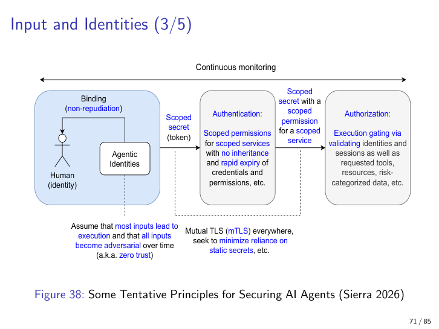

*Figure 10.9 — Sierra (2026)'s principles for securing AI agents. Note that authorisation is enforced deterministically at trust boundaries, not interpreted by the model.*

---

## 16. CB4A — Credential Broker for Agents (broker pattern, again)

**Definition.** An IETF draft (`draft-hartman-credential-broker-4-agents`) proposing an architecture in which agents obtain **short-lived, scoped credentials from a central policy infrastructure** rather than carrying long-lived secrets.

**Why it matters.** It is a concrete, named proposal for solving the agent-identity problem with **classical architecture (the broker pattern, Ch 3) and security tactics**. The lecturer points to it as the worked example that operationalises Sierra's principles.

**Components.**

- **Agent runtime** — Agent₁ (original) and Agent₂ (sub-agent / specified). Each issues a credential request that says *who, what, why, time-to-live*.
- **Policy infrastructure** — the broker. Contains:
  - *Authentication* — who is asking?
  - *Authorisation* — are they allowed to ask for this?
  - *Audit Trail* — record everything.
  - *Credential Vault* — where the actual secrets live.
  - *Privilege Vault* — what the credentials are *allowed to do*.
- **Token issuance** — the policy infrastructure mints a short-lived scoped token, performs scoping, risk-scoring, expiry management, and writes an audit record.
- **Use and expiry** — the agent uses the token; afterwards the credential expires. No long-lived secrets in the agent runtime.

The pattern is recognisably the **broker pattern** (Ch 3): many agents on one side, many secrets on the other, with a mediator that handles the many-to-many relationship. CB4A is the broker pattern dressed in IETF clothing.

**Analogy.** A movie-set day-pass office. Actors collect a wristband good only for their scene, good only for that day, with the office keeping a log of who entered which set. The wristband does not give them access to the next day or the next set; the next day they queue again and the office logs again.

**Example.** Agent A wants to call tool T on behalf of user U for reason R for at most 5 minutes. CB4A checks policy (U is allowed to invoke A; A is allowed to invoke T for R), mints a 5-minute token, scopes it to T only, writes an audit record, and returns the token. A uses the token, T executes, the token expires.

**Common pitfall / nuance — do not reinvent.** OAuth/OIDC, SPIFFE/SPIRE, and Kubernetes service-account tokens already solve pieces of this problem. CB4A is a *unifying broker pattern*, not a brand-new protocol. Treat it as architectural guidance, not as a new wire format you must support.

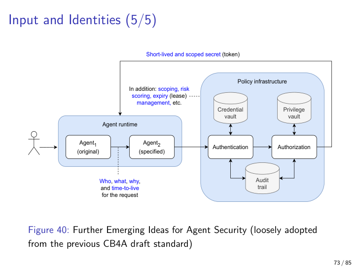

*Figure 10.10 — CB4A as the broker pattern (Ch 3) applied to agent credentials. Short-lived, scoped tokens replace long-lived secrets.*

---

## 17. Revoke-access tactic (paired with non-repudiation)

**Definition.** A **Resist** tactic where the system **actively removes or downgrades an actor's privileges** in response to suspicious behaviour or policy violation.

**Why it matters.** Authorisation lets the right people in; revoke-access kicks the wrong ones out. The two are paired. Without revoke-access, your only response to an in-progress attack is to wait it out.

**Detailed explanation.** The lecture's sketch (Figure 10.11) shows an authenticated agent issuing requests through an *Authorisation enforcer*, which consults a *Validator*. The validator checks each request against two things: an **AllowedEvents** list (what kinds of requests this agent is allowed to make) and a **RequestLimit** (how many per unit time). Bad requests are denied; on threshold breach, the agent's identifier is **deleted from the registry**, revoking access entirely.

The pattern combines four tactics in one diagram: authentication (the agent is identified), authorisation (against AllowedEvents), validation (against the spec), and rate-limiting (RequestLimit). On breach it adds a fifth: **revoke**.

**Analogy.** A nightclub bouncer who not only checks IDs at the door (authn) and the guest list (authz) but also ejects anyone who breaks the rules inside (revoke). The bouncer keeps a list of who's been ejected so the same person cannot walk back in.

**Example.** A SOC playbook automatically suspends a user account after five failed-login attempts from a new geolocation, plus a Splunk alert. The suspension is *revoke-access*; the alert is *inform actors* (React).

**Common pitfall / nuance.** Revoke-access without **non-repudiation** (audit logs binding actions to identities) means you cannot tell *whom* to revoke. The two tactics are paired and the exam will sometimes ask why. The answer: revoke is only as good as your ability to identify the actor; identification is only useful if it is logged with cryptographic provenance.

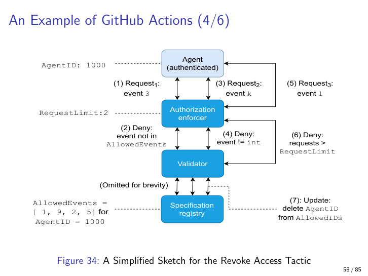

*Figure 10.11 — Revoke-access tactic. The validator checks each request against allowed-events and a request limit; on breach the agent identifier is removed from the registry.*

---

## 18. Least privilege, privilege drop, and privilege separation

This is the canonical privilege-architecture section of the course. Chapter 11 (Microsoft SDL Gate 3) and Chapter 9 (Kubernetes) both cross-reference what we cover here. The vocabulary is precise; the exam likes precision here.

### 18.1 Least privilege

**Definition.** A software (or process, or token) should operate with the **minimum privileges required for its function** — and *no more*.

**Why it matters.** It is simultaneously an attack-surface minimisation move, a blast-radius reducer, and the foundation for privilege drop and privilege separation. Without least privilege, the other two are moot.

**The Adkins et al. (2020) testing dictum.** Google's SRE-and-security book recommends testing your implementation both:

- **Of privileges** — does the code actually drop what it claims to drop? (Verify the privilege change happened.)
- **With privileges** — does runtime execution behave correctly under the reduced privilege set? (Verify the code still works.)

Both tests are necessary; the first without the second leaves you with a broken application, and the second without the first leaves you with a service that *thinks* it's running as `www-data` but is actually still root.

**The breakglass mechanism.** Adkins et al. also recommend a **breakglass** capability — sometimes an authorised operator must intentionally break the security policy to handle an emergency. A physician must be able to access locked patient records to save a life; an SRE must be able to read encrypted logs during an outage. The breakglass action **must itself be audited** — the temporary privilege elevation is logged, alerted, and reviewed afterwards.

**Analogy.** Giving each employee a key to only their own office instead of a master key to the whole building, with a glass-fronted emergency key cabinet that breaks loudly when used.

**Example.** A web server runs as `www-data` (UID 33), not as root. Even a successful RCE on the web server only owns the web tier, not the host. The on-call breakglass is documented, logged, alerted.

**Common pitfall / nuance.** Untested privilege drop is theatre. Always test (a) that the lower-privilege process actually fails to do the high-privilege actions it should not be able to do, and (b) that it succeeds at the actions it should still be able to do.

### 18.2 Privilege drop vs. privilege separation — the precise distinction

This is the **precision-vocabulary** part of the lecture. Be ready to define each, name an example of each, and explain why a system might need separation rather than drop.

**Privilege drop** — a single process starts as a superuser, performs the small set of operations that require elevated privileges (binding to port 80, opening a privileged device, reading a protected key file), and *then* drops to a restricted user via `setuid()`/`setgid()` (or container-equivalent). For the remainder of its life it runs as the restricted user; it cannot regain root.

**Privilege separation** — a process starts as superuser and **forks** an unprivileged child. The child handles the *risky* operations (accepting network input, parsing untrusted data). The privileged parent only handles the few operations that genuinely need root, and the two communicate via **IPC** (sockets, pipes, message queues). The pattern combines isolation + least privilege + IPC into one architecture.

**Historical anchor.** Privilege drop was first popularised by **Bernstein's qmail (1997)**, which was designed from the ground up around least privilege and is the historical reference point. **Postfix** (Wietse Venema) is the textbook **privilege separation** example: a small number of privileged components handle local mail pickup, queueing, and external transports; **~16 other unprivileged worker processes** run as a collection of dedicated users, split by function — network input gets one user, parsing another, local delivery another. The privileged parts touch root only when they must; everything else runs in its own little box.

**Postfix's structure** (Figure 10.12). One privileged daemon (`pickup`/`master`) plus around sixteen unprivileged workers split by function. The privileged side only handles operations that genuinely require root (binding port 25, queueing into protected directories). The unprivileged workers handle everything else — network reception, content filtering, local delivery, external transport. Communication is via Postfix's internal IPC. If an attacker compromises the SMTP-input worker, they own only that worker's restricted user, not root and not the rest of the mail subsystem.

**Why separation rather than drop?** Some programs *cannot* drop root entirely — they need privileged ports, raw sockets, or hardware access for the whole runtime. Separation lets the privileged parts stay privileged (in a small, isolated, audited code path) while the rest of the program runs unprivileged. Drop is for programs that need root only at startup; separation is for programs that need root throughout but only in a few well-defined operations.

**Analogy.** *Drop:* a surgeon scrubs in (root) before entering the operating room, then inside the OR everything is done by the scrubbed, gloved version (dropped privileges) — the surgeon never re-enters the dirty world. *Separation:* a small isolated room where the dirty work happens, with a sealed pass-through to a clean side staffed by a different team.

**Example.** Postfix's `local` runs as `_postfix:_postfix`; `smtpd` runs as `_smtpd`; the privileged `pickup` daemon stays root only for the operations it cannot avoid. qmail (1997) was the first major MTA to drop root systematically — many of its design choices became standard.

**Common pitfall / nuance.** Students confuse "drop" and "separation". A useful one-line distinction: **drop = downgrade after init**; **separation = fork an unprivileged child for risky work via IPC**. Postfix is the canonical separation example because it does both — it drops where it can, and separates where it can't.

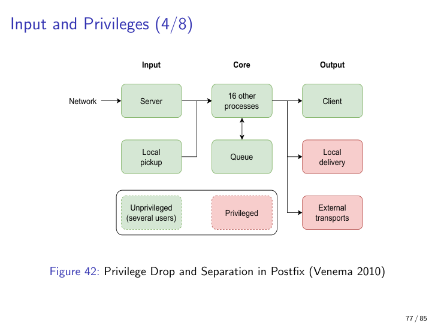

*Figure 10.12 — Postfix's privilege separation. The privileged side is small and isolated; ~16 unprivileged workers handle the risky operations under dedicated users.*

### 18.3 Kubernetes `securityContext` — privilege drop in the container era

**Definition.** A pod/container spec field that pins the container's runtime UID/GID and other privilege constraints.

**Why it matters.** Translates classical Unix privilege drop into the container era. Exam-relevant because Chapter 9 introduced Kubernetes and this is where the security half of that chapter lands.

**The YAML.** The canonical artifact from the lecture:

```yaml
kind: Pod
metadata:
  name: example-pod
spec:
  securityContext:
    runAsUser: 1000
    runAsGroup: 2000
```

That's it. Two lines drop the container from running as the image's default user (often root) to UID 1000, GID 2000. Combined with `readOnlyRootFilesystem: true`, no `privileged: true`, and dropped Linux capabilities, it is a Kubernetes-native privilege drop.

The lecture's deployment diagram (Figure 10.13) extends this to a multi-node, multi-agent cluster: Node 1 runs Pod 11 containing Agent 11 and Agent 12 (both `runAsUser: 1000, runAsGroup: 2000`); Node 2 runs Pod 21 containing Agent 21 (`runAsUser: 2000, runAsGroup: 2000`); the pods communicate via a Message queue over **mTLS**. Every classical principle (least privilege, isolation, mTLS) operationalised in YAML.

**Analogy.** Like setting the "Standard User" account on a freshly imaged laptop instead of leaving it as Administrator. The image came with Administrator as default; you change it before the laptop goes to the user.

**Example.** A LangChain agent container running as UID 1000 with no `CAP_NET_RAW`, no `privileged: true`, and a read-only root filesystem. Even if the agent's tool execution is exploited, the blast radius is one container running as an unprivileged user with no ability to write to its own filesystem.

**Common pitfall / nuance.** `runAsUser: 0` (i.e. root) is the **default** for many base images. Forgetting to set `securityContext` silently undoes the entire safeguard. Worse, some images *also* require root at runtime (legacy ones that write to `/var/lib/foo` or bind to port 80) — fix the image, do not concede the privilege.

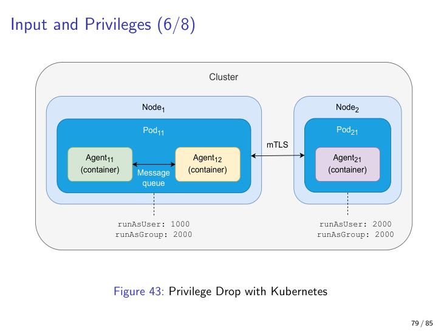

*Figure 10.13 — Kubernetes deployment view of privilege drop. Two pods on two nodes, each pinned to a non-root UID/GID, communicating via a message queue over mTLS.*

### 18.4 OpenBSD `pledge` and the one-way ratchet

**Definition.** A POSIX-ish primitive (`pledge(2)`) by which a process **voluntarily restricts** the system calls and capabilities it can subsequently use. Future syscalls outside the pledged set **kill the process**.

**Why it matters.** It is the cleanest OS-level example of attack-surface minimisation and least privilege expressed as a programming-language primitive — the program *itself* drops capabilities it knows it will never need. The Linux equivalents (seccomp-bpf, Landlock, Linux capabilities) implement the same idea, less ergonomically.

**Detailed explanation.** A program might call

```c
pledge("stdio rpath", NULL);
```

after opening its files, meaning "from now on I only need `stdio` and read-only paths" — any attempt at network, exec, or write-paths terminates the process. The crucial property is that it is **a one-way ratchet**: once pledged, capabilities can be further restricted but never re-granted. There is no `unpledge`.

**Analogy.** A trapeze artist who, after climbing to the platform, throws away the ladder. They can only go forward, never back to dangerous ground. Even if a robber climbs up to mug them, the ladder isn't there to descend with the loot.

**Example.** Many OpenBSD base utilities call `pledge` shortly after argument parsing. An exploit gaining RCE in `vmd` simply cannot make network calls because the process has already pledged not to. The exploit reaches the codepath, the codepath calls `socket()`, the kernel kills the process.

**Common pitfall / nuance.** `pledge` is OpenBSD-specific. Linux equivalents are **seccomp-bpf** (filter system calls with a small BPF program), **Landlock** (filesystem and network access restrictions), and **Linux capabilities** (split root into ~40 fine-grained capabilities). Same idea, different syntax, weaker default ergonomics. The principle is the same: drop what you don't need, ratchet, and let the kernel enforce.

---

## 19. Egress filtering — output validation, and a CRA requirement

**Definition.** Architectural restriction of **outbound** connections from a component — what destinations, what protocols, what TLS configurations, what HTTP methods are permitted.

**Why it matters.** It is the lecture's main worked example of **output validation**, and it is increasingly *regulatory*. The EU Cyber Resilience Act (CRA) requires that a device must not harm its operating networking environment — egress filtering is the architectural answer.

**Detailed explanation.** Most security controls focus on inputs. Egress filtering acknowledges that even with perfect input validation, **a compromised component may still try to reach out**. A successful RCE inside the perimeter is not the end of the story; the attacker still needs to phone home (command and control), exfiltrate data, or pivot to a new target. Default-denying outbound and explicitly allow-listing destinations bounds the **blast radius**.

**Analogy.** A hotel that, after a burglar gets inside, locks the *exits* so the loot cannot leave. The break-in already happened; the egress lock keeps the burglar from getting out with anything valuable.

**Example.** GitHub Actions workflows in 2026 are moving to egress allow-lists for exactly this reason: a workflow that runs `npm install` should be able to reach `registry.npmjs.org` and `github.com`, and *nothing else*. The well-publicised ChatGPT exfiltration via DNS (The Register, March 2026) is precisely the failure mode egress filtering blocks — but only if the resolver itself is on the allow-list and the DNS protocol is constrained, because **DNS can be the exfiltration channel** for clever attackers.

**Common pitfall / nuance.** DNS itself can be the exfiltration channel — encoding stolen data into the subdomain of a query that the attacker controls the nameserver for. Egress allow-lists must therefore include the *resolver* (which DNS servers the workflow can reach) and ideally inspect DNS query patterns, not just IP destinations. **(Cross-reference: this is GitHub Actions §15, and a major example of why Chapter 11's zero-trust + sidecar architecture insists on egress controls at the cluster edge.)**

---

## 20. Agentic AI as a distributed system

**Definition.** Treating multi-agent setups as **distributed systems** makes all the QAs and tactics of Chapters 4–7 directly applicable.

**Why it matters.** It collapses the apparent novelty of "AI architecture" into ground the course has already covered — and surfaces the hard, unsolved problems honestly. The lecturer flags this section as a way to keep your feet on the ground when the hype catches up.

**Open questions the lecturer raised explicitly.**

- How do peer agents detect a crashed agent and continue? (Availability / fault detection — Ch 7.)
- Synchronisation between agents writing and reading shared files? (Locking, consistency.)
- CAP theorem under partition — an agent goes offline mid-task; does the team prefer **consistency** or **availability**? (Distributed-systems exam material.)

Ruohonen flags these as *"still unsolved issues (from a scientific perspective) at the time of lecturing"* — which means a sensible exam answer is *"apply the existing CAP, availability, recoverability, and consistency tactics, identify what is genuinely novel (e.g. Agent ↔ Content), and admit where the research is open"*.

**Analogy.** A football team where each player can disappear without warning, every formation requires re-negotiation, and there is no referee. You don't need a new theory of sport, you need to apply the classical theory hard, and you also have to honestly say "the rule for what happens when the goalkeeper teleports out mid-shot is still being written".

**Example.** Case #8 (Final assignment): three collaborating agents (bug-finder, fixer, merger) wired faulty over a network, designed to demonstrate at least three security weaknesses plus two non-security weaknesses. The exercise is precisely about applying the classical QA toolkit to a multi-agent scenario.

**Common pitfall / nuance.** Don't invent new vocabulary for agentic systems. Apply the existing CAP, availability, recoverability, and consistency tactics first; *only then* identify what is genuinely novel (such as the Agent ↔ Content trust boundary). The lecturer's complaint about the AI-architecture literature is that it reinvents wheels that the distributed-systems literature solved decades ago — don't fall into that trap on the exam.

---

## 21. Sidebar — OWASP Top-10 for LLMs at a glance

For revision. Memorise the **names**; the lecture will not ask you for verbatim definitions.

1. **Prompt injection.**
2. **Information disclosure.**
3. **Supply chains.**
4. **Data and model poisoning.**
5. **Improper output validation.**
6. **Excessive agency.**
7. **Prompt leakage.**
8. **Embedding weaknesses.**
9. **Misinformation.**
10. **Unbounded resource consumption.**

The lecture's caution remains: **think in attack sequences, not orthogonal categories.** A real incident usually involves three to five of these at once.

---

## Exam-relevant takeaways

1. **Safety vs. security on the intentional-adversary axis.** Same tactics often, but the impact dimension (damage / injury / loss of life) and the intentional adversary distinction are what separate them. Be ready to draw both scenario templates and explain the difference in one sentence.
2. **Memorise the two tactic trees side by side.** Safety: Avoidance / Detection / Containment / Recovery. Security: Detect / Resist / React / Recover. Know at least two sub-tactics per branch on each side and be ready to map security to CIA.
3. **SIEM = pipe-and-filter with brokers**, because the relationships are many-to-many. The bottleneck is the **GUI/analyst stage** — a performance/usability concern at the heart of a security architecture. (Cross-references Chapter 3's broker pattern.)
4. **Input validation principles (Arce et al. 2014)** — centralised validator (well-known libraries), canonicalisation, state-aware inputs, audit nearby code, prefer strongly-typed memory-safe languages. Exam-quotable.
5. **"Prompt injection is not SQL injection"** — the natural-language input channel has no grammar to sanitise; architecture (separation of data and control, gateways, validators) is the only defence.
6. **Trust boundaries multiply with agentic AI** — be able to list **at least five** new ones (Agent↔Tool, Agent↔Content, Tool↔Supply-chain, Task↔Skill, Execution↔Skill are a clean five).
7. **"Authorisation must NOT depend on the model's interpretation of a request"** (Sierra 2026). Must be enforced by deterministic controls at trust boundaries. Quotable verbatim.
8. **Privilege drop vs. privilege separation.** Drop = downgrade after init. Separation = fork an unprivileged child for risky work via IPC. **qmail (1997)** = first systematic privilege drop. **Postfix** = textbook privilege separation. Precision vocabulary.
9. **Kubernetes `securityContext.runAsUser` / `runAsGroup`** is privilege drop translated into container land. Two lines of YAML. Connects Chapter 9 (Kubernetes) to Chapter 10 (Security).
10. **Egress filtering = output validation** and a CRA compliance requirement. A device must not harm its networking environment. DNS itself can be the exfiltration channel — restrict the resolver, not just IPs.
11. **Breakglass mechanisms** (Adkins et al. 2020) are a deliberate exception to least privilege — emergencies trump policy, but the breakglass action must itself be audited.
12. **Always pair revoke-access with non-repudiation.** Audit logs binding actions to identities — otherwise you cannot know whom to revoke.
13. **Monitor-actuator pattern.** Variant A = drop on fault; Variant B = abort on fault. The monitor must be **independent** (separate power, separate clock, ideally separate code) or the pattern is theatre.
14. **Defence in depth** (cross-reference Chapter 2). Validate at every trust boundary, not only at the outer one. Multiple layers; no single point of trust.
15. **Agentic AI is a distributed system.** Apply CAP, availability, fault detection, consistency tactics first; only then identify genuinely novel issues like the Agent↔Content boundary.

---

## Cross-references to other chapters

- **Chapter 2 (QA framework + defence in depth)** — the scenario-template shape and the principle that multi-layer trust enforcement beats single-point-of-trust both originated here.
- **Chapter 3 (Integrability — broker and pipe-and-filter patterns)** — the SIEM, the LLM gateway, and CB4A are all worked examples of the broker pattern; the SIEM also worked-example of pipe-and-filter.
- **Chapter 5 (Testability)** — Adkins et al.'s "test of privileges / with privileges" inherits Chapter 5's testability framing.
- **Chapter 7 (Availability)** — the detect/repair/reintroduce/prevent rhythm reappears; the safety tactic tree's Detection, Redundancy, and Recovery leaves are shared with availability.
- **Chapter 9 (Scalability — Kubernetes)** — prerequisite for the `securityContext` section; the multi-agent CAP discussion references the distributed-systems content from Ch 9.
- **Chapter 11 (Security Part 2)** — picks up exactly where this chapter ends. Microsoft SDL Gate 3 cross-refs the privilege-drop material here; threat modelling deepens the Resist tactic from §6; sidecar + zero-trust deepens egress filtering from §19; cryptography lifecycle deepens encryption.
- **Chapter 13 (Pattern catalogue)** — houses canonical write-ups of monitor-actuator, broker (SIEM, CB4A, LLM gateway), pipe-and-filter (SIEM), and sidecar (Chapter 11's territory).

---

> *"Most attacks are input. Most defences should therefore be validators. And most validators should be at trust boundaries you have explicitly named."*
> — paraphrased synthesis of Arce et al. 2014, applied throughout Lecture 8.
