# Chapter 11 — Security Part 2: Cyber Security Engineering

> *"To maximise reliability, a system should resist failures and serve as much as possible. To maximise security, a system should lock down fully in the face of uncertainty. You cannot pick 'both' by default — your organisation must pre-commit."*
> — paraphrased from Adkins et al. (2020), via Jukka Ruohonen, Lecture 9 (April 21, 2026)

## Opening — what this chapter is about

Chapter 10 set up the *framing* of security: the CIA triad, the agentic/LLM threat surface, sanitisers and SIEM, privilege drop as the canonical least-privilege tactic, and the safety↔security split. That chapter taught you the vocabulary and the meta-position — *why* security is hard, and where it sits next to safety, reliability, and privacy.

This chapter is the **engineering** half. It assumes you already know Ch 10's framing and now wants to teach you how a working architect actually *bakes* security into a system. The answer the lecturer drives at, again and again, is: **security is a constraint** placed on requirements, architecture, *and* implementation simultaneously — not "another -ility" measured after the fact. You design *against* it; you do not bolt it on at the end.

To put that in concrete terms we will walk a single spine: Microsoft's **Security Development Lifecycle (SDL)** with its three gates and zero-trust baseline. The SDL is the chapter's organising skeleton — every other concept hangs from it:

- **Gate 1** (dev-time) anchors the developer-hygiene material, threat modeling, and the OWASP CI/CD risks that begin at the human level.
- **Gate 2** (CI/CD-time) anchors the CI/CD pipeline hardening discussion — and links back to Ch 6 (Deployability).
- **Gate 3** (deploy/run-time) anchors the kill chain, zero-trust architecture, sidecars, honeypots, egress filtering, and the cryptography lifecycle — and links back to Ch 10's privilege-drop tactic.

Around that spine we will visit five clusters: (1) the trade-offs that make security a *constraint*, opening with **fail-safe vs. fail-secure**; (2) **threat modeling** and **trust boundaries** at three scales; (3) the **cyber kill chain** and why a naïve DMZ + firewall + IDS deployment cannot stop it; (4) the **zero-trust architecture** with the **sidecar pattern** as its canonical implementation, with honeypots and egress filtering as the supporting tactics; and (5) the **MitM taxonomy** with Conti & Dragoni's seven countermeasures, ending with the **cryptography lifecycle** at the data layer.

Two themes recur. The first is *defence in depth*: any single control fails, so you stack them — and the kill chain teaches you which control breaks which link. The second is *least privilege as the universal mitigation*: the confused-deputy anti-pattern, container UID isolation, scoped tokens, and zero-trust per-request authorisation are all the same idea applied at different scales. If you read this chapter and remember nothing else, remember that.

> **Cross-references.** Ch 5 (Testability) — "test of privileges / with privileges" maps onto Gate-1 and Gate-2 verification. Ch 6 (Deployability) — Gate 2 directly extends the CI/CD discussion. Ch 9 (Scalability) — Kubernetes + sidecar pattern is the prerequisite for the security-sidecar variant. Ch 10 (Safety + Security framing) — privilege drop, SBOM, agentic threats — picked up and deepened here. Ch 13 (Pattern + Tactic catalogue) — sidecar, threat-modeling, kill-chain entries.

---

## 1. The five trade-offs, and fail-safe vs. fail-secure

**Definition.** Security is bounded by five canonical trade-offs visible on the lecturer's pentagon diagram: **risk, cost, usability, performance, privacy**. (Reliability sits half-inside the pentagon as a sixth axis when fail-safe vs. fail-secure is in play.) Every security decision spends from at least one of those five budgets.

**Why it matters.** It explains *why* the answer to "should we add more security?" is never simply "yes". Adding TLS costs CPU (performance); adding MFA costs UX clicks (usability); adding HSMs costs money (cost); reducing logging protects users (privacy) but blinds the SOC (risk). The architect's job is to make those trades *visible* and *deliberate*.

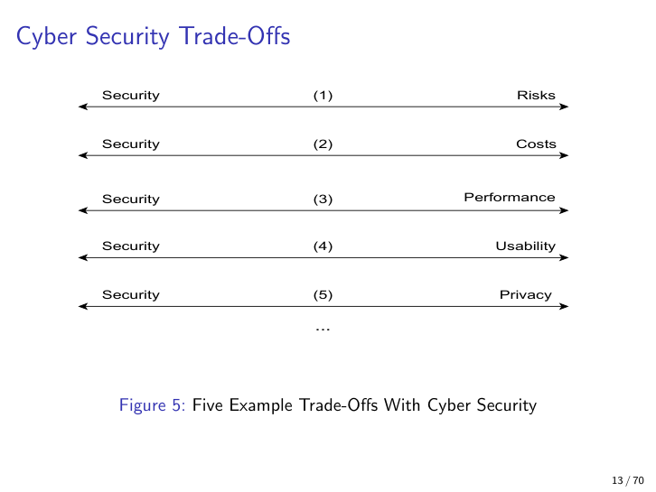

*Figure 11.1 — Security's five canonical trade-offs. Each spoke is a budget the architect spends when adding a control.*

### Fail-safe vs. fail-secure

The reliability axis deserves its own treatment because it is the lecture's chosen *hook* into the chapter, and an exam-friendly compare/contrast.

| Posture | Synonym | On failure, default to | Maximises |
|---|---|---|---|
| **Fail-safe** | fail-open | *allow* — keep serving | Reliability / availability |
| **Fail-secure** | fail-closed | *deny* — shut down | Confidentiality / integrity |

**Detailed explanation.** Reliability engineering says "when in doubt, keep serving — every minute down is a minute of broken contract." Security engineering says "when in doubt, lock down — every minute compromised is a minute of stolen data." These pull in opposite directions on the *same failure event*. You cannot pick both by default; the organisation must pre-commit per asset class.

**Examples.**

- **Fail-safe (open):** A traffic-light controller drops to flashing-yellow on fault — traffic keeps moving. The cost of stalled traffic is judged worse than the cost of reduced control.
- **Fail-secure (closed):** A bank-vault door's electromagnetic lock that *engages* on power loss. The cost of an unguarded vault during a power cut is judged worse than the cost of trapping the manager inside.
- **Mixed (intentional):** A nuclear reactor SCRAMs control rods on fault — that is "fail-safe in the *safety* sense" (the rods *drop* to safe), but architecturally it is fail-closed for the *reactor*. The vocabulary depends on which asset you frame the question around.

**Common pitfall.** Mixing the two ad-hoc — half the system fails open, half fails closed — produces inconsistent, unauditable behaviour. The lecturer is emphatic: **set the posture organisation-wide and document it per asset class.**

**Analogy.** A vault during a fire. Fail-safe unlocks the doors so people can evacuate. Fail-secure keeps them locked so robbers cannot exploit the chaos. Both are defensible — but you must decide *before* the fire.

> **Cross-reference.** This is the security counterpart of Ch 7's availability tactics. The watchdog, the voting protocol, and the bulkhead all assume an implicit posture; making that posture *explicit* is the security-engineering contribution.

---

## 2. Security as a constraint (not just a quality attribute)

**Definition.** Security manifests as a *constraint* placed on **Design, Architecture, and Implementation** simultaneously, *in addition to* being a quality attribute exhibited by the running system.

**Why it matters.** Treating security as "another -ility" measured at runtime is too late. Constraints *bind the solution space upfront*; they shape which designs are even admissible. Microsoft's SDL is built on exactly this distinction.

**Detailed explanation.** The lecture stacks the constraint at three layers (Figs 7–10):

| Layer | Constraint example |
|---|---|
| Requirements | Threat-modelled requirements (e.g. "all PII columns must be encrypted at rest with rotation ≤ 90 days") |
| Architecture | Attack-surface minimisation; "all inter-service traffic must traverse mTLS"; trust-boundary diagrams |
| Implementation | "No `eval()`-style dynamic execution"; mandatory code review; pinned dependencies; coding-standard rules |

**Constraint vs. feature.** A *security feature* is a module the system contains (an authn service, a vault sidecar). A *security constraint* is a rule the entire system must obey ("no plaintext secrets in env vars"). Conflating the two is a classic exam slip — features sit *inside* the solution space; constraints *bind* it.

**Analogy.** Building codes. You do not measure fire-resistance after pouring concrete; the code constrains what concrete you may pour, where you may put doors, and how wide stairwells must be. Architecture-as-code-of-practice, before the build.

**Pitfall.** "We added a WAF" is a feature. "Every input that crosses a trust boundary must be validated and logged" is a constraint. Architects ship constraints; security engineers ship features. Both are needed.

---

## 3. Microsoft Security Development Lifecycle (SDL) — three gates over zero-trust

This is the chapter's spine. Internalise the picture below; almost every later concept is a tenant of one of these gates.

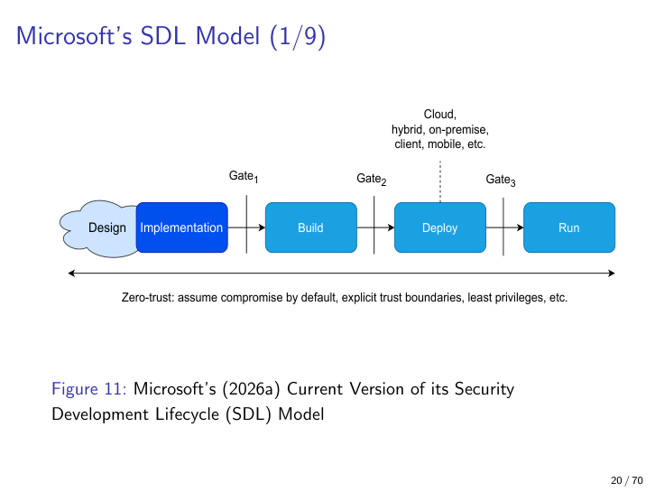

*Figure 11.2 — Microsoft SDL pipeline. Five stages (Design → Implementation → Build → Deploy → Run); three gates between them; a zero-trust baseline underneath the whole pipeline.*

**Definition.** A five-stage pipeline — **Design → Implementation → Build → Deploy → Run** — with three security gates and a zero-trust foundation.

**Why it matters.** It gives architects a vocabulary for *where each control lives* and *who owns it*. Each gate prevents a different class of compromise; "shifting left" too aggressively (moving everything to Gate 1) leaves Gates 2 and 3 blind.

### The three gates

| Gate | Sits between | Catches |
|---|---|---|
| **Gate 1** | Implementation → Build | Dev-time security: vulnerability scanning, secure-coding compliance, **operational security of developers** (PATs, MFA, signed commits) |
| **Gate 2** | Build → Deploy | CI/CD pipeline integrity: poisoned runners, supply-chain inserts, OWASP CI/CD Top-10 |
| **Gate 3** | Deploy → Run | Hardening and secure configuration of the deployed system: Kubernetes manifests, service-account tokens, network policies |

**Underneath all three: zero-trust.** Assume compromise has already happened somewhere; require explicit authn/authz at every boundary; grant least privilege.

**Analogy.** Airport security. Gate 1 is the passport/ticket check before you enter the terminal. Gate 2 is the baggage screening on your luggage. Gate 3 is the boarding-gate scan that matches person to seat at the point of deployment. Skip any one and a different class of threat walks through.

**Example.** Gate 2 catches a poisoned CI runner that was compromised by a phishing attack against the maintainer. Gate 3 catches a Kubernetes Deployment shipped with default service-account tokens still enabled. Neither is detectable at the other gate.

**Pitfall.** Treating "shift-left" as a slogan that means *move every check to Gate 1*. Runtime hardening (Gate 3) is still essential because configs drift after deployment — see "hardening tools for Kubernetes" at the end of this section.

> **Cross-reference.** Gate 2 is precisely the *integrity layer* of the CI/CD pipeline you read about in Ch 6 (Deployability) — blue-green/canary deployments must themselves be hardened. Gate 3 is where Ch 10's *privilege drop* tactic is enforced at deploy-time (UID, capability set, mount restrictions).

### Operational security of developers (Gate-1 reality check)

**Definition.** Protecting the *humans* who build the software — their accounts, keys, repository credentials — from social-engineering attacks aimed at package or account takeover.

**Why it matters.** Zimmermann et al. (2019) showed that the npm ecosystem has a "small world with high risks" topology: compromising one heavily-depended-on maintainer cascades into thousands of downstream apps. **Your beautiful zero-trust diagram is irrelevant if a maintainer's PAT is phished.**

**Two attack patterns.**

1. **Package takeovers** — attacker becomes a co-maintainer (often through social engineering), then ships a malicious release.
2. **Account takeovers** — attacker steals keys / credentials directly (phishing, credential stuffing, malware on the maintainer's laptop).

**Examples** (named in the lecture): event-stream (npm, 2018); ua-parser-js (2021); xz-utils (2024). All three began with social/credential compromise — *not* a code-level vulnerability.

**Defences.** Mostly non-technical: maintainer hygiene, MFA with hardware tokens, signed commits, limiting auto-merge, organisational SSO enforcement.

### OWASP CI/CD Top-10 (Gate-2 vocabulary)

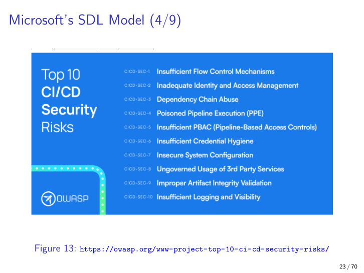

*Figure 11.3 — OWASP CI/CD Top-10. The build pipeline is now the system's highest-privilege component; this is the canonical taxonomy of its weaknesses.*

**Why it matters.** CI/CD pipelines are increasingly the highest-privilege component in a system — they sign artefacts, hold cloud credentials, and push to production. They are also the least scrutinised. The lecture's concrete recommendations:

1. **Limit auto-merge** — never let a bot merge to a deploy branch without a human approver.
2. **Require prior approval of a CI/CD account** for artefacts to flow end-to-end.
3. **Prevent non-authorised accounts from triggering production builds/deployments** (no tag-triggered prod deploys from any maintainer's tag).
4. **Require approvals + reviews on production branches.**

**Pitfall.** Adding "approvals required" only to `main` while leaving the deploy workflow triggerable by tags any maintainer can push. The attacker pushes a tag, the deploy fires, no human ever saw it.

**Analogy.** Treating the build robot like an unsupervised intern with the master key.

### Hardening tools for Kubernetes (Gate-3 architectural awareness)

**Why it matters.** Configuration drift after deploy is where Gate 3 fails silently. Code has not changed; the cluster's risk profile has, because (a) configs got edited, or (b) new CVEs landed against images that have been running for months.

**Tools named in the lecture** (you are not expected to memorise the list — you *are* expected to recognise that scanners exist for this layer): Checkov, Kubeaudit, KubeLinter, Kube-score, Kubesec, SLI-KUBE, Kube-bench, Kubescape, Trivy, NeuVector, StackRox.

**Two architectural placements.**

- **In-cluster scanner / audit node** filtering new pods before they reach a worker node — admission-time control.
- **Registry pull-and-scan loop** that re-scans deployed images against vulnerability databases and updates affected nodes — runtime control.

**Pitfall.** Scanning only at admission and never on the running fleet — Gate-3 blindness once configs drift or new CVEs land.

---

## 4. Threat modeling — Microsoft's four-task loop

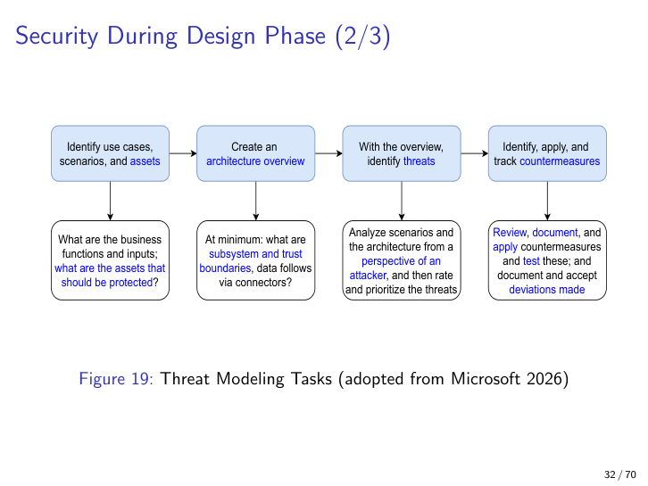

*Figure 11.4 — Microsoft's four-task threat-modeling loop: assets → architecture overview → threats → countermeasures, with the **deviations register** closing the loop.*

**Definition.** A structured design-phase activity to enumerate threats and design countermeasures *before code is written*.

**Why it matters.** Threats found at design cost orders-of-magnitude less to fix than threats found in production. Threat modeling also produces *traceable security requirements* — the bridge from "we worried about X" to "we tested for X".

**The four tasks.**

1. **Identify use cases, scenarios, and assets.** What are the business functions and inputs? What assets must be protected (source code, credentials, customer PII, signing keys)?
2. **Create an architecture overview.** At minimum: subsystems, *trust boundaries*, and data flows via connectors. This is where the trust-boundary diagrams from §5 below get drawn.
3. **Identify threats.** Analyse from the *attacker's* perspective; rate and prioritise. The lecture references RFC 3552 as a starting taxonomy for protocol-level threats.
4. **Identify, apply, and track countermeasures.** Review, document, apply, *test*. **Document and accept any deviations** — the **deviations register** is what makes the model auditable.

**Worked example** (the AI bug-fix agent from Ch 10's Case #8):

| Task | Output |
|---|---|
| Assets | Source repo, CI credentials, PR-merge permission, training-data store |
| Architecture | Agent ↔ LLM provider ↔ repo host ↔ CI runner ↔ test harness; trust boundary between each pair |
| Threats | Prompt injection, agent-to-agent collusion, supply-chain takeover, exfiltration via outbound HTTP |
| Countermeasures | Human-in-the-loop merge, scoped tokens, output validation, egress allowlist |

**Pitfall.** Stopping at task 3 — threats listed but countermeasures never tracked. **The "deviations accepted" register is what makes the model auditable.** Without it, every six months a new engineer re-discovers the same risk and re-debates it.

**Analogy.** A red-team table-top exercise on paper, before the system exists.

> **Cross-reference.** Ch 5 (Testability) — the threats here become the *negative test cases* of the test suite. Ch 10 — the safety-and-security scenarios on agentic systems are the source of this worked example.

---

## 5. Trust boundaries — three scales

**Definition.** A *trust boundary* is a line in the design across which authentication, authorisation, or data validation must be re-established because the level of trust changes.

**Why it matters.** Every boundary is an enforcement point — and **every missing boundary is a weakness**. The kill chain in §6 is largely the story of an attacker crossing boundaries that were not enforced.

The lecture treats trust boundaries at three scales — get this list right; it is exam-likely.

### Scale 1 — Hardware / protection rings

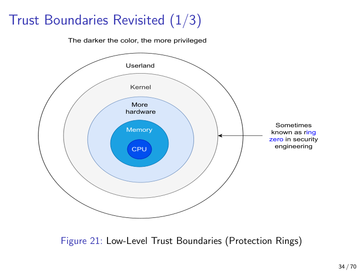

*Figure 11.5 — CPU protection rings. Ring 0 is kernel-mode (highest privilege); Ring 3 is userland (lowest). The darker the shade in the slide, the higher the privilege.*

Hardware itself enforces a trust boundary: x86 CPUs maintain *protection rings* in which **ring 0** is kernel-mode and **ring 3** is userland. Memory pages, I/O ports, and privileged instructions are gated by ring level. Crossing from ring 3 into ring 0 requires a controlled trap (syscall) — that trap is the boundary.

Side-channel attacks (§9 below) are precisely the attacks that *evade this ring boundary entirely* by reading state through unintended channels.

### Scale 2 — Component / machine level

Components inside a single machine *tend* to trust each other; cross-machine they should not, unless an explicit trust relationship is declared. Containers within a pod share network and (depending on config) some namespaces; pods on a node share a kernel; nodes in a cluster share an API server. Each transition is a different trust level and deserves an enforcement point.

### Scale 3 — Deployment level

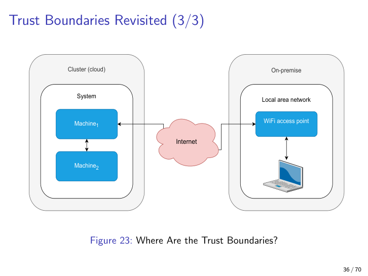

*Figure 11.6 — Deployment-level trust boundaries: cloud cluster ↔ on-premise ↔ local LAN ↔ WiFi ↔ Internet. Every arrow crossing a coloured region is a boundary.*

At the deployment scale, the boundaries are: **cloud cluster ↔ on-premise ↔ local LAN ↔ WiFi access point ↔ Internet**. Each transition is a boundary, and a microservice running in pod A on cluster X talking to pod B on cluster Y crosses *cluster*, possibly *network*, and definitely *service-mesh* boundaries — each should enforce mTLS plus policy.

**Common pitfall — the M&M model.** Treating "inside the firewall" as one big trust zone — *crunchy outside, soft inside*. The kill chain in §6 destroys this assumption: once the attacker is inside the chocolate shell, nothing stops them.

**Analogy.** A castle has the moat, curtain wall, inner bailey, keep, and finally the king's chamber — each line crossed should require reauthentication. The M&M model says "if you crossed the moat, you can walk into the chamber". The kill chain proves that is the wrong design.

---

## 6. The cyber kill chain — eight stages, lessons drawn

> **Note on naming.** The classical Lockheed-Martin kill chain is usually given as a seven-stage *attack* sequence: recon → weaponise → deliver → exploit → install → command-and-control (C2) → actions on objective. The lecture's version is a closely related but slightly different framing: it begins **after** initial delivery / exploitation and walks the *post-exploit* stages an attacker takes inside a containerised system. That is the version we present below, because it is the one the lecturer's worked example uses — and the one Figs 11.7 and 11.8 illustrate.

**Definition.** A canonical staged attack model. The lecturer's eight-stage walkthrough: **initial exploit → privilege escalation → boundary escape → reconnaissance → lateral movement → data exfiltration → log tampering → persistence (RAT installation).**

**Why it matters.** It teaches architects *why* defence-in-depth matters: stopping any single link breaks the whole chain. It also reveals **which design tactics matter at which stage** — which is the architectural payoff.

### Worked example (the lecturer's scenario)

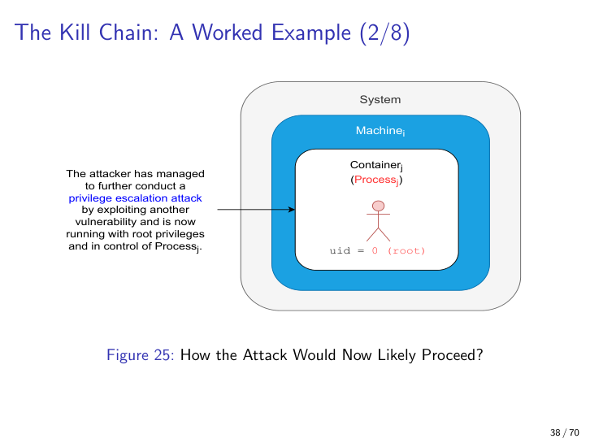

*Figure 11.7 — Kill-chain stage 2. The attacker has already gained code execution as uid=1000 inside Container_j; a privilege-escalation exploit raises uid to 0 (root) inside the container.*

| # | Stage | What the attacker does | Architectural defence |
|---|---|---|---|
| 1 | **Initial exploit** | Exploits a vulnerability inside `Container_j`; gains control of `Process_j` as uid=1000 | Input validation, sandboxing, sanitisers (Ch 5/Ch 10) |
| 2 | **Privilege escalation** | A priv-esc exploit raises uid to 0 (root) **inside the container** | Drop capabilities; read-only root filesystem; non-root UID; `--privileged=false` |
| 3 | **Boundary escape** | A *container-escape* exploit lets the rooted process escape the container; attacker now controls `Machine_i` | Stronger isolation (gVisor, Kata Containers, VMs); seccomp/AppArmor profiles |
| 4 | **Reconnaissance** | Scan for other machines; build a topology | Network segmentation; least-privilege service accounts; deception (honeypots) |
| 5 | **Lateral movement** | Re-use the same exploit chain on `Machine_1` | mTLS + per-request authz (zero-trust); micro-segmentation |
| 6 | **Data exfiltration** | Establish an encrypted tunnel via a compromised proxy on the dark web; transfer data; close tunnel | **Egress filtering** (default-deny outbound); DLP; encrypted-at-rest data classification |
| 7 | **Tampering** | Clean logs on both compromised machines | **Defensively-designed logging** — write-only sinks, off-host SIEM, tamper-evident hashing |
| 8 | **Persistence** | Install a Remote Access Trojan (RAT) for re-entry | File-integrity monitoring; immutable infrastructure; admission-time scanning |

### Lessons the lecturer draws *explicitly*

1. **Exploitation chains (plural)** are needed for full compromise — no single vulnerability suffices.
2. **Privilege escalation** is almost always required — privilege drop (Ch 10) is therefore high-leverage.
3. **Isolation mechanisms** (containers, VMs, namespaces) are *breakable* but *raise the cost* — they buy time and noise.
4. **Reconnaissance** is the prerequisite for lateral movement — denying recon (segmentation, deception) cripples the chain.
5. **Logging must be designed defensively** — *log tampering is itself a stage*. Off-host SIEM with append-only semantics is non-negotiable.
6. **Zero-trust matters** because simple DMZs are insufficient — see Fig 11.8.

### Why the naïve DMZ is not enough

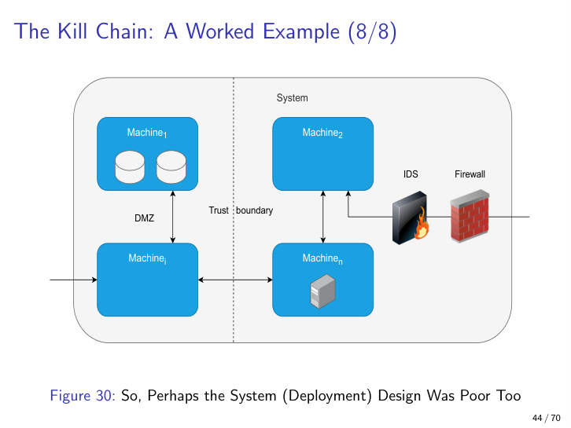

*Figure 11.8 — A standard DMZ + perimeter firewall + IDS does **not** stop the kill chain. It addresses stage 1 (initial exploit) and possibly stage 6 (exfil) — but stages 2–5 happen entirely **inside** the trusted zone, where the perimeter is blind.*

**Analogy.** A burglary that begins with picking a window lock, then finding the gun-safe combination, then ramming the safe, then casing other houses on the street, then driving off with a stolen-car-plate routine. A doorbell camera (perimeter IDS) sees stage 1 and stage 6 only — it never sees stages 2–5.

**Examples.** SolarWinds, xz-utils, Volt Typhoon — all follow recognisable kill-chain stages and were *not* stopped at the perimeter.

> **Cross-reference.** Ch 10 introduced *privilege drop* as a tactic; the kill chain explains *why* that tactic has outsized leverage — it breaks stage 2.

---

## 7. Zero-trust architecture — three layers

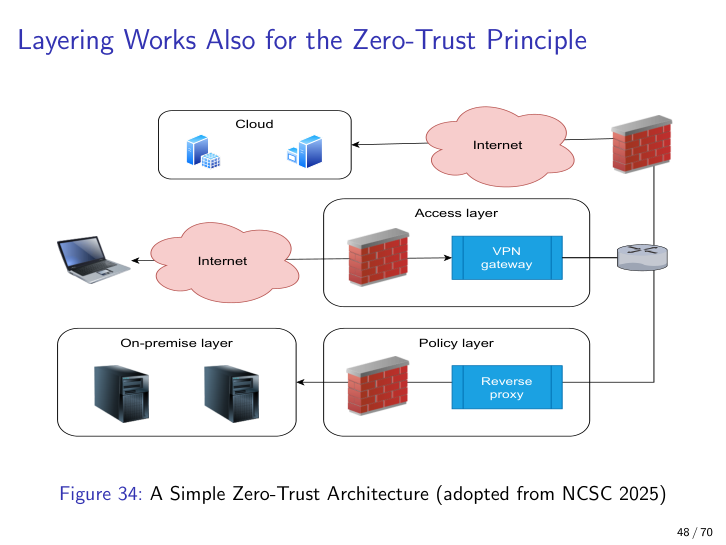

*Figure 11.9 — Zero-trust architecture per NCSC 2025: **Access layer** (where users/devices enter), **Policy layer** (per-request authn/authz decisions), **Resource layer** (the protected assets). The policy layer sits between every flow — even from already-authenticated cloud workloads.*

**Definition.** An architectural style with the explicit assumption *"compromise has already happened, somewhere"* — no implicit trust based on network location; **every request authenticated, authorised, and encrypted**.

**Why it matters.** It is the modern alternative to the DMZ / perimeter model the kill chain exposes as inadequate.

### The three layers (NCSC 2025)

| Layer | What lives here | Example |
|---|---|---|
| **Access** | The entry point: where users / devices arrive | VPN gateway, reverse proxy, identity-aware proxy |
| **Policy** | Authn/authz decision engines, possibly per-request | OPA, SPIFFE/SPIRE issuer, OAuth/OIDC server |
| **Resource (on-prem)** | The protected assets themselves | Databases, internal APIs, file stores |

**The crucial property:** the policy layer sits between Internet and the resource layer **for every flow**, even from workloads that are already authenticated. There is no "I already showed my badge at the door, let me through" — every door checks again.

**Example.** Google's BeyondCorp — engineers access internal services from the open internet, with per-request device + identity verification, no VPN required.

**Pitfall.** Reading "zero trust = mTLS" and stopping there. **Zero trust is a policy + continuous-verification *model*; mTLS is one mechanism.** You can have mTLS without zero trust (mutually-authed peers that still grant blanket trust on every method), and you can implement zero trust without mTLS (signed JWTs over plain HTTPS with per-request authz).

**Analogy.** A nightclub where the bouncer rechecks ID at every door inside, not just at the front. The cost is friction; the payoff is that an attacker who got past the front cannot wander.

---

## 8. Sidecar pattern for zero-trust

The sidecar pattern you first met in Ch 9 (Scalability) — adjacent container handling cross-cutting concerns — is the **canonical implementation** of zero trust. Same primitive, security-flavoured intent.

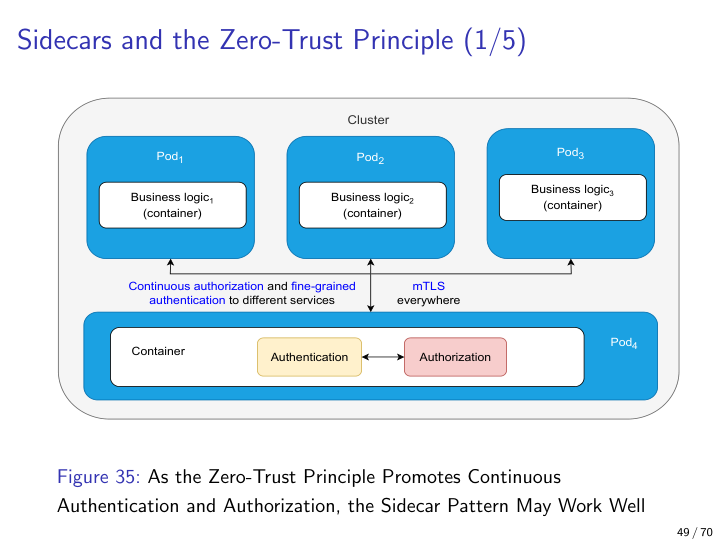

*Figure 11.10 — Sidecar zero-trust deployment. Each business pod gets an adjacent sidecar (or routes through a shared sidecar pod) that handles authentication, authorisation, mTLS termination, and monitoring. Business code is **decoupled** from security policy.*

**Definition.** A deployment pattern where each business-logic container in a pod gets an adjacent "sidecar" container that handles cross-cutting security concerns: authentication, authorisation, mTLS, monitoring, routing.

**Why it matters.** Lets you centralise zero-trust enforcement *without* coupling it to business code. Underpins service meshes (Istio, Linkerd).

### Three variants depicted in the lecture

| Variant | Topology | Trade-off |
|---|---|---|
| **Shared sidecar pod** (`Pod_4`) | One pod runs authn/authz proxies that all business pods route through; mTLS everywhere | Resource-efficient; single point of failure / single attack target |
| **Per-pod sidecar** | Every pod gets its own authn/authz sidecar | More isolation; higher resource cost |
| **Ingress/egress gateway** | Sidecars at the cluster edge enforce mTLS internally and TLS externally; clients are categorised (consumer / business / internal) — this is *scoping* from Ch 10 | Clean external interface; recipe for service-mesh deployments |

**Egress matters.** A common pitfall: adding sidecars but forgetting *egress* filtering — exfiltration through unmonitored outbound DNS or HTTP remains possible (DNS tunnelling from Ch 10). The picture below shows the egress filter living next to the validation sidecar at the cluster edge.

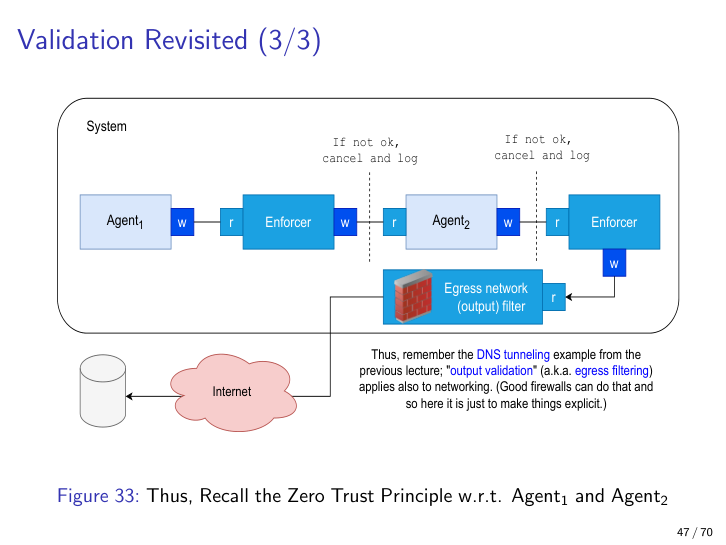

*Figure 11.11 — Sidecar validation on **inbound** + egress filter on **outbound**. Output validation is symmetrical to input validation; both live at the trust boundary.*

**Example.** Istio's Envoy proxy injected into every pod; SPIFFE/SPIRE identities.

**Analogy.** A bodyguard assigned to every guest at a party — they do not change what the guest does, but they verify every interaction. Move all guards to the door (perimeter model) and the rooms inside become free-for-alls.

### Honeypots and deception via sidecars

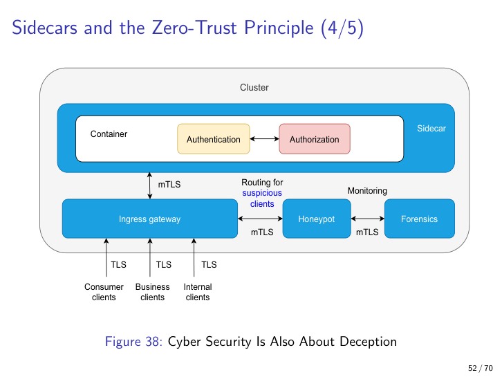

*Figure 11.12 — A sidecar can also route **suspicious** clients away from real services and into a honeypot environment that runs forensics + monitoring.*

**Definition.** A *honeypot* is a deliberate decoy resource that looks like a real target, used to attract, observe, and forensically study attackers.

**Why it matters.** Cyber security is also about *deception*, not only defence. A honeypot turns reconnaissance (kill-chain stage 4) into an *early-warning signal*. Attackers waste effort on the fake; defenders gain TTP intel (Tactics, Techniques, Procedures).

**Example.** Cowrie SSH honeypot on a public IP — collects credential-spray attempts and post-exploit commands.

**Pitfall.** Honeypots leaking into real infrastructure (shared logging, shared accounts) — the attacker pivots from the decoy into the real system. **The honeypot must itself be isolated** — separate cluster, separate identity scope, sink to a separate SIEM.

### Egress filtering, restated

**Definition.** Inspecting and restricting *outbound* traffic from a system, symmetrical to inbound input validation.

**Why it matters.** Reduces blast radius. If an attacker is already inside (kill-chain stage 5 or later), egress filtering blocks data exfiltration (stage 6) and command-and-control (C2) callbacks (stages 4–6).

**Example.** Allowlist of outbound destinations for production pods; drop everything else (default-deny outbound).

**Pitfall.** Allowing wide outbound DNS or HTTP to "the internet" for "package updates" — used by both legitimate `apt` and exfiltration. DNS tunnelling defeats naïve filters; you need protocol-aware inspection.

**Analogy.** Customs check on the way *out* of a country, not just on arrival.

---

## 9. Three supplementary security idioms

Three concepts the lecture treats more briefly. Each is the kind of thing the exam likes for a "name and one sentence" prompt.

### Confused deputy (Norm Hardy 1988)

**Definition.** A program that holds authority on behalf of multiple principals and is tricked into misusing its authority for one principal at the expense of another.

**Original example.** A compiler that could write to a billing file *and* accept user-specified output files. A user names the billing file as their output; the compiler writes to it — using *its own* privilege, not the user's.

**Modern analogue: SSRF.** A web app has internal-network access; an attacker tricks it into fetching `http://169.254.169.254/...` (AWS metadata endpoint). The web server fetches the URL with *its* network identity, returning cloud credentials to the attacker.

**Mitigation.** Capability tokens / scoped tokens — pass the *caller's* authority along with the request, do not let the deputy substitute its own. This is the same idea as Ch 10's privilege-drop tactic, applied at the *delegation* boundary instead of at the process boundary.

**Pitfall.** Granting a monitoring/agent component broad privileges "to make it work". Better: scope every token to the smallest set of resources it needs.

### Data classification

**Definition.** Categorising data by type, sensitivity, and risk so that controls (encryption, retention, access) can be applied proportionally.

**Why it matters.** "Encrypt everything" is unaffordable and useless if the keys live next to the data; classification tells you *what* must be encrypted, *where*, and *who* may decrypt.

**Example.** GDPR personal-data classification (Hjerppe 2019) — separate modules for *core personal data* (R5–R7), *event log* (R4), *consent centre* (R3), *restriction centre* (R8), behind a GDPR-request service interface. Each gets its own controls.

**Pitfall.** Classifying at one snapshot and never re-classifying as the system evolves. Personal data leaks into log files, into ML training sets, into analytics dashboards.

### Side-channel attacks

**Definition.** Attacks that exfiltrate information through unintended physical/timing channels rather than the official interface.

**Why it matters.** Cloud multi-tenancy means an attacker can be on the same hardware as you. Spectre, Meltdown, Foreshadow, Hertzbleed — not theoretical.

**Channels include:** timing, cache state, power consumption, acoustic emanations, EM emissions. **Many bypass protection rings entirely** (see Fig 11.5) — the attacker never crosses the ring 0/3 boundary because they read state out-of-band.

**Mitigations.** Plug the leak (constant-time code, cache-line scrubbing); add noise (jittering); or accept the risk and minimise sensitive computations on shared hosts (dedicated tenancy).

**Pitfall.** "We don't run untrusted code." On a multi-tenant cloud node you *do*, by definition, from your provider's perspective.

**Analogy.** Listening to a safe-dial click pattern to infer the combination — never touching the dial yourself.

---

## 10. Networking and MitM — Conti & Dragoni's 7 principles

Networking is itself an attack surface; secure-design at the **connector** layer (Ch 1) is mandatory. The classical attack on connectors is the Man-in-the-Middle (MitM): an attacker interposed between two endpoints intercepts, modifies, or destroys traffic — violating all three of CIA.

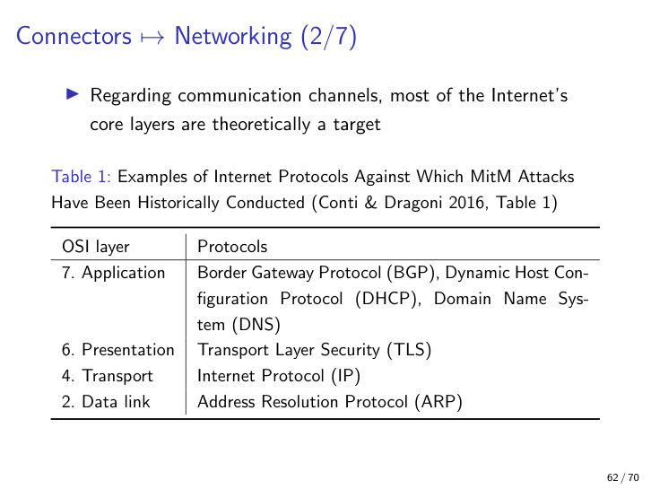

*Figure 11.13 — MitM attacks classified by OSI layer. Documented historically against BGP / DHCP / DNS (Application), TLS (Presentation), IP (Transport), and ARP (Data link). Almost every layer has been MitM-ed at some point in history.*

### Conti & Dragoni (2016) taxonomy

Three axes:

- **(a) Impersonation type** — what identity is being faked.
- **(b) Communication channel** — wired, wireless, application-protocol.
- **(c) Network location** — same LAN, same WAN, on-path nation-state.

Documented examples: ARP spoofing on a LAN; rogue DHCP server; BGP route hijack (Pakistan-YouTube 2008); rogue DNS resolver; TLS-stripping proxy.

### The 7 countermeasures (numbered — exam recall fodder)

1. **Strong *mutual* authentication for all endpoints.** Both sides verify each other; not one-sided.
2. **Exchange private keys over a secure channel.** Bootstrap problem — the first exchange must already be safe.
3. **Use *few* secure channels for integrity verification.** Verify hashes / fingerprints over an out-of-band channel; fewer such channels means less attack surface, not more.
4. **Sign public keys via a certified authority** (PKI / CA). Without an authority, every public key is "trust on first use".
5. **Use certificate pinning.** Hard-bind the expected cert (or its issuer) in the client; refuse any other, even if CA-signed.
6. **Encrypt communication.** TLS / IPsec / similar — confidentiality and tamper-evident integrity on the wire.
7. **Continuously examine endpoint behaviour against an agreed protocol.** Detect deviations at runtime — anomaly detection, protocol fuzzing of live traffic.

### The caveat (this is itself an exam point)

> **Principle 6 — encryption — is *meaningless* without principles 1, 2, and 4.**

If you encrypt to the *wrong* (or the attacker's) key, you have handed the attacker your data with confidence. Encryption without mutual authentication + secure key exchange + CA-signed public keys is **negative-value security** — it produces false assurance, which is worse than no encryption at all because the operator stops looking.

**Example pitfall.** Adding TLS to a mobile client without certificate pinning. A corporate proxy with a CA-trusted MitM cert (legitimate in some enterprise contexts; planted in others) sees everything. Cert pinning (principle 5) is what closes that hole.

**Analogy.** Sealing a letter with wax but handing it to the spy at the post office because you never verified his uniform. The seal is real; the recipient is wrong; the secret is lost.

### CI/CD networking hardening (HTTP → SSH → SSH+HTTPS)

A small worked example the lecture uses to make the principles concrete on a build/deploy topology:

| Iteration | Network design | Verdict |
|---|---|---|
| **Bad** | Build/test/deploy servers connected by plain HTTP + a "shared secret"; the TLS certificate is unused | Wide-open MitM target |
| **Better** | Replace HTTP with SSH for all hops | SSH is for control, not necessarily for HTTP-based service traffic; clients still need HTTPS |
| **Good** | **SSH for the control plane, HTTPS for the use plane**, plus *integrity checks* before pushing to production | Two locks for two different threat models |

**Analogy.** Locking the office (SSH for admin) and locking the cash register (HTTPS for sales) — two different locks for two different threat models. Using HTTPS for everything works but loses the audit/keypair semantics of SSH for human operators.

---

## 11. Designing for cryptography — the encryption lifecycle

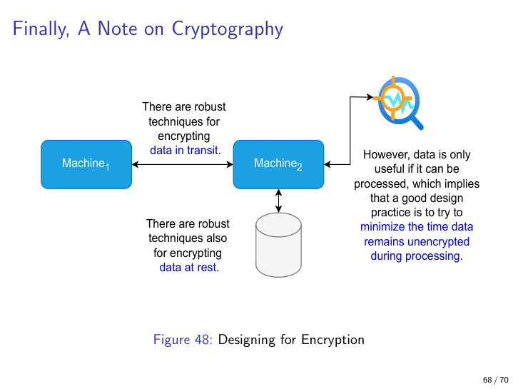

*Figure 11.14 — Designing for cryptography. **At-rest** (database, disk), **in-transit** (TLS / mTLS on the wire), and the brief **processing window** during which plaintext exists in memory. Minimise the third.*

**Definition.** Crypto-as-design-discipline: choose where data is encrypted *at rest*, *in transit*, and **minimise the window in which it is unencrypted during processing**.

**Why it matters.** Most production breaches exploit the **processing window** — memory dumps, debug logs, swap files, third-party API calls passing through plaintext. "Robust techniques exist for encryption at rest and in transit" — the *design's* job is to ensure the plaintext processing window is as short and isolated as possible.

### The three data states

| State | Threat | Standard control |
|---|---|---|
| **At rest** | Disk theft, backup leak, cold-snapshot access | AES-256 disk/column encryption; KMS-managed keys |
| **In transit** | MitM on the network (§10) | TLS / mTLS — but only with the 7 Conti–Dragoni principles |
| **In processing** | Memory dumps, debug logs, swap files, third-party calls | **Minimise the window**: enclaves, ephemeral buffers, scrub-on-use, secrets fetched just-in-time |

### Reducing the processing window

Concrete tactics named or implied in the lecture:

- **TLS termination at the application boundary**, not at a far-upstream load balancer that then re-broadcasts plaintext on an internal network.
- **Decrypt into a short-lived buffer**; scrub memory after use; never write decrypted state to logs or swap.
- **Just-in-time secret fetch** from a secrets manager (Vault, AWS Secrets Manager) rather than loading all secrets at process start.
- **Confidential computing** — Intel SGX, AMD SEV — keeps data encrypted *even during processing* inside an enclave. Still rare in mainstream apps, but the design pattern.
- **Homomorphic encryption** — compute over ciphertext directly. Bleeding-edge; the lecture mentions it as the theoretical ideal.

**Pitfall.** Encrypting at rest with **the key stored in the same config file as the DB connection string**. Equivalent to no encryption. The key must live in a separate trust zone (KMS, HSM, secrets manager) with its own access policy.

**Analogy.** Cash-in-transit security. Armoured truck (transit); bank vault (rest); *inside the till during a sale* (processing) is the brief vulnerable moment — minimise it. Do not run the till for an hour with the drawer open.

> **Cross-reference.** Ch 6 (Performance) — encryption introduces compute cost (CAP/PACELC + crypto overhead); side-channels exploit timing. Both are performance × security trade-offs. Ch 10 — the privilege-drop tactic limits *who* in the running system can see plaintext; cryptographic-window minimisation limits *how long*.

---

## 12. Takeaways — what to walk into the exam knowing

Reading this chapter from the top, you should leave with twelve crisp takeaways. They are the bullet points the exam is likely to test.

1. **Fail-safe vs. fail-secure** is a non-negotiable organisational decision. Fail-safe = stay open (max reliability). Fail-secure = lock down (max security). Be ready to give an example of each (traffic light vs. bank vault) and to defend mixing the two as a *pitfall*.

2. **Security is a constraint** that crosscuts requirements, architecture, and implementation — not "just another quality attribute". Be ready to list constraints at each layer: attack-surface minimisation (architecture), language choice + coding standards (implementation), threat-modelled requirements (requirements).

3. **Microsoft SDL = 5 stages + 3 gates + zero-trust baseline.** Know which gate catches what. Gate 1 = dev-time + SCA; Gate 2 = CI/CD pipeline integrity; Gate 3 = deployment hardening. Be ready to draw the picture (Fig 11.2).

4. **The four-step threat-modeling loop** — assets → architecture overview → threats → countermeasures — including the **deviations register**. The deviations register is what makes the model auditable; mention it explicitly.

5. **Trust boundaries exist at three scales** — hardware rings (ring 0 ↔ ring 3), machine/component, deployment (cloud ↔ on-prem ↔ LAN ↔ WiFi ↔ Internet). Be ready to draw all three. The M&M model ("crunchy outside, soft inside") is the canonical anti-pattern.

6. **The kill chain has eight stages** in the lecturer's framing: initial exploit → priv-esc → escape → recon → lateral → exfil → tamper → persist. Defence in depth means breaking *any one* link. Privilege drop (Ch 10) is high-leverage because it breaks stage 2.

7. **Zero-trust = "assume compromise + verify every request"**, not "VPN replacement". Three-layer architecture (Access / Policy / Resource) per NCSC 2025. The policy layer sits between every flow.

8. **The sidecar pattern is the canonical zero-trust implementation.** Three variants: shared sidecar pod / per-pod sidecar / ingress-egress gateway. Same primitive as Ch 9; the security flavour is the intent.

9. **Egress (output) validation matters as much as input validation** — symmetrical. Needed against C2 + exfil (kill-chain stages 4–6). Default-deny outbound; DNS tunnelling defeats naïve filters.

10. **Confused deputy** = a privileged component duped into misusing its privileges. Modern instance: SSRF. Mitigated by least-privilege + scoped capabilities (Ch 10).

11. **MitM countermeasures = 7 principles** (mutual authn, secure key exchange, few-integrity channels, CA-signed PKI, cert pinning, encryption, continuous protocol monitoring). **Principle 6 (encrypt) is *null* without 1, 2, and 4.** This caveat is itself an exam point — say it.

12. **Cryptographic design minimises the plaintext processing window.** "Encrypted at rest" with the key in the same env file is meaningless. Three data states: at rest, in transit, in processing — the third is the breach-prone one.

### Final framing

If you have to compress everything into one sentence for the exam:

> *Security is a constraint enforced at every gate of the SDL, over a zero-trust baseline, by breaking the kill chain at as many of its eight links as the architecture can support — and every cryptographic, network, and privilege decision must be justified against a written threat model with a deviations register.*

That sentence carries the spine of the chapter. Everything else — fail-safe vs. fail-secure, sidecars, MitM countermeasures, the encryption lifecycle — hangs off it.

---
