# Chapter 12 — Usability and Power Consumption

> *"Performance can be measured with a stopwatch. Usability needs a user — and half the signal lives inside their head."*
> — paraphrasing the L10 framing

## 12.0 Opening: two QAs that don't fit the engineering mould

The course has spent eleven chapters in comfortable engineering territory: modifiability has cohesion metrics, performance has latencies, security has CIA. Plug in a measurement, prove the tactic moves the needle. **Usability and power consumption don't play that game.** Usability sits between psychology, design, and engineering — its ground truth lives in human heads and can only be sampled by proxy. Power consumption *does* have hard physical units (watts), but it is dominated by hardware optimisations that software can only *fail to interfere with*. Both QAs invert the usual "build a tactic, measure the result" loop into "respect a substrate (the human; the silicon), and avoid wrecking it."

That inversion is why this chapter pulls so heavily on patterns and tactics introduced earlier. **Memento** comes back from Ch 4 as the engine of undo. **MVC and Observer** come back from Ch 3 as the engines of re-skinning and A/B testing. **Graceful degradation** comes back from Ch 7 as the bridge from availability into power. **Offloading** comes back from Ch 9 as the bridge from scalability into power. **Claim-check** from Ch 6 turns out to be Memento with a different name. The lecturer's framing makes this explicit: when no new tactics exist for a new QA, look across the catalogue for transferable ones — that is itself the meta-skill the course wants you to leave with.

A second framing matters: **usability is not the GUI.** Bass et al. define it as *"how easy it is for the user to accomplish a desired task and the kind of user support that the system provides"* — and "user" here is a class, not a person. End-users, system administrators, developers, and architects are all users, and a change that helps one class can degrade another. Likewise, **power is not the CPU.** On a laptop the display dominates; on a server the cooling subsystem does; software runs deep inside an analytical decomposition that includes idle and loss components it cannot directly touch.

The chapter is organised in two halves around these two QAs, with the bridge between them being the **usability-vs-power trade-off**: cutting display brightness saves the most watts and ruins the most usability. We will (a) define usability and contrast it with a technical QA, (b) draw and extend the **TAM** model with an abandonment branch, (c) layer measurement through **UZ/UI/UX**, (d) decompose usability into **sub-QAs** and reapply them to *audiences*, (e) name **dark patterns** and the ethics of usability optimisation, (f) decompose **power = computing + idle + cooling + loss**, (g) separate **P-states from C-states** as the everyday lever, (h) distinguish **graceful shutdown / graceful degradation / forceful degradation**, and (i) catalogue **preloading / prefetching / offloading** as power tactics. The eight-bullet takeaway list closes.

---

## 12.1 Usability defined — and why it is "non-technical"

**Bass et al. (2021):** Usability is *"how easy it is for the user to accomplish a desired task and the kind of user support that the system provides."* The definition is task-centric: did the user accomplish their goal cheaply in time, clicks, and cognitive load? Modern framings widen this to include *enjoyment, satisfaction, joy* on the positive side and *frustration, anger* on the negative — so usability has two engineering surfaces (maximise the positive; minimise the negative) instead of one.

**Why "non-technical."** A performance number can be measured externally and reproduced. A usability number requires (i) a user, (ii) a task, and (iii) often a self-report — and the signal partly lives inside the user's head where instrumentation cannot reach. The QA framework's templates (source / event / environment / response / response measure) still apply, but the **response measures degrade to proxies** (clicks, time-on-page, retention, satisfaction surveys). The lecturer flags usability explicitly as *"quite distinct"* from the rest of the course.

**Common pitfall:** treating usability as "make the UI prettier." It includes the system's affordances for being **learned**, **recovered from**, and **adapted to** — affordances that often live in the controller and the model, not in the view.

---

## 12.2 The negative side — the Computer Frustration Model

Hertzum & Hornaek (2023) propose a causal chain that explains why *functional* software still produces angry users:

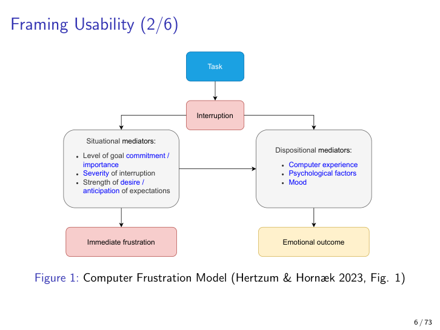

A **task** combined with an **interruption** is filtered through situational and dispositional mediators — goal commitment, severity of the interruption, computer experience, mood — to produce **immediate frustration** and an **emotional outcome**. Two architectural takeaways: (1) severity is something the architecture controls (clear error messages reduce severity), (2) goal commitment is something the *use case* controls (filing a tax return on a deadline cannot be lowered, so the architecture must absorb the variance elsewhere).

**Worked example.** A user filing a tax return (high goal commitment) hits an opaque error message (high severity) on a Friday afternoon (bad mood). The model predicts a strong emotional outcome irrespective of how many other tasks the system technically supported.

---

## 12.3 TAM — Technology Acceptance Model

Davis (1989) gives the canonical model for *why* a user adopts a tool:

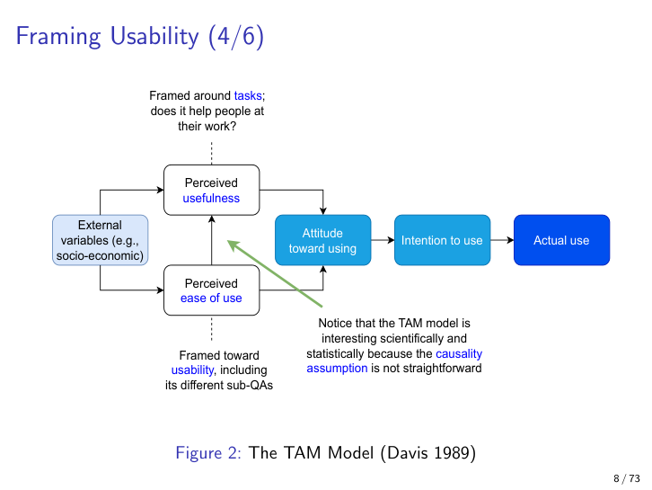

The chain is: **external variables** → (**perceived usefulness** + **perceived ease of use**) → **attitude** → **intention to use** → **actual use**. TAM is one of the few information-systems theories to have "stood the test of time," and on this course it gives the vocabulary that separates two things students conflate:

- **Perceived usefulness** = the *task* dimension. Does the tool help me get my work done?
- **Perceived ease of use** = the *usability* (in the narrow sense) dimension. Is the tool pleasant and cheap to operate?

Both feed attitude, then intention, then use. The lecturer notes that the causality is not as one-way as the arrows suggest — **actual use feeds back into perceived usefulness** (you learn what the tool is good for by using it), so the model is best read as a steady-state explanation rather than a strict process diagram.

### Mapping Bass tactics onto TAM branches

This is the exam-friendly mapping:

| TAM branch | Bass tactic(s) | What the tactic gives the user |
|---|---|---|
| Perceived **usefulness** | **Cancel** | Abort a long action without panic |
| Perceived **usefulness** | **Undo** (Memento) | Return to a known-good state |
| Perceived **usefulness** | **Pause / resume** | Defer cost without losing progress |
| Perceived **usefulness** | **Automation** | Outsource repetition |
| Perceived **ease of use** | **Personalisation** | Match the tool's vocabulary to mine |

**Pitfall.** Treating "ease of use" as the whole of usability. The *usefulness* branch is where the rollback / undo / pause tactics live; the ease-of-use branch is where the GUI-design problems live. Most usability incidents in the wild are *usefulness* failures dressed up as ease-of-use complaints ("the button is hard to find" usually means "the workflow is wrong").

### TAM's missing side — intention to *abandon*

The lecturer's own extension: opposite "intention to use" there should be an **intention to abandon use** branch, fed by:

- frequent incomprehensible errors,
- outdated documentation,
- LLM-powered customer service that loops,
- and frequent interruptions.

Retention is an architectural concern, and the same tactics from the table above are what stop users *leaving*. The abandonment branch reframes usability as **churn prevention** — directly aligning the QA with business value and connecting it to the Falessi et al. evaluation factor "what is the ROI?" (Ch 14).

---

## 12.4 UZ / UI / UX layering — what can be measured directly?

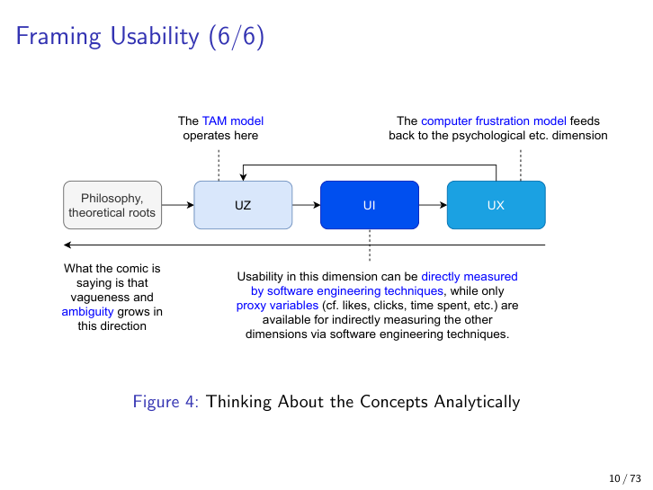

The stack runs from concrete to vague:

1. **UZ** (low-level computer interaction) — keystroke counts, click coordinates, accept/reject events. **Directly measurable.**
2. **UI** (the interface itself) — A/B variants, layout, dialogue trees. Mostly directly measurable.
3. **UX** (the broader experience) — what the user *felt*. **Measurable only by proxy** (likes, time-on-page, retention).
4. **Philosophy / theory** at the top — definitions of "joy," "satisfaction." Not directly measurable at all.

TAM "operates here" near the middle of the stack — its variables are perceptual, so it cannot be wired to UZ directly. The Computer Frustration Model attaches at the top of the stack and explains the psychological dimension feeding back into all the layers below.

**Pitfall.** Reporting clicks as if they were UX. Clicks are a proxy for UI behaviour; they tell you nothing about whether the user enjoyed the click.

---

## 12.5 Usability sub-QAs

Usability decomposes into a deliberately open-ended list of sub-qualities:

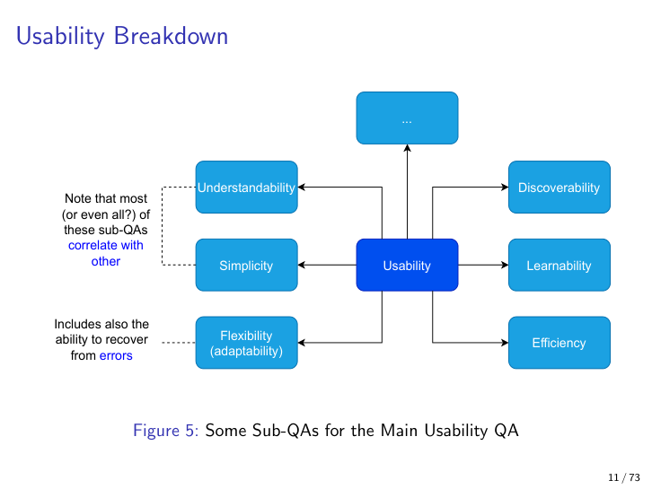

| Sub-QA | What it means | Example tactic |
|---|---|---|
| **Discoverability** | Can the user find the feature exists at all? | Surfaced menus, search, hints |
| **Learnability** | How quickly does a new user become productive? | Tutorials, examples, sensible defaults |
| **Efficiency** | Once learned, how fast is the workflow? | Keyboard shortcuts, batch actions |
| **Simplicity** | Few moving parts; cognitively cheap | "As little design as possible" — Rams #8 |
| **Understandability** | Mental model matches reality | Clear naming, honest error messages |
| **Flexibility (adaptability)** | Can the system bend to my workflow? Includes **error recovery** | Configurable UI, undo, personalisation |

The "..." in the slide is deliberate — the list is open-ended. The lecturer notes the sub-QAs **correlate heavily** ("maybe even all of them"), so optimising one rarely happens in isolation. **Flexibility explicitly includes error recovery**, which is the hook back to Memento (§12.7) and to the Ch 7 availability tactic of graceful degradation.

---

## 12.6 Usability for *whom*? — the audience taxonomy

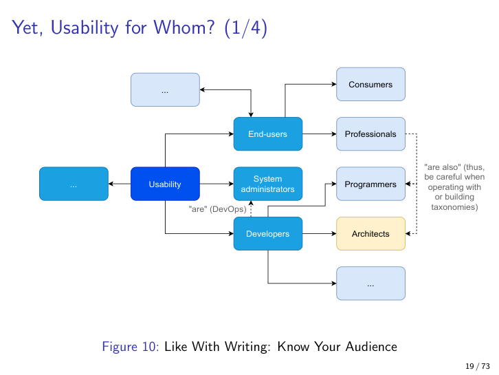

Usability is always defined relative to a **user class**:

- **End-users** — consumers vs. professionals (a Photoshop pro and a casual Instagram user are different classes).
- **System administrators** — operations staff who never touch the application's primary use case.
- **Developers** — the engineering audience consuming SDKs, libraries, APIs.
- **Architects** — a class that evaluates *artifacts* (reference architectures, documentation).

**DevOps blurs the boundary.** Developers "are also" administrators in a DevOps shop, and a change that improves admin usability can degrade developer usability. Architects should know the audience before optimising.

### Reapplying sub-QAs to a reference architecture

The same six sub-QAs reapply to evaluating a **reference architecture** from an architect's point of view:

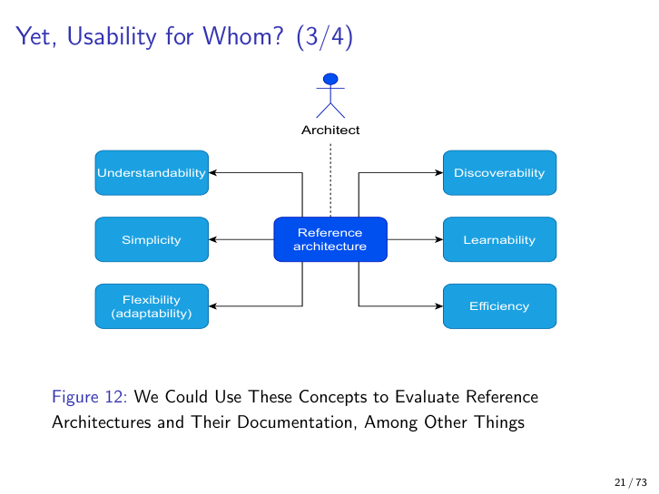

- **Discoverability:** is the reference architecture's documentation findable?
- **Learnability:** can a new architect adopt the pattern in a day?
- **Understandability:** does the diagram match the code?
- **Flexibility:** can the reference architecture bend to my domain?

This yields a **usability yardstick for architectural artifacts themselves** — the meta-move that connects this chapter to Ch 14 (architecture evaluation) and Ch 16 (MLOps reference architecture).

### Silva et al.'s suitability metric

The first *quantitative* yardstick:

> **y = A / B**, where **A** = number of components from a reference architecture that fit the given domain, **B** = total components in the actual implemented architecture.

A high y means the reference architecture covered most of what you built; a low y means you departed from it heavily. Useful when reusing established patterns in a new domain — and it bridges directly to Ch 16 where MLOps reference architectures are evaluated.

---

## 12.7 Usability-supporting patterns (recap from Ch 3, Ch 4, Ch 6)

Three patterns introduced earlier return wearing usability hats.

### Memento — the engine of undo (cross-ref Ch 4 rollback, Ch 6 claim-check)

**Definition.** Snapshot a state so the user (or the system) can roll back. The slide shows a simple serialisation-based memento in R: persist an expensive partial computation, so a re-run reloads instead of recomputing.

**Cross-references.**
- **Ch 4 (Modifiability / rollback):** Memento *is* the rollback tactic at user-action granularity. Where Ch 4 used rollback for deployments, Ch 12 uses it for *user actions*.
- **Ch 6 (Deployability / claim-check):** structurally identical — both stash expensive state externally and return a token. Claim-check is Memento with a queue in the middle.

**Pitfall.** Mementos can balloon storage; tune what gets snapshotted (only the diff, or only above a cost threshold).

### MVC — the engine of re-skinning

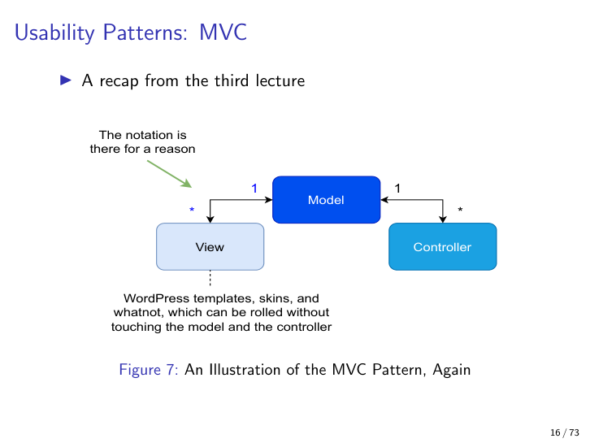

Model–View–Controller separates data (Model) from presentation (View) from input handling (Controller). The `1—*` cardinality between Controller and View is "there for a reason" — one controller can drive many views, which is why WordPress themes / Bootstrap variants / dark mode toggles work without touching business logic. Re-skinning is a *usability* affordance (flexibility sub-QA), enabled by an *integrability* pattern.

### Observer — the engine of A/B testing

Views attach themselves to the Model via `attach(this)` / `detach(this)`; the Model calls `statistics()` on every attached observer to gather data — including A/B-testing variants (View A vs. View B). Observer is the architectural enabler of the **measurement** side of usability: without it, you cannot do statistical comparison of UI variants. It is also what makes UZ/UI-level instrumentation cheap.

### Personas

Fictional "characters" that mimic future users, modelled with attributes (age, nationality, OS, preferences, prior reading). A lightweight requirements-elicitation tactic when surveys are infeasible or the customer segment is unknown. **LLMs are a natural fit** for generating them — the lecturer notes this explicitly. Worked example from the slides: building a scientific-paper recommender for "me" (Linux, CLI) vs. "someone else" (Windows, GUI) immediately surfaces different feature sets.

---

## 12.8 Dark patterns — the ethics of usability

"Maximising usability" is not value-neutral. **Dark patterns** are design patterns that deliberately manipulate the user against their own interest. Six common ones:

| Dark pattern | One-line definition | Example |
|---|---|---|
| **Roach motel** | Easy to get in, hard to get out | Signup is one click; cancellation requires phoning a hotline open 9-5 weekdays |
| **Confirm-shaming** | Decline button is worded to shame the user | *"No thanks, I don't care about saving money"* as the opt-out copy |
| **Forced continuity** | Free trial silently rolls into paid subscription | Auto-charge on day 31 with no email warning |
| **Bait and switch** | Action produces an unexpected, unwanted result | Clicking the "X" on a dialog *accepts* the upgrade instead of dismissing it |
| **Hidden costs** | Final price differs from displayed price | Shipping, "service fee," currency conversion all appear only on the last checkout step |
| **Disguised ads** | Ads styled to look like content or system UI | "Download" buttons on a download page that are sponsored links |

The exercise paper (Gray et al., https://dl.acm.org/doi/pdf/10.1145/3359183) catalogues these in Table 2 and links them to cognitive biases. **Honesty** appears later in Dieter Rams' ten principles (Ch 14) as the explicit opposite of dark-pattern design.

Dark patterns also supply the canonical answer to the lecturer's exam question *"give an example of forceful degradation from past lectures"* — see §12.13 below.

---

## 12.9 Power Consumption — the analytical decomposition

For machine *i* in a system of *n*, following Ahmad & Vijaykumar (2010):

> **Total power _i_ = computing power _i_ + idle power _i_ + cooling power _i_ + power loss _i_**

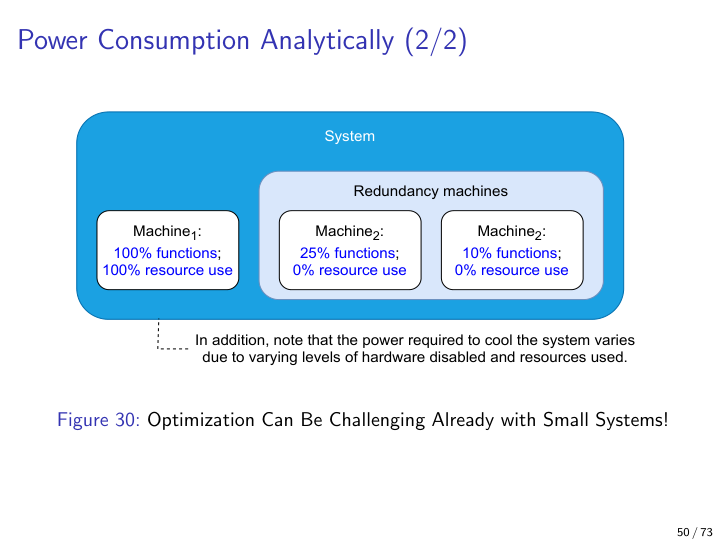

Each term behaves differently:

- **Computing power** is the only term software directly modulates — fewer instructions, fewer wake-ups, less work.
- **Idle power** has a **lower bound**: you cannot shut a device to zero while keeping it usable. Even C-states deeper than C0 still cost something.
- **Cooling power** varies *non-linearly* with utilisation. A second active machine doesn't double cooling cost; a third might triple it if the rack heats up.
- **Power loss** is conversion inefficiency in PSUs, voltage regulators, etc. — pure substrate, software cannot touch it.

**Why the picture has redundant machines.** Redundancy from Ch 7 (availability) is repurposed here: a hot-standby machine consumes mostly *idle* power, so the cooling-and-idle terms can dominate the active-computing term in low-utilisation deployments.

---

## 12.10 P-states vs C-states — the everyday lever

Three terms are easily confused. The lecturer separates them carefully:

- **Throttling (the Ch 9 sense):** an *emergency* action. The CPU bluntly cuts its clock when overheating. **Not the everyday lever** on modern x86.
- **P-states (Performance states):** scaled performance levels **P0 … Pm**, where **P0 = full performance** (e.g., 2.9 GHz) and **Pm = lowest** (e.g., 500 MHz). Supplied by the BIOS via ACPI. On modern hardware they apply **per CPU package** *or* **per CPU core**.

  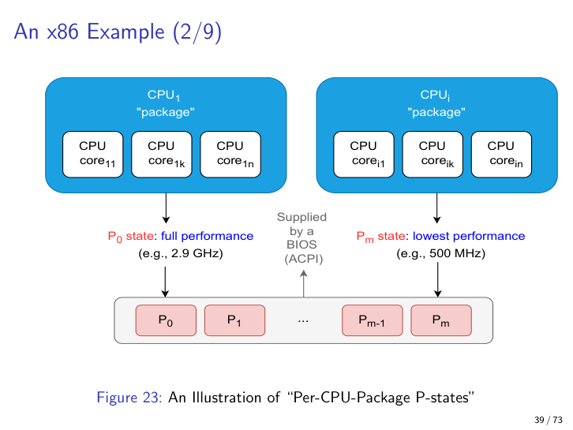

- **C-states (Idle / sleep states):** **C0 … Cm**, where **C0 = full performance** (nothing disabled) and **Cm = deepest sleep** (timers, caches, etc. disabled).

  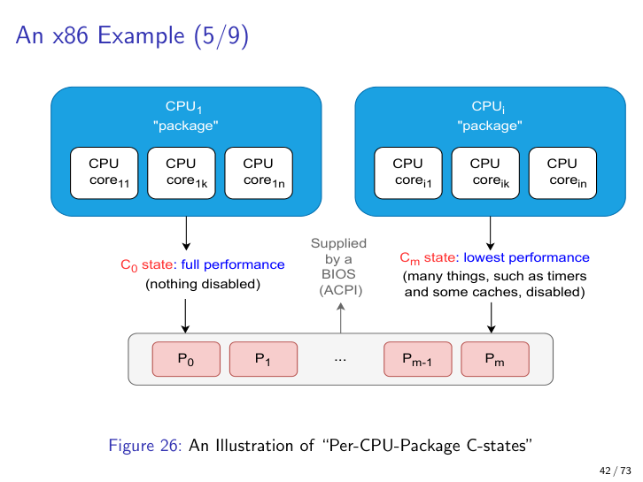

**Mnemonic.** **P-states scale *running* work; C-states deepen *resting* sleep.** Both are numbered with 0 = fastest, m = slowest/deepest. P0 ↔ C0 = full performance, no power saving.

**The two exam questions on this slide.**

1. *Which earlier tactic do P/C-states correspond to?* → **Resource scaling** / resource throttling from Ch 8 (Performance). P-states scale the clock; C-states scale availability of resources by parking them.

2. *Which tactic do they contradict?* → **Anything demanding constant low latency.** High responsiveness keeps cores out of deep C-states because the wake-up latency from C6 to C0 can be milliseconds — fine for a laptop typing, fatal for a hard-real-time control loop.

---

## 12.11 Hardware wake-ups and the rule of thumb

Things that prevent CPUs from entering deeper C-states:

- user input (legitimate — leave alone),
- "seldom-used hardware" (USB devices, dongles) being 100% powered when idle,
- kernel polling,
- needless network and disk activity,
- garbage collection,
- memory leaks (RAM is hardware — leaks are a *power* bug).

This yields the **general rule of thumb**:

> **Minimise software actions that interfere with optimisations already done for hardware.**

Concrete don'ts:

- Don't fire unnecessary interrupts (over-eager notifications, polling loops where events would do).
- Don't hit disk and network needlessly — e.g., mount `/tmp` and `/var/tmp` as `tmpfs` on Linux laptops to keep writes off SSD.
- Avoid GC runs where possible (Hort et al. 2022).
- Treat memory leaks as power bugs.

This is the *defensive* posture of power engineering: most of the saving is not from clever software, but from software *not getting in the way*.

---

## 12.12 Display dominance — the usability-vs-power trade-off

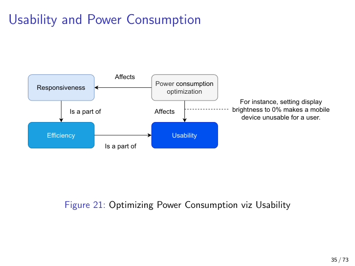

The PowerTOP screenshot in the slides shows it bluntly: on a laptop, the **display draws more power than the CPU**. Setting display brightness to 0% saves the most watts and ruins the most usability. The trade-off picture above formalises this: power-consumption optimisation directly affects the **efficiency** and **understandability** sub-QAs (you cannot read a dim screen).

**The quotable factoid.** *Display brightness is the single biggest power lever on a modern laptop — and the single most user-visible one.*

This is also the canonical example of why **trade-off analysis** (Ch 14) belongs in every architecture evaluation: usability optimisation and power optimisation point in opposite directions along the same axis.

---

## 12.13 Graceful shutdown ≠ graceful degradation ≠ forceful degradation

Three commonly confused terms; the lecturer separates them explicitly with `!=`.

- **Graceful shutdown.** The system warns the user, finishes / persists in-flight work, then powers off cleanly. The good ending of a battery drain.
- **Graceful degradation.** As resources (battery, CPU budget, memory headroom) shrink, the system **disables non-essential functionality in steps** — e.g., 100% → 60% → 25% of functions, then graceful shutdown.

  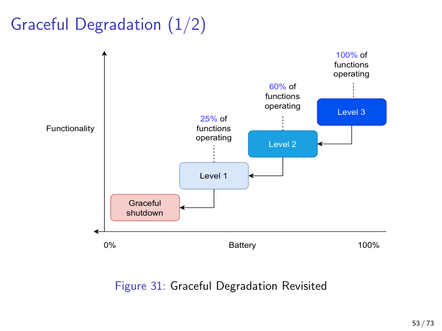

  **Cross-reference Ch 7 (Availability):** graceful degradation was introduced there as a *Repair* tactic — keep the core service running even when a subsystem fails. Ch 12 reuses the same primitive for *resource* degradation rather than *fault* degradation.

- **Forceful degradation.** The system is *made* worse against the user's intent. Often the dark-pattern side. Examples that answer the exam question *"give an example of forceful degradation from past lectures"*:

  1. **Dark patterns (§12.8):** a *roach motel* signup flow has forcefully degraded the cancellation user journey.
  2. **Ch 11 revoke-access tactic:** when revoking credentials, the user's session is forcefully degraded — by design. This is the *legitimate* form of forceful degradation, and it shows that the concept is morally neutral; the dark-pattern version is the abuse.
  3. **Confirm-shaming and forced continuity** likewise forcefully degrade the user's decision-making by inserting friction or fees the user did not consent to.

Two of three classifications are *good design*; the third (forceful) is good when warranted (security revoke) and bad when manipulative (dark patterns). The architect's job is to know which they are building.

---

## 12.14 Preloading — escalating restart in reverse

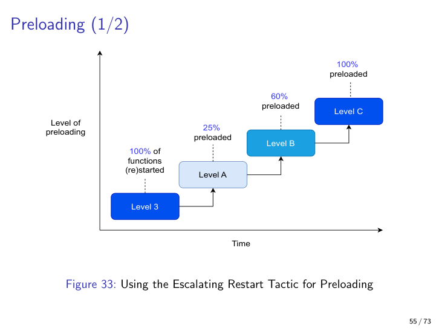

**Preloading.** Start things earlier than strictly needed so they are *warm* when wanted. The slide models this as **escalating restart** (Ch 7 Availability tactic) **in reverse**: instead of restart levels A/B/C climbing to full functionality after a fault, preload levels 25% / 60% / 100% climb to full functionality *before* the user asks for it.

**Why it saves power.** Startup is power-expensive (disk, RAM, JIT warmup, network handshakes). Amortising the cost via preload trades a small steady-state idle cost for a large avoided spike. Hort et al. (2022) confirm this saves power *and* helps responsiveness — a rare *positive* trade-off.

**How to decide what to preload.** Predictive analytics — e.g., the frequent-app history on phones, recent-document lists in IDEs.

**Pitfall.** Preloading the wrong things wastes both power and memory. The prediction quality is the bottleneck.

---

## 12.15 Offloading and prefetching

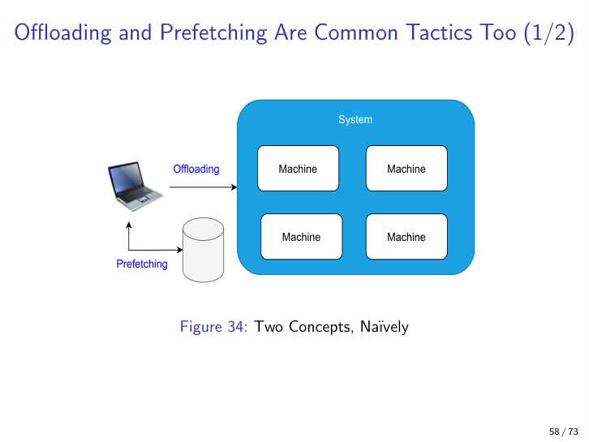

Two tactics with opposite arrows:

- **Offloading** — move *computation* away from the local (often power-constrained) machine to a more capable / power-rich one. The arrow goes *out*. Cross-reference Ch 9: this is the same primitive used for scaling, repurposed here for power.
- **Prefetching** — pull *data* toward the local machine before it is asked for. The arrow goes *in*. Cross-reference Ch 8: this is a performance tactic with a power side-effect (one big batched fetch is cheaper than many small ones).

The pair sits naturally next to preloading: all three are forms of "do the expensive thing at the cheapest time," differing only in *what* moves and *where*.

---

## 12.16 Language choice as a power lever

Research referenced in the slides (Pereira et al.'s "Energy efficiency across programming languages") shows **C consumes roughly an order of magnitude less power than Python** for equivalent computation; compiled, statically-typed languages dominate the energy ranking. This drags the "language wars" into the architecture evaluation.

The immediate exam-trap follow-up: *is the power saving worth the security and productivity trade-offs of writing C?* Memory-safety bugs in C are *security* problems (Ch 10–11) and *availability* problems (Ch 7); developer productivity in Python is a *deployability* concern (Ch 6). The honest architectural answer is **rarely "rewrite in C"** — it is "use C / Rust at the hot kernel and Python at the periphery," which is itself a Ch 3 integrability decision.

---

## 12.17 Eight-bullet takeaways

1. **Usability is non-technical.** Bass et al.'s definition is task-centric, but the ground truth lives inside users' heads; instrument with proxies (clicks, time, satisfaction) and accept that UX above the UI layer can only be measured indirectly.
2. **TAM has two branches and a missing third.** Perceived usefulness (target with cancel / undo / pause-resume / automation) and perceived ease of use (target with personalisation) feed attitude → intention → use. The lecturer's extension adds **intention to abandon** — retention as an architectural QA.
3. **Six usability sub-QAs.** Discoverability, learnability, efficiency, simplicity, understandability, flexibility — open-ended list, heavily correlated, and the same six reapply when an **architect** evaluates a **reference architecture** (Silva et al.'s y = A/B suitability metric).
4. **Usability is audience-relative.** End-user / sysadmin / developer / architect are distinct user classes; DevOps blurs them. A change that helps one can degrade another — Bass et al.'s explicit *"usability for whom?"* question.
5. **Memento, MVC, Observer all come back as usability patterns.** Memento ↔ Ch 4 rollback and Ch 6 claim-check (undo / partial-recompute). MVC's 1—* Controller→View enables re-skinning. Observer enables A/B testing. Dark patterns are the ethical opposite — six named varieties from roach motels to disguised ads.
6. **Power = computing + idle + cooling + loss.** Software touches only the first term directly; idle has a lower bound, cooling scales non-linearly, loss is pure substrate. On laptops the **display** dominates, which is why brightness is the canonical usability-vs-power trade-off.
7. **P-states scale running work; C-states deepen sleep.** Both numbered 0 (fastest) → m (deepest). P/C-states correspond to the **resource-scaling** tactic from Ch 8 and **contradict low-latency responsiveness** — wake-up latency from deep C-states can be milliseconds. Throttling is the *emergency* fallback, not the everyday lever.
8. **Three degradation modes, three power tactics.** **Graceful shutdown** (warn, persist, power off) ≠ **graceful degradation** (100% → 60% → 25% → shutdown; cross-ref Ch 7) ≠ **forceful degradation** (against user intent — dark patterns, or the legitimate Ch 11 revoke-access tactic). The power-saving tactics are **preloading** (escalating restart in reverse), **prefetching** (data pulled in), and **offloading** (work pushed out, cross-ref Ch 9). Rule of thumb above all: **minimise software interference with hardware optimisations.**
