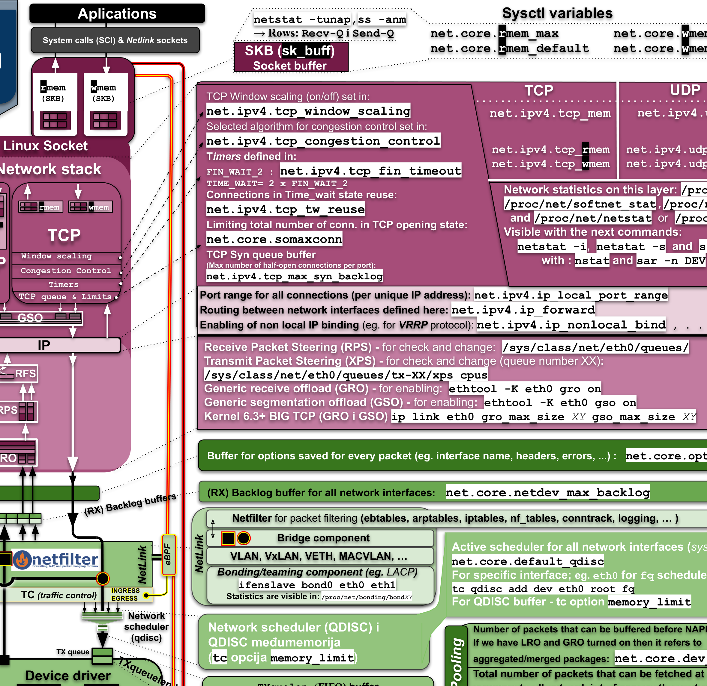
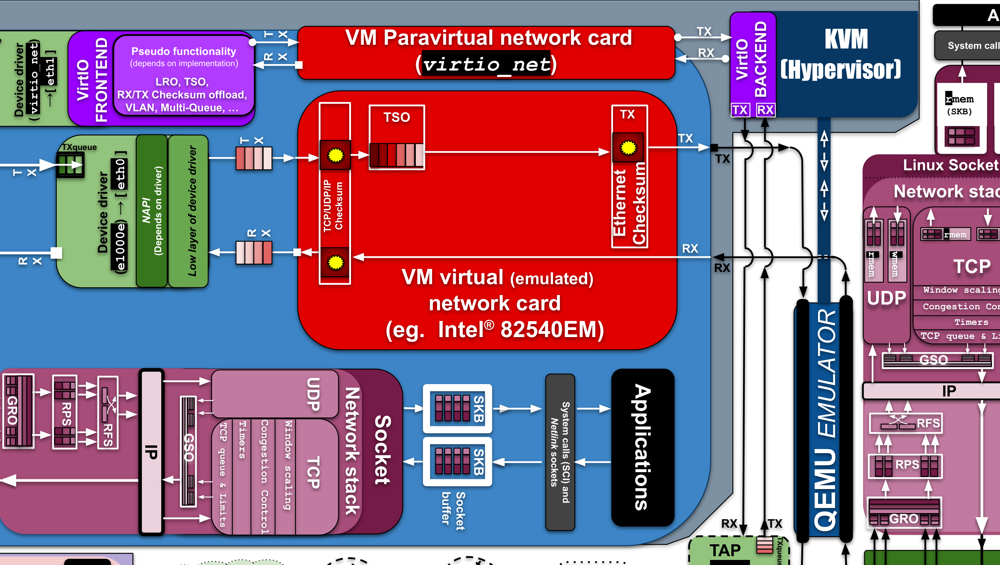
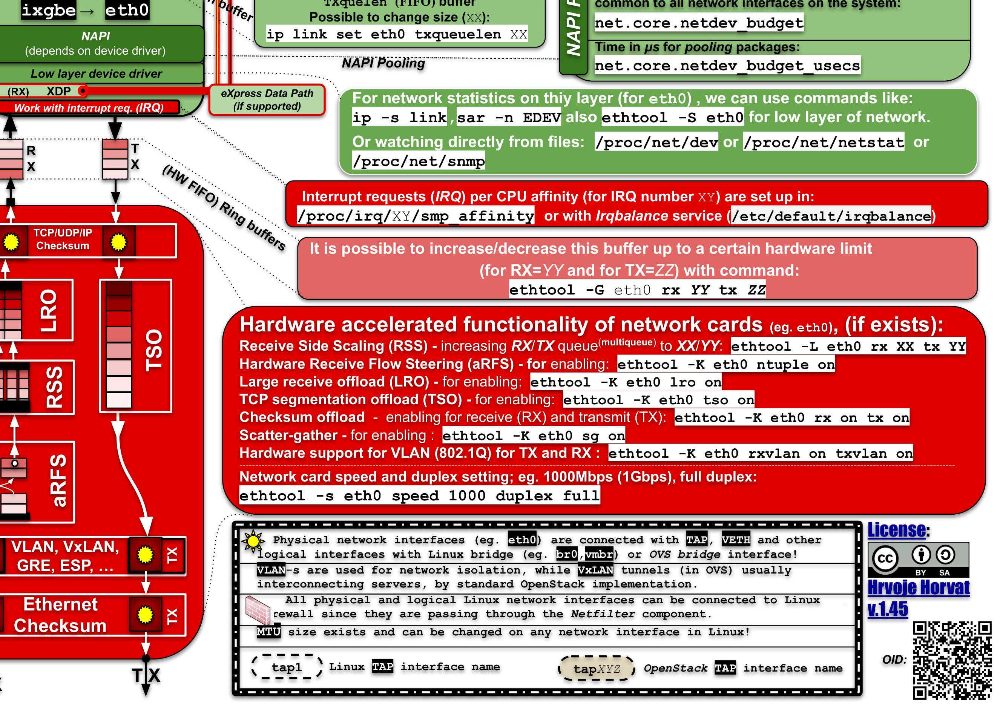

# Chapter 15 — Case Study 1: The Linux Network Stack (Horvat Poster)

> "Look at one real system and find every pattern, every tactic, every trade-off the course has been talking about." — that is the entire pedagogical purpose of this case.

If the lectures were the **vocabulary** of software architecture, **Hrvoje Horvat's Linux Network Stack poster (v1.45)** is the *full sentence* — a single A2-sized landscape diagram, roughly 945 vector primitives dense, where every architectural concept you have studied appears at least once, in production code, with a `sysctl` knob attached.

The lecturer introduced this poster in **Lecture 1** as "Case #1" and then quietly leaned on it again in Lectures 2–8 every time a concrete example was needed. The exam payoff is direct: if a cropped region of this diagram lands in front of you, you must be able to:

1. **Name the subsystem** (host stack? VirtIO? OVS? hardware offload? namespaces?).
2. **List the architectural patterns** visible in it (layered, pipe-and-filter, bridge/adapter, sandbox, shared-data).
3. **List the tactics** that pattern realises (batching, offload, isolation, interposition…).
4. **Name one trade-off** the design accepted (bufferbloat, isolation strength, offload-vs-debuggability…).
5. **Point at one tunable** (`sysctl`, `ethtool -K`, `tc qdisc`, `/proc/net/*`) that exposes the trade-off to an operator.

Read this chapter with the poster open on the side. The walkthrough below is structured exactly the way you should answer in the exam.

---

## 15.1 Scenario

There is no prose narrative. The case study **is** the diagram. It depicts the complete data path of a network packet through a Linux host that is simultaneously:

- a **bare-metal kernel** running user-space applications,
- a **KVM + QEMU hypervisor** running guest VMs,
- an **LXC container host**, and
- an **OpenStack compute / network node** with **Open vSwitch** wiring.

Four "worlds" are stacked together on the poster:

| Region | What it shows | Key actors |
|---|---|---|
| **Right half — Host stack** | App → socket → TCP/UDP → IP → Netfilter → qdisc → driver → ring buffer → NIC | `net.core.*`, `net.ipv4.*`, NAPI, GRO/GSO/RPS/RFS, XDP, eBPF |
| **Top-left — Virtualization** | Guest VM with either emulated NIC (Intel 82540EM) or `virtio_net` front-end → back-end | KVM, QEMU, vhost-net |
| **Left-middle — Containers** | LXC with six namespaces + cgroups, attached via VETH pair | `mount`, `pid`, `uts`, `user`, `net`, `cgroup` |
| **Bottom — SDN** | Linux bridge vs OVS (`br-int`, `br-tun`), VLAN, VxLAN, OpenStack's `qbr/qvb/qvo` naming, patch ports | `ovs-vsctl`, `iptables`, `ebtables` |

The implicit problem the case explores is the *canonical* problem of the course: **how does a large, performance-critical, multi-tenant operating-system subsystem stay modifiable, performant, available, secure and operable, all at once** — and what concrete tactics and patterns make that possible?

## 15.2 Stakeholders & context

| Stakeholder | What they care about | Visible on poster as |
|---|---|---|
| **Application developers** | Socket API correctness, bounded latency, honoured buffer sizes | `socket()`, `tcp_rmem`, `tcp_wmem` |
| **System admins / SREs** | Tuning knobs and observability | `sysctl net.core.*`, `ethtool -K/-G/-L`, `tc qdisc`, `/proc/net/*` |
| **Kernel network maintainers** | Modifiability — adding QUIC, MPTCP, BIG TCP, XDP without breaking 30-year-old userspace | Stable NAPI contract, pluggable qdisc API, sysctl namespace |
| **Cloud / virt operators** | Predictable multi-tenant performance | OVS `br-int`/`br-tun`, VLAN/VxLAN, VirtIO |
| **Security engineers** | Tenant isolation, firewall in the right places | Netfilter hooks, namespaces, ebtables/arptables |

**Hard constraints** baked into the design:

- **Line rate**: 1–100 Gbps small-packet workloads with bounded per-core CPU → forces batching (NAPI), hardware offload (TSO/LRO/RSS/aRFS), and per-CPU partitioning (RPS/XPS).
- **Backwards compatibility**: 30+ years of socket API and sysctl variable names must not break.
- **Multi-tenancy on a single NIC**: VMs and containers share `eth0` without seeing each other's frames → bridges, VLAN/VxLAN, namespaces, multi-point Netfilter hooks.

## 15.3 Quality attributes in play

The poster is essentially a checklist of QAs from Lectures 2–4 rendered as a real system. Pin the table below; the exam loves this mapping.

| QA | Concrete scenario on the poster | Tactics visible |
|---|---|---|
| **Performance** | "10 Gbps of small packets on `eth0`. Kernel must not drop them. Measure: `/proc/net/softnet_stat` has no drops." | NAPI polling (`netdev_budget`, `netdev_budget_usecs`, `dev_weight`), RSS multi-queue (`ethtool -L`), RPS/RFS/aRFS, GRO/LRO, TSO/GSO, BIG TCP (≥6.3), checksum offload, scatter-gather, XDP drop/redirect |
| **Modifiability** | "Swap CUBIC for BBR without rebooting." | `net.ipv4.tcp_congestion_control=bbr`, `net.core.default_qdisc=fq`, pluggable bridge backend (Linux bridge ⇄ OVS), eBPF/XDP for new behaviour without recompile |
| **Availability** | "Survive a NIC failure." | Bonding/teaming via `ifenslave`, LACP, VRRP via `net.ipv4.ip_nonlocal_bind=1`, conntrack survives rule reloads |
| **Security** | "All interfaces, physical or virtual, get firewalled identically." | Netfilter at PREROUTING / INPUT / FORWARD / OUTPUT / POSTROUTING, ebtables/arptables at L2, namespaces as tenant boundary, VLAN/VxLAN separation |
| **Operability / observability** | "Find the bottleneck without a debugger." | Every layer has a `/proc/net/*` file, plus `ss`, `netstat`, `sar`, `ethtool -S`, `ip -s link` |
| **Interoperability** | "Run a 20-year-old guest OS." | VirtIO paravirt coexists with full Intel 82540EM emulation; Linux bridge and OVS are interchangeable plug-ins |

---

## 15.4 Architectural decisions / patterns used

The case has **eight named decisions**. Each one below follows the *same shape*: **what + rationale + trade-off + concrete tunable + lecture cross-ref**. This is the exact shape an examiner expects in an oral.

### Decision 1 — Strict layering as the spine of the host stack

- **What:** Applications → system call interface → socket layer → TCP/UDP/IP → Netfilter → qdisc → device driver → ring buffers → NIC hardware. Each layer talks only to the one above and below. The kernel's contract with userspace is **the socket** and `setsockopt` knobs; below the IP layer everything is in-kernel state.
- **Rationale:** Textbook **Layered architectural pattern** (Lecture 5/6). Every layer is independently testable, observable, and **replaceable** — a TCP congestion-control algorithm is one `sysctl` away, a qdisc is one `tc` command away, a driver is a kernel module.
- **Trade-off:** Performance cost of crossing layers. **Paid back** via batching (NAPI, GRO/GSO) and offloading tactics that let layers "skip ahead" when hardware can do the work. The classic modifiability-vs-performance trade-off from Lecture 2 — and the cleanest visible instance of it in the whole course.
- **Tunables fingerprint:** `net.ipv4.tcp_congestion_control`, `net.ipv4.tcp_rmem`, `net.ipv4.tcp_wmem`, `net.core.rmem_max`, `net.core.wmem_max`, `net.core.default_qdisc`.
- **Cross-ref:** Lecture 1 (intro to layering), Lecture 5/6 (layered pattern formally).

### Decision 2 — Pipe-and-filter with hooks (Netfilter)

- **What:** Insert a **Netfilter** interposer at *every* point where packets cross interfaces (bridge, IP, ingress, egress). Five hook points: **PREROUTING, INPUT, FORWARD, OUTPUT, POSTROUTING**. The same hook chain serves `iptables`, `nftables`, `ebtables` (L2), `arptables`, and stateful `conntrack`.
- **Rationale:** A **pipe-and-filter** style (Lecture 4) realised as a **broker / interceptor** for security. Cross-cutting concern → single mechanism → one place to reason about firewalling, regardless of whether the interface is physical, VETH, VLAN, VxLAN, or TAP. This is exactly the lecture's **"Limit access" + "Detect intrusion"** security tactic family.
- **Trade-off:** Per-packet latency. Mitigations on the poster: nftables compiles rules to bytecode, conntrack uses hashtables, and **XDP** can short-circuit Netfilter for the very-hot path (drop/redirect *before* the SKB is even allocated).
- **Tunables fingerprint:** `nft list ruleset`, `iptables -L -v -n`, `/proc/net/nf_conntrack`, `net.netfilter.nf_conntrack_max`, `net.netfilter.nf_conntrack_tcp_timeout_established`.
- **Cross-ref:** Lecture 4 (pipe-and-filter, pluggability), Lecture 4 tactics catalogue (security: limit access).

### Decision 3 — Virtualization via VirtIO paravirtual driver

- **What:** Guest VMs get a paravirtual NIC (`virtio_net`) instead of a fully emulated Intel 82540EM. The guest driver (front-end) talks to the host back-end (`vhost-net`) through **shared ring buffers** ("virtqueues"), mediated by **KVM** (vCPU scheduling) and **QEMU** (device model). The fully emulated NIC is still wired in as a fallback for guests that lack VirtIO drivers.
- **Rationale:** A **Bridge / Adapter pattern** (Lecture 5/6) at the hypervisor boundary: the *same* Linux socket stack runs on either side, only the "wire" changes. As a performance tactic it's *batching across the trap boundary* — full emulation forces QEMU to trap every register write; paravirt batches operations through the virtqueue, eliminating dozens of VM-exits per packet.
- **Trade-off:** Guest must know it is virtualized (loses *full* transparency). Mitigation: both modes coexist on the diagram — choose per-VM based on guest OS support and the threat model.
- **Tunables fingerprint:** QEMU `-netdev tap,vhost=on`, `ethtool -k vnetX` inside the guest (TSO/GSO over virtqueue), multiqueue virtio (`-netdev tap,queues=N`), `vhost_net` kernel module loaded.
- **Cross-ref:** Lecture 8 (virtualization), Lecture 4 (bridge/adapter as modifiability tactic).

### Decision 4 — Namespaces as the isolation tactic for containers

- **What:** An LXC container is given **six namespaces** — `mount`, `pid`, `uts`, `user`, `net`, `cgroup` — plus **cgroups** for resource limits (RAM, CPU, disk I/O, network bandwidth). It connects outward only through a **VETH pair**: one end inside the container's net namespace, the other plugged into the host's Linux bridge or OVS.
- **Rationale:** Cheapest possible "VM-like" isolation — no hypervisor, just relabelled kernel objects. Realises the **Sandbox** tactic (Lecture 10) and the **Resource manager** tactic from Lecture 4. The poster is the canonical illustration of "containers = namespaces + cgroups + a VETH pair", a one-line definition you should be ready to recite.
- **Trade-off:** **Weaker isolation than a real VM** — shared kernel means a kernel exploit crosses the boundary. Mitigations on the poster: `user` namespace maps root-in-container to non-root-on-host; `seccomp` filters lock down dangerous syscalls; AppArmor / SELinux MAC labels overlay namespaces.
- **Tunables fingerprint:** `ip netns list`, `lsns`, `/proc/<pid>/ns/*`, `cgroup.cpu.max`, `cgroup.memory.max`, `unshare(1)`.
- **Cross-ref:** Lecture 8 (containers), Lecture 10 (sandbox), Lecture 4 tactics (security: separate entities; resource: bound resource use).

### Decision 5 — Software-defined bridging: Linux bridge vs Open vSwitch

- **What:** Two interchangeable bridge implementations sit side-by-side on the diagram. **Linux bridge** is a simple software L2 switch (the same MAC-learning logic as a $20 dumb switch). **Open vSwitch** adds OpenFlow rules, per-port VLAN tagging, **VxLAN tunneling** (24-bit VNI, UDP/4789), and the OpenStack-canonical `br-int` ↔ `br-tun` topology with **patch ports** linking the two OVS bridges. The familiar OpenStack `qbr<id>` Linux bridge sits in front of OVS *only* to host iptables rules (OVS pre-OpenFlow-extensions couldn't do stateful firewalling).
- **Rationale:** **Pluggability** as the modifiability tactic — operators start with Linux bridge, migrate to OVS without changing how VMs attach (still a TAP into a bridge). VxLAN solves the **L2-over-L3** problem for multi-host clouds: tenant L2 broadcast domains traverse a routed underlay between compute nodes. This is the deployment topology Lecture 9 describes for OpenStack / Kubernetes overlays.
- **Trade-off:** OVS adds operational complexity (flow tables, user-space `ovs-vswitchd`, kernel datapath module) for the gain of *programmable* forwarding.
- **Tunables fingerprint:** `brctl show`, `ovs-vsctl show`, `ovs-ofctl dump-flows br-int`, `ip -d link show vxlan0`.
- **Cross-ref:** Lecture 7 (deployment), Lecture 9 (Kubernetes / SDN / OpenStack).

### Decision 6 — Hardware acceleration at the boundary

- **What:** Push as much work into the NIC silicon as the hardware supports — **RSS** (Receive-Side Scaling, multi-queue hash spread), **aRFS** (accelerated Receive Flow Steering, NIC follows the app's CPU), **LRO** (Large Receive Offload, NIC coalesces incoming segments), **TSO** (TCP Segmentation Offload, NIC slices outgoing data), **GSO** (Generic Segmentation Offload, deferred segmentation in the kernel), checksum offload (RX/TX), scatter-gather DMA, VLAN tag insertion/strip, multi-queue (`ethtool -L`), and **XDP** hooked at the driver entry point.
- **Rationale:** The **"specialize a critical resource"** performance tactic (Lecture 4). Each `ethtool -K` toggle is an explicit knob that exposes a single trade-off. **IRQ affinity** (pinning a queue's interrupt to a specific CPU via `/proc/irq/<N>/smp_affinity`) is the matching scheduling tactic — pair RSS+aRFS+IRQ-affinity to keep cache-hot.
- **Trade-off:** Offloads can **mask bugs** (a NIC computing checksums wrong is hard to detect, and a packet trace via `tcpdump` may show wrong checksums because the host never computed them), and offloaded frames may look strange to other VMs' stacks. The poster's discipline is to *expose every toggle* so operators can disable offloads when debugging (`ethtool -K eth0 tso off gso off gro off lro off`).
- **Tunables fingerprint:** `ethtool -K`, `ethtool -G` (ring sizes), `ethtool -L` (queue count), `ethtool -X` (RSS hash), `/proc/interrupts`, `/proc/irq/<N>/smp_affinity`, `xdp-loader status`.
- **Cross-ref:** Lecture 4 (performance tactics: reduce overhead, schedule resources), Lecture 8 (performance under virtualization).

### Decision 7 — Buffering at every queueing point

- **What:** **Explicit buffers everywhere.** The poster names them all: socket buffers (`SKB`, `tcp_rmem`, `tcp_wmem`, `udp_rmem_min`, `udp_wmem_min`), per-CPU backlog buffer (`net.core.netdev_max_backlog`), TX qdisc queue + memory limit, `txqueuelen` (the FIFO between qdisc and driver), driver ring buffers (the NIC's HW FIFO via `ethtool -G`), and the small auxiliary `optmem_max` for ancillary data.
- **Rationale:** Each buffer is an explicit **performance / availability** tactic — it **absorbs bursts** and **decouples producer from consumer**. The fact that the poster *names every buffer alongside its tuning knob* is itself an architectural choice: **make the design operable and observable**. Operability is treated as a first-class QA — Lecture 2/3 in action.
- **Trade-off:** **Bufferbloat** — too-deep buffers add latency under sustained load (a packet sitting in a deep FIFO is a packet not retransmitted). Mitigation: modern AQM qdiscs (`fq_codel`, `fq`, `cake`) actively manage queue depth. The lever is `net.core.default_qdisc`.
- **Tunables fingerprint:** `net.ipv4.tcp_rmem`, `net.ipv4.tcp_wmem`, `net.core.rmem_default`, `net.core.wmem_default`, `net.core.netdev_max_backlog`, `txqueuelen` (via `ip link`), `ethtool -G eth0 rx 4096 tx 4096`, `tc qdisc replace dev eth0 root fq_codel`.
- **Cross-ref:** Lecture 2 (QA trade-offs), Lecture 4 (performance: bound queue size).

### Decision 8 — NAPI: hybrid interrupt + polling

- **What:** The driver raises **one** hardware interrupt when a packet arrives, then switches into **NAPI mode** and **polls** the ring buffer until it is empty (or until a budget is exhausted). Budget is bounded by `net.core.netdev_budget` (max packets per poll), `net.core.netdev_budget_usecs` (time slice), and `net.core.dev_weight` (per-NAPI-instance weight).
- **Rationale:** The **performance tactic** for amortising IRQ cost under load. Under heavy load: one interrupt amortised over hundreds of packets. Under light load: interrupts deliver low latency. NAPI dynamically switches regimes — latency-optimal *and* throughput-optimal in one design.
- **Trade-off:** Tail latency under low load is marginally higher than pure interrupts (the driver waits the budget out before re-arming the IRQ). Negligible at line rate; mostly a benchmark curiosity.
- **Tunables fingerprint:** `net.core.netdev_budget`, `net.core.netdev_budget_usecs`, `net.core.dev_weight`, `/proc/net/softnet_stat` (column 3 = squeezes = NAPI exhaustions — a non-zero count means the budget was hit and packets were left on the ring).
- **Cross-ref:** Lecture 4 (performance: introduce concurrency, schedule resources), Lecture 8 (performance tactics under virtualization, same idea reused as virtqueue polling in `vhost-net`).

---

## 15.5 Lessons learned / key takeaways

Eight bullets you should be able to deliver verbatim, because they are the bridge between Lectures 1–9 and the rest of the syllabus:

- **A real OS subsystem is a layered architecture in textbook form.** The Horvat poster is Bass–Clements–Kazman's "Layered" chapter with a real implementation underneath. Use it as your mental anchor whenever the exam asks you to *recognise* a layered pattern.
- **Every quality attribute leaves a fingerprint as a tunable.** Every `sysctl`, every `ethtool -K` flag, every `/proc/net/*` file is the **operability** tactic "expose configuration / measurement at architectural boundaries" made real. If a design has no knob, it has no QA story.
- **Performance is bought with batching, offloading, and per-CPU partitioning — not magic.** NAPI, GRO/GSO/TSO, RSS/RPS/RFS/aRFS, XDP — be able to name two or three at speed.
- **Isolation has a price ladder:** namespaces (cheapest) → VirtIO paravirt VM → fully emulated VM (most expensive, most compatible). Pick the cheapest level that satisfies the threat model.
- **Pluggability is everywhere:** congestion-control, qdisc, bridge backend, NIC driver, hypervisor backend — each is an interface with multiple implementations. That is the **modifiability** tactic "abstract common services / hide information," instantiated five times in one diagram.
- **The same Netfilter cross-cuts every interface type.** Cross-cutting concerns belong in *interceptors*, not duplicated per component — a recurring exam answer.
- **Buffers everywhere come with the bufferbloat trade-off** — a textbook illustration of "performance and latency pull in opposite directions" from Lecture 2.
- **Observability was designed in, not bolted on.** Counters at every layer (`/proc/net/dev`, `softnet_stat`, `ss`, `netstat`, `sar`, `ethtool -S`). **The poster *is* the documentation**, which is itself an operability tactic.

---

## 15.6 Exam relevance

This case was explicitly framed by the lecturer as: **"Look at this diagram (or this cropped region) and identify three architectural patterns, three tactics, and one trade-off."** That is the exam question pattern you should rehearse. Concretely, expect:

### Q-pattern A — "Identify patterns / tactics / trade-offs in this crop"
A region of the poster appears; you must name what is in it. A cheat-sheet:

| If you see… | Pattern | Tactics | Trade-off |
|---|---|---|---|
| Socket → TCP → IP → qdisc | Layered | Pluggable congestion-control, qdisc | Cross-layer overhead vs modifiability |
| Netfilter chains | Pipe-and-filter / Interceptor | Limit access, detect intrusion | Per-packet latency vs uniform policy |
| VirtIO front/back | Bridge / Adapter | Batching across trap boundary | Transparency vs performance |
| LXC + namespaces + VETH | Sandbox | Separate entities, bound resources | Isolation strength vs cost |
| OVS `br-int`/`br-tun` | Pluggable / Mediator | VLAN/VxLAN separation, programmable forwarding | Complexity vs power |
| NIC RSS/TSO/LRO + IRQ pin | Master/Worker (multi-queue), specialize-resource | Reduce overhead, schedule resources | Offload speed vs debuggability |
| qdisc + ring buffers + backlog | Shared-data / buffering | Bound queue size, absorb bursts | Throughput vs bufferbloat |
| NAPI poll loop | Hybrid IRQ/poll, batching | Introduce concurrency | Tail latency vs CPU efficiency |

### Q-pattern B — Map QAs to mechanisms
Given a QA, name two mechanisms on the poster. Examples:

- "Performance" → NAPI + RSS + offloads.
- "Modifiability" → pluggable congestion-control + pluggable qdisc + bridge backend choice.
- "Security" → Netfilter at five hook points + namespaces + VLAN/VxLAN separation.
- "Availability" → bonding/LACP + VRRP via `ip_nonlocal_bind` + conntrack persistence.

### Q-pattern C — The packet-trace exercise (high-probability, 4–5 points)

> **Prompt:** *"A VM on OpenStack compute-node-A sends a TCP segment to a VM on compute-node-B. Trace the segment from the sending application all the way out onto the wire. Name the architectural element at every step."*

Trace, in order:

1. **Guest application** calls `send()` → traps into the **guest kernel's socket layer**.
2. **Guest TCP** segments the data (or hands one big segment to **TSO** over VirtIO if multi-queue + GSO is on). `tcp_wmem` is the send-side budget.
3. **Guest IP** picks the route, adds the IP header.
4. **Guest qdisc** (default `pfifo_fast` in older kernels, `fq_codel` in modern ones) schedules the frame.
5. **Guest `virtio_net` front-end driver** writes a descriptor into the **TX virtqueue** in shared memory.
6. **Host `vhost-net` back-end** (kernel thread) picks up the descriptor — *no QEMU trap on the hot path*; this is the VirtIO performance win.
7. The frame enters the host through a **TAP device** named e.g. `tap<id>`.
8. The TAP is plugged into the OpenStack-canonical **`qbr<id>` Linux bridge** — that bridge exists solely to host **iptables**-based security-group rules (Netfilter at L2 via ebtables / at L3 via iptables).
9. From `qbr<id>`, a **VETH pair `qvb<id>` ↔ `qvo<id>`** carries the frame into OVS's integration bridge **`br-int`**, where a per-tenant **VLAN tag** is pushed.
10. A **patch port** moves it from `br-int` to the tunnel bridge **`br-tun`**, which **encapsulates** the frame in **VxLAN** (UDP/4789, 24-bit VNI ≈ tenant ID).
11. The VxLAN packet drops into the host IP stack as outbound traffic on the underlay → **host Netfilter POSTROUTING** chains.
12. **Host qdisc** on `eth0` (typically `fq` or `mq` with per-queue `fq_codel` children) schedules transmission.
13. The **NIC driver** pushes the descriptor onto the **TX ring buffer**.
14. Depending on offloads: **TSO** segments the large packet on-card; **checksum offload** computes L4 checksum; **scatter-gather DMA** assembles from non-contiguous memory.
15. The NIC clocks the bits onto the wire. On the other side, the symmetric receive path runs in reverse, with **NAPI**, **GRO**, **RSS**, **aRFS** and friends on the receive side.

Each numbered step has a poster region you should be able to point at, and at least one tunable you can name.

### Q-pattern D — Recognise the cropped subsystem
Given an unlabelled crop, identify which of the four "worlds" it belongs to (host stack? VM/VirtIO? OVS/bridge? NIC offload?) and which Lecture concepts it illustrates. The four thematic crops embedded in this chapter are *exactly* the crops you should expect.

---

## 15.7 Cross-references to lectures

| Lecture | Concept | Where it lives on the poster |
|---|---|---|
| **L1 — Course intro** | "Case #1 — Hrvoje Horvat (2024)" | This diagram, named in slide 1 |
| **L2 — Quality attributes / scenarios** | Concrete stimulus / response / measure scenarios for performance, security, modifiability | Every QA in §15.3 is an L2 scenario instantiated |
| **L3 — Architecture in context / design process** | Operators as first-class stakeholders; observability and configuration as architectural requirements | Every `/proc/net/*`, every sysctl |
| **L4 — Tactics catalogue** | Performance: introduce concurrency (multi-queue, RPS), bound queue size (`txqueuelen`, qdisc), reduce overhead (offloads), schedule resources (qdisc + IRQ affinity). Modifiability: abstract common services (NAPI contract, qdisc API), hide information (driver behind kernel API), use intermediaries (Netfilter, bridges). Availability: redundancy (bonding/LACP), failover (VRRP). Security: limit access (Netfilter), separate entities (namespaces, VLAN/VxLAN), validate inputs (conntrack). | Every decision in §15.4 cites at least one L4 tactic |
| **L5 / L6 — Patterns and styles** | Layered, Pipe-and-filter, Broker/Bridge/Adapter, Sandbox, Shared-data side-by-side | Decisions 1, 2, 3, 4, 7 respectively |
| **L7 — Distribution / deployment** | OVS with VxLAN tunnels between compute and network nodes — the OpenStack reference topology | Decision 5 |
| **L8 — Virtualization / containers** | KVM + QEMU + VirtIO, and the LXC namespace bundle as the canonical container | Decisions 3 and 4 |
| **L9 — Kubernetes / SDN** | The same OVS / VxLAN topology underlies Kubernetes overlay networking (Calico, Flannel-VxLAN, OVN-Kubernetes) | Decision 5 generalised |
| **L10 — Sandbox** | Containers as `namespaces + cgroups + VETH` | Decision 4 |

**Bottom line for the exam.** If you can (a) name the four "worlds" of the poster, (b) walk a packet from a guest app to the wire and back, (c) attach one pattern + one tactic + one tunable + one trade-off to *each* of the eight decisions, and (d) map every QA in §15.3 to two mechanisms on the diagram, you have already answered every plausible variant of "Case Study 1" the lecturer can throw at you.
