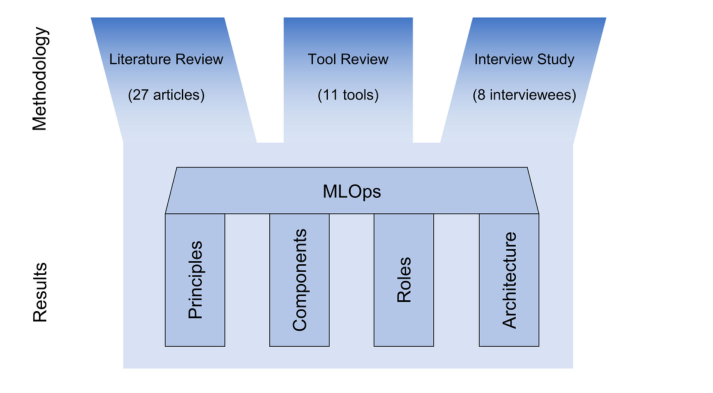
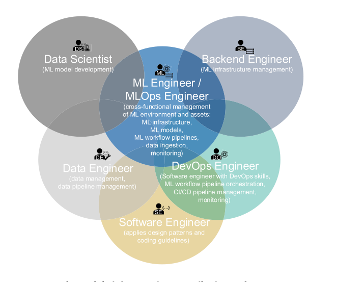
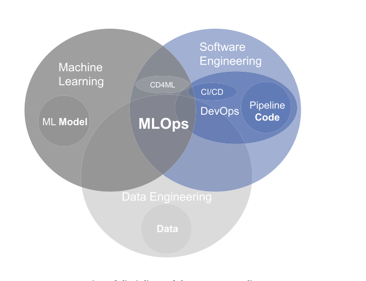
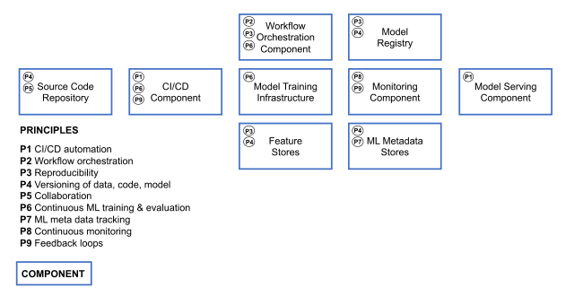
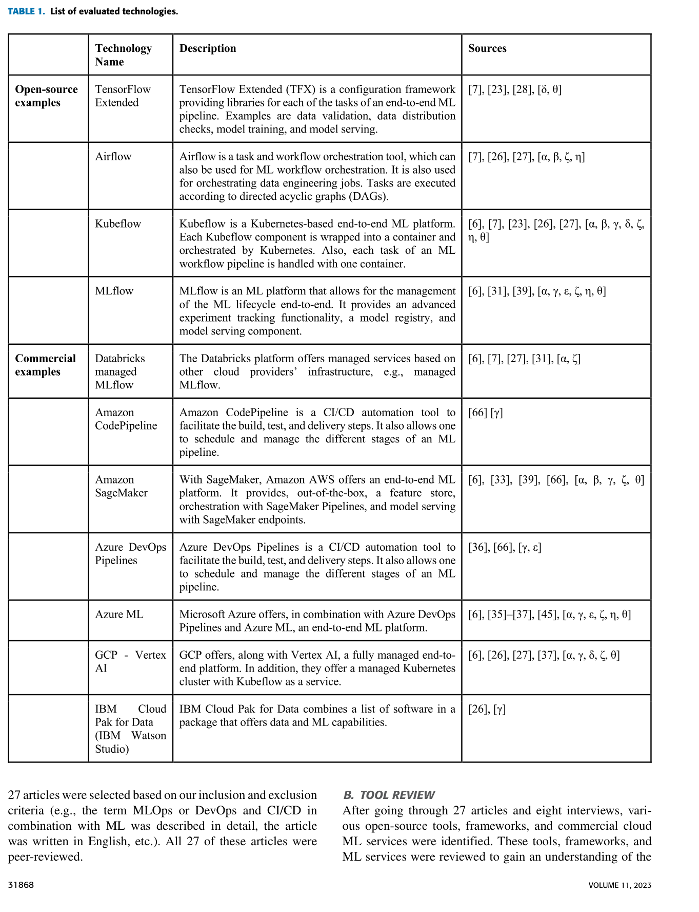

# Chapter 16 — Case Study 2: MLOps Reference Architecture (Kreuzberger, Kühl & Hirschl, 2023)

> **Primary source:** Kreuzberger, Kühl & Hirschl, *"Machine Learning Operations (MLOps): Overview, Definition, and Architecture"*, **IEEE Access**, vol. 11, 2023. DOI 10.1109/ACCESS.2023.3262138.
>
> **Why this case for an architecture exam:** it is *the* "design a reference architecture" exercise in our reading list. The other cases (Netflix Hystrix, Uber Schemaless) document how one company built *one* system. This paper documents how an entire industry should build *a class of* systems. If a future exam asks you to "sketch an end-to-end architecture for X" — this is the case whose figure you re-draw.

---

## 16.1 Why MLOps is the reference-architecture exercise

In Chapter 2 we defined a **reference architecture** as a generic, technology-agnostic blueprint that names components, interfaces and quality concerns for a *class* of systems, so that any concrete project can be instantiated from it. Kreuzberger et al. take this definition literally. They observe that machine-learning projects keep failing in the same way — *"the model worked in the notebook but never reached production"* — and that the failure is not in the modelling but in the surrounding **system**: pipelines, infrastructure, monitoring, retraining, governance, roles. So they synthesise the literature, the tool market and senior practitioner experience into a technology-agnostic blueprint that covers the whole life-cycle of a production ML system.

The deliverable is exactly what L2 calls a reference architecture:

- **9 principles** (P1–P9) — the *whys*.
- **9 technical components** (C1–C9) — the *whats*.
- **7 roles** (R1–R7) — the *whos*.
- **1 end-to-end workflow diagram** — the *how-it-all-flows*.

That makes the paper a self-contained worked example of the artefact we have been talking about since Lecture 1.

---

## 16.2 Scenario and research methodology

### The recurring failure mode

Industry surveys cited in the paper put a large fraction of ML proofs of concept at *never reaching production*. The bottleneck is not the model: a notebook proves the idea works. The bottleneck is everything around it — getting clean features at serving time, retraining when the data shifts, redeploying without downtime, versioning the artefacts for audit, monitoring quality, and coordinating data scientists, data engineers, software engineers and DevOps. MLOps is the discipline that fills the "Dev–Ops gap" *for ML*.

### Mixed-method synthesis (the funnel)

The authors did not invent the architecture from thin air. They funnelled three sources of evidence:

1. **Systematic literature review (SLR)** — 1 864 articles retrieved, 27 included after inclusion/exclusion criteria.
2. **Tool review** — 11 open-source and commercial ML platforms (TFX, Airflow, Kubeflow, MLflow, Databricks, SageMaker, Azure ML Pipelines, Azure ML, GCP Vertex AI, IBM Cloud Pak for Data, …).
3. **Eight semi-structured expert interviews** with senior ML practitioners.

From those three converging streams they extracted the principles, derived the components and articulated the roles. The methodology figure summarises the funnel:

**Why the methodology matters for the exam.** When an exam asks "how would you produce a reference architecture for *X*?" — this funnel is the answer. Literature gives you the principles, the tool market gives you the components, the interviews give you the roles and the cross-cutting glue. Anything missed by one stream tends to be caught by another. It is also a textbook example of L1's stakeholder-first thinking: the interviews are explicitly used to surface the *human* failure modes that no SLR would expose.

---

## 16.3 Stakeholders and context — seven roles, one linchpin

The paper is unusually explicit about *who* makes MLOps work, and that role list doubles as the stakeholder list of the system being designed:

| Role | Owns |
|---|---|
| **R1 Business stakeholder** (product owner / project manager) | ROI; problem framing; success criteria. |
| **R2 Solution / IT architect** | Technology choice; the architecture document itself. |
| **R3 Data scientist** | Translating the business problem into an ML problem; model engineering. |
| **R4 Data engineer (DataOps)** | Feature pipelines; feature store ingestion; data quality. |
| **R5 Software engineer** | Design patterns, coding standards, productionising serving code. |
| **R6 DevOps engineer** | CI/CD and orchestration; runtime infrastructure. |
| **R7 ML / MLOps engineer** | **The cross-cutting glue.** Sits at the intersection of ML, software engineering, data engineering and DevOps; runs the platform end-to-end. |

The Venn diagram makes the overlap explicit — and shows the **MLOps engineer (R7) as the linchpin** standing in the middle:

### Contextual constraints reported repeatedly

- **Fluctuating, spiky compute demand** — training is bursty and GPU-heavy; infrastructure must be elastic.
- **Constant new data** — retraining is a recurring task, so it must be automated, not artisanal.
- **Multi-team, multi-skill** — seven roles, real silo risk; team topology directly shapes the architecture (Conway's law alive and well).
- **Heterogeneous stacks** — open-source + cloud-managed services that must integrate via APIs.
- **Governance and traceability** — regulated industries demand versioning of data, code *and* model.
- **Skills shortage** — interviewees agreed: architects, data engineers, ML engineers and DevOps engineers are in short supply. This is an *organisational* constraint that constrains the *technical* design.

The "skills shortage" point is one of the paper's most cited observations and is worth memorising: **the hardest part of MLOps is not the tools — it is finding the people who can wire them together.**

---

## 16.4 Quality attributes in play

This is a quality-attribute parade. Almost every QA we have met in L2–L8 maps onto one or more of the 9 MLOps principles or components:

| Quality attribute (lecture) | How MLOps puts it into play | Mechanism |
|---|---|---|
| **Deployability** (L4) | CI/CD pipeline (C1); image-registry-based artefact promotion; champion-vs-challenger A/B for new models. | C1 + C6 + C8 |
| **Testability** (L4) | CI runs unit + integration + *data* + *model-quality* tests; reproducible training data via the offline feature DB; experimentation zone isolated from production. | C1 + C4 |
| **Modifiability** (L3) | Workflow expressed as DAGs (Airflow / Kubeflow) so steps can be swapped; technology-agnostic component boundaries. | C2 + C3 |
| **Integrability** (L3) | C1–C9 are defined by named interfaces (REST for serving; image registry; feature-store APIs); mix-and-match best-of-breed. | All Cs |
| **Reproducibility** (foundational here — P3) | Versioning of data, model and code; metadata store records lineage of every run. | C6 + C7 |
| **Observability / Monitoring** (L6) | Continuous monitoring (C9) of prediction accuracy *and* infra; Prometheus + Grafana / ELK / TensorBoard. | C9 |
| **Scalability / Performance** (L7) | Distributed training (Kubernetes / OpenShift), GPU compute, distributed feature processing (Spark, Kafka). | C2 + C5 |
| **Availability / Resilience** (L6) | Orchestrator retries failed tasks; offline/online DB split; serverless inference for elastic load; drift-triggered retrain = control loop. | C2 + C8 + C9 |
| **Auditability / Governance** | Metadata store records training date, parameters, lineage; registry tracks staging vs production. | C6 + C7 |

### The anchoring scenario

The paper keeps returning to one scenario, which stitches almost every QA together:

> *A model is in production. Its accuracy drifts because the input distribution has changed. The monitoring component detects this. The system automatically retrains on fresh data, runs A/B tests against the current champion, promotes the winner through the registry and redeploys — without human intervention.*

That single scenario weaves together **observability + reproducibility + deployability + modifiability + scalability + resilience + governance**. It is also the paper's intellectual climax (see §16.7).

---

## 16.5 Architectural decisions — eight choices that define MLOps

The reference architecture is the result of eight high-leverage decisions. Each comes with a rationale, a trade-off and a clear lecture cross-reference.

### Decision 1 — Pipelines are the unit of work (DAG-based orchestration)

- **Decision.** Replace ad-hoc scripts and notebooks with workflow-orchestrated DAGs (Apache Airflow, Kubeflow Pipelines, SageMaker Pipelines, Azure ML Pipelines) for both the feature-engineering pipeline (B) and the automated training pipeline (D).
- **Rationale.** ML tasks have dependency-rich, multi-step execution graphs that pure CI/CD tools cannot express cleanly. Orchestrators give per-step retries, isolation, scheduling and metadata capture.
- **Trade-off.** Heavyweight infrastructure to operate; higher author skill bar.
- **Cross-ref.** L3 modifiability vs. complexity — explicit dependency graphs are easier to evolve but heavier to set up; the same DAG-as-modifiability argument we made for build systems in Chapter 4.

### Decision 2 — A feature store with offline + online databases

- **Decision.** C4 holds *two* databases — an **offline** DB tuned for large reads during training, an **online** DB tuned for low-latency reads at serving time — with one shared canonical feature definition.
- **Rationale.** Training and serving have very different latency profiles, but they must compute features identically; one definition feeding both prevents **training/serving skew**, a notorious ML bug class.
- **Trade-off.** Two stores to keep consistent (dual-write, CDC, or batch sync); pipeline complexity grows.
- **Cross-ref.** L3 integrability (one canonical definition → fewer integration faults) bought at the cost of L7 scalability and consistency complexity.

### Decision 3 — The model is a first-class versioned artefact (registry + metadata store)

- **Decision.** C6 (model registry) stores trained models; C7 (metadata store) records lineage — training date, hyperparameters, code version, feature data version, evaluation metrics, status (staging / production).
- **Rationale.** Reproducibility (P3), versioning (P4) and metadata tracking (P7) are non-negotiable for audit and rollback.
- **Trade-off.** Storage cost and operational discipline (staging → production promotion must be enforced).
- **Cross-ref.** L4 deployability — a versioned artefact in a registry *is* the L4 "deployable unit" pattern, lifted into the ML world.

### Decision 4 — Continuous training driven by monitoring feedback (the control loop)

- **Decision.** C9 monitoring observes prediction accuracy and infrastructure health; when a drift threshold is crossed, the feedback loop (P9) triggers the orchestrator to retrain (P6 continuous training).
- **Rationale.** Concept drift is unavoidable in any non-stationary domain; manual retriggering is too slow and too error-prone.
- **Trade-off.** Risk of cost blow-up (a noisy drift detector kicks off endless GPU-heavy retrains); risk of feedback-induced instability (oscillating retrains chasing noise).
- **Cross-ref.** L6 resilience / **control-loop** thinking. Drift → retrain → redeploy is the model-quality analogue of a circuit breaker (Hystrix): the system *senses its own health* and responds. This is the intellectual climax of the chapter (§16.7).

### Decision 5 — CI/CD for code *and* model artefacts

- **Decision.** C1 runs lint, build, test and deliver for ML code (training, inference, application) *and* for pipeline definitions; on successful experimentation it builds containerised artefacts and pushes them to an image registry.
- **Rationale.** Bring DevOps (L8) into the ML world; idempotent builds; rapid feedback.
- **Trade-off.** ML tests are statistical and non-deterministic — much harder to write than classical unit tests. The tests must include *data validation* and *model-quality* assertions, not only code correctness.
- **Cross-ref.** L4 / L8 continuous-delivery pipeline pattern, extended with three ML-specific gates: data tests, model-quality tests, A/B / champion–challenger comparison.

### Decision 6 — Serving as containerised REST APIs with three deployment modes

- **Decision.** C8 model serving runs on Kubernetes with REST endpoints, supporting three deployment modes: **real-time** (REST), **batch** (MapReduce / Spark), and **serverless** (FaaS).
- **Rationale.** Different use cases need different latency/cost profiles; containerisation gives portable, scalable serving.
- **Trade-off.** Three modes means three operational playbooks; champion–challenger A/B adds traffic-shaping complexity.
- **Cross-ref.** L6 microservices + L7 scalability — the same patterns we used in Chapter 9 for Kubernetes serving, plus a model-quality dimension layered on top.

### Decision 7 — Technology-agnostic reference architecture

- **Decision.** The architecture is specified in terms of *components and roles*, not products. Each component lists multiple example tools (open-source and cloud).
- **Rationale.** The ML tool market moves too fast to lock to one vendor; mix-and-match via APIs is the realistic path.
- **Trade-off.** Integration risk is pushed onto the adopter — "every API can talk to every API" is theoretical, not actual.
- **Cross-ref.** L2 reference-architecture concept — a useful thinking tool, never a turnkey solution.

### Decision 8 — Define a cross-cutting role: the MLOps engineer

- **Decision.** Beyond data scientists and DevOps engineers, the architecture *requires* a role at the intersection of data, software, ML and DevOps.
- **Rationale.** Without this glue role the components do not connect; silos persist and end-to-end automation stalls.
- **Trade-off.** Such people are scarce and expensive — the paper flags it as the #1 organisational challenge.
- **Cross-ref.** Conway's law (L1): you cannot ship a cross-functional architecture without a cross-functional role. This is where the architecture document meets the org chart.

---

## 16.6 The nine principles ↔ nine components mapping

The principles say *why*; the components say *what*. The mapping between them is the architectural skeleton of the paper.

| # | Principle (P) | Realised by component(s) | Concrete tool example |
|---|---|---|---|
| **P1** | CI/CD automation | **C1** CI/CD pipeline | Jenkins, GitHub Actions, GitLab CI |
| **P2** | Workflow orchestration | **C2** Workflow orchestration | Apache Airflow, Kubeflow Pipelines, SageMaker Pipelines |
| **P3** | Reproducibility | **C6** Model registry + **C7** Metadata store | MLflow Model Registry, Kubeflow Metadata |
| **P4** | Versioning (code, data, model) | **C7** Metadata store + Git + DVC | Git + DVC + MLflow |
| **P5** | Collaboration | All components (shared platform) | Common platform; shared registry; shared feature store |
| **P6** | Continuous ML training & evaluation | **C5** Training infrastructure + **D** training pipeline | Kubernetes + GPU pools; TFX; SageMaker Training |
| **P7** | ML metadata tracking | **C7** Metadata store | MLflow Tracking; Kubeflow Metadata |
| **P8** | Continuous monitoring | **C9** Monitoring | Prometheus + Grafana; ELK; TensorBoard; Evidently |
| **P9** | Feedback loops | **C9 → C2 → D** (drift → orchestrator → retrain) | Drift detectors triggering Airflow DAGs |

Memorising this table is one of the highest-leverage exam moves available. It lets you answer almost any "name a principle → name the component that realises it → name a tool" question in one breath.

The full component list, with concrete tool anchors from Table 1:

- **C1 — CI/CD pipeline.** Jenkins / GitHub Actions / GitLab CI.
- **C2 — Source code repository + workflow orchestrator.** Git + Apache Airflow / Kubeflow Pipelines / SageMaker Pipelines.
- **C3 — Feature engineering pipeline (B).** Spark / Beam / Flink jobs orchestrated by C2.
- **C4 — Feature store** (offline + online DBs). Feast / Tecton; cloud equivalents on SageMaker, Vertex AI, Azure ML.
- **C5 — Model training infrastructure.** Kubernetes / OpenShift with GPU pools; SageMaker Training; Vertex AI Training.
- **C6 — Model registry.** MLflow Model Registry; SageMaker Model Registry; Vertex AI Model Registry.
- **C7 — ML metadata store.** MLflow Tracking; Kubeflow Metadata; SageMaker Experiments.
- **C8 — Model serving component.** KServe / Seldon Core on Kubernetes; SageMaker Endpoints; Vertex AI Endpoints; serverless (Lambda / Cloud Functions).
- **C9 — Monitoring component.** Prometheus + Grafana; ELK; TensorBoard; Evidently / WhyLabs / Arize for ML-specific drift.

---

## 16.7 The end-to-end architecture — THE figure of the case

Everything we have discussed converges in a single diagram. This is the figure to know by heart: when an exam asks "sketch an end-to-end reference architecture", you redraw this one with the labels changed.

### Walkthrough of Figure 4

Read the figure clockwise from the upper-left and you trace the life of a production ML system.

1. **A — Initiation.** The business stakeholder (R1) defines the problem; the architect (R2) and data scientist (R3) translate it into an ML problem. *No components yet — this stage is pure stakeholder work.*
2. **B — Feature engineering pipeline.** The data engineer (R4) builds a DAG (component C3, orchestrated by C2) that reads from raw data sources, computes features, and writes them into the **feature store (C4)** — both the offline DB (for training) and the online DB (for serving).
3. **C — Experimentation.** The data scientist (R3), working in an isolated experimentation zone, pulls features from C4's offline DB, runs models on training infrastructure (C5), and records every run in the metadata store (C7). Promising models are versioned in the **model registry (C6)** as "staging" candidates.
4. **D — Automated training pipeline.** Once a candidate is promoted, the same DAG-orchestrated pipeline (C2) runs end-to-end on a schedule or on demand: pull features → train on C5 → evaluate → register in C6 → metadata in C7.
5. **CI/CD (C1).** All code (pipelines, training, inference, application) goes through lint / build / test / deliver, producing containerised artefacts in an image registry.
6. **Serving (C8).** The promoted model is deployed as a container on Kubernetes (real-time REST, batch, or serverless). Champion–challenger A/B testing routes a fraction of traffic to a new model and compares quality.
7. **Monitoring (C9).** Once live, the model is observed continuously — prediction accuracy, latency, infrastructure metrics, data drift.
8. **The control loop.** When C9 detects drift past a threshold, it signals C2 to re-run the training pipeline with fresh data. The new model goes through the same registry → CI/CD → serving path. The arrow from C9 back into C2 is the loop that makes the system *operational* rather than a one-shot deployment.

The two things to point at on this diagram during an exam answer:

- **The feature store (C4) sits between B and the rest of the system** — that is what kills training/serving skew.
- **The dashed arrow from C9 back to C2** — that is the control loop, the *operational* heart of MLOps, and the analogue of Hystrix-style health-driven recovery from L6.

---

## 16.8 Tool landscape — naming names

The paper backs its technology-agnostic architecture with a concrete tool review (Table 1). For exams, you should be able to name at least one tool per component.

A small cheat-sheet to memorise:

| Component | Open-source pick | Cloud-managed pick |
|---|---|---|
| C1 CI/CD | Jenkins / GitHub Actions | AWS CodePipeline; Azure DevOps |
| C2 Orchestration | Apache Airflow; Kubeflow Pipelines | SageMaker Pipelines; Vertex AI Pipelines; Azure ML Pipelines |
| C3 Feature pipeline | Apache Spark; Beam; Flink | Databricks; Dataflow |
| C4 Feature store | Feast | Tecton; SageMaker Feature Store; Vertex AI Feature Store |
| C5 Training | Kubernetes + GPU; TFX | SageMaker Training; Vertex AI Training; Databricks |
| C6 Model registry | MLflow Model Registry | SageMaker Model Registry; Vertex AI Model Registry |
| C7 Metadata | MLflow Tracking; Kubeflow Metadata | SageMaker Experiments; Vertex AI Experiments |
| C8 Serving | KServe; Seldon Core | SageMaker Endpoints; Vertex AI Endpoints; AWS Lambda |
| C9 Monitoring | Prometheus + Grafana; Evidently | CloudWatch; Vertex AI Model Monitoring; Azure ML Monitor |

The key observation is that **no single product covers all nine components**. Even the biggest cloud platforms (SageMaker, Vertex AI, Azure ML) leave gaps; integration is unavoidable. That is exactly why the paper insists on a technology-agnostic reference architecture rather than a vendor playbook.

---

## 16.9 Lessons learned

1. **MLOps = ML + Software Engineering + Data Engineering, with DevOps as the operational glue.** It is a paradigm, not a product. You cannot *buy* MLOps; the cultural and role shift is the hard part.
2. **Pipelines, not notebooks.** The single biggest behavioural shift is moving from notebook-driven model building to DAG-orchestrated, versioned, automated pipelines.
3. **Version everything — code, data *and* models.** Without all three, reproducibility and rollback are impossible.
4. **Two databases in the feature store.** Offline for training, online for serving; one canonical feature definition feeding both — this is the textbook fix for training/serving skew.
5. **The control loop is the heart.** Monitor → detect drift → retrain → redeploy is the loop that makes an ML system *operational* instead of a one-off deployment. Same shape as a circuit breaker, applied to model quality.
6. **CI/CD has to grow new test types.** Data validation, model-quality tests and A/B / champion–challenger comparisons are mandatory, not optional. Classical unit tests are insufficient.
7. **You need a cross-functional engineer.** The MLOps engineer (R7) is the linchpin role; without them the components never connect end-to-end.
8. **Open challenges are organisational, not technical.** Skills shortage, silo culture, fluctuating compute demand, root-cause analysis across mixed stacks — buying a platform does not solve any of these.

---

## 16.10 Exam relevance — seven question patterns

This case is a goldmine. Expect questions in one or more of these shapes:

1. **"Design an end-to-end reference architecture for *X*."** Figure 4 is a near-perfect template — keep the skeleton (pipeline → registry → serving → monitor → feedback) and re-label the components for *X* (e.g. analytics, recommender, fraud).
2. **"Identify quality attributes and their trade-offs."** Use the QA table in §16.4 — every component has a primary QA driver and a clear trade-off.
3. **"How does CI/CD for ML differ from classical CI/CD?"** Three additions: data validation tests; model-quality tests; A/B / champion–challenger promotion through a model registry. Same skeleton, three new gates.
4. **"Explain feedback loops and continuous training."** Concept drift detection (C9) → orchestrator (C2) → retrain (D) → registry (C6) → redeploy (C8). The shape is a control loop; analogy with circuit-breaker / Hystrix is worth a sentence.
5. **"Map roles to system structure (Conway's law)."** Use Figure 3 and the role table — the team boundaries shape the architecture; the MLOps engineer is the explicit attempt to break the silos.
6. **"Map principles ↔ components ↔ roles."** The 9 × 9 × 7 taxonomy from §16.6 is small enough to reproduce on a whiteboard. Memorise it.
7. **"Pitfalls of 'buying' a reference architecture."** The technology-agnostic decision (Decision 7) is the model answer: a blueprint clarifies thinking, but adopters always underestimate integration cost and overestimate vendor coverage.

A likely full-question framing:

> *"Sketch an end-to-end reference architecture for an ML system in production. Identify at least five components, map them to quality attributes, and discuss two trade-offs and one feedback loop."*

If you can redraw Figure 4 with components labelled, name two tools per component, and write one paragraph on the drift → retrain control loop, you have a top-band answer.

---

## 16.11 Cross-references to lectures

- **L1 — What is software architecture / reference architectures.** The paper *is* a reference-architecture artefact; the methodology (§16.2) is a worked example of how to produce one. The seven roles tie directly into L1's stakeholder-management emphasis.
- **L2 — Quality attributes.** Almost every QA from the course maps onto a concrete MLOps component (§16.4) — the case is a QA Rosetta stone.
- **L3 — Integrability & Modifiability.** Component boundaries C1–C9 with named APIs; DAG-based pipelines as the modifiability enabler (same argument as the MVC / model-data-controller analogy in Chapter 4).
- **L4 — Testability & Deployability.** CI/CD pipeline (C1); model registry promotion (C6); champion–challenger A/B (C8); automated test gates including data and model-quality tests.
- **L5 — Distributed transactions / Sagas.** Less direct, but the multi-step training pipeline with compensating retries (orchestrator-driven recovery on a failed step) shares the saga-like coordination shape.
- **L6 — Microservices / Resilience / Hystrix.** Model serving as containerised microservice (C8); monitoring + feedback loop (C9 → C2) as a control-loop pattern — drift detection is to model quality what a circuit-breaker health check is to service availability.
- **L7 — Scalability / Performance.** Distributed training infrastructure (C5); GPU specialisation; distributed feature processing (Spark, Kafka); elastic compute and serverless inference for C8.
- **L8 — DevOps / Continuous practices.** The paper explicitly positions MLOps as DevOps applied to ML — CI/CD, monitoring, automation, culture, all carried over with ML-specific extensions.

---

### One-sentence summary

MLOps is the reference architecture for production ML: nine principles, nine components, seven roles, one end-to-end workflow with a drift-driven control loop — and the hard part is not the tools, it is the cross-functional engineer who wires them together.
